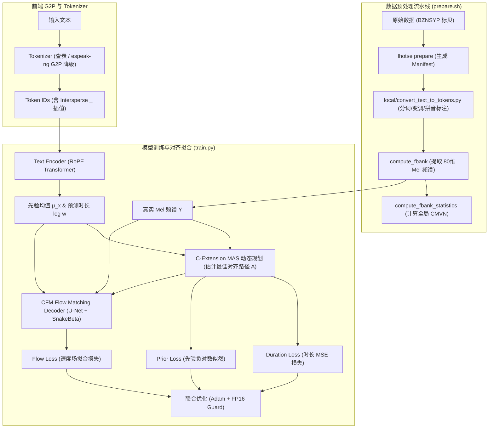

# 第 13 课：Matcha-TTS 训练全流程与工程实战

> **核心问题**：在上一课中，我们掌握了神经语音合成（TTS）的理论演进、声码器及算法基石。但在实际工业落地中，如何将文本和音频转化为可训练的特征？如何实现高效的端到端单调对齐（MAS）与流匹配（Flow Matching）训练？如何处理中英双语 Code-Switching 与多音字？本课将深入 `icefall` 官方 Matcha-TTS 架构代码，手把手剖析从数据预处理 `prepare.sh` 到深度训练 `train.py` 的全流程细节与工程 Tricks。
> **工程锚点**：基于 `egs/baker_zh/TTS` 方案，结合 Lhotse 预处理、C-Extension 动态规划对齐加速、SnakeBeta 激活函数以及 FP16 动态保护策略，构建适合边缘端与服务器端部署的高性能轻量 TTS 引擎。

---

## 一、Matcha-TTS 训练全流程概览

Matcha-TTS 是基于 **Conditional Flow Matching (CFM)** 与 **Monotonic Alignment Search (MAS)** 的轻量级非自回归 TTS 模型。



---

## 二、数据准备与 Lhotse 预处理实战 (`prepare.sh`)

### 2.1 预处理流水线分步详解

`prepare.sh` 控制整个数据流水线的执行逻辑：

1. **Stage -1 (编译 C-Extension 单调对齐库)**：
   编译 `matcha/monotonic_align` 中的 C/Cython 拓展模块。在每步训练中，GPU 计算 Log-Likelihood 矩阵后，送到 CPU 端由 C 语言加速实现 Viterbi 动态规划，寻找最佳单调对齐路径。
2. **Stage 0 & 1 (Lhotse Manifest 生成)**：
   调用 `lhotse prepare baker-zh` 读取音频路径与文本，生成 Lhotse 规范的 `recordings.jsonl.gz` 与 `supervisions.jsonl.gz`。
3. **Stage 2 (词表生成 `generate_tokens.py`)**：
   生成包含所有声调拼音、符号、Blank 及 Padding 的 `tokens.txt` 词表。
4. **Stage 3 & 4 (文本正则化与音素挂载)**：
   调用 `local/convert_text_to_tokens.py`，使用 `jieba` 分词、自定义多音字词典（如“银行行长” $\to$ `yin2 hang2 hang2 zhang3`）以及 `pypinyin` 转换，将标注文本转化为带声调拼音序列并挂载到 Lhotse CutSet 的 `c.tokens` 字段。
5. **Stage 5 (特征提取与持久化)**：
   运行 `compute_fbank_baker_zh.py` 提取 80 维 Mel-spectrogram（采样率 22.5kHz, n_fft=1024, win_length=1024, hop_length=256, f_min=0, f_max=8000），使用 Lhotse 的二进制高压缩格式 `LilcomChunkyWriter` 写盘。
6. **Stage 6 & 7 (数据集切分与全局 CMVN 计算)**：
   切分训练集（9400条）、验证集（100条）和测试集（500条）；运行 `compute_fbank_statistics.py` 计算全训练集的全局特征均值 `fbank_mean` 与标准差 `fbank_std`，写入 `cmvn.json`。

### 2.2 澄清：TTS 与 ASR 在数据增强上的本质区别

> [!IMPORTANT]
> **关键思考**：为什么在 ASR 中常用的 Speed Perturb（速度扰动）、Musan 混响加噪、SpecAugment 频域遮蔽，在 TTS 预处理中**完全不使用**？

* **为什么不做 Speed Perturb (速度扰动)**：
  变更播放速度（如 0.9x / 1.1x）会改变音频的基频（Pitch）与声道共振峰（Formant）。若在训练集中使用速度扰动，相同文本音素会对应多种非线性畸变的 Mel 频谱，破坏模型对特定说话人音色（Speaker Identity）与共振峰包络的精确建模。
* **为什么不做 Noise / Reverb Augment (加噪与混响)**：
  ASR 的目标是**识别**（希望模型对噪声鲁棒）；而 TTS 的目标是**生成高品质无噪波形**。如果在训练集引入噪声与混响，声学模型会学习生成带噪的 Mel 频谱，导致合成的声音伴有沙沙杂音或房间回声。
* **为什么不做 SpecAugment (频谱掩蔽)**：
  TTS 要求完全重建连续、健康的 Mel 频谱，遮蔽频域/时域块会导致生成目标出现缺失空洞，导致训练 Loss 无法收敛。

### 2.3 Lhotse 在 TTS 中的真正价值

虽然 TTS 不做传统的声音信号增强，但 Lhotse 依然为 Matcha-TTS 带来了极大的工程提升：
1. **Dynamic Bucketing Sampler（动态分桶采样）**：按 Cut 时长分配至 30 个桶，同一桶内音频长度极其接近，最大程度减少了 Batch 内的无效 Padding。
2. **On-The-Fly Feature Extraction（在线特征提取）**：在 `tts_datamodule.py` 中可选开启 `on-the-fly-feats`，跳过离线写盘，在 DataLoader worker 中动态计算 Mel 频谱。
3. **Lazy Manifest 加载**：通过 JSONL.GZ 延迟加载海量数据，显著降低主进程内存开销。

---

## 三、前端 G2P、Token 词表与多语言/音素策略

### 3.1 `tokens.txt` 编码策略对比

在 `sherpa-onnx` / `icefall` 官方发布的模型中，存在两种不同的词表编码策略：

| 维度 | `matcha-icefall-zh-baker` 词表 | `matcha-icefall-zh-en` 双语词表 |
|---|---|---|
| **轻声/无调拼音** | 无数字后缀，如 `ni` (ID 1114) | 统一带数字 `5` 后缀，如 `ni5` (ID 1220) |
| **声调覆盖** | `ni`, `ni1`, `ni2`, `ni3`, `ni4` | `ni1`, `ni2`, `ni3`, `ni4`, `ni5` |
| **音素扩展** | 仅支持拼音 + 基础标点符号 (共 2070 个 token) | 嵌入完整的 **IPA 国际音标** 符号（如 `æ`, `ɪ`, `θ`, `ð`, `ʃ`, `ˈ`, `ː` 等，共 2191 个 token） |
| **优势与应用** | 单中文纯净表达，匹配 Baker 数据集规范 | 格式结构规整（所有拼音均带 1-5 数字），且具备中英混合合成能力 |

### 3.2 中英文混合 G2P 机制与降级逻辑

`matcha-icefall-zh-en` 能够同时合成中文与英文（Code-Switching），其核心在于 [tokenizer.py](file:///home/u/source/open_source/icefall/egs/baker_zh/TTS/matcha/tokenizer.py) 的分支处理：

```python
# Tokenizer 处理句子时的路由逻辑 (tokenizer.py)
for word in sentence:
    if word in self.token2id:
        # 1. 中文拼音 (如 'ni3', 'hao3') 命中词表，直接转为 Token ID
        tokens_list.append(word)
        continue

    # 2. 英文单词或 OOV 未登录词，调用 espeak-ng 进行 G2P 转换
    tmp_tokens_list = phonemize_espeak(word, lang="en-us")
    for t in tmp_tokens_list:
        tokens_list.extend(t) # 展开为 IPA 音素，如 ['h', 'ə', 'l', 'ˈ', 'oʊ']
```

1. **中文路径**：经过 `local/convert_text_to_tokens.py` 转换后的带声调拼音（如 `ni3`）直接查表映射。
2. **英文/未登录词路径**：当传入英文单词（如 `"Hello"`）时，由于不在拼音词表中，自动降级调用底层 G2P 引擎 **`espeak-ng`** (`piper_phonemize`)，将其转换为 IPA 音素序列（如 `/h ə l ˈ oʊ/`）。由于双语 `tokens.txt` 包含了全套 IPA 字符，IPA 音素能够无缝映射为 Token ID。

### 3.3 业界主流标注/G2P 方式对比

| 标注/G2P 方式 | 代表系统 | 形式示例 | 优势 (Pros) | 劣势 (Cons) |
|---|---|---|---|---|
| **IPA (国际音标)** | eSpeak-ng, Piper, VITS | `[h ə ˈ l oʊ]`, `[t ʂ ʰ ɨ ˥]` | **跨语言通用性极强**，英/德/法/日等多语言可统一在一个音素空间；能精确刻画长音 `ː` 与重音 `ˈ` | 中文转 IPA 规则复杂（声调与元音转换易生歧义）；依赖外部 G2P 库 |
| **拼音+声调数字 (Pinyin+Tone)** | `pypinyin`, DataBaker, icefall (`baker_zh`) | `ni3 hao3` 或 `n i3 h ao3` | **符合中文直觉**，易于手工标注与校对；结合 `jieba` / `pypinyin` 可轻松处理变调与词组多音字 | **缺乏跨语言能力**，难以表达外文；粒度较粗 |
| **注音符号 (Bopomofo)** | 台湾/繁体 TTS (如 `ㄅㄆㄇㄈ`) | `一 ㄧ 1`, `丁 ㄉ ㄧ ㄥ 1` | 在繁体中文及台湾语音习惯中匹配度极高；声韵调拆分规整 | 地域局限性强，大陆及海外通用度低；需专门映射表 |
| **Subword / BPE (无 G2P)** | VALL-E, Qwen3-TTS, CosyVoice, ChatTTS | 文本 Byte / Character / BPE Token | **彻底端到端**，无需繁琐的前端 G2P 规则和多音字词典；依靠大模型自适应推断 | 模型参数量巨大（1B+），不适合边缘端小模型；存在**发音幻觉**与错读漏字风险 |

---

## 四、模型训练与对齐拟合流水线 (`train.py`)

### 4.1 输入标准化与 Intersperse Blank

在每步训练前，数据在 `prepare_input` 中完成处理：
1. **Mel 谱归一化**：$Y_{\text{norm}} = (Y - \text{mel\_mean}) / \text{mel\_std}$。
2. **Intersperse Blank 插值**：在音素 Token ID 之间交错插入 Padding 符号 `_`（如 `[ID_ni3, ID_hao3]` $\to$ `[ID__, ID_ni3, ID__, ID_hao3, ID__]`）。

### 4.2 单调对齐搜索 (MAS, Monotonic Alignment Search) 原理

Matcha-TTS 不需要外部预先对齐的文本-语音时间戳。在训练过程中，模型自动求解高斯分布下的最大似然单调对齐路径 $A \in \{0, 1\}^{T_{\text{text}} \times T_{\text{mel}}}$。

```python
# MatchaTTS.forward 中的 MAS 计算过程 (models/matcha_tts.py)
with torch.no_grad():
    const = -0.5 * math.log(2 * math.pi) * self.n_feats
    factor = -0.5 * torch.ones(mu_x.shape, dtype=mu_x.dtype, device=mu_x.device)
    
    # 1. 计算文本 Encoder 均值 mu_x 与真实 Mel 谱 y 之间的 Log-Likelihood 似然矩阵
    y_square = torch.matmul(factor.transpose(1, 2), y**2)
    y_mu_double = torch.matmul(2.0 * (factor * mu_x).transpose(1, 2), y)
    mu_square = torch.sum(factor * (mu_x**2), 1).unsqueeze(-1)
    log_prior = y_square - y_mu_double + mu_square + const

    # 2. 调用 C 扩展执行单调对齐 Viterbi 动态规划搜索
    attn = monotonic_align.maximum_path(log_prior, attn_mask.squeeze(1))
    attn = attn.detach()  # 得到 shape: (batch, T_text, T_mel) 的硬对齐矩阵
```

### 4.3 三大 Loss 的数学推导与联合优化

Matcha-TTS 在训练时将三个损失函数相加进行端到端联合梯度更新：

$$\mathcal{L}_{\text{total}} = \mathcal{L}_{\text{dur}} + \mathcal{L}_{\text{prior}} + \mathcal{L}_{\text{diff}}$$

1. **Duration Loss ($\mathcal{L}_{\text{dur}}$)**：
   衡量 Duration Predictor 预测的对数时长 $\log w$ 与 MAS 搜索出的实际对齐时长 $\log w_{\text{MAS}}$ 之间的 MSE 误差：
   $$\mathcal{L}_{\text{dur}} = \frac{1}{N} \sum_{i=1}^N \left( \log w_i - \log \sum_{j} A_{i,j} \right)^2$$
2. **Prior Loss ($\mathcal{L}_{\text{prior}}$)**：
   对齐后的文本先验均值 $\mu_y = A^T \mu_x$ 与真实归一化 Mel 谱 $Y$ 之间的负对数似然损失：
   $$\mathcal{L}_{\text{prior}} = \frac{1}{2 T \cdot D} \sum_{t=1}^T \| Y_t - \mu_{y,t} \|^2$$
3. **Conditional Flow Matching Loss ($\mathcal{L}_{\text{diff}}$)**：
   连续流匹配损失。采样时间 $t \sim U(0, 1)$ 及标准正态噪声 $x_0 \sim \mathcal{N}(0, I)$，定义线性概率路径 $x_t = t Y + (1 - (1 - \sigma_{\text{min}})t) \mu_y$，目标是预测速度场 $v_t = \frac{d x_t}{d t} = Y - (1 - \sigma_{\text{min}})\mu_y$：
   $$\mathcal{L}_{\text{diff}} = \mathbb{E}_{t, x_0, Y} \left\| u_t(x_t \mid \mu_y) - v_{\theta}(x_t, t, \mu_y) \right\|^2$$

---

## 五、工程 Tricks 与架构亮点

### 5.1 Dynamic Bucketing Sampler 显存优化

TTS 中句子长度差异可达 10 倍以上。传统的固化 Batch 打包会导致短句产生大量的 Zero-Padding。使用 Lhotse 的 `DynamicBucketingSampler` 将训练 Cut 按时长划分到 30 个 Bucket 中：

```
桶 1 (1~2秒): [Cut1, Cut5, Cut9, ...]   --> 组装 Batch, 几乎无 Padding
桶 2 (4~5秒): [Cut3, Cut7, Cut12, ...]  --> 组装 Batch, 几乎无 Padding
```
显著降低显存开销，使得单卡 GPU 上可以设置 `max_duration=1200` 秒，整体训练速度提升 2~3 倍。

### 5.2 SnakeBeta 周期性激活函数

在 CFM Decoder 的 U-Net 块中，Matcha 采用了 **SnakeBeta** 激活函数：

$$x + \frac{1}{\beta} \sin^2(\alpha x)$$

> **原理**：传统 `ReLU` / `GELU` 激活函数在频域拟合连续波形和谐波结构时容易丢失高频周期信息；`SnakeBeta` 具备可学习的频域周期连续性，能大幅提升流匹配模型生成 Mel 频谱在频带细节与高频谐波上的平滑度与真实感。

### 5.3 训练稳定性防御与 FP16 自定义 GradScaler Guard

混合精度（FP16）训练在流匹配与 ODE 计算时极易发生梯度下溢或 NaN。`train.py` 中实现了自定义的防御策略：

```python
# train.py 中的 GradScaler 动态 Guard
if params.batch_idx_train % 100 == 0 and params.use_fp16:
    cur_grad_scale = scaler._scale.item()
    if cur_grad_scale < 8.0 or (cur_grad_scale < 32.0 and params.batch_idx_train % 400 == 0):
        scaler.update(cur_grad_scale * 2.0)
    if cur_grad_scale < 0.01:
        if not saved_bad_model:
            save_bad_model(suffix="-first-warning") # 自动备份危险现场
            saved_bad_model = True
    if cur_grad_scale < 1.0e-05:
        save_bad_model()
        raise RuntimeError(f"grad_scale is too small, exiting: {cur_grad_scale}")
```
一旦检测到梯度 Scale 跌破 `1e-5`，立即触发崩溃前现场参数自动保存（`bad-model.pt`），防止异常梯度污染之前已保存的高质量 Checkpoint。

### 5.4 维度对齐与补齐 (`fix_len_compatibility`)

由于 CFM Decoder 内部的 U-Net 包含多级下采样（Downsampling）与上采样（Upsampling），输入的 Mel 帧数必须能被 2 的 $N$ 次率整除。代码中使用 `fix_len_compatibility` 对特征长度做动态补齐：

```python
max_feature_length = fix_len_compatibility(features.shape[1])
if max_feature_length > features.shape[1]:
    pad = max_feature_length - features.shape[1]
    features = torch.nn.functional.pad(features, (0, 0, 0, pad))
```
规避了 U-Net 维度下采样时由于奇数长度导致的维数不匹配崩溃。

### 5.5 声学模型微调与通用 Vocoder 复用部署

在实际工程中添加新音色时，**无需重新训练声码器 Vocoder**：
1. **解耦特性**：声码器（如 `vocos-16khz-univ.onnx`）是 **Speaker-Agnostic** 的通用 Mel-to-Wave 还原引擎；而音色、发音习惯与语速完全由声学模型 Matcha-TTS 决定。
2. **微调流程**：
   * 收集目标说话人 15~30 分钟清晰 16kHz WAV 音频及标注。
   * 冻结 Matcha-TTS 的 Text Encoder，仅微调 Speaker Embedding 与 CFM Decoder 模块。
   * 导出全新的 `model-new-voice.onnx`，直接搭配通用的 `vocos-16khz-univ.onnx` 部署即可输出新音色。

---

## 六、实践环节

### 实验 1：模拟 MAS 单调对齐搜索与 Duration 提取

```python
import torch
import numpy as np

# 模拟输入: Text 长度 4 (如 'ni', 'hao', 'shijie'), Mel 帧数 10
T_text, T_mel = 4, 10
np.random.seed(42)

# 模拟得到的 Log-Likelihood 似然矩阵 (矩阵越大代表越匹配)
log_prior = np.random.randn(T_text, T_mel)

# 极简 DP 求解最大单调路径
path = np.zeros((T_text, T_mel))
i, j = 0, 0
path[i, j] = 1
while i < T_text - 1 or j < T_mel - 1:
    if i == T_text - 1:
        j += 1
    elif j == T_mel - 1:
        i += 1
    else:
        # 向右或右下移动
        if log_prior[i, j+1] > log_prior[i+1, j+1]:
            j += 1
        else:
            i += 1
            j += 1
    path[i, j] = 1

# 从对齐路径计算每一个音素的 Duration
durations = path.sum(axis=1)
print("估计的单调对齐路径矩阵 Path Shape:", path.shape)
print("从路径提取的音素 Duration (帧数):", durations)
print("总帧数校验:", durations.sum(), "== T_mel:", T_mel)
```

---

## 七、关键术语速查

| 术语 | 一句话定义 |
|---|---|
| **MAS (Monotonic Alignment Search)** | 单调对齐搜索算法——利用动态规划在无标注情况下搜索文本与 Mel 谱的最大似然对应关系 |
| **CFM (Conditional Flow Matching)** | 条件流匹配——学习连续概率流场的生成模型，比传统 Diffusion 采样步骤更少、速度更快 |
| **Intersperse Blank** | 音素交错插值——在音素序列间插入 `_` 符号，赋予模型自适应音素间停顿建模能力 |
| **Dynamic Bucketing** | 动态分桶——按音频时长打包 Batch，极大节省 TTS Padding 显存开销 |
| **SnakeBeta** | 具备频域周期连续性的可学习激活函数，显著提升波形与谐波重建质量 |
| **espeak-ng G2P** | 开源文本转音素引擎，当英文单词或 OOV 未登录词不在拼音词表中时作为降级处理方案 |

---

## 八、下一步

### 推荐阅读

1. **Mehta et al. (2024)** — *Matcha-TTS: A Fast TTS Architecture with Conditional Flow Matching* (Matcha 论文)
2. **Kim et al. (2020)** — *Glow-TTS: A Generative Flow for Text-to-Speech via Monotonic Alignment Search* (MAS 算法出处)
3. **`icefall` 官方源码** — `egs/baker_zh/TTS/matcha/train.py` 及 `models/matcha_tts.py`

### 下节预告

[**第 14 课：ROS 2 智能语音节点架构与实战**](../第_14_课：ROS_2智能语音节点架构与实战.md) — 探讨如何在 ROS 2 节点中整合 ASR、NLU、Matcha/Kokoro TTS，并实现基于 `tee_playback` 的打断（Barge-in）与状态机管理。
