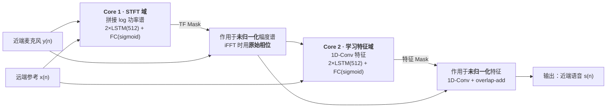

# Acoustic echo cancellation with the dual-signal transformation LSTM network

> **论文**: arXiv:2010.14337（2020-10-27 提交），发表于 **ICASSP 2021**
> **作者**: Nils L. Westhausen, Bernd T. Meyer（University of Oldenburg，Hearing4all 卓越集群）
> **PDF**: [articles/2010.14337.pdf](articles/2010.14337.pdf)
> **前作**: DTLN 降噪版 arXiv:2005.07551（同一作者，DNS-Challenge @ Interspeech 2020）
> **官方实现**: https://github.com/breizhn/DTLN

---

## 核心论点（Key Thesis）

DTLN 原本是为**降噪**设计的双信号变换结构（DNS-Challenge 参赛作品）。本文把它迁移到**声学回声消除（AEC）**，关键改动是把**远端参考信号 `x(n)` 注入每一个处理块**，得到一个**因果、帧级实时、单模型**的端到端 AEC 系统。

真正的意义不在架构创新，而在于**换掉了传统 AEC 的解题框架**：

传统方案用自适应滤波（NLMS）估计"扬声器→麦克风"的冲激响应，再用估计信号减去回声。它有一个根本困境——**双讲（double-talk）时近端语音会污染滤波器更新，导致发散**，所以必须配一个双讲检测器（DTD）来暂停自适应。而 DTD 本身又会误判、漏判。

本文的做法是**把 AEC 当作音频源分离问题**来学：

```
y(n) = s(n) + v(n) + d(n)
       ↑       ↑     ↑
    近端语音  近端噪声  回声（= x(n) * h(n)）
```

目标是从 `y(n)` 中分离出 `s(n)`，其余全部去掉。这一步绕开了 DTD：不需要判断"现在是单讲还是双讲"，模型直接从数据里学。

**代价是这个任务比降噪更难**——论文明说：

> it is not only separating speech from noise, but **separating speech from speech**, which can be a more challenging task - especially when voices have similar characteristics.

---

## 模型架构：为什么叫"双信号变换"

核心设计是**两条并行处理路径，各自预测掩蔽（mask）**，从而同时利用时频域和时域的表示能力：



**Core 1（STFT 域）**

- 输入：近端与远端各自的 log 功率谱，**分别用 iLN 归一化**后拼接
- 输出：时频 mask，作用于近端的**未归一化**幅度谱
- 重建：iFFT，**相位直接取原近端信号**

**Core 2（学习特征域）**

- 输入：Core 1 输出的学习特征 + 远端的**学习特征**
- 两者用**同一个 1D-Conv 权重**变换（保证特征空间一致），但归一化各自独立（iLN 提供独立的 scale/bias）
- 输出：mask，作用于 Core 1 的未归一化特征
- 重建：1D-Conv 回时域 + overlap-add

**两个关键设计选择**：

| 设计 | 作用 |
|---|---|
| **iLN（instant layer normalization）** | 逐帧归一化、**不累积时间统计**。用于吸收输入电平的大幅波动（近场/远场切换、距离变化） |
| **归一化与掩蔽解耦** | mask 作用在**未归一化**的幅度/特征上，避免把归一化的增益变化掺进输出 |

**相对原 DTLN 的扩展**：远端信号被喂给**每一个** block（Core 1 和 Core 2 都拿到）。论文提到这与 [3]（Zhang & Wang 2018）思路相似，**关键区别是用因果 LSTM 而非 acausal BLSTM**——这是能做到实时的前提。

**超参数**：

| 项 | 值 |
|---|---|
| 帧长 / 帧移 | 32 ms / **8 ms** |
| FFT size / 特征维度 | 512 / 512 |
| 每层 LSTM 单元数 | 512（另有 128、256 对照） |
| 总参数量 | **10.4M**（512）/ 3.9M（256）/ 1.8M（128） |

---

## 训练配置

**数据规模：60 h**（48 h 训练 / 12 h 验证），全部**在线生成**，不使用固定的样本组合。

| 成分 | 来源与规模 |
|---|---|
| far-end / echo | Challenge 提供 ~32 h + 28 h 多语言语音卷积随机 IR |
| near-end 语音 | 多语言语料 120 h（法/意/中/英/俄/西各 20 h，**德语因质量差被剔除**） |
| 噪声 | ~140 h（噪声语料 + MUSAN 器乐） |
| IR（冲激响应） | 真实录制 + image method 仿真；每条 IR 的**直射路径对齐到位置 0** |

**数据增强细节**（这部分是论文的主要工作量所在）：

- IR 随机缩放：相对首样本 **-25 ~ 0 dB**
- 远端信号**延迟 10–100 ms** —— 模拟处理与传输链路延迟
- **带通滤波**：低切 100–400 Hz、高切 6000–7500 Hz —— 显式模拟"内置扬声器的劣质低频响应"
- 50% 概率给远端加噪（SNR ~ N(5, 10) dB）
- 70% 概率给近端加噪，外加随机频谱整形
- 5% 概率构造**纯远端场景**（近端语音段随机丢弃）
- 90% 概率叠加回声（SER ~ N(0, 10) dB；不叠加时远端置零或降到 -70~-120 dB RMS）
- 全局随机增益 -25 ~ 0 dB（相对削波点）

**损失函数**：**时域 SNR-loss**（Kavalerov et al. 2019）

选它的两个理由值得记住：

1. **尺度相关（scale-dependent）**——对实时应用有利，不需要额外做尺度对齐
2. **在时域计算 → 隐式包含相位信息**，不必显式建模相位

**优化**：Adam，100 epochs，初始 lr = 2e-4 / 5e-4 / 1e-3（对应 512 / 256 / 128 单元），每 2 个 epoch 乘 0.98；梯度范数裁剪 3；batch 16；样本长 4 s；LSTM 层间 **25% dropout**。

---

## 关键结果

### 客观指标（双讲测试集，Table 1）

| 方法 | 参数量 | clean<br>PESQ / SI-SDR | far-end noisy<br>PESQ / SI-SDR | near-end noisy<br>PESQ / SI-SDR | both noisy<br>PESQ / SI-SDR |
|---|---|---|---|---|---|
| 未处理 | — | 2.05 / 0.01 | 1.95 / -0.88 | 1.77 / -1.58 | 1.68 / -2.35 |
| Baseline（4×LSTM） | 8.5M | 2.66 / 13.02 | 2.55 / 12.20 | 2.34 / 11.01 | 2.31 / 10.29 |
| DTLN-aec | **1.8M** | 2.57 / 12.00 | 2.49 / 11.66 | 2.29 / 10.81 | 2.27 / 10.09 |
| DTLN-aec | **3.9M** | 2.68 / 13.34 | 2.60 / 12.65 | 2.38 / 11.69 | 2.34 / 11.01 |
| DTLN-aec | **10.4M** | **2.81 / 14.15** | **2.75 / 13.59** | **2.53 / 12.59** | **2.46 / 11.83** |

**三条工程结论**：

1. **3.9M（256 单元）就超过 8.5M 的 baseline** —— 用不到它一半的参数打赢
2. **1.8M（128 单元）已能显著改善** —— 端侧资源受限时的可行档位
3. **验证了 stacked 架构优于同构堆叠** —— baseline 是 4 层连续 LSTM + TF mask（输入与 DTLN 的 Core 1 相同），8.5M 参数却不如 3.9M 的双阶段结构

10.4M 模型的平均改善：**SI-SDR +14.24 dB**、**PESQ +0.78 MOS**。

### 主观指标（盲测集，ITU P.808 / P.831）

| 方法 | ST-NE clean/noisy | ST-FE clean/noisy | DT-Echo clean/noisy | DT-other clean/noisy |
|---|---|---|---|---|
| Baseline | 3.99 / 3.58 | 4.09 / 3.58 | 3.89 / 3.78 | 3.33 / 3.23 |
| **DTLN-aec** | 3.98 / **3.68** | **4.46** / **3.83** | **4.34** / **4.00** | **3.86** / **3.68** |

置信区间 ±0.02。**除 ST-NE 的 clean 条件外，DTLN-aec 全面优于 baseline。**

- clean 子集平均 **+0.34 MOS**，noisy 子集平均 **+0.26 MOS**（摘要概括为 +0.30）
- 提升最大的是 **DT-Echo**：3.89 → 4.34（clean），+0.45
- ST-NE clean 条件持平（3.98 vs 3.99）说明两者对无噪声无回声的干净近端语音损害都极小——这是及格线，不是亮点

---

## 实时性与工程参数

AEC-Challenge 的硬性约束：**单帧处理时间 < 帧移（8 ms）**。

用 **TensorFlow Lite** 实测 512 单元版本：

| 平台 | 单帧耗时 | 余量 |
|---|---|---|
| i5-3320M（双核 2.6 GHz） | **3.06 ms** | 2.6× |
| i5-6600K（四核 3.5 GHz） | **0.97 ms** | 8.2× |

均满足约束。

---

## 局限（作者自述）

1. **多语言泛化未评估** —— Discussion 称"训练集只含英语语音样本"，因此跨语言泛化留待未来工作
2. **残留噪声** —— 部分条件处理后仍能听到残余噪声，建议叠加额外的降噪模块
3. **纯远端条件下有残留噪声** —— 建议引入 **VAD 门控**：检测到无近端语音时直接门控输出

### ⚠️ 一处内部不一致（引用时需注意）

论文 Methods 明确写道：

- near-end 使用 **120 h 多语言**语料（6 种语言各 20 h）
- far-end 的补充数据也用 **28 h 多语言**语音卷积 IR

但 Discussion 却说 *"The training set only contains English speech samples"*。两处相互矛盾，可能作者指的是 AEC-Challenge 提供的 32 h far-end/echo 数据（英文），或指 Table 1 的评估集。**因此不宜把"DTLN-aec 只训练过英语"当作定论。**

### 论文的定位

作者自己写明：

> Since it is unclear if this approach is beneficial for AEC, we apply the model in this context...

即这是一篇**验证性工作**——把已有架构迁移到新任务并验证其可行性，而非提出新架构。AEC-Challenge 的最终排名是**前五**（论文原话 "among the top five models"）。

---

## 与本项目的对照

> 对照基线：机器人语音交互系统现状——XVF3800（XMOS）硬件 AEC + GTCRN 降噪 + AFE 前端。

### 架构路线差异

| 维度 | 传统自适应滤波（XVF3800 路线） | DTLN-aec（神经网络路线） |
|---|---|---|
| **双讲处理** | 滤波器发散 → 必须靠 DTD 暂停自适应 | 端到端学习，**不需要 DTD** |
| **非线性失真** | 线性假设，需 Volterra 等扩展 | 数据驱动，训练集已含非线性场景 |
| **房间响应变化** | **持续在线跟踪** | 只覆盖训练分布内的变化 |
| **多麦 / 空间信息** | 可用（波束成形） | **单通道，不可用** |
| **可解释性** | 高（可检视冲激响应） | 低 |
| **计算形态** | 极低（DSP 上跑） | 需神经网络推理（但 3.9M 很小） |

### 可直接迁移的工程点

1. **带通滤波增强（最贴合本场景）**
   用 100–400 Hz 低切 + 6000–7500 Hz 高切模拟"劣质内置扬声器"。机器人自身的腔体扬声器普遍低频响应差、频响不平坦——这条增强直接对应真实部署条件，训练任何 AEC/降噪模型时都值得复制。

2. **链路延迟建模**
   训练时对远端参考信号施加 **10–100 ms 随机延迟**，模拟处理与传输延迟。机器人音频链路跨 ROS 2 多节点 + 多重缓冲，延迟本身就不稳定，这条增强比固定延迟更贴近现实。

3. **iLN（instant layer normalization）**
   逐帧归一化、不累积时间统计，专门吸收电平波动。远场机器人场景下说话人距离变化会导致电平大幅跳动，这个正则化技巧比常规层归一化更合适。

4. **时域损失 + 尺度相关**
   SNR-loss 在时域计算（隐式含相位），且尺度相关（实时场景友好）。做任何时域语音增强时，这比频域幅度损失少一层相位处理的麻烦。

5. **参数量拐点：3.9M**
   256 单元（3.9M）用不到 baseline 一半的参数打赢它，是性价比拐点。端侧选型时优先试这一档，而不是直接上 10.4M。

### 若考虑在 Jetson 上做软件 AEC

**可行性**：512 单元 TFLite 版在 x86 双核上是 3.06 ms/帧（8 ms 帧移），Jetson Orin 的算力足以覆盖；3.9M 版本余量更大。

**但要看清定位**：

- **不能替代 XVF3800 的空间处理能力** —— DTLN-aec 是单通道，丢掉了麦克风阵列的波束成形信息，而阵列对"远端方向抑制 + 近端方向增强"是免费的强先验
- **更现实的定位是与硬件 AEC 互补的二级处理**：硬件 AEC 处理线性回声（它擅长且成本极低），神经网络处理残留的非线性回声与降噪
- **注意与 GTCRN 的分工重叠**：DTLN-aec 本身**同时做 AEC + 降噪**（它的 Core 1 就是 DTLN 降噪结构），若直接串联，会与现有 GTCRN 降噪功能重叠。上线前需要明确是"替换"还是"分工"，并实测串联后的总体收益（两级降噪容易引入过度抑制与语音损伤）

**最值得先做的低成本实验**：把上面第 1、2 条增强（扬声器频响带通 + 链路延迟建模）搬到你现有的训练管线里，只改数据增强、不改模型。这是零架构风险的改动，收益却直接作用于部署条件匹配度。

---

## 关键数字速查

| 项 | 值 |
|---|---|
| 帧长 / 帧移 | 32 ms / 8 ms |
| FFT size / 特征维度 | 512 / 512 |
| 每层 LSTM 单元 | 128 / 256 / 512 |
| 参数量 | **1.8M / 3.9M / 10.4M** |
| LSTM 层数 | 每 core 2 层，层间 25% dropout |
| 训练 / 验证数据 | 48 h / 12 h（合计 60 h） |
| 损失函数 | 时域 SNR-loss |
| 训练轮次 | 100 epochs（Adam） |
| 单帧时延 | 3.06 ms（双核 2.6 GHz）/ **0.97 ms（四核 3.5 GHz）** |
| 平均改善（512 单元） | SI-SDR **+14.24 dB**、PESQ **+0.78 MOS** |
| 主观 MOS 提升 | clean **+0.34**、noisy **+0.26** |
| Challenge 排名 | 前五 |

## 相关论文

- **DTLN（降噪，前作）**：arXiv:2005.07551 —— 本文的 Core 1 结构来源
- **AEC-Challenge**：arXiv:2009.04972 —— 数据集与评测框架（ITU P.808 / P.831）
- **DNS-Challenge**：arXiv:2005.13981 / arXiv:2009.06122
- 对比对象 DCCRN：arXiv:2008.00264（复数卷积循环网络，相位感知）
