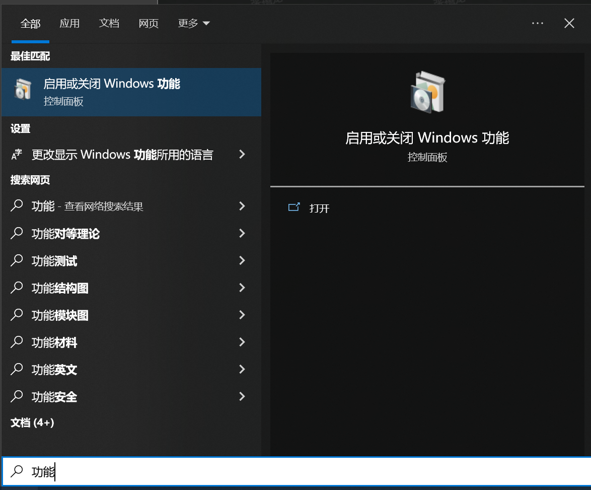
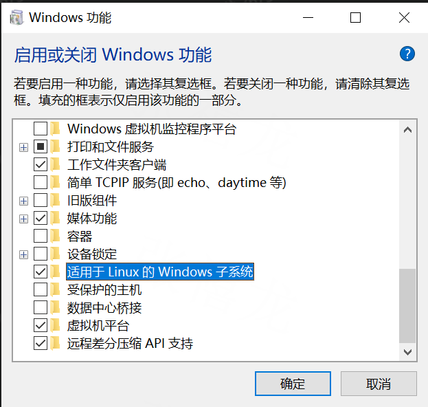

# CTS环境搭建

**注意事项：**

1. CTS需要能访问外网
2. Linux环境更加稳定

环境基于WSL(Windows Subsystem of Linux)搭建，C盘最好有大于20G的剩余空间

**安装WSL:**

1. 启用 Windows 的 “适用于 Linux 的 Windows 子系统” 功能，完成后需要重启电脑




2. 打开 MicroSoft Store，搜索 “Ubuntu”并安装、设置账号
3. 进入WSL后，先更新(重要)

```Bash
sudo apt update
sudo apt upgrade
```

4. 配置CTS需要的环境：
```Bash
sudo apt install aapt
sudo apt install default-jre
sudo apt install default-jdk
```

5. 在[官网](https://dl.google.com/android/repository/platform-tools_r34.0.3-linux.zip?hl=zh-cn)下载platform-tools压缩包(Linux版)到WSL中
需要注意不能直接在windows下解压缩，会由于用户权限问题无法正常使用，解压可以使用unzip

```Bash
进到压缩包的目录下，如：/mnt/c/Users/xilong.zhang/Downloads
sudo apt install unzip
unzip ./platform-tools_r34.0.3-linux.zip -d /home/u/
```

编辑~/.bashrc 并将 `export PATH=/home/u/platform-tools:$PATH` 添加到最后一行

执行 `source ~/.bashrc` 使path的更改立即生效

6. 下载CTS包
在 `\\10.150.98.90\01_软件工程部\技术协作部\GMS\1.GMS\01.Test_Suite\CTS` 下载GMS测试使用的CTS，通过上文一样的方法使用unzip解压到WSL中

如果没有想要使用的CTS包(比如Android U的)，可以自己编译/cts

直接整编CTS往往会直接失败，可以单独编译一个测试case，然后把编译产物替换到已有的CTS包中的对应位置

初始化编译环境可以使用`source tran_setenv.sh tssi_64_infinix user`

然后进入测试项的Android.bp对应目录`mm`编译 ~~`mmm CtsStrictJavaPackagesTestCases(自己想要编译使用的测试项)`~~

7. 测试前环境准备
https://online.mediatek.com/apps/quickstart/QS00017#QSS00138

> 1.手机写入SN number/IMEI number/BT/wifi mac地址
> 2.连接VPN wifi （高速稳定翻墙网络）
> 3.将手机的时间与PC时间调整一致
> 4.关闭工模下的MoMs(EngineerMode-->other-->MoMs-->Disable MoMs for CTS Test)
> 5.Setting language “English (United States)
> 6.Settings/display/font size,系统字体大小设置成normal
> 7.Settings/about phone/build number 点击多次，开启“开发者模式”
> 8.Settings/developer options/stay awake “on”
> 9.Settings/developer options/USB debugging “on”
> 10.Settings/developer options/Verify apps over USB “off”
> 11.Settings/security/screen lock “None”
> 12.测试CTS/CTS-ON-GSI 需要拷贝android-cts-media1.5文件

8. 开始测试
    1. 进入cts测试启动器目录`cd android-cts/tools/`
    2. 启动测试环境`./cts-tradefed`
    3. 运行测试 -m <module_name> -t <test_name>
    ```C++
    run cts -m CtsWifiTestCases -t android.net.wifi.cts.WifiNetworkSuggestionTest#testBuilderWithNonUnicodeSsid
    run cts -m CtsWifiTestCases -t android.net.wifi.cts.MultiStaConcurrencyMultiInternetWifiNetworkTest#testConnectToSecondaryNetworkWhenConnectedToInternetNetworkDBS
    ```
    5. 需要注意跑某些测试项的时候需要特殊环境，比如说CtsWifiTestCases需要附近有两个已保存的WiFi以及2.4GHz、5GHz的可搜索AP等等

---

**附注：**

如果在WSL中无法使用adb(`adb devices` 始终为空)

且`lsusb`返回`lsusb unable to initialize libusb: -99`，那么你的Windows和WSL子系统至少有一个的adb环境存在问题，要确保Windows和WSL子系统里都为adb(platform-tools)配置好PATH，然后在windows命令行中执行`wsl --shutdown`关闭WSL子系统，再重启并重试`adb devices`是否能映射USB。

wsl2需要单独配置usb转发，详见下方链接

https://learn.microsoft.com/zh-cn/windows/wsl/connect-usb#attach-a-usb-device

```PowerShell
PS C:\Users\xilong.zhang> usbipd list
Connected:
BUSID  VID:PID    DEVICE                                                        STATE
2-7    04f2:b6be  Integrated Camera, Integrated IR Camera, Camera DFU Device    Not shared
2-9    0e8d:201c  Infinix X6851B                                                Shared
2-10   8087:0032  英特尔(R) 无线 Bluetooth(R)                                   Not shared

Persisted:
GUID                                  DEVICE
7ffc2798-c297-4784-933f-58db82cf1d7b  Infinix NOTE 40 Pro 5G, ADB Interface
cc85f0a3-17b0-4c4f-9826-03faf214df1c  Infinix ZERO 30 5G

PS C:\Users\xilong.zhang> usbipd bind --busid 2-9
usbipd: info: Device with busid '2-9' was already shared.
PS C:\Users\xilong.zhang> usbipd attach --busid 2-9 --wsl
usbipd: info: Using WSL distribution 'Ubuntu' to attach; the device will be available in all WSL 2 distributions.
usbipd: info: Using IP address 172.18.208.1 to reach the host.
PS C:\Users\xilong.zhang> usbipd detach --busid 2-9
```

如果出现

```Plain
u@SHCYzhangxilong-pc:~$ adb devices
List of devices attached
104592534I000343        no permissions (missing udev rules? user is in the plugdev group);
see [http://developer.android.com/tools/device.html]
```

在WSL的`/etc/udev/rules.d/`下新建一个***.rules文件（需要root权限）

内容写上`SUBSYSTEM=="usb", ATTR{idVendor}=="``0e8d``", MODE="0666", GROUP="plugdev"`

```Bash
u@SHCYzhangxilong-pc:/etc/udev/rules.d$ sudo touch 51-android.rules
u@SHCYzhangxilong-pc:/etc/udev/rules.d$ ls
51-android.rules  70-snap.snapd.rules
u@SHCYzhangxilong-pc:/etc/udev/rules.d$ sudo vim 51-android.rules
u@SHCYzhangxilong-pc:/etc/udev/rules.d$ sudo chmod a+r /etc/udev/rules.d/51-android.rules
```