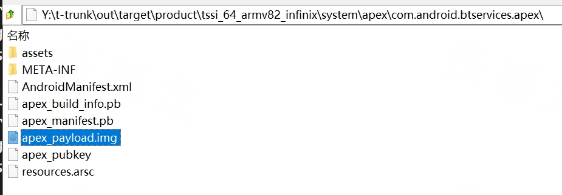
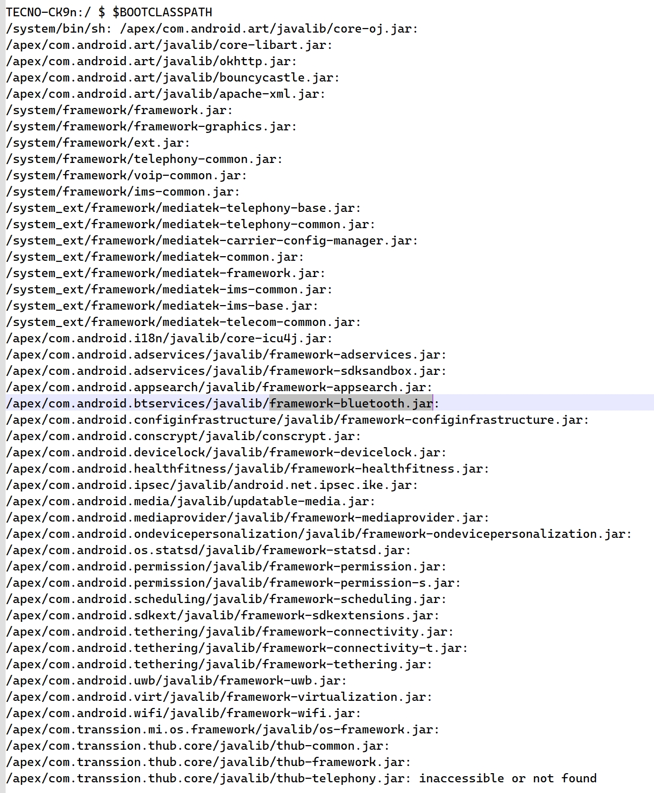
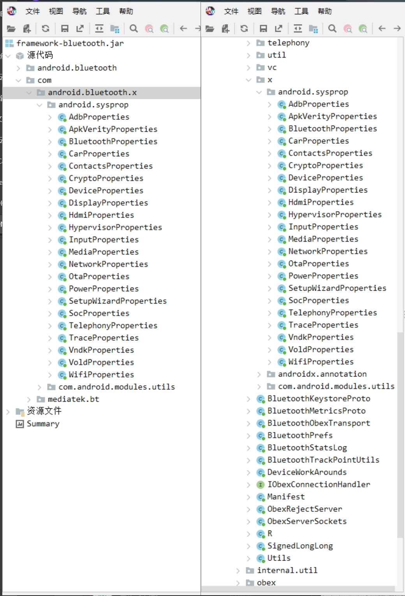

# CtsStrictJavaPackagesTestCases问题解决记录

## 问题背景

Fail Log:

```Prolog
06-13 09:44:46 I/ModuleListener: [1/1] 103112533V001825 android.compat.sjp.cts.StrictJavaPackagesTest#testApkInApex_nonClasspathClasses FAILURE: expected to be empty
but was: {/apex/com.android.btservices/app/Bluetooth/Bluetooth.apk=[
{/apex/com.android.btservices/javalib/framework-bluetooth.jar=[Lcom/android/bluetooth/x/android/sysprop/AdbProperties;, 
Lcom/android/bluetooth/x/android/sysprop/ApkVerityProperties;, 
Lcom/android/bluetooth/x/android/sysprop/BluetoothProperties;, 
Lcom/android/bluetooth/x/android/sysprop/CarProperties;, 
Lcom/android/bluetooth/x/android/sysprop/ContactsProperties;, 
Lcom/android/bluetooth/x/android/sysprop/CryptoProperties;, 
Lcom/android/bluetooth/x/android/sysprop/DeviceProperties;, 
Lcom/android/bluetooth/x/android/sysprop/DisplayProperties;, 
Lcom/android/bluetooth/x/android/sysprop/HdmiProperties;, 
Lcom/android/bluetooth/x/android/sysprop/HypervisorProperties;, 
Lcom/android/bluetooth/x/android/sysprop/InputProperties;, 
Lcom/android/bluetooth/x/android/sysprop/MediaProperties;, 
Lcom/android/bluetooth/x/android/sysprop/MemoryProperties;, 
Lcom/android/bluetooth/x/android/sysprop/NetworkProperties;, 
Lcom/android/bluetooth/x/android/sysprop/NfcProperties;, 
Lcom/android/bluetooth/x/android/sysprop/OtaProperties;, 
Lcom/android/bluetooth/x/android/sysprop/PowerProperties;, 
Lcom/android/bluetooth/x/android/sysprop/SetupWizardProperties;, 
Lcom/android/bluetooth/x/android/sysprop/SocProperties;, 
Lcom/android/bluetooth/x/android/sysprop/TelephonyProperties;, 
Lcom/android/bluetooth/x/android/sysprop/TraceProperties;, 
Lcom/android/bluetooth/x/android/sysprop/VndkProperties;, 
Lcom/android/bluetooth/x/android/sysprop/WifiProperties;]}
]}
at android.compat.sjp.cts.StrictJavaPackagesTest.testApkInApex_nonClasspathClasses(StrictJavaPackagesTest.java:974)
```

测试用例：

/cts/hostsidetests/appcompat/strictjavapackages/src/android/compat/sjp/cts/StrictJavaPackagesTest.java

fail原因貌似是蓝牙里包含了CLASSPATH中的包，而谷歌希望(蓝牙的)apex包中不包含重复类

  

## 分析com.android.btservices.apex包

解压apex包，里面的img承载了主要蓝牙业务内容

> apex_payload.img is an ext4 file system image backed by dm-verity. The image is mounted at runtime via a loop device. Specifically, the hash tree and metadata block are created using libavb. The file system payload isn't parsed (because the image should be mountable in place).




img再解压就是上面这样的目录，Bluetooth.apk在app里面，framework-bluetooth.jar在javalib里面

### 具体文件树

```Plain
PS **\com.android.btservices\apex_payload> tree . /f
**\COM.ANDROID.BTSERVICES\APEX_PAYLOAD
│  apex_manifest.pb
│
├─app
│  └─Bluetooth@UP1A.230423.001
│          Bluetooth.apk
│
├─etc
│  │  linker.config.pb
│  │
│  ├─bluetooth
│  │  │  bt_did.conf
│  │  │  bt_mtk_iot_list.conf
│  │  │  bt_stack.conf
│  │  │  interop_database.conf
│  │  │
│  │  └─le_audio
│  │          audio_set_configurations.bfbs
│  │          audio_set_configurations.json
│  │          audio_set_scenarios.bfbs
│  │          audio_set_scenarios.json
│  │
│  ├─classpaths
│  │      bootclasspath.pb
│  │      systemserverclasspath.pb
│  │
│  ├─compatconfig
│  │      bluetooth-compat-config.xml
│  │      bluetoothapk-platform-compat-config.xml
│  │      framework-bluetooth-compat-config.xml
│  │
│  └─permissions
│          privapp_allowlist_com.android.bluetooth.xml
│
├─javalib
│      framework-bluetooth.jar
│      service-bluetooth.jar
│
├─lib64
│      android.hardware.audio.common-V1-ndk.so
│      android.hardware.audio.common@5.0.so
│      android.hardware.bluetooth.audio-V3-ndk.so
│      android.hardware.bluetooth.audio@2.0.so
│      android.hardware.bluetooth.audio@2.1.so
│      android.hardware.bluetooth@1.0.so
│      android.hardware.bluetooth@1.1.so
│      android.hardware.common-V2-ndk.so
│      android.hardware.common.fmq-V1-ndk.so
│      android.hidl.safe_union@1.0.so
│      android.media.audio.common.types-V2-ndk.so
│      android.system.suspend-V1-ndk.so
│      libbase.so
│      libbluetooth_jni.so
│      libc++.so
│      libcrypto.so
│      libcutils.so
│      libfmq.so
│      libgrpc++.so
│      libgrpc_wrap.so
│      libhidlbase.so
│      liblhdc.so
│      liblhdcBT_enc.so
│      liblhdcv5.so
│      liblhdcv5BT_enc.so
│      libPlatformProperties.so
│      libssl.so
│      libstdc++.so
│      libtinyxml2.so
│      libutils.so
│      vendor.mediatek.hardware.bluetooth.audio-V1-ndk.so
│      vendor.mediatek.hardware.bluetooth.audio@2.1.so
│      vendor.mediatek.hardware.bluetooth.audio@2.2.so
│
└─lost+found
```

## 链接手机查看CLASSPATH



那么，按照Fail log来看，由于在CLASSPATH中，已经包含了framework-bluetooth.jar，而Bluetooth.apk中重复包含了framework-bluetooth.jar中的类，从而导致了这个测试case的Fail。

## 分别反编译Bluetooth.apk与framework-bluetooth.jar



可以看到确实有重复的类，而framework-bluetooth.jar中这些类来自于

**/packages/modules/Bluetooth/framework/Android.bp#93

```Plain
    permitted_packages: [
        "com.mediatek.bt",
        "android.bluetooth",
        // Created by jarjar rules.
        "com.android.bluetooth.x",
    ],
```

**/packages/modules/Bluetooth/framework/jarjar-rules.txt

```Plain
## used by service-bluetooth ##
rule androidx.annotation.** com.android.bluetooth.x.@0
rule com.android.modules.utils.** com.android.bluetooth.x.@0

# Use our statically linked PlatformProperties library
rule android.sysprop.** com.android.bluetooth.x.@0
```

而检索`android/sysprop`可以找到源码：

system/libsysprop/srcs/android/sysprop/

### Bluetooth.apk包中为什么会有这些类？

apk中的内容来自于Android.bp中的`android_app{}`项，但是要怎么从一大串依赖中找到源头呢？

（是["PlatformProperties",](**/packages/modules/Bluetooth/android/app/Android.bp#311)

正常问题处理流程应该去找Android.bp的提交记录（理论上确实可行，但是估计得排查好久😓）也可以直接就搜索 "prop" 定位到了答案，对比原生的(product/module/Bluetooth)bp脚本，确实多了这一项

但是，还是要了解一下“学院派”的解决流程：在前文中，我们已经找到了源码的位置system/libsysprop/srcs/android/sysprop/，实际上，我们只需要再往上级目录走，就能找到这个模块的`Android.bp`:

system/libsysprop/srcs/Android.bp:

```JSON
sysprop_library {
    name: "PlatformProperties",
    srcs: ["**/*.sysprop"],
    property_owner: "Platform",
    api_packages: ["android.sysprop"],

    apex_available: [
        "//apex_available:platform",
        "com.android.art",
        "com.android.art.debug",
        "com.android.btservices",
        "com.android.tethering",
        "com.android.virt",
    ],
    cpp: {
        min_sdk_version: "S",
    },
    vendor_available: true,
    host_supported: true,
}
```

这样也就找到了这个模块的`name: "PlatformProperties",`，而把蓝牙的`android_app{}`项中的这个注释掉之后，复测`run cts -m CtsStrictJavaPackagesTestCases`，确实就没问题了。

## 其他

### 蓝牙中不规范的bp内容

Android.bp写的都很不规范，建议重新梳理一下逻辑，避免出现这种难以排查的问题。

```Plain
    enforce_uses_libs: false,
```

这个不应该在生产环境用，只是临时解决问题时才用一下。

相应的修改应该在Android.bp里补上缺失的项：

```Plain
optional_uses_libs: [
    "androidx.window.extensions",
    "androidx.window.sidecar",
],
```

具体检查可以参考：aapt dump badging $APK | grep uses-library

https://blog.csdn.net/dongxianfei/article/details/123665498

谷歌也有文档说明，公司网络打不开也太蛋疼了，关键字是：**Dexpreopt 和 uses-library 检查**

Android.bp里还有很多多余的东西，至少这三项，完全没有被用到

```Plain
android_library_import {
    name: "os_calligraphy_bluetooth",
    aars: ["libs/calligraphy3-3.1.1.aar"],
    sdk_version: "module_current",
}

android_library_import {
    name: "os_viewpump_bluetooth",
    aars: ["libs/viewpump-1.0.0.aar"],
    sdk_version: "module_current",
}

java_import {
    name: "btkotlin",
    jars: ["libs/kotlin-stdlib-1.3.71.jar"],
    host_supported: true,
    sdk_version: "module_current",
}
```

这东西为什么也没被用到呀？？？？哦不对，这在其他编译脚本也是可见的，还需要继续排查一遍

```Plain
cc_library {
    name: "libbluetooth-core",
```

prebuilts/module_sdk/Bluetooth/current/Android.bp#94

```JSON
java_sdk_library_import {
    name: "framework-bluetooth",
    // Do not prefer prebuilt if the Soong config variable "source_build" in namespace "btservices_module" is true.
    use_source_config_var: {
        config_namespace: "btservices_module",
        var_name: "source_build",
    },
    visibility: ["//visibility:public"],
    apex_available: ["com.android.btservices"],
    licenses: ["btservices-module-sdk_Android-Apache-2.0"],
    shared_library: false,
    permitted_packages: [
        "android.bluetooth",
        "com.android.bluetooth.x",
    ],
    public: {
        jars: ["sdk_library/public/framework-bluetooth-stubs.jar"],
        stub_srcs: ["sdk_library/public/framework-bluetooth.srcjar"],
        current_api: "sdk_library/public/framework-bluetooth.txt",
        removed_api: "sdk_library/public/framework-bluetooth-removed.txt",
        annotations: "sdk_library/public/framework-bluetooth_annotations.zip",
        sdk_version: "module_current",
    },
    system: {
        jars: ["sdk_library/system/framework-bluetooth-stubs.jar"],
        stub_srcs: ["sdk_library/system/framework-bluetooth.srcjar"],
        current_api: "sdk_library/system/framework-bluetooth.txt",
        removed_api: "sdk_library/system/framework-bluetooth-removed.txt",
        annotations: "sdk_library/system/framework-bluetooth_annotations.zip",
        sdk_version: "module_current",
    },
    module_lib: {
        jars: ["sdk_library/module-lib/framework-bluetooth-stubs.jar"],
        stub_srcs: ["sdk_library/module-lib/framework-bluetooth.srcjar"],
        current_api: "sdk_library/module-lib/framework-bluetooth.txt",
        removed_api: "sdk_library/module-lib/framework-bluetooth-removed.txt",
        annotations: "sdk_library/module-lib/framework-bluetooth_annotations.zip",
        sdk_version: "module_current",
    },
}
```

### 关于这个问题为什么在T中没有出现过

`PlatformProperties`之前是有豁免(在白名单中)的，最近(28-Mar-2023)才在CTS中删除豁免，也是由于这个原因，我之前才想着查AOSP的git历史

cts/hostsidetests/appcompat/strictjavapackages/src/android/compat/sjp/cts/StrictJavaPackagesTest.java

### 关于如何自己编译CTS

直接整编CTS往往会直接失败，可以单独编译一个测试case，然后把编译产物替换到已有的CTS包中的对应位置

初始化编译环境可以使用`source tran_setenv.sh tssi_64_infinix user`

然后进入测试项的Android.bp对应目录`mm`编译 ~~然后~~~~`mmm CtsStrictJavaPackagesTestCases`~~
