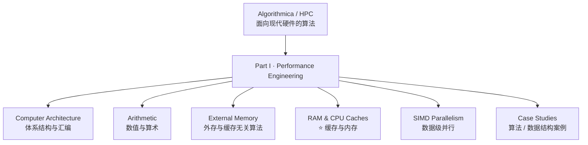

# Algorithmica《面向现代硬件的算法》：性能工程导读

> **本文性质**：探索性调研 + 阅读导读，为后续精读留出扩充位。写作契机是一则推荐帖（「Algorithmica 的 HPC 系列，是性能工程的一座宝藏，CPU 缓存部分尤其好」）。
>
> **来源**：主要内容抓取自官方站点 [en.algorithmica.org/hpc](https://en.algorithmica.org/hpc/)（含完整章节结构），并核对社区镜像/转换版本的存在性。
>
> 访问日期：2026-09-11。

---

## 1. 这是什么

**《Algorithms for Modern Hardware》**（面向现代硬件的算法），作者 **Sergey Slotin**，与同人共著 —— 来自 **Tinkoff Generation**（培养俄罗斯信息学奥林匹克约半数决赛选手的非营利教育组织）。

| 项目 | 情况 |
|------|------|
| 形态 | 开放获取的在线书（web book），源码托管在 GitHub，代码在独立仓库 |
| 站点 | `en.algorithmica.org/hpc/`（另有俄文版；社区有读者自行转换的 PDF/EPUB 离线版） |
| 完成度 | 第一部分 *Performance Engineering* 截至 2022-03 约完成 75%，作者按部就班推进 |
| 目标读者 | 性能工程师、实用算法研究者，以及**刚学完高级算法课、想知道"除了把 O(n log n) 降到 O(n log log n) 还能怎么让程序更快"的本科生** |

**它讲的不是算法复杂度，而是「算法/程序跑在真实硬件上会发生什么」。** 作者要解决的问题是：教科书里的复杂度分析严重脱离现实——同一份操作计数，在真实 CPU 上可能差几十倍。

---

## 2. 为什么值得读（方法论价值）

网上的性能优化技巧大多是「二手结论」，而这本书的特点是把**结论、实验代码、实测数据**三者绑定：

1. **一切结论可复现** —— 每个论断都配 C++ 实验代码，读者能在自己机器上重跑
2. **自底向上** —— 从 CPU 如何工作、内存层级如何组织讲起，而不是从"用这个 flag 会更快"讲起
3. **建立直觉而非背规则** —— 例如「带宽容易测、延迟难测」这种反直觉但极其重要的认知（见 §4）
4. **承认测量本身是学问** —— 专门有 Profiling / Benchmarking 章节讲「怎么测才准」（包括统计噪声、编译器优化掉测试代码等陷阱）

> 推荐者特别点名的 **CPU 缓存部分**，正是这套方法论的集中体现。

---

## 3. 章节结构（完整目录）



**① Computer Architecture**

- Instruction Set Architectures / Assembly Language / Loops and Conditionals / Functions and Recursion / Indirect Branching / Machine Code Layout
- **Instruction-Level Parallelism**：Pipeline Hazards、The Cost of Branching、Branchless Programming、Instruction Tables、Throughput Computing
- **Compilation**：Stages of Compilation、Flags and Targets、Situational Optimizations、Contract Programming、Precomputation
- **Profiling**：Instrumentation、Statistical Profiling、Program Simulation、Machine Code Analyzers、Benchmarking、Getting Accurate Results
- **Arithmetic**：Floating-Point Numbers（IEEE 754、Rounding Errors、Newton's Method、Fast Inverse Square Root）；Integer Numbers（Integer Division）；Number Theory（Modular Arithmetic、Binary Exponentiation、Extended Euclidean Algorithm、Montgomery Multiplication）

**② External Memory**

- Memory Hierarchy、Virtual Memory、**External Memory Model**（把"内存层级"抽象成可分析的算法模型）
- External Sorting、List Ranking、Eviction Policies、Cache-Oblivious Algorithms、Spatial and Temporal Locality

**③ RAM & CPU Caches ⭐（本书精华）**

- Memory Bandwidth → **Memory Latency** → Cache Lines → Memory Sharing → Memory-Level Parallelism
- Prefetching、Alignment and Packing、**Pointer Alternatives**、Cache Associativity、Memory Paging、**AoS and SoA**

**④ SIMD Parallelism**

- Intrinsics and Vector Types、Moving Data、Reductions、Masking and Blending、In-Register Shuffles、Auto-Vectorization and SPMD

**⑤ 案例研究**

- *算法*：Binary GCD、Integer Factorization、Argmin with SIMD、Prefix Sum with SIMD、Matrix Multiplication
- *数据结构*：Binary Search、**Static B-Trees**、Search Trees、Segment Trees

> 注意 ③ 里 `Pointer Alternatives`、`AoS and SoA` 这两个标题 —— 它们直接对应工程实践中的数据结构选型决策，比抽象理论有用得多。

---

## 4. 重点精读：Memory Latency 与「指针追逐」

这一节值得单独摘出来，因为它示范了「如何用实验建立硬件直觉」。

### 4.1 核心命题：带宽容易测，延迟难测

- **带宽**为什么好测？因为你可以一口气发**大量相互独立的读写请求**，调度器（乱序执行引擎）提前看到全部请求，就能重排、重叠它们，把每个请求的延迟藏起来，最后只观测总吞吐
- **延迟**为什么难测？因为要让 CPU **无法作弊**——不能让它提前知道接下来要访问哪里

### 4.2 实验设计：构造单环 + 指针追逐

书的做法非常巧妙：

```c
int p[N], q[N];

// 生成随机排列
iota(p, p + N, 0);
random_shuffle(p, p + N);

// 这个排列可能含多个环，所以用它构造一个「只有一个环」的排列
int k = p[N - 1];
for (int i = 0; i < N; i++)
    k = q[k] = p[i];

// 反复跟着走
for (int t = 0; t < K; t++)
    for (int i = 0; i < N; i++)
        k = q[k];
```

**为什么这样能测出延迟**：`k = q[k]` 形成**严格串行依赖链**——下一次访问的地址依赖上一次读到的值。硬件无法预取（地址未知）、无法并行（依赖未解决），只能老老实实一次一次去内存取，`N` 次迭代的耗时就是 `N` 次真实内存访问延迟之和。

### 4.3 结论与反模式

- 指针追逐访问整个数组，比线性遍历**慢好几个数量级**
- 原因有两层：**① SIMD 彻底失效**（地址不连续）；**② 流水线停顿**（书中形容为一堆指令"堵车"，全在等同一份数据）
- 这个反模式就叫 **pointer chasing**，在**大量使用堆分配对象 + 指针跳转的代码**中极其常见——尤其是依赖动态类型、大量堆对象的高级语言运行时

### 4.4 延迟的数量级直觉（书中数据形态）


对应到书的实测曲线：数组规模在小尺寸（落在 L1/L2 内）时，线性遍历与指针追逐差距不大；一旦超过缓存容量、进入 DRAM，指针追逐的每元素开销急剧上升到 **20–25 cycle** 量级。书里还特别提到一点值得留意：**延迟曲线不像带宽曲线那样有清晰的"断崖"**，因为即使超过某一层缓存，仍有概率命中上一层。

> 这段的工程含义直白：**数据布局（layout）比算法常数重要**。链路、树、哈希表这些"看起来更聪明的结构"，在内存墙面前往往输给最笨的连续数组。

---

## 5. 学习路径建议


- **不要跳读 Profiling 章**：不会测量就无法验证优化是否真的生效（还可能被编译器优化掉测试代码而自欺）
- **每章都跑一遍代码**：这本书的价值一半在正文，一半在可复现的实验
- **结合编译器输出阅读**：Compiler Explorer（godbolt）配合 Instruction Tables 章节效果最好

---

## 6. 与本项目的关联

- **实时音频处理的缓存局部性**：Jetson Orin 上的语音链路（GTCRN 降噪、AFE、重采样、Opus 编码）是典型的内存访问密集型负载。帧数据布局（连续数组 vs 指针链接）、AoS/SoA 的选择，会直接反映到**单帧处理延迟与抖动**上——而实时音频对抖动的容忍度远低于对平均吞吐的要求
- **和已有优化的呼应**：`src/speech/docs/PERFORMANCE_OPTIMIZATION_SUMMARY.md` 与 `gtcrn-optimize.md` 里的优化（SIMD、内存布局），可以借这本书的框架回答"为什么这样改有效、下一个瓶颈在哪"
- **警惕指针追逐**：嵌入式实时场景下，C++ 抽象层里的 `std::function`、虚调用密集的数据结构、频繁堆分配，都可能引入隐性的指针追逐开销
- **可选延伸**：Data Structures Case Studies 中的 **Static B-Trees** 与 **Binary Search** 两节，对"静态查找表"类需求（例如音素表、映射表）有直接的工程参考价值

---

## 7. 待扩充清单

- [ ] 精读并整理 **RAM & CPU Caches** 全章（Cache Lines、Associativity、Memory Paging、Prefetching 逐节笔记）
- [ ] 把 `Pointer Alternatives`、`AoS and SoA` 两节与**本项目的音频帧数据结构**做一次对照审查
- [ ] 用 Orin 实测一组指针追逐 / 线性遍历数据，与书中曲线形态对照（验证 ARM 平台差异）
- [ ] 整理 **Profiling / Benchmarking** 章的可操作清单（如何避免测量陷阱）
- [ ] SIMD 章与 GTCRN 优化实践结合，产出"可落地的向量化检查表"
- [ ] 补充**中文版站点**链接与离线 PDF/EPUB 版本来源，便于离线阅读
