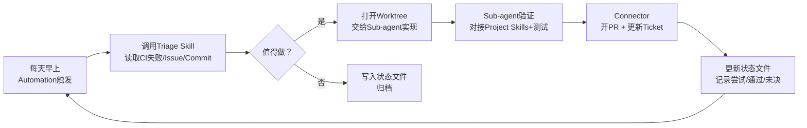

# Loop Engineering: 从提示词工程到循环设计

> 原文：[Loop Engineering](https://addyosmani.com/blog/loop-engineering/) — Addy Osmani, June 7, 2026

## 核心理念

**Loop Engineering** 是比"给 Agent 写提示词"更高一层的抽象——你不再亲自提示 AI，而是设计一个**自动化的循环系统**来替你提示 AI。

> "You shouldn't be prompting coding agents anymore. You should be designing loops that prompt your agents." — **Peter Steinberger**
>
> "I don't prompt Claude anymore. I have loops running that prompt Claude and figuring out what to do. My job is to write loops." — **Boris Cherny** (Anthropic, Claude Code 负责人)

**核心转变：** 过去两年，使用 coding agent 的方式是：写 prompt → 看回复 → 写下一个 prompt，全程手握工具。现在，你构建一个小型系统来自动发现工作、分配任务、检查结果、记录进度、决定下一步——然后让系统去驱动 agent，而不是你本人。

## Loop 的五个要素 + 一个存储器

一个完整的 loop 需要以下六个组件：

| # | 组件 | 作用 | Codex App 实现 | Claude Code 实现 |
|---|---|---|---|---|
| 1 | **Automations** (自动化) | 按计划自动执行发现和分诊 | Automations tab（选择项目/prompt/频率/环境），结果进入 Triage inbox，`/goal` 持续运行直到完成 | Scheduled tasks / cron，`/loop`，`/goal`，hooks，GitHub Actions |
| 2 | **Worktrees** (工作树) | 隔离并行任务，避免文件冲突 | 每个线程内置 worktree | `git worktree`，`--worktree` 参数，子 agent 的 `isolation: worktree` |
| 3 | **Skills** (技能) | 将项目知识编码为可复用文档 | Agent Skills (SKILL.md)，通过 `$name` 或隐式调用 | Agent Skills (SKILL.md) |
| 4 | **Plugins / Connectors** (插件与连接器) | 将 agent 接入已有工具链 | Connectors (MCP) + 插件分发 | MCP servers + 插件 |
| 5 | **Sub-agents** (子代理) | 分离"制造者"与"检验者" | Subagents 定义在 `.codex/agents/` 的 TOML 文件中 | Task subagents 在 `.claude/agents/`，agent teams |
| 6 | **State** (状态/记忆) | 跨运行持久化记录进度 | Markdown 或通过 Connector 写 Linear | Markdown (AGENTS.md, progress files) 或通过 MCP 写 Linear |

### 详解

#### 1. Automations — 循环的心跳

Automations 是让 loop 成为真正"循环"而非一次性运行的关键。

- **Codex App：** 在 Automations tab 中配置项目、prompt、频率、运行环境。找到结果的运行进入 Triage inbox，无结果的自动归档。OpenAI 内部用于每日 issue 分诊、CI 失败总结、commit 简报、bug 发现。
- **Claude Code：** 通过 `scheduling` + `hooks` 实现。`/loop` 按间隔重复运行，`/goal` 持续运行直到特定条件满足（如 "所有 auth 测试通过且 lint 干净"），每次迭代结束后由独立的小模型判断是否完成。
- **关键点：** Automation 可以调用 skill，使周期性任务保持可维护性——只需调用 `$skill-name`，无需粘贴大段无人更新的指令。

#### 2. Worktrees — 并行的基石

运行多个 agent 时文件冲突是首要失败模式。`git worktree` 解决此问题：它是共享同一仓库历史但位于独立分支的独立工作目录。

> "两个 agent 写入同一文件 = 两个工程师提交到同一行代码且彼此没沟通"

**编排税（Orchestration Tax）：** worktree 消除了机械碰撞，但**你**仍然是天花板——你的 review 带宽决定了实际能跑多少个 agent，而不是工具本身。

#### 3. Skills — 停止重复解释

Skill 是将项目上下文（约定、构建步骤、历史原因等）外部化的一次性投资。Agent 每次运行都读取 skill，而非从零推导。

> "没有 skill 的 loop 每个周期都重新推导整个项目；有 skill 的 loop 实现了积累效应。"

Skill 是作者格式，**plugin** 是分发格式——当你希望跨仓库共享 skill 或打包多个 skill 时，将其打包为 plugin。

#### 4. Plugins & Connectors — 触及真实工具

Connectors（基于 MCP）让 agent 读取 issue tracker、查询数据库、访问 staging API、在 Slack 发消息等。

> "Connectors 是让 loop 能在真实环境中行动、而非只告诉你它想做什么的关键。"

plugins 将 connectors 和 skills 打包在一起，队友一键安装即可复用你的完整设置。

#### 5. Sub-agents — 分离制造者与检验者

loop 中最有价值的结构性设计：**编写代码的 agent 不应该评判自己的代码**。

- 第二个 agent（使用不同的指令，有时使用不同的模型）能捕捉第一个 agent 自欺欺人放过的错误。
- Codex 中定义在 `.codex/agents/` TOML 文件中，支持为安全审查指定强模型高 effort、为探索指定快速只读 agent。
- Claude Code 中定义在 `.claude/agents/`，支持 agent teams 进行工作传递。
- 典型分工：一个 agent 探索 → 一个实现 → 一个验证。

> "Sub-agents 在 loop 中特别重要，因为 loop 在你不在场时运行，一个你真正信任的验证器是你敢走开的唯一理由。"

这也是 `/goal` 的底层机制——由独立模型判断循环是否结束。

## 一个完整的 Loop 示例

你的设计只有一次：你**没有**手动提示上述任何步骤。这就是 Steinberger 所说的核心——同样的 loop 在 Codex 或 Claude Code 中都能运行，因为组件是相同的。

## Loop 解决不了的三件事

### 1. 验证仍然在你身上
无人值守的 loop 也是无人值守犯错的 loop。分离验证者 agent 只能让"完成了"的说辞有更多分量，但"完成了"是声称，不是证明。

> "你的工作是交付你**确认工作**的代码。"

### 2. 理解力仍在退化
> "Loop 交付你没有编写的代码越快，现存代码与你实际理解之间的差距就越大。"

这就是**理解负债（Comprehension Debt）**——流畅的 loop 只会让负债增长更快，除非你主动阅读 loop 产生的内容。

### 3. 舒适姿势是最危险的
当 loop 自行运行时，你很容易停止"持有意见"，接受 loop 给的一切。原作者称之为**认知投降（Cognitive Surrender）**。

> "带着判断设计 loop 是解药，带着逃避思考的目的设计 loop 是催化剂——同一行为，截然相反的结果。"

## 核心结论

> **Build the loop. Stay the engineer.**
> 
> 两个人可以构建完全相同的 loop，得到截然不同的结果。一个人用它来加速自己深入理解的工作，另一个人用它来避免理解工作。Loop 不知道区别，但你知道。

这也正是 loop 设计比 prompt 工程更难的原因——不是工作量变少了，而是**杠杆点移动了**。Prompt 工程优化的是人与模型的一次性交互，Loop 工程优化的是人与系统之间持续的、可扩展的关系。
