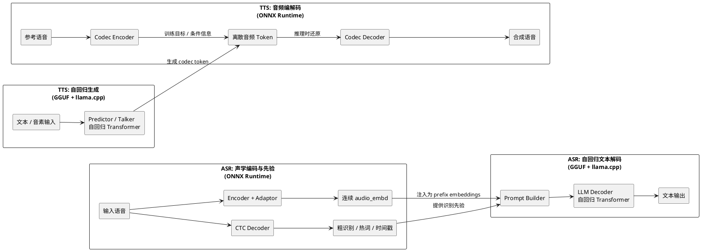

# Qwen3-ASR-GGUF 架构与 LLM-based ASR 技术探讨

> **摘要**：本文记录了对 Qwen3-ASR-GGUF 项目的深度探讨，涵盖项目整体逻辑、LLM-based ASR 的工作原理、Audio Encoder 输出的本质、与传统 CTC 方案的对比、流式/对话场景的延伸讨论，以及离散音频 token 方案（SpeechTokenizer、EnCodec）与本项目路线的工程权衡。

---

## 一、项目总览

[Qwen3-ASR-GGUF](https://github.com/HaujetZhao/Qwen3-ASR-GGUF) 将阿里巴巴 Qwen3-ASR 模型拆分为两部分分别优化，实现本地离线快速推理：

- **ONNX Encoder**：CNN + Transformer，用 ONNX Runtime 运行（支持 CPU / CUDA / DirectML / TensorRT）
- **GGUF Decoder**：标准 Qwen3 LLM，用 llama.cpp 运行，支持 Q4_K 等量化

**核心性能**：RTX 5050 笔记本，50 秒中文音频，RTF = 0.052（比实时快 19 倍）。

---

## 二、项目核心逻辑

### 推理流程

```
原始音频 (任意格式)
  │
  ▼ 重采样至 16kHz 单声道 PCM
  │
  ▼ 按 40 秒分块
  │
  ▼ FastWhisperMel（纯 NumPy）→ Mel 频谱图 (128, T)
  │
  ▼ Frontend ONNX（CNN，固定 100 帧原子块）→ hidden_states
  │
  ▼ Backend ONNX（Transformer，动态长度）→ audio_embd (T_tokens, 1536)
  │
  ▼ 拼入 LLM prompt（音频向量插入文字 token 序列之间）
  │
  ▼ llama.cpp 自回归生成 → 转录文字
  │
  ▼（可选）QwenForcedAligner → 字级时间戳 → SRT / JSON
```

### Encoder 为何拆成前后端

| 部分 | 结构 | 输入形状 | 原因 |
|------|------|----------|------|
| Frontend | CNN | 固定 (1, 128, 100) | 静态形状，利于 ONNX/DML 优化 |
| Backend | Transformer | 动态 (1, T, D) | 需要感知完整上下文，长度可变 |

两者不能合并，合并会破坏 DML 的静态形状优化。

### 导出流水线

```
00 Mel 滤波器 → 01/02 Encoder ONNX FP32 → 03 优化 → 04 量化
→ 05 Decoder HF 权重 → 06 转 GGUF F16 → 07 量化 Q4_K
```

Aligner 模型（11–17）与 ASR 流水线完全镜像。

---

## 三、为什么能用 llama.cpp 替换 Decoder？

Qwen3-ASR 本质是一个**多模态 LLM**，Decoder 就是标准的 Qwen3 语言模型。llama.cpp 已原生支持 Qwen3 架构，唯一改造点是在 GGUF 转换脚本（`06-Convert-ASR-Decoder-GGUF.py`）中通过猴子补丁，让模型元数据携带"此为 ASR 模型"的标记，从而在 prefill 时接受音频嵌入向量作为 prefix。

---

## 四、LLM-based ASR 是主流趋势吗？

**是的**，2023 年以来 ASR 领域最重要的范式转移：

| 模型 | 机构 | 方式 |
|------|------|------|
| Whisper | OpenAI | Encoder-Decoder Transformer（非通用 LLM） |
| Qwen3-ASR | Alibaba | Audio Encoder + Qwen3 LLM |
| Gemini / GPT-4o | Google / OpenAI | 原生多模态 |
| SALMONN | 清华 | Audio Encoder + LLaMA |

### 与传统 CTC 对比

| 维度 | CTC | LLM-based ASR |
|------|-----|---------------|
| 速度 | 极快（非自回归） | 较慢（自回归） |
| 标点/格式 | 需后处理 | 天然输出 |
| 多语言 | 需单独训练 | 零样本跨语言 |
| 长难句/专业术语 | 弱 | 强 |
| 模型大小 | 几十~几百 MB | 几 GB |

---

## 五、Audio Encoder 输出的本质

### 不是 Tokenizer，是连续向量

```
文字路径：  "你好" → BPE → [token_id] → Embedding Table → 连续向量 (1536-dim)
音频路径：  wav → Mel → CNN → Transformer → 连续向量 (1536-dim)   ← 直接到这步
```

Audio Encoder = **Tokenizer + Embedding Table 的合体**，但跳过了离散 ID 这一层，直接输出与 LLM token embedding 同维度的连续向量。

### 为什么 LLM 能理解音频向量？

通过**端到端联合训练**实现。梯度从 LLM 损失一路反传到 Audio Encoder，强迫其输出向量与 LLM 语义空间对齐。这是严格的数学约束，不是近似对齐：

- 文字 token `"你"` 的 embedding 是语义空间中的一个**点**
- 所有发音为"你"的音频，其 embedding 被训练为一个紧密的**区域**，位于那个点附近

### 拼接方式（来自源码 `asr.py`）

```python
total_embd[:n_pre]             = embedding_table[prefix_tokens]  # 文本 [im_start][system...]
total_embd[n_pre:n_pre+n_aud]  = audio_embd                      # 音频向量序列 ★
total_embd[n_pre+n_aud:]       = embedding_table[suffix_tokens]  # 文本 [audio_end][assistant]
```

---

## 六、能否用于低延迟语音对话？

### 改成对话模式只需改 Prompt

当前 ASR 模式的 prompt 末尾有 `<asr_text>` 引导 token 约束输出为转录文字。去掉该 token，LLM 可自由生成对话回复：

```
现在：... [<audio_end>] [assistant] <asr_text>请帮我预定...（转录）
改后：... [<audio_end>] [assistant]（自由对话）
```

修改点：`qwen_asr_gguf/inference/asr.py` 中 `_build_prompt_embd` 的 `suffix_head` 部分。

### 延迟估算

```
音频采集 2s + Encoder < 50ms + LLM 首 token ~200ms = 约 2.25 秒总延迟
```

对语音助手场景完全可用。

---

## 七、文字 → 音频（TTS）反向操作

Audio Encoder 是单向有损压缩，**无法反解**。反向生成需要独立的 TTS 模型。

### 推荐架构：文字中转方案

```
麦克风 → Qwen3-ASR（本项目）→ 文字 → LLM 对话 → 文字 → TTS（CosyVoice/Kokoro）→ 扬声器
```

优点：各模块独立成熟，延迟可控，工程实现简单。

### 端到端 Speech-to-Speech（离散 token 方案）

代表：Moshi、Mini-Omni。LLM 直接输出 EnCodec 音频 token，再通过声码器还原波形。延迟更低但训练成本极高。

---

## 八、离散音频 Token 方案（SpeechTokenizer/EnCodec）能替代本项目吗？

**技术上可以，但纯 ASR 场景不值得。**

| 维度 | 本项目（连续 embedding） | 离散 token 方案 |
|------|----------------------|----------------|
| ASR 精度 | ✅ 高（无量化噪声） | ⚠️ 有额外 VQ 损失 |
| 推理速度 | ✅ 极快（1s ≈ 13 token） | ❌ 慢（1s ≈ 75~150 token） |
| 双向（TTS/S2S） | ❌ | ✅ |
| 保留音色 | ❌ | ✅ |
| 部署复杂度 | ✅ 极低 | ❌ 需额外 Codec 模型 |

**结论**：
- 纯 ASR → 本项目路线最优
- 端到端语音对话（原声回复）→ 离散 token 路线，但需从头训练整套模型
- 最快落地的语音助手 → 本项目 + 外挂 TTS

---

## 九、关键代码位置速查

| 功能 | 文件 |
|------|------|
| 主引擎/Prompt 构造/生成循环 | `qwen_asr_gguf/inference/asr.py` |
| Mel 提取 + ONNX Encoder | `qwen_asr_gguf/inference/encoder.py` |
| llama.cpp FFI 绑定 | `qwen_asr_gguf/inference/llama.py` |
| 数据结构定义 | `qwen_asr_gguf/inference/schema.py` |
| 强制对齐 | `qwen_asr_gguf/inference/aligner.py` |
| SRT/JSON/TXT 导出 | `qwen_asr_gguf/inference/exporters.py` |
| 导出参数配置 | `export_config.py` |


---

## 十、基于 DeepSeek 分享对话的补充整理：从 Qwen3-TTS-GGUF 到 Fun-ASR-GGUF

> 本节用于吸收分享链接中的新增讨论，并结合当前 `Fun-ASR-GGUF` 工程做一次更贴近实现的校正。核心不是“所有语音模型都适合直接转 GGUF”，而是：**只把最像 LLM 的那一段迁移到 GGUF + llama.cpp，其余部分继续交给 ONNX Runtime。**

### 1. 统一结论

- **Qwen3-TTS-GGUF** 的加速重点是 `Talker / Predictor` 这类自回归 Transformer。
- **Fun-ASR-GGUF / Qwen3-ASR-GGUF** 的加速重点是 `LLM Decoder` 这类标准语言模型解码器。
- **Encoder / Adaptor / CTC / Codec Encoder / Codec Decoder** 这类模块更适合继续保留在 ONNX Runtime。
- 所以真正被复用的不是“语音专用推理引擎”，而是 **面向 Decoder-only Transformer 的 LLM 推理栈**。

### 2. 为什么 GGUF 常常比 ONNX 更快，但不是“无条件更快”

| 维度 | GGUF + llama.cpp | ONNX Runtime |
|------|------------------|-------------|
| 优化目标 | 强聚焦于 Decoder-only LLM | 通用计算图执行 |
| 核心强项 | KV Cache、注意力、采样、自回归生成 | 卷积、前馈图、跨框架兼容 |
| 内存策略 | 量化格式与运行时深度耦合，可内存映射 | 更通用，格式与执行引擎解耦 |
| 启动/常驻 | 大模型长驻与按需访问更友好 | 通用性强，但不一定最省启动成本 |
| 典型优势场景 | LLM 解码、逐 token 生成 | 编码器、声学前端、CTC、Codec |

更准确地说，GGUF 不是因为“格式更神奇”而快，而是因为它背后绑定的是 `llama.cpp` 这套 **针对 LLM 自回归路径做过极深手工优化的专用执行栈**。如果任务本身不是 Decoder-only Transformer，那么 GGUF 并不会天然占优。

### 3. 为什么 TTS 里 Talker / Predictor 用 GGUF，而 Encoder / Decoder 保留 ONNX

分享对话里的核心判断可以压缩为一句话：**边界在“中间表示”处，而不是在模型文件格式处。**

- `Talker / Predictor` 负责根据文本条件逐步生成语音中间表示，天然符合 LLM 的“下一个 token 预测”范式。
- `Encoder / Decoder` 负责波形与中间表示之间的变换，本质更接近卷积、上采样、声码器、codec 等传统音频网络。
- 因此前者适合 GGUF + llama.cpp，后者适合 ONNX Runtime。

### 4. TTS 中音频 token 与 LLM token 的关系

在 Qwen3-TTS-GGUF 这类方案中，音频 token 与文本 token 在建模层面是同构的：

- 都是离散 ID 序列。
- 都来自有限词表或码本。
- 都可以做自回归生成。
- 都能直接受益于 KV Cache、量化、Flash Attention、采样策略等 LLM 优化。

因此，`llama.cpp` 真正加速的不是“语音”本身，而是“把语音生成问题改写成 token 序列建模问题”之后的那一段。

## 十一、把这套思路放到 ASR 上时，哪些结论成立，哪些需要校正

### 1. 成立的部分

- ASR 也可以做成“声学前端 + LLM Decoder”的混合架构。
- LLM Decoder 这部分确实可以导出为 GGUF，并用 `llama.cpp` 加速。
- 这类方案的本质，是把识别任务尽量压缩到 LLM 能消费的输入接口上，再复用成熟的自回归推理栈。

### 2. 需要校正的部分

DeepSeek 对话里为了统一 TTS 与 ASR，使用了“共享离散音频 token 桥梁”的图示。这在 **TTS** 里成立，但对当前 `Fun-ASR-GGUF` 工程来说，更精确的说法应当是：

- ONNX `Encoder + Adaptor` 输出的是 **连续的 `audio_embd`**，而不是离散 codec token。
- 这些 `audio_embd` 会与前后文本 prompt embeddings 直接拼接，然后整体注入 `llama.cpp` 的上下文。
- ONNX `CTC` 分支提供的是 **粗识别结果、热词候选、时间戳与对齐先验**，不是一套独立的 codec token 桥梁。

也就是说，当前 ASR 工程的共享接口更适合描述成：

**波形 → 声学表示 / adaptor embeddings → LLM-compatible prefix → 自回归文本解码**

而不是简单地写成：

**波形 → 离散音频 token → 文本**

### 3. 因而，TTS 与 ASR 的真正共性是

- 都把语音任务拆成了“非 LLM 部分”和“LLM 部分”。
- 都把最耗工程优化、最吃 KV Cache/量化收益的部分交给了 `llama.cpp`。
- 都保留了 ONNX 对卷积、声学编码、CTC、codec 等模块的成熟支持。

**共性在“混合架构”和“LLM 化的中间接口”，不一定在“完全相同的 token 形态”。**

## 十二、更贴近工程实现的统一视角图（PlantUML）

下面这张图保留了分享对话希望表达的“统一 LLM-based speech 框架”，但将 `Fun-ASR-GGUF` 修正为连续 `audio_embd + CTC 先验` 的真实路线。



## 十三、最终归纳

### 1. 对 Qwen3-TTS-GGUF 的一句话总结

它不是“把整个 TTS 模型转成 GGUF”，而是 **只把最像 LLM 的 Predictor / Talker 搬到 GGUF + llama.cpp，上下游音频编解码仍留在 ONNX Runtime**。

### 2. 对 Fun-ASR-GGUF / Qwen3-ASR-GGUF 的一句话总结

它不是“把整个 ASR 模型转成 GGUF”，而是 **保留 ONNX 声学编码与 CTC 先验，只把文本生成式 Decoder 迁移到 GGUF + llama.cpp**。

### 3. 对 LLM-based Speech 的一句话总结

这类系统的工程关键并不是统一文件格式，而是找到一个 **足够贴近 LLM 输入/输出接口的中间表示**，然后把最适合 `llama.cpp` 的那一段抽出来单独优化。

### 4. 一个实用判断准则

- 如果某模块本质上在做 **逐 token 自回归生成**，优先考虑 GGUF + `llama.cpp`。
- 如果某模块本质上在做 **卷积、声学编码、CTC、codec、前馈图计算**，优先考虑 ONNX Runtime。
- 混合部署不是折中，而是这类语音模型当前最务实、收益最高的落地方式。

---

## 十四、把讨论真正落到 `Fun-ASR-GGUF` 当前实现上：它不是 Qwen3-ASR-GGUF 的简单镜像

上文更多是在解释 `Qwen3-ASR-GGUF` 这类“Audio Encoder + Qwen LLM Decoder”的范式。但结合最近对 `Fun-ASR-GGUF` 仓库本身的逐层梳理，需要补一个工程上的校正：

`Fun-ASR-GGUF` 虽然也属于 **LLM-based ASR 的混合架构**，但它的运行时边界与 `Qwen3-ASR-GGUF` 并不完全相同。

### 1. 当前 `Fun-ASR-GGUF` 的核心链路

更贴近真实实现的流程是：

```text
原始音频
  -> 特征提取（Mel + LFR）
  -> Encoder ONNX
  -> CTC ONNX
  -> 粗识别 / 热词候选 / 时间戳先验
  -> Prompt 构建
  -> 将 adaptor audio embeddings 注入 llama.cpp 上下文
  -> LLM 自回归文本生成
  -> CTC 与 LLM 文本对齐，回填时间戳
```

这意味着当前工程的“共享中间表示”并不是离散 audio token，而是：

- **连续的 audio embeddings**
- **CTC 提供的文本先验与时间戳先验**

所以如果把它和 TTS / codec token 方案放在同一个统一框架里看，真正的共性是：

- 都把系统拆成了 “非 LLM 部分” 和 “LLM 部分”
- 都把最适合 `llama.cpp` 的自回归部分抽离出来单独优化
- 但不一定都使用相同形态的中间 token

### 2. `Fun-ASR-GGUF` 与 `Qwen3-ASR-GGUF` 的差异重点

| 维度 | Qwen3-ASR-GGUF | Fun-ASR-GGUF |
|------|----------------|--------------|
| 主体思路 | Audio Encoder + Qwen3 LLM | Encoder + CTC + Prompt + GGUF LLM |
| 声学先验 | 主要来自 encoder 输出 | 明确保留 CTC 分支做先验与时间戳 |
| 推理组织方式 | 偏多模态 LLM 输入拼接 | 明显是混合式 ASR pipeline |
| 工程优势 | 路径更统一 | 时间戳、热词、长音频合并更容易扩展 |

所以更准确的判断是：

- `Qwen3-ASR-GGUF` 更像“音频接入 LLM”
- `Fun-ASR-GGUF` 更像“CTC 和 LLM 协同工作的混合识别系统”

---

## 十五、关于“流式推理”的工程真相：当前 07 只是低开销伪流式，不是真 online ASR

最近围绕麦克风 demo 的讨论，得到一个非常重要的结论：**当前 `Fun-ASR-GGUF` 的流式 API 更接近 sherpa-onnx 风格接口兼容，而不是状态复用意义上的真流式推理。**

### 1. 为什么名字会让人误解

代码里有这些很像在线识别的接口：

- `RecognitionStream`
- `create_stream()`
- `decode_stream()`

但它们当前的实际语义更接近：

- 用一个 `stream` 容器承载当前音频 buffer
- 每次对完整 buffer 做一次完整解码

而不是：

- chunk-by-chunk 增量维护 encoder state
- 增量维护 decoder state
- 每个 chunk 只做一次真正的新增计算

### 2. 07 麦克风 demo 当前实际在做什么

为了降低 CPU 开销，07 的 partial 路径已经做了收敛：

- 只看最近固定窗口音频
- 只在有语音块时更新 partial
- partial 只走 greedy CTC，不做完整热词/纠错/LLM
- final 时再对整句做完整解码

因此它当前最准确的描述是：

> **低开销伪流式 CTC partial + endpoint 后整句完整推理**

这已经非常适合设备侧交互原型，但不应被误认为“模型已经支持在线状态复用”。

### 3. 如果想做真 online，需要改哪里

需要同时改两层：

1. **导出/模型定义层**
   - 导出带 cache/state 输入输出的 encoder
2. **运行时层**
   - 增量特征提取
   - chunk 级 encoder state 管理
   - chunk 级 CTC 提交策略

只改 demo 脚本本身，无法把当前系统变成真正的 online ASR。

---

## 十六、从“能不能接 sherpa-onnx”到“其实更适合做原生 runtime”

讨论里原本有一个方向是：是否可以让 `sherpa-onnx` 支持当前 `Fun-ASR-GGUF` 的推理。

最后得到的更稳妥结论是：

- 如果只想支持 **Encoder + CTC 的在线识别**，往 sherpa-onnx 的模型族里扩是可行的
- 但如果目标是保留当前完整的 **CTC + hotword + Prompt + GGUF LLM + Aligner**，就不适合硬塞进 sherpa-onnx 核心

原因很简单：

- sherpa-onnx 擅长的是 ONNX ASR runtime
- 当前 `Fun-ASR-GGUF` 的后半段依赖 `llama.cpp`
- 真要完整迁进去，相当于把 sherpa-onnx 从 ONNX runtime 改造成一个混合式语音推理框架

从工程边界看，这不是最优解。

更务实的方向反而是：

- 保留现有模型产物
- 去掉 Python 运行环境
- 直接把推理 runtime 改成 C++ / 原生实现

---

## 十七、如果部署设备不能装 Python，最合理的路线是什么？

这部分是最近讨论里最清晰、也最有落地价值的结论之一：

> **不需要把整个仓库重写成 C++，只需要把部署侧推理 runtime 原生化。**

### 1. 开发机保留 Python，部署机只保留模型和原生 runtime

最合理的职责切分是：

- 开发机：继续使用 Python 做导出、量化、调试
- 部署机：只带 ONNX、GGUF、`tokens.txt`、`hot.txt` 和 native runtime

这样就不用在设备上安装大体积 Python 环境，也不用重写 01-05 工具链。

### 2. 原生 runtime 应如何拆分

针对当前 `Fun-ASR-GGUF`，一个可落地的 native 版本至少应拆成：

- `Frontend`
  - 复刻当前 Mel + LFR 的数值行为
- `EncoderRunner`
  - ONNX Runtime C++ 加载 Encoder
- `CtcRunner`
  - ONNX Runtime C++ 加载 CTC，支持 greedy decode
- `PromptBuilder`
  - 构建 prefix/suffix embeddings
- `LlmRunner`
  - 用 `llama.cpp` C/C++ API 做 embedding 注入与生成
- `Aligner`
  - 对齐 CTC 与 LLM 文本
- `MicSession`
  - 复刻 07 的 endpoint / partial / final 交互

### 3. 为什么 `Frontend` 才是最大风险点

很多人直觉会觉得最难的是 `llama.cpp` 或 ONNX Runtime API，但从当前工程经验看，**真正最容易出问题的是特征提取数值对齐**。

尤其是：

- mean normalization
- pre-emphasis
- STFT
- mel filter
- LFR stacking
- padding / mask 的一致性

只要这里和当前 Python 参考实现不一致，后面的 ONNX 输出就会整体漂移。

### 4. 为什么 `experience/` 文档在 native 实现里仍然关键

`experience/` 中关于 DirectML 和 paddable 定义的记录，表面看是在讲导出与 DML 兼容，实际上它们给 native runtime 提供了非常重要的 **行为规范**：

- 不能随便换成普通 Kaldi fbank
- 不能忽略 padding 与有效长度的影响
- 不能低估 mask 和边界泄露对深层 Transformer 的扰动

换句话说，native runtime 不是“照着模型输入输出写个 wrapper”就能跑准，而是要把这些数值一致性约束一并移植过去。

### 5. 一个很务实的 MVP 顺序

如果以落地为先，最值得的顺序是：

1. 文件版 `CTC-only`
2. 麦克风版 `CTC-only`
3. 文件版 `CTC + LLM refine`
4. 麦克风版 `CTC + LLM refine`

这样可以先把“去 Python 部署”这个目标完成，再逐步补复杂能力，而不是一开始就把系统做满。

---

## 十八、FunASR 官方新增 speaker diarization 后，对当前路线意味着什么？

官方在 2026/05 增加的能力不是“把主 ASR 模型换成另一个单模型”，而是把多条模型链编排起来：

- `model`: ASR 主模型
- `vad_model`: VAD
- `spk_model`: speaker embedding / diarization
- `punc_model`: 标点恢复

因此，对当前 `Fun-ASR-GGUF` 路线来说，关键结论是：

### 1. 主 ASR 导出链未必需要先大改

如果目标只是把 diarization 能力纳入部署系统，首要工作不在 01-05，而在推理 runtime 的编排层。

因为当前主模型导出链是围绕：

- Encoder
- CTC
- GGUF Decoder

这条主链组织的。

官方新增的 diarization 套餐，本质上是额外增加：

- 语音活动检测
- 说话人 embedding / 聚类
- 标点模型

### 2. 真正要改得更多的是 runtime，而不是导出脚本

当前 runtime 的基本假设是：

- 一段音频 -> 一个文本结果

但 diarization 要求中间表示升级为 sentence-level 结构：

- `start`
- `end`
- `text`
- `speaker_id`

这会牵动：

- 分段策略
- 结果结构
- 合并策略
- demo 输出
- SRT / sentence_info 组织方式

### 3. 量级判断：不是小改，但也不是重做主 ASR

从工程量上判断，speaker diarization 对当前路线属于：

- **主 ASR 模型层：中小改**
- **推理 pipeline 层：中到大改**

最核心的新增模块会变成：

- `VadRunner`
- `SpeakerRunner`
- `PuncRunner`
- `SentenceAssembler`

### 4. 如果目标是设备落地，正确优先级是什么

还是应该先做：

- 原生 `CTC-only`
- 原生 `CTC + LLM refine`

待部署主链稳定后，再把 diarization 作为第二阶段能力接入。

原因很现实：

- speaker diarization 提升的是结果结构和可用性
- 去 Python 部署解决的是整个系统能否真正落地

前者重要，但应该排在后者之后。

---

## 十九、结合这轮讨论后的最终工程判断

如果只看论文或模型名，容易把 `Qwen3-ASR-GGUF`、`Fun-ASR-GGUF`、sherpa-onnx、speaker diarization、online ASR 这些概念混在一起。但落到工程上，结论其实已经非常清晰：

### 1. 当前最值得坚持的路线

- 保留混合架构
- 保留 ONNX 负责声学部分
- 保留 GGUF + `llama.cpp` 负责 LLM 自回归部分
- 把部署 runtime 原生化，移除 Python 依赖

### 2. 当前最不值得优先投入的方向

- 一开始就强改 sherpa-onnx 兼容整条混合推理链
- 一开始就为了 diarization 重做导出链
- 把 07 的伪流式误当成模型已经支持真 online

### 3. 一个更稳的工程顺序

```text
先把 native runtime 跑通
  -> 再把 07 的交互效果迁进去
  -> 再评估是否要补 LLM refine
  -> 最后再扩 speaker diarization / sentence_info
```

### 4. 一句话总收束

`Fun-ASR-GGUF` 当前最有价值的不是“已经具备所有高级语音能力”，而是它已经把 **混合式 LLM-based ASR 的部署边界切得足够清晰**：

- 什么适合 ONNX
- 什么适合 GGUF
- 什么只是 demo 层的近实时效果
- 什么需要在 runtime 编排层再继续建设

对工程实现者来说，这种边界清晰，往往比单个模型名字更重要。
