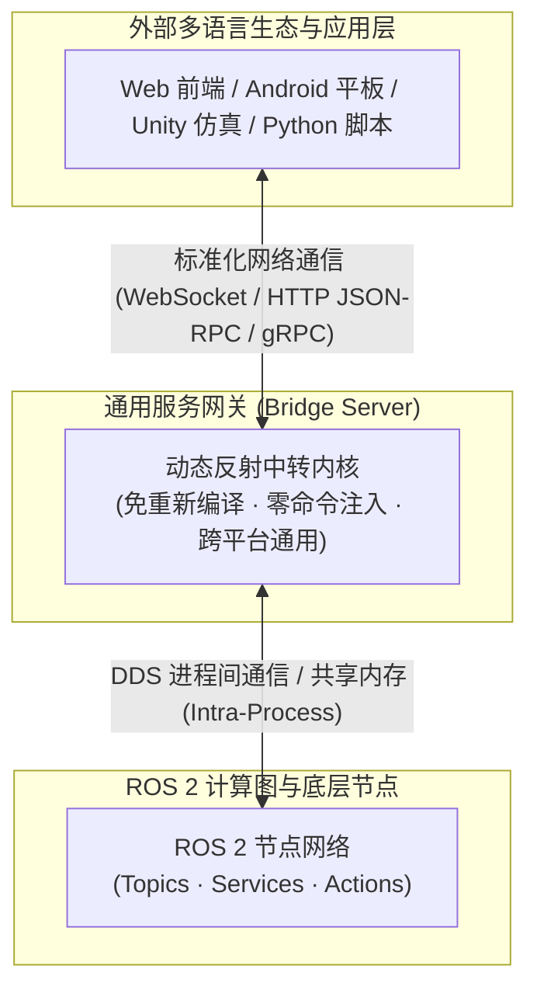
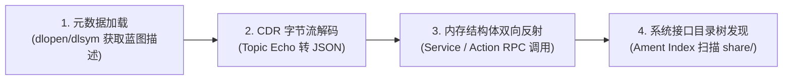
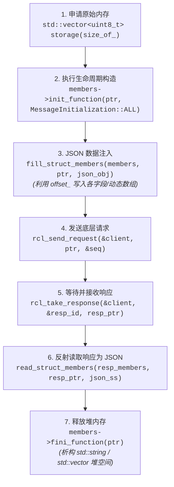
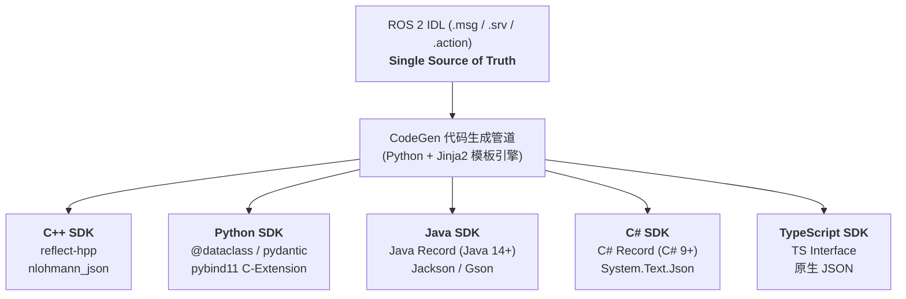

# ROS 2 IDL 动态解析、Bridge 网关与多语言 SDK 架构设计

> **摘要**：本文系统梳理了 ROS 2 IDL（`.msg` / `.srv` / `.action`）的底层原理与运行时动态解析机制，针对机器人初学者深入浅出地讲解了 CDR 二进制流解码、动态类型自省（TypeSupport Introspection）以及原生内存对象构造的全过程。以此为基础，探讨如何构建类似 `ros2_websocket_bridge` 的通用服务网关，并结合 [`reflect-hpp`](./reflect-hpp静态反射与JSON序列化.md) 静态反射与 CodeGen 工具链，设计一套“Bridge 端动态反射，SDK 端多语言强类型契约”的现代化跨端开发体系。

---

## 一、背景与问题定义

在进行 ROS 2 机器人应用开发时，通常会遇到两类不同视角的架构诉求：



1. **服务网关化诉求（Bridge 视角）**：
   - 希望将 ROS 2 内部的计算图（Topics / Services / Actions）对外暴露为通用的网络接口。
   - **痛点**：网关必须是通用的独立二进制。系统里无论新增了什么自定义消息包，网关都不能要求开发者改代码重新编译，更不能通过 `popen("ros2 service call ...")` 去调用低效且存在 Shell 注入风险的子进程。网关必须具备**在运行期动态解析任意 ROS 2 数据类型**的能力。

2. **调用端开发诉求（SDK 视角）**：
   - 外部调用者（如写 Web 页面、App 或自动化测试的工程师）需要接入机器人服务。
   - **痛点**：不能让开发者面对一堆无类型提示的裸 JSON 字典（容易拼错字段名、无 IDE 智能补全、无编译期类型检查）。SDK 必须提供**强类型的 Dataclass / Struct**。

要解决这一矛盾，核心在于厘清：**ROS 2 底层到底是如何定义和传输数据的？网关如何在不依赖头文件的情况下在内存中操作这些数据？**

---

## 二、初学者视角：ROS 2 IDL 与通信本质

### 1. 什么是 ROS 2 IDL？

IDL（Interface Definition Language，接口定义语言）是跨进程、跨机器通信的“契约”。在 ROS 2 中，主要体现为三类文本文件：
- **`.msg`（消息）**：单向数据流载荷（如 `geometry_msgs/msg/Twist.msg`）
- **`.srv`（服务）**：双向同步请求/响应（如 `example_interfaces/srv/AddTwoInts.srv`）
- **`.action`（动作）**：带长周期目标、反馈与最终结果的异步通信

### 2. 静态编译 vs 动态反射

- **传统静态开发模式**：
  在常规 ROS 2 节点开发中，`colcon build` 会调用 `rosidl_generator_cpp` 根据 `.msg`/`.srv` 文件自动生成 C++ 结构体头文件（如 `#include <std_msgs/msg/string.hpp>`）。你的业务代码在**编译期**就知道了结构体的每一个字段。
  
- **通用网关的动态模式**：
  网关在编译时根本不知道用户未来会定义什么消息。它接收到的只有一个字符串 `sensor_msgs/msg/LaserScan` 和一段从网络上收到的字节流。**动态解析的目标就是：在零编译期头文件依赖的前提下，动态把字节流还原为结构化数据（如 JSON），或根据 JSON 现场造出一个符合 ROS 2 内存规范的 C++ 结构体。**

---

## 三、ROS 2 运行时动态解析的四大核心机制

在当前工程的实践中，我们避开了社区中已失效的 `dynmsg`（原仓库 404）以及仅限 Jazzy+/Rolling 且强依赖 FastDDS 的 `rosidl_dynamic_typesupport`，直接基于 ROS 2 官方标准的 **`rosidl_typesupport_introspection_cpp` + 运行时 `dlopen` + 手工 CDR 解码** 实现了全版本（Humble/Iron/Jazzy/Rolling）通用的动态反射引擎。

其核心实现分为四个清晰的阶段：



---

### 阶段 1：动态加载 TypeSupport 元数据（获取消息“蓝图”）

ROS 2 在编译每一个包含接口的包（如 `geometry_msgs`）时，除了生成头文件外，还会默默编译出一个反射共享库：
`lib<pkg>__rosidl_typesupport_introspection_cpp.so`。

这个动态库里导出了一个标准符号函数，专门返回该类型的**自省元数据（Introspection Metadata）**：

```cpp
// 1. 根据类型名称拼接动态库文件名
std::string lib_name = "lib" + pkg + "__rosidl_typesupport_introspection_cpp.so";
void* handle = dlopen(lib_name.c_str(), RTLD_LAZY | RTLD_GLOBAL);

// 2. 查找标准符号导出函数
std::string sym_name = "rosidl_typesupport_introspection_cpp__get_message_type_support_handle__" 
                       + pkg + "__" + kind + "__" + msg_name;
using GetTSFn = const rosidl_message_type_support_t* (*)();
GetTSFn get_ts_fn = reinterpret_cast<GetTSFn>(dlsym(handle, sym_name.c_str()));

// 3. 执行函数，拿到核心的“蓝图”结构体指针
const rosidl_message_type_support_t* ts = get_ts_fn();
const auto* members = static_cast<const rosidl_typesupport_introspection_cpp::MessageMembers*>(ts->data);
```

#### 什么是 `MessageMembers`？
初学者可以把 `MessageMembers` 理解为 ROS 2 给你提供的一张**“结构体内存排布蓝图”**，它包含了：
- `member_count_`：该消息包含多少个字段。
- `members_[i].name_`：第 $i$ 个字段的名称（如 `"x"`, `"linear"`, `"header"`）。
- `members_[i].type_id_`：字段的数据类型枚举（如 `ROS_TYPE_FLOAT`, `ROS_TYPE_STRING`, `ROS_TYPE_MESSAGE` 等）。
- `members_[i].offset_`：该字段距离结构体起始内存地址的**字节偏移量（Offset）**。
- `members_[i].members_`：若该字段是嵌套消息（如 Header），则指向子消息的 `MessageMembers` 蓝图。
- `init_function` / `fini_function`：这块内存的构造与析构函数指针。

拿到这张蓝图后，网关就具备了透视和操作该类型内存的能力。

---

### 阶段 2：网络层 CDR 字节流动态解码（用于 Topic 动态监听）

当使用通用订阅器 `node->create_generic_subscription(topic, type_str, ...)` 接收数据时，底层给到回调函数的是打包好的 `rclcpp::SerializedMessage`。其内部存放的是遵循 **OMG CDR (Common Data Representation)** 规范的原始二进制流。

#### CDR 解码的 4 个关键细节（初学者避坑要点）：

1. **4 字节 Encapsulation Header 与端序处理**：
   - CDR 报文的前 4 个字节是固定头部。其中 Byte 1 标识了编码端序：
     `0x0001` / `0x0003` 代表 **小端序（Little-Endian）**；`0x0000` / `0x0002` 代表 **大端序（Big-Endian）**。
   - 当接收到的端序与本机 CPU 架构（通常 x86_64 / ARM 均为 Little-Endian）不同时，读取多字节数值（int16, uint32, float, double 等）必须调用 `cdr_byte_swap` 执行字节翻转。

2. **严格的内存对齐（Alignment）规则**：
   - CDR 规定了严格的对齐要求：
     - `int16` / `uint16`：必须从相对 CDR 净荷起始位置的 **2 字节整数倍** 偏移开始读；
     - `int32` / `uint32` / `float` / `string 长度`：必须从 **4 字节整数倍** 偏移开始读；
     - `int64` / `uint64` / `double`：必须从 **8 字节整数倍** 偏移开始读。
   - 如果遇到未对齐的情况，数据流中会存在 1~7 字节的 Padding（填充空洞）。在解码时必须先推进偏移量：
     ```cpp
     auto align_offset = [&](size_t align) {
       while ((offset - 4) % align != 0 && offset < size) offset++;
     };
     ```
     *注意：如果对齐计算错 1 个字节，后续所有的字段都会彻底错位变成乱码！*

3. **变长序列 vs 定长数组**：
   - **变长序列（Sequence，如 `int32[] data`）**：CDR 流中会先存 4 字节的元素个数 $N$，随后紧跟 $N$ 个连续元素。
   - **定长数组（Array，如 `float64[3] position`）**：CDR 流中**没有**前缀计数，必须直接按照元数据中声明的长度连续读取。

4. **大数组截断保护**：
   - 激光雷达点云（`LaserScan` / `PointCloud2`）或相机图像（`Image`）动辄包含数万至数百万个数值。如果盲目将它们全部转为大 JSON 字符串，会直接撑爆内存或卡死 WebSocket。
   - **工程解法**：在递归解码遍历数组时，只把前 20 个元素输出到 JSON，并在末尾标注 `... (N items total)`；但底层的字节流 offset 仍需完整推进，确保后续字段能正常对齐读取。

---

### 阶段 3：原生内存对象动态构造与 Service 调用（用于 RPC）

发送 ROS 2 Service 请求与 Topic 监听不同：底层的 `rcl_send_request` C API 要求必须传入一个**在内存中真实构造好的 C++ 结构体指针**。

如何根据一段外部传来的 JSON 字符串，凭空造出一个完全合法的 C++ Service Request 结构体？



#### 关键步骤拆解：
1. **内存分配与 Placement 初始化**：
   - 根据 `req_members->size_of_` 分配内存块：`std::vector<uint8_t> storage(req_members->size_of_)`。
   - 调用 `req_members->init_function(storage.data(), MessageInitialization::ALL)`。这一步至关重要，它会在原始内存上构造 `std::string` 和 `std::vector` 的虚表与内部指针状态，否则直接写入必定段错误（Segmentation Fault）。
2. **JSON 注入（`fill_struct_members`）**：
   - 遍历 `req_members` 中的字段名，匹配 JSON 里的 key。
   - 定位内存地址：`void* field_ptr = static_cast<char*>(base) + member.offset_`。
   - 对 `std::string` 赋值；对变长 `std::vector` 调用元数据自带的 `member.resize_function` 与 `member.get_function`；对特化的 `std::vector<bool>` 调用位操作 `member.assign_function`。
3. **响应读取（`read_struct_members`）**：
   - 收到服务端回传的响应结构体后，按各字段的 `offset_` 取出数据拼装为 JSON 字符串。
4. **安全析构**：
   - 整个请求完成后，必须调用 `req_members->fini_function(storage.data())` 释放内部所有 STL 容器持有的堆内存，防止内存泄漏。

---

### 阶段 4：系统接口目录树发现（Ament Index）

在网关或可视化工具中，如何自动列出系统中安装的所有可用接口？

```cpp
#include <ament_index_cpp/get_packages_with_prefixes.hpp>
#include <ament_index_cpp/get_package_share_directory.hpp>

// 1. 枚举系统中所有已注册的 ROS 2 包
const auto packages = ament_index_cpp::get_packages_with_prefixes();
for (const auto& [pkg, prefix] : packages) {
    std::string share_dir = ament_index_cpp::get_package_share_directory(pkg);
    // 2. 检查 share/<pkg>/msg、share/<pkg>/srv、share/<pkg>/action 目录
    for (const char* sub : {"msg", "srv", "action"}) {
        std::filesystem::path dir = std::filesystem::path(share_dir) / sub;
        // 遍历提取 .msg / .srv 文本定义
    }
}
```
通过 `ament_index_cpp` 直接探测系统的 `share/` 目录，网关不仅能获取接口类型列表，还可以直接读取原始 `.msg`/`.srv` 文件文本内容展示给开发者。

---

## 四、强类型 SDK：静态反射与多语言 CodeGen 设计

通过上述机制，Bridge 网关已经能够以标准 JSON 与外部进行全动态中转。接下来需要解决客户端 SDK 的**强类型封装**问题。

详细关于 C++ 编译期静态反射的原理与宏展开机制，请参考同专栏深度解析：  
👉 **[reflect-hpp: C++14 静态反射与 JSON 序列化库](./reflect-hpp静态反射与JSON序列化.md)**

### 1. C++ & Python SDK 的实现（基于 `reflect-hpp`）

通过 `reflect-hpp` 的 `REFLECT(...)` 宏与 `nlohmann::json`，SDK 可以在编译期零运行时开销地实现 Dataclass 与 JSON 的双向转换：

```cpp
#include "reflect.hpp"
#include <nlohmann/json.hpp>

// 强类型 Dataclass 定义
struct AddTwoIntsRequest {
    int64_t a{0};
    int64_t b{0};
    REFLECT(a, b);
};

struct AddTwoIntsResponse {
    int64_t sum{0};
    REFLECT(sum);
};

// 客户端泛型 RPC 调用
template <typename ReqT, typename RespT>
RespT call_service(const std::string& srv_name, const std::string& srv_type, const ReqT& req) {
    // 1. 静态反射：Request 结构体 -> JSON
    nlohmann::json req_json;
    reflect::foreach_member(req, [&](const char* k, const auto& v) { req_json[k] = v; });

    // 2. 网络传输给 Bridge Server
    std::string resp_raw = transport_->send(srv_name, srv_type, req_json.dump());

    // 3. 静态反射：JSON -> Response 结构体
    RespT resp;
    auto resp_json = nlohmann::json::parse(resp_raw);
    reflect::foreach_member(resp, [&](const char* k, auto& v) {
        if (resp_json.contains(k)) v = resp_json[k].get<std::decay_t<decltype(v)>>();
    });
    return resp;
}
```

同时，借助 `reflect-hpp` 自带的成员遍历器，可以**几行模板代码直接接入 `pybind11`**，将 C++ Dataclass 零重复代码地导出为原生 Python 包。

---

### 2. Java / C# / TypeScript 多语言 SDK 扩展：一源多端 CodeGen

当需要扩展到 Java、C#、TypeScript 等更多语言时，如果继续采用 C++ 动态库封装 FFI（JNI / P/Invoke），会导致各平台的编译分发极度繁琐。

**最佳实践**：以 ROS 2 的 `.msg` / `.srv` 文件作为唯一事实源（Single Source of Truth），通过编写一个微型 Python + Jinja2 脚本，一次性为所有语言自动生成纯原生的数据契约类：



- **Java 端**：生成无 JNI 依赖的 `public record AddTwoIntsRequest(long a, long b) {}`，配合 Jackson 序列化，原生支持 Android 与 Spring Boot。
- **C# 端**：生成 `public record AddTwoIntsRequest(long A, long B);`，配合 `System.Text.Json`，原生支持 Unity3D 仿真与 WPF 上位机。
- **TypeScript 端**：生成 `export interface AddTwoIntsRequest { a: number; b: number; }`，直连 Web 控制台与 Electron。

---

## 五、总结与架构全景对比

| 模块 / 环节 | 传统方案 | 推荐方案（本文设计） | 收益与优势 |
| :--- | :--- | :--- | :--- |
| **网关中转层** | 静态 `#include` 头文件 或 `popen(ros2 service call)` | `rosidl_typesupport_introspection_cpp` + 运行时 `dlopen` + CDR 原生解码 | **零编译期业务依赖**，网关通用独立分发；**零 Shell 命令注入风险**，性能提升数倍 |
| **C++/Python SDK** | 手动拼装动态 JSON 字典 | `reflect-hpp` 静态反射 + `pybind11` 导出 | **编译期类型安全与 IDE 补全**；C++ 与 Python 共享同一套反射模型 |
| **多语言生态** | JNI / P/Invoke 强绑 C++ 动态库 | IDL 一源多端自动 CodeGen（生成 Record / Interface） | **纯原生零依赖分发**（Maven / NuGet / npm），无跨平台编译负担与内存泄漏隐患 |

通过这种**“网关端动态反射，SDK 端多语言 CodeGen”**的分层架构，既保障了底层机器人服务中转的通用性与稳健性，又为上层应用开发者提供了极致丝滑的强类型开发体验。
