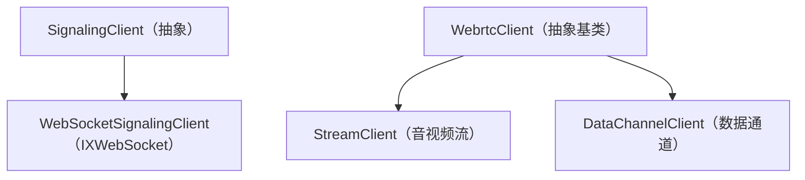
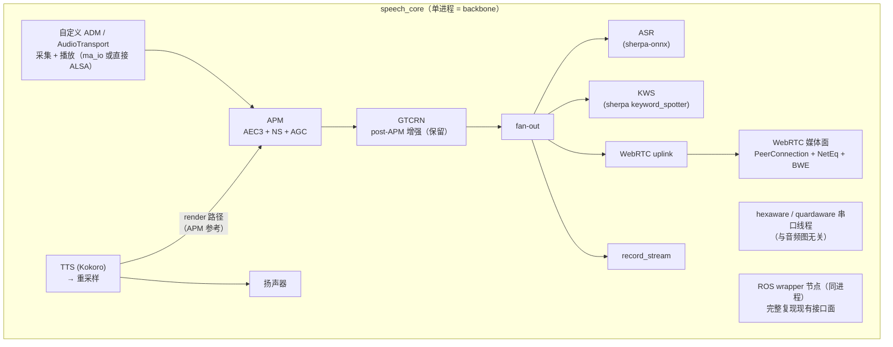

# WebRTC 通览：协议原理、机器人/ROS 实践与 libwebrtc 重构

> 本文是一份**通览级**文档，把三条线索合并成一张完整地图：
>
> 1. **协议原理** —— 基于开源电子书 [《WebRTC for the Curious》](https://webrtcforthecurious.com/zh/)（CC0，实现者所著，协议/API 视角的系统综述）。
> 2. **机器人与 ROS 实践** —— 基于 [opentera-webrtc 生态分析](./opentera-webrtc_机器人遥操作音视频流框架分析.md)（IntRoLab 的 libwebrtc 原生封装 + ROS 2 集成层），并补充其他 ROS/机器人方案。
> 3. **本项目重构** —— 回到 `chenxing_agent_ros` 语音模块，评估「以 libwebrtc 为音频/媒体 backbone、单进程、保持 `speech_interface` 向前兼容」的重构。
>
> **来源边界（务必牢记）**：《WebRTC for the Curious》**只讲协议与 W3C API 语义**，**明确不覆盖 libwebrtc（Chromium C++ 实现）的内部结构与线程模型**。因此本文第一、二部分的协议结论可引它；**第四部分涉及 libwebrtc 内部（三线程、ADM、APM、NetEq）的内容来自另一路源码/官方 g3doc 调研**，不能归因于该书。
>
> 访问日期：2026-09-11。规范与实现版本迭代快，引用时请核对最新版。

---

## 目录

- [第一部分：WebRTC 是什么](#第一部分webrtc-是什么)
- [第二部分：协议逐层精讲](#第二部分协议逐层精讲)
  - [2.1 信令与 SDP](#21-信令与-sdp)
  - [2.2 连接：ICE / STUN / TURN](#22-连接ice--stun--turn)
  - [2.3 安全：DTLS / SRTP](#23-安全dtls--srtp)
  - [2.4 实时网络基础](#24-实时网络基础)
  - [2.5 媒体通信：RTP/RTCP 与拥塞控制](#25-媒体通信rtprtcp-与拥塞控制)
  - [2.6 数据通信：SCTP / DataChannel](#26-数据通信sctp--datachannel)
  - [2.7 应用场景与拓扑](#27-应用场景与拓扑)
  - [2.8 调试与延迟测量](#28-调试与延迟测量)
  - [2.9 历史与常见问题](#29-历史与常见问题)
- [第三部分：机器人与 ROS 生态中的 WebRTC 实践](#第三部分机器人与-ros-生态中的-webrtc-实践)
- [第四部分：回到 chenxing_agent_ros —— libwebrtc 重构评估](#第四部分回到-chenxing_agent_ros--libwebrtc-重构评估)
- [第五部分：参考、常量与术语](#第五部分参考常量与术语)

---

## 第一部分：WebRTC 是什么

### 1.1 一句话定位

**WebRTC 既是协议，也是 API。**

- **WebRTC 协议**：两个 WebRTC Agent 协商**双向、安全、实时**通信的一组规则，由 **IETF rtcweb 工作组**维护。
- **WebRTC API**：开发者使用协议的接口，目前标准只有 **W3C** 定义的 JavaScript 版（WebRTC 1.0，2021-01-26 Recommendation）。

类比：**WebRTC 协议 ≈ HTTP；WebRTC API ≈ Fetch API**。协议可被任何语言实现（C++/C/Go/Java/Python/Rust/TypeScript…），各实现通过同一协议互通。

### 1.2 核心设计哲学（全书反复强调）

1. **组合而非重造**。WebRTC 是既有技术的**组合与配置**：信令用 SDP、连接用 ICE/STUN/TURN、安全用 DTLS/SRTP、媒体用 RTP/RTCP、数据用 SCTP。"WebRTC Agent 只是许多不同协议的协调器。"
2. **信令刻意不放进标准**。信令标准化已由 SIP 等解决，重新标准化会政治化且无增值，因此**必须由应用带外（out-of-band）自行解决**（REST/WebSocket/认证代理等）。
3. **强制加密、默认安全**。每个连接都经过身份验证和加密，加密不是可选项。
4. **UDP 是 NAT 穿透的基础**。没有 NAT 穿透就没有 P2P；NAT 穿透依赖 UDP；UDP 不保证送达，因此**可靠性与重传在用户层（RTP/SCTP）实现**。
5. **一切围绕"实时"权衡**。延迟 vs 质量、可靠 vs 低延迟，协议只提供工具（NACK/FEC/PLI/JitterBuffer/拥塞控制），策略交给上层。
6. **协议与编解码器解耦**。传输层可承载"还不存在的格式"。
7. **数据与媒体分治**。媒体用 RTP（有损、实时），数据用 SCTP/DataChannel（可靠/顺序可配置）。

### 1.3 四阶段模型

WebRTC 连接被拆为**四个顺序阶段**，前一步必须 100% 成功，下一步才能开始：

```
信令(Signaling) → 连接(Connecting) → 安全(Securing) → 通信(Communicating)
   SDP/带外        ICE/STUN/TURN      DTLS/SRTP        RTP(媒体) / SCTP(数据)
```

- **信令**：让 peer 互相找到、协商会话。交换候选 IP/端口、流数量、编解码器、`uFrag`/`uPwd`、**证书指纹**。通常带外（WebSocket 最常见）。
- **连接**：ICE 做 NAT 穿透，建立双向连接（"无需中央服务器即可直接连接"）。
- **安全**：在 ICE 连接上做 **DTLS 握手**；与 HTTPS 不同，**不用 CA**，而是比对 DTLS 证书与**信令中共享的指纹**；DataChannel 走 DTLS，媒体用 **SRTP**，其密钥从 DTLS 会话导出。
- **通信**：RTP 交换 SRTP 加密的媒体；SCTP 收发 DTLS 加密的 DataChannel 消息。

### 1.4 协议地图

| 层 | 协议 | 作用 |
|---|---|---|
| 信令 | SDP（RFC 8866）+ JSEP（RFC 8829） | 会话描述与协商 |
| 连接 | ICE（RFC 8445）、STUN（RFC 8489）、TURN（RFC 8656） | NAT 穿透与连通 |
| 安全 | DTLS（RFC 6347/9147）、SRTP（RFC 3711） | 加密与密钥导出 |
| 媒体 | RTP/RTCP（RFC 3550） | 实时音视频传输与反馈 |
| 数据 | SCTP（RFC 4960→9260）+ DCEP（RFC 8832） | DataChannel |

### 1.5 API ↔ 协议映射（建立心智模型）

| JS API | 底层发生了什么 |
|---|---|
| `new RTCPeerConnection` | 创建最顶层 WebRTC 会话，所有子系统被创建，但此时什么都不发生 |
| `addTrack` | 创建一条新 **RTP 流**并生成随机 **SSRC**；`createOffer` 时放入一个 media section。每次调用 = 一个新 SSRC + 一个 media section |
| `createDataChannel` | 无 SCTP 关联时创建一条 **SCTP 流**。SCTP 默认不启用，只有一方请求数据通道才启动 |
| `createOffer` | 生成会话描述；**对本地 Peer 不产生任何改变** |
| `setLocalDescription` | **提交**所有请求的更改（`addTrack`/`createDataChannel` 在调用前都是"临时的"）；通常随后把 offer 发给远端 |
| `setRemoteDescription` | 把远端 offer 通知本地 Agent —— JS API 传递信令的方式 |
| `addIceCandidate` | 随时添加远端 ICE 候选；只作用于 ICE 子系统 |
| `ontrack` | 收到远端 RTP 包时触发；用 SSRC 找关联的 `MediaStream`/`Track` |
| `oniceconnectionstatechange` | ICE Agent 状态变化（网络连/断） |
| `onconnectionstatechange` | **ICE + DTLS 状态组合**，两者都成功时通知 |

---

## 第二部分：协议逐层精讲

### 2.1 信令与 SDP

#### SDP 基础

- 定义于 **RFC 8866**；**key/value 协议，每行一个值**，类似 INI。每行以**单个字符为 key**，后跟 `=`。
- 一个会话描述含 **0 个或多个媒体描述**（"媒体描述数组"）。一个媒体描述通常映射一条媒体流：3 路视频 + 2 路音频 = 5 个媒体描述。

#### WebRTC 只用 SDP 的一个子集（JSEP 决定）

需掌握的 7 个 key：

| key | 含义 | WebRTC 约定 |
|---|---|---|
| `v` | Version | `0` |
| `o` | Origin（唯一 ID，用于重新协商） | — |
| `s` | Session Name | `-` |
| `t` | Timing | `0 0` |
| `m` | Media Description | `m=<media> <port> <proto> <fmt>...` |
| `a` | Attribute（自由文本，**最常见**） | — |
| `c` | Connection Data | `IN IP4 0.0.0.0` |

媒体描述示例：

```
v=0
m=audio 4000 RTP/AVP 111
a=rtpmap:111 OPUS/48000/2
m=video 4000 RTP/AVP 96
a=rtpmap:96 VP8/90000
```

#### Offer/Answer 与 Transceiver

- 发起方发 **Offer**，接受方回 **Answer**；应答者有机会**拒绝不支持的编解码器**。
- **Transceiver（收发器）** 把媒体描述暴露给 JS API；每个媒体描述含 **direction**：`send` / `recv` / `sendrecv` / `inactive`。

#### WebRTC 用到的关键 SDP 属性

| 属性 | 作用 |
|---|---|
| `group:BUNDLE` | 在**单个连接**上传输多种类型流量（**首选**） |
| `fingerprint:sha-256` | DTLS 证书哈希；握手后比对，确认通信对象 |
| `setup:` | DTLS 角色：`active`（客户端）/`passive`（服务器）/`actpass`（对方选） |
| `mid` | 每个媒体描述的唯一 ID |
| `ice-ufrag` / `ice-pwd` | ICE 身份验证 |
| `rtpmap` | 编解码器 ↔ RTP 有效负载类型（**PT 是动态的**，每次呼叫由发起者确定） |
| `fmtp` | 某 PT 的附加参数（视频 profile、编码器设置） |
| `candidate` | ICE 候选地址 |
| `ssrc` | 同步源；`label` 是流 ID，`mslabel` 是容器 ID |

真实 Chrome SDP 还会出现 `a=rtcp-mux`、`a=rtcp-rsize`、`a=fmtp:111 minptime=10;useinbandfec=1`、`a=sendrecv`、`a=end-of-candidates` 等。读懂它即可读懂任意 WebRTC SDP。

### 2.2 连接：ICE / STUN / TURN

#### 为什么需要专用连接子系统

P2P 创建连接的任务**均分给双方**，因为**无法预先猜测传输地址（IP+端口）**，且会话中地址可能变化。难点：不同网络、UDP↔TCP、IPv4↔IPv6。收益：降低带宽成本、更低延迟、端到端安全。

#### NAT 映射（WebRTC 连接的魔法）

- **映射创建**：把数据包发到网络外部地址时，NAT 分配临时公网 IP+端口，出站源地址被重写；发回该映射的包被路由回创建者（自动端口转发）。
- **映射创建行为**（RFC 4787）：
  1. **端点无关（Endpoint-Independent）**：所有发送者只创建一个映射 —— **最好的情况；要建立呼叫，至少一侧必须是这种类型**。
  2. **地址相关（Address-Dependent）**：每个新远程**地址**一个新映射。
  3. **地址和端口相关**：远程 IP **或端口**不同就新建。
- **映射过滤行为**：端点无关 / 地址相关 / 地址和端口相关（决定谁能用该映射发回来）。
- **映射刷新**：通常 **5 分钟未使用则销毁**（取决于 ISP/硬件）。

#### STUN（RFC 8489）

- 作用：**以编程方式创建 NAT 映射，并获知映射的 IP/端口**。
- 报文：`Binding Request = 0x0001`，`Binding Response = 0x0101`；**Magic Cookie = `0x2112A442`**；**Transaction ID = 96 bit**。
- 响应含 **`XOR-MAPPED-ADDRESS (0x0020)`**，即你的 NAT 映射地址（别名 **公网 IP / Server Reflexive Candidate**）。
- **RFC 5780** 定义探测 NAT 类型的方法，可提前判断能否直连。

#### TURN（RFC 8656）

- 当两侧 NAT 不兼容或协议不同时，用**中继服务器**代理；也可用于隐藏真实地址。
- **Allocation**：TURN 会话；客户端连 TURN（通常端口 **3478**）创建，获得临时 `IP/端口/协议` 三元组（**Relayed Transport Address**）。
- 成功响应含 `XOR-MAPPED-ADDRESS`、`RELAYED-ADDRESS`、`LIFETIME`（可用 `Refresh` 延长）。
- **Permission**：告知 TURN 服务器允许哪些远端 IP/端口发入站；**未刷新 5 分钟过期**。
- 发数据两种消息：`SendIndication`（自包含，大量消息昂贵）与 `ChannelData`（先建 Channel，用 `ChannelId` 发送，更优）。
- 用法：**单 TURN Allocation** 或**双重 TURN Allocation**（双方都只能 TCP 连 TURN）。

#### ICE（RFC 8445）

- 确定两个 peer 间所有可能路由：**Candidate Pair（候选地址对）= 本地地址 + 远程地址**。连通性检查用 **STUN**（ICE ping）。
- **角色**：`controlling`（控制方，通常发 offer 的一方）与 `controlled`；控制方决定选哪个候选对。
- 每方有 **ufrag**（明文，用于多 ICE 会话解复用）与 **pwd**（生成 `MESSAGE-INTEGRITY`，验证包未被篡改）。
- **候选类型**：
  1. **Host**：本地接口直接侦听。
  2. **mDNS**：隐藏 IP，只给对方 UUID；同网可找到彼此（隐私用途）。
  3. **Server Reflexive (srflx)**：对 STUN 做 Binding Request 得到。
  4. **Peer Reflexive (prflx)**：远端从本端请求中"反射"回的本端地址。
  5. **Relay**：经 TURN 得到。
- **流程**：收集 → 交换 → 配对（每边 3 候选 → 9 对）→ 双向发流 → 有效候选对 → 控制方**提名** → 双向确认 → **选定候选对**。
- **重启**：选定对失效（映射过期、TURN 崩溃）→ ICE 失败 → 可重启重跑全过程。

### 2.3 安全：DTLS / SRTP

#### 安全保证与其边界

- **保证**：每个连接都经身份验证和加密；第三方看不到内容、无法插入虚假消息；可确认对方正是生成会话描述的 Agent。
- **边界（关键）**：**WebRTC 无法防止会话描述被篡改**。攻击者可改 ICE 候选和证书指纹做 **MITM**。**信令本身的安全不在 WebRTC 范围内**，必须应用层解决。

#### DTLS（RFC 6347/9147）

- = **基于 UDP 的 TLS**；区别仅在传输层用 UDP，需处理不可靠传输。
- 报文头：**内容类型** `20` Change Cipher Spec / `22` Handshake / `23` Application Data；**版本** `0x0000feff`(1.0) / `0x0000fefd`(1.2)，**无 1.1**；**Epoch** 从 0 开始，CCS 后为 1（非零时段加密）；**序列号**递增，Epoch 增加时重置。
- **握手状态机**（分 Flight，收齐一个 Flight 才完成）：ClientHello（含 cipher 列表与随机数，**WebRTC 在此选择 SRTP cipher**）→ HelloVerifyRequest（防 DoS，客户端带令牌重发）→ ServerHello → Certificate → ServerKeyExchange/ClientKeyExchange → CertificateRequest → ServerHelloDone → CertificateVerify → ChangeCipherSpec → Finished（加密，含所有消息哈希，断言握手未被篡改）。
- **密钥生成**：Diffie-Hellman 交换得 **Pre-Master Secret** → 按版本 PRF（DTLS 1.2 用 Pre-Master + ClientHello/ServerHello 随机值）得 **Master Secret**，作为 Cipher 密钥。

#### SRTP（RFC 3711）

- 专为加密 RTP 设计；**无握手机制**，密钥与配置在 DTLS 握手期间生成，经 **RFC 5705** 导出。
- 每个 RTP 包有 **16 位 Sequence Number**，滚动累加形成 **rollover counter**；加密用**rollover counter + 序列号作 nonce**，确保同一数据两次发送密文不同，阻止模式识别与重放。

### 2.4 实时网络基础

#### 网络关键属性

- **带宽**：非静态，随使用者变化。
- **传输时间 / RTT**：跨主机时钟难同步，故用 **RTT = sendertime2 − sendertime1**；传输时间 ≈ RTT/2（蜂窝常不对称）。
- **抖动**：包传输时间不同；包可能延迟后集中到达。
- **MTU**：单包大小限制；可用 **MTU 路径发现（RFC 1191）**。
- **拥塞**：网络达极限，通常丢多余包，或缓存导致传输时间增加、抖动变大。
- **动态变化**：必须**持续评估**，不能只在启动时测量。

#### 丢包四法

| 方法 | 机制 | 特点 |
|---|---|---|
| ACK | 每收一个就确认 | 简单 |
| SACK | 一次确认多个并告知间隔 | 减少往返 |
| NACK | 接收方通知"丢了什么" | 发送方只知重发哪些 |
| FEC | 抢先发冗余数据（Reed–Solomon） | 适合稳定丢包/低延迟；零损网络浪费带宽 |

#### 抖动：JitterBuffer

- 每个包到达立即入缓冲；有足够包重建帧后释放给解码器；**容量有限，停留过久被丢弃**。
- `jitterBufferDelay` 是接收方入站流指标：帧在发给解码器前在 JitterBuffer 中花的时间；**较长意味着网络高度拥塞**。

#### 拥塞检测与解决

- 控制器输入：**丢包、抖动、RTT、ECN**。
- 解决：**降速**（给带宽估计限速）与**减少发送数据**（实时媒体需编码器与控制器紧密反馈，降视频质量）。

### 2.5 媒体通信：RTP/RTCP 与拥塞控制

#### RTP/RTCP 基础（RFC 3550）

- **RTP**：承载媒体，提供流设计（一个连接多个源）与计时/排序；**不规定延迟/可靠性规则**。
- **RTCP**：传呼叫元数据，用于统计、丢包处理、拥塞控制，提供响应网络变化的双向通信。

#### RTP 包格式要点

| 字段 | 含义 |
|---|---|
| V | 版本，总是 `2` |
| P | Padding |
| X | Extension（有扩展段） |
| CC | CSRC 数量 |
| M | Marker，**无预设含义**，常用于讲话或标记关键帧 |
| PT | Payload Type，**WebRTC 中动态**，每次呼叫由 offerer 确定 |
| Sequence Number | 每包 +1，用于检测丢包 |
| Timestamp | **不是全局时钟**，是当前媒体流经过的时间；同帧多包可同时间戳 |
| SSRC | 流的唯一标识，允许一个 RTP 流承载多个媒体流 |
| CSRC | 参与的 SSRC，常用于**语音指示器** |
| Payload | 实际数据 |

#### RTCP 包格式与类型

- 头含 V/P/RC（报告数）/PT/length。
- 常见 PT：`192` FIR、`193` NACK、`200` SR、`201` RR、`205` Generic RTP Feedback、`206` Payload-Specific Feedback。

#### FIR 与 PLI

- 都请求**完整关键帧**。
- **PLI**：解码器拿到部分帧无法解码时（大量丢包/解码器崩溃），属于 Payload-Specific Feedback。
- **FIR**：按 RFC 5104 §4.3.1.2，**丢包/丢帧不应使用 FIR（那是 PLI 的任务）**；FIR 用于丢包以外的原因（如新成员加入需完整关键帧）。
- 实践：**连接建立后立即请求完整关键帧**，降低首帧显示延迟。

#### NACK

- 请求重发**单个 RTP 包**；用 **SSRC + 序列号**制作；比整帧重传带宽效率高得多；发送方无缓存则忽略。

#### SR/RR 与 RTT 计算

- RR 字段：**Fraction Lost、Cumulative Packets Lost、Extended Highest Sequence Number、Interarrival Jitter、Last SR Timestamp**。
- RTT：发送方在 SR 带 `sendertime1`，接收方回 RR 含 `sendertime1` 与 **DLSR**：
  ```
  rtt = sendertime2 - sendertime1 - DLSR
  ```
  例：4:20:42.420 发出，处理延迟 5ms，4:20:42.690 收到 → RTT = 690−420−5 = **265ms**。

#### 自适应码率与带宽估计（三种方法）

**方法一：RR/SR** —— 发送方根据 RR 的丢包率评估可用带宽。

**方法二：GCC + TMMBR/TMMBN/REMB**（接收端估计）
- **GCC（Google Congestion Control，draft-ietf-rmcat-gcc-02）** 两个联动控制器：
  - **基于丢失**：丢包 **>10% 降；2–10% 平；<2% 升**；约 **1 秒**窗口。
  - **基于延迟**：看包到达间隔变化，**在丢包前**通过 RTT 微增推断队列深度增长；用 **Kalman 滤波**改进延迟测量；拥塞时降码率，稳定时缓慢增加试探。
- **TMMBR/TMMBN**（RFC 5104）与 **REMB**（draft-alvestrand-rmcat-remb，**从未标准化**）：接收方把估计值传回发送方。
- **REMB 实践缺陷**：编码器不保证输出精确目标码率，可能形成**码率螺旋下降**（设 1000 → 实际 700 → 接收方建议 756 → 实际更低 → …），用户看到"连接良好但画质极差"。

**方法三：TWCC（Transport Wide CC，draft-holmer-rmcat-transport-wide-cc-extensions-01，从未标准化）**
- 接收方把**每个包的到达时间**告诉发送方；发送方测量包间到达延迟变化，用 GCC 类算法调整输出带宽。
- 可视为 **SR/RR + REMB 的混合**；最大贡献是**把拥塞控制整合到发送端**，客户端代码简单、算法可在自有 SFU 上快速迭代。

- 其他估计器：**NADA**、**SCReAM**。

### 2.6 数据通信：SCTP / DataChannel

#### 能力

- 两个 peer 间最多 **65534** 个数据通道；基于**数据报**；**默认保证有序交付**；可配置为像 UDP 一样**无序/有损**；可测量**背压**。

#### 工作原理

- 用 **SCTP（RFC 4960→9260）**，在 WebRTC 中作为**运行在 DTLS 之上的应用层协议**。
- 数据通道是 SCTP **流**的抽象；通道标签等 SCTP 无法表达的信息用 **DCEP（RFC 8832）** 传递。

#### DCEP

- 两条消息：`DATA_CHANNEL_OPEN`（Message Type `0x03`）与 `DATA_CHANNEL_ACK`。
- **Channel Type**（控制持久性/顺序）：
  - `0x00` RELIABLE（无丢失、依序）
  - `0x80` RELIABLE_UNORDERED
  - `0x01` PARTIAL_RELIABLE_REXMIT（按次数重试，依序）
  - `0x81` PARTIAL_RELIABLE_REXMIT_UNORDERED
  - `0x02` PARTIAL_RELIABLE_TIMED（按时间重试，依序）
  - `0x82` PARTIAL_RELIABLE_TIMED_UNORDERED
- **Priority**：高优先级先调度；**Reliability Parameter**：REXMIT 次数上限 / TIMED 时间上限；**Label**（UTF-8）/ **Protocol**。

#### SCTP 概念

- **Association（关联）**：SCTP 会话状态；**Stream（流）**：双向序列，每流可配不同可靠性（**WebRTC 只允许创建时配置**）。
- **基于数据报**：单条消息可达几个 GB。
- **Chunk（块）**：协议基本单位；一个 UDP 包可含多个块。
- **TSN**：DATA 块全局唯一标识，递增 **32-bit**（回绕 4,294,967,295）。
- **Stream Sequence Number**：以**用户消息**为粒度，递增 **16-bit**（回绕 65535）。
- **PPID**：WebRTC 只用 5 种 —— `50` DCEP / `51` String / `53` Binary / `56` StringEmpty / `57` BinaryEmpty。

#### 主要块类型

| Type | 块 | 作用 |
|---|---|---|
| 0 | DATA | 用户数据（U/B/E 位支持分片） |
| 1 | INIT | 创建关联（Initiate Tag、a_rwnd、流数、Initial TSN） |
| 3 | SACK | 选择性确认（Cumulative TSN Ack + Gap Ack Blocks + Duplicate TSN） |
| 4 | HEARTBEAT | 保活，**保持 NAT 映射打开** |
| 6 | ABORT | 突然关闭 |
| 7 | SHUTDOWN | 正常关闭 |
| 9 | ERROR | 非致命错误 |
| 192 | FORWARD TSN | 前移 TSN，跳过不再关心的包（实时敏感） |

#### 状态机

- **建立**：`INIT`/`INIT ACK` 交换能力；cookie 验证（防握手拦截与 DoS）：`COOKIE ECHO` → `COOKIE ACK` → 可交换 DATA。
- **关闭**：`SHUTDOWN`，等待 Cumulative TSN ACK 确保不丢。**WebRTC 不能正常关闭 SCTP 关联，需自行关闭所有数据通道。**
- **保活**：`HEARTBEAT REQUEST/ACK`，固定间隔，丢包时**指数回退**；可算两 Agent 间传递时间。

### 2.7 应用场景与拓扑

#### 用例

电话会议、广播、远程访问、文件共享与审查规避、IoT、**媒体协议桥接**（SIP/RTSP ↔ WebRTC）、**数据协议桥接**（浏览器 SSH）、**远程操作（Teleoperation）**、分布式 CDN。

#### 拓扑

| 拓扑 | 特点 |
|---|---|
| 一对一 | 两 Agent 直连，双向媒体与数据 |
| 全网格 Full Mesh | 每人与其他所有直连；需**为每个成员独立编码上传**；错误处理难；**适合小群组** |
| 混合网格 Hybrid Mesh | 媒体经 peer 转发；减少创建者带宽；但创建者不知送达情况，每跳增延迟 |
| **SFU（选择性转发单元）** | 每 peer 连 SFU 上传一次，SFU 转发；连接容易；"**简单 SFU 一个周末可做，高质量 SFU 是永无止境的**" |
| MCU（多点会议单元） | 类似 SFU，但**组合/重编码为聚合流**再分发 |

### 2.8 调试与延迟测量

#### 分而治之

按子系统定位：**信令 / 网络 / 安全 / 媒体 / 数据故障**。

#### 用 netcat 测 STUN

- 20 字节 Binding Request：`00 01`（类型）+ `00 00`（长度）+ `21 12 a4 42`（magic cookie）+ 12 字节 transaction ID。
- 期望 32 字节响应，数据段含 `XOR-MAPPED-ADDRESS`。
- 技巧：用伪 magic cookie `00 00 00 00` 让服务器执行"伪 XOR"（XOR 幂等）→ 响应中端口/IP 明文可见（部分路由器会篡改，不总有效）。

#### 工具

`netcat`、`tcpdump`（`-xx` 十六进制 / `-w stun.pcap`）、`Wireshark`；浏览器：Chrome `chrome://webrtc-internals`、`chrome://webrtc-logs`，Firefox `about:webrtc`；**rtcStats**（大规模会话采集分析）。

#### 端到端延迟

- `EndToEndLatency = T(observe) − T(happen)`；**不是各组件延迟的简单叠加**。
- **手动测量**：相机对准毫秒时钟 → 推流到同地接收方 → 手机拍下"时钟 + 屏幕视频"同一画面 → 相减。书中实测 **101ms**。
- **自动测量**：接收方通过数据通道建模发送方单调时钟（每 2 秒发 `performance.now()`，发送方回 `received_time`/`delay_since_received`/`local_clock`/`track_times_msec`），用 `requestVideoFrameCallback` 的 `rtpTimestamp`（RTP 时基 90000）算延迟。**缺陷：不含相机内部延迟。**
- **各段延迟**：相机（自动曝光/对焦/白平衡，单帧可能远超 33ms）、编码（避免 B 帧，x264 `tune=zerolatency` + `profile=baseline`）、网络（RTT 是下限；`nackCount`/`pliCount` 指示丢包）、接收方（`jitterBufferDelay`）。

### 2.9 历史与常见问题

- **RTP 历史**：Ron Frederick 1992 年的网络视频会议工具 **nv**（目标 128 kbps ISDN，约 1/20 压缩，专利 US5485212A）演化为 RTP（RFC 1889→3550）。WebRTC 时代**全是单播**（多播未普及）。RTP 未更广泛采用的主因是**太复杂（尤其 RTCP）**，而带宽不再稀缺时很多人直接用 TCP/HTTP。
- **WebRTC 历史**：Serge Lachapelle 的 Marratech（2007 被 Google 收购）；Gmail 语音/视频（音频 GIP、视频 Vidyo、网络 libjingle，API 各异，负责人 Justin Uberti）；Chrome 摒弃 NPAPI、采用沙盒；Google 开源 On2 与 GIPS；2010 年 Maastricht 午餐会促成标准化；**有意避免重新标准化信令**。
- **FAQ**：为什么 UDP（NAT 穿透需要）；数据通道上限 65534；有拥塞控制；可发二进制；延迟未调优 **<500ms**、调优可 **<100ms**；无序交付用于"新信息淘汰旧信息"；数据通道可发音视频（需自行解码）。

---

## 第三部分：机器人与 ROS 生态中的 WebRTC 实践

> 本部分基于对 [introlab/opentera-webrtc](https://github.com/introlab/opentera-webrtc)（基础层）与 [introlab/opentera-webrtc-ros](https://github.com/introlab/opentera-webrtc-ros)（ROS 2 集成层）的详细分析（见[同目录分析文](./opentera-webrtc_机器人遥操作音视频流框架分析.md)），并补充其他方案。机构为舍布鲁克大学 IntRoLab，Apache 2.0（注意默认 libwebrtc 含非自由编解码器）。

### 3.1 为什么机器人端不能只用浏览器那套

机器人端需要**细粒度控制码流、编解码器选择、嵌入式平台（Jetson）硬件加速**。OpenTera WebRTC 提供五大件：**signaling-server（Python/aiohttp）**、**opentera-webrtc-native-client（C++14，libwebrtc 封装）**、**GStreamer 编解码工厂**、**pybind11 Python 绑定**、**JS Web 客户端**。

### 3.2 架构第一原则：信令与媒体分离


中心服务器只做"撮合"（房间、SDP/ICE 转发），媒体协商完成后 P2P 直连 —— 服务器压力小、延迟低。这是 WebRTC 的标准范式；opentera 的价值在于**把原生端与浏览器端统一到同一套信令协议**。

### 3.3 信令协议 v2（最值得学习）

- 消息格式 `{ "event": "事件名", "data": {...} }`；`PROTOCOL_VERSION = 2`（两端硬校验）。
- 客户端→服务器：`join-room`、`send-ice-candidate`、`call-peer`、`make-peer-call-answer`、`call-all`、`call-ids`、`close-all-room-peer-connections`。
- 服务器→客户端：`join-room-answer`、`room-clients`、`peer-call-received`、`peer-call-answer-received`、`ice-candidate-received`、**`make-peer-call`**、`close-all-peer-connections-request-received`。
- **防呼叫风暴**：客户端只发 `call-ids`，服务器用 `itertools.combinations(ids, 2)` 计算**不重复呼叫对**并下发 `make-peer-call`，把 O(N²) 协调集中到一处。
- 服务器实现要点：`room_manager.py` 四字典 + 懒初始化 `asyncio.Lock`（必须事件循环内创建）；超时 `PING_INTERVAL_S=10`、`INACTIVE_DELAY_S=5`、`DISCONNECT_DELAY_S=1`；安全：全局口令、协议版本校验、CORS/COOP 头、`/iceservers` 需 Authorization。

### 3.4 原生客户端 C++ 核心

#### 类层次（运行期多态）


通过纯虚 `createPeerConnectionHandler()` 让子类提供 handler —— **模板方法模式**。

#### 线程模型（重点）

`WebrtcClient` 管理 **4 个线程**：`m_internalClientThread`（状态主线程）、`m_networkThread`、`m_workerThread`、`m_signalingThread`。对外 API 通过 `callSync`（取状态，阻塞）与 `callAsync`（触发动作/回调）投递到内部线程。

> **重要约定**：所有回调都在**内部线程**上调用，文档反复强调 *"The callback should not block"*。这是原生 WebRTC 封装的经典陷阱 —— 与第二部分"消息传递优于加锁、回调线程不保证"完全一致。

#### 回调体系

信令层（`onSignalingConnectionOpened/Closed/Error`）、房间层（`onRoomClientsChanged`）、呼叫控制（`setCallAcceptor` 返回 bool 决定是否接听、`onCallRejected`、`onClientConnected/Disconnected/ConnectionFailed`）、`onError`/`setLogger`。`invokeIfCallable` 模板在所有事件前检查 `std::function` 是否有效。

#### 配置对象体系

六个 `XxxConfiguration` 类统一用 `create()` 静态工厂（可读性、易扩展、兼容 pybind11）：`SignalingServerConfiguration`、`WebrtcConfiguration`、`VideoStreamConfiguration`（`forcedCodecs`、硬加速开关）、`AudioSourceConfiguration`（**`soundCardTotalDelayMs`**）、`VideoSourceConfiguration`、`DataChannelConfiguration`。

#### 数据进出

推送侧 `VideoSource::sendFrame(image, ts)` / `AudioSource::send_frame(pcm)`；接收侧 `setOnVideoFrameReceived` / `setOnEncodedVideoFrameReceived` / `setOnAudioFrameReceived` / `setOnMixedAudioFrameReceived`。

#### PeerConnectionHandler

继承 libwebrtc 的 `PeerConnectionObserver` + `CreateSessionDescriptionObserver` + `SetSessionDescriptionObserver`，是 SDP/ICE 交换核心：`makePeerCall`（offer）、`receivePeerCall`（createAnswer）、`receivePeerCallAnswer`、`receiveIceCandidate`、`OnConnectionChange`、`OnIceCandidate`（捕获本地候选立刻经信令发出 —— **ICE 走信令、媒体走 P2P**）。

### 3.5 GStreamer 硬件加速层（嵌入式关键）

把 GStreamer 编解码器**注入 libwebrtc 编解码工厂链**（不改 libwebrtc 本体）。

| 平台 | VP8 | VP9 | H.264 |
|---|---|---|---|
| Jetson TX2/Nano | `nvv4l2vp8enc` | `nvv4l2decoder` | `nvv4l2h264enc` |
| Xavier NX / AGX | ✗ | `nvv4l2decoder` | `nvv4l2h264enc` |
| **Orin / Orin Nano / Orin NX** | ✗ | `nvv4l2decoder` | `nvv4l2h264enc` |
| Raspberry Pi 4 | ✗ | ✗ | `v4l2h264enc/dec` |
| VA-API (Intel) | `vaapivp8enc` | `vaapivp9dec` | `vaapih264enc` |
| Apple Media | ✗ | ✗ | `vtenc_h264` / `vtdec` |

> **结论**：嵌入式平台上 **H.264 是唯一有完整硬编硬解的选择**（VP8 在 Jetson 上无硬编，VP9 编码仍在开发）。

### 3.6 Web/JS 客户端

与原生端**完全对称的事件协议**（`join-room-answer`/`room-clients`/`make-peer-call`/… 一字不差），`StreamClient`/`DataChannelClient`/`StreamDataChannelClient` 对应 C++ 端。**定义一次协议，三端实现**。

### 3.7 ROS 2 集成层（9 个包）

| 包 | 职责 |
|---|---|
| **opentera_webrtc_ros** | 核心桥接：流节点、数据通道、JSON 指令分发 |
| opentera_webrtc_ros_msgs | 24 个消息（Peer*/OpenTeraEvent/Waypoint/Label） |
| opentera_client_ros | 连 OpenTera 云平台，接收云端呼叫事件 |
| opentera_protobuf_messages | 与平台通信的 protobuf |
| opentera_webrtc_robot_gui | 机器人触屏 GUI（Qt5） |
| opentera_webrtc_demos | Gazebo 演示 |
| map_image_generator | 地图/激光/位姿渲染成 2D 图像推流 |
| face_cropping | 人脸检测裁剪（隐私 + 带宽） |
| turtlebot3_beam_description | URDF |

#### 核心设计：RosWebRTCBridge 模板基类

543 行模板基类把 ROS 节点与 WebrtcClient 嫁接：`template<typename T> class RosWebRTCBridge : public rclcpp::Node`，`static_assert(std::is_base_of<WebrtcClient, T>)`。**基础库用虚工厂（运行期多态），集成层用模板参数（编译期多态）** —— 因为节点类型编译期已知，省虚函数开销、可内联回调。

#### 双向事件桥与云端会话模型

ROS 侧订阅 `events` → 触发 `connect()/disconnect()`；发布 `webrtc_peer_status` ← 回调。云端事件是完整的**会话状态机**（`OpenTeraEvent` → `DatabaseEvent`/`DeviceEvent`/`JoinSessionEvent`/`ParticipantEvent`/`StopSessionEvent`…），不是简单 P2P 呼叫。

#### RosStreamBridge 音视频双向桥

订阅 `ros_image`/`audio_in`，发布 `webrtc_image`/`webrtc_audio`/`audio_mixed`。参数含四路能力开关 `can_send/receive_audio_stream`、`can_send/receive_video_stream`（收流端不构造发送源，省内存）。**音频处理参数直接透传 WebRTC**：`soundCardTotalDelayMs`（**AEC 参考信号对齐关键**）、`echoCancellation`、`autoGainControl`、`noiseSuppression`、`highPassFilter`、`stereoSwapping`、`transientSuppression`。

#### 遥操作协议：JSON over DataChannel

`velCmd{x,yaw}` → `geometry_msgs/Twist` → `cmd_vel`；`waypointArray` → 多点导航；`action: dock/localizationMode/mappingMode/setMovementMode` → 服务；`micVolume/volume`、`enableCamera`、`changeMapView`、标签管理。**安全设计**：前端发 **−1.0~1.0 归一化值**，节点侧乘 `linear_multiplier`(0.15) 才变实际速度 —— **"最大速度"永远由被控端决定**。

#### 其他巧思

- **map_image_generator**：不做 3D 可视化，把地图/激光/位姿/路径/声源画成一张 2D 图推流，**浏览器端无需 RViz**（牺牲交互性换实现与带宽成本）。
- **face_cropping**：远程康复隐私保护，在**推流源头**裁剪人脸（而非客户端模糊）。模型对比：Haar 级联 220% CPU 且 AP 低；自研 `small_yunet_0.5_320` 仅 **20% CPU** 达 **0.80 AP@0.5**（知识蒸馏 + SimOTA）。
- **时间戳透传**：`RosVideoSource` 用 `msg->header.stamp` 而非本地时钟，保证多路流时间一致。

### 3.8 设计启示（可直接复用）

1. **信令与媒体分离**是第一原则。
2. **跨语言协议统一**降低心智负担。
3. **线程边界显式化**：API 用 `callSync`/`callAsync` 包裹；回调标注 "should not block"。
4. **配置对象 + 静态工厂**。
5. **抽象基类 + 虚工厂**（模板方法）。
6. **硬件加速抽象成"工厂注入"**，平台差异收敛在编解码器实现里。
7. **服务器防呼叫风暴**。
8. **懒初始化 asyncio.Lock**。
9. **编译期多态 vs 运行期多态**的取舍。
10. **安全边界前移到机器人侧**（归一化输入）。
11. **用图像流替代 3D 可视化客户端**。
12. **推流链路上做隐私过滤**（源头裁剪）。
13. **时间戳必须透传源头**。

### 3.9 局限与适用判断

- **VP9 硬编码缺失**，嵌入式实际只能用 H.264。
- 基础库最后提交 2025-04，活跃度下降（ROS 仓库仍在开发）。
- 信令服务器功能朴素：**无持久化、无细粒度鉴权**（仅全局口令）。
- 云端会话依赖 OpenTera 平台；不接入时只能 stand-alone。
- **构建链重**（预编译 libwebrtc + protobuf + RTAB-Map + Qt5 + GStreamer）。
- 部分组件自认未完成（robot_gui "unfinished"、VP9 编码开发中）。

| 场景 | 建议 |
|---|---|
| 嵌入式机器人 ↔ 浏览器低延迟音视频遥操作 + 硬件编码 | ✅ 最完整的开源方案之一 |
| 语音交互 + 声源定位（ODAS 集成） | ✅ 有现成集成 |
| ROS 2 云端远程诊疗/运维 | ✅ 完整参考 |
| 只需传数据（无音视频） | ❌ 用 WebSocket/MQTT |
| 需要 VP8/VP9 硬编 | ❌ 只有 H.264 |
| 轻量/快速集成 | ❌ 构建链太重 |

### 3.10 其他 ROS / 机器人 WebRTC 方案

- **NVIDIA Jetson Linux 官方 WebRTC 框架**：提供 aarch64 `libwebrtc.a` + `NvVideoEncoderFactory`（H.264 硬编），绑定老 JetPack。
- **RobotWebTools/webrtc_ros**：ROS 1（catkin），仅视频，已停更（2023）。
- **aiortc**：Python 实现，有 ROS 2 示例（`nicolecll/webrtc_ros2_streamer`、`jdgalviss/jetbot-ros2`），适合原型，非原生 C++ 嵌入。
- **OWT（Open WebRTC Toolkit）**：Intel 已停止维护且有安全问题，**不建议用于新产品**。
- **webrtc-sdk/libwebrtc**：C++ wrapper + CI 预编译 linux-arm64。

---

## 第四部分：回到 chenxing_agent_ros —— libwebrtc 重构评估

> 本部分为**项目专属结论**，综合本仓库现状调研 + libwebrtc 官方 g3doc/源码调研 + 架构评审。涉及 libwebrtc 内部的内容**不属于**《WebRTC for the Curious》的覆盖范围。

### 4.1 现状与痛点

当前 `src/speech`（ROS 2 Humble）为**多进程**架构：`afe` / `asr` / `kws` / `tts` / `audio_manager`（+ 独立 Python `nlu`），通过 **ALSA 虚拟设备**（`install_audio/asound.conf`：`snd-aloop` + `dmix`/`dsnoop` + `tee_playback`/`far_reference`/`clean_mic`）在进程间共享音频；WebRTC 媒体面用 **libdatachannel + 自研 Opus 打包/抖动缓冲/RTP**，内嵌在 `audio_manager`。

**痛点**：

- **进程依赖过多**：5+ 进程，每个都开 ALSA 设备；`speech.launch.py` 还依赖外部 `rms_bringup` 参数。
- **物理接口干涉过大**：多进程通过 `dsnoop`/`dmix`/`loopback` 共享设备，部署需要内核模块、udev 规则、`/etc/asound.conf`。
- **自研媒体面缺失**：无 RTCP SR/RTT、无 NACK/RTX、无 transport-cc/BWE；抖动缓冲无时钟漂移补偿；AEC 用 Speex（32–38dB），全链路**无 AGC**。
- **已发现的正确性隐患**：`PlayAudioFile` detached 线程 UAF/关停挂死、playout 线程上阻塞设备 init、上行未走 AEC（远端听到回声）、WebRTC 录音与 `record_stream` 耦合、采集无热插拔恢复。

### 4.2 为什么考虑 libwebrtc

| 维度 | 当前 | libwebrtc |
|---|---|---|
| AEC | Speex 32–38dB | **AEC3** 40–50dB，双讲/非线性更好 |
| AGC | 无 | 内置 |
| 抖动缓冲 | 自研 ~200 行，无漂移补偿 | **NetEq**（漂移补偿/变速/PLC） |
| BWE/NACK/FEC/RTCP | 无 | 全套（transport-cc、NACK/RTX、RED/ULPFEC、SR/RTT） |
| 设备干涉 | 6 进程 × ALSA 共享设备 + 内核模块 + udev | **单进程独占**，AEC 参考进程内化 |
| 延迟 | loopback 2×period + 跨进程调度 | 进程内图；APM 加 10–20ms，净持平或更好 |
| 内存 | ~1.2GB（每进程一份 ORT+模型） | 单 ORT 实例共享 |

**注意**：不是"libwebrtc 取代 AFE"，而是"**libwebrtc 取代传输 + AEC，GTCRN 保留在链上（APM 之后）**"。AEC3 的 NS 不是 DNN 增强器，GTCRN（18–22dB）对平稳噪声更好。

### 4.3 目标架构



- **wrapper 应是 backbone 进程内的一个节点**（若单独进程会重新引入要消灭的 IPC）。
- **保留独立**：`nlu_node.py`（Python/pyhanlp，无音频）；megaphone / comm / rms_bringup（本就 topic 化）。
- **故障隔离**：单进程崩溃全挂 → 用 respawn supervisor + 进程内 watchdog；若需硬兜底，可保留最小 `audio_manager` 进程只负责 `play_audio_file` + 诊断（但会重新引入 dmix 或 topic 渲染桥）。

### 4.4 libwebrtc 三线程模型与音频管线映射

> 权威来源：`g3doc/implementation_basics.md`、`api/g3doc/threading_design.md`（2026）、`pc/channel.h`、`api/sequence_checker.h`。**注意**：公开的 WebRTC Native APIs 页面已过时（只讲两线程），以源码/g3doc 为准。

**三条常驻线程**（主干，另有 pacer/audio/encoder 等额外任务队列）：

| 线程 | 职责 |
|---|---|
| `signaling_thread` | 应用调用 API（CreateOffer/SetLocalDescription/AddTrack），串行化信令状态机 |
| `worker_thread` | 媒体计算（编解码、APM、通道/RTP 打包） |
| `network_thread` | 网络 I/O（ICE、DTLS、SRTP、UDP） |

**规则**：不跨线程直接调用；用 `PostTask`/`Invoke`；对象标注线程归属（`RTC_DCHECK_RUN_ON`/`RTC_GUARDED_BY`）。**补充**：当前 API **不保证回调在哪个线程**，且**禁止在回调里再调用库函数**。

**音频管线**：

```
采集(uplink)：ADM 采集线程 → AudioTransport::RecordedDataIsAvailable
  → APM capture(AEC3/NS/AGC) → AudioSendStream → 编码(worker) → RTP(network) → 网络
播放(downlink)：网络 → network 解包 → NetEq(抖动缓冲/PLC) → 解码
  → APM render → AudioTransport::NeedMorePlayData → ADM 播放
```

**关键点**：APM 同时维护 **capture** 与 **render** 两条流；render 就是"即将播放"的信号，AEC3 拿它当回声参考。**单进程后 TTS/下行混音直接充当 render，`tee_playback`/`snd-aloop` 不再需要。**

### 4.5 关键接缝

1. **自定义 ADM + `AudioTransport`** —— 外部 PCM 进出的唯一接口：
   - `RecordedDataIsAvailable`（采集 PCM 入引擎）、`NeedMorePlayData`（引擎 PCM 出到播放），均为 **16-bit 线性交错 PCM**。
   - 推荐模式：`StartRecording()` 起采集线程，每 10ms 调前者；`StartPlayout()` 起播放线程，每 10ms 调后者。实现 `Init/Terminate`、设备枚举、音量；内置 AEC/NS/AGC 返回 unsupported（因为用 APM）。
   - 参考实现：`test/fake_audio_device.h`；轻量替代：dummy ADM + custom audio source（`webrtc-sdk` 有 patch）。
   - **注意**：ADM 有真实线程契约（采集/播放两条线程、10ms 节奏、实时安全），AFE/ROS 线程与 ADM 线程间要加环形缓冲。
2. **`PeerConnectionFactory`** —— 注入 ADM / APM / codec factory / NetEqFactory（`api/create_peerconnection_factory.h`）。
3. **信令翻译** —— 保留现有 ROS 服务，内部翻译成 `SetRemoteDescription`/`CreateAnswer`；`speech_interface` 向前兼容。

### 4.6 能否去掉 asound.conf / snd-aloop / tee_playback

**能去掉的**（它们存在的唯一理由是跨进程共享音频）：

- `tee_playback → far_reference` 整条 AEC 参考链 → 进程内 render 流替代；`aec_filter_length` 调参与 far 缓冲高水位排水逻辑全部消失。
- `clean_mic`（loopback 1,7）→ ASR/KWS/record_stream/WebRTC 上行变进程内 fan-out，**不需 dsnoop**。
- `real_mic` → 仅 ADM 读。
- **6-mic 阵列不受影响**：波束/DOA 在 hexaware/quardaware 芯片里（串口），AFE 只处理单声道 16k。
- **megaphone 不受影响**：本就 topic 化。

**需验证/处理的破坏点**：

| 破坏点 | 现状 | 处理 |
|---|---|---|
| comm server 写 `remote_mic` | 外部进程往 loopback 1,3 写网络音频 | **该通路已废弃**（用户确认），无需迁移 |
| 外部进程写 `dmix_safe` 播放 | 导航提示音等 | **改用 `/speech/play_audio_file` 或 `/speech/play_stream`**（用户确认），设备独占可接受 |
| `switch_*` 设备名语义 | `clean_mic`/`tee_playback`/`megaphone_*` | 接口保留，取值语义变化；需排查下游调用方 |
| 调试工具 | `aplay -D tee_playback` 等 | 改为暴露调试 topic/socket |
| 设备状态诊断 | 探测 ALSA 名 | 改为探测 ADM 设备；`DeviceStatus` msg 不变 |
| udev 规则 | 串口 + ALSA 两类 | 串口规则保留，ALSA 专用规则删除 |
| rms_bringup 参数 | 每节点 section | 单 wrapper 需接受同结构 YAML（或改部署契约） |

### 4.7 与 opentera 方案的对比

| 维度 | opentera-webrtc-ros | 本项目重构 |
|---|---|---|
| 目标 | 机器人 ↔ 浏览器**多端遥操作**（音视频 + 数据通道 + 云端会话） | **语音交互 + 远程对讲**，保持 ROS SDK 接口兼容 |
| 信令 | 自建 WebSocket 信令服务器（房间/云平台） | 复用现有 ROS 服务（`/speech/webrtc_signaling`），无中心服务器 |
| 编解码 | 视频为主，GStreamer 硬编（H.264） | **纯音频**，Opus |
| libwebrtc 用法 | `WebrtcClient` 封装 + Sources/Sinks + 自定义工厂 | 自定义 **ADM/AudioTransport** + APM/NetEq |
| 线程封装 | 4 线程 + `callSync`/`callAsync` | libwebrtc 三线程 + ROS 单线程 executor 桥接 |
| 音频后端 | PortAudio（`AudioSource`/`AudioSink`） | ma_io/ALSA → 自定义 ADM |
| 可借鉴 | 线程边界显式化、配置对象、硬加速工厂注入、安全边界前移、时间戳透传 | 同样适用 |

**结论**：opentera 是"**把 libwebrtc 包成 ROS 遥操作框架**"的最佳参考；本项目是"**把 libwebrtc 作为语音模块的音频 backbone**"，接缝在 ADM/AudioTransport 与信令翻译，不在视频/浏览器。

### 4.8 迁移路径与风险

**前置阻塞（已澄清）**：

- ~~onnxruntime 版本冲突~~ → **可让 GTCRN 也用 1.18.1，无本质差异**。
- ~~comm server `remote_mic`~~ → **通路已废弃**。
- ~~外部 `dmix_safe` 播放~~ → **改用 ROS action/topic**。

**剩余必须验证**：**AEC3+GTCRN 真机质量（门槛）**；libwebrtc M-stone pin + aarch64 构建；单进程 ORT 线程池是否过订阅；6-mic 原始通道数（ADM 是否需 downmix）。

**分阶段**：

- **Phase 0（1–2 周）**：修当前 must-fix（PlayAudioFile detached 线程、playout 阻塞 init、上行接 AEC、record_stream 解耦、采集热插拔）。
- **Phase 1（门槛，3–4 周）**：`speech_core` **shadow mode** 并行跑（采集→APM(AEC3)→GTCRN→发同样 topic），真机对比 AEC3+GTCRN vs Speex+GTCRN。**不达标就停在现方案。**
- **Phase 2（4–6 周）**：ASR/KWS/TTS 迁到 backbone（进程内 PCM），旧节点留 fallback，验证延迟预算。
- **Phase 3（3–4 周）**：WebRTC 媒体面迁到 libwebrtc（NetEq/BWE/NACK），保留信令/状态服务语义，用现有 aiortc E2E + `tc netem` 验证。
- **Phase 4（2–3 周）**：确认外部播放消费者后，**删除 install_audio/asound.conf/snd-aloop**。
- **Phase 5（2 周）**：进程合并、launch 重写、退役旧节点、更新文档。

**工作量估算：~7–11 人月**（libwebrtc 集成 2–3 PM 为最大单项）。**推荐增量迁移，不推荐绿地重写**（SDK 语义漂移风险、现有测试基线浪费、可复用部分本就是库）。

### 4.9 工程化速查

- **构建**：GN/ninja 产静态 `libwebrtc.a`，可被 CMake/colcon 链接（`is_component_build=false`，官方不支持 shared）。最小 args：`is_debug=false is_component_build=false rtc_include_tests=false rtc_build_examples=false rtc_use_h264=false proprietary_codecs=false ffmpeg_branding="Chromium"`。交叉编译到 aarch64 建议 x86 主机；参考 `introlab/webrtc-native-build`。
- **版本 pin**：无 semver，用 `branch-heads/<NNNN>`（M 版本）或冻结 fork（如 `webrtc-sdk/webrtc@m144_release`）；**不要追 main**；记录 commit + GN args + toolchain。
- **独立 APM**：`BuiltinAudioProcessingBuilder(config).Build(CreateEnvironment())`；capture 用 `ProcessStream`，render 用 `ProcessReverseStream`；**参考信号必须是实际将播放的信号**（含音量/混音后）、连续、与 capture 对齐；AEC3 内部做延迟估计。只想要 APM 可用 `webrtc-audio-processing`（BSD-3，aarch64 有包）。
- **独立 NetEq**：用 `DefaultNetEqFactory`（无 `NetEq::Create`）；`InsertPacket` 喂 RTP 包，`GetAudio` 取 10ms。
- **许可**：WebRTC 本体 BSD-3；DEPS 第三方各有许可；音频-only 关掉 H.264/FFmpeg/proprietary 可简化。
- **AEC3 on ARM**：NEON 覆盖不如 x86（Chromium issue 40517210），要预留 CPU，必要时 `mobile_mode=true`。
- **先例**：`introlab/opentera-webrtc-ros`（ROS 2 Humble + 原生 libwebrtc，唯一维护中）。

---

## 第五部分：参考、常量与术语

### 5.1 一手规范索引（节选）

- **WebRTC**：RFC 8825（Overview）、8826（Security）、8836（Congestion Control Requirements）、8854（FEC Requirements）；W3C WebRTC 1.0。
- **SDP/JSEP**：RFC 8866（SDP）、8829（JSEP）、8839（ICE SDP Offer/Answer）、8843（BUNDLE，被 9143 取代）、8853（Simulcast）。
- **ICE/STUN/TURN**：RFC 8445（ICE）、8489（STUN）、8656（TURN）、5780（NAT 行为发现）、8838（Trickle ICE）、8863（ICE PAC）。
- **安全**：RFC 6347 / 9147（DTLS）、3711（SRTP）、5764（DTLS-SRTP 密钥导出）。
- **RTP/RTCP**：RFC 3550、3611（RTCP XR）、4585（AVPF）、5104（AVPF 控制消息）、8285（RTP 头扩展）、8888（RTCP 拥塞控制反馈）。
- **数据**：RFC 8831/8832/8864（DataChannel/DCEP）、4960→**9260**（SCTP）、3758（部分可靠性）、8261（DTLS 封装）。
- **拥塞控制**：draft-ietf-rmcat-gcc-02（GCC）、draft-zhu-rmcat-nada-04（NADA）、draft-johansson-rmcat-scream-cc-05（SCReAM）。

### 5.2 关键常量速查

| 项目 | 数值 |
|---|---|
| SDP 版本/名称/时间 | `v=0`、`s=-`、`t=0 0` |
| STUN magic cookie | `0x2112A442` |
| STUN Binding Request/Response | `0x0001` / `0x0101` |
| STUN XOR-MAPPED-ADDRESS | `0x0020`；transaction ID 96 bit |
| TURN 端口 / 权限过期 | 3478 / 5 分钟 |
| NAT 映射建议刷新 | 5 分钟未使用销毁 |
| DTLS 版本 | `0x0000feff`(1.0) / `0x0000fefd`(1.2)，无 1.1 |
| DTLS 内容类型 | 20 CCS / 22 Handshake / 23 AppData |
| RTP 版本 | 总是 2 |
| RTCP PT | 192 FIR / 193 NACK / 200 SR / 201 RR / 205 / 206 |
| GCC 丢包阈值 | >10% 降；2–10% 平；<2% 升；~1s 窗口 |
| DCEP Message Type | `0x03` |
| DataChannel 上限 | 65534 |
| SCTP PPID | 50 DCEP / 51 String / 53 Binary / 56 StringEmpty / 57 BinaryEmpty |
| SCTP chunk type | DATA 0 / INIT 1 / SACK 3 / HEARTBEAT 4 / ABORT 6 / SHUTDOWN 7 / ERROR 9 / FORWARD TSN 192 |
| SCTP TSN / SSN | 32-bit（回绕 4,294,967,295）/ 16-bit（回绕 65535） |
| 未调优 / 调优延迟 | <500ms / <100ms |
| 未压缩 720p 30 分钟 | ~110GB |
| 本书 DIY 端到端延迟实测 | 101ms |

### 5.3 术语表（本项目口径）

**PeerConnection**：WebRTC 会话级对象，代表一条端到端连接。
**signaling_thread**：应用调用 WebRTC API 的线程，串行化信令状态机。
**worker_thread**：执行媒体计算（编解码、APM、通道/RTP）的线程。
**network_thread**：执行网络 I/O（ICE/DTLS/SRTP/UDP）的线程。
**TaskQueue**：线程上的任务队列；跨线程通过 `PostTask` 投递（消息传递替代加锁）。
**ADM (Audio Device Module)**：libwebrtc 的设备抽象层，负责采集/播放/设备枚举；可自定义注入。
**AudioTransport**：ADM 与引擎之间的 PCM 桥（`RecordedDataIsAvailable` / `NeedMorePlayData`）。
**APM (Audio Processing Module)**：含 AEC3/NS/AGC/HPF，维护 capture 与 render 两条流。
**render stream（参考流）**：即将送往扬声器的信号，AEC 的回声参考。
**capture stream（采集流）**：来自麦克风的近端音频。
**NetEq**：抖动缓冲 + 丢包隐藏 + 时间伸缩。
**AEC3**：第三代回声消除器。
**SFU / MCU**：选择性转发单元 / 多点会议单元。
**BUNDLE**：在单连接上复用多路媒体。
**TWCC / GCC / REMB / NACK / PLI / FEC**：拥塞控制与丢包恢复机制（见第二部分）。

### 5.4 延伸阅读

- 《WebRTC for the Curious》中文：<https://webrtcforthecurious.com/zh/>
- WebRTC Native Code 文档：<https://webrtc.googlesource.com/src/+/main/docs/native-code/>
- libwebrtc 线程模型权威源：`g3doc/implementation_basics.md`、`api/g3doc/threading_design.md`
- ADM / APM / NetEq g3doc（见 `modules/*/g3doc/`）
- opentera：<https://github.com/introlab/opentera-webrtc> / <https://github.com/introlab/opentera-webrtc-ros>
- 社区：discuss-webrtc、issues.webrtc.org

---

> **一句话总结**：WebRTC 是"把 SDP/ICE/STUN/TURN/DTLS/SRTP/RTP/RTCP/SCTP 协调成一条默认安全的实时通道"的协议族；机器人界的成熟做法是**信令与媒体分离 + 硬件编解码工厂注入 + 显式线程边界**（opentera 是范本）；而本项目的重构方向是把 libwebrtc 当作**单进程音频 backbone**（自定义 ADM 接缝 + AEC3/NetEq + 进程内 render 参考），从而消灭多进程与 ALSA 虚拟设备干涉，同时保持 `speech_interface` SDK 向前兼容。
