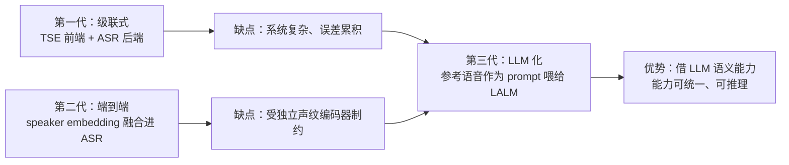
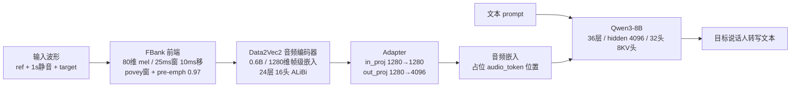
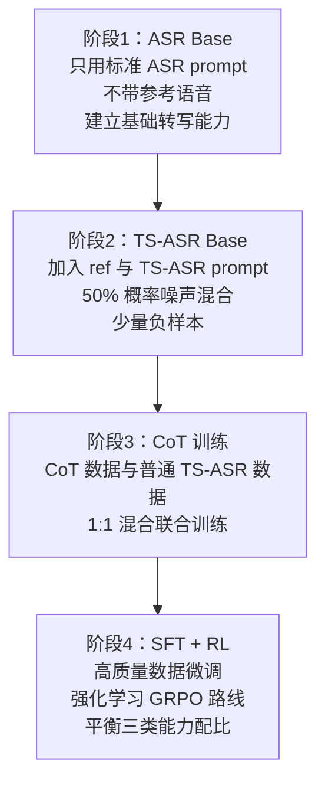

# Xiaomi-CocktailASR-1：目标说话人 ASR 的 LLM 化路径

> **本文性质**：论文 + 开源实现的双轨研读。论文部分基于 arXiv 2609.11274 全文（42.6K 字符，含 Figure 1–4 与 Table 1–5）；代码部分基于 GitHub 仓库与 HuggingFace 上 `Ease3/Xiaomi-CocktailASR-1` 的全部配置与模型源码（`modeling_mic_asr.py` 935 行、`configuration_mic_asr.py`、`feature_extraction_mic_asr.py`、`config.json`、`d2v2_config.json`）。
>
> **来源边界**：所有 benchmark 数字取自论文 Table 1–5 与仓库 README；参数量、显存、token 密度为本文依 `config.json` 实际配置自行推算，标注为「推算」。
>
> 访问日期：2026-09-15。发布：小米 Xiaoai Plus ASR 团队，2026-09-11 开源，Apache License 2.0（权重与推理代码均开源）。

---

## 1. 一句话定位

**用「参考语音当 prompt」，让一个 LLM 直接从混合语音里听出目标说话人并转写，不做语音分离。** 目标人不在场时输出空文本（拒识）。

它的位置在 TS-AR（Target-Speaker ASR）技术谱系的第三阶段：



论文的自我定位很明确：**首个专门为 cocktail party 场景设计的开源 LALM**（large audio-language model）。这句成立。

---

## 2. 问题背景：论文提炼的三个实际痛点

论文把「为什么现有方案不够用」讲得比多数同类工作清楚，三个痛点都是从真实部署反推出来的：

**痛点一：单说话人场景的性能退化。**
专为抑制多说话人干扰训练的模型会「过度抑制」，把目标语音也削掉，导致 deletion error。而实际场景中说话人数无法预知——智能家居里用户多数时候是一个人说话（论文给的数据：AliMeeting 真实集的重叠率仅 30%–40%）。**为单说话人优化和为多说话人优化的模型，在对方场景下必然变差**，所以理想模型必须无缝覆盖两者。

**痛点二：目标缺席时没有拒识能力。**
室外或会议场景中，目标说话人可能暂时缺席或静音（论文称 negative sample），此时应输出空文本。现有模型无法判断目标是否在场，会把无关语音转写出来 → **严重误触发**。

**痛点三：缺少推理带来的可解释性与增益。**
TS-ASR 天然适合 CoT，且中间推理步骤本身对下游任务有价值。

---

## 3. 方法：参考语音即 prompt

### 3.1 输入组织

模型输入是把三段波形直接拼接：

```
peak_normalize(ref 随机裁到 1-4s) + [ 1s 静音 + peak_normalize(target) ]
```

两个设计细节值得注意：

- **1s 静音是刻意的**。论文的说法是「显式区分参考语音与混合信号，并锚定声纹特征」。这是一个零成本的 trick——用静音做一个显式的边界标记。
- **ref 长度在 1–4s 之间随机采样**。论文解释：既能提供足够声纹信息，又不会带来显著计算成本。注意这是**随机**裁剪（代码里用全局 `random`，见 §6.4），意味着同一个长参考音频在不同调用中会取到不同片段。

另外，ref 与 target **各自独立**做 `peak_normalize`（峰值归一到 0.99）。这抹掉了两者之间的绝对音量关系——推论上可能是有意的（消除距离/增益线索，逼模型只看声纹），但也确实丢掉了 SNR 类信息。

### 3.2 模型结构



三个组件的实际配置（读自 `config.json`）：

- **音频编码器**：Data2Vec2，`embed_dim=1280`、`depth=24`、`num_heads=16`、`mlp_ratio=4.0`，ALiBi 位置偏置（`num_alibi_heads=16`，可学习缩放、逐头）。**结构上的关键改动是前端换成 FBank**——论文明确说这是为了「显著加速训练与推理」，同时保持性能。原始 Data2Vec2 吃 raw waveform，这里改成 Kaldi 风格 fbank。
- **Adapter**：`in_proj`(1280→1280) + `out_proj`(1280→4096)，仅约 6.9M 参数（推算），做跨模态对齐。
- **LLM**：Qwen3-8B，`hidden_size=4096`、`num_hidden_layers=36`、`num_attention_heads=32`、`num_key_value_heads=8`（GQA）、`intermediate_size=12288`、`vocab_size=151936`、`rope_theta=1e6`。

### 3.3 为什么不需要独立声纹编码器

这是该方法最核心的一个论断：**Data2Vec2 的 mask prediction 机制本身就自然融合了语义与说话人信息**，所以不需要外挂 speaker encoder。

论文的描述是：编码器把参考音频当作 conditional prompt，在特征提取阶段**自适应地聚焦并增强目标说话人的语音表征**，从而抑制无关说话人。这个说法在架构上是自洽的——ref 和 target 在**同一个**编码器里前后拼接，self-attention 天然能让 target 帧去「查」ref 帧的声纹特征，不需要显式的相似度计算或 embedding 拼接。

工程上的好处很明显：省掉一个独立模块，也就省掉了它带来的误差累积和联合优化难题。

---

## 4. 训练：一个模型如何同时具备三种能力

### 4.1 数据配比

| 数据类型 | 规模 | 构造方式 |
|---|---|---|
| 多说话人 TS-ASR | **约 40 万小时** | 开源真实重叠（AMI/AliMeeting）+ 开源合成（LibriMix）+ **自有单说话人数据合成的重叠** + 内部真实日常对话 |
| 单说话人 TS-ASR | **约 60 万小时** | ref 与 target 取**同一说话人的不同句子** |
| 负样本 | **约 1 万小时** | ref 说话人不在 target 中 |
| CoT | — | 模板构造，覆盖多说话人/单说话人/负样本三类 |

值得注意两点：**单说话人数据（60万h）比多说话人数据（40万h）还多**，这是对「痛点一」的直接回应；**负样本仅 1 万小时（占总量 0.9%）**，比例极低，且论文说其采样比例在各训练阶段动态调整。

### 4.2 四阶段流水线



几个关键设计：

- **阶段 1 不带 ref**，先建立纯 ASR 能力——这是「单说话人性能不掉」的基础。
- **阶段 2 的噪声混合策略**：以 50% 概率给现有数据叠加环境噪声与人声噪声，**直接把一半数据转成多说话人重叠语音**。这是一种低成本的数据增广。
- **阶段 3 的 1:1 混合**是 CoT 不损害标准模式的关键：同一个模型要能根据 prompt 切换行为（CoT prompt → 输出 `<think>` 推理；标准 prompt → 直接输出转写）。
- **阶段 4 用 RL**，引用的方法是 DeepSeekMath，即 GRPO 路线。

### 4.3 拒识能力的来源，以及它与 CoT 的关系

这部分是全文设计最巧的地方。**拒识不是外挂阈值，而是被内化进权重的模型行为**（论文原话：end-to-end supervised learning, requiring no additional rejection thresholds during inference）。

它的训练信号来自 CoT 数据的构造规则：

- **推理内容**包含：说话人数 + 每个说话人的性别 + **每个说话人与参考语音的声纹相似度**
- 相似度用 **CAM++** 提取 embedding 算 cosine，然后**均匀量化到 1–5 五档**（论文理由：离散化避免模型纠结无意义的数值差异，提升训练稳定性与收敛效率）
- **判定规则**：相似度最高者为目标；**若全部低于阈值 3，则判定目标缺席，输出空文本**

也就是说，拒识能力是「模型学会做这个比较并得出结论」的副产品。CoT 训练同时给了模型可解释输出和拒识信号，一举两得。

---

## 5. 评测结果

评测集分三类：多说话人（合成 + 真实）、单说话人、负样本。指标定义：

- **TS-WER / TS-CER**：只针对目标说话人的错误率，参考文本严格匹配真值
- **RR**（Rejection Rate，越高越好）：负样本中被正确拒识的比例
- **FRR**（False Rejection Rate，越低越好）：正样本中被错误拒识的比例
- **Non-empty WER**：剔除空输出样本后重算的 WER——因为误拒会造成整体 WER 大幅波动，这样能纯看非空输出上的转写精度

### 5.1 多说话人 — 合成集

| 模型 | LibriMix 2mix | LibriMix 3mix | LibriSpeechMix 2mix | LibriSpeechMix 3mix |
|---|---|---|---|---|
| **Xiaomi-CocktailASR-1** | **4.11** | 12.29 | **2.90** | **4.91** |
| TCP（前 SOTA） | 4.84 | **12.23** | — | — |
| CONF-TSASR（前 SOTA） | — | — | 5.40 | 7.60 |
| Qwen3-ASR-1.7b | 68.75 | 106.04 | 92.17 | 160.82 |
| StepAudio2 | 71.23 | 121.08 | 92.72 | 164.66 |
| Gemini-2.5-pro | 48.41 | 76.10 | 30.69 | 52.34 |

**读法**：

- 相对前 SOTA：LibriMix 2mix 降 15.1%（4.84→4.11），LibriSpeechMix 2mix 降 46%（5.40→2.90）
- ⚠️ **LibriMix 3mix 上是 12.29 vs TCP 的 12.23——略微变差**。三人以上重叠仍是未突破的瓶颈，论文未正面讨论
- 通用 ASR 模型在这类任务上是灾难：Qwen3-ASR 和 StepAudio2 完全不具多说话人能力，WER 达 60%–160%
- Gemini-2.5-pro 能通过 prompt 吃参考语音，但缺乏专项训练，30%–80% 仍远不可用

评测方法论上有个细节值得记：LibriMix 用 **0–15 dB 随机 SNR**，LibriSpeechMix **随机化各说话人起始时间**——目的是堵住「转写最响的那个」和「永远转写第一个说话人」这两条捷径，逼模型真正依赖声纹。

### 5.2 多说话人 — 真实集

| 模型 | AMI SDM | AliMeeting Far |
|---|---|---|
| **Xiaomi-CocktailASR-1** | **21.81** | **20.63** |
| SQ-Whisper（前 SOTA） | 22.0 | — |
| MC-TS-ASR（前 SOTA） | — | 27.50 |
| Qwen3-ASR-1.7b | 38.18 | 39.64 |
| Whisper Large-v2 | 36.40 | — |
| Gemini-2.5-pro | 52.95 | 56.75 |

- **AliMeeting-Far 是提升最大的一项**：27.5 → 20.63（降约 7 个点）
- **AMI-SDM 基本持平**：22.0 → 21.81（论文自己用的是 "slightly surpassing"）

⚠️ 这一节的对比论文自己承认做了取舍：把对比重心放在「前 SOTA TS-ASR 模型」上，而不是与所有通用模型比。这个选择合理（同类比才有意义），但读的时候要意识到通用模型数字被用来衬托。

### 5.3 单说话人（核心卖点）

| 模型 | LibriSpeech | AliMeeting-near | AMI-ihm | WenetSpeech(meeting) | CommonVoice(zh) |
|---|---|---|---|---|---|
| **Xiaomi-CocktailASR-1** | 1.73 | 6.57 | **8.89** | 5.81 | 4.95 |
| Qwen3-ASR-1.7b | 1.87 | 6.39 | 10.56 | 5.84 | 5.39 |
| StepAudio2 | 1.58 | 6.82 | 37.54 | 5.46 | 5.07 |
| Whisper Large-v2 | 2.70 | — | 16.90 | — | 26.8 |
| Gemini-2.5-pro | 6.77 | 16.10 | 21.02 | 27.58 | 14.01 |

结论是**「可比」而非「超越」**：五个集里三个略逊于最优基线，但 AMI-ihm 上明显占优（8.89 vs 10.56）。对一个同时要处理重叠语音的模型来说，这个水平确实消除了「必须切换模型」的理由。

**FRR**（正样本被误拒的比例）：

- Xiaomi-CocktailASR-1：0.36 / 0.38 / 0.01 / 0 / 0.73
- 对比 **Gemini-2.5-pro：21.31 / 14.95 / 24.30 / 0 / 0.003**

这个对比是全文最有说服力的一处：**Gemini 有强拒识偏置**，单说话人场景下 21%–24% 的正样本被错误拒识，这在实际部署中会直接毁掉体验。而 Xiaomi 靠配比调优把 FRR 压到 1% 以下。论文的论证是：能力整合若没有仔细平衡的训练策略，结果就是误拒。

### 5.4 拒识能力

| 模型 | LibriSpeech Neg | Aishell Neg | Chinese in-house Neg |
|---|---|---|---|
| **Xiaomi-CocktailASR-1** | 79.59 | 75.35 | **68.54** |
| Gemini-2.5-pro | 81.79 | 64.20 | 54.7 |
| Qwen3-ASR-1.7b | 0 | 0 | 0 |
| StepAudio2 | 0 | 0 | 0 |

**这是本文最需要冷静看的一节。** 翻成误触发率就是：真实中文场景下**仍有约 1/3 的目标缺席会被错误转写**（其余两个集 20%–25%）。论文用的是「comparable to Gemini」这种描述，但 68.54% 在实际部署里并不算高——尤其考虑到负样本训练数据只有 1 万小时。

Qwen3-ASR 和 StepAudio2 的 0% 是预期内的（架构上无拒识设计），这两行更多是说明「拒识需要专门训练」。

### 5.5 CoT 的实际收益

| 测试集 | 标准模式 | CoT 模式 | Δ |
|---|---|---|---|
| LibriMix 2mix | 4.11 | 3.87 | **-0.24** |
| LibriMix 3mix | 12.287 | 12.285 | **-0.001** |
| LibriSpeechMix 2mix | 2.90 | 2.88 | -0.02 |
| LibriSpeechMix 3mix | 4.91 | 4.81 | -0.1 |

**结论要说清楚：CoT 的精度增益基本可以忽略**（3mix 上差 0.001 个百分点）。论文的措辞是 "modest but consistent improvement"，措辞是诚实的，但实际含义是——**CoT 的价值在可解释性和下游可用性，不在 WER**。论文自己也补了一句：CoT 生成的中间步骤（估计的说话人数、时间活动模式）可惠及需要更深语音理解的下游任务。

---

## 6. 代码实现分析

### 6.1 仓库现状：入口页而非代码仓库

**GitHub 仓库本身几乎是空的**（8 个文件）：

```text
xiaomi-cocktailasr-1/
├── README.md / README_en.md       # 中英双语文档
├── LICENSE                        # Apache License 2.0
├── .gitignore
├── tools/
│   └── test_batch_scp.py          # 133 行，批处理入口
└── demo/                          # 4 个示例 mp4（正/负样本各 2 个）
```

真正的模型定义与权重全在 HuggingFace（`Ease3/Xiaomi-CocktailASR-1`），通过 `trust_remote_code` 加载。仓库 README 自己也说明了这点。**如果你要读源码，去 HF 而不是 GitHub。**

HF 侧文件清单：

```text
Xiaomi-CocktailASR-1/
├── config.json                    # MicAsrConfig，含 auto_map / text_config / d2v2_config
├── configuration_mic_asr.py       # 自定义 config 类
├── modeling_mic_asr.py            # 935 行，自定义模型（Data2Vec2 已内联）
├── feature_extraction_mic_asr.py  # 99 行，音频拼接 / 特征处理
├── d2v2_config.json               # D2V2 编码器配置
├── pytorch_model.bin              # 全部权重（D2V2 + Adapter + LLM）
├── tokenizer.json
└── tokenizer_config.json
```

论文提到的 `tools/prepare_from_scp.py` **并未出现在仓库中**（只有 `test_batch_scp.py`），而后者的注释引用了它。这是一个小的文档/代码不一致。

### 6.2 音频 token 注入机制

这是整个实现里最值得学的工程技巧。`transcribe_prepared()` 的做法是：

1. 先构造 `input_ids = [audio_token_index] × seq_len + prompt_ids`——**音频 token 在前，文本 prompt 在后**
2. 把音频编码器的输出 reshape 成 `(-1, hidden)` 的扁平序列
3. 给 `embed_tokens` **注册一个 forward hook**，在嵌入查表后的输出上做 `masked_scatter`，把 audio embedding 填进所有 `audio_token_index` 的位置
4. 生成结束后 `hook_handle.remove()`

```python
def embed_hook(module, args_tuple, output, _embeds=audio_embeds, _token_id=audio_token_index):
    input_ids_inner = args_tuple[0] if args_tuple else None
    if input_ids_inner is not None and input_ids_inner.shape[-1] > 1:
        audio_mask = input_ids_inner == _token_id
        if audio_mask.any():
            audio_flat = _embeds.reshape(-1, _embeds.shape[-1]).to(output.dtype)
            output = output.masked_scatter(audio_mask.unsqueeze(-1).expand_as(output), audio_flat)
    return output
```

**优点**：完全不用改 Qwen3 的源码，纯外挂。任何「往 LLM 里塞非文本模态」的 HF 原型都可以抄这套。

**`input_ids_inner.shape[-1] > 1` 这个判断是精妙之处**：生成第一步（prefill）时序列长度 = audio tokens + prompt tokens ≫ 1，scatter 生效；后续 decode 步每次只喂 1 个 token，判断为假 → **自动跳过 scatter**，避免重复注入和索引错位。

### 6.3 生成配置

- **解码策略：贪心**（`do_sample=False`，`num_beams=1`）
- `max_new_tokens`：标准模式 **256**，CoT 模式 **512**
- `eos_token_ids`：**双 token `[151645, 151643]`**，`pad_token_id=151643`
- `prompt_prefix = "<|im_end|>"`——prompt 之前先塞一个 im_end，作为序列起始的显式分隔
- `repetition_penalty`：config 默认 1.1，但 `config.json` 里落的是 **1.0**（即实际不惩罚重复）

**标准 prompt**（原文）：
```
Based on the reference speech at the start, only transcribe the target speaker's speech into text.
```

**CoT prompt**（原文，注意 `<think> </think>.Please` 之间**缺一个空格**，是原始配置就有的）：
```
Based on the reference speech at the start, only transcribe the target speaker's speech into text. Please think step by step and provide a detailed reasoning process in <think> </think>.Please output the final answer in <answer> </answer>.
```

### 6.4 两个实现层面的问题

**① 全局随机状态污染 + 可复现性依赖调用顺序**

`feature_extraction_mic_asr.py` 在**模块 import 时**就执行 `random.seed(42)`：

```python
import random
...
random.seed(42)          # 模块级副作用
```

而参考音频的随机裁剪（`prepare_audio` 中的 `random.randint`）正是从这个全局流取数。后果：

- **污染调用方的全局随机状态**——任何 import 了这个模块的进程，其 `random` 序列都被重置
- **可复现性依赖调用顺序**：批处理脚本 `test_batch_scp.py` 的注释自己承认了这点——「rows are processed strictly in file order… do NOT reorder the input」，因为每个样本消耗随机流的位置不同

正确做法应该是用局部 `random.Random(seed)` 实例，而不是全局模块。

**② 并发不安全**

`embed_tokens` 是共享的模型组件，而 hook 是**每次调用注册、结束后移除**。多线程/多请求并发推理时，一个请求的 hook 可能作用到另一个请求的 forward 上，导致 embedding 串扰。生产部署（如 vLLM/TensorRT-LLM 风格的批调度）需要用别的方式（如改 forward 或显式传 inputs_embeds）。

**③ 其他小问题**

- `prepare_audio` 里 `ref_data` 做 `peak_normalize`，但 **target 在拼接前也做了 `peak_normalize`**——两者独立归一化，相对音量信息丢失（见 §3.1）
- `d2v2_mask` 的构造用 `seq_range.unsqueeze(0) >= audio_lengths.unsqueeze(-1)`，对单样本推理是恒为 False 的（没有 padding），这段逻辑只在批处理时才有意义——单条 `model(target, ref)` 路径下是冗余计算

---

## 7. 成本量化（推算）

### 7.1 音频 token 密度 —— 极其紧凑

编码器前端是 `[(512,2,2)] + [(512,2,2)]`，即 **2 层 stride 2**，总下采样 **4×**。配合 100 帧/s 的 FBank：

- 100 帧/s → conv1 → 49 → conv2 → **24 token/s**，即 **约 42 ms/token**

各配置下的实际 token 数：

| 输入组合 | 总长 | audio tokens |
|---|---|---|
| ref 1s + 1s + target 3s | 5s | 124 |
| ref 3s + 1s + target 5s | 9s | 224 |
| ref 3s + 1s + target 10s | 14s | 349 |
| ref 4s + 1s + target 10s | 15s | 374 |

**这个密度是推理可行性的关键**：作为对比，Whisper 的帧率是 50 token/s（20ms/token）。24 token/s 让 LLM 侧序列长度可控——9s 音频只占 224 个 token，加 prompt 后序列约 255。

另一个推论：**参考语音长度直接进成本**。ref 从 1s 增至 4s 会让 prefill 序列多 75 个 token（约 +30%）。

### 7.2 参数量与显存

| 组件 | 参数量 |
|---|---|
| Qwen3 LLM | **7.59 B**（每层 176.2M：attn 25.2M + mlp 151.0M） |
| Data2Vec2 编码器 | 0.6 B（论文标称；blocks 部分推算 472M） |
| Adapter | 约 6.9 M |
| **合计** | **约 8.2 B** |

权重显存需求：

- **bf16/fp16：约 16.4 GB**
- int8：约 8.2 GB
- int4：约 4.1 GB

以上均未计 KV cache 与激活。

---

## 8. 评价

### 8.1 成立的贡献

- **首个专门为 cocktail party 设计的开源 LALM**——这个定位是准确的，没有夸大
- **单模型统一三种能力**（单说话人 / 多说话人 TS-ASR / 拒识），免除了「先判断有几个人说话」的逻辑分支
- **拒识内化进权重、推理时无需阈值**，工程接口干净（`model(target, ref)` 一个调用搞定）
- **AliMeeting-Far 上 27.5 → 20.63** 是实打实的提升；AMI-ihm 单说话人 8.89 vs 10.56 也站得住
- **FRR 对比 Gemini 的论证很有力**：证明了「有能力 ≠ 能平衡」，21%–24% 的误拒是真问题

### 8.2 薄弱环节

- **3 人以上重叠没有突破**：LibriMix 3mix 12.29 vs 前 SOTA 12.23，实质持平甚至略退。这是全文最明显的空白，论文未展开讨论
- **CoT 对精度几乎无贡献**（3mix 差 0.001），本质是可解释性功能而非性能特性
- **拒识率 68%–80% 不算高**，真实中文场景 1/3 漏放行；且负样本仅 1 万小时（占总量 0.9%）
- **训练依赖约 100 万小时自有数据**，完全无法复现——只能当推理模型用
- **方法上更像规模化 + 能力统一**：上游是同团队的 TCP（arXiv 2509.15612），benchmark 里 TCP 就是被超越的「前 SOTA」，方法创新度有限

---

## 9. 对机器人语音交互系统的适用性

以「Jetson Orin 上的机器人语音交互（ASR/KWS/TTS/AFE，目标：聚焦当前用户、拒绝旁人干扰）」这一场景为参照。

### 9.1 直接部署的障碍

- **显存**：bf16 需 16.4 GB。Orin NX 16GB 放不下；AGX Orin 32GB 勉强但 KV cache 无余量。int4 量化到约 4.1 GB 才可行
- **时延**：8B 模型在 Orin 上的 decode 速率量级为个位数 token/s，一句 20 字输出需数秒——超出语音交互的时延预算
- **交互前提**：每次推理都需要参考音频。要求系统预先持有目标说话人的干净片段（声纹注册，或取用户上一句语音）

### 9.2 可直接借鉴的三点

1. **拒识机制的设计思路**：把「目标在不在」变成模型内部一个**可推理的判断**（训练时用 CAM++ 相似度 + 阈值 3 构造 CoT 数据），而不是外挂一个 VAD 或分数阈值。这个思路对 KWS 误唤醒问题有直接参考价值
2. **`ref + 1s静音 + target` 的拼接范式**：那个显式静音分隔是零成本 trick，任何「条件化」音频任务都能用
3. **HF 外挂注入技巧**：`register_forward_hook` + `masked_scatter` 往 LLM 里塞音频 embedding，不改主干源码；配合 `shape[-1] > 1` 判断只在 prefill 时生效。做 SpeechLLM 原型时很省事

### 9.3 更务实的替代路径

对「机器人聚焦当前用户」这个需求，全部上 8.2B 全时推理性价比很低。更现实的组合：

- **声纹门控 + 中小型 ASR**：用 CAM++ 之类的声纹模型算相似度做门控，只在通过时触发 ASR——成本比 8.2B 模型低一到两个数量级
- **仅在 KWS 触发后做一次目标人校验**：用声纹余弦相似度做二分类，比让 LLM 做全时 TS-ASR 便宜得多，且直接对应「降低误唤醒」的目标
- **只借架构思想**：把 ref-as-prompt 的条件化思路用在小模型上（例如给现有 ASR 加一个声纹条件输入），而不是照搬 8.2B

---

## 10. 参考

- 论文：Xiaomi-CocktailASR-1 Technical Report，arXiv [2609.11274](https://arxiv.org/abs/2609.11274)（[HTML 版](https://arxiv.org/html/2609.11274v1)，含 Figure 1–4 / Table 1–5）
- 代码仓库：[xiaomi-research/xiaomi-cocktailasr-1](https://github.com/xiaomi-research/xiaomi-cocktailasr-1)（入口页 + 批处理工具）
- 模型权重：[Ease3/Xiaomi-CocktailASR-1](https://huggingface.co/Ease3/Xiaomi-CocktailASR-1)（`trust_remote_code` 加载）
- 上游工作（同团队）：TCP — Thinking in Cocktail Party: Chain-of-Thought and Reinforcement Learning for TS-ASR，arXiv 2509.15612
- 论文引用到的关键组件：Data2Vec2（Baevski et al., ICML 2023）、Qwen3（arXiv 2505.09388）、CAM++（Interspeech 2023）、DeepSeekMath/GRPO（arXiv 2402.03300）
- 许可：Apache License 2.0
