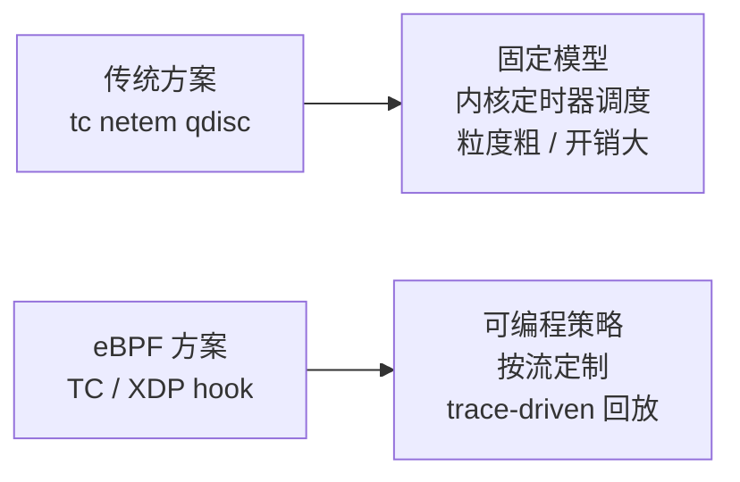
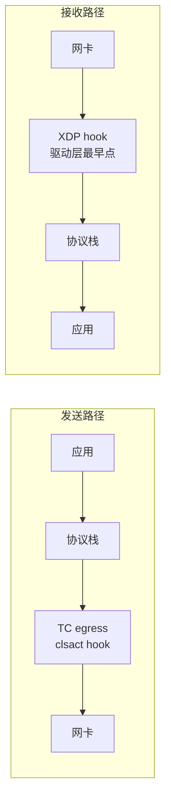
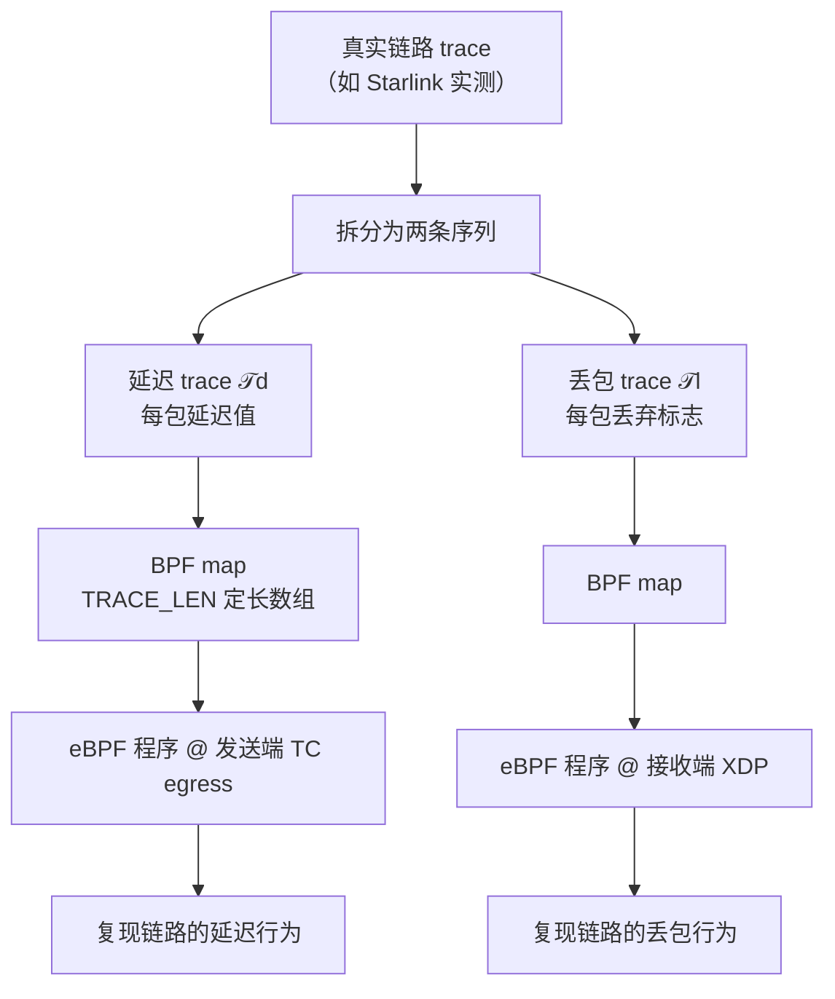
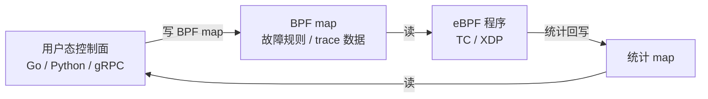
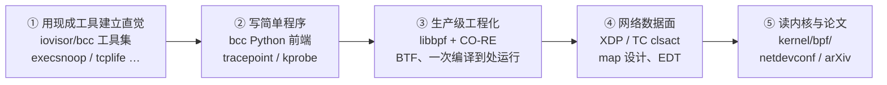

# eBPF 可编程网络仿真：原理、实现路径与生态

> **本文性质**：探索性调研（exploratory survey），为后续深入留出扩充位。写作契机是知乎上一则「eBPF 实现网络仿真」的话题讨论。
>
> **来源边界**：核心技术路径（EDT 延迟模型、XDP 丢包、trace-driven 方法）来自同行评议论文 [arXiv 2408.15581 / IEEE LNET](https://arxiv.org/abs/2408.15581)；生态项目来自公开仓库与会议材料；社区实践文章单独标注，**其代码示例经核查存在 eBPF 语义问题，不可直接照搬**（见 §6.3）。
>
> 访问日期：2026-09-11。

---

## 1. 一句话定位

网络仿真（network emulation）要在真实主机上复现「某条链路的行为」——延迟、抖动、丢包、乱序、带宽限制。传统答案是 `tc netem`；**eBPF 方案把这件事从「固定模型的队列调度」变成「内核里可编程的策略执行」**，因此精度更高、可按流/按 Pod 定制，并且能做到 trace-driven（按真实链路测量数据回放）。



---

## 2. 为什么需要 eBPF：netem 的四个痛点

`netem`（Network Emulator）是 Linux 流量控制子系统的排队规则，用配置命令描述链路行为，例如：

```bash
# 100ms 延迟 ±10ms 抖动
tc qdisc add dev eth0 root netem delay 100ms 10ms
# 5% 随机丢包；Gilbert-Elliott 突发丢包模型
tc qdisc add dev eth0 root netem loss random 5%
tc qdisc add dev eth0 root netem loss gemodel 1% 10% 70% 0.1%
```

它在虚拟机时代够用，但在容器化 / 高吞吐 / 精细化测试场景暴露四个问题：

| 痛点 | 具体表现 |
|------|---------|
| **调度精度不足** | 依赖内核 softirq 与定时器调度，高并发下延迟误差可达 10ms 量级，做不了稳定的亚毫秒级抖动仿真 |
| **CPU 开销大** | 包排队 + 定时器 + qdisc 锁，在高速率下自身成为瓶颈 |
| **模型不可编程** | 故障模型固化在 qdisc 里；要按「某条 TCP 流 / 某个 Pod」差异化仿真，只能堆叠 filter 与多层 qdisc |
| **容器场景侵入** | 操作需进入容器 netns；ingress 方向的 netem 要借助 `ifb` 模块，配置失误可能把延迟「泄漏」到同宿主机的其他容器 |

**替代方案的对比排除**（基于实践文章的取舍）：

- **Service Mesh Sidecar**（如 Istio Fault Injection）：只能注入应用层 HTTP 延迟/中断，无法模拟 TCP 握手期丢包或链路层故障；且必须注入 proxy 容器，本身就不"无侵入"
- **用户态透明代理**：改变网络拓扑，排障困难
- **CNI 链插件**：需要重启 Pod 才能生效，无法运行时动态注入

---

## 3. eBPF 侧的基础认知

要理解实现路径，先建立三个约束认知（后续方案全是在绕开它们）：

1. **程序必须快速返回**。eBPF 程序运行在内核关键路径上，**不能 sleep、不能阻塞**。因此「把包扣住等 100ms 再放行」这种直觉写法在 eBPF 里**不成立**。
2. **verifier 静态校验**。无死循环、无越界访问、栈有界、指针访问路径可证明。任何花哨的内存技巧都会被拒。
3. **状态必须放 map**。跨包状态（哪条流、已发多少包、trace 进度）只能存在 `bpf_map` 里；且 **BPF map 不支持动态内存分配**，容量必须在声明时写死（例如 trace 长度 `TRACE_LEN`）。

> 第 1 条与第 3 条，直接决定了「延迟仿真」必须走 §4.2 的 EDT 路线。

**与网络相关的挂载点**



- **XDP**：位于网卡驱动收到包之后、协议栈分配内存之前，是**最早的介入点**，天然适合丢包（论文称其可达硬件级数百万 pps）
- **TC clsact**：ingress/egress 双向均可挂，**对容器 veth 支持好**（论文与社区实践都选它）
- 二者的分工不是随意的：延迟要在**发送端 egress** 打时间戳，丢包在**接收端 XDP** 直接丢弃——这是论文给出的架构选择

---

## 4. 实现路径详解

### 4.1 整体架构（trace-driven）

论文（卫星网络场景）的做法是：先用采集系统收集真实链路 trace（他们采集了 Starlink），把 trace 拆成**延迟序列**与**丢包序列**，再分别注入内核仿真。



一个值得记的细节：**丢包也需要被赋一个延迟值**（取前一个包的延迟），否则被丢弃的包在接收端的到达顺序会错乱——说明仿真器的正确性不只是「丢/不丢」，还涉及时序一致性。

### 4.2 延迟：EDT（Earliest Departure Time）模型 ⭐

这是全文最核心的技术点。既然 eBPF 不能阻塞等待，**思路就反过来：不「扣住包」，而是「告诉内核这个包最早什么时候可以发」**。

```c
// 伪代码：核心只有一行——设置包的 tstamp
static __u32 packet_index = 0;

SEC("delay_ebpf")
int edt_delay_packet(struct __sk_buff *skb) {
    // 1) 按协议/端口过滤，只作用于目标流
    //    （避免影响同主机其他流量）

    // 2) 用包序号作 key 查 trace
    __u32 key = packet_index % TRACE_LEN;
    __u32 *delay_ns = bpf_map_lookup_elem(&delay_map, &key);

    // 3) 核心：设置出发时间
    //    tstamp = 当前时间 + 该包应产生的延迟
    //    随后由 TC 子系统的时间轮（timing wheel）调度发送
    skb->tstamp = bpf_ktime_get_ns() + *delay_ns;
    return TC_ACT_OK;
}
```

**为什么这样可行**：设置 `tstamp` 后，需要配合一个支持 EDT 的排队规则（论文使用 `fq`，即 fair queue）作为 TC 的 root qdisc——包进入队列后**由内核按时间戳精确调度**。延迟的执行交给内核调度器，eBPF 只做「决策」，从而绕开了「程序不能 sleep」的限制。

> 记忆锚点：**eBPF 负责算「什么时候发」，内核负责「到点才发」。**

### 4.3 丢包：XDP 直接丢弃

接收端 XDP 程序读丢包 trace，命中就 drop：

```c
SEC("xdp_drop_packet")
int xdp_drop_packet(struct xdp_md *ctx) {
    // 查 loss trace，命中则丢弃
    if (should_drop) {
        return XDP_DROP;    // 在协议栈之前就没了
    }
    return XDP_PASS;
}
```

因为位于驱动层、早于协议栈内存分配，**开销极低、速率极高**（论文称可达百万 pps 级）。

### 4.4 控制面：谁在下发策略

内核侧程序只是执行体，策略由用户态下发到 BPF map：



典型规则结构是「**流标识 + 故障类型 + 参数**」，例如五元组（源/目的 IP、源/目的端口、协议）加一个延迟毫秒数。这样就能做到「只对某个 Pod、某条连接注入故障」，而这是 netem 很难优雅表达的。

### 4.5 新进展：BPF Qdisc（Linux 6.16+）

自 Linux 6.16 起，可以在 eBPF 中实现 `Qdisc_ops` 回调（`enqueue` / `dequeue` / `init` / `reset` / `destroy`），即**用 eBPF 写一个完整的排队规则**。这比「打时间戳 + 现成 fq」更彻底，也是这一方向值得持续关注的原因（见 [eunomia egress pacer 教程](https://eunomia.dev/tutorials/53-egress-pacer/)）。

---

## 5. 代表工作与生态

| 工作 | 类型 | 关键点 |
|------|------|--------|
| [arXiv 2408.15581](https://arxiv.org/abs/2408.15581)（IEEE LNET 2024） | 论文 | 卫星网络 **trace-driven** 仿真；TC egress 用 EDT 做延迟、XDP 做丢包；基于 Starlink 实测 trace |
| **XNetEm**（Stephen Hemminger, netdevconf） | 会议/工具 | netem 的主要维护者之一用 **XDP 重写** NetEm，支持同等的丢包模型 |
| **bLEO** | 论文/系统 | 大规模 LEO 星座仿真，明确说明为**绕开 tc-netem 的扩展性限制**而自建 eBPF 模块，并在容器间用 veth 直连 |
| [srnbckr/ebpf-network-emulation](https://github.com/srnbckr/ebpf-network-emulation) | 开源实验 | 基于 eBPF 的网络仿真工具 + 与 NetEm 的对照实验装置 |
| [CarlossOliveira/ebpf-packet-loss-emulator](https://github.com/CarlossOliveira/ebpf-packet-loss-emulator) | 开源框架 | 模块化丢包仿真，**同时支持 TC 与 XDP 两种挂载点** |
| eunomia BPF Qdisc 教程 | 教程 | Linux 6.16+ 用 eBPF 实现 egress pacer |

---

## 6. 优势与局限

### 6.1 优势

- **精度**：决策在 eBPF、执行在内核调度器，摆脱 softirq 调度的粗粒度（社区实践声称可达毫秒/亚毫秒级，延迟误差从 10ms 量级降下来）
- **可编程**：故障模型是任意的——可以是概率模型，也可以是**一条真实测得的 trace**
- **零侵入**：挂在容器 veth 的 TC hook 上，不必进入容器 netns、不改容器文件、不需要特权容器（宿主机 `CAP_BPF` 即可）
- **可观测**：同一套 map 既能下发策略也能回传统计

### 6.2 局限与边界

- **XDP 对 veth 支持有限**：这是实践文章放弃 XDP 转投 TC clsact 的直接原因；XDP 更适合物理网卡
- **延迟仿真强依赖 qdisc 配合**：离开 `fq` / BPF Qdisc，EDT 无从落地——不是「装个 eBPF 程序」就完事
- **trace-driven 需要真实数据**：没有 trace 采集系统就只能用合成模型，优势打折
- **调试心智负担**：verifier 报错信息晦涩，程序不能 sleep/不能动态分配，需要重新建立「内核关键路径编程」的直觉

### 6.3 ⚠️ 关于社区实践文章的一个提醒

社区有一篇流传较广的实践文章（netchaos，dev.to, 2026-07），描述用 eBPF + Go 给 K8s 容器做毫秒级故障注入，问题分析（§2 的四个痛点）很有价值，**但其给出的延迟实现代码不符合 eBPF 语义**，主要问题：

- 把 `struct sk_buff *` **指针当作 BPF map 的 key 保存**，期望延时回调里再取回——skb 指针在程序返回后即失效，且指针不是合法的 map key 类型
- 用 `bpf_timer` 回调返回 `TC_ACT_UNSPEC` 来「延时放行」——**定时器回调不是 TC 程序**，其返回值不具备 TC action 语义

结论：把它当作**需求侧**的参考（要什么），实现侧请以 §4.2 的 **EDT + fq** 路线为准。

---

## 7. 学习路径

知乎讨论中给出的建议是：**先看 `iovisor/bcc` 的 examples，再读内核 `kernel/bpf/` 子模块**。这条路线对入门有效，补上后半段更完整：



- **入门读物**：Brendan Gregg《BPF Performance Tools》
- **官方文档**：`docs.ebpf.io`
- **进阶信号**：能区分「bcc 便于学习」与「libbpf 才是生产主流」这个分水岭

---

## 8. 与本项目的关联

- **遥操作 / WebRTC 弱网测试**：`chenxing_agent_ros` 的遥操作链路（参见 [WebRTC 通览](./WebRTC_协议原理_机器人遥操作与libwebrtc重构通览.md) 与 [opentera-webrtc 生态](./opentera-webrtc_机器人遥操作音视频流框架分析.md)）需要在 4G / 弱网 / 卫星链路条件下验证音视频抗抖动能力。eBPF 方案可以**只对某一路媒体流**注入 trace-driven 的延迟与丢包，比 netem 更精细、更接近真实链路
- **机器人端网络诊断**：Jetson Orin 上若有 eBPF 运行环境（内核 `CONFIG_BPF` + BTF），可直接做链路质量仿真与观测，无需改应用代码
- **潜在场景**：远程操控的「网络降级演练」——按真实采集的现场网络 trace 回放，验证控制指令与音视频的降级表现

---

## 9. 待扩充清单（后续深入方向）

- [ ] 补齐 **EDT 与 fq/ETF qdisc** 的完整可编译示例（含 map 定义、attach 命令、端到端验证方法）
- [ ] 核对 **BPF Qdisc（6.16+）** 的 API 现状与可用内核版本矩阵
- [ ] 深入 **XNetEm** 与 **bLEO** 的实现细节，对比其与 EDT 路线的取舍
- [ ] 调研 **trace 采集系统**如何构建（论文里的 Starlink 采集装置）
- [ ] 与 **ns-3 / Mininet** 等传统仿真器做定位对比：何时该用仿真、何时该用仿真（emulation）
- [ ] 结合本项目做一次**实测**：在 Orin 上对 WebRTC 上行注入链路 trace，观测 NetEq / 抖动缓冲行为
