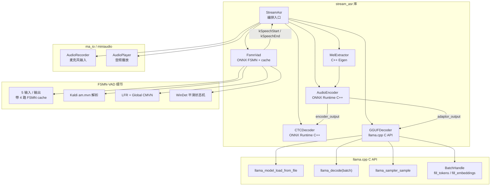
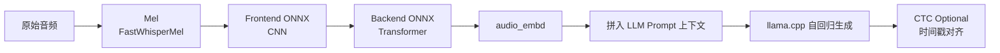
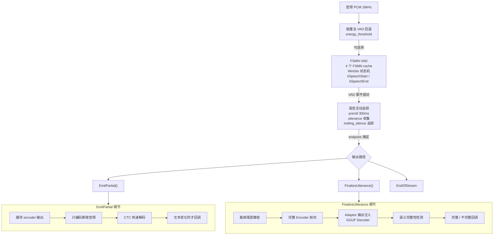
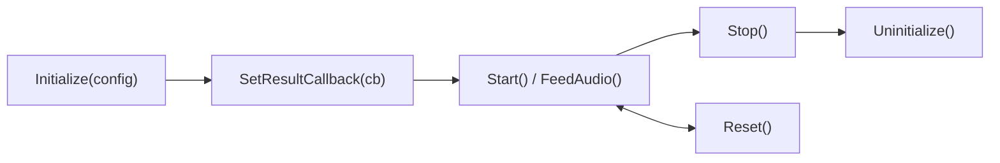

# gguf_mix_inference — Fun-ASR-GGUF C++ 原生推理实现分析

> **模块位置：** `chenxing_agent_ros/src/speech/third_party/gguf_mix_inference/`
> **上游参考：** [`Fun-ASR-GGUF`](https://github.com/HaujetZhao/Fun-ASR-GGUF)
> **相关文档：** [Qwen3-ASR-GGUF 架构与 LLM-based ASR 技术探讨](./Qwen3-ASR-GGUF_架构与LLM-based-ASR技术探讨.md)

---

## 一、模块是什么

这是 **Fun-ASR-GGUF 推理引擎的 C++ 原生实现**，将原本 Python 版的混合式 ASR（ONNX Encoder + GGUF LLM Decoder）完整移植到了 C++ 17 环境中，移除了所有 Python 运行时依赖。

核心能力：输入 PCM 音频 → 输出转录文本（支持麦克风实时流、增量 partial、端点检测、热词、VAD 可选）。

### 与 Python 版的关键对比

| 维度 | Python 版 (Fun-ASR-GGUF) | C++ 版 (gguf_mix_inference) |
|---|---|---|
| 运行时依赖 | Python + onnxruntime + llama-cpp-python | ONNX Runtime C++ + llama.cpp C API |
| 部署环境 | 需安装 Conda/Python 环境 | 编译后单二进制独立运行 |
| 流式推理 | 低开销伪流式（每次重新编码整句） | 增量编码（缓存 Encoder 中间特征，只编新增音频） |
| VAD | 无内置 | 内置 FSMN-VAD + 能量法双 VAD |
| 端点检测 | `endpoint_ms` 简单定时 | sherpa-onnx 风格三规则端点检测（规则可组合） |
| 热词 | 无 | 支持从文件加载热词列表 |
| 语义完整性 | 无 | 内建句末标点检测，截断时保持音频继续收集 |
| 麦克风输入 | 需自己实现 | 内置 miniaudio 录音封装 |
| 音频重采样 | Python librosa | 支持但不强制（期望 16kHz 输入） |

---

## 二、整体架构

### 2.1 系统组件图



### 2.2 训练流程（继承自上游）



### 2.3 推理流程



---

## 三、核心模块详细实现

### 3.1 MelExtractor — 纯 C++ 特征提取（最有移植风险的部分）

**文件：** `src/mel_extractor.cpp`、`include/mel_extractor.h`

该模块是 Python 版 `FastWhisperMel` 的完整 C++ 复刻，使用 **Eigen 5.0** 的 `unsupported/Eigen/FFT`（kissfft 后端）实现 FFT。

**特征提取流水线：**
1. **Center Padding** — 首尾各补 `n_fft/2` 个零（保持与 encoder 形状对齐）
2. **Framing** — 每帧 `n_fft` 个采样点，步长 `hop_length`
3. **Kaldi 风格帧处理**（逐帧）：
   - DC 移除（去直流偏置）
   - Pre-emphasis（0.97 预加重）
   - Hamming 窗（支持 `window_pow` 幂次，^0.85）
4. **实输入 FFT** → 功率谱（`re² + im²`）
5. **HTK Mel Filterbank** — 2595·log₁₀(1+f/700)，80 个滤波器
6. **Mel 对数功率** — `log(mel_spec + 1e-7)`
7. **LFR 拼接**（`lfr_m=7, lfr_n=6`） — 当前帧 + 前后各 3 帧堆叠 → 560 维 (7×80)
8. **Online CMVN** — 因果窗口均值方差归一化（默认窗口 300 帧，最少 6 帧）

**Kaldi 行为一致性**：代码注释中明确标注了每一处与 Python 参考实现的对应关系，包括均值减除的作用域（逐帧，不是全局）、填充方式、LFR 的 padding 逻辑。

### 3.2 AudioEncoder — ONNX 编码器封装

**文件：** `src/audio_encoder.cpp`、`include/audio_encoder.h`

将 MelExtractor（特征提取）和 ONNX Encoder（模型推理）封装为一个类。

**ONNX 模型要求：**
- 输入 2 个: `feature` (float/fp16) + `mask` (float/fp16)
- 输出 ≥ 2 个: `encoder_output` + `adaptor_output`（均为 rank-3 张量）
- 支持 FP32 和 FP16 输入（运行时自动检测输入张量的元素类型）

**前向推理步骤：**
1. `mel_extractor_.extract(audio)` → LFR 特征矩阵
2. 特征转为 `[1, T, D]` ONNX 张量 + 全 1 mask `[1, T]`
3. `Ort::Session::Run` → 获取 encoder + adaptor 输出
4. `ComputeAudioTokenCount` 根据音频长度计算有效 token 数
5. 裁剪 adaptor 输出到有效帧数（移除填充噪声）
6. 返回 `EncoderResult` 结构

### 3.3 CTCDecoder — ONNX 快速解码

**文件：** `src/ctc_decoder.cpp`、`include/ctc_decoder.h`

从全局 Encoder 特征直接解码的 CTC 分支，用于 partial 结果的快速输出。

**特点：**
- 输入为 encoder 输出（adaptor 之前的中间表示）
- ONNX CTC 模型输出 top-k 索引
- Greedy 解码 + 重复 token 合并 + blank 过滤
- 每个 token 附带时间戳（基于 `frame_shift_ms=60ms` 计算）
- 支持 Base64 编码的 token 文本（Fun-ASR 的 tokens.txt 格式）
- 自动检测 blank token ID

### 3.4 GGUFDecoder — llama.cpp 封装

**文件：** `src/gguf_decoder.cpp`、`include/gguf_decoder.h`

自回归 LLM Decoder 封装，负责将 adaptor 输出的音频 embedding 注入 llama.cpp 上下文。

**Prompt 构建（三阶段 batch）：**
1. **Prefix tokens** — 系统 prompt + 热词列表 + 上下文信息 + 转写指令 ↑ `tokenize`
2. **Audio embeddings** — Adaptor 连续向量直接注入 ↑ `fill_embeddings`（不经过 tokenizer）
3. **Suffix tokens** — `[assistant]` 标记 ↑ `tokenize`（最后一个标记 logits=1）

**自回归生成：**
- 使用 `llama_sampler_chain` 进行采样
- 温度 0 = greedy，其它配置 top-k / top-p / temperature / distribution
- EOS token + 两个自定义 stop token（151643, 151645）终止生成
- 最大生成 128 token（可配置）
- 用 `llama_memory_clear` 每次解码前清空 KV cache（单次推断模式）

**GPU 支持**：
- `--gpu` 启用 `n_gpu_layers=-1`（全量 offload）
- 通过 `ggml_backend_load` 在运行时动态加载所有 `libggml-*.so` 后端
- 通过 `GGML_BACKEND_PATH` 环境变量控制搜索路径

### 3.5 FsmnVad — FSMN VAD 实现

**文件：** `src/fsmn_vad.cpp`、`include/fsmn_vad.h`

Fun-ASR 官方的 FSMN-VAD 模型（ONNX）的 C++ 推理实现，用于替代简单的能量法语音检测。

**架构：**
- 使用与 AudioEncoder 相同的 `MelExtractor`（但 `lfr_m=1, lfr_n=1`，输出 80 维 raw fbank）
- VAD 专用 Mel 配置：全局 CMVN（从 `am.mvn` 文件加载），Kaldi Nnet1 格式解析
- LFR 左上下文通过环形缓冲区 `deque` 维护
- FSMN 循环网络含 4 个 cache 状态（尺寸 `[1, 128, 19, 1]`），需跨帧传递
- ONNX 模型输入：speech + 4 caches；输出：logits + 4 个更新后的 caches

**VAD 判决机制：**
- 逐帧计算 `speech_prob - sil_prob >= speech_noise_thres`
- `WinDet` 滑动窗口平滑：通过窗口内活跃帧计数实现 `sil_to_speech` 和 `speech_to_sil` 的确认延迟
- VAD 事件：`kSpeechStart` / `kSpeechEnd`，带毫秒级时间戳

**主要设计决策**：VAD 输出 `kSpeechEnd` 后**不立即结束 utterance**，而是进入 trailing silence 追踪模式（sherpa-onnx 风格的端点规则），防止说话中间停顿导致误切分。

### 3.6 StreamAsr — 流式 ASR 编排引擎

**文件：** `src/stream_asr.cpp`、`include/stream_asr.h`

这是整个模块的**最上层公共 API**，编排所有子模块。

**生命周期：**


**Endpoint 检测（VAD 模式）：**
sherpa-onnx 风格，三条规则任意满足即可触发：

| 规则 | must_contain_nonsilence | min_trailing_silence | min_utterance_length | 效果 |
|---|---|---|---|---|
| Rule 1 | false | 1.8s | 0.0s | 静音超时（没说任何话时也触发） |
| Rule 2 | true | 0.8s | 0.0s | 说话后静音超时 |
| Rule 3 | false | 0.0s | 16.0s | 最长语音时长 |

**增量编码策略（EmitPartial）：**
这是与 Python 版伪流式的**最大区别**：
1. 缓存 `cached_encoder_output_`、`cached_encoder_frames_`、`cached_audio_size_`
2. 新增音频 < `incremental_encode_min_ms`（默认 500ms）→ 跳过本次 partial
3. 累计音频 ≤ `incremental_encode_chunk_ms`（默认 2s）→ 直接编码全部，更新缓存
4. 累计音频 > chunk → 只编码新增部分，拼接缓存
5. CTC 解码 → 文本变化时才回调


**能量法 VAD 回退**（当没有 FSMN-VAD 模型时）：
- 计算 RMS → 与 `energy_threshold` 比较
- `silence_ms >= endpoint_ms && speech_ms >= min_speech_ms` → endpoint

**300ms preroll 机制**：
- 非说话阶段持续维护一个 300ms 的环形音频缓冲
- 检测到说话时，把 preroll 拼入 utterance 开头（防止句首被截断）


---

## 四、与 Qwen3-ASR-GGUF 文档的对照

### 4.1 已解决的缺陷

| 文档章节 | 指出的问题 | 本模块的解决 |
|---|---|---|
| **十五（15）** 低开销伪流式 | Python 版每次 partial 对整个 buffer 做完整解码 | **增量编码**：缓存 encoder 中间特征，只编码新增音频，CTC 解码非瓶颈 |
| **十七（17）** 原生部署 | 需要 Python 运行时 | **完全 C++ 化**：COUT<< 即可运行，仅编译时依赖 Python/ONNX |
| **十七（17）.2** Frontend 风险 | Mel 特征提取数值对齐最容易出问题 | **完整复刻**：Kaldi 风格 DC 移除 + 逐帧 pre-emphasis + Hamming^0.85 + online CMVN，代码标注了与 Python 参考实现的对应关系 |
| **十七（17）.5** MVP 顺序 | 建议路线：CTC-only 文件 → 麦克风 → CTC+LLM | **已有**：`demo_encoder_ctc`（CTC-only 麦克风）+ `simple_asr_demo`（CTC+GGUF 完整版） |
| **十六（16）** sherpa-onnx 兼容 | 完整链路不应硬塞 sherpa-onnx | **独立原生 runtime**，GGUF+ONNX 双引擎在 CMake 中统一管理 |
| **十四（14）** FunASR 差异 | 时间戳、热词、长音频合并 | 时间戳（CTC 每 token 带时间）、热词（从文件加载）、长音频（增量编码） |

### 4.2 仍需改进的方面

| 文档章节 | 指出的问题 | 当前状态 |
|---|---|---|
| **十五（15）.3** 真 online 需要改两层 | 导出带 cache/state 的 encoder | **未实现**：Encoder 仍是完整的端到端推理，无 chunk 级状态复用 |
| **十八（18）** Speaker Diarization | VAD + 说话人 embedding + 聚类 | **未实现**：FSMN-VAD 已完成，但无 speaker embedding |
| **十七（17）.2** 原生 runtime 拆解 | Frontend/Encoder/Ctc/Prompt/Llm/Aligner 六组件拆分 | **已完成 5/6**：缺少独立的 Aligner（CTC 与 LLM 文本对齐回填时间戳） |
| **十七（17）.5** 文件版 CTC-only → 麦克风 CTC-only → ... | 渐进式 MVP | **已完成前三步**（文件 CTC-only 、麦克风 CTC-only 、CTC+LLM ） |

### 4.3 代码结构与文档对应关系

| Qwen3-ASR-GGUF 文档章节 | 对应的 C++ 实现 |
|---|---|
| 四、LLM-based ASR 范式 | `gguf_decoder.cpp` — 混合架构 |
| 五、Audio Encoder 输出的本质 | `audio_encoder.cpp` — `adaptor_output` 连续向量 |
| 五、拼接方式（prefix + audio + suffix） | `gguf_decoder.cpp` — BatchHandle 三段式 fill |
| 九、关键代码位置速查 | 所有源文件对应列出 |
| 十二、统一视角图 | `stream_asr.cpp` 编排全流程 |
| 十四、Fun-ASR-GGUF 差异 | CTC 分支保留 (`ctc_decoder.cpp`)，热词支持 |
| 十五、流式推理 | 增量编码策略 (`stream_asr.cpp` EmitPartial) |
| 十七、原生部署 | CMakeLists.txt 完整编译系统 |

---

## 五、构建与部署

### 5.1 构建系统

**CMakeLists.txt**（214 行）：
- 静态库 `gguf_mix_core`：6 个核心模块
- 静态库 `stream_asr`：流式 ASR API（供 ROS 集成）
- 可执行文件：`test_mel`、`demo_encoder_ctc`、`simple_asr_demo`
- 外部依赖：Eigen 5.0（header-only）、ONNX Runtime 1.22.0、llama.cpp（预编译共享库）、miniaudio 0.11.22（header-only）
- 路径通过 CMake变量 / 环境变量 / 默认路径 三级覆盖

### 5.2 模型文件

| 模型 | 格式 | 路径 |
|---|---|---|
| Encoder + Adaptor | ONNX int4 | `model/Fun-ASR-Nano-Encoder-Adaptor.int4.onnx` |
| CTC Decoder | ONNX int4 | `model/Fun-ASR-Nano-CTC.int4.onnx` |
| LLM Decoder | GGUF q5_k | `model/Fun-ASR-Nano-Decoder.q5_k.gguf` |
| Token 映射表 | txt | `model/tokens.txt` |
| FSMN-VAD | ONNX + CMVN | `model/fsmn-vad/model.onnx` + `am.mvn` |

### 5.3 运行示例

```bash
# 文件一键识别（RecognizeBuffer）
StreamAsr asr;
asr.Initialize(config);
auto result = asr.RecognizeBuffer(wav_samples);

# 麦克风流式
asr.SetResultCallback(callback);
asr.Start();  // 后台线程运行

# 手动喂音频
asr.FeedAudio(chunk1);
asr.FeedAudio(chunk2);
asr.Flush();
```

### 5.4 ROS 集成

`stream_asr` 库通过静态库 + C API 暴露给 ROS 节点：
- `asr_node` 加载 `stream_asr` 库
- 从 `/speech/asr_result` 话题发布 `AsrResult` 消息
- 支持 `enable_asr_engine` 和 `switch_asr_device` 服务

---

## 六、Limitations & Future Work

### 已知限制

1. **Encoder 无状态缓存** — 每次 partial 虽然增量了编码，但 Encoder 每次仍然处理完整窗口（只是复用已编码的特征），不是真正 chunk-by-chunk 的状态复用
2. **单次解码** — GGUF Decoder 每次 `decode()` 都清空 KV Cache，不做跨 utterance 的上下文复用
3. **无重采样** — 期望输入是 16kHz（与 VAD 和 Encoder 一致），上游需保证采样率匹配
4. **无对齐器** — 缺少类似 Qwen3-ASR-GGUF 的 `QwenForcedAligner` 模块
5. **无说话人分离** — VAD 只有 speech/non-speech，无法区分不同说话人

### 代码中标注的 TODO / 待改进点

- 增量编码策略中的 `PushFrontWithPadding` 和 `cached_encoder_output_` 缓存机制已有注释说明后续可进一步优化
- `FinalizeUtterance` 中的语义完整性检测使用简单标点启发式，可替换为更复杂的判断模型
- `ComputeAudioTokenCount` 中的比例公式硬编码了特定模型的 downsampling ratio，换模型需要调整
