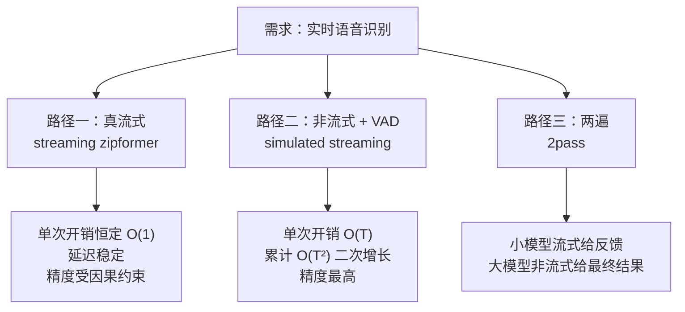
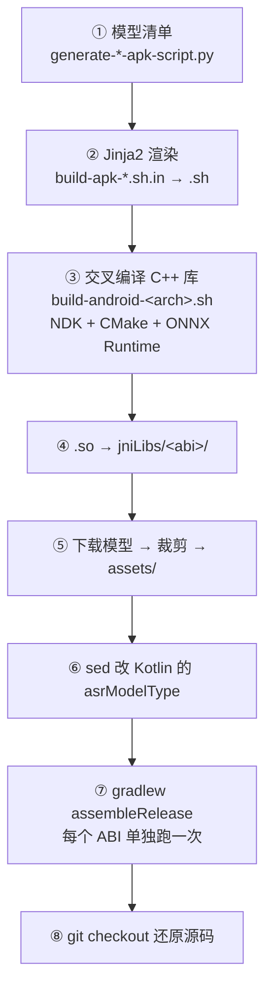
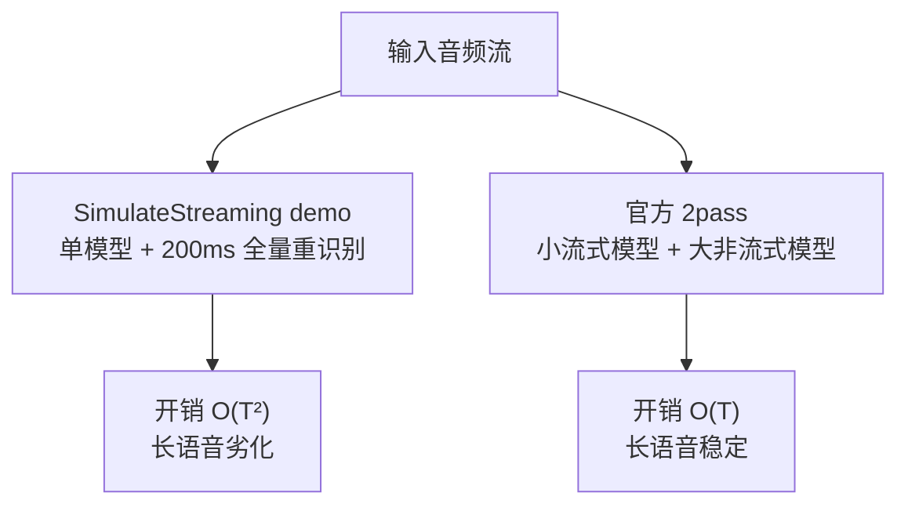

# sherpa-onnx 端侧 ASR 工程剖析：APK 构建、体积构成与流式化方案

> **本文性质**：源码级工程分析。基于 `k2-fsa/sherpa-onnx` 仓库的 `android/`、`scripts/apk/` 与官方 Android 文档，逐一核对 APK 构建链路；并结合两个实际 APK（`simulated_streaming_asr-zh_en-zipformer` 73M 与 `asr-bilingual_zh_en-zipformer` 182M）的体积差异，分析端侧 ASR 的三条流式化路径与各自的工程代价。
>
> **来源边界**：构建流程与参数全部来自仓库源码（脚本、Kotlin 源码、CI 配置）与官方文档页；模型逐文件体积来自 GitHub Releases 与 HuggingFace 源仓库的实际查询；推理密度（O(T²)）为本文依 `Home.kt` 实现逻辑推导并计算，标注为「推算」。
>
> 访问日期：2026-09-15。相关笔记：[Xiaomi-CocktailASR-1：目标说话人 ASR 的 LLM 化路径](./Xiaomi-CocktailASR-1_目标说话人ASR的LLM化路径.md)（云端 TS-ASR 侧的另一条路线）、[Qwen3-ASR-GGUF 架构与 LLM-based ASR 技术探讨](./Qwen3-ASR-GGUF_架构与LLM-based-ASR技术探讨.md)。

---

## 1. 一句话定位

sherpa-onnx 把**同一个 ASR 引擎**用三条不同的路径接到「实时识别」这个需求上，而这三条路径的工程代价差异极大——理解这个差异，比记住某个模型的名字重要得多。



---

## 2. APK 是怎么编译出来的

### 2.1 生成器 + Jinja2 模板

构建入口不是某个人写死的脚本，而是一套**「模型清单 → 模板渲染 → 具体构建脚本」**的生成机制：

- `scripts/apk/generate-asr-apk-script.py` 里的 `get_models()` 返回一个 `Model` 列表，每项包含：

```python
Model(
    model_name="sherpa-onnx-streaming-zipformer-bilingual-zh-en-2023-02-20",
    idx=8,                          # App 内的模型类型编号
    lang="bilingual_zh_en",         # 用于拼 APK 文件名
    short_name="zipformer",
    rule_fsts="itn_zh_number.fst",
    cmd="""... rm -fv encoder-epoch-99-avg-1.onnx ...""",   # 解压后删哪些文件
)
```

- `build-apk-*.sh.in` 是 **Jinja2 模板**（含 ``、`{{ model.cmd }}`），由生成器渲染成真正的 `build-apk-*.sh`：

```python
environment = jinja2.Environment()
template = environment.from_string(open("./build-apk-asr.sh.in").read())
open("./build-apk-asr.sh", "w").write(template.render(**d))
```

- 脚本支持 `--index/--total` 参数把模型列表切片，让**多个 CI runner 并行构建不同模型**（`num_per_runner = num_models // total`）。

这个设计的好处是：新增一个模型只需要在 Python 列表里加一条，不用碰 shell 逻辑。

### 2.2 八步构建链路



**③ 的细节**（`build-android-arm64-v8a.sh`）：

- Android NDK：脚本内默认 `22.1.7171670` / `27.0.11718014`
- 通过 CMake + `android.toolchain.cmake` 工具链交叉编译
- 依赖 **ONNX Runtime 1.28.2**（`SHERPA_ONNX_ONNXRUNTIME_VERSION` 可覆盖），自动下载对应 ABI 的预编译包
- 关键裁剪开关：`SHERPA_ONNX_ENABLE_TTS=OFF`、`SHERPA_ONNX_ENABLE_SPEAKER_DIARIZATION=OFF`——ASR-only 的 APK 就关掉无关模块
- 产物在 `build-android-<arch>/install/lib/`：`libsherpa-onnx-jni.so`；若 `BUILD_SHARED_LIBS=ON` 还会带一个 `libonnxruntime.so`

有 4 个 ABI 各编一次：`arm64-v8a`、`armeabi-v7a`、`x86-64`、`x86`。

### 2.3 库的导入：jniLibs

```bash
cp -v ./build-android-$src_arch/install/lib/*.so \
      ./android/SherpaOnnx/app/src/main/jniLibs/$arch/
```

`app/src/main/jniLibs/<abi>/` 是 Android Gradle 插件的**标准约定目录**——放进这里的 `.so` 会被自动打进 APK 的 `lib/<abi>/`，无需在 `build.gradle` 里额外声明。

注意每次构建后脚本会清空 `jniLibs/<arch>/*.so`，避免上一个 ABI 的库污染下一轮。

### 2.4 模型的导入：assets + sed 改源码

```bash
pushd ./android/SherpaOnnx/app/src/main/assets/
curl -SL -O .../${model_name}.tar.bz2
tar xvf ${model_name}.tar.bz2
{{ model.cmd }}          # ← 关键：裁剪
rm -rf *.tar.bz2
popd
```

模型放在 `assets/`，打包时原样进 APK。

**但坑在这里**：App 里读取哪个模型是由 Kotlin 源码里的一个**硬编码常量**决定的，所以构建脚本要用 `sed` 改源码：

```bash
sed -i.bak s/"asrModelType = [0-9]*/asrModelType = $type/" .../screens/Home.kt
```

同理还有 `rule_fsts`、`useHr` 这些都是 sed 注入的。

最后打包：

```bash
sed -i.bak s/2048/9012/g ./gradle.properties   # JVM 堆 2G → 9G（打包大模型需要）
./gradlew assembleRelease
mv .../app-release-unsigned.apk \
   ./apks/sherpa-onnx-${VERSION}-$arch-asr-$lang-$short_name.apk
```

三个要点：
- 产物是 **unsigned APK**（未签名，不用于发布，仅供测试安装）
- **每个 ABI 单独跑一次** `assembleRelease`
- `gradle.properties` 里把 JVM 堆从 2048 提到 9012 是官方脚本里少见的一处硬编码魔改——自己在 CI 上复现失败时先检查这项

完成后 `git checkout .` 还原被 sed 改过的源码。

### 2.5 运行时如何加载

- **库**：`com.k2fsa.sherpa.onnx` 包是 JNI 绑定层（`OfflineRecognizer.kt`、`OfflineStream.kt`、`Vad.kt`、`FeatureConfig.kt`），通过 JNI 调 `libsherpa-onnx-jni.so`
- **模型**：在 `assets/` 内。因为 Android assets 不能直接作为 C++ 的文件路径，JNI 层会处理（复制到应用私有目录或经 AAssetManager 读取）
- **第三方集成**：`android/SherpaOnnxAar/` 是专门打 AAR 的工程，包含 .so + Kotlin 绑定 + assets，可直接被其他 App 依赖

---

## 3. APK 体积构成：同是 zipformer 为何差 2.6 倍

### 3.1 两个 APK 的真实身份

两个文件虽然都叫 zipformer 中英模型，但**是完全不同的两个模型**，且走的是不同路径：

| | 73M 那个 | 182M 那个 |
|---|---|---|
| APK 命名规则 | `-simulated_streaming_asr-{lang}-{model}` | `-asr-{lang}-{model}` |
| 源模型 | `sherpa-onnx-zipformer-zh-en-2023-11-22` | `sherpa-onnx-streaming-zipformer-bilingual-zh-en-2023-02-20` |
| 模型性质 | **非流式**（offline） | **流式**（streaming） |
| 上游来源 | `zrjin/icefall-asr-zipformer-multi-zh-en-2023-11-22` | icefall |
| 训练时间 | 2023-11 | 2023-02 |

### 3.2 逐文件体积对比

从 HuggingFace 源仓库实际查询（单位 MB）：

**73M 那个（offline multi-zh-en）**
- `encoder-epoch-34-avg-19.int8.onnx` = **69.0** ← 保留
- `encoder-epoch-34-avg-19.onnx` (fp32) = 260.0 ← 删除
- `decoder` fp32 5.2 / int8 1.3（两个都保留）
- `joiner` int8 1.0 / fp32 4.1 ← fp32 删除

**182M 那个（streaming bilingual）**
- `encoder-epoch-99-avg-1.int8.onnx` = **181.9** ← 保留
- `encoder-epoch-99-avg-1.onnx` (fp32) = 330.1 ← 删除
- `decoder` fp32 13.9 ← 保留 / int8 13.1 ← 删除
- `joiner` int8 3.2 ← 保留 / fp32 12.8 ← 删除
- `no-state` int8 6.5 / fp32 25.5 ← 删除
- `with-state` int8 6.4 / fp32 25.5 ← 删除

**结论：APK 体积基本就等于「int8 encoder 的体积」**，encoder 占 95% 以上。
- 69.0 MB → 打包成 73M APK
- 181.9 MB → 打包成 182M APK

### 3.3 一个反常数字：量化压缩率差了一倍

| 模型 | fp32 encoder | int8 encoder | 压缩到 |
|---|---|---|---|
| offline multi-zh-en | 260.0 MB | 69.0 MB | **26.5%** |
| streaming bilingual | 330.1 MB | 181.9 MB | **55.1%** |

fp32 只差 1.27 倍，int8 却差了 **2.64 倍**。

这说明**流式 encoder 的量化友好度差得多**——大概率是注意力层占比更高，或量化时更多层被保留在高精度（也可能是两次量化的 recipe 不同，但量级差异偏大，结构因素更可能）。

结构上的根本原因：

- **流式 zipformer** 必须维持逐 chunk 的因果状态，为了在"只看左边有限上下文"的约束下不掉准确率，需要更多参数/更宽的网络
- **非流式 zipformer** 一次看完整段音频，可以用更激进的下采样和更紧凑的结构

### 3.4 构建期的裁剪策略

裁剪都在 `Model.cmd` 里，本质是「解压后删掉运行时用不到的文件」。以 182M 那个为例：

```bash
rm -fv decoder-epoch-99-avg-1.int8.onnx    # int8 decoder（保留 fp32 版）
rm -fv encoder-epoch-99-avg-1.onnx         # fp32 encoder（体积最大的一刀）
rm -fv joiner-epoch-99-avg-1.onnx          # fp32 joiner
rm -fv *.sh; rm -fv bpe.model; rm -fv README.md; rm -fv .gitattributes
rm -fv *state*                             # no-state / with-state 两套变体
rm -rfv test_wavs
```

其中 **`*state*` 那一刀省了 63.9 MB**（25.5+25.5+6.5+6.4）。

这些文件**一个不删的话，APK 会从 182M 涨到 500M+**。所以这套裁剪不是优化，是必需品。

> 顺带说明文件名的成因：APK 名里的 `lang` 字段直接取自 `Model.lang`，所以 streaming bilingual 那个模型的 `lang="bilingual_zh_en"`，而 offline 那个是 `lang="zh_en"`——这就是为什么两个文件名看起来"都是 zh_en 却不完全一样"。

---

## 4. 流式化的三条路径

### 4.1 路径一：真流式（streaming）

- 模型内部因果，逐 chunk 增量解码，输出持续增长
- **单次开销恒定 O(1)**：无论已经说了多久，每来一个 chunk 就处理一个 chunk
- 延迟 = chunk 大小 + 常数解码时间，**稳定可预测**
- 代价：受因果约束 + 有限左上下文，精度天然低于非流式（同等训练条件下）
- 内存占用常数，可处理任意长音频

**chunk 大小是可调的**，这是最容易被忽略的一点。同一模型官方就提供多档：

```text
nemotron-speech-streaming-en-0.6b-80ms-int8     ← 延迟最低
nemotron-speech-streaming-en-0.6b-160ms-int8
nemotron-speech-streaming-en-0.6b-560ms-int8
nemotron-speech-streaming-en-0.6b-1120ms-int8   ← 延迟最高，精度最高
```

`80ms → 1120ms` 是 14 倍的延迟跨度，精度随之上抬。所以**「流式精度差」是相对激进配置而言的，它是连续谱而非二元对立**。

### 4.2 路径二：非流式 + VAD（simulated streaming）

用 VAD 检测语音段边界，把整段音频交给非流式模型识别。**这是本文第 6 节要剖析的实现**。

- 单次开销 O(T)，但因为"反复重识别"，累计开销是 **O(T²)**（见 §6.4）
- 精度最高（模型能看到完整上下文）
- 代价：延迟方差大（取决于用户停顿）、有长度上限、内存随长度增长

### 4.3 路径三：两遍（2pass）

官方文档对这个架构的定义非常清楚：

> Two models are used during the recognition. **A streaming model is used in the first pass, while a non-streaming model is used in the second pass.** The purpose of the first pass is to give feedback to users that the system is working and it displays results while users are speaking. When an endpoint is detected, the samples between two endpoints are sent to the second pass model for recognition. **The output of the second pass model is the final recognition result.**

两遍模型的性质，官方自己列成了对照：

| | 第一遍 | 第二遍 |
|---|---|---|
| 模型 | 流式 | 非流式 |
| 延迟 | 低 | 高 |
| 体积 | 小 | 大 |
| 速度 | 很快 | 较慢 |
| 精度 | **低** | **高** |

官方提供的组合示例（第一遍 + 第二遍）：
- `streaming-zipformer-zh-14M-2023-02-23` + `icefall-asr-zipformer-wenetspeech-20230615`
- `streaming-zipformer-zh-14M-2023-02-23` + `sherpa-onnx-paraformer-zh-2023-03-28`
- `streaming-zipformer-en-20M-2023-02-17` + `sherpa-onnx-whisper-tiny.en`

**关键设计含义**：第一遍纯为 UI 反馈（让人知道系统在干活），最终结果只由第二遍产生。这意味着**如果产品不需要"边说边出字"这个体验，第一遍可以整个省掉**。

---

## 5. 为什么非流式精度更好，以及它的隐藏成本

实测中非流式精度明显优于流式，这有确定的理论依据：

- **双向上下文 vs 因果约束**：非流式一次看完整句话，self-attention 可以前后互相消歧。中文同音字、英文同音词、专有名词常需要后文才能定
- **流式有结构性妥协**：必须维持 chunk 级因果状态，左上下文窗口有限，信息天然不完整
- **容量利用率**：同样参数量下，非流式能把容量用在建模长程依赖上，不被"逐 chunk 增量更新"约束吃掉

但「VAD + 非流式」有三个隐藏成本：

**① VAD 误切会吃掉精度优势（最重要）**

VAD 不是真值边界，它靠静音时长阈值判定。用户换气、思考性停顿、口语拖音都会让 VAD 在句中断开，切出的片段**恰好失去了非流式赖以取胜的完整上下文**。

换句话说：**你拿到的是「VAD 切对了的片段」的精度**。朗读语料和规整停顿下测出的数字，在真实口语场景要打折。

**② 延迟要看方差，不只看均值**

- 流式：延迟 ≈ chunk + 常数解码，**稳定**
- VAD + 非流式：延迟 = 尾部静音等待（通常 300–800ms，取决于配置）+ 整段推理时间（∝ 音频长度）

短句（<3s）总计约 600–900ms，可接受；长句（>10s）总计 1.5–3s，且 P95/P99 尾部延迟会明显难看。

**③ 内存与长度上限**

非流式要保留整段音频的中间激活，内存随长度增长；流式是常数内存。这构成一个**硬上限**——用户一口气说 60 秒，非流式方案会顶到墙。

---

## 6. SimulateStreamingAsr 实现剖析

这是「路径二」在 Android 上的具体实现（`android/SherpaOnnxSimulateStreamingAsr/`）。它确实能做到"像流式一样逐字增长"，但机制值得细看。

### 6.1 三段式循环

核心逻辑在 `screens/Home.kt` 的协程里，先看参数：

```kotlin
val interval = 0.1              // 音频分片粒度：100ms（= 1600 samples @16k）
val windowSize = 512            // VAD 每次吃的窗口
// 识别触发阈值：elapsed > 200  → 每 200ms 触发一次
```

**① 累积音频 + 滑动窗口喂 VAD**

```kotlin
buffer.addAll(s.toList())
while (offset + windowSize < buffer.size) {
    SimulateStreamingAsr.vad.acceptWaveform(buffer.subList(offset, offset + windowSize).toFloatArray())
    offset += windowSize
    if (!isSpeechStarted && SimulateStreamingAsr.vad.isSpeechDetected()) {
        isSpeechStarted = true
        speechStartOffset = offset - 6400        // ← 回退 0.4 秒
        if (speechStartOffset < 0) speechStartOffset = 0
        startTime = System.currentTimeMillis()
    }
}
```

**回退 0.4s** 是为了把 VAD 判定之前的那段起始音素捞回来，否则"你好"的"你"会被切掉。

**② 每 200ms 全量重识别（核心）**

```kotlin
val elapsed = System.currentTimeMillis() - startTime
if (isSpeechStarted && elapsed > 200) {
    // Run ASR every 0.2 seconds == 200 milliseconds
    val stream = SimulateStreamingAsr.recognizer.createStream()      // ← 全新 stream
    stream.acceptWaveform(
        buffer.subList(speechStartOffset, offset).toFloatArray(),    // ← 从语音起点到当前的【全部】音频
        sampleRateInHz
    )
    SimulateStreamingAsr.recognizer.decode(stream)                   // ← 完整重新推理
    val result = SimulateStreamingAsr.recognizer.getResult(stream)
    stream.release()
    lastText = result.text
    resultList[resultList.size - 1] = lastText                       // ← 覆盖最后一行
    startTime = System.currentTimeMillis()
}
```

逐条回答常见疑问：

- **是每个 chunk 识别一次吗？** 是，但周期是 **200ms**（不是每个 100ms 分片），因为 `elapsed > 200` 才触发
- **是完整上下文吗？** 是。`buffer[speechStartOffset : offset]` 是从**语音起点到当前时刻的全部音频**
- **有增量或缓存吗？** 完全没有。`createStream()` 新建流，连 FBank 特征提取和 `toFloatArray()` 内存拷贝都是对整段音频重做

**③ VAD 端点 → 最终结果**

```kotlin
while (!SimulateStreamingAsr.vad.empty()) {
    val stream = SimulateStreamingAsr.recognizer.createStream()
    stream.acceptWaveform(SimulateStreamingAsr.vad.front().samples, sampleRateInHz)
    SimulateStreamingAsr.recognizer.decode(stream)
    val result = SimulateStreamingAsr.recognizer.getResult(stream)
    isSpeechStarted = false
    SimulateStreamingAsr.vad.pop()
    buffer = arrayListOf(); offset = 0
    resultList[resultList.size - 1] = result.text                    // ← 用最终结果覆盖
}
```

### 6.2 两个值得注意的实现细节

**①「逐字增长」是 UI 假象**

第 ② 步用的是 `resultList[resultList.size - 1] = lastText`——**覆盖**最后一行，而不是追加新行。所以真实过程是：每次重识别都算出一个**完整句子**，然后覆盖显示。文本变长看起来像逐字增长，**不是增量输出，而是反复全量刷新**。

**② 两条路径的音频范围不一样**

- 中间刷新用 `buffer[speechStartOffset : offset]`（含 0.4s 回退）
- 最终结果用 `vad.front().samples`（VAD 内部自己定的边界）

所以**中间显示的内容和最终结果可能不一致**——可以观察到"说到一半是 X，停顿后变成 Y"。这是设计使然：中间那遍只为 UI 反馈，最终以 VAD 段为准。

### 6.3 推理密度：O(T²) 二次增长

设语音时长 T（秒），重识别周期 0.2s：

- 识别次数 N = T / 0.2
- 第 k 次处理的音频长度 = k × 0.2 秒
- **累计处理量 = Σ(k × 0.2) = 0.1 × N(N+1) ≈ 2.5 T²**

推算结果：

| 语音时长 | 识别次数 | 累计处理音频 | 重复倍数 | 最后一次需处理 |
|---|---|---|---|---|
| 1 s | 5 | 3.0 s | 3.0× | 1.0 s |
| 3 s | 15 | 24.0 s | **8.0×** | 3.0 s |
| 5 s | 25 | 65.0 s | 13.0× | 5.0 s |
| 10 s | 50 | 255.0 s | **25.5×** | 10.0 s |
| 30 s | 150 | 2265.0 s | **75.5×** | 30.0 s |
| 60 s | 300 | 9030.0 s | **150.5×** | 60.0 s |

**绝对计算量按 T² 增长，重复倍数按 T 线性增长。**

而且别忘了每次重识别除推理外还要重做：
- 整段音频的 **FBank 特征提取**（O(T)）
- Kotlin `List` → `FloatArray` 的**内存拷贝**（O(T)）

三项 O(T) 开销各自乘以 N 次。

### 6.4 为什么还能跑得动，何时会崩

**能跑的前提是：单次识别耗时 < 200ms。**

- 非流式 zipformer（69 MB 的 int8 encoder）对 3 秒音频，手机 CPU 上约几十毫秒
- 代码里开了 `numThreads = 2`
- 典型交互指令 2–5 秒 → 重复 5.5–13 倍，但单次音频短，总耗时仍在 200ms 周期内

**崩溃阈值推算**：zipformer 推理时间大致线性于音频长度。假设 3s 音频耗时 80ms：

- 6s 音频 → 约 160ms，仍勉强
- **7.5s 音频 → 超过 200ms → 开始跟不上**

跟不上之后是连锁反应：处理队列积压 → 每次触发点落到更晚 → UI 卡顿 → 延迟累积。**说超过 10 秒的话，应该能明显感觉到卡顿和发热。**

**代码里缺的保护**（这是它「demo 属性」的体现）：

- ❌ 没有最大段长限制——长语音会无限累积直到彻底跟不上
- ❌ 没有自适应降频——不管句子多长，固定 200ms
- ❌ 没有积压检测或丢弃策略
- ⚠️ 起始回退 0.4s 是硬编码（`offset - 6400`）

### 6.5 与 2pass 的本质区别

容易混淆的一点：这个 demo 是**「一个模型跑两遍」**（同一非流式模型，中间刷新 + 端点重算）；而官方 2pass 是**「两个模型各司其职」**（小流式模型给反馈，大非流式模型出最终结果）。

后者在长语音下更稳——**因为第一遍是真正的流式，单次开销恒定，不随句子长度增长**。



---

## 7. 工程结论

### 7.1 场景选型

**非流式 + VAD 更优的场景**：
- 交互式对话（用户说完 → 系统响应）：语义上天然是"整句"
- 短指令（<5s）：延迟劣势不明显
- 算力/存储受限：模型小 2.6 倍（69MB vs 182MB）
- 精度敏感（中文同音字、专有名词）
- **不需要"边说边出字"的 UI 反馈**

**流式不可替代的场景**：
- 实时字幕 / 同传：要求延迟 <300ms 且持续出字
- 长时间持续监听（会议实时记录）：非流式有长度上限
- 需要 barge-in（用户打断系统）：要靠实时部分结果判断，VAD 方案天生滞后
- UI 需要即时反馈：这是产品体验需求而非技术指标，但对"感觉快"影响极大

**结论**：不是"非流式工程上更优"，而是**特定场景恰好落在非流式的甜区**。最优工程实践通常是 **2pass**——两者组合，各取所长。

### 7.2 若要工程化 simulated streaming，四个改造方向

1. **自适应重识别周期**（最有效）：让周期随累积长度增长，例如 `period = max(0.2, T × 0.1)`，把总计算量从 O(T²) 压到 O(T log T) 甚至 O(T)
2. **强制最大段长**：超过 N 秒（如 8s）强制出结果并重置 buffer，避免无限累积
3. **只在必要时刷新**：目前只要 `isSpeechStarted` 就固定 200ms 一次；可改为仅在检测到持续语音时刷，停顿期间不重跑
4. **换小模型做中间刷新**：中间结果只用于 UI 反馈，精度要求低，可用 `small_zipformer`（21.6MB）甚至更小；最终结果仍用大模型跑 VAD 段——**这就退化成真正的 2pass 架构了**

### 7.3 两个值得做的验证实验

**验证 1：VAD 切分的代价有多大**
取一批真实口语音频（有停顿、有换气），对比「VAD 自动切段 + 非流式识别」与「手工按语义切段 + 非流式识别」的 WER 差值——这就是 VAD 误切吃掉的那部分精度优势。

**验证 2：第一遍是否真的只影响 UI**
跑官方 2pass demo，分别开启/关闭第一遍流式模型，比较最终结果。按架构设计，**最终结果应完全一致**（只由第二遍产生）。若确实一致，说明省掉第一遍没有精度代价，仅失去 UI 反馈。

**调参提示**：VAD 的 `min_silence_duration` 是关键旋钮——调小则切得碎、延迟低但上下文损失大；调大则上下文完整但延迟增加、可能把两句话合成一句。值得在真实数据上扫一遍曲线。

---

## 8. 参考

- 仓库：[k2-fsa/sherpa-onnx](https://github.com/k2-fsa/sherpa-onnx)（`android/`、`scripts/apk/`、`build-android-*.sh`）
- 官方文档：
  - [流式 ASR APK](https://k2-fsa.github.io/sherpa/onnx/android/apk.html)
  - [模拟流式（非流式模型）APK](https://k2-fsa.github.io/sherpa/onnx/android/apk-simulate-streaming-asr.html)
  - [两遍 ASR APK](https://k2-fsa.github.io/sherpa/onnx/android/apk-2pass.html)
  - [高通 NPU（QNN）流式 APK](https://k2-fsa.github.io/sherpa/onnx/android/apk-qnn-asr-streaming-cn.html)
- 模型来源：GitHub Releases tag `asr-models`（普通）/ `asr-models-qnn`（QNN 版，模型为 QNN 编译格式，与普通 onnx 不通用）；HuggingFace 源仓库 `csukuangfj/*` 与 `zrjin/icefall-asr-zipformer-multi-zh-en-2023-11-22`
- 关键源码：`android/SherpaOnnxSimulateStreamingAsr/app/src/main/java/com/k2fsa/sherpa/onnx/simulate/streaming/asr/screens/Home.kt`
- 许可：sherpa-onnx 代码 Apache-2.0；各模型许可需单独核对
