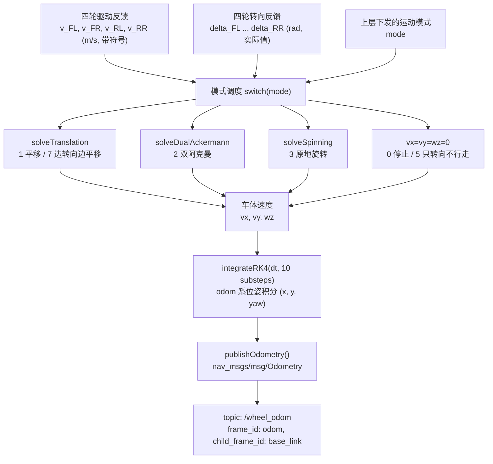
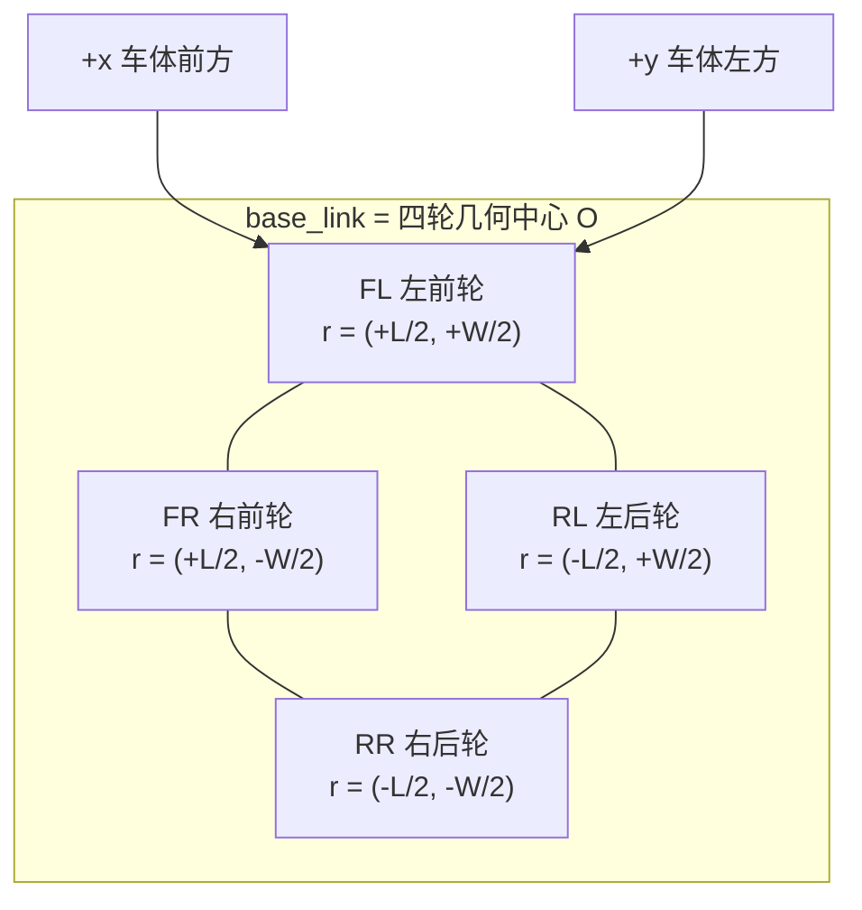
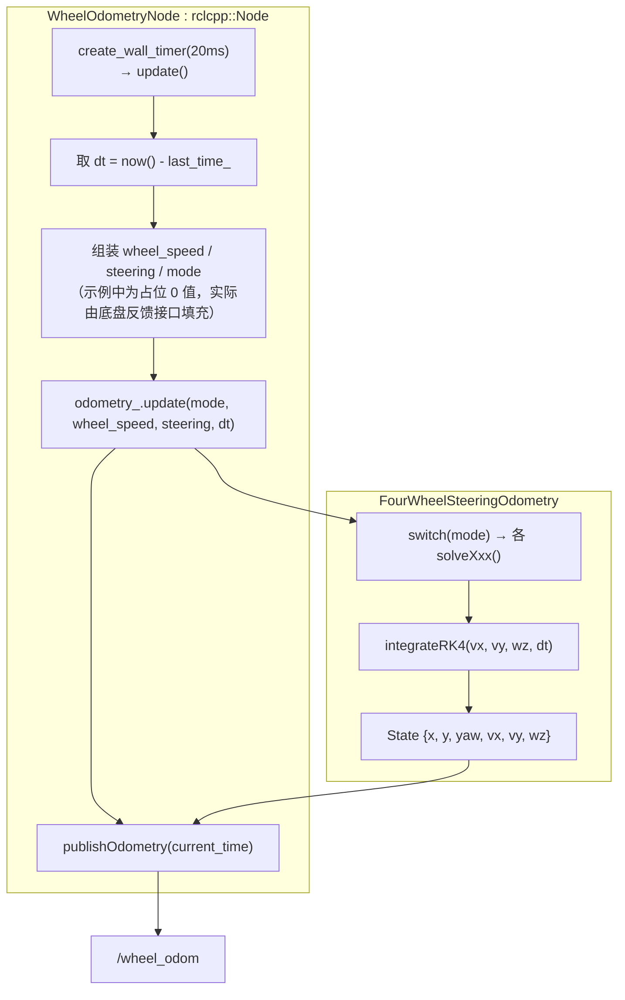
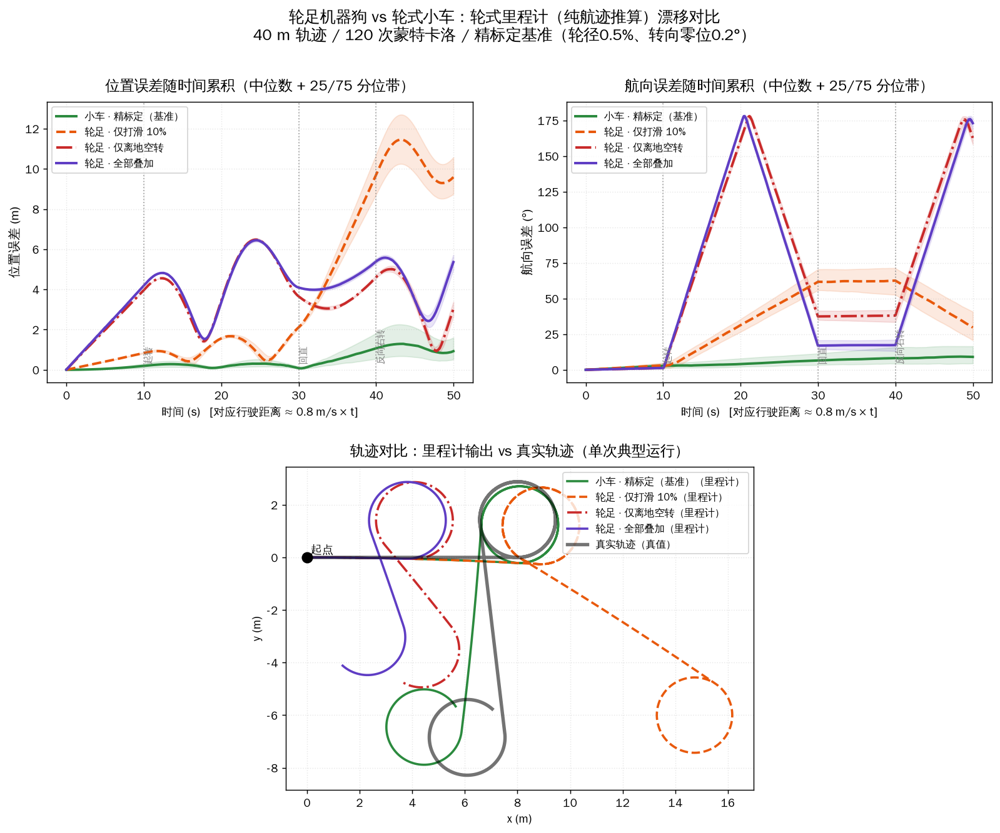

# 四轮独立驱动/转向底盘轮式里程计算法（ROS 2 Humble）

> **原文：** [周屹梁的学习笔记 - 轮式里程计算法](https://www.cnblogs.com/zylyehuo/p/22846793)（cnblogs: zylyehuo）
> **关联源码：** `ranger_base` 包的 `ranger_messenger.cpp`（里程计流程与模式调度）、`kinematics_model.hpp`（各模式运动学模型定义）
> **平台：** Ubuntu 22.04 + ROS 2 Humble，四轮独立驱动（4WID）+ 四轮独立转向（4WIS），二维平面运动

---

## 0. 一句话结论

这是一套**基于运动模式切换的轮式里程计正解**：每个控制周期取四个轮子的**实际线速度 + 实际转向角反馈**，按当前运动模式（平移 / 双阿克曼 / 原地旋转 / 停止 / 只转向 / 边转向边平移）用对应运动学模型解出车体速度 $(v_x, v_y, \omega_z)$，再用 **RK4** 在 odom 系中积分出 $(x, y, \theta)$ 并发布 `nav_msgs/msg/Odometry`。它不做任何传感器融合，是纯轮式航迹推算（dead reckoning）；模式本身由上层决策给出，里程计只负责"按模式解释轮子反馈"。

## 1. 系统概览

## 2. 坐标系、轮序与几何参数

底盘采用 ROS 标准右手系：`+x` 车体前方、`+y` 车体左方、`+z` 车体上方，**yaw 逆时针为正**。

- $L$：轴距（前后轮间距）；$W$：轮距（左右轮间距）。
- 示例代码中取 $L = 0.500\,\mathrm{m}$，$W = 0.480\,\mathrm{m}$。

**输入数据要求（原文强调）**

| 量 | 符号 | 单位 | 要求 |
|---|---|---|---|
| 实际线速度 | $v_{FL}, v_{FR}, v_{RL}, v_{RR}$ | m/s | **必须带正负号**（前进/后退） |
| 实际转向角 | $\delta_{FL}, \delta_{FR}, \delta_{RL}, \delta_{RR}$ | rad | **必须用实际反馈值，而不是控制器下发的目标值** |

> 最后一条是这套算法能成立的前提：Steering 有响应延迟与静差，用目标值会在转向过程中伪造出虚假位移。

## 3. 运动模式定义

原文模式表与示例代码枚举存在**一处编号不一致**，代码里 `STOP = 0`：

| 模式号 | 名称 | 车体行为 | 示例代码枚举 |
|---|---|---|---|
| 1 | 平移 | 四轮共同产生二维平移，不主动旋转 | `TRANSLATION = 1` |
| 2 | 双阿克曼 | 前后轮反相转向，绕瞬时旋转中心（ICR）运动 | `DUAL_ACKERMANN = 2` |
| 3 | 原地旋转 | 车体中心平移为 0，只估计 $\omega_z$ | `SPINNING = 3` |
| 4 / 0 | 停止 | 无位移、无 yaw 变化 | `STOP = 0`（**原文正文写 4，代码是 0**） |
| 5 | 只转向不行走 | 转向轮调整，驱动轮不走，不产生位移 | `STEER_ONLY = 5` |
| 7 | 边调整转向边平移 | 按平移模式处理（车体不主动改变 yaw） | `TRANSLATION_WITH_STEERING = 7` |

编号跳号、且 4 与 0 混用，是文档层面的小坑；实际底盘协议里的 mode 值需要与枚举对齐。

## 4. 各模式的解算模型

### 4.1 平移模式（1 / 7）

第 $i$ 个轮子的实际速度向量（由实际转向角决定方向）：

$$\mathbf{u}_i = v_i\begin{bmatrix}\cos\delta_i \\ \sin\delta_i\end{bmatrix},\quad
u_{i,x} = v_i\cos\delta_i,\quad u_{i,y} = v_i\sin\delta_i$$

四轮平均得车体平移速度，并且**强制 $\omega_z = 0$**：

$$v_x = \frac{1}{4}\sum_{i=1}^{4} v_i\cos\delta_i,\qquad
v_y = \frac{1}{4}\sum_{i=1}^{4} v_i\sin\delta_i,\qquad \omega_z = 0$$

代码要点（`solveTranslation`）：先把每个轮子的实际速度按实际转向角投影到车体 x/y 方向，再对四轮求平均；`mode == 7` 直接复用该函数。

> 隐含假设：四个轮子转向一致、无差速旋转。若实际存在轮间转向不同步，这部分旋转信息会被直接丢弃——即**模式误判会直接变成里程计误差**，没有估计器兜底。

### 4.2 双阿克曼模式（2）

**步骤一：四轮滚动速度平均得等效车速**

$$v = \frac{v_{FL} + v_{FR} + v_{RL} + v_{RR}}{4}$$

**步骤二：内侧轮转角 → 车辆中心等效转角**。阿克曼转向时内外轮转角不同，取内轮实测角 $\phi_i$ 换算：

$$\phi_c = \operatorname{atan2}\big(L\sin\phi_i,\; L\cos\phi_i + W\sin\phi_i\big)$$

**步骤三：前后轴反相，统一符号后取均值**

$$\phi = \frac{\phi_{front} + \phi_{rear}}{2}$$

**步骤四：车体速度与角速度**

$$v_x = v\cos\phi,\qquad v_y = 0,\qquad \omega_z = \frac{2v\sin\phi}{L}$$

代码要点（`solveDualAckermann`）：用 `front_mean = 0.5*(steering[FL]+steering[FR])` 的符号判断转向方向，决定内轮是 FL 还是 FR（后轴相应取 RL 或 RR，并取负号统一到前轮方向）；`|front_mean| < 1e-8` 时退化为直行 $v_x = v$；`|L| < 1e-9` 时 $\omega_z = 0$ 防除零。

**推导核验（已验证自洽）**：设转向时 ICR 位于过车体中心的横向轴上、距中心 $R_c$。前轴轮心速度方向与车体 x 轴夹角即等效中心转角，故 $\tan\phi = \dfrac{L/2}{R_c}$；内轮实测角满足 $\tan\phi_i = \dfrac{L/2}{R_c - W/2}$。两式消去 $R_c$ 得

$$\tan\phi = \frac{L\sin\phi_i}{L\cos\phi_i + W\sin\phi_i}$$

与原文 `innerToCentral()` 完全一致。再由 $v_x = v\cos\phi$、$\omega_z = v_x/R_c = \dfrac{v\cos\phi \cdot 2\tan\phi}{L} = \dfrac{2v\sin\phi}{L}$，可见 ${2v\sin\phi}/{L}$ 与 $R_c = \dfrac{L}{2\tan\phi}$ 是同一套几何，公式无误。

> 需要留意的两点：(1) 内轮转角被当作轮子**航向角**使用，隐含"转向角 = 轮平面朝向、无零点偏移/滞后"；(2) $v$ 是四轮滚动速度的**算术平均**，而阿克曼转弯时内外轮实际滚动速度本就不同（差速），平均会引入与转向半径相关的偏差。更严谨的做法是用各轮 $R_i$ 反解 $\omega_z$ 再加权。

### 4.3 原地旋转模式（3）

车体中心无平移（$v_x = v_y = 0$），只需估计 $\omega_z$。轮心位置 $r_i = [x_i, y_i]^T$，纯旋转刚体满足：

$$\mathbf{u}_i = \omega_z\begin{bmatrix}-y_i \\ x_i\end{bmatrix}
\;\Longrightarrow\;
\omega_i = \frac{-y_i\, v_i\cos\delta_i + x_i\, v_i\sin\delta_i}{x_i^2 + y_i^2}$$

$$\omega_z = \frac{\omega_{FL} + \omega_{FR} + \omega_{RL} + \omega_{RR}}{4}$$

代码要点（`solveSpinning`）：逐轮计算 `omega_i`；当 $x_i^2+y_i^2 \le 10^{-12}$（轮心与旋转中心重合）时跳过该轮，最后对**有效轮**计数求平均。

> 该式是 $\min_{\omega}\|\mathbf{u}_i - \omega[-y_i, x_i]^T\|^2$ 的最小二乘解，分母 $r_i^2$ 起归一化作用：它把实际速度投影到**切向**方向，天然忽略径向分量（纯旋转时径向分量应为 0）。但"各轮等权平均"只有在四个 $r_i$ 相等时才与全局最小二乘等价；四轮 $r_i^2$ 本来就相等（矩形对称），因此这里实际没问题。

### 4.4 停止 / 只转向模式（0 / 5）

$$v_x = 0,\qquad v_y = 0,\qquad \omega_z = 0$$

代码里直接置零。含义是：转向轮在动但驱动轮不走时，不产生任何里程计变化（同时也意味着此阶段的外力推移完全不可观测）。

### 4.5 模式与算法对照

| 模式 | 是否估计 vₓ, vᵧ | 是否估计 ω_z | 使用的反馈 | 复用的解算函数 |
|---|---|---|---|---|
| 1 平移 | 是：四轮投影平均 | 否：强制 0 | 四轮速度 + 四轮转角 | `solveTranslation` |
| 2 双阿克曼 | 是：v·cosφ | 是：2v·sinφ/L | 四轮速度 + 四轮转角 + L, W | `solveDualAckermann` |
| 3 原地旋转 | 否：强制 0 | 是：逐轮最小二乘 + 平均 | 四轮速度 + 四轮转角 + 轮心坐标 | `solveSpinning` |
| 0 停止 / 5 只转向 | 否：强制 0 | 否：强制 0 | 不参与 | 直接置零 |
| 7 边转向边平移 | 是：同平移 | 否：强制 0 | 四轮速度 + 四轮转角 | `solveTranslation` |

## 5. 位姿积分（odom 系，RK4）

车体速度 $(v_x, v_y, \omega_z)$ 定义在 `base_link` 系，需要旋转到 `odom` 系再积分：

$$\dot{x} = v_x\cos\theta - v_y\sin\theta,\qquad
\dot{y} = v_x\sin\theta + v_y\cos\theta,\qquad
\dot{\theta} = \omega_z$$

$$\frac{d}{dt}\begin{bmatrix}x\\ y\\ \theta\end{bmatrix}
= \begin{bmatrix} v_x\cos\theta - v_y\sin\theta \\ v_x\sin\theta + v_y\cos\theta \\ \omega_z \end{bmatrix}
= f(s),\qquad s = [x, y, \theta]^T$$

四阶 Runge-Kutta：

$$k_1 = f(s_k),\quad
k_2 = f\!\left(s_k + \tfrac{\Delta t}{2}k_1\right),\quad
k_3 = f\!\left(s_k + \tfrac{\Delta t}{2}k_2\right),\quad
k_4 = f\!\left(s_k + \Delta t\,k_3\right)$$

$$s_{k+1} = s_k + \frac{\Delta t}{6}\left(k_1 + 2k_2 + 2k_3 + k_4\right)$$

代码要点：
- 状态导数函数 `derivative(yaw, vx, vy, wz)` 返回 `{dx, dy, dyaw}`；$(v_x, v_y, \omega_z)$ 在**整个步长内视为常量**，唯一的非线性来源是 $\theta$ 对平移方向的影响，RK4 正是用来捕捉"边走边转"的圆弧效应。
- `integrateRK4` 内部把 $dt$ 细分为 `substeps = 10`（$h = dt/10$），每步都做一次完整的 4 级推进。
- 每次推进后用 `atan2(sin(yaw), cos(yaw))` 把 yaw 归一化到 $(-\pi, \pi]$，避免长时间累积后数值爆炸。

## 6. 里程计消息与发布

使用 `nav_msgs/msg/Odometry`，只填二维所需的字段：`header.frame_id / child_frame_id / pose.pose.position.x,y / pose.pose.orientation / twist.twist.linear.x,y / twist.twist.angular.z`。

$$q_z = \sin\!\left(\frac{\theta}{2}\right),\qquad q_w = \cos\!\left(\frac{\theta}{2}\right),\qquad q_x = q_y = 0$$

约定与实现：

| 字段 | 取值 | 语义 |
|---|---|---|
| `header.frame_id` | `"odom"` | 里程计参考系 |
| `child_frame_id` | `"base_link"` | 机器人本体 |
| `pose.pose` | 累积 $(x, y, \theta)$，$z = 0$ | 相对 odom 的**累计位姿** |
| `twist.twist` | 当前 $(v_x, v_y, \omega_z)$ | 在 **base_link** 系下的**瞬时速度** |
| `header.stamp` | 定时器当前时间 | 20 ms 周期 → 50 Hz |

## 7. 完整示例代码结构

第四部分给出了一份自包含的 ROS 2 Humble C++ 示例（不依赖具体底盘驱动，轮速/转角/模式由接口注入）：

- `FourWheelSteeringOdometry`：核心类，构造入参 `(wheelbase, track)`，构造时预计算 `wheel_x_ / wheel_y_`（±L/2、±W/2）；提供 `reset(x,y,yaw)`、`update(mode, wheel_speed, steering, dt)`、`state()`。
- `MotionMode`：`STOP=0 / TRANSLATION=1 / DUAL_ACKERMANN=2 / SPINNING=3 / STEER_ONLY=5 / TRANSLATION_WITH_STEERING=7`，`update()` 用 `switch` 分派；`STOP`、`STEER_ONLY` 与 `default` 分支统一置零。
- `update()` 开头 `dt <= 0` 直接返回，防止时间异常。
- `WheelOdometryNode`：50 Hz 定时器，`odometry_` 用 $L=0.500$、$W=0.480$ 构造，发布到 `/wheel_odom`（队列 10）。示例中轮速/转向/模式是写死的占位值，**接入真实底盘时需替换为反馈接口**。

## 8. 工程评述：可取之处、局限与可扩展点

**设计上站得住的地方**

1. **用实测反馈而非目标值**：转向与轮速都吃实际反馈，转向瞬态不会伪造位移；这是四轮独立转向底盘里程计最容易踩的坑。
2. **模式化建模**：4WID/4WIS 的运动学没有单一统一正解（阿克曼是约束运动、平移是自由运动、原地旋转又完全不同），显式按模式切换比硬套一个通用雅可比更清晰、更易验证。
3. **RK4 + 子步 + yaw 归一化**：成本极低（50 Hz 下每周期 10 次 4 级推进，纯标量运算），却显著改善"边走边转"的圆弧积分精度与长时间数值稳定性。
4. **原地旋转用最小二乘投影**：比"只用某一个轮子"或"avg(v_i \cdot r_i)/avg(r_i^2)"式的粗糙估计更稳健，且对轮心与旋转中心重合的病态情形做了显式剔除。
5. **解算与集成解耦**：`solveXxx()` 是纯函数式输出 $(v_x, v_y, \omega_z)$，便于单测（给定轮速/转角即可断言输出）。

**局限与风险**

| 问题 | 影响 | 建议方向 |
|---|---|---|
| 纯航迹推算，无 IMU / 视觉融合 | 轮子打滑、侧滑不可观测，误差单调累积 | 交给 EKF 融合（`robot_localization` 的 `ekf_node`）融合 IMU 与轮式里程计 |
| `pose.covariance` / `twist.covariance` 未填 | 下游 EKF 拿不到可信权重，只能靠默认值 | 按模式设置方差：打滑模式（平移/旋转）放大协方差 |
| 模式由外部给出，模式误判即误差 | 例如"边转向边平移"实为阿克曼运动时，$\omega_z$ 被强制为 0 | 增加零速/转向一致性校验；或用轮速自洽性（残差）反推模式 |
| 双阿克曼中 $v$ 取四轮算术平均 | 转弯时内外轮滚动速度不同，平均引入与 $R_c$ 相关的偏差 | 按各轮 $R_i$ 反解 $\omega_z \approx v_i / R_i$ 并加权平均 |
| 平移模式对四轮等权平均 | 单轮打滑/悬空会被平均稀释但不报警 | 加残差检测（各轮解算结果方差）与异常轮剔除 |
| 采用内轮实测角换算等效中心转角 | 依赖"转向角 = 航向角"、无零点偏置与迟滞 | 标定转向零点，或融合转向角速度判断瞬态 |
| 相邻轮心与旋转中心重合才跳过 | 阈值 $10^{-12}$（仅防 0 除） | 改为按 $r_i^2$ 加权，更贴合噪声特性 |
| 停止 / 只转向模式强制置零 | 该阶段外力推移完全丢失 | 与 IMU 融合后可覆盖该盲区 |

**可以拿来复用的场景**

- 麦克纳姆轮/全向轮的平移解算与该文平移模式同构（都是"把轮速投影到车体系再平均"），但全向轮不需要转向角。
- 原地旋转估计（$\omega_i = (-y_i u_{ix} + x_i u_{iy})/r_i^2$ 的逐轮投影 + 等权平均）可直接用于四轮差速底盘的旋转估计。
- RK4 子步积分器是通用的二维平面位姿积分件，换成任意来源的 $(v_x, v_y, \omega_z)$ 都能直接用。

## 9. 精度量化：漂移速率与轮足适用性

> 本节是对上述算法的**误差传播量化分析**：按第 4 节的解算模型与第 5 节的积分器做数值仿真，注入各类误差源后与真值比较。脚本见 [`assets/odometry_drift_sim.py`](./assets/odometry_drift_sim.py)。
>
> **仿真基线**：$L = 0.500$、$W = 0.480$；控制周期 20 ms（50 Hz）；速度 0.8 m/s；轨迹为「直行 10 s → 左转 20 s（$\phi = 10°$）→ 直行 10 s → 右转 10 s」，约 40 m；每档 120 次蒙特卡洛取中位数。

### 9.1 误差源与传播关系

| 误差源 | 传播关系 | 增长特性 |
|---|---|---|
| 轮径标定误差 $\varepsilon_r$ | 距离误差 $= \varepsilon_r \cdot d$ | 随距离**线性** |
| 转向角系统误差 $\delta\phi$（阿克曼） | 航向误差率 $\approx \dfrac{2\delta\phi}{L}$ | 随距离**线性**（每米） |
| 轴距标定误差 $\delta L$ | $\omega$ 相对误差 $= \delta L / L$ | 随转角线性 |
| 模式误判（平移模式强制 $\omega_z = 0$） | 真实旋转**完全不可观测** | 结构性 |

其中**转向角误差的放大极强**，且几乎与转角大小无关（$\cot\phi$ 与 $\cos\phi$ 的变化互相抵消）：

| 等效转角 $\phi$ | 2° | 10° | 20° | 30° | 45° |
|---|---|---|---|---|---|
| $\delta\phi = 0.3°$ → 航向误差率 | 1.20 | 1.18 | 1.13 | 1.04 | 0.85 |
| $\delta\phi = 0.5°$ → 航向误差率 | 2.00 | 1.97 | 1.88 | 1.73 | 1.41 |

（表内单位：°/m）

→ **$L = 0.5$ m 的底盘上，0.5° 的转向零点误差就对应约 2°/m 的航向漂移。转向角反馈的零点标定是这套算法的头号精度杠杆。**

### 9.2 轮式小车基准（阿克曼模式为主）

| 标定水平 | 位置误差（40 m） | 占行驶距离 | 航向漂移 |
|---|---|---|---|
| 完美标定 | 0.04 m | 0.09% | 0.00°/m |
| 精标定（轮径 0.5%、零位 0.2°、噪声 0.05°） | 0.93 m | 2.32% | 0.23°/m |
| 粗标定（1% / 0.5° / 0.15°） | 2.27 m | 5.67% | 0.55°/m |
| 未标定（2% / 1.0° / 0.3°） | 4.52 m | 11.31% | 1.10°/m |

换算为漂移速度（0.8 m/s）：精标定约 **11°/min**，粗标定约 26°/min，未标定约 53°/min。

**平移模式**明显更好（无航向漂移，位置误差 0.25%–1.05%），因为它不依赖转向几何换算。

### 9.3 两个实现层面的坑

**① `innerToCentral` 不能直接吃负角。** 该公式推导时假设内轮转角为正；右转时若把负角直接代入，分母 $L\cos\delta_i + W\sin\delta_i$ 中的 $W\sin\delta_i$ 变号，等效中心转角算错约 46%（仿真中位置误差因此虚高到 27%）。正确做法是**先按转向方向取符号、换算、再恢复符号**。

**② 高曲率下阿克曼模型失真。** 标定完美时 $\omega_z = 1.0$ rad/s 的急转仍被重建为 1.02（+2%），但 $\omega_z = 0.8$ 的纯旋转（$v_x = 0$）被重建为 1.109（**+38.6%**），并凭空产生 $v_x = -0.14$ 的虚假平移分量。原因之一是 $v$ 取四轮算术平均（4.2 节已注明的局限）在低车速高曲率下被放大。**模式选择不能只看上层指令**。

### 9.4 四轮足机器狗的额外误差

轮足机器狗的轮子装在腿末端，相较固定轮距小车多出四类误差源。以精标定小车为基准逐项注入：

| 场景 | 位置误差（40 m） | 占距离 | 航向漂移 |
|---|---|---|---|
| 小车 · 精标定（基准） | 0.93 m | 2.32% | 0.23°/m |
| 轮足 · 仅打滑 10% | 9.59 m | 23.97% | 0.74°/m |
| 轮足 · 仅俯仰 ±8° | 0.91 m | 2.27% | 0.23°/m |
| 轮足 · 仅腿摆动（对角 trot） | 0.93 m | 2.32% | 0.23°/m |
| 轮足 · 仅离地空转（停驱） | 3.20 m | 7.99% | **4.12°/m** |
| 轮足 · 全部叠加 | 5.53 m | 13.83% | **4.36°/m** |

**逐项机制**：

- **打滑（位置误差主导）**：滑移率直接构成距离比例误差（10% 滑移 ≈ 10 倍位置误差），随距离**线性累积**——短距离测试发现不了。
- **离地空转（最危险）**：某轮读数归零后，依赖**轮间比较**的内轮选择判断被破坏，$\omega_z$ 直接发散。航向误差从 0.23°/m 恶化到 **4.12°/m（约 18 倍）**——不是比例误差，而是**结构性失效**。
- **俯仰**：恒定 8° 坡仅贡献 0.97%/100 m，短程可忽略；但 20° 坡 → 6.0%/100 m，30° → 13.4%/100 m，长距离不可忽略。
- **腿摆动**：取决于步态对称性，见 9.5。

**综合**：轮足相比小车，位置误差约差 **6 倍**（2.32% → 13.83%），**航向误差约差 19 倍**（0.23 → 4.36°/m）。

> **航向的退化远大于位置。** 因为位置误差有多个方向相反的源（打滑高估、离地低估）可互相掩盖——表中"全部叠加"的位置误差（13.83%）反而小于"仅打滑"（23.97%）就是这个原因；而航向只依赖轮间几何关系，没有任何对冲机制。

### 9.5 腿摆动的抵消条件

腿摆动使轮心产生额外速度 $\dot{\mathbf{r}}_i$，算法在各模式下都忽略了该项。对**原地旋转**模式，污染项有解析形式：

$$\Delta\omega = \frac{\sum_i \left(-y_i s_{x,i} + x_i s_{y,i}\right)}{\sum_i \left(x_i^2 + y_i^2\right)},\qquad \mathbf{s}_i = \dot{\mathbf{r}}_i$$

- **对角 trot 步态**（相位 $0/\pi/\pi/0$）：分子几何上完全抵消，$\Delta\omega = 0$
- **同侧步态 / 相位紊乱**：不再抵消，摆动 0.19 m/s 时 $|\Delta\omega|$ 可达 **0.38 rad/s**（相对 $\omega_z = 0.8$ 偏差 **47%**）
- **单腿额外摆动**（负载不均、单腿故障）：0.10 m/s → 中位偏差 6.0%、95 分位 17.6%；0.19 m/s → 中位 11.6%、95 分位 33.8%

→ **对称性是这个算法唯一的安全垫**：一旦步态不对称（单腿负载差、相位紊乱、打滑不均），抵消条件立刻失效。

### 9.6 误差时变曲线与轨迹对比

- **位置误差**：基准全程 < 2 m；打滑轨迹前 20 s 几乎看不出问题，**进入长弯段后才陡升**——印证距离线性累积特性
- **航向误差**：离地空转在转弯段两次逼近 175°（约半圈），呈突变式发散
- **轨迹**：真实轨迹为「直行 + 左环 + 反向右环」；打滑轨迹整体拉长右移，离地轨迹的环位置与形状完全失真

### 9.7 若用于轮足底盘，四项必要改造

1. **腿正运动学实时给出 $\mathbf{r}_i(t)$**：把构造时写死的 `wheel_x_ / wheel_y_` 换成由关节角解算的时变量，并在运动学方程中补上 $\dot{\mathbf{r}}_i$ 项
2. **接触检测门控**：用关节力矩或足端力判断离地，离地轮直接剔除而非计入平均
3. **IMU 姿态补偿**：用 pitch/roll 修正几何投影（同时消掉爬坡的 $\cos$ 误差）
4. **填协方差**：`pose.covariance` / `twist.covariance` 目前为空，轮足上必须按模式与接触状态填方差，否则下游 EKF 无法正确降权

---

## 10. 关键参数速查

| 参数 | 值 | 位置 |
|---|---|---|
| 轴距 $L$ / 轮距 $W$ | 0.500 m / 0.480 m（示例） | `WheelOdometryNode` 构造 |
| 发布周期 | 20 ms（50 Hz） | `create_wall_timer` |
| 发布话题 | `/wheel_odom`（队列 10） | `create_publisher` |
| RK4 子步数 | 10 | `integrateRK4::substeps` |
| 除零保护 | `abs(L) < 1e-9`；`r_i^2 <= 1e-12`；`abs(front_mean) < 1e-8`；`dt <= 0` | 各解算函数 |
| frame 约定 | `odom` → `base_link`，$z = 0$，yaw 逆时针为正 | `publishOdometry` |
