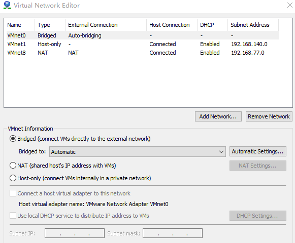

# Linux操作系统

<!-- @import "[TOC]" {cmd="toc" depthFrom=1 depthTo=6 orderedList=false} -->

<!-- code_chunk_output -->

- [Linux操作系统](#linux操作系统)
  - [实验 4 网络通信编程](#实验-4-网络通信编程)
    - [一、实验目的](#一实验目的)
    - [二、实验内容](#二实验内容)
    - [三、实验步骤](#三实验步骤)
      - [1. TCP 通信编程,相关知识请参考教材相关章节。](#1-tcp-通信编程相关知识请参考教材相关章节)

<!-- /code_chunk_output -->

>在正文部分，<font color = blue>蓝色的字</font>是**对问题的回答**或者**对下方图片的说明**。

<div STYLE="page-break-after: always;"></div>

## 实验 4 网络通信编程

### 一、实验目的

1.掌握 SOCKET 基础知识。
2.掌握 TCP 协议通信原理。

### 二、实验内容

1.掌握 SOCKET 基础编程。
2.掌握 TCP 协议通信编程。

### 三、实验步骤

#### 1. TCP 通信编程,相关知识请参考教材相关章节。

&emsp;&emsp;(1)编辑源代码 tcpserver.c 或者 tcpclient.c。
&emsp;&emsp;**<font color = red>说明</font>**:本次实验<font color = red>必须采用两人合作的方式</font>,(选定搭档后,不得更换,验收时两人一起验收;若对方程序遇到问题,需要一起解决),在实验报告中,<font color = red>需要说明合作方的学号</font>。
&emsp;&emsp;实验前<font color = red>请确保网络互通(参考实验 1)</font>。
&emsp;&emsp;请参照 PPT 完成代码。

<font color = blue>

和我合作的是龙浩然(2018215404)，我编辑的源代码为tcpserver.c(tcpserver2018211169.c)。
tcpserver2018211169.c：
</font>

``` C
#include <stdio.h>
#include <stdlib.h>
#include <string.h>
#include <sys/types.h>
#include <sys/socket.h>
#include <netinet/in.h>
#include <unistd.h>

int main(int argc, char *argv[])
{
    int sockfd, new_fd; //注意，这里有两个socket描述符
    //分别存放服务器和客户端的地址、端口等信息
    struct sockaddr_in server_addr, client_addr;
    int sin_size;
    int nbytes;
    char input[1024];
    char buffer[1024];
    short portnumber = atoi(argv[1]);
    if (1 == (sockfd = socket(AF_INET, SOCK_STREAM, 0)))
    { //创建socket
        printf("Socket error\n");
        exit(1);
    }
    bzero(&server_addr, sizeof(struct sockaddr_in));
    server_addr.sin_family = AF_INET;//服务器使用的协议
    server_addr.sin_addr.s_addr = htonl(INADDR_ANY);//服务器IP
    server_addr.sin_port = htons(portnumber);//服务器端口号
    //绑定sockfd
    bind(sockfd, (struct sockaddr *)(&server_addr), sizeof(struct sockaddr));
    listen(sockfd, 5);//在sockfd上侦听，最多允许5个连接
    bzero(&client_addr, sizeof(struct sockaddr_in));//先清空客户端信息，防止出错
    sin_size = sizeof(client_addr);
    //接受连接，将客户端信息存入client_addr，得到new_fd
    new_fd = accept(sockfd, (struct sockaddr *)(&client_addr), &sin_size);    
   
    while (1)
    {
      printf("send:"); 
      fgets(input, 1000, stdin); //输入字符，存入input
      send(new_fd, input, strlen(input), 0);//将input发给客户端
/*--------------------------------------------------------------------------*/
      if (-1 == (nbytes = recv(new_fd, buffer, 1024, 0)))
      { //接收客户端发来的数据
        printf("Read Error\n");
        exit(1);
      }
      buffer[nbytes] = '\0';
      printf("received:%s\n", buffer);
    }

    close(new_fd); //关闭socket描述符
    close(sockfd); //关闭socket描述符
    exit(0);
}
```

&emsp;&emsp;(2)写出 makefile , 编译后的可执行程序请命名为cpserver<font color = green>201601234</font>或者tcpclient<font color = green>201601234</font>。(请将 <font color = green>201601234</font> **<font color = red>替换为自己的学号,下同</font>**)。执行 make 并 **<font color = red>截图</font>** 记录操作过程和执行结果。

<font color = blue>makefile:</font>

``` makefile
tcpserver2018211169:tcpserver2018211169.c
	gcc tcpserver2018211169.c -o tcpserver2018211169
tcpclient2018211169:tcpclient2018211169.c
	gcc tcpclient2018211169.c -o tcpclient2018211169

clean:
	rm *2018211169
```

<font color = blue>
下图为 使用makefile文件编译 的截图。
</font>


&emsp;&emsp;(3)使用 ifconfig 命令配置 ip,参见实验 1。注意需要<font color = red>将 ip 的最后一个字节配置为</font>**<font color = green>自己学号的后两位</font>**(后两位为 00 则使用 100)。配置完成后,确保合作完成实验的两位同学之间能够互相 ping 通。
&emsp;&emsp;打开一个新的终端,**<font color = red>执行 tcpdump 命令抓包</font>**,注意使用 **<font color = red>合适的参数</font>**,运行 tcpdump的终端在(4)结束前不要关闭。
&emsp;&emsp;在实验(4)的通信过程中,用 tcpdump 将对话内容抓取下来(双方均需在自己的系统上使用 tcpdump,要求只抓本次通信的包,因此需要使用适当的参数过滤其它包。例如,tcpdump -n –XX –i eth0 port <font color = green>1234</font>,注意,需要根据自己所使用的网络接口号、端口号修改),**<font color = red>将抓包内容截图,一定要抓取到三次握手、对话内容、四次挥手的整个过程</font>**。

<font color = blue>
下图为 使用tcpdump命令抓包 的截图。可以看到在第四块中，有对话内容“hello i am 2018211169”，可以看到前三块中，有着TCP的三次握手（第一块没有截图全，它的Flags应为[S]），最后四个区块也表示着TCP的四次挥手（包括两次Flags为 F 的FIN）。
</font>


&emsp;&emsp;(4)测试运行程序,服务器端在终端中运行 tcpserver<font color = green>201601234</font>。客户端打开终端,运行 tcpclient<font color = green>201601234</font>,建立连接,然后发送消息(要求至少需要完成消息的一次收发,**<font color = green>消息内容包含双方的学号</font>**)并 **<font color = red>截图</font>**。注意:客户端一定要指定服务器的 ip 和端口号(可在程序中写死,也可通过 argv 获取)。

&emsp;&emsp;(5)若前面的代码只能进行一次通信过程,请将其改为能够持续对话的半双工通信程序(无需抓包)。在实验报告中附上<font color = red>源代码</font>并<font color = green>截图记录聊天过程</font>(聊天内容必须包含双方的学号)。
注:完成此部分后,请提交验收。

<font color = blue>
下图为 服务器端运行 的截图。

其中端口号由argv获取，此次运行使用的是8899端口，在这里，实现的只是半双工通信。
</font>


&emsp;&emsp;(6)上一步并不能做到消息完全自由收发,若要实现类似 QQ 的完全自由交谈,需要加入多进程(或多线程)功能。
&emsp;&emsp;请在课后完成并写入实验报告中。
&emsp;&emsp;如果使用虚拟机,需要检查虚拟网卡是否为 bridge 方式。(**<font color = red>仅针对在自己 PC 上补充完成实验的同学,实验室 PC 不涉及这一问题</font>**)
&emsp;&emsp;注意,如果使用虚拟机,请确保虚拟机网络的网络连接是否正常。在 VMWare 网络配置中,需要设置用于桥接的物理网卡,请根据自己所使用的物理网卡选择合适的选项。将下图中“Bridged to”的 Automatic 换成当前使用的网卡(参考实验 1)。



<font color = blue>
能够自由收发的tcp程序：(利用多线程)

tcpserver2018211169.c:
</font>

``` C
#include <stdio.h>
#include <stdlib.h>
#include <string.h>
#include <sys/types.h>
#include <sys/socket.h>
#include <netinet/in.h>
#include <unistd.h>
#include <pthread.h>

void *thread_listen(void * new_fd){
    char buffer[1024];
    int nbytes;

    while(1){
        if (-1 == (nbytes = recv(new_fd, buffer, 1024, 0)))
        { //接收客户端发来的数据
            printf("Read Error\n");
            exit(1);
        }
        buffer[nbytes] = '\0';
        printf("·received:\t%s\n", buffer);
    }
}

int main(int argc, char *argv[])
{
    int sockfd, new_fd; //注意，这里有两个socket描述符
    //分别存放服务器和客户端的地址、端口等信息
    struct sockaddr_in server_addr, client_addr;
    int sin_size;
    int ret;
    char input[1024];
    short portnumber = atoi(argv[1]);
    pthread_t listen_id;    //listen进程的id
    if (1 == (sockfd = socket(AF_INET, SOCK_STREAM, 0)))
    { //创建socket
        printf("Socket error\n");
        exit(1);
    }
    bzero(&server_addr, sizeof(struct sockaddr_in));
    server_addr.sin_family = AF_INET;                //服务器使用的协议
    server_addr.sin_addr.s_addr = htonl(INADDR_ANY); //服务器IP
    server_addr.sin_port = htons(portnumber);        //服务器端口号
    //绑定sockfd
    bind(sockfd, (struct sockaddr *)(&server_addr), sizeof(struct sockaddr));
    listen(sockfd, 5);                               //在sockfd上侦听，最多允许5个连接
    bzero(&client_addr, sizeof(struct sockaddr_in)); //先清空客户端信息，防止出错
    sin_size = sizeof(client_addr);
    //接受连接，将客户端信息存入client_addr，得到new_fd
    new_fd = accept(sockfd, (struct sockaddr *)(&client_addr), &sin_size);

    ret = pthread_create(&listen_id,NULL,thread_listen,(void *)new_fd);
    if(ret != 0){
        printf("Creat pthread error...\n");
        exit(1);
    }
/*--------------------------------------------------------------------------*/
    while (1)
    {
        fgets(input, 1000, stdin);             //输入字符，存入input
        printf("\n");
        send(new_fd, input, strlen(input), 0); //将input发给客户端
    }

    close(new_fd); //关闭socket描述符
    close(sockfd); //关闭socket描述符
    exit(0);
}
```

<font color = blue>
tcpclient2018211169.c:
</font>

``` C
#include <stdio.h>
#include <stdlib.h>
#include <string.h>
#include <sys/types.h>
#include <sys/socket.h>
#include <netinet/in.h>
#include <unistd.h>
#include <arpa/inet.h>
#include <pthread.h>

void *thread_listen(void * sockfd){
    char buffer[1024];
    int nbytes;

    while(1){
        if (-1 == (nbytes = recv(sockfd, buffer, 1024, 0)))
        { //接收客户端发来的数据
            printf("Read Error\n");
            exit(1);
        }
        buffer[nbytes] = '\0';
        printf("·received:\t%s\n", buffer);
    }
}

int main(int argc, char *argv[])
{ //参数判断略，共3个参数，命令名 ip 端口
    int sockfd;
    int sin_size;
    char input[1024];
    char buffer[1024];
    int ret;
    struct sockaddr_in server_addr;
    int nbytes;
    short portnumber = atoi(argv[2]);         //ascii转为int，得到端口号
    pthread_t listen_id;    //listen进程的id    
    sockfd = socket(AF_INET, SOCK_STREAM, 0); //创建socket描述符sockfd
    bzero(&server_addr, sizeof(struct sockaddr_in));
    server_addr.sin_family = AF_INET;
    server_addr.sin_port = htons(portnumber);                                              //字节序转换
    server_addr.sin_addr.s_addr = inet_addr(argv[1]);                                      //IP
    if (-1 == connect(sockfd, (struct sockaddr *)(&server_addr), sizeof(struct sockaddr))) //发起连接
    {
        printf("Connect Error\n");
        exit(1);
    }

    ret = pthread_create(&listen_id,NULL,thread_listen,(void *)sockfd);
    if(ret != 0){
        printf("Creat pthread error...\n");
        exit(1);
    }
/*--------------------------------------------------------------------------*/
    while (1)
    {
        fgets(input, 1000, stdin);             //输入字符，存入input
        printf("\n");
        send(sockfd, input, strlen(input), 0); //将input发给客户端
    }

    close(sockfd);
    exit(0);
}

```

<font color = blue>
下图为 该程序运行时 的截图。

其中，接收到的信息前会带有"·received:"标志.
</font>


