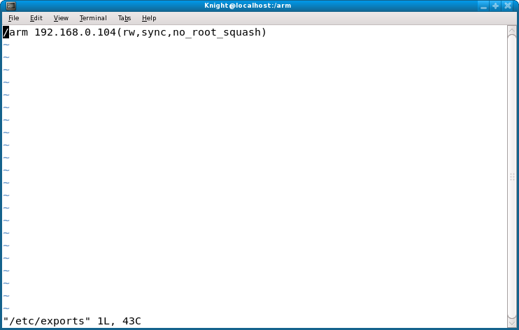

# 嵌入式系统

<!-- @import "[TOC]" {cmd="toc" depthFrom=1 depthTo=6 orderedList=false} -->

<!-- code_chunk_output -->

- [嵌入式系统](#嵌入式系统)
  - [实验一嵌入式Linux开发环境](#实验一嵌入式linux开发环境)
    - [一、准备工作](#一准备工作)
    - [二、通过串口控制开发板](#二通过串口控制开发板)
    - [三、配置minicom](#三配置minicom)
    - [四、通过minicom配置开发板](#四通过minicom配置开发板)
    - [五、建立主机开发环境](#五建立主机开发环境)
    - [六、尝试直接通过键盘控制开发板](#六尝试直接通过键盘控制开发板)
    - [七、通过ftp和telnet访问开发板](#七通过ftp和telnet访问开发板)
  - [实验二 交叉编译](#实验二-交叉编译)
    - [三、挂载共享目录](#三挂载共享目录)
    - [四、编写程序](#四编写程序)
    - [五、交叉编译并运行](#五交叉编译并运行)
    - [六、运算速度测试程序](#六运算速度测试程序)
    - [七、运算速度测试程序2](#七运算速度测试程序2)

<!-- /code_chunk_output -->

>在正文部分，<font color = blue>蓝色的字</font>是**对问题的回答**或者**对下方图片的说明**。

<div STYLE="page-break-after: always;"></div>

## 实验一嵌入式Linux开发环境

### 一、准备工作

&emsp;&emsp;后续实验大部分都需要使用串口，由于实验室PC没有串口，需要使用usb转串口线（实验室提供）。
&emsp;&emsp;将转接线的usb口连接电脑，串口端连接开发板的右侧串口；接通电源、用网线连接开发板与PC。

### 二、通过串口控制开发板

&emsp;&emsp;为了在虚拟机的Linux中使用串口，需要将串口添加到虚拟机中，有2种添加方式：将连接串口转接线的usb直接添加到虚拟机、或将串口添加到到虚拟机。可以根据自己的喜好选择其中一种方法（推荐方法1）。
&emsp;&emsp;**方法1）将usb添加到虚拟机**
&emsp;&emsp;确保虚拟机已经添加了usb控制器。并在虚拟机状态栏的右下角将usb转串口线“连接”到Linux虚拟机里。具体方法为，先在windows中关闭占用该usb转接线的软件（例如超级终端，如果未打开这类软件，则无需处理），然后右键usb图标（若有多个usb，请选择usb转串口转接线连接的usb——鼠标指向该usb，会有“Prolific USB-Serial Controller D”之类的提示），选择“连接”。

### 三、配置minicom

&emsp;&emsp;使用dmesg命令查看系统的启动信息，如果看到最后几行出现“USB Serial Device converter now attached to ttyUSB0”之类的字段，表明串口正常，只需要配置minicom就可以了。
&emsp;&emsp;注：若将usb直接添加到虚拟机（即前面的方法1），通常串口为<font color = red>ttyUSB0</font>；若将串口添加到虚拟机（即前面的方法2），通常串口为<font color = red>ttyS0</font>。（不同系统下，串口编号命名有所不同，可通过cat /proc/devices确定存在哪些串口）
&emsp;&emsp;在宿主机Linux 系统下的终端中输入（通常需要root权限执行）：

>minicom  -s

&emsp;&emsp;注： Fedora可先su，然后使用minicom；但在ubuntu中应该使用sudo minicom，su后执行minicom在某些版本的ubuntu中会报错。
&emsp;&emsp;minicom的设置界面如下（若使用minicom -s，会直接进入配置界面；若只输入minicom，需要先按Ctrl+a 键，再按z进入帮助，按提示信息进行如下配置）按“o”可进入配置界面：
&emsp;&emsp;选择Serial port setup，将串口配置为：波特率115200，8 位数据位，1 位停止位，没有流控和校验。并将其设置存为默认值（Save setup as dfl）。
&emsp;&emsp;一定要将Serial Device改为正确的串口设备，不同的系统，串口设备不同，通常为/dev/ttyUSB0（若前面使用方法1，或使用双系统）或/dev/ttyS0（若前面使用方法2）。
&emsp;&emsp;保存（Save setup as dfl）退出后回到minicom 界面。
&emsp;&emsp;配置好minicom后，重新启动开发板（不要直接关闭，按右侧的重启按钮即可），即可看到minicom界面上出现启动信息。

&emsp;&emsp;可能出现的错误及解决方案（大部分错误可通过以下方案解决）：
1.	在确定连接了usb转串口线的情况下，若在/dev/下看不到ttyUSB开头的文件，可使用mknod /dev/ttyUSB0 c 188 0添加（也可以为其它序号）。
2.	若存在/dev/ttyUSB0，但minicom不成功，可尝试在另一终端用root身份执行lsusb，然后执行dmesg，看看是否出现了USB串口。然后在minicom对应终端敲回车重试。


### 四、通过minicom配置开发板

&emsp;&emsp;为了使minicom与宿主机顺利通信，需要为它们配置IP，配置IP可通过ifconfig命令实现。
&emsp;&emsp;在minicom终端输入：

>ifconfig  eth0  192.168.0.1<font color = green>xx</font> 

&emsp;&emsp;另外开一个终端，为宿主机配置IP：

>ifconfig  eth0（或ens33等其他名称）  192.168.0.<font color = green>yy</font>

&emsp;&emsp;注： <font color = green>xx、yy</font>为<font color = red>合作双方的学号后两位</font>。例如，2016211511和2016211512合作完成本实验，可将目标板IP配置为192.168.0.111，宿主机IP设置为192.168.0.12；若单人独立完成实验，xx、yy均使用自己的学号后两位。

&emsp;&emsp;请将上面两个ifconfig及其执行结果截图放入实验报告中（<font color = red>图1、图2</font>）并用绿色方框标记出自己学号对应的IP信息（后续所有图片都需要做类似标记）。

<font color = blue>
下图为 ifconfig命令执行结果 的截图。
</font>


&emsp;&emsp;配置完成后，需要确保主机和开发板能够ping通。并将ping命令的结果截图，开发板和宿主机两边的ping都需要截图放入实验报告中（<font color = red>图3、图4</font>）。

<font color = blue>
下图为 ping命令执行结果 的截图。
</font>


&emsp;&emsp;注：若不能ping通，首先需要确认网线是否正常（可将该网线连接两台PC，确认能ping通）；然后检查虚拟机网络接口是否配置为桥接方式，同时，所桥接的物理网卡必须为所使用的有线网卡。
&emsp;&emsp;要记住哪个终端为minicom终端（该终端输入的命令将操作开发板）。如果不确定哪个终端为minicom终端，可使用uname -a查看终端是否连接开发板（即minicom终端）。
&emsp;&emsp;由于开发板上运行的是嵌入式Linux，因此，其命令与Linux命令完全一样，同学们可以尝试在上面执行一些常用的命令。尤其是使用uname -a、file等命令了解系统和文件信息，并熟悉ls、cd、pwd、df、mount、umount、vi的使用。

### 五、建立主机开发环境

&emsp;&emsp;实验室中的虚拟机已完成该操作。

### 六、尝试直接通过键盘控制开发板

&emsp;&emsp;开发板有usb口，可直接使用usb键盘实现输入（也可使用开发板的虚拟键盘输入）。这样，可以独立操作开发板，无需借助串口。
&emsp;&emsp;请尝试通过开发板的触摸屏打开“终端”软件，在终端中熟悉ls等命令。然后输入touch zhangsan和touch lisi命令（zhangsan、lisi为双方姓名），紧接着使用snapshot pic1.png命令对开发板的屏幕截图（<font color = red>图5</font>）。

<font color = blue>
下图为 在开发板中获取 的截图。
</font>


&emsp;&emsp;注：该图片可使用下一步实验的ftp方法下载下来。

### 七、通过ftp和telnet访问开发板

&emsp;&emsp;该部分使用Linux虚拟机完成。
&emsp;&emsp;1、ftp访问开发板
&emsp;&emsp;无论在 Linux 系统还是 Windows 系统中，一般都自带一个命令行的ftp程序。请使用Windows的ftp命令登录远程主机（开发板）并传递文件，但需要主机（开发板）提供ftp服务和相应的权限。实验室开发板在开机时启动了ftp服务。
&emsp;&emsp;接下来，我们将从PC的命令行窗口登录开发板，并与开发板传递文件。
ftp帐号为：plg（密码为plg）。
&emsp;&emsp;登录后，首先使用binary命令设置传输模式（非常重要，否则可能导致图片打不开）。
&emsp;&emsp;使用put、get命令上传、下载文件。

>put 本地文件名  [远程服务器（即开发板）文件名]
>get 远程服务器文件名（请下载上一步实验的截图pic1.png） [本地文件名]

&emsp;&emsp;注：若不是当前路径的文件，需要加上路径；[]内的内容表示可省略，直接上传或下载到默认路径。下载完成后，可在PC当前目录看到下载的文件；上传完毕后，目标板的/home/plg目录下可看到上传的文件。（需要注意，plg用户需要对下载/上传的目录具有相应权限）
&emsp;&emsp;在Linux中将put、get截图（<font color = red>图6、图7</font>）。然后使用bye命令退出ftp。

<font color = blue>
下图为 使用put、get命令 的截图。
</font>


&emsp;&emsp;注：可通过该方式将后续实验中开发板的截图下载到windows；Fedora虚拟机中的截图可通过vmware共享目录、u盘等其它方式拷贝出来。若使用vmware共享目录，需要先在fedora虚拟机的设置->选项->共享文件夹中设置一个windows的目录，这个目录可在Fedora虚拟机中通过/mnt/hgfs目录访问。

<div STYLE="page-break-after: always;"></div>

## 实验二 交叉编译

&emsp;&emsp;一、准备工作
&emsp;&emsp;在进行本实验前，需要确保实验一的嵌入式开发环境已经配置好（实验一的五、六、七部分无需重复）。
&emsp;&emsp;二、配置NFS 服务
&emsp;&emsp;在NFS 服务中，宿主机（Servers）是被挂载（mount）端，为了远端目标板（Clients）可以访问主机的文件，我们需要主机配置两方面内容：打开NFS 服务，允许“指定用户”使用。
关闭防火墙和iptables服务：
&emsp;&emsp;在ubuntu中，可通过ufw disable关闭防火墙。
&emsp;&emsp;在CentOS/Fedora中，可通过setup命令，选择System services，将nfs一项选中（出现[\*]表示选中），并去掉ipchains 和iptables两项服务（即去掉它们前面的*号）；然后在Firewall configuration中，选中 Disable。
&emsp;&emsp;接着通过编辑文件“exports”使“指定的用户”能访问“指定的文件夹”（可能需要root权限）：

>vi  /etc/exports

&emsp;&emsp;这条命令用于编辑etc目录下的exports。如果没有exports，则会自动新建。运行上面的指令后进入vi编辑界面。按 i 键进入编辑模式然后输入：

>/arm  目标板IP(rw,sync,no_root_squash)

&emsp;&emsp;<font color = red>截图（实验报告中包含该图片，图1）</font>后保存退出vi。

<font color = blue>
下图为 使用vi编辑etc目录下的exports文件 的截图。
</font>



&emsp;&emsp;上面内容要求：“/arm”可以被目标板访问到并读写。
&emsp;&emsp;键入service rpcbind restart（旧版本Linux中为service portmap restart）、service nfs restart（ubuntu中为service nfs-kernel-server restart，需要先安装nfs-kernel-server）重新启动NFS服务，使我们的设置生效。
&emsp;&emsp;注：在此之前需要确保IP地址（<font color = red>包含自己和合作伙伴的学号后两位</font>）已正确配置，具体方法请参考上一实验。
&emsp;&emsp;这样按照上面的步骤，就可以在minicom下，让实验板通过网络挂载宿主机的共享文件夹，如同操作实验板本身的文件夹一样操作宿主机的共享文件夹。
&emsp;&emsp;准备就绪后，就可以进行简单的交叉编译和在开发板上运行程序了。

### 三、挂载共享目录

&emsp;&emsp;将宿主机的目录挂载到开发板。在minicom端口输入

>mount  –t  nfs  –o  nolock  宿主机IP:/arm   /mnt 

&emsp;&emsp;<font color = red>将该命令的正确执行结果截图（图2）</font>并放入实验报告中。（宿主机IP和目标板IP中，至少有一个应当包含自己学号的后两位，否则截图无效）

<font color = blue>
下图为 mount命令将宿主机的目录挂载到开发版中 的截图。
</font>


&emsp;&emsp;注：如果出现问题，可从以下几方面排查：
·检查网线连接和宿主机IP，确认宿主机与开发板之间能ping通。
·/etc/exports文件配置不对（例如，exports里面的IP不是开发板的IP而是主机的IP），或者修改了此配置文件但没有重启NFS服务使之生效
·确认Firewall是否已经关闭。
·如果nfs出现丢包，可以在mount时使用tcp。mount -t nfs -o nolock -o tcp 宿主机IP:/arm  /mnt
&emsp;&emsp;如果上面的命令成功，则输入：

>cd  /mnt
>ls

&emsp;&emsp;<font color = red>截图（图3）显示ls的结果并放入实验报告中</font>。

<font color = blue>
下图为 mount命令将宿主机的目录挂载到开发版中 的截图。
</font>


&emsp;&emsp;注：由于开发板的nfs客户端版本较老，ls可能看不到信息（新版本Linux中这一现象很普遍）。若存在这一问题，可以尝试在mount选项中加上nfsvers=3（或者其他版本号，请多尝试几次）。注意，需要先umount后才能重新mount。

### 四、编写程序

&emsp;&emsp;宿主机上另开一个终端（这里将其称为终端２，前面的称为终端１，终端1输入的命令将在开发板上执行，终端2输入的命令将在宿主机中执行）输入如下命令（若目录不存在，请先创建，其中zhangsan替换为自己的姓名拼音）：

>cd  /arm/nfs_<font color = green>zhangsan</font>
>vi  HelloWorld.c

&emsp;&emsp;编写HelloWorld程序后保存退出。

### 五、交叉编译并运行

&emsp;&emsp;在终端２中输入（若HelloWorld.c是root用户创建，可能需要root权限编译）命令进行交叉编译：

>arm-linux-gcc -o helloworld<font color = green>zhangsan</font>  HelloWorld.c

&emsp;&emsp;其中，<font color = green>zhangsan为自己的姓名拼音</font>。请将正确编译的结果截图并放入实验报告中（图4）

<font color = blue>
下图为 利用arm-linux-gcc命令编译ARM平台helloworld文件 的截图。
</font>


&emsp;&emsp;如果此步出现错误信息，请查看错误信息，并且重新编辑原来的C文件修改错误，直到正确编译。
&emsp;&emsp;此时生成的helloworld<font color = green>zhagnsan</font>文件不能在PC上运行，只能在开发板上运行。如果尝试在终端2执行该程序将会报错。可使用命令查看该文件的信息，这里可以看到arm字样。

>file  helloworld<font color = green>zhangsan</font>

&emsp;&emsp;回到开着minicom 的终端1上输入

>cd  /mnt/nfs_<font color = green>zhangsan</font>
>ls

&emsp;&emsp;可以看到里面有helloworld<font color = green>zhagnsan</font>文件（如果看不到，请检查宿主机中该目录和目录下的文件的权限，以及mount选项中nfsvers是否正确）。输入

>./helloworld<font color = green>zhangsan</font>

&emsp;&emsp;即可得到程序运行结果。<font color = red>将该结果截图放入实验报告中（图5）</font>。

<font color = blue>
下图为 交叉编译helloworld并在开发版上运行 的截图。
</font>


### 六、运算速度测试程序

&emsp;&emsp;将同一程序分别进行编译和交叉编译，在开发板和主机上分别运行，测试两者的运行时间，同时也可以对比不同主机的运行时间，对开发板和主机的运算速度做一个简单的测试。
&emsp;&emsp;要求如下：
&emsp;&emsp;程序主体功能为随机生成10000个整数（数字大小在1000000以内），并对这些数冒泡排序，在执行排序之前，打印排序前的数组和当前时间，排序结束后，再次打印当前时间和排序后的数组。计算两次时间之差即为排序算法所需的执行时间。
&emsp;&emsp;提示：可使用man time.h查看与计时相关的函数帮助。获得的时间最好为微秒级，至少要为毫秒级。
&emsp;&emsp;请<font color = red>将程序在宿主机和开发板中的运行结果分别截图，分析两者的差异</font>。（<font color = red>图6，图7</font>，一张截图中必须同时包含耗费的时间，以及部分排序前的数、排序后的数）
&emsp;&emsp;参考程序（仅包括时间获取部分，剩余部分需自行完成）

``` C
#include<stdio.h>
#include<sys/time.h>//time.h在/usr/include/time.h，可以直接打开文件看。

void main()
{
  int i;
  long start_sec, start_usec, end_sec, end_usec, time_spend;
  struct timeval start_time, end_time;
//TODO：随机生成10000个数（可通过srand(10)设置随机数种子，并使用rand()%1000000生成1000000以内的随机数）
//获取当前时间,能精确到微秒,其中tv_usec存放的为微秒
  i=gettimeofday(&start_time,NULL); //这里的NULL换成真正的变量更好
  start_sec =(double)start_time.tv_sec;
  start_usec =(double)start_time.tv_usec;
  printf("Starttime: tv_sec=%d,sus_t=%d\n", start_sec, start_usec); 
//TODO：添加排序功能
//TODO：再次获取并打印时间，然后与前面的时间相减，得到time_spend
  printf("Endtime: tv_sec=%d,sus_t=%d\n", end_sec, end_usec); 
//TODO：根据Starttime和endtime计算耗费的时间
  printf("Zhangsan &Lisi Test: %d micro seconds in PC\n",time_spend);
  // Zhangsan、Lisi为组员的姓名，在嵌入式中的测试则将PC改为ARM
}
```

注意：可通过rand函数设置随机数，srand设置随机数的种子，只有同样的随机数种子得到的结果才能反映不同平台的速度（不同随机数种子得到的数不同，排序所需时间本身就有可能有较大差别）。

<font color = blue>这里忘记将嵌入式中的输出字符串由“PC”改为“ARM”了，导致这里显示的都是“PC”</font>

<font color = blue>
下图为 在宿主机上的冒泡排序程序的运行结果 的截图。
</font>


<font color = blue>
下图为 在开发板上的冒泡排序程序的运行结果 的截图。
</font>


### 七、运算速度测试程序2

&emsp;&emsp;请将上一步实验的排序算法改为快速排序算法，重新测试并比较耗费的时间（不要更改随机数种子）。
&emsp;&emsp;请<font color = red>将程序在PC中运行并截图，分析快速排序与冒泡排序耗费的时间</font>。（<font color = red>图8</font>，截图要求同图6）。说明：请确保快速排序和冒泡排序的运行环境相同（若快速排序是在课后完成的，请将冒泡排序也在相同环境下再运行一次进行比较）。

<font color = blue>
下图为 在宿主机上的快速排序程序的运行结果 的截图。
</font>


<font color = blue>
下图为 在开发板上的快速排序程序的运行结果 的截图。
</font>


注：
1.可通过lokkit命令（若安装了此命令），在图形化界面中关闭防火墙；
2.可通过图形化方式启动NFS服务：serviceconf打开系统服务配置窗口，在左侧一栏找到 nfs 服务选项框，并选中它，然后点工具栏 的“Enable”启动它