# 嵌入式系统

<!-- @import "[TOC]" {cmd="toc" depthFrom=1 depthTo=6 orderedList=false} -->

<!-- code_chunk_output -->

- [嵌入式系统](#嵌入式系统)
	- [实验三、UDP网络编程](#实验三udp网络编程)
		- [一、准备工作](#一准备工作)
		- [二、实验内容](#二实验内容)
			- [1、PC之间通信](#1pc之间通信)
			- [2、开发板与PC之间通信](#2开发板与pc之间通信)
			- [3、开发板之间的通信](#3开发板之间的通信)
	- [实验四、shell编程（4课时）](#实验四shell编程4课时)
		- [一、编写满足下列要求的shell程序](#一编写满足下列要求的shell程序)
		- [二、编写shell脚本，实现计算器](#二编写shell脚本实现计算器)

<!-- /code_chunk_output -->

>在正文部分，<font color = blue>蓝色的字</font>是**对问题的回答**或者**对下方图片的说明**。

<div STYLE="page-break-after: always;"></div>

## 实验三、UDP网络编程

### 一、准备工作

&emsp;&emsp;本实验将实现UDP网络编程，在实验之前，需要复习UDP通信知识。可参照Linux课程的相关讲义。
&emsp;&emsp;本次实验的最后一步需要2组配合完成，请先选择搭档，并在第2步时选用不同的方式。

### 二、实验内容

#### 1、PC之间通信

&emsp;&emsp;两人合作完成UDP通信程序，实现PC中的交互式通信（至少需要实现交互式聊天，可使用127.0.0.1与本机通信），并且需要将IP和端口作为程序执行时的参数（提示：通过main函数的argc、argv参数实现），方便程序移植。

&emsp;&emsp;要求将程序在PC上编译为server_<font color = green>zhangsan</font>和client_<font color = green>lisi</font>（<font color = green>zhangsan</font>和<font color = green>lisi</font>为合作双方的姓名）；

&emsp;&emsp;请<font color = red>将聊天窗口截图（请将服务器和客户端所截的图都放入实验报告，图1、图2）</font>。若截图中未出现自己的姓名，截图无效，下同。

<font color = blue>
下图为 运行在服务器端的窗口 的截图：张禧龙-2018211169
</font>

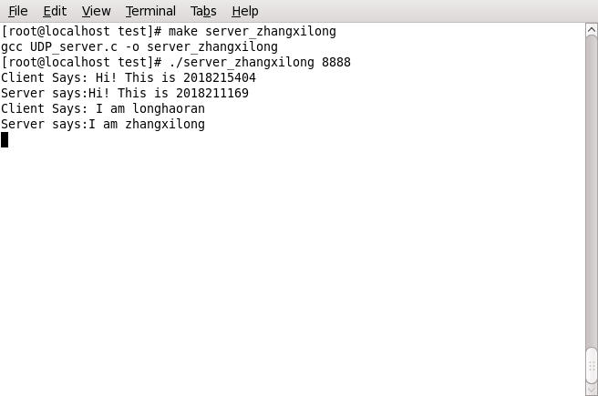

<font color = blue>
下图为 运行在客户端的窗口 的截图：龙浩然-2018215404
</font>

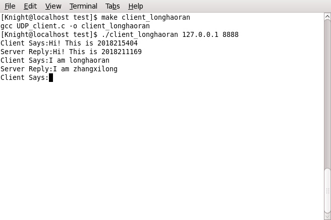

&emsp;&emsp;说明：前2部分实验2人完成，若截图中出现的姓名数量大于2，截图无效。第3部分实验4人完成，截图中需要且只能出现4个人的姓名学号。<font color = red>若有特殊情况导致不符合要求，需要用标红的文字说明原因</font>，否则截图无效。

#### 2、开发板与PC之间通信

&emsp;&emsp;使用交叉编译的方式分别编译客户端和服务器端程序得到serverARM_<font color = green>zhangsan</font>和clientARM_<font color = green>lisi</font>。
&emsp;&emsp;将PC作为服务器、开发板作为客户端（或者将PC作为客户端、开发板作为服务器，两种方式任选一种，由于最后一步需要2组配合，2组人员请使用不同的方式），使用server_<font color = green>zhangsan</font>与clientARM_<font color = green>lisi</font>（或serverARM_<font color = green>zhangsan</font>与client_<font color = green>lisi</font>）实现开发箱与PC之间的通信，<font color = red>将聊天窗口截图（请将双方所截的图都放入实验报告，图3、图4）</font>。注意：开发板需要用虚拟键盘输入并通过开发板的snapshot命令截图，不能通过minicom聊天。

<font color = blue>
我们组的截图没法打开了，下面是合作的郝鹏帅、施凯组的截图。
</font>

·

<font color = blue>
下图为 运行在ARM上的客户端 的截图：张禧龙-2018211169
</font>

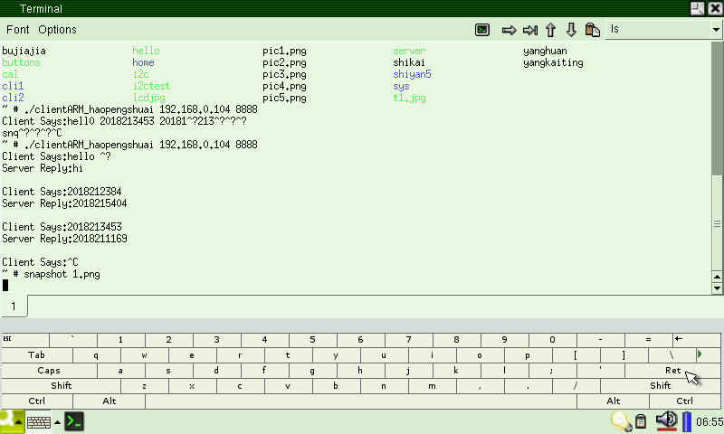

<font color = blue>
下图为 运行在PC上的服务器端 的截图：
</font>

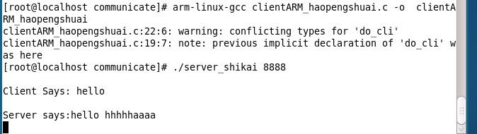

#### 3、开发板之间的通信

&emsp;&emsp;自己的开发板与其它开发板实现聊天（开发板通过虚拟键盘，或连接usb键盘直接输入，不依赖于minicom）。请<font color = red>将聊天窗口通过开发板截图（双方所截的图都放入实验报告，截图中含两组人员的学号信息，图5、图6）</font>。注意，截图需要在开发板中使用snapshot命令。

<font color = blue>
与我们组合作的是郝鹏帅、施凯组。
</font>

·

<font color = blue>
下图为 我们组的服务器端 的截图：
</font>

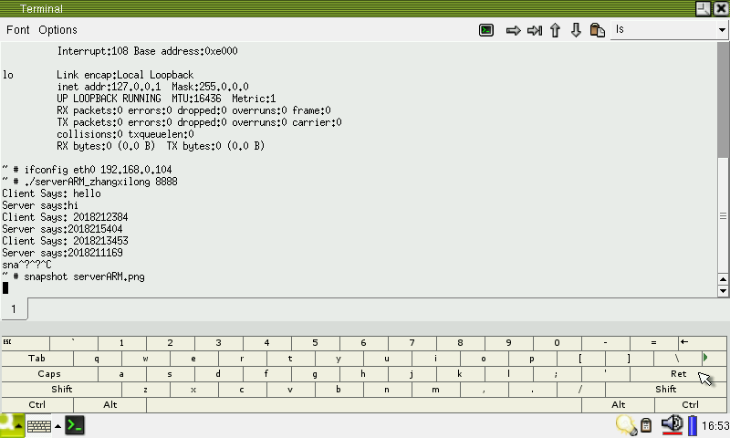

<font color = blue>
下图为 郝鹏帅、施凯组的客户端 的截图：
</font>


<div STYLE="page-break-after: always;"></div>

## 实验四、shell编程（4课时）

### 一、编写满足下列要求的shell程序

&emsp;&emsp;程序功能：为班级成员创建目录（以学号命名，需要考虑转专业的非连续学号）
&emsp;&emsp;通过shell的前2个参数指定起始学号和结束学号、其余参数为单独学号，在/tmp中创建以学号命名的目录，创建前需要判断是否存在同名目录。例如，参数为2016211820、2016211970、2016212005、2016211801…（参数中必须有一个为自己的学号），则需要创建2016211820、2016211821、……、2016211969、2016211970、2016212005、2016211801这些目录。单独学号若在前两个参数区间内，无需重复创建；单独学号若不在前两个参数区间内，则表示这个学号是后来转入本班的同学，需要创建该目录。单独学号的数量可以有很多，不设上限。

&emsp;&emsp;程序要求：
&emsp;&emsp;1、出错判断：若shell参数数量不对（小于2）、或者输入的参数不是数字、或输入的学号范围过大（要求学号总数量小于200）、或第二个参数小于第一个参数，提示对应的出错信息；
&emsp;&emsp;2、创建目录：若不存在这些目录，请创建这些目录并在程序结束时打印出新添加的目录；若只存在部分目录，请创建缺失部分，并在程序结尾处打印出新添加的目录名；若全部存在，打印出“所有目录均已存在，无需创建”。
&emsp;&emsp;执行上述程序4次（输入的参数出错、/tmp中不存在此类目录、存在部分此类目录、存在全部指定目录，分别截图）。附上<font color = red>shell程序代码（代码1）</font>、<font color = red>执行过程截图（图1、图2、图3、图4）</font>。

<font color = blue>
shell程序代码：
</font>

``` shell
#! /bin/bash
var=0
var1=0
if [ $# -ge 2 ] ; then 
        for(( k=1; k<=$#; k++ )) ; do
	eval h=\$$k
	expr $h + 1 &> /dev/null
	if [[ $? != 0 ]]
	then
                var1=1
		break
	fi
	done
	if [ $var1 -eq 0 ];then
		amount=$[$2-$1+$#-2]
		if [ $1 -lt $2 ] ; then
		if [ $amount -lt 200 ] ; then
			for ((i=0;i<=$[$2-$1];i++))
			do
				dir=$[$1+i]
				if [ -e $dir ] ; then :
				else
					mkdir $dir
					echo "New directry: $[$1+i] has been created."
					var=1
				fi
			done
			if [ "$3" ] ; then 
				for ((j=3;j<=$#;j++))
				do
					eval dir=\$$j
					if [ -e $dir ] ; then :
					else 
						mkdir $dir
						echo "New directry: $dir has been created."
						var=1
					fi
				done
			fi
			if [ $var -eq 0 ] ; then
			echo	"所有目录均已存在，无需创建"
			fi	
		else
			echo "The number of directory should less than 200" 
		fi
		else
			echo "The 1st number should less than 2nd number."
		fi
        else  
                 echo "The paraments should all be number"
	fi
else
	echo 'The number of paraments is less than 2'
fi
```

<font color = blue>
下图为 运行该脚本 的截图：
</font>

·

<font color = blue>
下图为 输入参数出错 的截图：
</font>

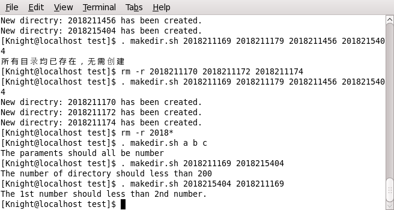

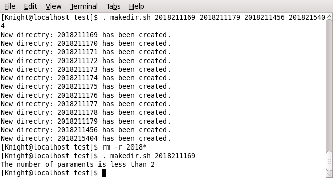

<font color = blue>
下图为 /tmp中不存在此类目录 的截图：
</font>

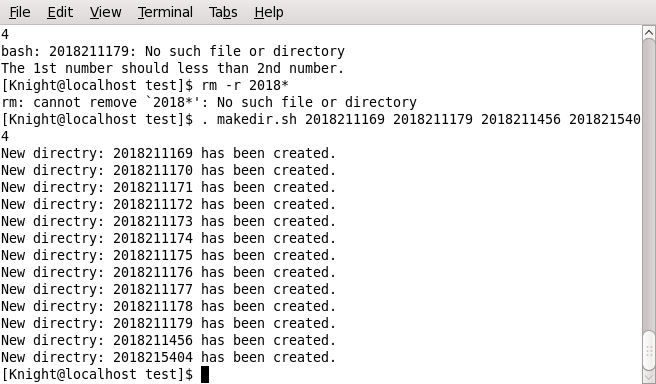

<font color = blue>
下图为 /tmp中存在部分此类目录 的截图：
</font>

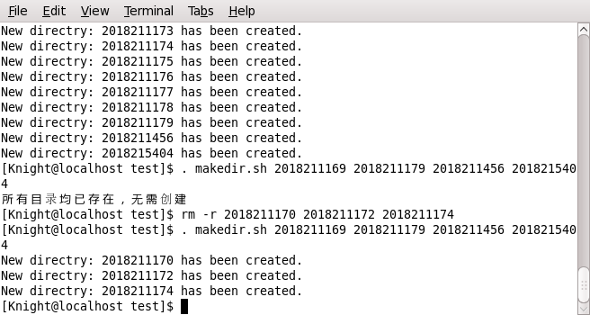

<font color = blue>
下图为 /tmp中存在全部此类目录 的截图：
</font>

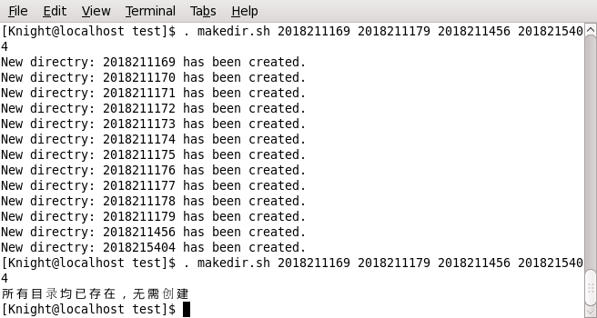

### 二、编写shell脚本，实现计算器

&emsp;&emsp;<font color = red></font>先输出作者学号与姓名，并提示用户输入2个整数和运算符，输出运算结果，实现方式不限，但必须满足如下要求：
&emsp;&emsp;至少需要实现加减乘除运算；
&emsp;&emsp;需要判断输入不正确的情况（例如，输入的不是数字和运算符），如果输入不正确，需要打印提示并接受用户重新输入；
&emsp;&emsp;计算出结果并打印出来后，程序重复执行计算器功能，直到用户输入指定字符（例如quit、q等）。
&emsp;&emsp;请在实验报告中附上<font color = red>源码</font>和<font color = red>完整运行截图</font>，截图中需要分别展示+、-、*、/运算<font color = red>（图5）</font>，还需要展示负数运算、除数为0、输入的运算符不对、输入的不是数字这4种特殊情况<font color = red>（图6）</font>。

<font color = blue>
shell程序代码：
</font>

``` shell
#!/bin/bash

echo "2018211169-zhangxilong 20182015404-longhaoran"

while true; do
	read -p "please input :" var1 var2 var3
	if [[ $var1 == quit ]];
	then break
	elif [[ $var2 == \/ &&  $var3 -eq 0 ]];
	then
		echo "The divider is 0,please input again."
		continue
	else
		expr $var1 + 0 &> /dev/null
		if [ $? -ne 0 ];then
			echo "You shuold input two number,input again"
			continue
		fi
		expr $var3 + 0 &> /dev/null
		if [ $? -ne 0 ];then
			echo "You shuold input two number,input again"
			continue
		fi
	fi

		case $var2 in
			+) result=`expr $var1 + $var3` 
			echo "The result is $result";;
			-) result=`expr $var1 - $var3` 
			echo "The result is $result";;
			\*) result=`expr $var1 \* $var3` 
			echo "The result is $result";;
			\/) result=`expr $var1 \/ $var3`
			echo "The result is $result";;
			*) echo "You should input a operator,input again"
		esac
done
```

<font color = blue>
下图为 执行该脚本 的截图：
</font>

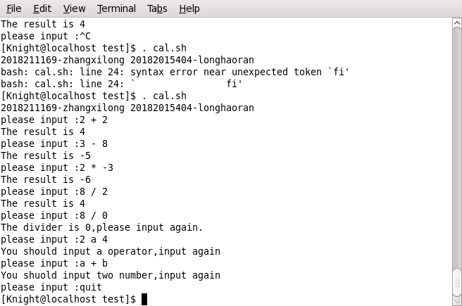
