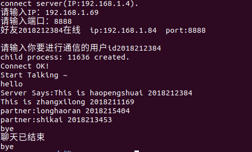

# 嵌入式系统

[toc]

>在正文部分，<font color = blue>蓝色的字</font>是**对问题的回答**或者**对下方图片的说明**。

<div STYLE="page-break-after: always;"></div>

## 实验六、嵌入式聊天软件设计（8课时）

&emsp;&emsp;本次实验6人（即3组）一起完成（所有成员都需要参与，且都要熟悉整个系统的原理）

### 实验要求：

&emsp;&emsp;结合前面的实验，完成服务器端程序和客户端程序（需2个客户端）。其中，服务器端在PC中运行（该PC上安装了数据库）；客户端程序在开发板上运行。PC、开发板均通过网线接入实验室内网，确保服务器和2个客户端网络畅通。
&emsp;&emsp;注意：由于开发板的出厂MAC地址都相同，为了确保接入内网后网络正常，请通过ifconfig命令更改MAC地址（例如，将MAC地址改为01:02:03:04: ab:cd，abcd为学号后4位）。
&emsp;&emsp;通过交叉编译，得到可在开发板上使用的客户端程序。

### 服务器端程序功能：

&emsp;&emsp;1、同时具备通信和数据库管理功能（数据库部分参照前面的实验）；
&emsp;&emsp;2、绑定IP、端口，等待接收客户端消息（TCP、UDP均可）；
&emsp;&emsp;3、收到用户（客户端）发过来的登录请求（同时会附带UDP聊天端口号）后，在数据库中更新该用户的在线状态、IP、端口（这个端口是该用户与其它用于聊天的端口，而非与服务器通信的端口）；
&emsp;&emsp;4、通过用户id在数据库中查询该用户的好友列表，并通过在线好友的id查询好友的IP、端口（这个端口将用于UDP聊天），发送给用户；
&emsp;&emsp;5、（选作）收到离线消息后，更新用户的在线状态；
&emsp;&emsp;6、（选作）一旦有用户的在线状态或IP发生更改，需要更新数据库，并将新的状态和IP通知其好友。

### 客户端程序功能：

&emsp;&emsp;1、程序运行时需要指定参数（服务器IP、与服务器通信的端口、与其他用户聊天的端口）；
&emsp;&emsp;2、客户端的通信包括2部分：与服务器之间交互信息；两个客户端之间使用udp聊天（建议通过多进程或多线程实现全双工）
&emsp;&emsp;3、用户输入id（有兴趣的同学可进一步确认密码），连接服务器（服务器的地址和端口在程序执行参数中指定）；
&emsp;&emsp;4、（在绑定本机UDP聊天端口的基础上）向服务器发送本机IP、UDP聊天用的端口号；
&emsp;&emsp;5、接收到服务器发来的在线好友的IP、端口信息（可多次接收）；
&emsp;&emsp;6、用户输入好友的id，开始聊天（注意：实际在后台是通过ip、端口通信的，但对使用者来说无需关注IP、端口）；
&emsp;&emsp;7、（选作）程序正常退出前，向服务器发送离线消息。
&emsp;&emsp;在一台PC中运行服务器端程序。在两台嵌入式设备上同时运行客户端程序，实现两个客户端程序之间的聊天（注意：两台客户端之间初始状态下并不知道对方的IP、端口，必须通过服务器来查询）。
&emsp;&emsp;请使用makefile分别编译并截图（<font color = red>图1、图2、图3</font>）；

<font color = blue>
下图为 使用make编译服务器程序 的截图。
</font>


<center style="font-size:16px;color:blue;text-decoration:underline">
图1
</center><br>

<font color = blue>
下图为 使用make编译客户端1程序 的截图。
</font>


<center style="font-size:16px;color:blue;text-decoration:underline">
图2
</center><br>

<font color = blue>
下图为 使用make编译客户端2程序 的截图。
</font>


<center style="font-size:16px;color:blue;text-decoration:underline">
图3
</center><br>

&emsp;&emsp;别执行上述3个程序并截图（<font color = red>图4、图5、图6</font>）。截图中需要有关键信息，包括：客户端输入用户名、显示出在线好友列表、选择好友进行聊天，聊天内容需要包含所有成员学号姓名。

<font color = blue>
下图为 服务器程序 的截图。
</font>


<center style="font-size:16px;color:blue;text-decoration:underline">
图4
</center><br>

<font color = blue>
下图为 客户端1程序 的截图。
</font>


<center style="font-size:16px;color:blue;text-decoration:underline">
图5
</center><br>

<font color = blue>
下图为 客户端2程序 的截图。
</font>



<center style="font-size:16px;color:blue;text-decoration:underline">
图6
</center><br>

&emsp;&emsp;说明：
&emsp;&emsp;1、为了实现上述功能，需要在PC服务器、2台嵌入式设备上分别实现socket通信。
&emsp;&emsp;2、两个客户端需要分别与服务器通信（通常为TCP）；同时，两个客户端之间使用UDP通信。
&emsp;&emsp;3、需要在后台先完成socket和绑定等功能
请在实验报告中附上文本形式的源码。

<font color = blue>
源码：
</font>


<font color = blue>
server.c:
</font>

``` C++
#include <sys/types.h>
#include <sys/socket.h>
#include <stdio.h>
#include <netinet/in.h>
#include <arpa/inet.h>
#include <unistd.h>
#include <string.h>
#include <stdlib.h>
#include <fcntl.h>
#include <sys/shm.h>
#include <mysql.h>

#define PORT  8890
#define QUEUE_SIZE   5
#define BUFFER_SIZE 1024

void finish_with_error(MYSQL* con);
int get_value(MYSQL* con, const char* table, const char* field, int id, char* buf);
int set_value(MYSQL* con, const char* table, const char* field, int id, char* buf);

//传进来的sockfd，就是互相建立好连接之后的socket文件描述符
//通过这个sockfd，可以完成 [服务端]<--->[客户端] 互相收发数据
void str_echo(int sockfd,MYSQL* con)
{
	int num_online = 0;
    int nbytes = 0;
    socklen_t len = 0;
    int id = 0;
    //char id[20] = {0};
    char ip[20] = { 0 };
    char online[20] = { 0 };
    int port = 0;
    int friend1 = 0, friend2 = 0, friend3 = 0;
    char buffer[BUFFER_SIZE];
    pid_t pid = getpid();
            char buf_info[BUFFER_SIZE];
            char buf[BUFFER_SIZE];
            int state1=0,state2=0,state3=0;
            len = recv(sockfd, buf, sizeof(buf), 0); ///接收id
            if (len > 0)
            {
                buf[BUFFER_SIZE] = '\0';
                printf("收到id%s\n", buf);
            }
            id = atoi(buf);

            len = recv(sockfd, buf, sizeof(buf), 0); ///接收ip
            if (len > 0)
            {
                buf[BUFFER_SIZE] = '\0';
                printf("收到ip%s\n", buf);
            }
            strcpy(ip, buf);

            len = recv(sockfd, buf, sizeof(buf), 0); ///接收port
            if (len > 0)
            {
                buf[BUFFER_SIZE] = '\0';
                printf("收到端口%s\n", buf);
            }
            port = atoi(buf);

            //更新用户数据
            sprintf(buf, "%s","yes");
            if (-1 != set_value(con, "user384", "online", id, buf))
                printf("[用户%d] 在线状态更新为:%s\n", id, buf);
            else {
                printf("[用户%d] 在现状态更新失败\n", id);
                return -1;
            }
            strcpy(buf, ip);
            if (-1 != set_value(con, "user384", "ip", id, buf))
                printf("[用户%d] ip更新为:%s\n", id, ip);
            else {
                printf("[用户%d] ip更新失败\n", id);
                return -1;
            }
            sprintf(buf, "%d", port);
            if (-1 != set_value(con, "user384", "port", id, buf))
                printf("[用户%d] port更新为:%d\n", id, port);
            else {
                printf("[用户%d] port更新失败\n", id);
                return -1;
            }
            
            if (-1 != get_value(con, "user384", "friend1", id, buf)) {
                friend1 = atoi(buf);
                if (-1 != get_value(con, "user384", "online", friend1, buf)) {
                    if (strstr(buf,"yes")) {
                        num_online++;
                        state1=1;      
                    }
                    else {state1=0;}
                }
            }

            if (-1 != get_value(con, "user384", "friend2", id, buf)) {
                friend2 = atoi(buf);
                if (-1 != get_value(con, "user384", "online", friend2, buf)) {
                    if (strstr(buf, "yes")) {
                        num_online++;
			state2=1;
                    }
                    else {state2=0;}
                }
            }

            if (-1 != get_value(con, "user384", "friend3", id, buf)) {
                friend3 = atoi(buf);
                if (-1 != get_value(con, "user384", "online", friend3, buf)) {
                    if (strstr(buf, "yes")) {
                        num_online++;
                        state3=1;
                    }
                    else {state3=0;}
                }
            }
            sprintf(buf_info, "%d", num_online);
            send(sockfd, buf_info, sizeof(buf_info), 0);

            //查询用户数据
            if (-1 != get_value(con, "user384", "friend1", id, buf)) {
                friend1 = atoi(buf);
                if (-1 != get_value(con, "user384", "online", friend1, buf)) {
                    strcpy(online, buf);
                    if (strstr(online, "yes")) {
                        printf("friend1 is online   ");
                        if (-1 != get_value(con, "user384", "ip", friend1, buf)) {
                            strcpy(ip, buf);
                            printf("ip:%s   ", buf);
                        }
                        if (-1 != get_value(con, "user384", "port", friend1, buf)) {
                            port = atoi(buf);
                            printf("port:%d\n", port);
                        }
                        sprintf(buf_info, "好友%d在线  ip:%s  port:%d\n", friend1, ip, port);
                        send(sockfd, buf_info, sizeof(buf_info), 0);
                    }
                
                }
                else printf("查询好友1在线状态失败");
            }
            else printf("查询用户的好友1信息失败");


            if (-1 != get_value(con, "user384", "friend2", id, buf)) {
                friend2 = atoi(buf);
                if (-1 != get_value(con, "user384", "online", friend2, buf)) {
                    strcpy(online, buf);
                    if (strstr(online, "yes")) {
                        printf("friend2 is online   ");
                        if (-1 != get_value(con, "user384", "ip", friend2, buf)) {
                            strcpy(ip, buf);
                            printf("ip:%s   ", buf);
                        }
                        if (-1 != get_value(con, "user384", "port", friend2, buf)) {
                            port = atoi(buf);
                            printf("port:%d\n", port);
                        }
                        sprintf(buf_info, "好友%d在线  ip:%s  port:%d\n", friend2, ip, port);
                        send(sockfd, buf_info, sizeof(buf_info), 0);
                    }
                    
                }
                else printf("查询好友2在线状态失败");
            }
            else printf("查询用户的好友2信息失败");


            if (-1 != get_value(con, "user384", "friend3", id, buf)) {
                friend3 = atoi(buf);
                if (-1 != get_value(con, "user384", "online", friend3, buf)) {
                    strcpy(online, buf);
                    if (strstr(online, "yes")) {
                        printf("friend3 is online   ");
                        if (-1 != get_value(con, "user384", "ip", friend3, buf)) {
                            strcpy(ip, buf);
                            printf("ip:%s   ", buf);
                        }
                        if (-1 != get_value(con, "user384", "port", friend3, buf)) {
                            port = atoi(buf);
                            printf("port:%d\n", port);
                        }
                        sprintf(buf_info, "好友%d在线  ip:%s  port:%d\n", friend3, ip, port);
                        send(sockfd, buf_info, sizeof(buf_info), 0);
                    }
                    
                }
                else printf("查询好友3在线状态失败");
            }
            else printf("查询用户的好友3信息失败");
//查询上下线消息，发给客户端          
	pid_t spid=fork();
	if(spid==0){   
	    while (1)
	    {		
	    		int s1=state1;
	    		int s2=state2;
	    		int s3=state3;
		    if (-1 != get_value(con, "user384", "friend1", id, buf)) {
		        friend1 = atoi(buf);
		        if (-1 != get_value(con, "user384", "online", friend1, buf)) {
		            if (strstr(buf,"yes")) {
		            	state1=1;
		            }
		            else {state1=0;}
		        }
		    }
		    else{}
		    
		    if(s1!=state1) {
		    	if(state1==0){
		    		sprintf(buf_info, "好友%d下线  ip:%s  port:%d\n", friend1, ip, port);
		                send(sockfd, buf_info, sizeof(buf_info), 0);
		    	}
		    	else{
		    		sprintf(buf_info, "好友%d上线  ip:%s  port:%d\n", friend1, ip, port);
		                send(sockfd, buf_info, sizeof(buf_info), 0);
		    	}
		    }
		    else{}
		    sleep(1);
		}
		close(sockfd);
	}
	else if (spid>0){
		while(1){
		    len = recv(sockfd, buf, sizeof(buf), 0); ///接收
		    if (len > 0)
		    {
		        buf[BUFFER_SIZE] = '\0';
	     		if(strstr(buf,"logout")){
	     			printf("%d已下线", id);
	     			sprintf(buf, "%s","no");
				if (-1 != set_value(con, "user384", "online", id, buf))
					printf("[用户%d] 在线状态更新为:%s\n", id, buf);
				else {
					printf("[用户%d] 在现状态更新失败\n", id);
					return -1;
				}
	     			
	     		}
		    }
		}
	}
	close(sockfd);
}

int main(int argc, char* argv)
{
    //初始化MYSQL变量并连接数据库
    MYSQL* con = mysql_init(NULL);
    if (con == NULL) {
        printf("mysql init fail!\n");
        fprintf(stderr, "%s\n", mysql_error(con));
        return -1;
    }
    //连接数据库
    if (NULL == mysql_real_connect(con, "localhost", "root",NULL, "haopengshuai", 0, NULL, 0)) {
        printf("mysql connect fail!\n");
        fprintf(stderr, "%s\n", mysql_error(con));
        mysql_close(con);
        return -1;
    }
    printf("数据库登录成功\n");

    //定义IPV4的TCP连接的套接字描述符
    int server_sockfd = socket(AF_INET, SOCK_STREAM, 0);

    //定义sockaddr_in
    struct sockaddr_in server_sockaddr;
    server_sockaddr.sin_family = AF_INET;
    server_sockaddr.sin_addr.s_addr = htonl(INADDR_ANY);
    server_sockaddr.sin_port = htons(PORT);

    //bind成功返回0，出错返回-1
    if (bind(server_sockfd, (struct sockaddr*)&server_sockaddr, sizeof(server_sockaddr)) == -1)
    {
        perror("bind");
        exit(1);//1为异常退出
    }
    printf("bind success.\n");

    //listen成功返回0，出错返回-1，允许同时帧听的连接数为QUEUE_SIZE
    if (listen(server_sockfd, QUEUE_SIZE) == -1)
    {
        perror("listen");
        exit(1);
    }
    printf("listen success.\n");

    for (;;)
    {
        struct sockaddr_in client_addr;
        socklen_t length = sizeof(client_addr);
        //进程阻塞在accept上，成功返回非负描述字，出错返回-1
        int conn = accept(server_sockfd, (struct sockaddr*)&client_addr, &length);
        if (conn < 0)
        {
            perror("connect");
            exit(1);
        }
        printf("new client accepted.\n");

        pid_t childid;
        if (childid = fork() == 0)//子进程
        {
            printf("child process: %d created.\n", getpid());
            close(server_sockfd);//在子进程中关闭监听
//            
//            
            str_echo(conn,con);//处理监听的连接
            exit(0);
        }

    }

    printf("closed.\n");
    close(server_sockfd);
    return 0;
}

void finish_with_error(MYSQL* con) {
    fprintf(stderr, "%s\n", mysql_error(con));
    mysql_close(con);
}


//从数据库中查询用户信息
int get_value(MYSQL* con, const char* table, const char* field, int id, char* buf)
{
    char sql[100];
    MYSQL_RES* result = NULL;
    MYSQL_ROW row;
    sprintf(sql, "select %s from %s where id=%11d;", field, table, id);
    //查询
    if (mysql_query(con, sql)) {
        finish_with_error(con);
        return -1;
    }
    //获取并存储查询结果
    result = mysql_store_result(con);
    if (NULL == result) {
        finish_with_error(con);
        return -1;
    }
    //根据行数查询数据
    if (row = mysql_fetch_row(result)) {
        if (row[0] != NULL) {
            strcpy(buf, row[0]);
        }
        else
            strcpy(buf, "NULL");
    }
    mysql_free_result(result);
    return 0;
}
//从数据库中更新用户信息
int set_value(MYSQL* con, const char* table, const char* field, int id, char* buf)
{
    char sql[100];
    sprintf(sql, "update %s set %s='%s' where id=%11d;", table, field, buf, id);
    //执行
    if (mysql_query(con, sql)) {
        finish_with_error(con);
        return -1;
    }
    return 0;
}
```

<font color = blue>
client.c:
</font>

``` C++
#include <sys/types.h>
#include <sys/socket.h>
#include <stdio.h>
#include <netinet/in.h>
#include <arpa/inet.h>
#include <unistd.h>
#include <string.h>
#include <stdlib.h>
#include <fcntl.h>
#include <sys/shm.h>
#include <mysql.h>

#define PORT  8890
#define BUFFER_SIZE 1024

int main(int argc, char** argv)
{
    int num_online;
    //定义IPV4的TCP连接的套接字描述符
    int sock_cli = socket(AF_INET, SOCK_STREAM, 0);

    //定义sockaddr_in
    struct sockaddr_in servaddr;
    memset(&servaddr, 0, sizeof(servaddr));
    servaddr.sin_family = AF_INET;
    servaddr.sin_addr.s_addr = inet_addr(argv[1]);
    servaddr.sin_port = htons(PORT);  //服务器端口a

    //连接服务器，成功返回0，错误返回-1
    if (connect(sock_cli, (struct sockaddr*)&servaddr, sizeof(servaddr)) < 0)
    {
        perror("connect");
        exit(1);
    }
    printf("connect server(IP:%s).\n", argv[1]);

    char sendbuf[BUFFER_SIZE];
    char recvbuf[BUFFER_SIZE];

//发送自己的数据
char id[20],ip[30],port[10];
	printf("输入你的学号：");
	scanf("%s",id);
	printf("输入ip：");
	scanf("%s",ip);
	printf("输入端口：");
	scanf("%s",port);
	//发送id
    sprintf(sendbuf, "%s",id);
    send(sock_cli, sendbuf, sizeof(sendbuf), 0);
    memset(sendbuf, 0, sizeof(sendbuf));
	//发送ip
    sprintf(sendbuf, "%s",ip);
    send(sock_cli, sendbuf, sizeof(sendbuf), 0);
    memset(sendbuf, 0, sizeof(sendbuf));
	//发送port
    sprintf(sendbuf, "%s", port);
    send(sock_cli, sendbuf, sizeof(sendbuf), 0);
    memset(sendbuf, 0, sizeof(sendbuf));

    //接收服务器发过来的在线好友个数
    int len = recv(sock_cli, recvbuf, sizeof(recvbuf), 0); ///接收
    if (len > 0)
    {
        recvbuf[BUFFER_SIZE] = '\0';
        printf("%s\n", recvbuf);
    }
    num_online = atoi(recvbuf);
    memset(recvbuf, 0, sizeof(recvbuf));

    //接收服务器发的用户数据
    for (int i = 0; i < num_online; i++)
    {
        int len = recv(sock_cli, recvbuf, sizeof(recvbuf), 0); ///接收
        if (len > 0)
        {
            recvbuf[BUFFER_SIZE] = '\0';
            printf("%s\n", recvbuf);
        }
        memset(recvbuf, 0, sizeof(recvbuf));
    }
    
    
 //进行udp通信服务器和tcp服务器信息接收   
	pid_t udp_pid=fork(); 
//udp通信   
	if(udp_pid==0)
	{
		printf("child process: %d created.\n", getpid());
		//close(sock_cli);
		int sockfd,n;
		pid_t upid;
		socklen_t len;
		char mesg[80],mes[20];
		struct sockaddr_in servaddr, cliaddr;
		sockfd = socket(AF_INET, SOCK_DGRAM,0);
		bzero(&servaddr, sizeof(servaddr));
		servaddr.sin_family = AF_INET;
		servaddr.sin_addr.s_addr = htonl(INADDR_ANY);
		servaddr.sin_port = htons(atoi(port));//指定端口号
		bind(sockfd, (struct sockaddr *) &servaddr,sizeof(servaddr));
		printf("Server OK!\n");
//先接收一次

		len = sizeof(cliaddr);
		n = recvfrom(sockfd, mesg, 80,0, (struct sockaddr *) &cliaddr,&len);
		mesg[n] = 0;
		printf("Client Says:%s", mesg);

//收发
		upid=fork();
		if(upid<0)
		{
		printf("error!\n");
		}

		while(1)
		{
			if(upid>0)
			{    
				fgets(mesg,80,stdin);
				if(strstr(mesg,"bye")) {
					close(sockfd);
					break;
				}
				else{
					sendto(sockfd,mesg,strlen(mesg),0,(struct sockaddr *) &cliaddr,len);
				}
			}
			else if(upid==0)
			{				
				if(-1==(n = recvfrom(sockfd, mesg, 80,0, (struct sockaddr *) &cliaddr,&len)))
				{
					printf("Read Error\n");
					exit(1);
				}
				if(n>0){       
					mesg[n] = 0;
					printf("Client Says:%s",mesg);
				}
			}
		}
	}
//tcp接收
	else if(udp_pid>0)
	{
		pid_t pid=fork();
		if(pid==0){
			while(1){
				fgets(sendbuf,BUFFER_SIZE,stdin);
				if(strstr(sendbuf,"logout")){
			    		send(sock_cli, sendbuf, sizeof(sendbuf), 0);
			   	 }
			}
		}
		else if(pid>0){
		    while (1)
		    {
			int len = recv(sock_cli, recvbuf, sizeof(recvbuf), 0); ///接收
			if (len > 0)
			{
			    recvbuf[BUFFER_SIZE] = '\0';
			    printf("%s---from server\n", recvbuf);
			}
			memset(recvbuf, 0, sizeof(recvbuf));
		    }
			close(sock_cli);
			return 0;
		}
	}
}
```

<font color = blue>
client_c.c:
</font>

``` C++
#include <sys/types.h>
#include <sys/socket.h>
#include <stdio.h>
#include <netinet/in.h>
#include <arpa/inet.h>
#include <unistd.h>
#include <string.h>
#include <stdlib.h>
#include <fcntl.h>
#include <sys/shm.h>
#include <mysql.h>

#define UPORT 8888
#define PORT  8890
#define BUFFER_SIZE 1024

int main(int argc, char** argv)
{
    int num_online;
    //定义IPV4的TCP连接的套接字描述符
    int sock_cli = socket(AF_INET, SOCK_STREAM, 0);
    //定义sockaddr_in
    struct sockaddr_in servaddr;
    memset(&servaddr, 0, sizeof(servaddr));
    servaddr.sin_family = AF_INET;
    servaddr.sin_addr.s_addr = inet_addr(argv[1]);
    servaddr.sin_port = htons(PORT);  //服务器端口a

    //连接服务器，成功返回0，错误返回-1
    if (connect(sock_cli, (struct sockaddr*)&servaddr, sizeof(servaddr)) < 0)
    {
        perror("connect");
        exit(1);
    }
    printf("connect server(IP:%s).\n", argv[1]);

    char sendbuf[BUFFER_SIZE];
    char recvbuf[BUFFER_SIZE];

//发送自己的数据
char id[20],ip[30],port[10];
	printf("输入你的学号：");
	scanf("%s",id);
	printf("输入ip：");
	scanf("%s",ip);
	printf("输入端口：");
	scanf("%s",port);
	//发送id
    sprintf(sendbuf, "%s",id);
    send(sock_cli, sendbuf, sizeof(sendbuf), 0);
    memset(sendbuf, 0, sizeof(sendbuf));
	//发送ip
    sprintf(sendbuf, "%s",ip);
    send(sock_cli, sendbuf, sizeof(sendbuf), 0);
    memset(sendbuf, 0, sizeof(sendbuf));
	//发送port
    sprintf(sendbuf, "%s", port);
    send(sock_cli, sendbuf, sizeof(sendbuf), 0);
    memset(sendbuf, 0, sizeof(sendbuf));

    //接收服务器发过来的在线好友个数
    int len = recv(sock_cli, recvbuf, sizeof(recvbuf), 0); ///接收
    if (len > 0)
    {
        recvbuf[BUFFER_SIZE] = '\0';
        printf("%s\n", recvbuf);
    }
    num_online = atoi(recvbuf);
    memset(recvbuf, 0, sizeof(recvbuf));

    //接收服务器发的用户数据
    for (int i = 0; i < num_online; i++)
    {
        int len = recv(sock_cli, recvbuf, sizeof(recvbuf), 0); ///接收
        if (len > 0)
        {
            recvbuf[BUFFER_SIZE] = '\0';
            printf("%s\n", recvbuf);
        }
        memset(recvbuf, 0, sizeof(recvbuf));
    }
    
//进行udp通信客户端并接收tcp服务器数据
int udp_id;
printf("请输入你要进行通信的用户id:");
scanf("%d",&udp_id);
	pid_t udp_pid=fork();
    
	if(udp_pid==0)
	{
		printf("child process: %d created.\n", getpid());
		//close(sock_cli);
		int sockfd,n;
		pid_t upid;
		socklen_t len;
		char sendline[80], recvline[80+1];
		struct sockaddr_in servaddr;
		bzero(&servaddr, sizeof(servaddr));
		servaddr.sin_family = AF_INET;
		servaddr.sin_port=htons(UPORT);
		servaddr.sin_addr.s_addr = inet_addr("127.0.0.1");//IP
		sockfd = socket(AF_INET, SOCK_DGRAM, 0);
		printf("Connect OK!\n");

		printf("Start Talking ~\n");
		fgets(sendline, 80, stdin);
		sendto(sockfd, sendline, strlen(sendline), 0,(struct sockaddr *) &servaddr, sizeof(servaddr));
		upid=fork();
		if(upid<0)	printf("error!\n");

		while(1)
		{
			if(upid==0)
			{
				printf("Server Says:");                  
				if(-1==(n=recvfrom(sockfd,recvline,80,0,(struct sockaddr *) &servaddr,&len)))
				{
					printf("Read Error\n");
					exit(1);
				}
		  
				recvline[n]=0;
				if(strstr(recvline,"bye")){
					close(sockfd);
					break;
				}
				else{
					printf("%s",recvline);
				}
			}
			else if(upid>0)
			{	
				fgets(sendline, 80, stdin);
				sendto(sockfd, sendline, strlen(sendline), 0,(struct sockaddr *) &servaddr, sizeof(servaddr));
			}
		}
		close(sockfd);
		exit(0);
		return 0;
	}
	else if(udp_pid>0)
	{
	    while (1)
	    {
		int len = recv(sock_cli, recvbuf, sizeof(recvbuf), 0); ///接收
		if (len > 0)
		{
		    recvbuf[BUFFER_SIZE] = '\0';
		    printf("%s---from server\n", recvbuf);
		}
		memset(recvbuf, 0, sizeof(recvbuf));
	    }
		close(sock_cli);
		return 0;
	}
}
```