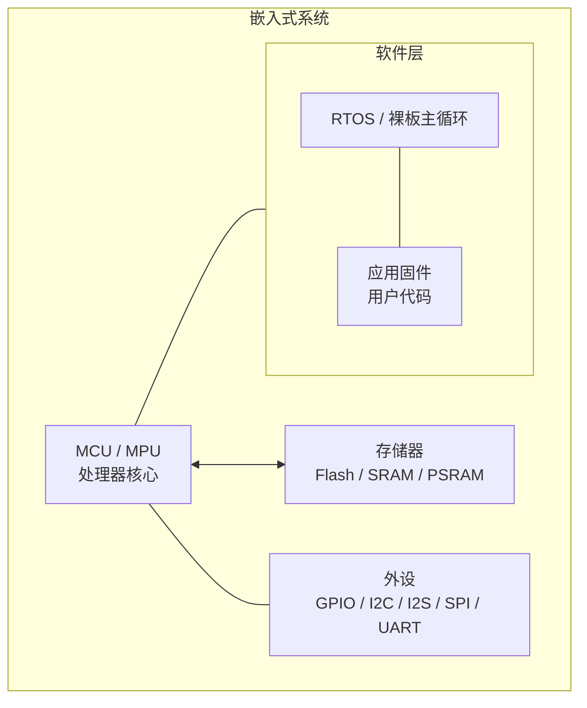
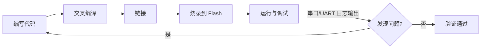
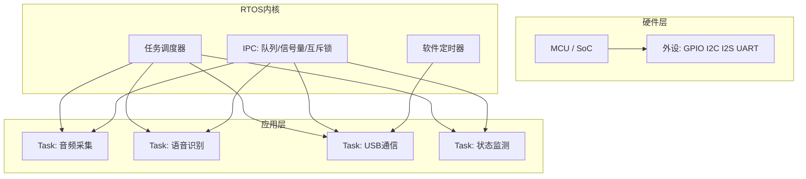
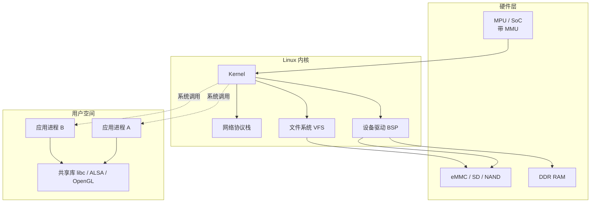
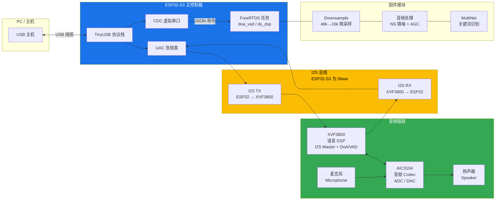
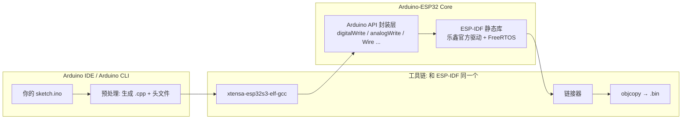
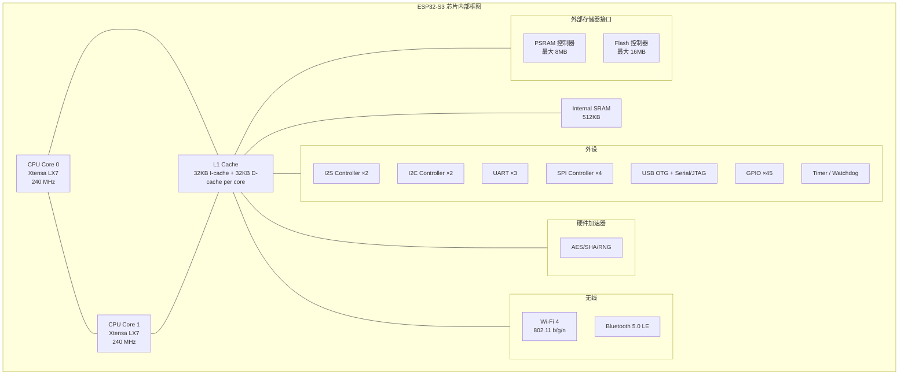
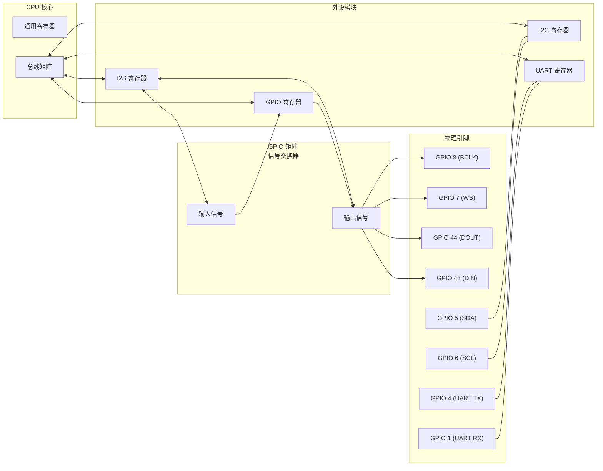
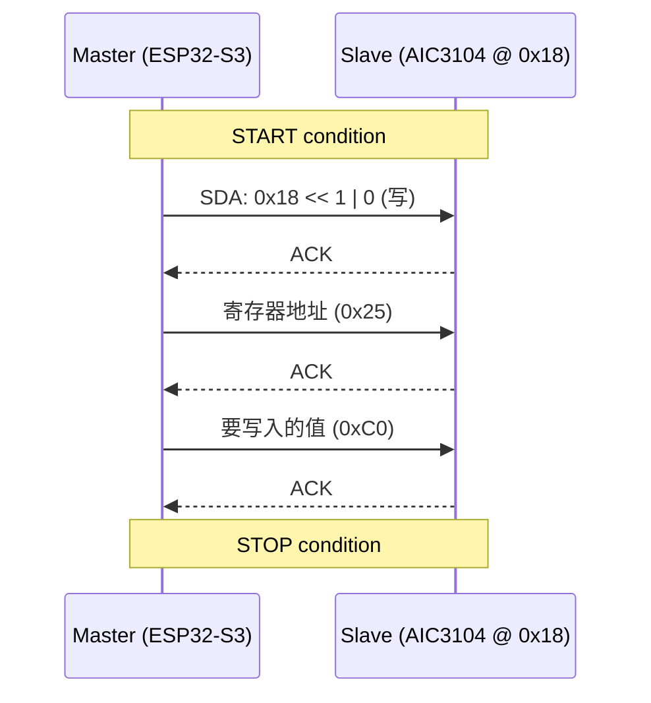

# 嵌入式开发学习笔记

> 基于 XVF3800 ESP32-S3 固件项目的嵌入式开发学习之旅
> 师傅：OpenCode AI · 学徒：用户

---

## 学习计划总览

### 阶段 1：嵌入式基础（第 1-4 课）
| # | 主题 | 说明 | 状态 |
|---|------|------|:----:|
| 1 | **嵌入式系统是什么 + 嵌入式三种形态** | 概念、裸板/RTOS/Linux 三层对比、开发流程、本项目全局地图 | ✅ |
| 2 | **ESP32-S3 芯片与外设** | CPU架构、GPIO、I2C、I2S、SPI、UART、USB + 本项目引脚布局 | 🟢 进行中 |
| 3 | **FreeRTOS 实时操作系统** | 任务、调度、优先级、队列、信号量、看门狗 | ⬜ |
| 4 | **ESP-IDF 开发框架与工具链** | 构建系统、sdkconfig、分区表、烧录、调试 | ⬜ |

### 阶段 2：音频与语音（第 5-8 课）
| # | 主题 | 说明 |
|---|------|------|
| 5 | **I2S 音频总线** | 数字音频传输、主/从模式、采样率、位深、DMA |
| 6 | **I2C 与音频 Codec** | 芯片间通信、AIC3104 配置、音量控制 |
| 7 | **USB 音频类 (UAC)** | USB 复合设备、音频流传输、TinyUSB |
| 8 | **语音识别 (MultiNet/KWS)** | 唤醒词检测、语音命令识别、模型部署 |

### 阶段 3：通信与更新（第 9-12 课）
| # | 主题 | 说明 |
|---|------|------|
| 9 | **CDC 虚拟串口** | USB-CDC 通信协议、JSON 命令格式 |
| 10 | **OTA 固件升级** | 双分区 OTA、CDC-OTA 协议、安全回滚 |
| 11 | **Flash 分区与 SPIFFS** | 分区表布局、SPIFFS 文件系统、模型存储 |
| 12 | **调试与性能分析** | UART 日志、FreeRTOS 统计、ESP32 性能 Profiling |

### 阶段 4：进阶主题（第 13-16 课）
| # | 主题 | 说明 |
|---|------|------|
| 13 | **实时音频处理管道** | NS 降噪、AGC 自动增益、48k↔16k 重采样 |
| 14 | **全双工音频设计** | 同步收发、DMA 配置、时钟域同步 |
| 15 | **电源管理与低功耗** | 休眠模式、PSRAM 使用、功放控制 |
| 16 | **量产与固件发布** | 工厂烧录包、版本管理、发布流程 |

---

## 第 1 课：嵌入式系统是什么 + 本项目全局地图

### 一、嵌入式系统核心概念

#### 什么是嵌入式系统？

嵌入式系统是**为特定功能设计**的专用计算机系统。与你的 PC/手机不同：

| 对比项 | 通用计算机 (PC) | 嵌入式系统 (ESP32-S3) |
|-------|---------------|-------------------|
| 用途 | 通用（办公、游戏、上网） | 专用（音频处理、控制） |
| 操作系统 | Windows/Linux/macOS | FreeRTOS（实时操作系统） |
| 资源 | TB级存储、GB级内存 | MB级 flash、KB级 RAM |
| 功耗 | 几十瓦到几百瓦 | 毫瓦级 |
| 交互 | 键盘鼠标显示器 | 传感器、GPIO、总线 |
| 开发 | 在目标机器上编译调试 | 交叉编译（PC编译→目标运行） |

#### 嵌入式系统的典型组成



- **MCU**: 微控制器（Microcontroller Unit），片上集成了 CPU、RAM、Flash、外设
- **交叉编译**: 在 PC（x86）上编译生成 ESP32-S3（Xtensa/RISC-V）的二进制代码
- **固件**: 烧录到 flash 中的程序，设备上电后执行

#### 嵌入式开发的"标准流程"



---

### 二、嵌入式开发的三种形态

你的直觉是**完全正确**的。嵌入式开发并非铁板一块，按软件复杂度从小到大，可以分为三个层次：

#### 形态一：裸板开发 (Bare-metal) — 无操作系统

**典型场景**：极简控制（LED 闪烁、按键检测、温湿度传感器读取）、成本敏感的消费电子

```
主循环 (Super Loop):
  while(1) {
      read_sensor();
      if(btn_pressed) handle_btn();
      delay(10);
  }
```

| 特征       | 说明                                      |
| -------- | --------------------------------------- |
| **无 OS** | 没有任务调度器，一个 while(1) 大循环 + 中断            |
| **资源占用** | 极小，RAM 可低至几百字节，Flash 几 KB               |
| **实时性**  | 中断是最高的实时响应手段，但主循环阻塞即死                   |
| **典型芯片** | 8 位单片机：51 系列、AVR、PIC；部分低端 ARM Cortex-M0 |
| **开发方式** | 直接操作寄存器或 HAL 库，IDE 如 Keil / IAR         |
| **优点**   | 简单直接、无 OS 学习成本、无调度开销                    |
| **缺点**   | 多任务靠手工拆分，代码规模一大就难以维护；一个 while 循环阻塞整机卡死  |

> **这个项目的对应**: 本项目有 FreeRTOS，不属于裸板。但 xvf_xmos.c/h 中与 XVF3800 的 I2C 通信其实接近这层——裸读写寄存器。

#### 形态二：RTOS 开发 — 轻量实时操作系统

**典型场景**：中等复杂度（音频处理、电机控制、联网设备），如本项目的 ESP32-S3



| 特征          | 说明                                                   |
| ----------- | ---------------------------------------------------- |
| **有 RTOS**  | 操作系统内核很小（几 KB 到几十 KB），提供任务调度、同步机制                    |
| **任务切换**    | 基于优先级抢占式调度（Priority-based Preemptive Scheduling）     |
| **IPC 机制**  | 队列（Queue）、信号量（Semaphore）、互斥锁（Mutex）、事件组（Event Group） |
| **典型 RTOS** | FreeRTOS（最广泛）、RT-Thread（国产）、Zephyr、μC/OS             |
| **典型芯片**    | ARM Cortex-M3/M4/M7、ESP32、RISC-V                     |
| **开发方式**    | SDK 框架（ESP-IDF / STM32Cube），C 语言，任务间通信设计             |
| **优点**      | 多任务隔离、实时性强、生态成熟、中等复杂度项目的最佳平衡                         |
| **缺点**      | 需要学习 RTOS 概念、调试多任务竞争比裸板复杂、没有 MMU（进程间互不保护）            |

> **本项目的定位**：ESP32-S3 + FreeRTOS + ESP-IDF 就是这个形态的典型代表。

#### 形态三：嵌入式 Linux — 完整操作系统

**典型场景**：高复杂度（路由器/摄像头/车机/工业平板），需要网络协议栈、文件系统、图形界面



| 特征 | 说明 |
|------|------|
| **有 MMU** | 内存管理单元，可运行完整 Linux，进程间有地址空间隔离 |
| **资源需求** | 大：RAM ≥ 32MB，Flash/存储 ≥ 64MB，往往需要 DDR 内存 |
| **典型芯片** | ARM Cortex-A 系列（全志/RK/IMX）、RISC-V、x86 |
| **开发方式** | BSP 移植（板级支持包）→ 内核驱动开发 → 应用开发 |
| **驱动开发** | 编写/移植 Linux 内核驱动（字符设备 / platform 驱动 / DT 设备树） |
| **应用开发** | Linux 用户态进程，标准 POSIX API，多进程多线程 |
| **优点** | 功能最强大、生态最丰富、调试工具成熟（gdb/perf/strace） |
| **缺点** | 资源消耗大、实时性不如 RTOS（PREEMPT_RT 补丁可改善但不完全）、启动慢 |
| **入门门槛** | 需要同时懂硬件和 Linux 内核知识，学习曲线陡峭 |

> **注意**：这三个形态不是一个比另一个"高级"。裸板有裸板的成本优势，RTOS 有实时性优势，嵌入式 Linux 有功能生态优势。**做产品时根据需求选合适的**，而不是无脑上最复杂的。

#### 形态全览对比

| 维度 | 裸板 (Bare-metal) | RTOS | 嵌入式 Linux |
|------|:---:|:----:|:----------:|
| **OS 大小** | 0 KB | ~5-100 KB | MB ~ GB 级 |
| **RAM 需求** | ~0.1-4 KB | ~几 KB - 几百 KB | ≥ 32 MB（带 MMU）|
| **任务模型** | 大循环 + 中断 | 抢占式多任务 | 多进程 + 多线程 |
| **进程隔离** | 无 | 无 | 有（MMU）|
| **实时性** | 中断级（μs） | 优先级调度（μs~ms）| 非实时（ms 级，PREEMPT_RT 接近）|
| **调试难度** | 低（逻辑简单） | 中（竞态/死锁） | 高（驱动 crash 难定位）|
| **典型产品** | 遥控器/电子表 | 无人机/音频设备 | 路由器/摄像头/车机 |
| **代表芯片** | 51/AVR/PIC | STM32/ESP32 | i.MX/RK/全志 |

> **为什么本项目选 RTOS（FreeRTOS）而不是裸板或 Linux？**
>
> - ESP32-S3 只有 512KB 内部 SRAM，跑不动完整的嵌入式 Linux（至少需要 32MB+ 外部 DDR）
> - 任务多（I2S 收发、USB UAC、CDC、语音识别），裸板大循环无法优雅处理
> - 实时性要求高（音频流不能卡顿），FreeRTOS 的任务调度 + 固定核心绑定正好满足
> - 用 PSRAM（8MB）解决大数据（音频缓冲区、语音模型）的存储

---

### 三、本项目全局地图：XVF3800 ESP32-S3 固件

这是一个**USB 音频设备固件**，搭载语音识别（关键词唤醒）功能。

#### 硬件架构



#### 关键芯片

| 芯片 | 角色 | 说明 |
|------|------|------|
| **ESP32-S3** | 主控制器 | Xtensa LX7 双核 240MHz，负责 USB 音频、语音识别、OTA |
| **XVF3800** | 语音 DSP | XMOS 多核处理器，负责 I2S 音频输入输出、声源方位(DoA)、人声检测(VAD) |
| **AIC3104** | 音频 Codec | TI 音频编解码器，数模/模数转换，连接扬声器与麦克风 |

#### 软件架构 — 任务（进程）分配

| 任务名 | 核心 | 优先级 | 功能 |
|-------|------|--------|------|
| `UAC MIC` (RX) | Core 0 | 14 | 从 I2S 收音频 → 发给 USB 主机 |
| `UAC SPK` (TX) | Core 0 | 14 | 从 USB 主机收音频 → 发给 I2S |
| `TinyUSB` | Core 1 | 15 | USB 协议栈（枚举、数据传输） |
| `doa_vad` | Core 1 | 5 | 每秒轮询 DoA/语音检测状态 |
| `ds_dsp` | Core 0 | 5 | 音频降噪+AGC+语音识别管道 |

#### 软件模块 — 源文件地图

```
main/main.c              ← 入口点，创建任务
main/xvf_i2s.c/h         ← I2S 初始化（Slave 模式、24 DMA 描述符）
main/xvf_i2c.c/h         ← I2C 总线初始化
main/xvf_aic3104.c/h     ← AIC3104 Codec 配置
main/xvf_uac.c/h         ← USB 音频类（UAC 1.0 回调）
main/xvf_downsample.c/h  ← 48k→16k 降采样 + DSP 任务
main/xvf_audio_proc.c/h  ← NS 降噪 + AGC 自动增益控制
main/xvf_multinet.c/h    ← 关键词识别（MultiNet 模型）
main/xvf_xmos.c/h        ← XVF3800 通信（DoA/VAD/控制）
main/xvf_ota.c/h         ← OTA 固件升级
main/usb_descriptors.c   ← USB 描述符（CDC+UAC 复合设备）
main/tusb_config.h       ← TinyUSB 配置
```

---

### 四、嵌入式开发的关键习惯

1. **阅读文档优先**：芯片 datasheet（数据手册）、芯片参考手册、框架 API 文档是第一手资料
2. **日志调试三板斧**：`ESP_LOGE`(错误) → `ESP_LOGW`(警告) → `ESP_LOGI`(信息) → `ESP_LOGD`(调试)
3. **先查芯片资源**：flash 大小、RAM 大小、PSRAM、可用的外设接口、引脚复用
4. **理解任务调度**：FreeRTOS 不是 Linux — 没有 MMU、没有进程隔离、共享全局地址空间
5. **阅读分区表**：知道代码放在哪、数据放在哪、OTA 如何工作

---

### 推荐阅读

- [ESP32-S3 技术参考手册 (Espressif 官方)](https://www.espressif.com/sites/default/files/documentation/esp32-s3_technical_reference_manual_en.pdf)
- [FreeRTOS 官方文档](https://www.freertos.org/Documentation/RTOS_book.html)
- [《嵌入式系统：硬件、软件与设计》—— 一个很好的全局入门书](https://www.amazon.com/Embedded-Systems-Introduction-Yifeng-Zhu/dp/0367260654)（英文）

---

## 答疑：深入理解交叉编译工具链

### 一、什么是交叉编译工具链？

**一句话**：在 PC（x86 Linux/Windows）上运行，但生成目标芯片（ARM/Xtensa/RISC-V）机器码的编译工具集合。

#### 工具链的组成

```
┌─────────────────────────────────────────────────┐
│              交叉编译工具链                        │
├─────────────────────────────────────────────────┤
│  binutils        GCC 编译器套件         C 运行时库   │
│  ┌──────┐    ┌──────────┐           ┌────────┐   │
│  │ as   │    │ gcc      │           │ libc   │   │
│  │ ld   │    │ g++      │           │ (newlib│   │
│  │ objcopy│   │ gdb      │           │  /glibc)│   │
│  │ strip│    │ (调试器)  │           └────────┘   │
│  └──────┘    └──────────┘                        │
├─────────────────────────────────────────────────┤
│  Target triplet（目标三元组）                      │
│  格式: <arch>-<vendor>-<os>-<abi>                 │
│  例:   xtensa-esp32s3-elf    (ESP32-S3)          │
│        arm-none-eabi         (ARM Cortex-M)      │
│        aarch64-linux-gnu     (ARM64 Linux)       │
└─────────────────────────────────────────────────┘
```

**关键文件**：

| 文件 | 用途 |
|------|------|
| `xtensa-esp32s3-elf-gcc` | C 编译器 |
| `xtensa-esp32s3-elf-g++` | C++ 编译器 |
| `xtensa-esp32s3-elf-ld` | 链接器 |
| `xtensa-esp32s3-elf-gdb` | 调试器 |
| `xtensa-esp32s3-elf-objcopy` | 二进制格式转换（elf → bin/hex）|
| `xtensa-esp32s3-elf-size` | 查看各段大小（text/data/bss）|

#### 目标三元组详解

```
xtensa - esp32s3 - elf
   │        │        │
   │        │        └── ABI: ELF 格式（无操作系统）
   │        └─────────── Vendor/Chip: ESP32-S3 变体
   └──────────────────── ISA: Xtensa 架构
```

对比常见的：

| 三元组 | 含义 |
|--------|------|
| `arm-none-eabi` | ARM 架构，无厂商，EABI（裸板/RTOS） |
| `arm-linux-gnueabihf` | ARM 架构，Linux 目标，GNU EABI hard-float |
| `aarch64-linux-gnu` | ARM64 架构，Linux 目标 |
| `riscv32-unknown-elf` | RISC-V 32 位，无厂商，ELF |

---

### 二、IDE / 开发环境与工具链的关系

你观察得没错——大多数情况下**工具链由 IDE 或 SDK 自动提供**，但这只是"帮你装好了"，本质没有改变。

#### 不同项目的工具链来源

| 平台 | 工具链 | 谁提供的 |
|------|--------|---------|
| ESP32 + ESP-IDF | `xtensa-esp32s3-elf-gcc` | ESP-IDF 安装器自动下载 |
| STM32 + CubeIDE | `arm-none-eabi-gcc` | STM32CubeIDE 内置 |
| ARM MDK (Keil) | `armcc` (商业编译器) | Keil 安装包 |
| IAR | `iccarm` (商业编译器) | IAR EWARM 安装包 |

**本质规律**：SDK/IDE 仅仅是工具链的"分发者"。无论工具链是 IDE 自带还是你手工装，最终调用的都是同一条命令：

```bash
# ESP-IDF 本质上在帮你执行：
xtensa-esp32s3-elf-gcc -O2 -Iinclude/ src/main.c -o build/main.elf

# 你完全可以手动执行这行命令（如果环境变量配好了）
```

#### 本项目中的工具链

```bash
# 激活 IDF 环境后，工具链就在 PATH 中
source /home/u/.espressif/tools/activate_idf_v6.0.1.sh
which xtensa-esp32s3-elf-gcc
# 输出: ~/.espressif/tools/xtensa-esp32s3-elf-gcc/.../bin/xtensa-esp32s3-elf-gcc

# 你可以直接用它手动编译：
xtensa-esp32s3-elf-gcc --version
# xtensa-esp32s3-elf-gcc (crosstool-NG esp-2022r1) 11.2.0
```

---

### 三、编译优化与"并行计算加速"

你问的核心问题可以拆成两个层面：

#### 编译优化选项（代码质量）—— ✅ 编译器能力

编译器通过不同的 `-O` 级别控制优化程度：

| 选项 | 含义 | 编译速度 | 代码速度 | 代码大小 |
|------|------|:-------:|:-------:|:-------:|
| `-O0` | 无优化（默认调试） | 最快 | 最慢 | 最大 |
| `-O1` | 基本优化 | 快 | 中等 | 中等 |
| `-O2` | 标准优化（项目通常用这个） | 中等 | 快 | 中等 |
| `-O3` | 激进优化，可能增大代码 | 慢 | 更快 | 更大 |
| `-Os` | 优化代码大小 | 中等 | 中等 | 最小 |
| `-Ofast` | 极速优化（可能违反标准） | 慢 | 最快 | 最大 |

**额外优化技术**：

| 技术 | 编译选项 / 工具 | 说明 |
|------|----------------|------|
| **LTO** | `-flto` | 链接时优化，跨文件内联、消除未用代码 |
| **自动向量化** | `-O3` / `-ftree-vectorize` | 将循环自动编译为 SIMD 指令（如果目标 CPU 支持）|
| **PGO** | `-fprofile-generate` + `-fprofile-use` | 基于运行时 profile 引导优化 |
| **size 优化** | `-Os` + `-ffunction-sections -fdata-sections -Wl,--gc-sections` | 链接时去弃未用函数，嵌入式常用 |

```bash
# 本项目的 ESP-IDF 中，通过 sdkconfig 或 CMakeLists.txt 设置优化：
# sdkconfig: CONFIG_COMPILER_OPTIMIZATION_SIZE=y   (-Os)
# sdkconfig: CONFIG_COMPILER_OPTIMIZATION_PERF=y   (-O2)

# CMakeLists.txt 中也可以加：
target_compile_options(xvf3800_esp32s3_fw PRIVATE -O2 -flto)
```

#### 嵌入式编译的并行限制

1. **交叉编译本身的瓶颈**：目标芯片（如 Xtensa）的编译器优化不如 x86 的 GCC 成熟，部分优化 pass 可能不支持
2. **ESP32-S3 的 Xtensa 架构没有 SIMD**：`-O3` 的自动向量化不会产生 SIMD 指令（硬件不支持），只是常规循环优化
3. **内存限制**：激进优化（LTO + -O3）在链接阶段会大量消耗 PC 内存，大项目可能吃掉 4-8GB RAM
4. **Flash 大小**：ESP32-S3 每个 OTA 分区只有 2MB，`-O3` 生成的代码可能塞不下，所以很多 ESP32 项目用 `-Os`

---

### 四、拓展：Arduino 为什么也能为 ESP32 编译？

这是问到了工具链生态的一个重要特点：**Arduino 对 ESP32 的支持，本质上是在 ESP-IDF 之上加了一层"糖衣"**。

#### Arduino 的编译链



**核心事实**：Arduino for ESP32 的编译链条里，**最底层就是 ESP-IDF**。

#### 具体来看

| 层面 | Arduino | ESP-IDF（本项目） |
|------|---------|-----------------|
| **编译器** | 同一个 `xtensa-esp32s3-elf-gcc` | 同一个 |
| **底层库** | 链接了 ESP-IDF 的 `libesp-idf.a` | 直接调用 ESP-IDF 函数 |
| **FreeRTOS** | 在后台自动初始化 | 手动调用 `xTaskCreatePinnedToCore()` |
| **API** | `digitalWrite(pin, HIGH)` 一行控制 GPIO | `gpio_set_level(pin, 1)` —— 本质一样 |
| **启动流程** | 隐藏了，自动调用 `initArduino()` | 显式 `app_main()` 入口 |

**关键证据**：安装 Arduino-ESP32 支持包时，下载的内容列表：

```
～/Library/Arduino15/packages/esp32/
  ├── tools/                       ← 工具链（xtensa-esp32-elf-gcc 等）
  │   └── xtensa-esp32-elf-gcc/
  ├── hardware/esp32/
  │   └── 2.0.x/
  │       ├── cores/esp32/         ← Arduino API 封装层
  │       ├── libraries/           ← Arduino 风格库
  │       └── tools/
  │           └── sdk/             ← 🔑 内嵌的 ESP-IDF！
  │               └── esp-idf/
  │                   ├── components/
  │                   └── Makefile
```

**结论**：Arduino for ESP32 = **ESP-IDF 的"简化前端"**。Arduino 帮你做了三件事：

1. **屏蔽了工具链调用细节**——你不用手动敲交叉编译命令
2. **隐藏了 FreeRTOS 初始化**——你不需要知道任务怎么创建，但底层其实跑着 FreeRTOS
3. **简化了 API**——`digitalWrite(2, HIGH)` 比 `gpio_set_level(GPIO_NUM_2, 1)` 更好记

#### 两个开发路径的对比

```c
// ═══ Arduino 方式 ═══
void setup() {
    pinMode(2, OUTPUT);          // 配置 GPIO2
    Serial.begin(115200);        // 初始化 UART
}
void loop() {
    digitalWrite(2, HIGH);       // GPIO2 = 高电平
    delay(1000);
    digitalWrite(2, LOW);
    delay(1000);
}

// ═══ ESP-IDF 方式（本项目）═══
void app_main(void) {
    gpio_set_direction(GPIO_NUM_2, GPIO_MODE_OUTPUT);  // 配置 GPIO2

    while (1) {
        gpio_set_level(GPIO_NUM_2, 1);   // GPIO2 = 高电平
        vTaskDelay(pdMS_TO_TICKS(1000)); // FreeRTOS 延时
        gpio_set_level(GPIO_NUM_2, 0);
        vTaskDelay(pdMS_TO_TICKS(1000));
    }
}
```

两种方式最终烧进芯片的**机器码几乎一样**。区别只在 Arduino 帮你写好了 `setup/loop` 背后的 FreeRTOS task 创建和 `pinMode/digitalWrite` 背后的 GPIO 寄存器操作。

#### Arduino + ESP-IDF 混合使用

更加能说明"Arduino 依赖 ESP-IDF"的是：**你可以直接在 ESP-IDF 项目里调用 Arduino API**。

```c
// CMakeLists.txt 中添加 Arduino 组件
set(EXTRA_COMPONENT_DIRS $ENV{IDF_PATH}/examples/common_components/arduino)

// main.c — 混用 ESP-IDF 和 Arduino API
#include "Arduino.h"
#include "driver/gpio.h"

void app_main(void) {
    initArduino();                     // 启动 Arduino 后台

    pinMode(2, OUTPUT);                // Arduino API
    gpio_set_level(GPIO_NUM_2, 1);     // ESP-IDF API，混用没问题
    Serial.begin(115200);
    Serial.println("Hello from ESP-IDF + Arduino!");
}
```

这清楚地说明：**ESP-IDF 是底层，Arduino 是上层封装**，不是两套独立的东西。

---

> **所以回答你的问题**：是的，Arduino 内部确实使用了 ESP-IDF。更准确地说，Arduino-ESP32 Core 是建立在 ESP-IDF 之上的一个**API 兼容层**，编译时链接了 ESP-IDF 的库，运行时调用了 ESP-IDF 初始化的 FreeRTOS 和驱动。**同一套 xtensa 交叉编译工具链，被不同的「前端」以不同的方式调用**——这就是嵌入式工具链生态的常见格局。

| 你的问题 | 答案 |
|---------|------|
| 编译优化（代码快/小） | ✅ 编译器能力：`-O0` ~ `-Ofast`、LTO、PGO |
| 并行编译加速（构建快） | ❌ 构建系统能力：`make -j`、`ninja`、`ccache`、`distcc` |
| IDE 是否提供工具链 | 只是"包管理"，本质还是调 gcc |
| 嵌入式有没有特殊限制 | 有：Flash 大小、CPU 架构不支持 SIMD、交叉编译器优化成熟度 |

> **参考**：
> - [GCC Optimization Options 官方文档](https://gcc.gnu.org/onlinedocs/gcc/Optimize-Options.html)
> - [ESP-IDF 编译系统文档 — 优化配置](https://docs.espressif.com/projects/esp-idf/en/latest/esp32s3/api-guides/build-system.html#custom-build-system-steps)
> - [GNU Make -j 选项](https://www.gnu.org/software/make/manual/html_node/Parallel.html)
> - [crosstool-NG — 嵌入式工具链构建工具](https://crosstool-ng.github.io/)（了解工具链如何被"制作"出来的）

---

## 第 2 课：ESP32-S3 芯片与外设

### 一、ESP32-S3 芯片概览

#### 芯片参数速览

| 参数 | 值 |
|------|-----|
| **CPU** | Xtensa LX7 双核 32 位，最高 240 MHz |
| **指令集** | Xtensa（Tensilica 自定义 RISC 架构，非 ARM 非 RISC-V） |
| **SRAM** | 512 KB（片内） |
| **PSRAM** | 最大 8 MB（通过 SPI 接口外挂，本项目用了全 8 MB） |
| **Flash** | 最大 16 MB（SPI 连接，本项目用 8 MB）|
| **USB OTG** | 内置 USB Serial/JTAG 控制器 + USB OTG（可用于 TinyUSB）|
| **I2S** | 2 个 I2S 控制器，支持全双工 |
| **I2C** | 2 个 I2C 控制器，支持主机/从机模式 |
| **UART** | 3 个 UART 控制器 |
| **SPI** | 4 个 SPI 控制器 |
| **GPIO** | 45 个可编程 GPIO（大部分可复用为其他外设功能）|
| **安全** | AES/SHA/RSA 硬件加速器、随机数生成器 |
| **无线** | 2.4 GHz Wi-Fi 4 + Bluetooth 5.0 LE |

> **ESP32-S3 在嵌入式芯片中的定位**：中高端 MCU。比 STM32F4 性能更强（双核+240MHz）、集成 Wi-Fi/BT、有大容量 PSRAM 支持。但比嵌入式 Linux SoC（如全志/瑞芯微）少了 MMU，不能跑完整 Linux。

#### 芯片内部结构



#### 项目中的存储布局

```
                        ESP32-S3 内存空间
┌─────────────────────────────────────────────────┐
│             片内 SRAM (512 KB)                    │
├─────────────────────────────────────────────────┤
│ .text  (代码)       │  .rodata (只读数据)         │
│ .data  (初始化数据)  │  .bss   (零初始化数据)     │
│ FreeRTOS 堆          │  任务栈                     │
│ I2S DMA 描述符       │  USB 缓冲区                │
├─────────────────────────────────────────────────┤
│              外挂 PSRAM (8 MB)                    │
├─────────────────────────────────────────────────┤
│  音频缓冲区 (mic_conv_buf / spk_conv_buf)        │
│  MultiNet 语音识别模型（~2.5 MB）                │
│  DSP 算法临时缓冲区                               │
├─────────────────────────────────────────────────┤
│              外挂 Flash (8 MB)                    │
├─────────────────────────────────────────────────┤
│  Bootloader │ OTA_0 │ OTA_1 │ SPIFFS (模型) │   │
└─────────────────────────────────────────────────┘
```

**为什么需要 PSRAM？** 语音识别模型（MultiNet quantized）大约 2.5 MB，远超片内 512 KB SRAM。ESP32-S3 通过 SPI 总线外挂 PSRAM 芯片——程序可以像访问普通内存一样读写它，只是速度略慢（80 MHz SPI vs 片内 SRAM 全速访问）。

---

### 二、外设循序渐进

嵌入式开发中"操作外设"本质上就是三件事：

1. **配置时钟**——让它跑起来
2. **配置引脚**——把外设信号映射到物理引脚（ESP32 的特色，称为 GPIO Matrix）
3. **读写寄存器/缓冲区**——传数据



> **重点**：不同于 STM32 等 ARM 芯片（外设功能固定在特定引脚上），**ESP32-S3 的大部分外设信号可以通过 GPIO Matrix 映射到任意 GPIO**。这给了 PCB 布局极大的灵活性，但也意味着你必须显式配置每个引脚的功能。

---

#### 1. GPIO — 通用输入输出

**概念**：最基础的外设。读引脚电平（输入）或设置引脚电平（输出）。

**工作原理**：
- 输入：读取 GPIO 寄存器对应位 → 0 或 1
- 输出：写 GPIO 寄存器对应位 → 引脚输出高或低电平
- 内部上拉/下拉：可配置的弱上拉/弱下拉电阻，避免浮空输入

**ESP-IDF API**：
```c
// 配置 GPIO2 为推挽输出
gpio_config_t io_conf = {
    .pin_bit_mask = (1ULL << GPIO_NUM_2),
    .mode = GPIO_MODE_OUTPUT,
    .pull_up_en = GPIO_PULLUP_DISABLE,
    .pull_down_en = GPIO_PULLDOWN_DISABLE,
    .intr_type = GPIO_INTR_DISABLE,
};
gpio_config(&io_conf);

gpio_set_level(GPIO_NUM_2, 1);  // 输出高电平
int level = gpio_get_level(GPIO_NUM_2);  // 读取电平
```

**本项目中的 GPIO 使用**：
| 引脚 | 功能 | 方向 | 说明 |
|------|------|:----:|------|
| GPIO 4 | UART TX | 输出 | 串口控制台输出 |
| GPIO 1 | UART RX | 输入 | 串口控制台输入 |
| GPIO 5 | I2C SDA | 双向 | I2C 数据线 |
| GPIO 6 | I2C SCL | 输出 | I2C 时钟线 |
| GPIO 7 | I2S WS | 输入 | I2S 字选择（Slave 模式，由 XVF3800 驱动）|
| GPIO 8 | I2S BCLK | 输入 | I2S 位时钟（Slave 模式，由 XVF3800 驱动）|
| GPIO 43 | I2S DIN | 输入 | I2S 数据入（XVF3800 → ESP32）|
| GPIO 44 | I2S DOUT | 输出 | I2S 数据出（ESP32 → XVF3800）|

---

#### 2. I2C — 两线串行总线

**概念**：Inter-Integrated Circuit，一种同步、多主从、两线（SDA + SCL）低速总线，用于芯片间通信。

**工作原理**：



**关键参数**：
| 参数 | 说明 | 本项目 |
|------|------|--------|
| 速度 | 标准 100kHz / 快速 400kHz / 高速 3.4MHz | **100 kHz** |
| 地址 | 7 位或 10 位设备地址 | **7 位** |
| 上拉 | 需要外部上拉电阻到 VCC | **使能内部上拉** |
| 多主 | 支持 | 仅做主 |

**本项目中的应用**：I2C 总线连接了两个设备：

```
ESP32-S3 (Master)
   │
   ├── SDA (GPIO 5) ────────┬───── AIC3104 (Slave @ 0x18)
   │                         │
   └── SCL (GPIO 6) ────────┘
                             │
                             └───── XVF3800 (Slave @ 0x2C)
                                 (XMOS Resource Manager)
```

- **AIC3104** (地址 0x18)：音频 Codec 的配置接口。通过 I2C 写寄存器控制音量、静音、电源、路由。
- **XVF3800** (地址 0x2C)：XMOS Resource Manager。通过 I2C 发送"GPO Servicer"协议读取声源方向（DoA）和人声检测（VAD），控制 LED 效果。

**ESP-IDF 代码示例**（来自本项目 `xvf_i2c.c`）：
```c
// 1. 创建 master 总线
i2c_master_bus_config_t bus_cfg = {
    .sda_io_num = 5,
    .scl_io_num = 6,
    .clk_source = I2C_CLK_SRC_DEFAULT,
    .flags.enable_internal_pullup = true,
};
i2c_new_master_bus(&bus_cfg, &xvf_i2c_bus_handle);

// 2. 添加 AIC3104 设备
i2c_device_config_t aic3104_cfg = {
    .dev_addr_length = I2C_ADDR_BIT_LEN_7,
    .device_address  = 0x18,
};
i2c_master_bus_add_device(xvf_i2c_bus_handle, &aic3104_cfg,
                          &xvf_i2c_aic3104_dev);

// 3. 写寄存器（reg 0x25 = 0xC0）
uint8_t data[2] = { 0x25, 0xC0 };
i2c_master_transmit(xvf_i2c_aic3104_dev, data, 2, 100);
```

---

#### 3. I2S — 数字音频总线

**概念**：Inter-IC Sound，专为数字音频设计的串行总线，三根主要信号线：

| 信号 | 全称 | 作用 |
|------|------|------|
| **BCLK** | Bit Clock | 位时钟，每 bit 一个脉冲 |
| **WS** | Word Select | 声道选择，低=左声道，高=右声道 |
| **DOUT** | Data Out | 串行数据输出 |
| **DIN** | Data In | 串行数据输入 |

**数据格式（标准 Philips I2S）**：

```
BCLK  ┌─┐ ┌─┐ ┌─┐ ┌─┐ ┌─┐ ┌─┐ ┌─┐ ┌─┐ ┌─┐
      ┘ └─┘ └─┘ └─┘ └─┘ └─┘ └─┘ └─┘ └─┘ └─
WS    └───────────────┘┌───────────────┐
                       │ LEFT           │ RIGHT
DOUT  x MSB───...──LSB x x MSB───...──LSB x
```

**本项目的关键配置**：

```
I2S 角色: ESP32-S3 = SLAVE, XVF3800 = MASTER
       (XVF3800 驱动 BCLK 和 WS)

采样率: 16 kHz (默认) 或 48 kHz (通过 CONFIG_UAC_SAMPLE_RATE 切换)
位深:   32-bit
声道:   立体声 (Stereo)
MCLK:   512× 倍频 (确保全双工 Slave 模式下时钟稳定)
DMA 描述符: 24 (保证全双工下 TX/RX 不互相阻塞)

引脚:
  BCLK = GPIO 8   (由 XVF3800 产生)
  WS   = GPIO 7   (由 XVF3800 产生)
  DOUT = GPIO 44  (ESP32 → XVF3800, 播放数据)
  DIN  = GPIO 43  (XVF3800 → ESP32, 录音数据)
```

**为什么 ESP32-S3 是 Slave？**

```mermaid
flowchart LR
    XVF[XVF3800<br/>I2S Master<br/>产生 BCLK 和 WS]
    ESP[ESP32-S3<br/>I2S Slave<br/>消费/生产数据]

    XVF -->|BCLK| ESP
    XVF -->|WS| ESP
    ESP -->|DOUT (播放)| XVF
    XVF -->|DIN (录音)| ESP
```

> 见 AGENTS.md：**不要改为 Master 模式**——BCLK/WS 由 XVF3800 的 DSP 时钟域生成，修改后全双工会时钟域失步。

---

#### 4. UART — 通用异步收发器

**概念**：三线（TX / RX / GND）异步串行通信，用于调试控制台、GPS、蓝牙模块等。

**关键参数**：波特率（bps）、数据位、停止位、校验位。

**本项目中的应用**：串口调试控制台

```
UART1, GPIO 4 (TX), GPIO 1 (RX), 115200 baud
```

**为什么不用 UART0？** 默认的 UART0 引脚（GPIO43/44）被 I2S 占用了。所以本项目的 console（`printf`, `ESP_LOG`）全部路由到 UART1。

> 需要外接 USB-TTL 转换器：XIAO 的 D3（GPIO4）→ TTL RX，D0（GPIO1）→ TTL TX

```c
// ESP-IDF 控制台初始化（来自 Kconfig 配置）
// CONFIG_ESP_CONSOLE_UART_CUSTOM=y
// CONFIG_ESP_CONSOLE_UART_NUM=1
// CONFIG_ESP_CONSOLE_UART_TX_GPIO=4
// CONFIG_ESP_CONSOLE_UART_RX_GPIO=1
// CONFIG_ESP_CONSOLE_UART_BAUDRATE=115200

// 然后直接用标准方法打印：
ESP_LOGI("tag", "Hello, UART1!");  // → GPIO 4 输出
printf("Hello, UART1!\n");          // → GPIO 4 输出
```

---

#### 5. SPI — 串行外设接口

**概念**：四线同步全双工串行总线（MOSI / MISO / SCLK / CS），比 I2C 快得多，用于 Flash、SD 卡、显示器等。

**本项目中的应用**：**未直接用于数据通信**，但 SPI 在后台默默发挥着关键作用：

| 用途 | 描述 |
|------|------|
| **Flash** | ESP32-S3 通过 SPI 访问外部 Flash（8 MB 存储代码和数据）|
| **PSRAM** | ESP32-S3 通过 SPI 访问外部 PSRAM（8 MB 运行时扩展内存），SPI 时钟 **80 MHz** |

这两个都由 ESP-IDF 和硬件自动管理，项目代码中没有直接的 SPI API 调用——但你每运行一行代码，实际上都是通过 SPI 从 Flash 取指令。

---

#### 6. USB — 通用串行总线

**概念**：通用串行总线，支持多种设备类，即插即用。

**本项目中的应用**：**USB 复合设备**——同时作为 CDC（虚拟串口）和 UAC（音频设备）被主机识别。

```
USB 枚举后，主机看到的设备：
    ├── Interface 0: CDC Control   (通信设备控制)
    ├── Interface 1: CDC Data      (串口数据传输)
    ├── Interface 2: UAC Control   (音频控制)
    ├── Interface 3: UAC Speaker   (扬声器流)
    └── Interface 4: UAC Microphone (麦克风流)
```

**TinyUSB 协议栈**：本项目用 TinyUSB（而不是 ESP-IDF 内置的 USB 栈）。

- `main/tusb_config.h` — TinyUSB 的配置宏
- `main/usb_descriptors.c` — 自定义 USB 描述符，定义设备类、端点、接口布局
- `main/CMakeLists.txt` — 将 tusb_config.h 和 usb_descriptors.c 注入 TinyUSB 构建

**USB 描述符层次**：
```
设备描述符 (Device Descriptor)
  └── 配置描述符 (Configuration Descriptor)
        ├── 接口关联描述符 (IAD) — CDC
        │     ├── 接口 0: CDC 控制
        │     └── 接口 1: CDC 数据
        ├── 接口关联描述符 (IAD) — 音频
        │     ├── 接口 2: UAC 音频控制
        │     ├── 接口 3: UAC 扬声器流 (ISO IN)
        │     └── 接口 4: UAC 麦克风流 (ISO OUT)
        └── 端点描述符 (Endpoint Descriptors)
```

---

### 三、外设对比总结

| 外设 | 信号线 | 同步/异步 | 速度 | 用途 | 本项目是否使用 |
|------|:-----:|:---------:|:----:|------|:------------:|
| **GPIO** | 1 per pin | 同步 | ns 级 | 通用数字 I/O | ✅ 间接（I2S/I2C/UART 的底层）|
| **UART** | 2 (TX/RX) | 异步 | 最高 ~5 Mbps | 调试串口、GPS、蓝牙 | ✅ 调试控制台 |
| **I2C** | 2 (SDA/SCL) | 同步 | 100 kHz ~ 3.4 MHz | 芯片间配置、传感器 | ✅ AIC3104 + XVF3800 配置 |
| **I2S** | 3~4 (BCLK/WS/DOUT/DIN) | 同步 | ~几 MHz | 数字音频 | ✅ 核心音频数据通道 |
| **SPI** | 4 (MOSI/MISO/SCLK/CS) | 同步 | 最高 ~80 MHz | 高速数据、Flash、显示 | ⚙️ Flash + PSRAM（后台）|
| **USB** | 2 (D+/D-) | 异步 | 12Mbps(FS)~480Mbps(HS) | 与 PC 通信 | ✅ UAC + CDC 复合设备 |

---

### 四、本项目引脚全布局

```
ESP32-S3 引脚使用一览 (XIAO ESP32S3 开发板)
┌─────────────────────────────────────────────────┐
│  GPIO 43 (I2S DIN)  ◄── XVF3800 音频数据入      │
│  GPIO 44 (I2S DOUT) ──► XVF3800 音频数据出      │
│  GPIO 7  (I2S WS)   ◄── XVF3800 字选择          │
│  GPIO 8  (I2S BCLK) ◄── XVF3800 位时钟          │
├─────────────────────────────────────────────────┤
│  GPIO 5  (I2C SDA)  ◄──► AIC3104 + XVF3800      │
│  GPIO 6  (I2C SCL)  ──► AIC3104 + XVF3800       │
├─────────────────────────────────────────────────┤
│  GPIO 4  (UART TX)  ──► 外接 USB-TTL             │
│  GPIO 1  (UART RX)  ◄── 外接 USB-TTL             │
├─────────────────────────────────────────────────┤
│  USB D+ / D-         ◄──► PC USB 主机            │
├─────────────────────────────────────────────────┤
│  (其他 GPIO 未使用)                               │
└─────────────────────────────────────────────────┘
```

> **知识点**：总共只用了 **10 个 GPIO/引脚**，就实现了 I2S 全双工音频 + I2C 双设备控制 + UART 调试 + USB 复合设备。这就是芯片高度集成和 GPIO Matrix 灵活性的体现。

---

### 课后思考题

1. ESP32-S3 的 GPIO Matrix 和 STM32 的"固定引脚功能"各有什么优缺点？
2. 为什么 I2C 需要上拉电阻而 I2S 不需要？
3. 如果 USB 的 D+ 和 D- 接反了会发生什么？
4. 为什么本项目用 UART1 而不是 UART0 做控制台？如果非要让 UART0 也工作，不改硬件的前提下有什么办法？

---

## 术语表 (Glossary)

### 基础概念
| 术语 | 定义 | 说明 |
|------|------|------|
| **MCU** | Microcontroller Unit，微控制器 | 单芯片集成 CPU+RAM+Flash+外设，如 ESP32-S3 |
| **MPU** | Microprocessor Unit，微处理器 | 仅有 CPU，需要外部 RAM/Flash，通常带 MMU，如 i.MX |
| **SoC** | System on Chip，片上系统 | 比 MCU 集成度更高，通常含更多专用硬件 |
| **MMU** | Memory Management Unit，内存管理单元 | 实现虚拟地址→物理地址映射、进程隔离，嵌入式 Linux 必需 |
| **BSP** | Board Support Package，板级支持包 | 板级支持包，硬件厂商提供的底层软件抽象，包括 Bootloader、内核驱动 |
| **HAL** | Hardware Abstraction Layer | 硬件抽象层，统一不同芯片的外设接口 API |
| **固件** | Firmware | 烧录在 Flash 中的程序代码，上电即执行 |
| **交叉编译** | Cross-compilation | 在 PC 上编译生成目标芯片（非 x86）的机器码 |
| **toolchain** | 工具链 | 编译器+链接器+调试器集合，如 GCC for Xtensa |
| **RTOS** | Real-Time Operating System | 实时操作系统，保证任务在确定时间内响应 |
| **Bare-metal** | 裸板开发 | 无操作系统，直接操作寄存器/外设，主循环+中断模式 |
| **ISR** | Interrupt Service Routine，中断服务程序 | 硬件事件触发的中断处理函数，在裸板和 RTOS 中都存在 |
| **Super Loop** | 超级循环 | 裸板开发的核心模式：`while(1) { ... }` 无限循环 |
| **SDK** | Software Development Kit | 芯片厂商提供的软件开发包，如 ESP-IDF / STM32Cube |

### 外设与总线
| 术语 | 定义 | 说明 |
|------|------|------|
| **GPIO** | General Purpose Input/Output | 通用输入输出引脚，可读/写高低电平 |
| **UART** | Universal Asynchronous Receiver-Transmitter | 异步串口，三根线：TX/RX/GND |
| **I2C** | Inter-Integrated Circuit | 两线同步串行总线（SDA+SCL），多设备共享，需上拉电阻 |
| **I2S** | Inter-IC Sound | 数字音频串行总线，专用于音频数据 |
| **SPI** | Serial Peripheral Interface | 四线同步串行总线（MOSI/MISO/SCLK/CS），高速 |
| **DMA** | Direct Memory Access | 直接内存访问，外设与内存间数据搬运无需 CPU 干涉 |
| **GPIO Matrix** | GPIO 信号交换矩阵 | ESP32 特色：将外设信号映射到任意 GPIO 引脚的硬件交换器 |
| **上拉电阻** | Pull-up Resistor | 将信号线弱拉到高电平，防止浮空，I2C 必需 |

### USB 相关

### USB 相关
| 术语 | 定义 | 说明 |
|------|------|------|
| **UAC** | USB Audio Class | USB 音频设备类标准，即插即用 |
| **CDC** | Communication Device Class | USB 通信设备类，虚拟串口 |
| **TinyUSB** | TinyUSB 协议栈 | 嵌入式 USB 协议栈，支持 Device/Host/OTG |
| **枚举** | Enumeration | USB 设备插入后，主机识别设备类型的过程 |

### 音频相关
| 术语 | 定义 | 说明 |
|------|------|------|
| **Codec** | Coder-Decoder | 音频编解码器，ADC/DAC 数模模数转换 |
| **ADC** | Analog-to-Digital Converter | 模数转换（麦克风模拟信号→数字信号） |
| **DAC** | Digital-to-Analog Converter | 数模转换（数字信号→扬声器模拟信号） |
| **NS** | Noise Suppression | 降噪算法 |
| **AGC** | Automatic Gain Control | 自动增益控制，自动调节音量水平 |
| **VAD** | Voice Activity Detection | 人声活动检测，判断是否有人在说话 |
| **DoA** | Direction of Arrival | 声源方位，判断声音来自哪个方向 |
| **KWS** | Keyword Spotting | 关键词唤醒/识别 |

### 系统与存储
| 术语 | 定义 | 说明 |
|------|------|------|
| **Flash** | Flash 存储器 | 非易失性存储，存代码和只读数据 |
| **PSRAM** | Pseudo Static RAM | 伪静态 RAM，大容量扩展 RAM |
| **SPIFFS** | SPI Flash File System | 在 SPI Flash 上运行的文件系统 |
| **OTA** | Over-The-Air 升级 | 无线（通过通信接口）升级固件 |
| **分区表** | Partition Table | 定义 Flash 中各分区的偏移、大小、用途 |

---

## 推荐资源 (Resources)

### 官方文档

| 资源 | 链接 | 用途 |
|------|------|------|
| ESP32-S3 数据手册 | [datasheet](https://www.espressif.com/sites/default/files/documentation/esp32-s3_datasheet_en.pdf) | 芯片电气特性、引脚定义 |
| ESP32-S3 技术参考手册 | [TRM](https://www.espressif.com/sites/default/files/documentation/esp32-s3_technical_reference_manual_en.pdf) | 寄存器级外设编程指南 |
| ESP-IDF 编程指南 | [ESP-IDF docs](https://docs.espressif.com/projects/esp-idf/en/latest/esp32s3/) | 框架 API 参考、示例代码 |
| FreeRTOS 官方文档 | [FreeRTOS.org](https://www.freertos.org/Documentation/RTOS_book.html) | 实时操作系统概念与 API |
| TinyUSB 文档 | [TinyUSB](https://docs.tinyusb.org/) | USB 协议栈 API 与配置 |

### 书籍

| 书名 | 说明 |
|------|------|
| *嵌入式系统设计：ARM Cortex-M 与 FreeRTOS* | 中文，适合初学者的系统入门（覆盖裸板和 RTOS） |
| *Mastering the FreeRTOS™ Real Time Kernel* | FreeRTOS 作者写的官方书，免费下载 |
| *USB 完整框架* (USB Complete) | USB 协议中英文经典著作 |
| *Linux 设备驱动程序* (LDD3) | 嵌入式 Linux 驱动开发圣经，免费在线阅读 |
| *嵌入式 Linux 基础教程* (Embedded Linux Primer) | 嵌入式 Linux BSP 移植与系统构建入门 |

### 在线课程

| 课程 | 说明 |
|------|------|
| [Bare-metal 嵌入式开发 (YouTube)](https://www.youtube.com/playlist?list=PLP29wDx6QmW7DOVnn7YbQYjfI7r7o5O) | 从零开始裸板编程，非常适合入门 |
| [FreeRTOS 官方教程](https://www.freertos.org/Documentation/RTOS_book.html) | FreeRTOS 官方教程 PDF 免费下载 |
| [ESP-IDF 官方示例](https://github.com/espressif/esp-idf/tree/master/examples) | 乐鑫官方示例，涵盖 WiFi/BLE/音频/存储 |

### 社区与论坛

| 社区 | 用途 |
|------|------|
| [esp32.com](https://esp32.com) | Espressif 官方论坛，提问搜答案 |
| [Stack Overflow ESP32 tag](https://stackoverflow.com/questions/tagged/esp32) | 英文技术问答 |
| [乐鑫 ESP 论坛](https://esp32.com.cn/) | 中文社区，乐鑫官方中文支持 |
| [R/espressif (Reddit)](https://www.reddit.com/r/esp32/) | Reddit ESP32 社区 |
