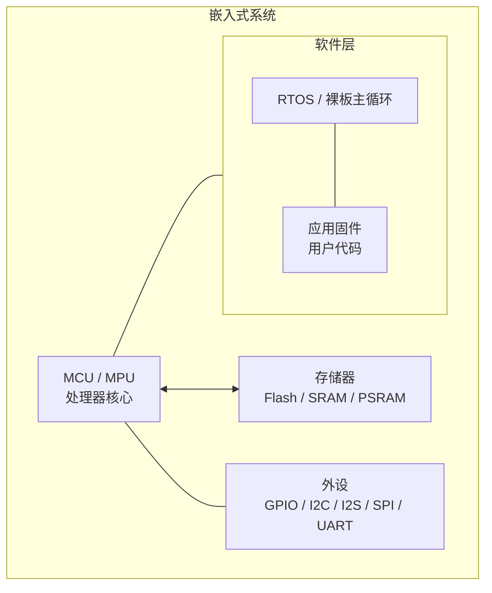
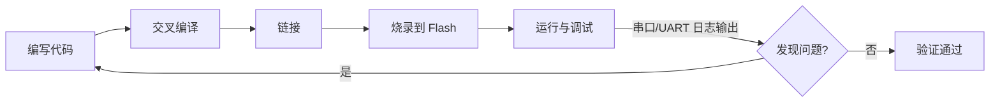
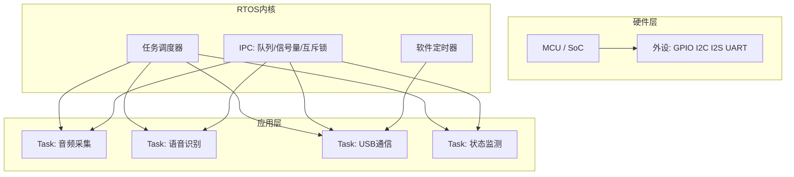
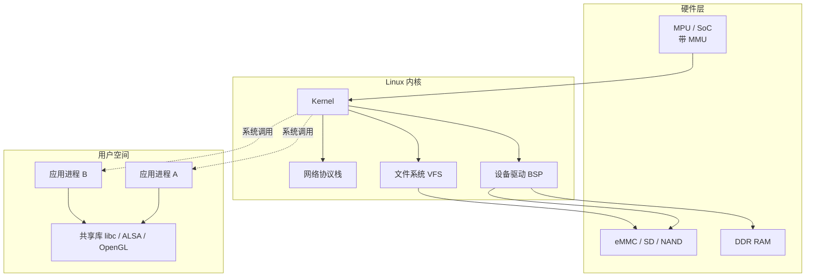
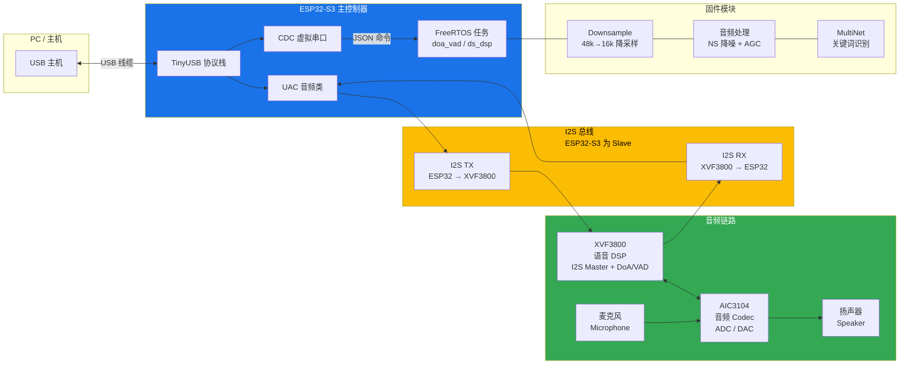

# 嵌入式开发学习笔记

> 基于 XVF3800 ESP32-S3 固件项目的嵌入式开发学习之旅
> 师傅：OpenCode AI · 学徒：用户

---

## 学习计划总览

### 阶段 1：嵌入式基础（第 1-4 课）
| # | 主题 | 说明 |
|---|------|------|
| 1 | **嵌入式系统是什么 + 嵌入式三种形态** | 概念、裸板/RTOS/Linux 三层对比、开发流程 |
| 2 | **ESP32-S3 芯片与外设** | CPU核心、GPIO、I2C、I2S、SPI、UART、USB |
| 3 | **FreeRTOS 实时操作系统** | 任务、调度、优先级、队列、信号量、看门狗 |
| 4 | **ESP-IDF 开发框架与工具链** | 构建系统、sdkconfig、分区表、烧录、调试 |

### 阶段 2：音频与语音（第 5-8 课）
| # | 主题 | 说明 |
|---|------|------|
| 5 | **I2S 音频总线** | 数字音频传输、主/从模式、采样率、位深、DMA |
| 6 | **I2C 与音频 Codec** | 芯片间通信、AIC3104 配置、音量控制 |
| 7 | **USB 音频类 (UAC)** | USB 复合设备、音频流传输、TinyUSB |
| 8 | **语音识别 (MultiNet/KWS)** | 唤醒词检测、语音命令识别、模型部署 |

### 阶段 3：通信与更新（第 9-12 课）
| # | 主题 | 说明 |
|---|------|------|
| 9 | **CDC 虚拟串口** | USB-CDC 通信协议、JSON 命令格式 |
| 10 | **OTA 固件升级** | 双分区 OTA、CDC-OTA 协议、安全回滚 |
| 11 | **Flash 分区与 SPIFFS** | 分区表布局、SPIFFS 文件系统、模型存储 |
| 12 | **调试与性能分析** | UART 日志、FreeRTOS 统计、ESP32 性能 Profiling |

### 阶段 4：进阶主题（第 13-16 课）
| # | 主题 | 说明 |
|---|------|------|
| 13 | **实时音频处理管道** | NS 降噪、AGC 自动增益、48k↔16k 重采样 |
| 14 | **全双工音频设计** | 同步收发、DMA 配置、时钟域同步 |
| 15 | **电源管理与低功耗** | 休眠模式、PSRAM 使用、功放控制 |
| 16 | **量产与固件发布** | 工厂烧录包、版本管理、发布流程 |

---

## 第 1 课：嵌入式系统是什么 + 本项目全局地图

### 一、嵌入式系统核心概念

#### 什么是嵌入式系统？

嵌入式系统是**为特定功能设计**的专用计算机系统。与你的 PC/手机不同：

| 对比项 | 通用计算机 (PC) | 嵌入式系统 (ESP32-S3) |
|-------|---------------|-------------------|
| 用途 | 通用（办公、游戏、上网） | 专用（音频处理、控制） |
| 操作系统 | Windows/Linux/macOS | FreeRTOS（实时操作系统） |
| 资源 | TB级存储、GB级内存 | MB级 flash、KB级 RAM |
| 功耗 | 几十瓦到几百瓦 | 毫瓦级 |
| 交互 | 键盘鼠标显示器 | 传感器、GPIO、总线 |
| 开发 | 在目标机器上编译调试 | 交叉编译（PC编译→目标运行） |

#### 嵌入式系统的典型组成



- **MCU**: 微控制器（Microcontroller Unit），片上集成了 CPU、RAM、Flash、外设
- **交叉编译**: 在 PC（x86）上编译生成 ESP32-S3（Xtensa/RISC-V）的二进制代码
- **固件**: 烧录到 flash 中的程序，设备上电后执行

#### 嵌入式开发的"标准流程"



---

### 二、嵌入式开发的三种形态

你的直觉是**完全正确**的。嵌入式开发并非铁板一块，按软件复杂度从小到大，可以分为三个层次：

#### 形态一：裸板开发 (Bare-metal) — 无操作系统

**典型场景**：极简控制（LED 闪烁、按键检测、温湿度传感器读取）、成本敏感的消费电子

```
主循环 (Super Loop):
  while(1) {
      read_sensor();
      if(btn_pressed) handle_btn();
      delay(10);
  }
```

| 特征       | 说明                                      |
| -------- | --------------------------------------- |
| **无 OS** | 没有任务调度器，一个 while(1) 大循环 + 中断            |
| **资源占用** | 极小，RAM 可低至几百字节，Flash 几 KB               |
| **实时性**  | 中断是最高的实时响应手段，但主循环阻塞即死                   |
| **典型芯片** | 8 位单片机：51 系列、AVR、PIC；部分低端 ARM Cortex-M0 |
| **开发方式** | 直接操作寄存器或 HAL 库，IDE 如 Keil / IAR         |
| **优点**   | 简单直接、无 OS 学习成本、无调度开销                    |
| **缺点**   | 多任务靠手工拆分，代码规模一大就难以维护；一个 while 循环阻塞整机卡死  |

> **这个项目的对应**: 本项目有 FreeRTOS，不属于裸板。但 xvf_xmos.c/h 中与 XVF3800 的 I2C 通信其实接近这层——裸读写寄存器。

#### 形态二：RTOS 开发 — 轻量实时操作系统

**典型场景**：中等复杂度（音频处理、电机控制、联网设备），如本项目的 ESP32-S3



| 特征 | 说明 |
|------|------|
| **有 RTOS** | 操作系统内核很小（几 KB 到几十 KB），提供任务调度、同步机制 |
| **任务切换** | 基于优先级抢占式调度（Priority-based Preemptive Scheduling） |
| **IPC 机制** | 队列（Queue）、信号量（Semaphore）、互斥锁（Mutex）、事件组（Event Group） |
| **典型 RTOS** | FreeRTOS（最广泛）、RT-Thread（国产）、Zephyr、μC/OS |
| **典型芯片** | ARM Cortex-M3/M4/M7、ESP32、RISC-V |
| **开发方式** | SDK 框架（ESP-IDF / STM32Cube），C 语言，任务间通信设计 |
| **优点** | 多任务隔离、实时性强、生态成熟、中等复杂度项目的最佳平衡 |
| **缺点** | 需要学习 RTOS 概念、调试多任务竞争比裸板复杂、没有 MMU（进程间互不保护） |

> **本项目的定位**：ESP32-S3 + FreeRTOS + ESP-IDF 就是这个形态的典型代表。

#### 形态三：嵌入式 Linux — 完整操作系统

**典型场景**：高复杂度（路由器/摄像头/车机/工业平板），需要网络协议栈、文件系统、图形界面



| 特征 | 说明 |
|------|------|
| **有 MMU** | 内存管理单元，可运行完整 Linux，进程间有地址空间隔离 |
| **资源需求** | 大：RAM ≥ 32MB，Flash/存储 ≥ 64MB，往往需要 DDR 内存 |
| **典型芯片** | ARM Cortex-A 系列（全志/RK/IMX）、RISC-V、x86 |
| **开发方式** | BSP 移植（板级支持包）→ 内核驱动开发 → 应用开发 |
| **驱动开发** | 编写/移植 Linux 内核驱动（字符设备 / platform 驱动 / DT 设备树） |
| **应用开发** | Linux 用户态进程，标准 POSIX API，多进程多线程 |
| **优点** | 功能最强大、生态最丰富、调试工具成熟（gdb/perf/strace） |
| **缺点** | 资源消耗大、实时性不如 RTOS（PREEMPT_RT 补丁可改善但不完全）、启动慢 |
| **入门门槛** | 需要同时懂硬件和 Linux 内核知识，学习曲线陡峭 |

> **注意**：这三个形态不是一个比另一个"高级"。裸板有裸板的成本优势，RTOS 有实时性优势，嵌入式 Linux 有功能生态优势。**做产品时根据需求选合适的**，而不是无脑上最复杂的。

#### 形态全览对比

| 维度 | 裸板 (Bare-metal) | RTOS | 嵌入式 Linux |
|------|:---:|:----:|:----------:|
| **OS 大小** | 0 KB | ~5-100 KB | MB ~ GB 级 |
| **RAM 需求** | ~0.1-4 KB | ~几 KB - 几百 KB | ≥ 32 MB（带 MMU）|
| **任务模型** | 大循环 + 中断 | 抢占式多任务 | 多进程 + 多线程 |
| **进程隔离** | 无 | 无 | 有（MMU）|
| **实时性** | 中断级（μs） | 优先级调度（μs~ms）| 非实时（ms 级，PREEMPT_RT 接近）|
| **调试难度** | 低（逻辑简单） | 中（竞态/死锁） | 高（驱动 crash 难定位）|
| **典型产品** | 遥控器/电子表 | 无人机/音频设备 | 路由器/摄像头/车机 |
| **代表芯片** | 51/AVR/PIC | STM32/ESP32 | i.MX/RK/全志 |

> **为什么本项目选 RTOS（FreeRTOS）而不是裸板或 Linux？**
>
> - ESP32-S3 只有 512KB 内部 SRAM，跑不动完整的嵌入式 Linux（至少需要 32MB+ 外部 DDR）
> - 任务多（I2S 收发、USB UAC、CDC、语音识别），裸板大循环无法优雅处理
> - 实时性要求高（音频流不能卡顿），FreeRTOS 的任务调度 + 固定核心绑定正好满足
> - 用 PSRAM（8MB）解决大数据（音频缓冲区、语音模型）的存储

---

### 三、本项目全局地图：XVF3800 ESP32-S3 固件

这是一个**USB 音频设备固件**，搭载语音识别（关键词唤醒）功能。

#### 硬件架构



#### 关键芯片

| 芯片 | 角色 | 说明 |
|------|------|------|
| **ESP32-S3** | 主控制器 | Xtensa LX7 双核 240MHz，负责 USB 音频、语音识别、OTA |
| **XVF3800** | 语音 DSP | XMOS 多核处理器，负责 I2S 音频输入输出、声源方位(DoA)、人声检测(VAD) |
| **AIC3104** | 音频 Codec | TI 音频编解码器，数模/模数转换，连接扬声器与麦克风 |

#### 软件架构 — 任务（进程）分配

| 任务名 | 核心 | 优先级 | 功能 |
|-------|------|--------|------|
| `UAC MIC` (RX) | Core 0 | 14 | 从 I2S 收音频 → 发给 USB 主机 |
| `UAC SPK` (TX) | Core 0 | 14 | 从 USB 主机收音频 → 发给 I2S |
| `TinyUSB` | Core 1 | 15 | USB 协议栈（枚举、数据传输） |
| `doa_vad` | Core 1 | 5 | 每秒轮询 DoA/语音检测状态 |
| `ds_dsp` | Core 0 | 5 | 音频降噪+AGC+语音识别管道 |

#### 软件模块 — 源文件地图

```
main/main.c              ← 入口点，创建任务
main/xvf_i2s.c/h         ← I2S 初始化（Slave 模式、24 DMA 描述符）
main/xvf_i2c.c/h         ← I2C 总线初始化
main/xvf_aic3104.c/h     ← AIC3104 Codec 配置
main/xvf_uac.c/h         ← USB 音频类（UAC 1.0 回调）
main/xvf_downsample.c/h  ← 48k→16k 降采样 + DSP 任务
main/xvf_audio_proc.c/h  ← NS 降噪 + AGC 自动增益控制
main/xvf_multinet.c/h    ← 关键词识别（MultiNet 模型）
main/xvf_xmos.c/h        ← XVF3800 通信（DoA/VAD/控制）
main/xvf_ota.c/h         ← OTA 固件升级
main/usb_descriptors.c   ← USB 描述符（CDC+UAC 复合设备）
main/tusb_config.h       ← TinyUSB 配置
```

---

### 四、嵌入式开发的关键习惯

1. **阅读文档优先**：芯片 datasheet（数据手册）、芯片参考手册、框架 API 文档是第一手资料
2. **日志调试三板斧**：`ESP_LOGE`(错误) → `ESP_LOGW`(警告) → `ESP_LOGI`(信息) → `ESP_LOGD`(调试)
3. **先查芯片资源**：flash 大小、RAM 大小、PSRAM、可用的外设接口、引脚复用
4. **理解任务调度**：FreeRTOS 不是 Linux — 没有 MMU、没有进程隔离、共享全局地址空间
5. **阅读分区表**：知道代码放在哪、数据放在哪、OTA 如何工作

---

### 课后思考题

1. 这个项目中为什么 ESP32-S3 是 I2S Slave 而 XVF3800 是 Master？如果角色互换会有什么问题？
2. 如果有两个任务都运行在 Core 0、优先级都是 14，FreeRTOS 如何决定谁先运行？
3. USB CDC 和 UART 串口有什么本质区别？为什么本项目必须用 USB-CDC 而不用 UART？
4. 一个遥控器（按键+发射）和一个智能音箱（WiFi+语音识别），分别应该用哪种嵌入式形态（裸板/RTOS/Linux）？为什么？
5. 为什么 ESP32-S3 不能跑嵌入式 Linux？需要什么硬件条件才能跑？

> 有任何疑问随时问师傅！嵌入式学习是一个"动手→困惑→克服→再动手"的循环。

---

### 推荐阅读

- [ESP32-S3 技术参考手册 (Espressif 官方)](https://www.espressif.com/sites/default/files/documentation/esp32-s3_technical_reference_manual_en.pdf)
- [FreeRTOS 官方文档](https://www.freertos.org/Documentation/RTOS_book.html)
- [《嵌入式系统：硬件、软件与设计》—— 一个很好的全局入门书](https://www.amazon.com/Embedded-Systems-Introduction-Yifeng-Zhu/dp/0367260654)（英文）

---

## 术语表 (Glossary)

### 基础概念
| 术语 | 定义 | 说明 |
|------|------|------|
| **MCU** | Microcontroller Unit，微控制器 | 单芯片集成 CPU+RAM+Flash+外设，如 ESP32-S3 |
| **MPU** | Microprocessor Unit，微处理器 | 仅有 CPU，需要外部 RAM/Flash，通常带 MMU，如 i.MX |
| **SoC** | System on Chip，片上系统 | 比 MCU 集成度更高，通常含更多专用硬件 |
| **MMU** | Memory Management Unit，内存管理单元 | 实现虚拟地址→物理地址映射、进程隔离，嵌入式 Linux 必需 |
| **BSP** | Board Support Package，板级支持包 | 板级支持包，硬件厂商提供的底层软件抽象，包括 Bootloader、内核驱动 |
| **HAL** | Hardware Abstraction Layer | 硬件抽象层，统一不同芯片的外设接口 API |
| **固件** | Firmware | 烧录在 Flash 中的程序代码，上电即执行 |
| **交叉编译** | Cross-compilation | 在 PC 上编译生成目标芯片（非 x86）的机器码 |
| **toolchain** | 工具链 | 编译器+链接器+调试器集合，如 GCC for Xtensa |
| **RTOS** | Real-Time Operating System | 实时操作系统，保证任务在确定时间内响应 |
| **Bare-metal** | 裸板开发 | 无操作系统，直接操作寄存器/外设，主循环+中断模式 |
| **ISR** | Interrupt Service Routine，中断服务程序 | 硬件事件触发的中断处理函数，在裸板和 RTOS 中都存在 |
| **Super Loop** | 超级循环 | 裸板开发的核心模式：`while(1) { ... }` 无限循环 |
| **SDK** | Software Development Kit | 芯片厂商提供的软件开发包，如 ESP-IDF / STM32Cube |

### 外设与总线
| 术语 | 定义 | 说明 |
|------|------|------|
| **GPIO** | General Purpose Input/Output | 通用输入输出引脚，可读/写高低电平 |
| **UART** | Universal Asynchronous Receiver-Transmitter | 异步串口，三根线：TX/RX/GND |
| **I2C** | Inter-Integrated Circuit | 两线同步串行总线（SDA+SCL），多设备共享 |
| **I2S** | Inter-IC Sound | 数字音频串行总线，三线：BCLK/WS/DOUT(或DIN) |
| **SPI** | Serial Peripheral Interface | 四线同步串行总线（MOSI/MISO/SCLK/CS） |
| **DMA** | Direct Memory Access | 直接内存访问，外设与内存间数据搬运无需 CPU 干涉 |

### USB 相关
| 术语 | 定义 | 说明 |
|------|------|------|
| **UAC** | USB Audio Class | USB 音频设备类标准，即插即用 |
| **CDC** | Communication Device Class | USB 通信设备类，虚拟串口 |
| **TinyUSB** | TinyUSB 协议栈 | 嵌入式 USB 协议栈，支持 Device/Host/OTG |
| **枚举** | Enumeration | USB 设备插入后，主机识别设备类型的过程 |

### 音频相关
| 术语 | 定义 | 说明 |
|------|------|------|
| **Codec** | Coder-Decoder | 音频编解码器，ADC/DAC 数模模数转换 |
| **ADC** | Analog-to-Digital Converter | 模数转换（麦克风模拟信号→数字信号） |
| **DAC** | Digital-to-Analog Converter | 数模转换（数字信号→扬声器模拟信号） |
| **NS** | Noise Suppression | 降噪算法 |
| **AGC** | Automatic Gain Control | 自动增益控制，自动调节音量水平 |
| **VAD** | Voice Activity Detection | 人声活动检测，判断是否有人在说话 |
| **DoA** | Direction of Arrival | 声源方位，判断声音来自哪个方向 |
| **KWS** | Keyword Spotting | 关键词唤醒/识别 |

### 系统与存储
| 术语 | 定义 | 说明 |
|------|------|------|
| **Flash** | Flash 存储器 | 非易失性存储，存代码和只读数据 |
| **PSRAM** | Pseudo Static RAM | 伪静态 RAM，大容量扩展 RAM |
| **SPIFFS** | SPI Flash File System | 在 SPI Flash 上运行的文件系统 |
| **OTA** | Over-The-Air 升级 | 无线（通过通信接口）升级固件 |
| **分区表** | Partition Table | 定义 Flash 中各分区的偏移、大小、用途 |

---

## 推荐资源 (Resources)

### 官方文档

| 资源 | 链接 | 用途 |
|------|------|------|
| ESP32-S3 数据手册 | [datasheet](https://www.espressif.com/sites/default/files/documentation/esp32-s3_datasheet_en.pdf) | 芯片电气特性、引脚定义 |
| ESP32-S3 技术参考手册 | [TRM](https://www.espressif.com/sites/default/files/documentation/esp32-s3_technical_reference_manual_en.pdf) | 寄存器级外设编程指南 |
| ESP-IDF 编程指南 | [ESP-IDF docs](https://docs.espressif.com/projects/esp-idf/en/latest/esp32s3/) | 框架 API 参考、示例代码 |
| FreeRTOS 官方文档 | [FreeRTOS.org](https://www.freertos.org/Documentation/RTOS_book.html) | 实时操作系统概念与 API |
| TinyUSB 文档 | [TinyUSB](https://docs.tinyusb.org/) | USB 协议栈 API 与配置 |

### 书籍

| 书名 | 说明 |
|------|------|
| *嵌入式系统设计：ARM Cortex-M 与 FreeRTOS* | 中文，适合初学者的系统入门（覆盖裸板和 RTOS） |
| *Mastering the FreeRTOS™ Real Time Kernel* | FreeRTOS 作者写的官方书，免费下载 |
| *USB 完整框架* (USB Complete) | USB 协议中英文经典著作 |
| *Linux 设备驱动程序* (LDD3) | 嵌入式 Linux 驱动开发圣经，免费在线阅读 |
| *嵌入式 Linux 基础教程* (Embedded Linux Primer) | 嵌入式 Linux BSP 移植与系统构建入门 |

### 在线课程

| 课程 | 说明 |
|------|------|
| [Bare-metal 嵌入式开发 (YouTube)](https://www.youtube.com/playlist?list=PLP29wDx6QmW7DOVnn7YbQYjfI7r7o5O) | 从零开始裸板编程，非常适合入门 |
| [FreeRTOS 官方教程](https://www.freertos.org/Documentation/RTOS_book.html) | FreeRTOS 官方教程 PDF 免费下载 |
| [ESP-IDF 官方示例](https://github.com/espressif/esp-idf/tree/master/examples) | 乐鑫官方示例，涵盖 WiFi/BLE/音频/存储 |

### 社区与论坛

| 社区 | 用途 |
|------|------|
| [esp32.com](https://esp32.com) | Espressif 官方论坛，提问搜答案 |
| [Stack Overflow ESP32 tag](https://stackoverflow.com/questions/tagged/esp32) | 英文技术问答 |
| [乐鑫 ESP 论坛](https://esp32.com.cn/) | 中文社区，乐鑫官方中文支持 |
| [R/espressif (Reddit)](https://www.reddit.com/r/esp32/) | Reddit ESP32 社区 |
