# 嵌入式开发学习笔记

> 基于 XVF3800 ESP32-S3 固件项目的嵌入式开发学习之旅
> 师傅：OpenCode AI · 学徒：用户

---

## 学习计划总览

### 阶段 1：嵌入式基础（第 1-4 课）
| # | 主题 | 说明 | 状态 |
|---|------|------|:----:|
| 1 | **嵌入式系统是什么 + 嵌入式三种形态** | 概念、裸板/RTOS/Linux 三层对比、开发流程、本项目全局地图 | ✅ |
| 2 | **ESP32-S3 芯片与外设** | CPU架构、GPIO、I2C、I2S、SPI、UART、USB + 本项目引脚布局 | 🟢 进行中 |
| 3 | **FreeRTOS 实时操作系统** | 任务、调度、优先级、队列、信号量、看门狗 | ⬜ |
| 4 | **ESP-IDF 开发框架与工具链** | 构建系统、sdkconfig、分区表、烧录、调试 | ⬜ |

### 阶段 2：音频与语音（第 5-8 课）
| # | 主题 | 说明 |
|---|------|------|
| 5 | **I2S 音频总线** | 数字音频传输、主/从模式、采样率、位深、DMA |
| 6 | **I2C 与音频 Codec** | 芯片间通信、AIC3104 配置、音量控制 |
| 7 | **USB 音频类 (UAC)** | USB 复合设备、音频流传输、TinyUSB |
| 8 | **语音识别 (MultiNet/KWS)** | 唤醒词检测、语音命令识别、模型部署 |

### 阶段 3：通信与更新（第 9-12 课）
| # | 主题 | 说明 |
|---|------|------|
| 9 | **CDC 虚拟串口** | USB-CDC 通信协议、JSON 命令格式 |
| 10 | **OTA 固件升级** | 双分区 OTA、CDC-OTA 协议、安全回滚 |
| 11 | **Flash 分区与 SPIFFS** | 分区表布局、SPIFFS 文件系统、模型存储 |
| 12 | **调试与性能分析** | UART 日志、FreeRTOS 统计、ESP32 性能 Profiling |

### 阶段 4：进阶主题（第 13-16 课）
| # | 主题 | 说明 |
|---|------|------|
| 13 | **实时音频处理管道** | NS 降噪、AGC 自动增益、48k↔16k 重采样 |
| 14 | **全双工音频设计** | 同步收发、DMA 配置、时钟域同步 |
| 15 | **电源管理与低功耗** | 休眠模式、PSRAM 使用、功放控制 |
| 16 | **量产与固件发布** | 工厂烧录包、版本管理、发布流程 |

---

## 第 1 课：嵌入式系统是什么 + 本项目全局地图

### 一、嵌入式系统核心概念

#### 什么是嵌入式系统？

嵌入式系统是**为特定功能设计**的专用计算机系统。与你的 PC/手机不同：

| 对比项 | 通用计算机 (PC) | 嵌入式系统 (ESP32-S3) |
|-------|---------------|-------------------|
| 用途 | 通用（办公、游戏、上网） | 专用（音频处理、控制） |
| 操作系统 | Windows/Linux/macOS | FreeRTOS（实时操作系统） |
| 资源 | TB级存储、GB级内存 | MB级 flash、KB级 RAM |
| 功耗 | 几十瓦到几百瓦 | 毫瓦级 |
| 交互 | 键盘鼠标显示器 | 传感器、GPIO、总线 |
| 开发 | 在目标机器上编译调试 | 交叉编译（PC编译→目标运行） |

#### 嵌入式系统的典型组成

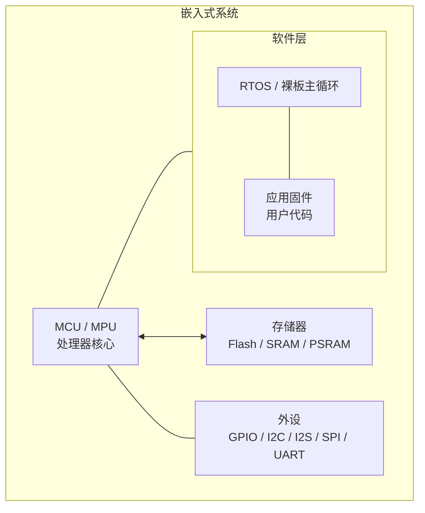

- **MCU**: 微控制器（Microcontroller Unit），片上集成了 CPU、RAM、Flash、外设
- **交叉编译**: 在 PC（x86）上编译生成 ESP32-S3（Xtensa/RISC-V）的二进制代码
- **固件**: 烧录到 flash 中的程序，设备上电后执行

#### 嵌入式开发的"标准流程"

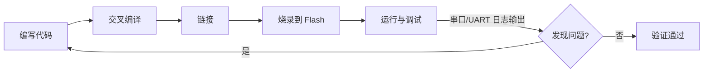

---

### 二、嵌入式开发的三种形态

你的直觉是**完全正确**的。嵌入式开发并非铁板一块，按软件复杂度从小到大，可以分为三个层次：

#### 形态一：裸板开发 (Bare-metal) — 无操作系统

**典型场景**：极简控制（LED 闪烁、按键检测、温湿度传感器读取）、成本敏感的消费电子

```
主循环 (Super Loop):
  while(1) {
      read_sensor();
      if(btn_pressed) handle_btn();
      delay(10);
  }
```

| 特征       | 说明                                      |
| -------- | --------------------------------------- |
| **无 OS** | 没有任务调度器，一个 while(1) 大循环 + 中断            |
| **资源占用** | 极小，RAM 可低至几百字节，Flash 几 KB               |
| **实时性**  | 中断是最高的实时响应手段，但主循环阻塞即死                   |
| **典型芯片** | 8 位单片机：51 系列、AVR、PIC；部分低端 ARM Cortex-M0 |
| **开发方式** | 直接操作寄存器或 HAL 库，IDE 如 Keil / IAR         |
| **优点**   | 简单直接、无 OS 学习成本、无调度开销                    |
| **缺点**   | 多任务靠手工拆分，代码规模一大就难以维护；一个 while 循环阻塞整机卡死  |

> **这个项目的对应**: 本项目有 FreeRTOS，不属于裸板。但 xvf_xmos.c/h 中与 XVF3800 的 I2C 通信其实接近这层——裸读写寄存器。

#### 形态二：RTOS 开发 — 轻量实时操作系统

**典型场景**：中等复杂度（音频处理、电机控制、联网设备），如本项目的 ESP32-S3

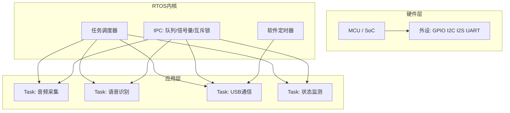

| 特征          | 说明                                                   |
| ----------- | ---------------------------------------------------- |
| **有 RTOS**  | 操作系统内核很小（几 KB 到几十 KB），提供任务调度、同步机制                    |
| **任务切换**    | 基于优先级抢占式调度（Priority-based Preemptive Scheduling）     |
| **IPC 机制**  | 队列（Queue）、信号量（Semaphore）、互斥锁（Mutex）、事件组（Event Group） |
| **典型 RTOS** | FreeRTOS（最广泛）、RT-Thread（国产）、Zephyr、μC/OS             |
| **典型芯片**    | ARM Cortex-M3/M4/M7、ESP32、RISC-V                     |
| **开发方式**    | SDK 框架（ESP-IDF / STM32Cube），C 语言，任务间通信设计             |
| **优点**      | 多任务隔离、实时性强、生态成熟、中等复杂度项目的最佳平衡                         |
| **缺点**      | 需要学习 RTOS 概念、调试多任务竞争比裸板复杂、没有 MMU（进程间互不保护）            |

> **本项目的定位**：ESP32-S3 + FreeRTOS + ESP-IDF 就是这个形态的典型代表。

#### 形态三：嵌入式 Linux — 完整操作系统

**典型场景**：高复杂度（路由器/摄像头/车机/工业平板），需要网络协议栈、文件系统、图形界面

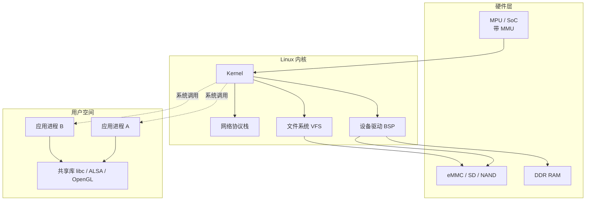

| 特征 | 说明 |
|------|------|
| **有 MMU** | 内存管理单元，可运行完整 Linux，进程间有地址空间隔离 |
| **资源需求** | 大：RAM ≥ 32MB，Flash/存储 ≥ 64MB，往往需要 DDR 内存 |
| **典型芯片** | ARM Cortex-A 系列（全志/RK/IMX）、RISC-V、x86 |
| **开发方式** | BSP 移植（板级支持包）→ 内核驱动开发 → 应用开发 |
| **驱动开发** | 编写/移植 Linux 内核驱动（字符设备 / platform 驱动 / DT 设备树） |
| **应用开发** | Linux 用户态进程，标准 POSIX API，多进程多线程 |
| **优点** | 功能最强大、生态最丰富、调试工具成熟（gdb/perf/strace） |
| **缺点** | 资源消耗大、实时性不如 RTOS（PREEMPT_RT 补丁可改善但不完全）、启动慢 |
| **入门门槛** | 需要同时懂硬件和 Linux 内核知识，学习曲线陡峭 |

> **注意**：这三个形态不是一个比另一个"高级"。裸板有裸板的成本优势，RTOS 有实时性优势，嵌入式 Linux 有功能生态优势。**做产品时根据需求选合适的**，而不是无脑上最复杂的。

#### 形态全览对比

| 维度 | 裸板 (Bare-metal) | RTOS | 嵌入式 Linux |
|------|:---:|:----:|:----------:|
| **OS 大小** | 0 KB | ~5-100 KB | MB ~ GB 级 |
| **RAM 需求** | ~0.1-4 KB | ~几 KB - 几百 KB | ≥ 32 MB（带 MMU）|
| **任务模型** | 大循环 + 中断 | 抢占式多任务 | 多进程 + 多线程 |
| **进程隔离** | 无 | 无 | 有（MMU）|
| **实时性** | 中断级（μs） | 优先级调度（μs~ms）| 非实时（ms 级，PREEMPT_RT 接近）|
| **调试难度** | 低（逻辑简单） | 中（竞态/死锁） | 高（驱动 crash 难定位）|
| **典型产品** | 遥控器/电子表 | 无人机/音频设备 | 路由器/摄像头/车机 |
| **代表芯片** | 51/AVR/PIC | STM32/ESP32 | i.MX/RK/全志 |

> **为什么本项目选 RTOS（FreeRTOS）而不是裸板或 Linux？**
>
> - ESP32-S3 只有 512KB 内部 SRAM，跑不动完整的嵌入式 Linux（至少需要 32MB+ 外部 DDR）
> - 任务多（I2S 收发、USB UAC、CDC、语音识别），裸板大循环无法优雅处理
> - 实时性要求高（音频流不能卡顿），FreeRTOS 的任务调度 + 固定核心绑定正好满足
> - 用 PSRAM（8MB）解决大数据（音频缓冲区、语音模型）的存储

---

### 三、本项目全局地图：XVF3800 ESP32-S3 固件

这是一个**USB 音频设备固件**，搭载语音识别（关键词唤醒）功能。

#### 硬件架构

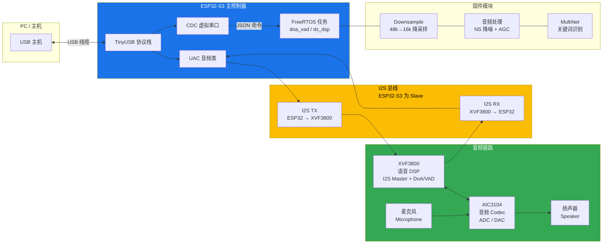

#### 关键芯片

| 芯片 | 角色 | 说明 |
|------|------|------|
| **ESP32-S3** | 主控制器 | Xtensa LX7 双核 240MHz，负责 USB 音频、语音识别、OTA |
| **XVF3800** | 语音 DSP | XMOS 多核处理器，负责 I2S 音频输入输出、声源方位(DoA)、人声检测(VAD) |
| **AIC3104** | 音频 Codec | TI 音频编解码器，数模/模数转换，连接扬声器与麦克风 |

#### 软件架构 — 任务（进程）分配

| 任务名 | 核心 | 优先级 | 功能 |
|-------|------|--------|------|
| `UAC MIC` (RX) | Core 0 | 14 | 从 I2S 收音频 → 发给 USB 主机 |
| `UAC SPK` (TX) | Core 0 | 14 | 从 USB 主机收音频 → 发给 I2S |
| `TinyUSB` | Core 1 | 15 | USB 协议栈（枚举、数据传输） |
| `doa_vad` | Core 1 | 5 | 每秒轮询 DoA/语音检测状态 |
| `ds_dsp` | Core 0 | 5 | 音频降噪+AGC+语音识别管道 |

#### 软件模块 — 源文件地图

```
main/main.c              ← 入口点，创建任务
main/xvf_i2s.c/h         ← I2S 初始化（Slave 模式、24 DMA 描述符）
main/xvf_i2c.c/h         ← I2C 总线初始化
main/xvf_aic3104.c/h     ← AIC3104 Codec 配置
main/xvf_uac.c/h         ← USB 音频类（UAC 1.0 回调）
main/xvf_downsample.c/h  ← 48k→16k 降采样 + DSP 任务
main/xvf_audio_proc.c/h  ← NS 降噪 + AGC 自动增益控制
main/xvf_multinet.c/h    ← 关键词识别（MultiNet 模型）
main/xvf_xmos.c/h        ← XVF3800 通信（DoA/VAD/控制）
main/xvf_ota.c/h         ← OTA 固件升级
main/usb_descriptors.c   ← USB 描述符（CDC+UAC 复合设备）
main/tusb_config.h       ← TinyUSB 配置
```

---

### 四、嵌入式开发的关键习惯

1. **阅读文档优先**：芯片 datasheet（数据手册）、芯片参考手册、框架 API 文档是第一手资料
2. **日志调试三板斧**：`ESP_LOGE`(错误) → `ESP_LOGW`(警告) → `ESP_LOGI`(信息) → `ESP_LOGD`(调试)
3. **先查芯片资源**：flash 大小、RAM 大小、PSRAM、可用的外设接口、引脚复用
4. **理解任务调度**：FreeRTOS 不是 Linux — 没有 MMU、没有进程隔离、共享全局地址空间
5. **阅读分区表**：知道代码放在哪、数据放在哪、OTA 如何工作

---

### 推荐阅读

- [ESP32-S3 技术参考手册 (Espressif 官方)](https://www.espressif.com/sites/default/files/documentation/esp32-s3_technical_reference_manual_en.pdf)
- [FreeRTOS 官方文档](https://www.freertos.org/Documentation/RTOS_book.html)
- [《嵌入式系统：硬件、软件与设计》—— 一个很好的全局入门书](https://www.amazon.com/Embedded-Systems-Introduction-Yifeng-Zhu/dp/0367260654)（英文）

---

## 答疑

### 一、什么是交叉编译工具链？

**一句话**：在 PC（x86 Linux/Windows）上运行，但生成目标芯片（ARM/Xtensa/RISC-V）机器码的编译工具集合。

#### 工具链的组成

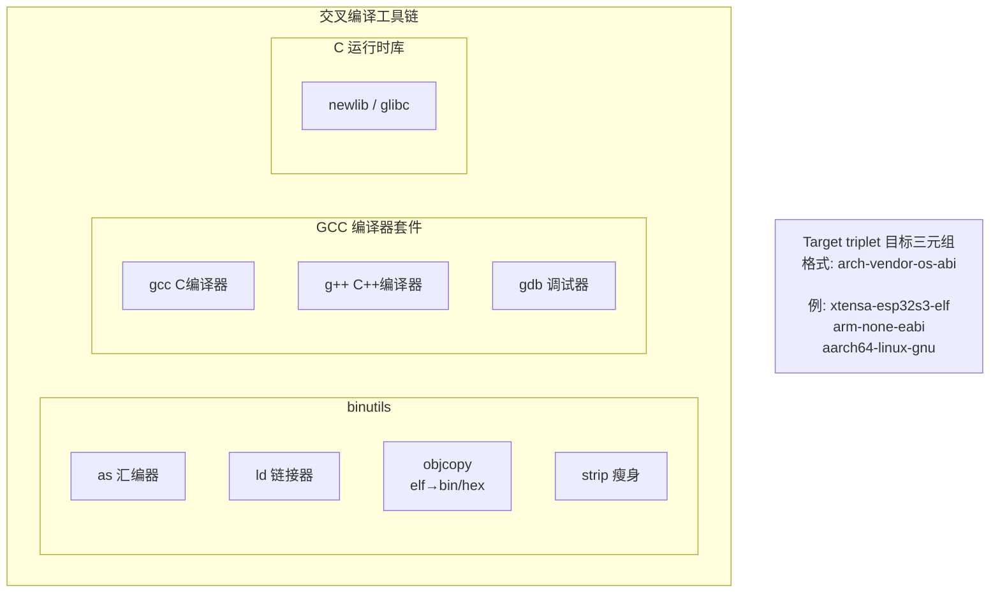

**关键文件**：

| 文件 | 用途 |
|------|------|
| `xtensa-esp32s3-elf-gcc` | C 编译器 |
| `xtensa-esp32s3-elf-g++` | C++ 编译器 |
| `xtensa-esp32s3-elf-ld` | 链接器 |
| `xtensa-esp32s3-elf-gdb` | 调试器 |
| `xtensa-esp32s3-elf-objcopy` | 二进制格式转换（elf → bin/hex）|
| `xtensa-esp32s3-elf-size` | 查看各段大小（text/data/bss）|

#### 目标三元组详解

```
xtensa-esp32s3-elf

    ISA:      Xtensa 架构
    Vendor:   ESP32-S3 变体
    ABI:      ELF 格式（无操作系统）
```

对比常见的：

| 三元组 | 含义 |
|--------|------|
| `arm-none-eabi` | ARM 架构，无厂商，EABI（裸板/RTOS） |
| `arm-linux-gnueabihf` | ARM 架构，Linux 目标，GNU EABI hard-float |
| `aarch64-linux-gnu` | ARM64 架构，Linux 目标 |
| `riscv32-unknown-elf` | RISC-V 32 位，无厂商，ELF |

---

### 二、IDE / 开发环境与工具链的关系

你观察得没错——大多数情况下**工具链由 IDE 或 SDK 自动提供**，但这只是"帮你装好了"，本质没有改变。

#### 不同项目的工具链来源

| 平台 | 工具链 | 谁提供的 |
|------|--------|---------|
| ESP32 + ESP-IDF | `xtensa-esp32s3-elf-gcc` | ESP-IDF 安装器自动下载 |
| STM32 + CubeIDE | `arm-none-eabi-gcc` | STM32CubeIDE 内置 |
| ARM MDK (Keil) | `armcc` (商业编译器) | Keil 安装包 |
| IAR | `iccarm` (商业编译器) | IAR EWARM 安装包 |

**本质规律**：SDK/IDE 仅仅是工具链的"分发者"。无论工具链是 IDE 自带还是你手工装，最终调用的都是同一条命令：

```bash
# ESP-IDF 本质上在帮你执行：
xtensa-esp32s3-elf-gcc -O2 -Iinclude/ src/main.c -o build/main.elf

# 你完全可以手动执行这行命令（如果环境变量配好了）
```

#### 本项目中的工具链

```bash
# 激活 IDF 环境后，工具链就在 PATH 中
source /home/u/.espressif/tools/activate_idf_v6.0.1.sh
which xtensa-esp32s3-elf-gcc
# 输出: ~/.espressif/tools/xtensa-esp32s3-elf-gcc/.../bin/xtensa-esp32s3-elf-gcc

# 你可以直接用它手动编译：
xtensa-esp32s3-elf-gcc --version
# xtensa-esp32s3-elf-gcc (crosstool-NG esp-2022r1) 11.2.0
```

---

### 三、编译优化与"并行计算加速"

你问的核心问题可以拆成两个层面：

#### 编译优化选项（代码质量）—— ✅ 编译器能力

编译器通过不同的 `-O` 级别控制优化程度：

| 选项 | 含义 | 编译速度 | 代码速度 | 代码大小 |
|------|------|:-------:|:-------:|:-------:|
| `-O0` | 无优化（默认调试） | 最快 | 最慢 | 最大 |
| `-O1` | 基本优化 | 快 | 中等 | 中等 |
| `-O2` | 标准优化（项目通常用这个） | 中等 | 快 | 中等 |
| `-O3` | 激进优化，可能增大代码 | 慢 | 更快 | 更大 |
| `-Os` | 优化代码大小 | 中等 | 中等 | 最小 |
| `-Ofast` | 极速优化（可能违反标准） | 慢 | 最快 | 最大 |

**额外优化技术**：

| 技术 | 编译选项 / 工具 | 说明 |
|------|----------------|------|
| **LTO** | `-flto` | 链接时优化，跨文件内联、消除未用代码 |
| **自动向量化** | `-O3` / `-ftree-vectorize` | 将循环自动编译为 SIMD 指令（如果目标 CPU 支持）|
| **PGO** | `-fprofile-generate` + `-fprofile-use` | 基于运行时 profile 引导优化 |
| **size 优化** | `-Os` + `-ffunction-sections -fdata-sections -Wl,--gc-sections` | 链接时去弃未用函数，嵌入式常用 |

```bash
# 本项目的 ESP-IDF 中，通过 sdkconfig 或 CMakeLists.txt 设置优化：
# sdkconfig: CONFIG_COMPILER_OPTIMIZATION_SIZE=y   (-Os)
# sdkconfig: CONFIG_COMPILER_OPTIMIZATION_PERF=y   (-O2)

# CMakeLists.txt 中也可以加：
target_compile_options(xvf3800_esp32s3_fw PRIVATE -O2 -flto)
```

#### 嵌入式编译的并行限制

1. **交叉编译本身的瓶颈**：目标芯片（如 Xtensa）的编译器优化不如 x86 的 GCC 成熟，部分优化 pass 可能不支持
2. **ESP32-S3 的 Xtensa 架构没有 SIMD**：`-O3` 的自动向量化不会产生 SIMD 指令（硬件不支持），只是常规循环优化
3. **内存限制**：激进优化（LTO + -O3）在链接阶段会大量消耗 PC 内存，大项目可能吃掉 4-8GB RAM
4. **Flash 大小**：ESP32-S3 每个 OTA 分区只有 2MB，`-O3` 生成的代码可能塞不下，所以很多 ESP32 项目用 `-Os`

---

### 四、拓展：Arduino 为什么也能为 ESP32 编译？

这是问到了工具链生态的一个重要特点：**Arduino 对 ESP32 的支持，本质上是在 ESP-IDF 之上加了一层"糖衣"**。

#### Arduino 的编译链

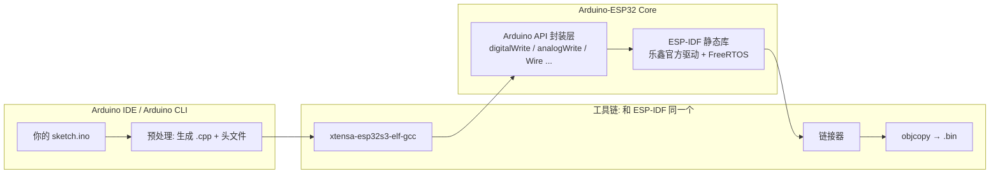

**核心事实**：Arduino for ESP32 的编译链条里，**最底层就是 ESP-IDF**。

#### 具体来看

| 层面 | Arduino | ESP-IDF（本项目） |
|------|---------|-----------------|
| **编译器** | 同一个 `xtensa-esp32s3-elf-gcc` | 同一个 |
| **底层库** | 链接了 ESP-IDF 的 `libesp-idf.a` | 直接调用 ESP-IDF 函数 |
| **FreeRTOS** | 在后台自动初始化 | 手动调用 `xTaskCreatePinnedToCore()` |
| **API** | `digitalWrite(pin, HIGH)` 一行控制 GPIO | `gpio_set_level(pin, 1)` —— 本质一样 |
| **启动流程** | 隐藏了，自动调用 `initArduino()` | 显式 `app_main()` 入口 |

**关键证据**：安装 Arduino-ESP32 支持包时，下载的内容列表：

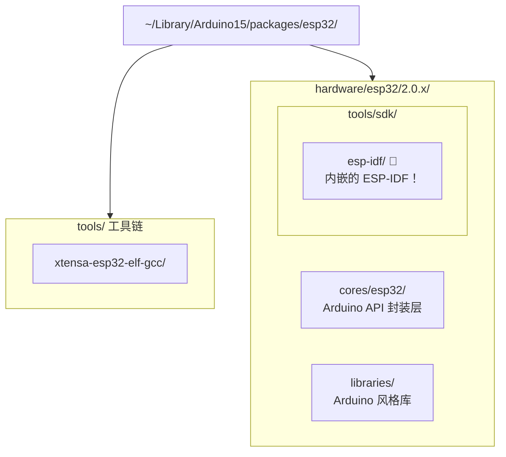

**结论**：Arduino for ESP32 = **ESP-IDF 的"简化前端"**。Arduino 帮你做了三件事：

1. **屏蔽了工具链调用细节**——你不用手动敲交叉编译命令
2. **隐藏了 FreeRTOS 初始化**——你不需要知道任务怎么创建，但底层其实跑着 FreeRTOS
3. **简化了 API**——`digitalWrite(2, HIGH)` 比 `gpio_set_level(GPIO_NUM_2, 1)` 更好记

#### 两个开发路径的对比

```c
// ═══ Arduino 方式 ═══
void setup() {
    pinMode(2, OUTPUT);          // 配置 GPIO2
    Serial.begin(115200);        // 初始化 UART
}
void loop() {
    digitalWrite(2, HIGH);       // GPIO2 = 高电平
    delay(1000);
    digitalWrite(2, LOW);
    delay(1000);
}

// ═══ ESP-IDF 方式（本项目）═══
void app_main(void) {
    gpio_set_direction(GPIO_NUM_2, GPIO_MODE_OUTPUT);  // 配置 GPIO2

    while (1) {
        gpio_set_level(GPIO_NUM_2, 1);   // GPIO2 = 高电平
        vTaskDelay(pdMS_TO_TICKS(1000)); // FreeRTOS 延时
        gpio_set_level(GPIO_NUM_2, 0);
        vTaskDelay(pdMS_TO_TICKS(1000));
    }
}
```

两种方式最终烧进芯片的**机器码几乎一样**。区别只在 Arduino 帮你写好了 `setup/loop` 背后的 FreeRTOS task 创建和 `pinMode/digitalWrite` 背后的 GPIO 寄存器操作。

#### Arduino + ESP-IDF 混合使用

更加能说明"Arduino 依赖 ESP-IDF"的是：**你可以直接在 ESP-IDF 项目里调用 Arduino API**。

```c
// CMakeLists.txt 中添加 Arduino 组件
set(EXTRA_COMPONENT_DIRS $ENV{IDF_PATH}/examples/common_components/arduino)

// main.c — 混用 ESP-IDF 和 Arduino API
#include "Arduino.h"
#include "driver/gpio.h"

void app_main(void) {
    initArduino();                     // 启动 Arduino 后台

    pinMode(2, OUTPUT);                // Arduino API
    gpio_set_level(GPIO_NUM_2, 1);     // ESP-IDF API，混用没问题
    Serial.begin(115200);
    Serial.println("Hello from ESP-IDF + Arduino!");
}
```

这清楚地说明：**ESP-IDF 是底层，Arduino 是上层封装**，不是两套独立的东西。

---

> **所以回答你的问题**：是的，Arduino 内部确实使用了 ESP-IDF。更准确地说，Arduino-ESP32 Core 是建立在 ESP-IDF 之上的一个**API 兼容层**，编译时链接了 ESP-IDF 的库，运行时调用了 ESP-IDF 初始化的 FreeRTOS 和驱动。**同一套 xtensa 交叉编译工具链，被不同的「前端」以不同的方式调用**——这就是嵌入式工具链生态的常见格局。

| 你的问题 | 答案 |
|---------|------|
| 编译优化（代码快/小） | ✅ 编译器能力：`-O0` ~ `-Ofast`、LTO、PGO |
| 并行编译加速（构建快） | ❌ 构建系统能力：`make -j`、`ninja`、`ccache`、`distcc` |
| IDE 是否提供工具链 | 只是"包管理"，本质还是调 gcc |
| 嵌入式有没有特殊限制 | 有：Flash 大小、CPU 架构不支持 SIMD、交叉编译器优化成熟度 |

> **参考**：
> - [GCC Optimization Options 官方文档](https://gcc.gnu.org/onlinedocs/gcc/Optimize-Options.html)
> - [ESP-IDF 编译系统文档 — 优化配置](https://docs.espressif.com/projects/esp-idf/en/latest/esp32s3/api-guides/build-system.html#custom-build-system-steps)
> - [GNU Make -j 选项](https://www.gnu.org/software/make/manual/html_node/Parallel.html)
> - [crosstool-NG — 嵌入式工具链构建工具](https://crosstool-ng.github.io/)（了解工具链如何被"制作"出来的）

---

## 第 2 课：ESP32-S3 芯片与外设

### 一、ESP32-S3 芯片概览

#### 芯片参数速览

| 参数 | 值 |
|------|-----|
| **CPU** | Xtensa LX7 双核 32 位，最高 240 MHz |
| **指令集** | Xtensa（Tensilica 自定义 RISC 架构，非 ARM 非 RISC-V） |
| **SRAM** | 512 KB（片内） |
| **PSRAM** | 最大 8 MB（通过 SPI 接口外挂，本项目用了全 8 MB） |
| **Flash** | 最大 16 MB（SPI 连接，本项目用 8 MB）|
| **USB OTG** | 内置 USB Serial/JTAG 控制器 + USB OTG（可用于 TinyUSB）|
| **I2S** | 2 个 I2S 控制器，支持全双工 |
| **I2C** | 2 个 I2C 控制器，支持主机/从机模式 |
| **UART** | 3 个 UART 控制器 |
| **SPI** | 4 个 SPI 控制器 |
| **GPIO** | 45 个可编程 GPIO（大部分可复用为其他外设功能）|
| **安全** | AES/SHA/RSA 硬件加速器、随机数生成器 |
| **无线** | 2.4 GHz Wi-Fi 4 + Bluetooth 5.0 LE |

> **ESP32-S3 在嵌入式芯片中的定位**：中高端 MCU。比 STM32F4 性能更强（双核+240MHz）、集成 Wi-Fi/BT、有大容量 PSRAM 支持。但比嵌入式 Linux SoC（如全志/瑞芯微）少了 MMU，不能跑完整 Linux。

#### 芯片内部结构

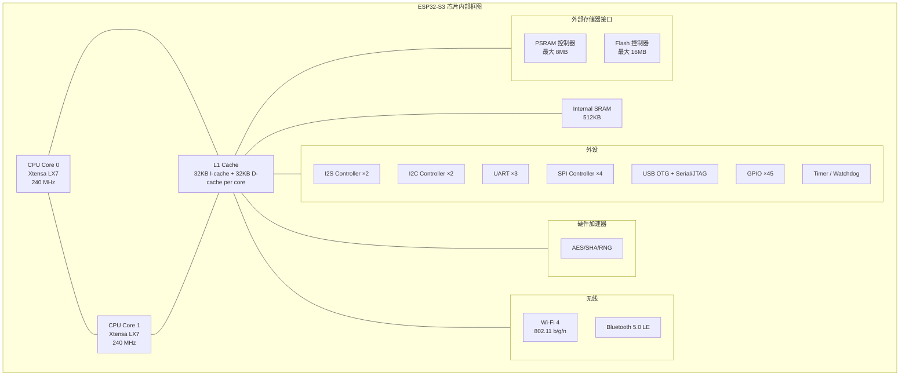

#### 项目中的存储布局

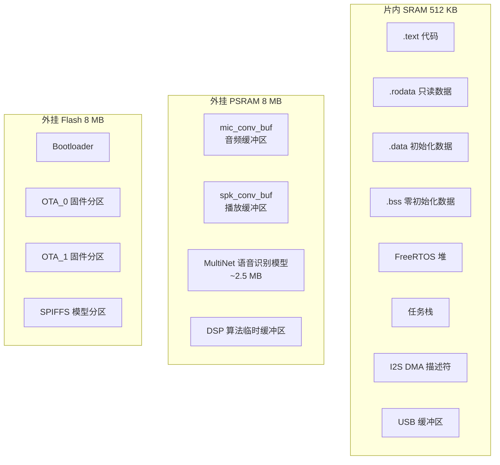

**为什么需要 PSRAM？** 语音识别模型（MultiNet quantized）大约 2.5 MB，远超片内 512 KB SRAM。ESP32-S3 通过 SPI 总线外挂 PSRAM 芯片——程序可以像访问普通内存一样读写它，只是速度略慢（80 MHz SPI vs 片内 SRAM 全速访问）。

---

### 二、外设循序渐进

嵌入式开发中"操作外设"本质上就是三件事：

1. **配置时钟**——让它跑起来
2. **配置引脚**——把外设信号映射到物理引脚（ESP32 的特色，称为 GPIO Matrix）
3. **读写寄存器/缓冲区**——传数据

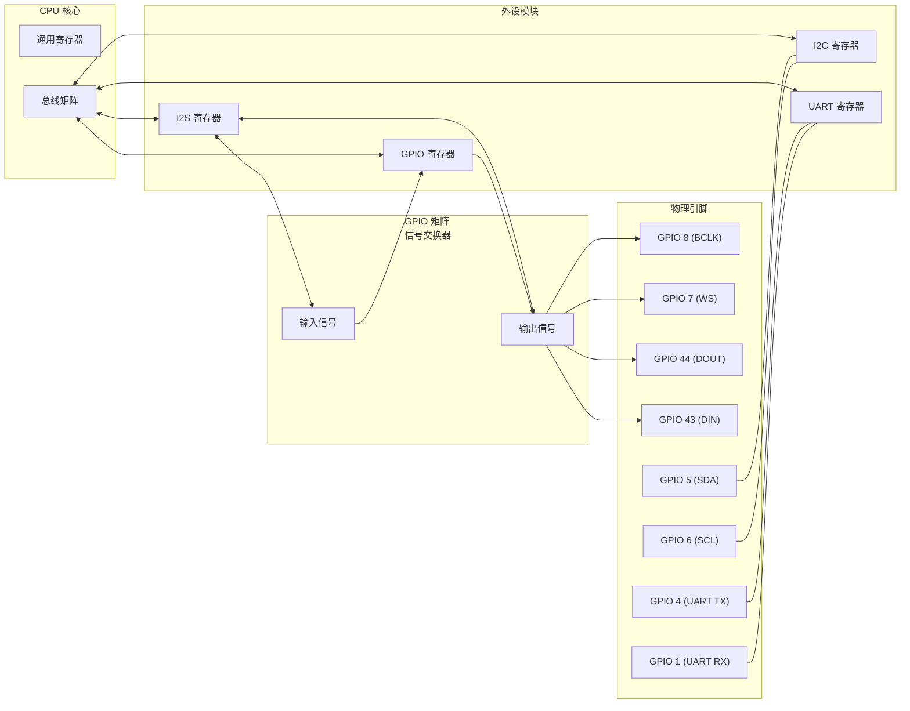

> **重点**：不同于 STM32 等 ARM 芯片（外设功能固定在特定引脚上），**ESP32-S3 的大部分外设信号可以通过 GPIO Matrix 映射到任意 GPIO**。这给了 PCB 布局极大的灵活性，但也意味着你必须显式配置每个引脚的功能。

---

#### 为什么需要总线协议？（从 GPIO 到 I2S/I2C 的设计思考）

用 GPIO 能做的事情很直接——拉高、拉低、读电平。但**一旦需要在两个芯片之间传输有意义的数据**，问题就来了。

#### 用 GPIO 纯手工通信的困境

假设你想用一根 GPIO 在 ESP32 和 XVF3800 之间传音频数据。你写了这样的代码：

```c
// 发送一个字节 0xA5 = 0b10100101
void send_byte(uint8_t byte) {
    for (int i = 7; i >= 0; i--) {
        gpio_write(DATA_PIN, (byte >> i) & 1);
        delay_us(10);  // 等10微秒
    }
}
```

看似能工作，但存在一堆致命问题：

| 困境 | 说明 | 后果 |
|------|------|------|
| **时序不可靠** | `delay_us(10)` 只是"大概10微秒"。CPU 被中断打断就会偏离。接收方如果按自己的时钟读取，迟早错位。 | 几秒后就收到乱码 |
| **没有同步机制** | 接收方怎么知道"开始了"？怎么知道一个字节结束、下一个开始？全靠猜。 | 数据帧边界丢失 |
| **速度极慢** | 每个 bit 都要 CPU 亲手去翻转引脚——发送 16kHz 16-bit 立体声（512 kbps），CPU 什么别的都干不了。 | CPU 被通信任务独占 |
| **没有错误检测** | 信号被干扰翻转了，接收方浑然不知。 | 数据完整性无保障 |
| **一对多困难** | 每增加一个设备就要多占 GPIO 脚。10 个传感器 = 10 条 GPIO = 10 个 pin。 | 引脚不够用 |

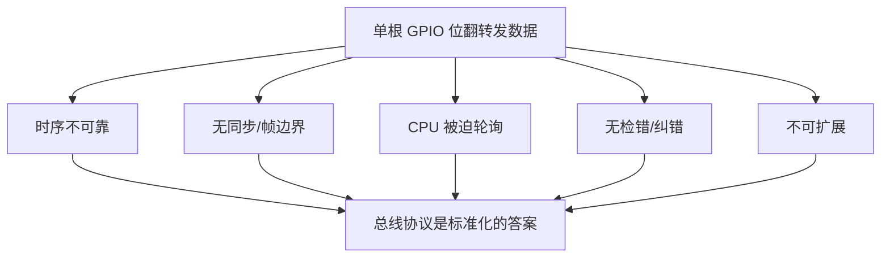

#### 总线协议本质上解决了什么？

每种总线协议都是一套**标准化的约定**，解决上面所有问题：

| 总线做了什么 | 解决的问题 | 怎么做到 |
|-------------|:---------:|---------|
| **定义时钟 / 波特率** | 时序不可靠 | 双方约定好速度，或专门给一根时钟线 |
| **定义帧格式**（起始位、停止位、帧同步） | 无同步 / 边界不清晰 | I2S 有 WS（字选信号），I2C 有 START/STOP 条件，UART 有起始位/停止位 |
| **硬件自动收发** | CPU 被迫轮询 | 外设控制器+ DMA 在后台搬运，CPU 只收"搬完了"的中断 |
| **错误检测** | 数据不可靠 | UART 有奇偶校验，I2C 有 ACK/NACK，SPI 可加 CRC |
| **共享总线 / 寻址** | 不可扩展 | I2C 的 7/10-bit 地址，一条总线挂 127 个设备 |

#### 关键设计选择：同步 vs 异步

所有总线协议在**时钟策略**上有一个根本性分歧：

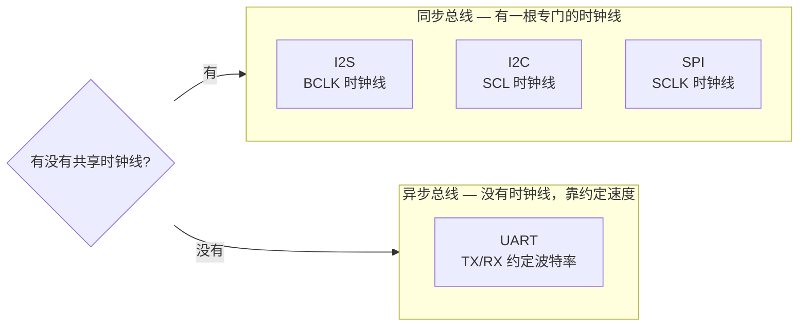

| 类型 | 典型协议 | 优点 | 缺点 | 适用场景 |
|------|---------|------|------|---------|
| **同步** | I2C, I2S, SPI | 时钟由一方提供，接收方跟着走，不会跑偏 | 多一根线+多一个 pin | 音频（I2S）、多设备总线（I2C）、高速传输（SPI） |
| **异步** | UART | 只要两根线，最简单 | 双方必须约定好波特率（误差 <2%），没有时钟信号来对齐 | 调试串口、GPS 模块、蓝牙 AT 指令 |

#### 各协议解决了什么特定场景

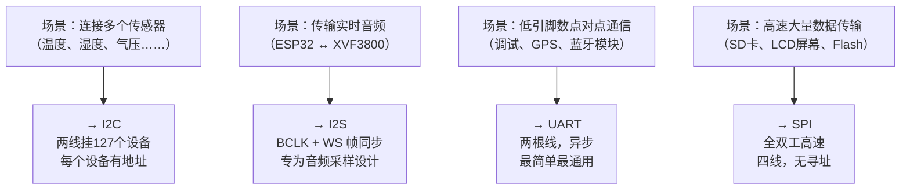

每一套协议都不是凭空发明的——**每个协议背后都对应一个真实硬件需求**，协议的每一根线、每一条时序规定都是为了解决特定场景下的物理限制。

> **本项目中**：XVF3800 既是 I2S 音频源（通过 BCLK + WS + DOUT 发送音频），也是 I2C 受控设备（ESP32 通过 I2C 配置其 DSP 参数）。两种协议被选中的原因完全不同——I2S 为实时音频流而生，I2C 为多设备配置和控制而生。

---

#### 1. GPIO — 通用输入输出

**概念**：最基础的外设。读引脚电平（输入）或设置引脚电平（输出）。

**工作原理**：
- 输入：读取 GPIO 寄存器对应位 → 0 或 1
- 输出：写 GPIO 寄存器对应位 → 引脚输出高或低电平
- 内部上拉/下拉：可配置的弱上拉/弱下拉电阻，避免浮空输入

**ESP-IDF API**：
```c
// 配置 GPIO2 为推挽输出
gpio_config_t io_conf = {
    .pin_bit_mask = (1ULL << GPIO_NUM_2),
    .mode = GPIO_MODE_OUTPUT,
    .pull_up_en = GPIO_PULLUP_DISABLE,
    .pull_down_en = GPIO_PULLDOWN_DISABLE,
    .intr_type = GPIO_INTR_DISABLE,
};
gpio_config(&io_conf);

gpio_set_level(GPIO_NUM_2, 1);  // 输出高电平
int level = gpio_get_level(GPIO_NUM_2);  // 读取电平
```

**本项目中的 GPIO 使用**：
| 引脚 | 功能 | 方向 | 说明 |
|------|------|:----:|------|
| GPIO 4 | UART TX | 输出 | 串口控制台输出 |
| GPIO 1 | UART RX | 输入 | 串口控制台输入 |
| GPIO 5 | I2C SDA | 双向 | I2C 数据线 |
| GPIO 6 | I2C SCL | 输出 | I2C 时钟线 |
| GPIO 7 | I2S WS | 输入 | I2S 字选择（Slave 模式，由 XVF3800 驱动）|
| GPIO 8 | I2S BCLK | 输入 | I2S 位时钟（Slave 模式，由 XVF3800 驱动）|
| GPIO 43 | I2S DIN | 输入 | I2S 数据入（XVF3800 → ESP32）|
| GPIO 44 | I2S DOUT | 输出 | I2S 数据出（ESP32 → XVF3800）|

---

#### 2. I2C — 两线串行总线

**概念**：Inter-Integrated Circuit，一种同步、多主从、两线（SDA + SCL）低速总线，用于芯片间通信。

**工作原理**：

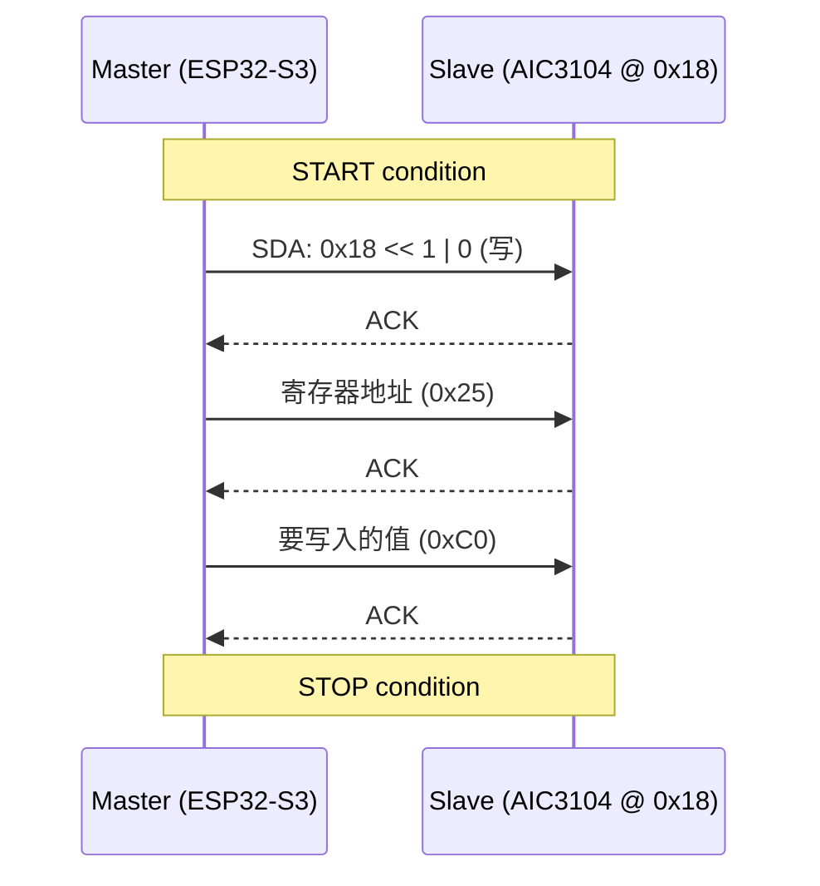

**关键参数**：
| 参数 | 说明 | 本项目 |
|------|------|--------|
| 速度 | 标准 100kHz / 快速 400kHz / 高速 3.4MHz | **100 kHz** |
| 地址 | 7 位或 10 位设备地址 | **7 位** |
| 上拉 | 需要外部上拉电阻到 VCC | **使能内部上拉** |
| 多主 | 支持 | 仅做主 |

**本项目中的应用**：I2C 总线连接了两个设备：

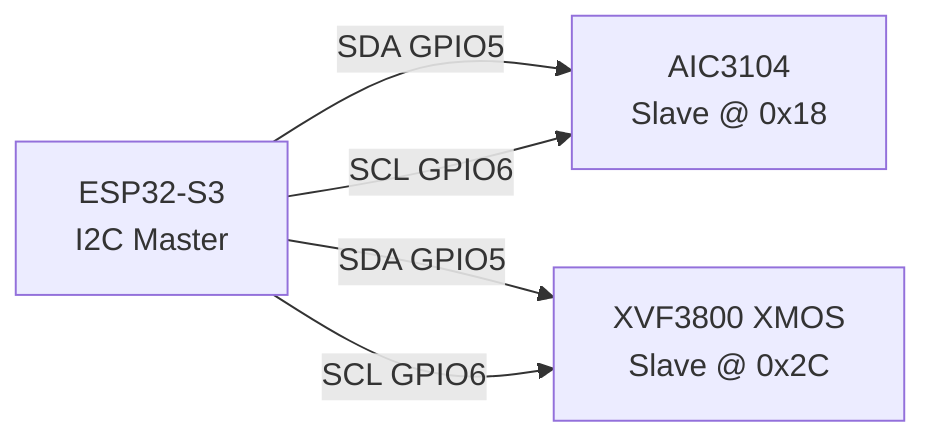

- **AIC3104** (地址 0x18)：音频 Codec 的配置接口。通过 I2C 写寄存器控制音量、静音、电源、路由。
- **XVF3800** (地址 0x2C)：XMOS Resource Manager。通过 I2C 发送"GPO Servicer"协议读取声源方向（DoA）和人声检测（VAD），控制 LED 效果。

**ESP-IDF 代码示例**（来自本项目 `xvf_i2c.c`）：
```c
// 1. 创建 master 总线
i2c_master_bus_config_t bus_cfg = {
    .sda_io_num = 5,
    .scl_io_num = 6,
    .clk_source = I2C_CLK_SRC_DEFAULT,
    .flags.enable_internal_pullup = true,
};
i2c_new_master_bus(&bus_cfg, &xvf_i2c_bus_handle);

// 2. 添加 AIC3104 设备
i2c_device_config_t aic3104_cfg = {
    .dev_addr_length = I2C_ADDR_BIT_LEN_7,
    .device_address  = 0x18,
};
i2c_master_bus_add_device(xvf_i2c_bus_handle, &aic3104_cfg,
                          &xvf_i2c_aic3104_dev);

// 3. 写寄存器（reg 0x25 = 0xC0）
uint8_t data[2] = { 0x25, 0xC0 };
i2c_master_transmit(xvf_i2c_aic3104_dev, data, 2, 100);
```

---

#### 3. I2S — 数字音频总线

**概念**：Inter-IC Sound，专为数字音频设计的串行总线，三根主要信号线：

| 信号 | 全称 | 作用 |
|------|------|------|
| **BCLK** | Bit Clock | 位时钟，每 bit 一个脉冲 |
| **WS** | Word Select | 声道选择，低=左声道，高=右声道 |
| **DOUT** | Data Out | 串行数据输出 |
| **DIN** | Data In | 串行数据输入 |

**数据格式（标准 Philips I2S）**：

| 信号 | 时序说明 |
|------|---------|
| **BCLK** | 每个 bit 一个脉冲，由 Master 产生 |
| **WS** | 低电平 = 左声道数据，高电平 = 右声道数据 |
| **DOUT** | 在 BCLK 的下降沿后输出数据，MSB 先发，延迟 1 个 BCLK |

**本项目的关键配置**：

```
I2S 角色: ESP32-S3 = SLAVE, XVF3800 = MASTER
       (XVF3800 驱动 BCLK 和 WS)

采样率: 16 kHz (默认) 或 48 kHz (通过 CONFIG_UAC_SAMPLE_RATE 切换)
位深:   32-bit
声道:   立体声 (Stereo)
MCLK:   512× 倍频 (确保全双工 Slave 模式下时钟稳定)
DMA 描述符: 24 (保证全双工下 TX/RX 不互相阻塞)

引脚:
  BCLK = GPIO 8   (由 XVF3800 产生)
  WS   = GPIO 7   (由 XVF3800 产生)
  DOUT = GPIO 44  (ESP32 → XVF3800, 播放数据)
  DIN  = GPIO 43  (XVF3800 → ESP32, 录音数据)
```

**为什么 ESP32-S3 是 Slave？**

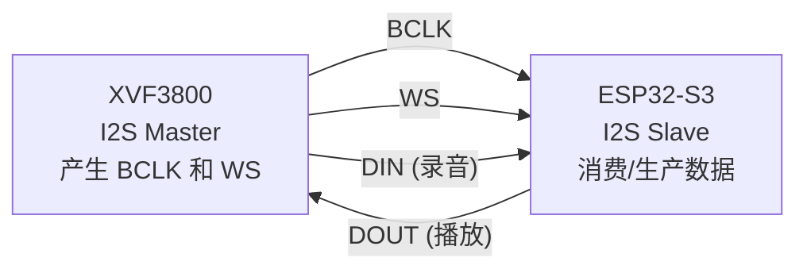

> 见 AGENTS.md：**不要改为 Master 模式**——BCLK/WS 由 XVF3800 的 DSP 时钟域生成，修改后全双工会时钟域失步。

---

#### 4. UART — 通用异步收发器

**概念**：三线（TX / RX / GND）异步串行通信，用于调试控制台、GPS、蓝牙模块等。

**关键参数**：波特率（bps）、数据位、停止位、校验位。

**本项目中的应用**：串口调试控制台

```
UART1, GPIO 4 (TX), GPIO 1 (RX), 115200 baud
```

**为什么不用 UART0？** 默认的 UART0 引脚（GPIO43/44）被 I2S 占用了。所以本项目的 console（`printf`, `ESP_LOG`）全部路由到 UART1。

> 需要外接 USB-TTL 转换器：XIAO 的 D3（GPIO4）→ TTL RX，D0（GPIO1）→ TTL TX

```c
// ESP-IDF 控制台初始化（来自 Kconfig 配置）
// CONFIG_ESP_CONSOLE_UART_CUSTOM=y
// CONFIG_ESP_CONSOLE_UART_NUM=1
// CONFIG_ESP_CONSOLE_UART_TX_GPIO=4
// CONFIG_ESP_CONSOLE_UART_RX_GPIO=1
// CONFIG_ESP_CONSOLE_UART_BAUDRATE=115200

// 然后直接用标准方法打印：
ESP_LOGI("tag", "Hello, UART1!");  // → GPIO 4 输出
printf("Hello, UART1!\n");          // → GPIO 4 输出
```

---

#### 5. SPI — 串行外设接口

**概念**：四线同步全双工串行总线（MOSI / MISO / SCLK / CS），比 I2C 快得多，用于 Flash、SD 卡、显示器等。

**本项目中的应用**：**未直接用于数据通信**，但 SPI 在后台默默发挥着关键作用：

| 用途 | 描述 |
|------|------|
| **Flash** | ESP32-S3 通过 SPI 访问外部 Flash（8 MB 存储代码和数据）|
| **PSRAM** | ESP32-S3 通过 SPI 访问外部 PSRAM（8 MB 运行时扩展内存），SPI 时钟 **80 MHz** |

这两个都由 ESP-IDF 和硬件自动管理，项目代码中没有直接的 SPI API 调用——但你每运行一行代码，实际上都是通过 SPI 从 Flash 取指令。

---

#### 6. USB — 通用串行总线

**概念**：通用串行总线，支持多种设备类，即插即用。

**本项目中的应用**：**USB 复合设备**——同时作为 CDC（虚拟串口）和 UAC（音频设备）被主机识别。

```
USB 枚举后，主机看到的设备：
  Interface 0: CDC Control     (通信设备控制)
  Interface 1: CDC Data        (串口数据传输)
  Interface 2: UAC Control     (音频控制)
  Interface 3: UAC Speaker     (扬声器流)
  Interface 4: UAC Microphone  (麦克风流)
```

**TinyUSB 协议栈**：本项目用 TinyUSB（而不是 ESP-IDF 内置的 USB 栈）。

- `main/tusb_config.h` — TinyUSB 的配置宏
- `main/usb_descriptors.c` — 自定义 USB 描述符，定义设备类、端点、接口布局
- `main/CMakeLists.txt` — 将 tusb_config.h 和 usb_descriptors.c 注入 TinyUSB 构建

**USB 描述符层次**：

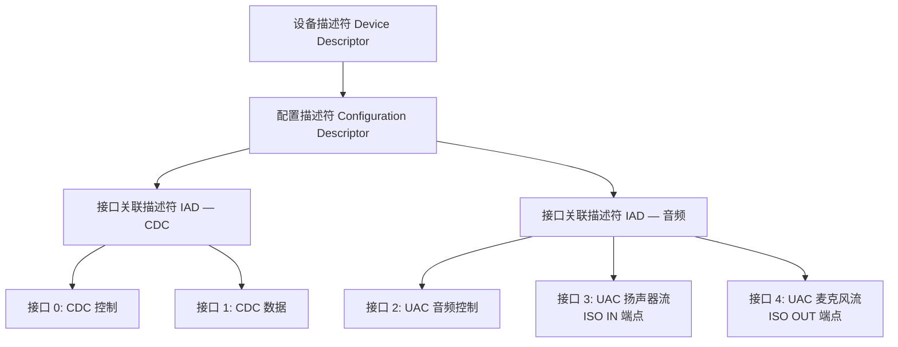

---

### 三、外设对比总结

| 外设 | 信号线 | 同步/异步 | 速度 | 用途 | 本项目是否使用 |
|------|:-----:|:---------:|:----:|------|:------------:|
| **GPIO** | 1 per pin | 同步 | ns 级 | 通用数字 I/O | ✅ 间接（I2S/I2C/UART 的底层）|
| **UART** | 2 (TX/RX) | 异步 | 最高 ~5 Mbps | 调试串口、GPS、蓝牙 | ✅ 调试控制台 |
| **I2C** | 2 (SDA/SCL) | 同步 | 100 kHz ~ 3.4 MHz | 芯片间配置、传感器 | ✅ AIC3104 + XVF3800 配置 |
| **I2S** | 3~4 (BCLK/WS/DOUT/DIN) | 同步 | ~几 MHz | 数字音频 | ✅ 核心音频数据通道 |
| **SPI** | 4 (MOSI/MISO/SCLK/CS) | 同步 | 最高 ~80 MHz | 高速数据、Flash、显示 | ⚙️ Flash + PSRAM（后台）|
| **USB** | 2 (D+/D-) | 异步 | 12Mbps(FS)~480Mbps(HS) | 与 PC 通信 | ✅ UAC + CDC 复合设备 |

---

### 四、本项目引脚全布局

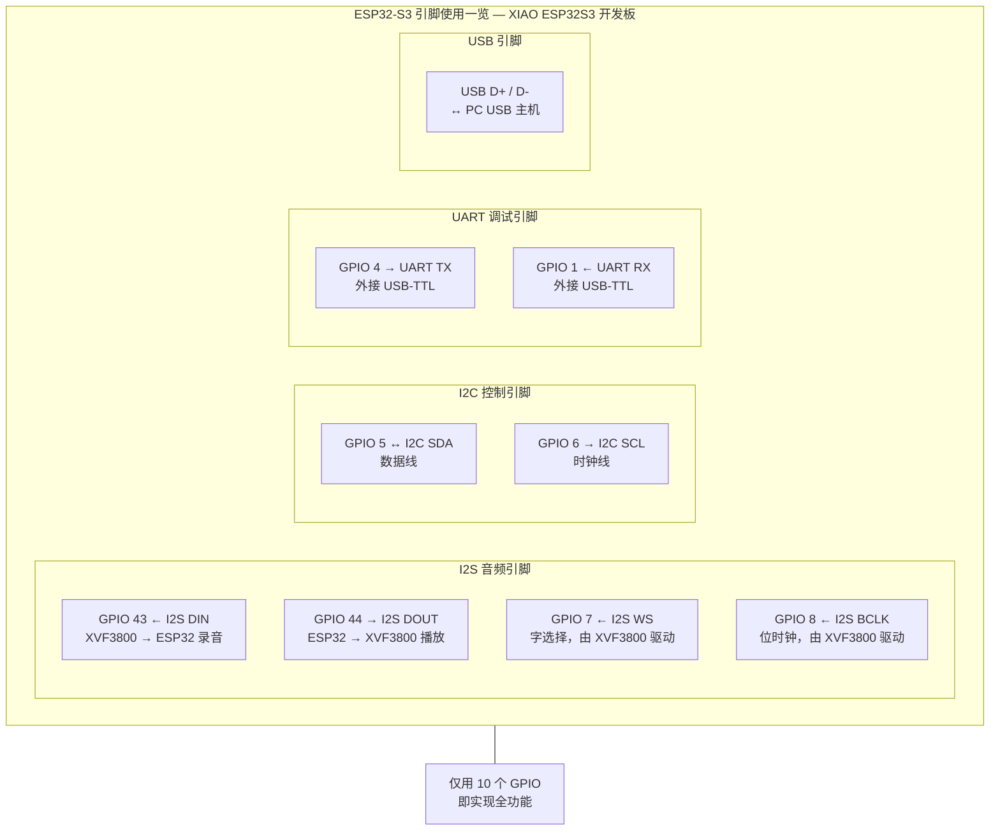

> **知识点**：总共只用了 **10 个 GPIO/引脚**，就实现了 I2S 全双工音频 + I2C 双设备控制 + UART 调试 + USB 复合设备。这就是芯片高度集成和 GPIO Matrix 灵活性的体现。

---

## 答疑：

### 一、GPIO 的物理本质 — 从晶体管到代码

#### 你的问题拆开看

> 1. GPIO 在硬件/物理上是什么？就是一个可以连接的导线？
> 2. ESP32 的 GPIO 可以在程序中配置为特定功能？
> 3. ARM 芯片的特殊 GPIO 有特殊功能？
> 4. 这和寄存器有什么联系？

下面从硅片级别逐步解释。

#### 一、GPIO 不是一根导线，是一套电路

一个 GPIO 引脚不是简单的导线。你看到的"引脚"（金属焊盘）背后，是芯片内部的一套 **晶体管电路**：

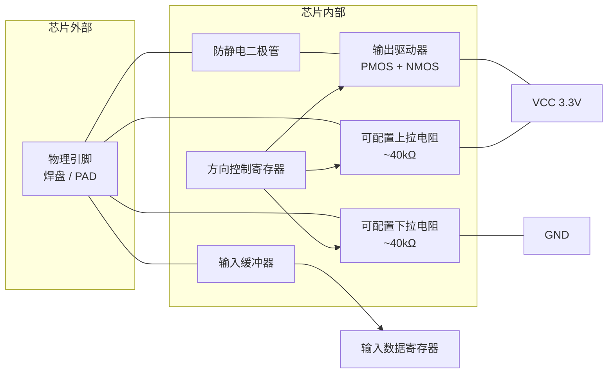

#### 二、用开关模型理解（最直观）

把 GPIO 内部电路想象成两个开关控制的电路：

```mermaid
graph LR
    subgraph CHIP[芯片内部 GPIO 电路]
        PR[上拉电阻 (40kΩ)] --- PIN((GPIO 引脚<br/>输出到外部))
        PU_SW{上拉开关} --- VCC[VCC 3.3V]
        PR --- PU_SW

        PD_SW{下拉开关}
        PD_R[下拉电阻 (40kΩ)] --- PIN
        GND_PU["GND"] --- PD_SW
        PD_R --- PD_SW

        OUT_SW_P[PMOS 开关 (P型)] --- VCC
        OUT_SW_N[NMOS 开关 (N型)] --- GND
        OUT_SW_P --- PIN
        PIN --- OUT_SW_N
    end

    PIN --> EXT[外部电路 / 传感器]
```

**关键**：这些"开关"不是物理开关，是 **MOS 管**（金属氧化物半导体场效应管）——通过栅极电压控制通断的电子元件。每个 MOS 管都有独立的控制信号，这些控制信号就来自 **寄存器**。

---

#### 三、寄存器是什么？——代码和硬件的桥梁

**寄存器 = 芯片内部的一组 D 触发器（锁存器），每个 bit 控制一个开关。**

```mermaid
flowchart TB
    subgraph CODE[你的代码]
        A[gpio_set_direction<br/>pin, GPIO_MODE_OUTPUT]
    end

    subgraph CPU[CPU 内核]
        B[写总线操作<br/>GPIO_OUTPUT_REG<br/>= 0b_0000_0100]
    end

    subgraph HW[硬件寄存器与电路]
        C[寄存器 bit5 = 1]
        D[MOS管栅极接收信号]
        E[PMOS/NMOS 导通<br/>引脚输出电平]
    end

    A --> B --> C --> D --> E
```

用一句话类比：

> **寄存器就像一排灯的开关面板。你在代码里写 `GPIOA = 0x05`，相当于把第 0 和第 2 个灯打开——只不过这里的"灯"是芯片内部的 MOS 管，控制的是引脚的电气行为。**

---

#### 四、每个 GPIO 模式对应什么样的晶体管配置？

你查到的 STM32 GPIO 模式，我们来逐个拆解它对应的物理电路状态：

##### 模式 1：浮空输入 (Floating Input)

```mermaid
graph LR
    EXT[外部信号] --> PIN((GPIO 引脚))
    PIN --> BUF[输入缓冲器]
    BUF --> REG[输入数据寄存器]

    PU[上拉开关 ✗ 断开] -.->|断开| VCC[VCC]
    PD[下拉开关 ✗ 断开] -.->|断开| GND[GND]
    VCC -.-> PIN
    GND -.-> PIN
```

- **上拉开关**：断开
- **下拉开关**：断开
- **输出 MOS**：都断开（高阻态）
- **效果**：引脚电平完全由外部信号决定。如果没有外部信号，引脚处于"浮空"——电平不确定，可能是 1 也可能是 0，极易受电磁干扰。
- **危险场景**：浮空输入 + 没有外部驱动 = 电平乱跳 → 造成程序误判

##### 模式 2：上拉输入 (Pull-up Input)

```mermaid
graph LR
    EXT[外部信号] --> PIN((GPIO 引脚))
    PIN --> BUF[输入缓冲器]
    BUF --> REG[输入数据寄存器]

    VCC[VCC 3.3V] -->|~40kΩ| PU[上拉开关 ✓ 闭合]
    PU --> PIN
    PD[下拉开关 ✗ 断开] -.->|断开| GND[GND]
    GND -.-> PIN
```

- **效果**：当外部没有信号时，引脚被内部电阻拉到 VCC（高电平=1）。外部接地时读取 0，悬空时读取 1。
- **典型用途**：按键检测。按键未按下时读到 1，按下（接地）时读到 0。

##### 模式 3：下拉输入 (Pull-down Input)

```mermaid
graph LR
    EXT[外部信号] --> PIN((GPIO 引脚))
    PIN --> BUF[输入缓冲器]
    BUF --> REG[输入数据寄存器]

    VCC[VCC 3.3V] -.->|断开| PIN
    PU[上拉开关 ✗ 断开] -.-> VCC
    GND[GND] -->|~40kΩ| PD[下拉开关 ✓ 闭合]
    PD --> PIN
```

- **效果**：悬空时默认读到 0，外部接 VCC 时读到 1。

##### 模式 4：模拟输入 (Analog Input)

- 绕过了数字输入缓冲器，直接连接到芯片内部的 **ADC（模数转换器）**。
- 引脚读取的是连续电压值（如 1.5V），而不是 0/1。

##### 模式 5：推挽输出 (Push-Pull Output)

```mermaid
graph TB
    REG[输出数据寄存器]
    REG -->|bit = 1 时导通| PMOS[PMOS 管]
    REG -->|bit = 0 时导通| NMOS[NMOS 管]
    VCC[VCC 3.3V] --> PMOS
    PMOS --> PIN((GPIO 引脚))
    PIN --> EXT[外部电路]
    NMOS --> PIN
    GND[GND] --> NMOS
```

- 输出数据寄存器=1 → PMOS 导通 → 引脚接 VCC → 输出 3.3V（强驱动，数十 mA）
- 输出数据寄存器=0 → NMOS 导通 → 引脚接 GND → 输出 0V（强驱动）
- **"推挽"的意思**：推=拉高（PMOS），挽=拉低（NMOS）。任何时候总有一个管子导通，提供确定的电平。

##### 模式 6：开漏输出 (Open-Drain Output)

```mermaid
graph TB
    REG[输出数据寄存器]
    REG -->|bit = 0 时导通<br/>bit = 1 时断开| NMOS[NMOS 管]

    VCC[VCC 3.3V] --> R[外部上拉电阻<br/>必需！]
    R --> PIN((GPIO 引脚))
    PIN --> EXT[外部电路 / 总线]

    NMOS --> PIN
    GND[GND] --> NMOS

    PMOS[PMOS 管] -.->|始终断开 ✗| PIN
    VCC -.-> PMOS
```

- 输出数据寄存器=0 → NMOS 导通 → 引脚接地 → 输出 0V
- 输出数据寄存器=1 → NMOS 断开 → 引脚处于高阻态 → **外部上拉电阻**把引脚拉到 VCC
- **为什么需要开漏**：多个设备的开漏输出可以并到同一根线上（I2C 的 SDA 就是这样）。如果有两个设备同时输出 1 → 都是高阻 → 靠上拉电阻维持高电平。如果某个输出 0 → NMOS 导通 → 强制拉低整条线——这就是 I2C 的"线与"逻辑基础。

---

#### 五、ESP32 vs ARM (STM32)：不同的 GPIO 设计哲学

你的直觉是对的——ARM 系列芯片（如 STM32）和 ESP32 的 GPIO 有本质区别：

##### STM32（ARM Cortex-M）

```mermaid
graph LR
    subgraph STM32_PINS[STM32 引脚功能固定]
        PA0["PA0 → UART2_CTS | TIM2_CH1"]
        PA1["PA1 → UART2_RTS | TIM2_CH2"]
        PA9["PA9 → USART1_TX | TIM1_CH2"]
        PA10["PA10 → USART1_RX | TIM1_CH3"]
    end

    AF[AF 寄存器<br/>2~3 个复用选项] --> PA0 & PA1 & PA9 & PA10
```

##### ESP32-S3（GPIO Matrix）

```mermaid
graph LR
    subgraph PERIPH_SIGNALS[外设信号]
        UART_TX[UART_TX]
        I2S_BCLK[I2S_BCLK]
        I2C_SDA[I2C_SDA]
        SPI_MOSI[SPI_MOSI]
    end

    MATRIX[GPIO Matrix<br/>可编程交换矩阵]

    subgraph GPIO_PINS[任意 GPIO 引脚]
        GPIO4[GPIO 4]
        GPIO8[GPIO 8]
        GPIO5[GPIO 5]
        GPIO21[GPIO 21]
    end

    UART_TX --> MATRIX
    I2S_BCLK --> MATRIX
    I2C_SDA --> MATRIX
    SPI_MOSI --> MATRIX

    MATRIX --> GPIO4 & GPIO8 & GPIO5 & GPIO21
```

**区别总结**：

| 特性 | STM32 (ARM) | ESP32-S3 (Xtensa) |
|------|:-----------:|:-----------------:|
| 外设→引脚映射 | **固定**（只有 2-3 个复用） | **任意**（几乎所有外设可映射到几乎所有 GPIO）|
| 实现方式 | AF 寄存器切换有限选项 | GPIO Matrix 硬件交换矩阵 |
| PCB 设计 | 引脚功能约束布线 | 极其灵活 |
| 学习成本 | 简单，查表即可 | 需要理解 Matrix 概念 |

这就回答了你的问题："ARM 系列特殊 GPIO 有特殊功能"——对，STM32 上每个引脚可用的外设功能是预定义好的 2-3 个选项，不像 ESP32 那样可以任意映射。

---

#### 六、从代码到寄存器：完整流程

以本项目开 AIC3104 Codec 的音量控制为例：

```mermaid
flowchart TB
    subgraph A[步骤1: 配置 GPIO 为 I2C 功能]
        CODE1["i2c_master_bus_config_t cfg = {<br/>    .sda_io_num = 5,<br/>};"]
        API1["i2c_new_master_bus()"]
        REG1["GPIO_FUNC5_OUT_SEL = I2C_SDA_SIG<br/>GPIO_FUNC6_OUT_SEL = I2C_SCL_SIG"]
        REG2["I2C_CTR_ENABLE = 1"]
    end

    subgraph B[步骤2: 发送数据]
        CODE2["i2c_master_transmit(dev, data, 2, 100)"]
        REG3["I2C_FIFO_DATA = data[0]<br/>I2C_FIFO_DATA = data[1]"]
        REG4["I2C_CTR_START = 1"]
        REG5["while(I2C_CTR_BUSY);"]
    end

    CODE1 --> API1
    API1 --> REG1
    REG1 --> REG2
    REG2 -->|硬件开始处理 I2C 时序| A_DONE[✓]

    CODE2 --> REG3
    REG3 --> REG4
    REG4 --> REG5
    REG5 --> B_DONE[✓ 发送完成]
```

每一步你的 C 代码最终都会被翻译成对芯片内部特定地址的 **寄存器写操作**，该寄存器的 bit 直接控制对应 MOS 管的通断。

---

#### 总结

| 你的问题 | 答案 |
|---------|------|
| GPIO 物理上是什么？ | 一套由 MOS 管 + 上拉电阻 + 输入缓冲器 + 寄存器组成的**驱动电路**，不是一根导线 |
| 程序中配置 GPIO 功能？ | 通过写**寄存器**来开关 MOSFET 的导通状态，改变引脚的电气行为 |
| ARM 的 GPIO 有特殊功能？ | 对，STM32 的引脚外设功能是**固定 2-3 个选项**的，不像 ESP32 的 GPIO Matrix 可任意映射 |
| 和寄存器有什么关系？ | **寄存器是唯一的桥梁**——代码通过写寄存器的 bit 来控制硬件电路中的每一路开关 |

> **参考阅读**：
> - [STM32 GPIO 结构剖析 (中文)](https://blog.csdn.net/qq_38410730/article/details/79858906) — 有晶体管级电路图
> - [ESP32-S3 Technical Reference Manual — Chapter 5: IO MUX and GPIO Matrix](https://www.espressif.com/sites/default/files/documentation/esp32-s3_technical_reference_manual_en.pdf) — 官方寄存器级描述
> - [MOSFET 工作原理动画](https://www.youtube.com/watch?v=BfjyjoN45jM) — 理解晶体管如何当开关用

#### 七、补充：CPU内核寄存器 vs 外设寄存器

**"寄存器"这个词出现在两个截然不同的地方**，物理本质相同（都是D触发器锁存器），但位置、作用和访问方式完全不同。

##### 1. CPU内核寄存器 — 指令直接操作的对象

- **位置**：CPU核心内部，离ALU（算术逻辑单元）最近
- **地位**：最顶层的存储，速度与CPU同频
- **访问方式**：**无地址**，由指令直接指定（如 `R0`, `SP`, `EAX`）
- **数量**：极少（ARM 的 R0-R15，x86 的 EAX/EBX...），位宽通常等于处理器位数
- **作用**：暂存运算数、结果、地址——指令直接读写

```c
// 这段 C 代码
int a = 3, b = 5;
int c = a + b;

// 编译器生成的汇编（ARM）:
// MOV R0, #3      ; R0 = 3     ← R0 是 CPU 内核寄存器
// MOV R1, #5      ; R1 = 5     ← R1 是 CPU 内核寄存器
// ADD R2, R0, R1  ; R2 = R0+R1 ← R2 是 CPU 内核寄存器
```

##### 2. 外设寄存器 — 控制外设行为的"控制面板"

- **位置**：CPU外部的外设模块内（GPIO控制器、串口控制器...）
- **访问方式**：**有内存地址**，通过指针访问（内存映射）
- **数量**：很多，有效位宽由外设功能决定
- **作用**：控制外设行为、反映外设状态

```c
// 同样的"寄存器"两个字，这里的 REG 是外设寄存器
#define GPIO_OUT_REG  (*((volatile uint32_t*)0x60004000))

GPIO_OUT_REG = 0x00000004;  // 写外设寄存器 → 硬件引脚输出电平变化
```

| 对比维度 | CPU 内核寄存器 | 外设寄存器 |
|---------|:------------:|:---------:|
| **位置** | CPU 核心内部 | 外设模块内 |
| **作用** | 指令操作对象：暂存、运算 | 外设控制面板：配置、状态 |
| **访问方式** | 无地址，指令直接指定 | 有内存地址，指针访问 |
| **数量** | 极少（~16-32个） | 很多（每个外设有数十个） |
| **例子** | `R0`, `SP`, `EAX` | `GPIO_DATA`, `UART_BAUD` |

---

#### 八、补充：处理器位宽与寄存器

**"处理器是32位"通常指**：通用寄存器、ALU（算术逻辑单元）和内部数据总线的宽度都是32位。这叫 **数据通路宽度**。

**为什么通用寄存器要等于处理器位宽？**

1. **性能**：一个时钟周期完成一次完整位宽的数据运算，无需拆分
2. **简洁**：`int` 和指针天然映射到一个寄存器，指令直接操作

但这不是绝对——存在例外：

- 8位机用 16位寄存器对（`HL = H+L`）来寻址
- 32位机有 64/128位 SIMD/FPU 寄存器（NEON、SSE）
- 这些例外是为特殊目的（向量运算、浮点）增加的**旁路设计**

---

#### 九、补充：总线 — 连接CPU与外设的桥梁

##### 总线的基本工作流程

总线不是一根导线，而是一个包含**地址、数据、控制**的多功能传输系统。一次完整传输需要：寻址 → 路由 → 读写控制 → 数据传输 → 锁存。

```mermaid
flowchart LR
    CPU[CPU 内核] <--> BUS_M[总线矩阵<br/>地址路由 + 仲裁]
    BUS_M <-->|地址/数据/控制| SRAM[片内 SRAM]
    BUS_M <-->|地址/数据/控制| GPIO[GPIO 外设寄存器]
    BUS_M <-->|地址/数据/控制| UART[UART 外设寄存器]
    BUS_M <-->|地址/数据/控制| SPI_F[SPI Flash 控制器]

    DMA[DMA 控制器] <--> BUS_M
```

##### 内存映射：CPU如何"看到"外设寄存器

外设寄存器被分配在统一的内存地址空间。CPU 用**同样的 `LDR`/`STR` 指令**访问内存和外设——区别只在于目标地址。总线矩阵根据地址自动路由到正确的设备。

```c
// 这两条汇编指令外观一模一样，但目标地址不同
LDR R0, [0x3FCE0000]   // 读到的是 SRAM 里的变量
LDR R0, [0x60004000]   // 读到的是 GPIO 输入寄存器 → 引脚电平！
```

##### 总线带宽能突破 "频率 × 位宽" 吗？

| 技术 | 原理 | 效果 |
|------|------|------|
| **多总线层（总线矩阵）** | CPU取指、读写数据走不同总线，可并行 | 总带宽 = 各链路之和 |
| **DDR（双倍数据速率）** | 时钟上升沿和下降沿各传一次 | 等效带宽翻倍 |
| **提高频率/加宽位宽** | 直接提升单总线极限 | 增加功耗和设计难度 |

> ESP32-S3 的 PSRAM 就是通过 SPI 总线以 **80 MHz × 8 bit** 访问的。

---

#### 十、补充：GPIO寄存器操作的具体实践

##### 为什么操作GPIO必须以寄存器长度为单位？

**硬件限制**：CPU 到 GPIO 的物理总线宽度是固定的（32位）。一次读写，硬件自动并行传送完整的32位数据，**无法只传1位**。

要修改某个单独的 GPIO 位，必须：

| 方法 | 操作 | 典型用途 |
|------|------|---------|
| **读-改-写** | 读出32位 → 改其中1位 → 写回32位 | 通用方法 |
| **BSRR 寄存器** | 写特定值到专用寄存器，硬件解释为"置位/复位" | STM32 特色，原子操作 |

```c
// 方法1: 读-改-写（非原子，有隐患）
uint32_t val = GPIOA->ODR;     // 读 32 位
val |= (1 << 5);               // 改第5位为1
GPIOA->ODR = val;              // 写回 32 位

// 方法2: BSRR 寄存器（STM32 — 原子操作，不需读）
GPIOA->BSRR = (1 << 5);        // 直接置位 bit5，其它位不受影响
```

##### 多GPIO端口必须串行

CPU 通过**共享总线**访问不同端口寄存器，一次只能访问一个。无法在同一个时钟周期内同时读取两个 GPIO 端口——存在纳秒级的时间偏差。

**硬件同步方案**：利用定时器硬件触发和捕捉寄存器，自动锁存多个引脚在同一时刻的电平，CPU 过后再读取。精度可达一个时钟周期。

---

#### 十一、补充：DMA — 直接存储器访问

DMA 是一个**专门用于搬运数据的硬件模块**，是总线主设备。可以不经 CPU 干预，直接在内存和外设之间成块搬运数据。

```mermaid
flowchart LR
    subgraph 传统方式
        CPU_T[CPU] -->|读外设| PER_T[外设]
        PER_T -->|数据到寄存器| CPU_T
        CPU_T -->|写内存| RAM_T[内存]
    end

    subgraph DMA方式
        DMAC[DMA 控制器] -->|1次配置<br/>源/目标/长度| BUS
        BUS[总线] -->|自动搬运| PER_D[外设]
        PER_D --> BUS
        BUS --> RAM_D[内存]
    end
```

**本项目中的 DMA 应用**：

| 使用场景 | 说明 |
|---------|------|
| **I2S DMA** | 24个DMA描述符，在 I2S 外设和 PSRAM 音频缓冲区之间自动搬运数据 |
| **SPI Flash/PSRAM** | ESP32-S3 通过 SPI DMA 访问外部 Flash 和 PSRAM |

**DMA 为何高效？**

| 优势 | 对比 |
|------|------|
| **免软件开销** | 传输1000次数据只产生1次中断，而非 1000 次 |
| **硬件流水线化** | 数据传输流程由硬件状态机执行，效率远超 CPU 逐条指令 |
| **与CPU并行** | 不同总线从设备上，DMA 和 CPU 可并行工作 |

---

#### 十二、补充：处理器的响应节拍与 RTOS 实时性

##### 处理器按什么节拍处理GPIO？

**没有固定心跳节拍**，由两种模式触发：

| 模式 | 节拍 | 特点 |
|------|------|------|
| **轮询** | 软件循环时间 | 简单但占用 CPU，无法捕捉短脉冲 |
| **中断** | 硬件事件异步触发 | 事件发生→CPU立即响应，效率高 |

##### RTOS 如何保证"实时"？

RTOS 保证的是**确定性**（截止时间内必响应），而非绝对快。依赖三大支柱：

```mermaid
graph TD
    TIMER[硬件定时器<br/>Tick 中断<br/>系统时间基准] --> SCHED[抢占式调度器]

    HP[高优先级任务就绪] --> PREEMPT[立即抢占低优先级任务]
    PREEMPT --> SCHED

    SCHED --> DETER[确定性保证:<br/>• 中断延迟 = 常数<br/>• 任务切换时间 = 常数<br/>• 不随系统负载恶化]
```

##### 多外设状态能同步到时钟精度吗？

**软件做不到**。因总线共享和指令串行，CPU 无法在同一时刻读取多个外设状态，必然存在纳秒级时间差。

**工程解决方案**：不追求绝对同时，而是追求**偏差可控**。通过硬件时间戳、定时器触发的 DMA 快照等机制，可将同步偏差控制在纳秒级，满足工业级需求。

> 本项目中 ESP32-S3 的 I2S 全双工音频就是这样的例子：用 24 个 DMA 描述符保证 TX/RX 在 Slave 模式下不互相阻塞，通过 DMA 硬件同步而非软件轮询。

---

#### 本节关键术语速查

| 术语 | 定义 |
|------|------|
| **ALU** | Arithmetic Logic Unit，算术逻辑单元，执行加减乘除与逻辑运算 |
| **数据通路宽度** | 通用寄存器 + ALU + 内部总线的统一位宽 |
| **内存映射** | 将外设寄存器分配到统一地址空间，CPU 用访存指令访问 |
| **BSRR** | Bit Set/Reset Register，STM32 的原子位操作寄存器 |
| **总线矩阵** | 多主多从的总线交换网络，允许多条总线并行 |
| **DDR** | Double Data Rate，时钟上下沿各传输一次数据 |
| **DMA** | 见术语表「系统与存储」分类 |
| **抢占式调度** | 高优先级任务就绪时立即打断低优先级任务 |
| **确定性** | 操作的执行时间可预测，不随系统负载而变化 |

---

### 二、IRQ 与软中断 — 硬件如何敲门，软件如何优雅收尾

IRQ 代表"硬件如何敲门"，softirq 代表"软件如何优雅地干完脏活累活"。两者合在一起，构成了嵌入式系统中断处理的完整流程。

#### 一、IRQ：中断请求 — 硬件敲 CPU 的门

**IRQ = Interrupt Request（中断请求）**。把它理解成：外设在 CPU 门口装了一个电铃。

比如你按下按键，按键电路产生电平变化，经过硬件电路，最终变成一根线上的电信号，直接告诉 CPU："有事找你！"

**为什么需要 IRQ？**

| 方式 | 说明 | 问题 |
|------|------|------|
| **轮询** | CPU 不停地问每个外设"你好了没？"（反复读寄存器） | CPU 所有时间都在问，效率极低 |
| **IRQ 中断** | CPU 埋头干自己的事，外设"按铃"时才暂停去处理 | 效率高，只在必要时响应 |

有了 IRQ，CPU 先干自己的事，直到外设按铃——CPU 立刻暂停手头工作，去处理外设的事，处理完再回来继续。这就是"中断"的含义。

##### 中断控制器：如何精准找到对应的处理程序？

一个 CPU 只有少数几根物理中断线，但外设却很多。需要**中断控制器**来管理：

```mermaid
flowchart TB
    subgraph PERIPH[外设]
        UART[UART 接收完毕]
        TIMER[定时器溢出]
        GPIO_BTN[按键按下]
        SPI_DONE[SPI 传输完成]
    end

    subgraph CTRL[中断控制器 NVIC / GIC]
        COLLECT[汇集所有 IRQ 信号]
        PRI[排队与优先级仲裁]
        NUM[分配唯一中断向量号]
    end

    subgraph CPU_CORE[CPU 核心]
        VTABLE[中断向量表<br/>IRQ号 → ISR地址 的映射]
        ISR[中断服务程序 ISR]
    end

    UART & TIMER & GPIO_BTN & SPI_DONE --> COLLECT
    COLLECT --> PRI
    PRI --> NUM
    NUM --> VTABLE
    VTABLE --> ISR
```

| 芯片平台 | 中断控制器名称 |
|---------|:------------:|
| ARM Cortex-M (STM32, ESP32-S3) | **NVIC**（Nested Vectored Interrupt Controller）|
| ARM Cortex-A (嵌入式 Linux) | **GIC**（Generic Interrupt Controller）|

你在启动文件里看到的"中断向量表"，就是 IRQ 号到服务函数地址的一张地图。

##### IRQ 铁律：必须极快执行完

处理一个 IRQ 时，通常会**屏蔽同级或更低级的中断**。如果在 ISR 里磨蹭，其他重要的 IRQ 就会丢失，系统实时性就被破坏了。

---

#### 二、软中断（softirq）：把苦力活"分期付款"

这就引出一个矛盾：

| 要做的 | 特点 |
|--------|------|
| **紧急的事** | 把 UART 收到的 1 个字节从数据寄存器读出来（否则下一个字节会覆盖它） |
| **耗时的事** | 解析这 1 个字节，拼成完整指令包，再去控制电机 |

全在 ISR 里做完 → ISR 时间太长，系统死。不做完 → 数据堆在那儿。

**解决方案：把中断处理劈成两半。**

```mermaid
flowchart TB
    HW_EVENT[硬件事件触发 IRQ]

    subgraph TOP[顶半部 Top Half — 硬中断 ISR]
        READ[✓ 读取数据寄存器]
        CLEAR[✓ 清除中断标志]
        COPY[✓ 复制数据到缓冲区]
        MARK[✓ 标记软中断/调度 tasklet]
        RETURN[立即返回]
    end

    subgraph BOTTOM[底半部 Bottom Half — softirq / tasklet]
        PARSE[解析数据包]
        CTL[控制电机/上报事件]
        CALC[复杂计算]
    end

    HW_EVENT --> TOP
    TOP -->|稍后执行| BOTTOM
```

| 半部 | 做什么 | 特性 |
|------|--------|------|
| **顶半部** (Top Half) | 最紧急、不可推迟：读寄存器、清标志、拷数据 | 在硬中断上下文中，必须极快 |
| **底半部** (Bottom Half) | 非紧急但耗时：解析、计算、上报 | 在"软中断上下文"中，可被硬中断抢占 |

---

#### 三、softirq 的工作方式

softirq 不是神秘的特殊中断，而是一个**"软件触发的中断上下文"**。

**触发方式**：硬中断 ISR 做完顶半部后，不是去真正干活，而是"标记"一下——设置一个位图里的一个比特位（比如"编号为 NET_RX_SOFTIRQ 的软中断需要执行了"）。这个标记操作是**纯软件的**。

**执行时机**：软中断不是马上执行的。内核在以下"安全点"检查并处理待办的软中断：

1. 硬件中断处理结束，准备返回时
2. 系统调用返回用户空间前
3. 内核里专门的 `ksoftirqd` 线程被唤醒时

**执行环境**：运行在**中断上下文**中，不是进程。这意味着它：
- ❌ 不能阻塞、不能睡眠
- ✅ 可以被硬中断抢占
- ⚠️ 同一类型可在不同 CPU 核上同时运行，需要小心保护共享数据

---

#### 四、嵌入式 Linux 里：tasklet 才是日常

在嵌入式 Linux 驱动开发中，你**几乎不会直接写 softirq**。因为 softirq 数量是内核编译时静态固定的（如网络收发、块设备等），个数有限，且并发复杂。

日常开发中用的是 **tasklet**——基于 softirq 实现，但更简单、更安全：

- 底层就是一个叫 `TASKLET_SOFTIRQ` 的软中断
- 硬件 ISR 调用 `tasklet_schedule()` 调度后，内核在合适时机运行
- **同一个 tasklet 不会在多个 CPU 上同时运行**——编程更友好

##### 举个 GPIO 按键的 Linux 驱动例子

```
按键按下 → GPIO 中断触发

┌─ 顶半部（ISR）──────────────────────┐
│  tasklet_schedule(&my_tasklet);      │  ← 只做这一件事
│  return;                             │    耗时 < 1μs
└─────────────────────────────────────┘
            │
            ▼  (内核在安全点执行)
┌─ 底半部（tasklet）────────────────────┐
│  按键防抖处理                         │
│  上报输入事件给用户空间                │
│  (此时设备已可响应新的硬中断)           │
└─────────────────────────────────────┘
```

---

#### 五、RTOS 里的"softirq"：不是同一种东西

大多数轻量级 RTOS（FreeRTOS、RT-Thread、μC/OS）**没有 Linux 那种专门的 softirq 框架**，但会用其他方式实现"推迟处理"：

| RTOS 中的模式 | 说明 |
|-------------|------|
| **软件中断 (PendSV/SVC)** | ARM Cortex-M 提供软件可触发的中断。RTOS 用它做**任务切换**——这是真正的软中断，但不是用来做驱动下半部的 |
| **在 ISR 中释放信号量/任务通知** | 最常见的"RTOS 下半部"模式。硬件 ISR 只做最急的事 → 释放信号量 → 唤醒高优先级任务去处理 |
| **Deferred Interrupt API** | 部分 RTOS（如 RT-Thread）提供了专门的"中断延迟处理"或"工作队列"组件，和 tasklet 很像 |

**简单来说**：RTOS 的思路更直接——硬中断里只发信号，让一个**高优先级任务**去完成剩下的耗时工作。这个高优先级任务，就是 RTOS 里的 "softirq 等价物"。

##### 本项目（FreeRTOS）中的实例

```c
// 伪代码：本项目中 I2S DMA 完成后的 ISR
void i2s_dma_complete_isr(void) {
    // 顶半部：只做最紧急的
    clear_interrupt_flag();
    // 下半部：通知任务
    xSemaphoreGiveFromISR(s_audio_semaphore, &xHigherPriorityTaskWoken);
    portYIELD_FROM_ISR(xHigherPriorityTaskWoken);
}
// 高优先级任务被唤醒后处理音频数据...
```

---

#### 六、总结对比

| 维度 | 硬中断 (IRQ) | 软中断 (softirq / tasklet) |
|------|:-----------:|:--------------------------:|
| **触发源** | 硬件外设（电平/边沿） | 软件标记（硬中断处理程序标记） |
| **运行时机** | 立即，抢占当前执行流 | 硬中断返回等安全点被调用 |
| **目的** | 最紧急、不可推迟的事 | 非紧急的后续耗时工作 |
| **运行上下文** | 中断上下文，通常关部分中断 | 中断上下文，但通常开所有中断 |
| **实时性影响** | 必须极快，否则丢中断 | 可以稍慢，但有延迟要求 |
| **嵌入式 Linux 里** | 驱动 ISR | 底半部，常用 tasklet |
| **RTOS 里** | 外设 ISR | 无专门机制，用高优先级任务或回调 |
| **本项目 (FreeRTOS)** | `tud_cdc_rx_cb()` 等 | `xSemaphoreGiveFromISR()` 唤醒任务 |

> **一句话**：IRQ 让 CPU 知道世界发生了什么，softirq 让 CPU 能妥善处理好所有的事，还不耽误响应新的事件。

---

#### 术语表新增

| 术语 | 定义 |
|------|------|
| **IRQ** | Interrupt Request，硬件中断请求，外设通过硬件信号线通知 CPU |
| **ISR** | Interrupt Service Routine，中断服务程序，响应硬中断的函数 |
| **NVIC** | Nested Vectored Interrupt Controller，ARM Cortex-M 的中断控制器 |
| **GIC** | Generic Interrupt Controller，ARM Cortex-A（Linux）的中断控制器 |
| **中断向量表** | IRQ 号 → ISR 函数地址的映射表 |
| **softirq** | 软件中断上下文，Linux 内核中推迟非紧急处理的机制 |
| **tasklet** | 基于 softirq 的底半部接口，嵌入式 Linux 驱动开发最常用 |
| **顶半部 / 底半部** | 将中断处理拆为紧急（ISR）和耗时（tasklet/任务）两部分 |
| **ksoftirqd** | Linux 内核中专门处理 softirq 的内核线程 |
| **PendSV** | ARM Cortex-M 的可挂起软件中断，RTOS 用于任务切换 |

---

### 三、I2C 协议 — 原理、总线之争与实战

#### 一、I2C 是什么？

**I2C = Inter-Integrated Circuit**，字面意思："芯片之间的通信"。它是一种**同步、半双工、多设备、两线制**的串行通信协议。

```mermaid
flowchart TB
    subgraph BUS[I2C 总线 — 仅两根线]
        SCL[SCL — 串行时钟线<br/>Serial Clock]
        SDA[SDA — 串行数据线<br/>Serial Data]
    end

    MASTER[主设备 Master<br/>ESP32-S3] <-->|控制时钟| SCL
    MASTER <-->|收发数据| SDA

    SLAVE1[从设备 Slave 1<br/>XVF3800] <--> SCL & SDA
    SLAVE2[从设备 Slave 2<br/>温度传感器] <--> SCL & SDA
    SLAVE3[从设备 Slave N ...] <-->|最多 ~127 个| SCL & SDA

    RPU1[上拉电阻 Rp<br/>~4.7kΩ] --- SDA
    RPU2[上拉电阻 Rp<br/>~4.7kΩ] --- SCL
    VCC[VCC 3.3V] --- RPU1 & RPU2
```

**关键特征**：

| 特征 | 说明 |
|------|------|
| **线数** | 2 根：SCL（时钟）+ SDA（数据） |
| **通信模式** | 半双工（同一时刻只能一个方向传数据） |
| **主从架构** | Master 控制时钟、发起通信；Slave 响应 |
| **寻址** | 7 位或 10 位地址，每个从设备有唯一地址 |
| **速度** | 标准 100 kbps / 快速 400 kbps / 高速 3.4 Mbps |
| **最大设备数** | 理论 127 个（7 位地址），实际受总线电容限制 |

---

#### 二、I2C 如何工作 — 一次完整通信

##### 2.1 核心机制：开漏输出 + 上拉电阻

I2C 最独特的设计：**所有设备都只能把线拉低，不能拉高**。

```mermaid
flowchart LR
    subgraph PHYS[单根 SDA 线的物理结构]
        VCC[VCC 3.3V]
        RP[上拉电阻 4.7kΩ]
        SDA_LINE[SDA 线]
        MOS1[Master MOS 管<br/>只能拉到 GND]
        MOS2[Slave1 MOS 管<br/>只能拉到 GND]
        MOS3[Slave2 MOS 管<br/>只能拉到 GND]
    end

    VCC --> RP --> SDA_LINE
    SDA_LINE --- MOS1 --- GND1[GND]
    SDA_LINE --- MOS2 --- GND2[GND]
    SDA_LINE --- MOS3 --- GND3[GND]
```

| 谁在操作 | 线上结果 | 逻辑含义 |
|---------|---------|---------|
| **所有设备断开 MOS 管** | 上拉电阻把线拉到 VCC | **高电平 = 1** |
| **任一设备导通 MOS 管** | 线被拉到 GND | **低电平 = 0** |

这就是**线与（Wired-AND）逻辑**——只要有一个设备拉低，整条线就是低电平。**所以上拉电阻不是可选的装饰，是通信能否工作的物理前提。**

##### 2.2 一帧数据的完整生命周期

```mermaid
sequenceDiagram
    participant M as Master (ESP32)
    participant S as Slave (XVF3800)

    Note over M,S: 空闲状态：SDA 和 SCL 都是高电平

    M->>S: ① START：SCL=高 时 SDA 从高→低
    M->>S: ② 发送 7 位地址 + 1 位 R/W（0=写）
    S->>M: ③ ACK：第9个时钟 SDA=低（从设备应答）
    M->>S: ④ 发送 8 位数据（寄存器地址）
    S->>M: ⑤ ACK
    M->>S: ⑥ 发送 8 位数据（要写的值）
    S->>M: ⑦ ACK
    M->>S: ⑧ STOP：SCL=高 时 SDA 从低→高
```

**关键时序细节**：
- **数据在 SCL 低电平时变化，在 SCL 高电平时被采样**——这保证了数据的稳定性
- **START 和 STOP 条件**是唯一在 SCL 高电平时 SDA 发生变化的时刻——接收方靠这个区分"数据变化"和"帧边界"

##### 2.3 每个从设备有自己的地址

Master 发出 START 后，第一字节是：`[7 位地址] + [1 位方向]`

```
第一字节: | A6 | A5 | A4 | A3 | A2 | A1 | A0 | R/W |
           \_____________地址_____________/  \_方向_/
                                         0 = 写（Master→Slave）
                                         1 = 读（Slave→Master）
```

所有挂在总线上的设备都会收到这个地址。**只有地址匹配的那个设备才会在第 9 个时钟应答（ACK）**，其他设备继续沉默。

##### 2.4 广播地址：呼叫总线上所有设备

I2C 保留了一个特殊地址：**`0000000`（7 位全零，即 `0x00`）**，这是**通用呼叫地址（General Call Address）**。

```
第一字节: | 0 | 0 | 0 | 0 | 0 | 0 | 0 | 0 |
           \_________0000000_________/  \_0_/
            广播地址（不是"设备0"）       写方向
```

**Master 发出 `0x00` 后，总线上的所有从设备都应答 ACK**——这不是寻址某个特定设备，而是"所有人听好，下面这条指令是给全体成员的"。

| 对比 | 普通寻址 | 广播地址 |
|------|---------|---------|
| **地址值** | 任意非零 7 位值 | `0000000` |
| **谁应答** | 只有地址匹配的设备 | **所有设备**都应答 |
| **用途** | 读写特定设备 | 全体复位、同步、固件升级广播 |
| **第二个字节含义** | 寄存器地址/数据 | 广播命令码（谁该处理这个广播） |

> **实际开发**：大多数简单传感器（温湿度、光照）并不处理广播地址，直接忽略。真正用到广播地址的通常是 MCU、DSP 等复杂设备——用于批量进入低功耗模式或同步固件升级。在 XVF3800 + ESP32 这种一对一场景下，广播地址基本用不到。

##### 2.5 7 位地址 vs 10 位地址：基础与扩展

**7 位地址是基础（大多数芯片在用），10 位地址是扩展（罕见）。**

当设备编号需求超出 7 位（~112 个可用地址）时，就需要 10 位地址（~1008 个可用地址）。但 I2C 要保持向后兼容——**不能直接改动第一字节格式，否则老设备全炸了**。

解决方案：**用 7 位地址空间中的保留前缀 `11110XX` 作为"引子"，告诉接收方"后面还有一个字节的地址"。**

```
标准 7 位寻址（一帧只有一个地址字节）:
第一字节: | A6 | A5 | A4 | A3 | A2 | A1 | A0 | R/W |   ← 7 位地址 + 方向

10 位扩展寻址（地址占两个字节）:
第一字节: | 1 | 1 | 1 | 1 | 0 | A9 | A8 | R/W |    ← 前缀 11110 + 高2位地址
第二字节: | A7 | A6 | A5 | A4 | A3 | A2 | A1 | A0 |   ← 低8位地址
           \____________10 位完整地址_____________/
```

**工作流程**：

```mermaid
sequenceDiagram
    participant M as Master
    participant S10 as 10位从设备
    participant S7 as 7位老设备

    Note over S7: 看到 11110XX 开头<br/>这个地址与我无关，继续沉默

    M->>S10: START + 11110 | A9:A8 | W=0
    S10->>M: ACK（由于前缀 11110 不匹配任何 7 位设备，只有 10 位设备会应答）
    M->>S10: 第二字节: A7:A0（10 位地址的低8位）
    S10->>M: ACK（地址完整，确认匹配）
    M->>S10: 后续数据字节...
```

**为什么 11110 前缀能和 7 位设备共存？**

I2C 协议规范明确保留了 `1111XXX` 的高位组合用于扩展功能：

| 前缀 | 含义 |
|------|------|
| `0000 000` | 广播地址 |
| `0000 001` | CBUS 地址（已废弃的旧总线） |
| `0000 010` | 保留给不同总线格式 |
| ... | ... |
| `1111 0XX` | **10 位设备地址的高 2 位** |
| `1111 1XX` | 保留未来使用 |

7 位设备看到 `11110` 开头的地址就等于看到一个"不认识的设备编号"——不匹配，不应答。10 位设备看到 `11110` 就知道"这是在叫我，后面还有低 8 位"。**完美向后兼容。**

> **实际开发**：在嵌入式项目中你几乎不需要 10 位地址。除非遇到一个 I2C 总线上挂了超过 112 个芯片（极其罕见），否则 7 位地址足够。ESP-IDF 的 I2C 驱动同时支持两种模式——API 参数中有一个 `addr_10bit_b_en` 标志位，默认关闭。

---

#### 三、为什么叫 I2C "总线"？

"总线"在计算机体系结构中首先指的是 **CPU 内部的地址总线、数据总线、控制总线**。但这个词在工程中被推广了。

**总线的本质：共享传输介质。**

```mermaid
flowchart LR
    subgraph CPU_BUS["计算机内部总线<br/>（地址/数据/控制）"]
        CPU[CPU] --- MEM[内存]
        CPU --- GPU[GPU]
        CPU --- DMA[DMA 控制器]
    end

    subgraph I2C_BUS["I2C 总线<br/>（SCL + SDA）"]
        ESP[ESP32 Master] --- XVF[XVF3800 Slave]
        ESP --- SENSOR[温度传感器 Slave]
    end
```

**任何满足以下条件的就是"总线"**：

| 总线特征 | CPU 内部总线 | I2C |
|---------|:----------:|:---:|
| **共享传输介质** | 地址/数据线被所有设备共用 | SDA+SCL 被所有设备共用 |
| **多个设备接入** | CPU、内存、DMA 等 | 最多 127 个从设备 |
| **寻址/仲裁机制** | 地址总线选择目标 | 7/10 位设备地址 |
| **分时复用** | 不同时刻不同设备用 | Master 发起不同事务 |

**I2C 是总线的理由**：SDA 和 SCL 是**共享线路**——所有设备都挂在这两根线上，通过地址区分谁在说话。这和一个机房里的以太网交换机（共享背板总线）在概念上没有本质区别。

##### 那 UART 为什么通常不叫"总线"？

UART 是**点对点**的——一根 TX 连一根 RX，只能接一个对方。要接多个设备，需要额外的硬件（比如 RS-485 收发器 + 使能引脚）。所以 UART 本身不是总线，RS-485 才是。

| 协议 | 是总线吗？ | 原因 |
|------|:--------:|------|
| **I2C** | ✅ | 两根线共享，地址寻址，多设备 |
| **SPI** | ⚠️ 争议 | 每个从设备需要独立的 CS 片选线，但 MOSI/MISO/SCLK 是共享的 |
| **UART** | ❌ | 纯点对点，没有共享和寻址 |
| **I2S** | ❌ | 纯点对点（一个发送方 + 一个接收方），无寻址 |

---

#### 四、实际开发中 I2C 的注意事项

##### 4.1 上拉电阻：不是可选项，是物理必需

这是新手最常见的坑。I2C 的 SDA 和 SCL 是**开漏输出**——设备只能拉低不能拉高。**没有上拉电阻，高电平永远不会出现，总线永远是低电平，通信直接失败。**

| 参数 | 推荐值 | 说明 |
|------|-------|------|
| 标准模式 (100kHz) | **4.7kΩ** | 经典值 |
| 快速模式 (400kHz) | **2.2kΩ ~ 3.3kΩ** | 电阻小→上升沿快→支持更高速度 |
| 电阻太小 | < 1kΩ | MOS 管拉低时电流太大，可能烧毁引脚 |

**选值公式**：上拉电阻的最小值由引脚灌电流能力决定（通常 ~3mA），最大值由总线电容和上升时间要求决定。ESP32 的 GPIO 灌电流约 20-40mA，所以 2.2kΩ ~ 10kΩ 都是安全的。

##### 4.2 总线电容：限制速度和设备数量

每增加一个设备，总线电容就增加一点（每个芯片的 SDA/SCL 引脚有几 pF 的寄生电容）。电容太大 → 上升沿变慢 → 波形变形 → 通信失败。

| 总线电容 | 可能的问题 |
|---------|-----------|
| < 100pF | 正常工作 |
| 100-200pF | 降低上拉电阻或降速可解决 |
| > 400pF | 标准模式都可能失败，需要总线缓冲器 |

##### 4.3 时钟拉伸 (Clock Stretching)

```mermaid
sequenceDiagram
    participant M as Master
    participant S as Slave

    M->>S: SCL 脉冲 1（数据 bit 7）
    M->>S: SCL 脉冲 2（数据 bit 6）
    M->>S: SCL 拉高 → （准备第3个脉冲）
    Note over S: "等一下！我还没处理完！"
    S-->>S: 把 SCL 拉低 ← 时钟拉伸
    Note over M,S: SCL 被 Slave 强制拉低<br/>Master 必须等待
    S-->>S: 处理完毕，释放 SCL
    M->>S: SCL 恢复 → 继续传输
```

**Slave 可以主动把 SCL 拉低来"拖住"Master**——这叫时钟拉伸。这是 I2C 协议赋予 Slave 的合法权力。

| 注意事项 | 说明 |
|---------|------|
| **不是所有 Slave 都用** | 简单传感器通常不做时钟拉伸；复杂芯片（如 XVF3800 DSP）可能用 |
| **Master 必须支持** | 软件 I2C 容易忽略，忘记检测 SCL 是否真的被释放 |
| **ESP32 硬件 I2C 支持** | 但超时可能导致 Master 误判为总线错误 |

##### 4.4 地址冲突与扫描

每个 I2C 设备出厂时地址通常是固定的（或通过引脚电平配置）。两个设备撞地址 → 两个都响应 → 数据冲突。

| 设备 | 常见 7 位地址 | 备注 |
|------|:----------:|------|
| XVF3800 | `0x38` 或 `0x3C` | 取决于硬件版本 |
| OLED 屏幕 (SSD1306) | `0x3C` | 与 XVF3800 可能冲突 |
| 温湿度传感器 (SHT30) | `0x44` | |
| EEPROM (AT24C02) | `0x50` | |

##### 4.5 总线死锁与恢复

最危险的故障模式：**Master 在传输中途被复位，但 SDA 被 Slave 拉低还没释放**。此时：

- Master 醒来想发 START 条件 → 但 SDA 已经被拉低 → 检测到总线忙 → 永远卡住

**恢复方法**：手动发 9 个 SCL 脉冲，强制 Slave 释放 SDA。

```c
// I2C 总线死锁恢复（软复位）
void i2c_bus_recovery(i2c_port_t port) {
    // 1. 配置 SDA 和 SCL 为 GPIO 输出模式
    // 2. 手动发送最多 9 个 SCL 脉冲
    // 3. 每次 SCL 脉冲后检查 SDA 是否回到高电平
    // 4. 如果 SDA 恢复高电平 → 发 STOP 条件 → 总线恢复
    // ESP-IDF: i2c_master_bus_reset() 已封装此逻辑
}
```

##### 4.6 ACK/NACK：所有的错误都有迹可循

| 情况 | 含义 | 排查方向 |
|------|------|---------|
| **Slave 回 ACK** | 地址匹配，通信正常 | 继续传输 ✅ |
| **Slave 回 NACK** | 地址匹配，但命令不支持/数据不对 | 检查寄存器地址是否存在 |
| **无应答（超时）** | 没有设备响应 | 地址错误、设备断电、SDA/SCL 接反、上拉电阻缺失 |

这是调试 I2C 问题时的第一个抓手——**先确认 ACK 是否正常，再排查其他**。

##### 4.7 本项目中的实际应用

在本项目中，ESP32 通过 I2C 向 XVF3800 的 DSP 发送配置命令：

| 场景 | I2C 操作 |
|------|---------|
| 初始化 | 写 XVF3800 的配置寄存器（采样率、增益、音频路由） |
| 运行时 | 可能调整 DSP 参数 |
| 故障排查 | 读 XVF3800 的状态寄存器确认芯片是否正常 |

##### 4.8 软 I2C vs 硬 I2C

| | 软件 I2C (Bit-bang) | 硬件 I2C (外设控制器) |
|------|:---:|:---:|
| **实现方式** | CPU 手动翻转 GPIO 模拟时序 | 专用 I2C 外设硬件自动完成 |
| **占用 CPU** | 全程占用 | 只在启动传输和结束时中断 |
| **时序精度** | 受中断影响，可能抖动 | 硬件保证精确 |
| **时钟拉伸** | 容易漏掉 | 硬件自动检测 |
| **使用场景** | 引脚不够时的最后手段 | **始终首选** |

> ESP32-S3 有 2 个硬件 I2C 控制器，本项目优先使用硬件 I2C。

---

### 四、I2S — 数字音频专用总线

#### 一、I2S 是什么？

**I2S = Inter-IC Sound**，一个**为数字音频量身定做**的串行总线。它不是通用数据总线——它连"我要传几个字节"这种最基本的事情都不管。它只管一件事：**从左声道、右声道交替采样，每个采样多少位，按什么速度。**

```mermaid
flowchart LR
    subgraph TX[发送方 — 例如 XVF3800]
        ADC[ADC/DSP<br/>音频数据源]
    end

    subgraph BUS[I2S 总线 — 3 到 4 根线]
        BCLK[BCLK — 位时钟<br/>每个 bit 一个脉冲]
        WS[WS / LRCLK — 字选/左右声道时钟<br/>低=左声道，高=右声道]
        DATA[SD / DOUT — 串行数据<br/>高位先出 MSB-first]
        MCLK[MCLK — 主时钟<br/>可选，256× 或 512× 采样率]
    end

    subgraph RX[接收方 — 例如 ESP32-S3]
        DSP[DSP/CPU<br/>音频处理]
    end

    ADC --> DATA --> DSP
    TX -->|产生| BCLK & WS
    BCLK & WS --> RX
    TX -.->|可选| MCLK -.-> RX
```

**与 I2C 的根本区别**：

| | I2C | I2S |
|------|------|------|
| **用途** | 通用数据（配置、传感器读数） | **仅音频流** |
| **帧格式** | START/地址/数据/ACK/STOP | **WS 信号的电平直接区分左右声道** |
| **寻址** | 7/10 位设备地址 | **无地址**——纯点对点 |
| **方向** | 半双工 | **全双工**（TX 和 RX 可同时） |
| **速度** | 100k–3.4M bps | **由采样率决定** |

---

#### 二、I2S 如何工作

##### 2.1 关键信号

| 信号 | 全称 | 作用 | 本项目连线 |
|------|------|------|----------|
| **BCLK** | Bit Clock | 每个时钟脉冲传 1 bit。**由 Master 驱动** | GPIO 8 |
| **WS** | Word Select / LRCLK | 声道切换：低电平 = 左声道，高电平 = 右声道。频率 = 采样率 | GPIO 7 |
| **DATA** | Serial Data (SD) | 实际的音频数据，MSB 先出 | DOUT→GPIO 44 (TX), DIN→GPIO 43 (RX) |
| **MCLK** | Master Clock | 可选，通常 256× 或 512× 采样率 | 本项目未使用 |

##### 2.2 时钟关系——理解 I2S 的关键

所有时钟之间存在固定的倍数关系：

```
MCLK = 采样率 × 声道数 × 采样位深 × (MCLK / BCLK比值)

对于本项目：
采样率    = 16000 Hz        (一个声道每秒采样 16000 次)
声道数    = 2               (左右声道)
采样位深  = 32 bit          (每个采样占 32 位，实际有效位可能只有 16/24)

WS 频率   = 16000 Hz                     ← 和采样率一致
BCLK 频率 = 16000 × 2 × 32 = 1,024,000   ← 1.024 MHz
MCLK 频率 = 16000 × 512   = 8,192,000    ← 8.192 MHz (如果用了 MCLK)
```

```mermaid
flowchart TD
    SAMPLE["采样率 = 16 kHz<br/>（决定 WS 频率）"]
    
    SAMPLE --> WS_F["WS 每 62.5μs 翻转一次<br/>左声道→右声道→左声道→..."]
    SAMPLE --> BCLK_F["BCLK = 16k × 2声道 × 32bit<br/>= 1.024 MHz"]
    SAMPLE --> MCLK_F["MCLK = 16k × 512<br/>= 8.192 MHz（可选）"]

    BCLK_F --> NOTE["BCLK 的每个脉冲<br/>传 1 bit"]
```

> **一个 16kHz 32-bit 立体声 I2S 流，数据速率 = 16000 × 2 × 32 = 1.024 Mbps。**

##### 2.3 为什么 I2S 必须全双工——以及它是怎么做到的

音频设备必须**同时说话和听话**（比如 XVF3800 同时收发音频做回声消除）。

```mermaid
flowchart LR
    subgraph I2S_BUS[I2S 总线 — 共享 BCLK 和 WS]
        BCLK_SIG[BCLK<br/>1.024 MHz]
        WS_SIG[WS<br/>16 kHz]
    end

    subgraph TX_PATH[发送路径 DOUT]
        ESP_TX[ESP32 I2S TX] -->|GPIO 44| DOUT_SIG[DOUT 数据]
    end

    subgraph RX_PATH[接收路径 DIN]
        XVF_RX[XVF3800] -->|GPIO 43| DIN_SIG[DIN 数据]
    end

    XVF3800[XVF3800<br/>BCLK + WS Master] --> BCLK_SIG & WS_SIG
    DOUT_SIG & DIN_SIG --> I2S_BUS
```

**全双工的关键设计**：
- TX 和 RX 用**不同的数据线**（DOUT 和 DIN），所以可以同时收发
- 但共享**同一组 BCLK 和 WS**——Master 只发一份时钟，双方都踩着同一个节拍
- **TX DMA 和 RX DMA 各自独立**，不互相阻塞

---

#### 三、Master/Slave 的角色与陷阱

| | Master | Slave |
|------|--------|-------|
| **谁产生 BCLK 和 WS** | Master | 不产生 |
| **谁控制节奏** | Master 决定采样率 | 被动跟随 |
| **典型设备** | XVF3800 DSP、音频 Codec | ESP32-S3、STM32、音频 DAC |
| **本项目角色** | **XVF3800** | **ESP32-S3** |

```mermaid
flowchart TD
    XVF[XVF3800 DSP<br/>I2S Master]
    ESP[ESP32-S3<br/>I2S Slave]

    XVF -->|"BCLK (GPIO 8)"|ESP
    XVF -->|"WS (GPIO 7)"|ESP
    XVF -->|"DOUT → DIN (GPIO 43)"|ESP
    ESP -->|"DOUT (GPIO 44) → DIN"|XVF
```

**为什么 ESP32-S3 必须是 Slave？**

XVF3800 内部的 DSP 固件设定了固定的音频流水线时序。如果让 ESP32-S3 当 Master 去产生 BCLK/WS，与 XVF3800 内部的时钟域会产生偏差。**让 XVF3800 当 Master，ESP32-S3 当 Slave 被动跟随，是唯一正确的配置。**

---

#### 四、实际开发中的坑

| 坑 | 现象 | 根因 | 解决 |
|----|------|------|------|
| **BCLK/WS 接反** | 完全无声或持续噪声 | 数据在错误时刻采样 | 示波器确认 BCLK 频率=1024kHz，WS=16kHz |
| **声道反了** | 左耳听到右声道内容 | WS 极性理解反了 | 调整 `ws_pol` 或交换左右声道数据 |
| **位深不匹配** | 声音有规律爆音 | 发送 32-bit，接收按 16-bit 解析 | 统一为 32-bit（DMA 对齐） |
| **DMA 欠载/溢出** | 周期性卡顿 | 音频任务被其他任务抢占 | 见项目中的全双工优先级约束 |
| **全双工单边卡死** | 只收不发或只发不收 | TX DMA 占着总线不释放 | 本项目解决方案：非阻塞 RX + 等优先级 + 24 DMA 描述符 |

**本项目中最惨烈的教训**（已记录在 `docs/FULL_DUPLEX_FIX.md`）：

> TX 和 RX 任务**必须等优先级**，I2S RX 读取**必须非阻塞**（`timeout=0`），DMA 描述符**不少于 16 个**。违反任意一条，全双工就会出现周期性爆音或完全卡死。

---

### 五、SPI — 高速全双工串行总线

#### 一、SPI 是什么？

**SPI = Serial Peripheral Interface**，一种**同步、全双工、高速、主从架构**的串行通信协议。如果 I2C 和 I2S 各取一半基因生了个孩子——它像 I2C 一样通用，像 I2S 一样有时钟线和全双工，但更快。

```mermaid
flowchart TB
    MASTER[Master<br/>ESP32-S3]

    subgraph BUS[SPI 总线]
        SCLK[SCLK — 串行时钟<br/>由 Master 产生]
        MOSI[MOSI — Master Out Slave In]
        MISO[MISO — Master In Slave Out]
    end

    MASTER -->|产生时钟| SCLK
    MASTER -->|发数据| MOSI
    MASTER -->|收数据| MISO

    subgraph SLAVES[从设备]
        SLAVE1[Flash 芯片<br/>CS=GPIO 26]
        SLAVE2[LCD 屏幕<br/>CS=GPIO 10]
        SLAVE3[SD 卡<br/>CS=GPIO 11]
    end

    MASTER -->|CS0| SLAVE1
    MASTER -->|CS1| SLAVE2
    MASTER -->|CS2| SLAVE3

    MOSI & MISO & SCLK --> SLAVE1 & SLAVE2 & SLAVE3
```

**三总线横向对比**：

| | I2C | I2S | SPI |
|------|:---:|:---:|:---:|
| **线数** | 2 (SCL+SDA) | 3~4 (BCLK+WS+DATA±MCLK) | 3+N (SCLK+MOSI+MISO+N×CS) |
| **速度** | 100k–3.4M bps | 音频速率（~1M bps） | **10–80 MHz（本项目 PSRAM: 80 MHz）** |
| **全双工** | ❌ 半双工 | ✅ | ✅ |
| **寻址方式** | 7/10 位地址 | 无 | **CS 片选引脚**——每设备一根独立引脚 |
| **最大设备数** | 127（理论） | 1（点对点） | 受 GPIO 引脚数限制 |
| **典型用途** | 传感器、配置 | 音频流 | **Flash、PSRAM、LCD、SD 卡** |

---

#### 二、SPI 如何工作

##### 2.1 核心机制：移位寄存器环

SPI 的最高明设计：**Master 和 Slave 内部各有一个移位寄存器，时钟把它们串成一个环。**

```mermaid
flowchart LR
    subgraph MASTER_REG[Master 移位寄存器 8-bit]
        M7[7] --> M6[6] --> M5[5] --> M4[4] --> M3[3] --> M2[2] --> M1[1] --> M0[0]
    end

    subgraph SLAVE_REG[Slave 移位寄存器 8-bit]
        S7[7] --> S6[6] --> S5[5] --> S4[4] --> S3[3] --> S2[2] --> S1[1] --> S0[0]
    end

    M0 -->|MOSI| S7
    S0 -->|MISO| M7
    SCLK[SCLK 时钟] --> MASTER_REG & SLAVE_REG
```

**每个 SCLK 脉冲**：Master 左移 1 bit 到 MOSI → 进入 Slave 右端；Slave 左移 1 bit 到 MISO → 进入 Master 右端。**8 个脉冲后，双方交换完一个字节。**

这意味着：每次 SPI 传输都是**同时收发**——即使你只想"读"，也必须"写"一个 dummy 字节来驱动时钟。

```c
// 从 SPI Flash 读一个字节：实际上是在"交换"
uint8_t spi_read_byte(void) {
    return spi_transfer(0xFF); // 写 dummy 0xFF 来产生 8 个 SCLK 脉冲
}
```

##### 2.2 CS 片选：为什么 SPI 不需要地址

I2C 用 7 位地址区分设备。SPI 的方案更粗暴也更高效：**每个从设备独占一根 GPIO 引脚作为 CS（Chip Select）。**

| 方案 | 优点 | 缺点 |
|------|------|------|
| **I2C 地址** | 省引脚（2 根线），可挂很多设备 | 需要地址管理，避免冲突，速度慢 |
| **SPI 片选** | 极快（无寻址开销），设备间完全隔离 | 每增加一个设备多一根 CS 引脚 |

##### 2.3 四种模式 (CPOL/CPHA)

SPI 没有像 I2C 那样的 START/STOP 条件。它用两个参数定义时序：

| 参数 | 全称 | 含义 |
|------|------|------|
| **CPOL** | Clock Polarity | 空闲时 SCLK 是高还是低？0=低，1=高 |
| **CPHA** | Clock Phase | 数据在 SCLK 的哪个边沿采样？0=第一个边沿，1=第二个边沿 |

| 模式 | CPOL | CPHA | 常见设备 |
|------|:----:|:----:|---------|
| **Mode 0** | 0 | 0 | **大多数 SPI Flash、SD 卡** |
| Mode 1 | 0 | 1 | 部分 ADC |
| Mode 2 | 1 | 0 | 部分 DAC |
| Mode 3 | 1 | 1 | 部分传感器 |

> 实际开发中 90% 的设备是 Mode 0。除非数据手册明确写了别的模式，默认就当 Mode 0。

---

#### 三、本项目中的 SPI 应用

ESP32-S3 内部没有大容量 Flash——程序代码和文件系统都存在**外部 SPI Flash** 里。也没有大容量 RAM——**外部 PSRAM** 通过 SPI 总线访问。

```mermaid
flowchart LR
    subgraph ESP32[ESP32-S3 芯片]
        CPU[CPU 核心]
        SPI_CTRL[SPI 控制器<br/>支持 Dual/Quad SPI]
        CACHE[Flash 缓存<br/>透明映射]
    end

    subgraph EXTERNAL[外部芯片]
        FLASH[SPI Flash<br/>16MB<br/>程序 + SPIFFS]
        PSRAM[SPI PSRAM<br/>8MB<br/>音频缓冲区 + 模型]
    end

    CPU --> CACHE --> SPI_CTRL
    SPI_CTRL <-->|Quad SPI 80MHz| FLASH
    SPI_CTRL <-->|Octal SPI 80MHz| PSRAM
```

| 特性 | 说明 |
|------|------|
| **SPI Flash** | 存储固件代码（2MB OTA slot × 2）、SPIFFS 分区（模型文件 3.75MB） |
| **SPI PSRAM** | 8MB 伪静态 RAM，存放 esp-sr 模型（从 Flash 加载）+ 音频 DMA 缓冲区 |
| **Quad SPI** | 4 条数据线并行传输，80 MHz 时钟 → 等效 40 MB/s |
| **透明缓存** | CPU 读 Flash 时硬件自动通过 SPI 取指，对代码透明 |

---

#### 四、SPI 的注意事项

| 坑 | 说明 |
|----|------|
| **CS 忘记拉低/拉高** | 最常见。CS 不拉低 → Slave 不响应。CS 不拉高 → Slave 不知道传输结束，下次数据错位 |
| **模式不匹配** | CPOL/CPHA 跟芯片对不上 → 第一位就错，全乱。数据手册里一定写着 |
| **速度过高** | 80MHz 对 PCB 走线要求很高。信号反射、串扰 → 偶发 bit 翻转。降频往往能解决 |
| **全双工特性被忽略** | 读操作需要写 dummy 字节来驱动时钟，新手容易漏 |
| **多设备共享总线** | MOSI/MISO/SCLK 可以共用，但 CS 必须独立。**同一时刻只能有一个 CS 为低**——否则两个 Slave 同时驱动 MISO → 短路 |
| **上拉电阻** | SPI 不像 I2C 那样依赖上拉电阻（不是开漏输出），但**CS 引脚建议加上拉**——防止 Master 复位期间 CS 浮空导致 Slave 误触发 |

---

### 六、UART — 最古老、最简单的异步串口

#### 一、UART 是什么？

**UART = Universal Asynchronous Receiver-Transmitter**。它是所有串行通信协议里最古老、最简单的一种——没有时钟线、没有寻址、没有复杂的协议栈。**就两根线，约定好速度，各说各的。**

```mermaid
flowchart LR
    subgraph DEV1[设备 1 — ESP32]
        TX1[TX — 发送]
        RX1[RX — 接收]
    end

    subgraph DEV2[设备 2 — 调试器/GPS模块]
        RX2[RX — 接收]
        TX2[TX — 发送]
    end

    TX1 -->|数据线| RX2
    TX2 -->|数据线| RX1
    GND1[GND] --- GND2[GND] 

    NOTE["TX 接 RX，RX 接 TX — 交叉连接"]
```

**与前面几种总线的根本区别——异步**：

| | I2C / I2S / SPI（同步） | UART（异步） |
|------|:---:|:---:|
| **有时钟线吗？** | ✅ 有（SCL/BCLK/SCLK） | ❌ **没有** |
| **如何同步？** | 时钟线告诉接收方"现在采样" | **双方约定好波特率**，各自用自己的时钟 |
| **线数** | 3~4+ | **2 根**（TX + RX）+ GND |
| **全双工** | I2C 半双工，I2S/SPI 全双工 | ✅ 全双工（TX 和 RX 独立） |
| **速度** | 400k–80M bps | 典型 9600–921600 bps（本项目 CDC: **3 Mbps**） |

---

#### 二、UART 如何在没有时钟的情况下通信

这是 UART 最核心的设计问题。

##### 2.1 波特率——双方的事先约定

**波特率 = 每秒传多少个符号（对 UART 来说就是每秒多少 bit）。**

双方在通信开始前必须约定同一个波特率——没有协商过程，写死在代码里。常见值：

| 波特率 | 用途 |
|:------:|------|
| 9600 | 老式设备、GPS 模块默认 |
| 115200 | 终端调试最常用 |
| 921600 | 高速调试 |
| **3,000,000** | **本项目 CDC 虚拟串口速度** |

> 硬件 UART 内部有一个波特率发生器，它把系统时钟（如 80MHz APB）分频得到目标波特率。因为分频比必须是整数，实际波特率可能有微小误差。**收发双方误差之和必须 < 3%~5%**，否则 bit 采样位置逐渐漂移，最后一位必错。

##### 2.2 一帧数据的格式

因为没时钟线，接收方需要靠**帧格式**来找到数据的开始和结束：

```
空闲（高电平）→ [起始位] [数据位×N] [校验位?] [停止位] → 空闲...

具体一帧（最常见配置 8N1 = 8数据位、无校验、1停止位）:

空闲       起始位  D0   D1   D2   D3   D4   D5   D6   D7   停止位  空闲
HIGH  →  [LOW] [x] [x] [x] [x] [x] [x] [x] [x] [HIGH] [HIGH] ...
         └── 1 bit ─┘└──────────── 8 data bits ────────────┘└─1 bit─┘
```

| 组成部分 | 长度 | 作用 |
|---------|:----:|------|
| **起始位** | 1 bit | **总是低电平**。空闲时线是高电平。接收方检测到下降沿 → "传输开始了"。这是 UART 在没时钟线的情况下找到帧边界的唯一手段 |
| **数据位** | 5–9 bit | 实际数据，LSB 先出（最低位先传） |
| **校验位** | 0 或 1 bit | 可选。奇校验/偶校验。简单的错误检测 |
| **停止位** | 1, 1.5, 2 bit | **总是高电平**。给接收方时间准备下一帧 |

##### 2.3 接收方如何采样——过采样

因为没有时钟线告诉接收方"就现在！读！"，接收方的做法是**以 16 倍波特率的频率对 RX 线进行采样**：

```
检测到起始位下降沿 → 等 8 个采样周期（到 bit 中心）→ 采样 bit0
                  → 等 16 个采样周期                 → 采样 bit1
                  → 等 16 个采样周期                 → 采样 bit2
                  ...以此类推
```

在每个 bit 的**正中间**采样，即使双方时钟有点偏差，也不容易采偏。这个机制叫**过采样**（通常是 16× 或 8×）。

---

#### 三、UART 的硬件构成

```
┌────────── UART 外设模块 ──────────┐
│                                    │
│  TX:  CPU 写 → TX FIFO → 并转串   │
│       → 波特率发生器控制移位速度    │
│       → 加起始位/校验位/停止位      │
│       → TX 引脚输出               │
│                                    │
│  RX:  RX 引脚输入                  │
│       → 过采样检测起始位            │
│       → 串转并（移位寄存器）         │
│       → 去起始位/校验/停止位        │
│       → RX FIFO → CPU 读          │
└────────────────────────────────────┘
```

**FIFO（First In First Out 缓冲队列）是关键**：硬件 UART 通常有 16–128 字节的收发 FIFO。CPU 可以一次写/读多个字节，然后让硬件慢慢移位——不用像 GPIO 模拟那样每个 bit 都要 CPU 亲手翻转。

---

#### 四、UART 的各种变体

| 名称 | 说明 |
|------|------|
| **UART** | 通用异步收发器，最原始的串口 |
| **USART** | 同步/异步收发器，UART 的超集。多了一个同步模式（有时钟线），但日常 99% 当 UART 用 |
| **RS-232** | 电压标准（±12V），用于 PC 串口。需要 MAX232 芯片把 3.3V 转成 ±12V |
| **RS-485** | 差分信号标准（两根线 A/B），抗干扰强，可多设备共享总线——这才是串行"总线" |
| **TTL 串口** | 最常用的 3.3V/5V 电平 UART。本项目、Arduino、GPS 模块都是这个 |
| **CDC 虚拟串口** | 通过 USB 模拟的串口。物理层是 USB，但 OS 看到的是 `/dev/ttyACM0`。**本项目用这个做 OTA 固件升级** |

---

#### 五、实际开发中的坑

| 坑 | 现象 | 解决 |
|----|------|------|
| **TX/RX 接反** | 完全没数据 | TX 接 RX，RX 接 TX。空闲时 TX 应该是高电平 |
| **波特率不匹配** | 收到乱码 | 双方波特率必须完全一致——这是 UART 调试第一个要确认的 |
| **忘了接 GND** | 数据完全不对 | 没有共地就没有参考电压——双方看到的"高"和"低"不一样 |
| **CDC 虚拟串口的波特率是假的** | 设置了 9600 但实际跑在 USB 全速 | USB CDC 的波特率设置**不影响实际速度**——数据在 USB 层打包传输 |
| **长距离不可靠** | 几米外数据出错 | TTL 串口没有差分信号，距离 >1 米就容易受干扰。长距离用 RS-485 |

---

#### 六、本项目中的 UART

| 接口 | 用途 | 特点 |
|------|------|------|
| **UART1（GPIO 4 TX, GPIO 1 RX）** | 物理串口，调试输出 | 波特率 115200，接 USB-TTL 适配器 |
| **USB CDC 虚拟串口** | 命令识别结果输出 + OTA 固件升级 | USB FS 12Mbps 承载，波特率设为 3,000,000 |

---

### 七、更多外设类型概览

除了前面讲过的 GPIO、I2C、I2S、UART、SPI，嵌入式领域还有很多其他外设接口：

| 接口 | 类型 | 典型速度 | 用途 | 本项目 |
|------|:---:|------|------|:---:|
| **CAN** | 差分多主总线 | 125k–1M bps | 汽车/工业控制，内置优先级仲裁和错误检测 | ❌ |
| **CAN FD** | CAN 升级版 | 最高 8M bps | 汽车 ECU，单帧数据量从 8 字节扩到 64 字节 | ❌ |
| **RS-485** | 差分串行总线 | 最高 50M bps | 工业传感器网络（Modbus），抗干扰+多设备 | ❌ |
| **1-Wire** | 单线总线 | ~16 kbps | 温度传感器（DS18B20）、ID 芯片 | ❌ |
| **LIN** | 单线总线 | 最高 20 kbps | 汽车非关键节点（车窗、座椅），CAN 的廉价替代 | ❌ |
| **PDM** | 脉冲密度调制 | 1–3.2 MHz | MEMS 数字麦克风，比 I2S 更省引脚 | ❌ |
| **SDIO** | 并行/串行 | 最高 200 MB/s | SD 卡高速模式，兼容 SPI | ❌ |
| **Ethernet** | 网络 | 100M–1G bps | 有线网络，需要 PHY 芯片 | ❌ |
| **USB** | 分层协议栈 | 1.5M–10G bps | 通用外设连接（已讲） | ✅ |

#### CAN 特别值得注意——它和 I2C/SPI/UART 的理念完全不同

```mermaid
flowchart LR
    subgraph I2C_UART["I2C / UART / SPI"]
        MODEL1["Master→Slave 架构<br/>有人控制、有人服从"]
    end

    subgraph CAN_BUS["CAN 总线"]
        MODEL2["多主架构<br/>任何人都能随时说话"]
        MODEL2B["消息自带优先级<br/>高优先级消息自动胜出"]
    end

    MODEL1 -.->|vs| MODEL2
```

| CAN 的特点 | 说明 |
|-----------|------|
| **多主架构** | 没有 Master/Slave 之分。任何节点随时可以发送，由硬件仲裁冲突 |
| **消息 ID 即优先级** | 帧 ID 越小优先级越高。两个节点同时发送时，**硬件自动**让低优先级节点退让——像在抢话筒 |
| **广播模式** | 所有节点都收到每一条消息，靠消息 ID 过滤决定是否处理 |
| **内置错误检测** | CRC 校验 + ACK 确认 + 错误帧 + 自动重发——数据可靠性和实时性远超 I2C/UART |
| **差分信号** | CANH/CANL 两根线差分传输，电磁干扰环境下极可靠 |

> ESP32-S3 内置了 CAN 控制器（TWAI），只需要外接一个 CAN 收发器芯片（如 SN65HVD230）就能接入 CAN 总线。常用于汽车电子和工业自动化，本项目没有用到。

---

### 八、USB — 分层协议栈的极致

USB 和前面学的 I2C、SPI、UART 有一个根本区别：**之前的协议只定义了"信号怎么在线上传"，USB 定义了一整栋楼。**

```mermaid
flowchart TD
    subgraph PREV["之前学的协议"]
        P1["I2C: 两根线 + 起始/停止/ACK"]
        P2["SPI: 四根线 + CPOL/CPHA"]
        P3["UART: 两根线 + 波特率/起始位"]
    end

    subgraph USB_STACK["USB 协议栈 — 一整栋楼"]
        direction TB
        L4["4F 设备类层 (Device Class)<br/>CDC 虚拟串口 / UAC 音频 / HID 键鼠 / MSC 存储"]
        L3["3F 传输层 (Transfer)<br/>控制 / 批量 / 中断 / 同步 四种传输类型"]
        L2["2F 链路层 (Packet)<br/>令牌包+数据包+握手包，CRC，ACK/NAK"]
        L1["1F 物理层 (Physical)<br/>差分信号 D+/D-，NRZI 编码，bit stuffing"]
    end

    PREV -.->|"← 它们只到这层"| L1
```

**USB 强大不是因为速度（SPI 能跑 80MHz），而是因为任何 PC 插上就能用，不需要装驱动、不需要配波特率。**

---

#### 一、Host 与 Device：根本性的角色不对称

USB 和 I2C/SPI 的"Master/Slave"有点像，但区别很大：

| | I2C Master/Slave | USB Host/Device |
|------|:---:|:---:|
| **谁发起通信** | Master 发起 | **只有 Host 能发起**。Device 不能主动说话 |
| **角色可互换吗** | 同一个芯片可同时是 Master 和 Slave | 一个 USB 口要么是 Host 口，要么是 Device 口。**不能同时**（除非支持 OTG） |
| **权力差异** | 主要是时钟控制权 | Host 控制一切：供电、枚举、带宽分配、挂起唤醒 |
| **典型设备** | Master: MCU, Slave: 传感器 | Host: PC/手机, Device: 键盘/U盘/USB耳机 |
| **本项目角色** | — | ESP32-S3 是 **Device**（被 PC 识别为音频+串口设备） |

```mermaid
flowchart TB
    subgraph HOST[Host — PC / 手机]
        ROOT[Root Hub<br/>根集线器]
        DRV[USB 主机驱动]
    end

    subgraph HUB[USB Hub — 集线器]
        UP[上行端口]
        P1[下行端口 1]
        P2[下行端口 2]
        P3[下行端口 3]
    end

    subgraph DEVICES[Device 设备]
        ESP["ESP32-S3 (本项目)<br/>配置: CDC + UAC 复合设备"]
        KB["键盘 (HID)"]
        STICK["U盘 (MSC)"]
    end

    DRV --> ROOT
    ROOT --> UP
    UP --> P1
    UP --> P2
    UP --> P3
    P1 --> ESP
    P2 --> KB
    P3 --> STICK

    NOTE["拓扑规则：一个 Host，最多 7 层 Hub<br/>最多 127 个 Device（含 Hub）"]
```

**Host 独享的三大权力**：

| 权力 | 说明 |
|------|------|
| **总线枚举** | 设备插入 → Host 问"你是谁？能干什么？" → 分配地址 → 加载驱动 |
| **带宽调度** | Host 决定每个设备每毫秒能用多少 USB 总线时间。音频设备（UAC）需要**固定带宽**——每 1ms 传一包数据不能晚，Host 保证这件事 |
| **供电管理** | Host 提供 5V 电源（通常 100mA/500mA），可挂起设备省电 |

---

#### 二、速度等级

| 等级 | 速率 | 年代 | 信号 | 常见设备 |
|------|:---:|------|------|---------|
| **Low Speed** | 1.5 Mbps | USB 1.0 | D− 上拉 | 键盘、鼠标 |
| **Full Speed (FS)** | 12 Mbps | USB 1.1 | D+ 上拉 | **本项目 ESP32-S3** |
| **High Speed (HS)** | 480 Mbps | USB 2.0 | D+ 上拉 + chirp 协商 | U盘、摄像头、音频接口 |
| **SuperSpeed (SS)** | 5 Gbps | USB 3.0 | 额外 5 根线 | 移动硬盘 |
| **SuperSpeed+** | 10/20 Gbps | USB 3.1/3.2 | Type-C 双通道 | 外置显卡、高速 SSD |

> ESP32-S3 的 USB OTG 外设只支持 **Full Speed (12 Mbps)**。对于 16kHz 16-bit 立体声音频（~512 kbps）绰绰有余，但做不了高速数据采集。

---

#### 三、端点（Endpoint）与管道（Pipe）——USB 的数据通道模型

这是理解 USB 最关键的概念。USB 不传裸数据——数据走的是**有编号、有方向的端点**。

```mermaid
flowchart LR
    subgraph HOST_MEM[Host 内存]
        BUF1[缓冲区 1]
        BUF2[缓冲区 2]
    end

    subgraph DEVICE[Device — ESP32-S3]
        EP0[Endpoint 0 IN<br/>控制端点<br/>地址 0x80<br/>枚举、配置]
        EP1[Endpoint 1 OUT<br/>CDC 数据接收<br/>地址 0x01<br/>批量传输]
        EP2[Endpoint 2 IN<br/>CDC 数据发送<br/>地址 0x82<br/>批量传输]
        EP3[Endpoint 3 OUT<br/>UAC 音频输出<br/>地址 0x03<br/>同步传输]
        EP4[Endpoint 4 IN<br/>UAC 音频输入<br/>地址 0x84<br/>同步传输]
    end

    BUF1 -->|"Pipe (管道)"| EP1
    HOST_MEM -->|"逻辑连接"| EP2
    BUF2 -->|"Pipe"| EP3
    HOST_MEM -->|"逻辑连接"| EP4

    HOST_MEM <-->|"默认管道 (Pipe 0)"| EP0
```

| 概念 | 是什么 | 类比 |
|------|--------|------|
| **Endpoint（端点）** | Device 端的一个有编号的数据缓冲区。**端点是 Device 资源，由 Device 固件分配** | 大楼的每个房间号 |
| **Pipe（管道）** | Host 和 Device 端点之间的逻辑通道。**管道是 Host 视角的概念** | 从大楼外到房间的走廊 |
| **端点地址** | 4-bit 端点号 + 1-bit 方向 = `0x80`（EP0 IN）, `0x01`（EP1 OUT） | 房间号 + "进 or 出" |

**本项目端点分配**：

| 端点 | 方向 | 传输类型 | 用途 |
|------|:---:|---------|------|
| EP0 IN/OUT | 双向 | 控制传输 | **枚举、获取描述符、配置设备**（每个 USB 设备必须有） |
| EP1 OUT | Host→Device | 批量 | CDC 数据接收（PC 发串口命令给 ESP32） |
| EP2 IN | Device→Host | 批量 | CDC 数据发送（ESP32 发命令识别结果给 PC） |
| EP3 OUT | Host→Device | 同步 | UAC 音频播放（PC → ESP32 → XVF3800 → 喇叭） |
| EP4 IN | Device→Host | 同步 | UAC 音频录音（麦克风 → XVF3800 → ESP32 → PC） |

---

#### 四、四种传输类型——为什么有四种？

USB 不是用一种方式传所有数据。不同数据对"可靠"和"准时"的要求不同：

| 传输类型 | 可靠？（有重传） | 准时？（保证带宽） | 用途 | 本项目 |
|---------|:---:|:---:|------|:---:|
| **控制传输** | ✅ 有 ACK+重试 | ❌ 最低优先级 | 枚举、发送命令 | ✅ EP0 |
| **批量传输** | ✅ 有 ACK+重试 | ❌ 用剩余带宽 | 数据完整性优先：串口、U盘 | ✅ CDC（EP1/EP2） |
| **中断传输** | ✅ 有 ACK+重试 | ⚠️ 保证延迟上限 | 延迟敏感但数据少：键盘、鼠标 | — |
| **同步传输** | ❌ **无重传** | ✅ **保证固定带宽** | 实时性优先：音频、视频 | ✅ UAC（EP3/EP4） |

**这四种类型是 USB 和所有其他总线的分水岭**。SPI 传一个字节就是传一个字节——它不管这个字节是用来配寄存器的（不能丢）还是音频采样的（不能等）。USB 主动区分了这两种需求。

```mermaid
flowchart TD
    DATA["我要传的数据"]

    DATA --> Q1{"丢了几个比特<br/>会出大问题吗？"}
    Q1 -->|"是（控制/文件）"| Q2{"必须多快送到？"}
    Q1 -->|"否（音频/视频）"| ISOCH["同步传输<br/>丢弃优于迟到<br/>UAC 用这个"]

    Q2 -->|"越快越好(大块)"| BULK["批量传输<br/>可靠但不定时<br/>CDC / U盘用这个"]
    Q2 -->|"延迟有上限"| INTER["中断传输<br/>主机定时轮询<br/>键鼠用这个"]
```

**同步传输为什么敢不要重传？**

拿 48kHz 16-bit 立体声音频为例。每 1ms 传一包 192 字节。如果某一包丢了：
- 重传 → 等下一帧 → 音频断流 → 爆音。听众听到的爆音比短暂的一个坏采样更难受
- 不重传 → 听众几乎听不出来一个采样坏了

---

#### 五、描述符（Descriptors）——USB 设备的"身份证"

**USB 能"即插即用"的秘诀，不是驱动写得好，而是设备自带了一份结构化的自述文件。**

```mermaid
flowchart TD
    ENUM[Host 枚举过程]

    ENUM --> DEV_DESC["设备描述符<br/>Device Descriptor<br/>→ 你是谁？（厂商ID + 产品ID）<br/>→ USB 版本？最大包大小？"]
    
    DEV_DESC --> CFG_DESC["配置描述符<br/>Configuration Descriptor<br/>→ 需要多少电？（供电需求）<br/>→ 几个接口？"]

    CFG_DESC --> INTF1["接口描述符 (0)<br/>Interface Descriptor<br/>→ 接口类型 = CDC<br/>→ 用几个端点？"]
    CFG_DESC --> INTF2["接口描述符 (1)<br/>Interface Descriptor<br/>→ 接口类型 = UAC<br/>→ 用几个端点？"]

    INTF1 --> EP1_DESC["端点描述符 × N<br/>Endpoint Descriptor<br/>→ EP1 OUT, 批量, 64字节"]
    INTF2 --> EP2_DESC["端点描述符 × N<br/>Endpoint Descriptor<br/>→ EP3 OUT, 同步, 192字节<br/>→ EP4 IN, 同步, 192字节"]
```

**一个 USB 设备可以有多个接口（Interface），每个接口是一种功能。** 本项目就是"复合设备"（Composite Device）：一个 USB 插头同时注册了 CDC（串口）和 UAC（音频）两个接口。

**本项目中对应的文件**：`main/usb_descriptors.c`——实际的描述符定义，包括厂商 ID、产品 ID、接口数、端点配置。

---

#### 六、枚举过程——从插上到能用

```mermaid
sequenceDiagram
    participant H as PC Host
    participant D as ESP32-S3 Device

    Note over D: 插入 USB 口
    D->>H: ① 硬件：拉高 D+ 线（Full Speed 设备信号）
    H->>H: ② 检测到 D+ 高电平 → 有设备插入！
    H->>D: ③ 总线复位（D+ D− 都拉低 ≥10ms）
    H->>D: ④ SETUP 令牌 → 请求设备描述符（地址 0，只有刚插入的设备应答）
    D->>H: ⑤ 返回设备描述符前 8 字节（最大包大小）
    H->>D: ⑥ 总线复位
    H->>D: ⑦ SET_ADDRESS(7) → "你以后就是设备 7 了"
    D->>H: ⑧ ACK
    H->>D: ⑨ 再次请求完整设备描述符（地址 7）
    D->>H: ⑩ 返回 18 字节设备描述符
    H->>D: ⑪ 请求配置描述符 → 接口描述符 → 端点描述符 ...
    D->>H: ⑫ 返回完整的配置树
    H->>H: ⑬ OS 根据接口类（CDC / UAC）加载对应驱动
    Note over H,D: 枚举完成，设备可用
```

这个流程全自动——固件只需要准备好描述符，Host 自己来读。整个过程通常 **< 100ms**。

---

#### 七、USB Device Classes — 标准设备类

USB 之所以不需要装驱动，是因为 OS 已经内置了标准设备类的驱动：

| 类名 | 代码 | 说明 | 本项目 |
|------|:---:|------|:---:|
| **CDC** | 0x02 | 虚拟串口，OS 看到 `/dev/ttyACM0` | ✅ 命令输出 + OTA 升级 |
| **UAC** | 0x01 | 音频设备，OS 看到声卡 | ✅ 音频流收发 |
| **HID** | 0x03 | 人机接口设备：键盘、鼠标、游戏手柄 | — |
| **MSC** | 0x08 | 大容量存储：U盘、移动硬盘 | — |
| **DFU** | 0xFE | 设备固件升级（Device Firmware Upgrade） | XVF3800 端用 |
| **Vendor** | 0xFF | 自定义类：厂商私有协议 | — |

---

#### 八、嵌入式 USB：TinyUSB

PC 上 USB 协议栈由操作系统提供。**嵌入式设备上需要自己实现——这就是 TinyUSB 存在的意义。**

| | PC（Linux/macOS/Windows） | 嵌入式（ESP32-S3） |
|------|------|------|
| **USB 协议栈** | 内核内置（Linux usbcore） | **TinyUSB**（第三方组件） |
| **设备驱动** | OS 提供标准类驱动 | 你需要写回调函数 |
| **描述符** | 不需要你关心 | **你需要手写描述符**（`usb_descriptors.c`） |
| **配置方式** | 自动 | `tusb_config.h` 宏定义启用哪些类 |

```c
// TinyUSB 的核心模式：回调驱动
// 你不需要处理 USB 包，只需要实现回调函数

// CDC 回调 — PC 发来了数据
void tud_cdc_rx_cb(uint8_t itf) {
    // 读取数据，处理串口命令
}

// UAC 回调 — PC 要音频数据了（录音）
bool tud_audio_tx_done_pre_load_cb(uint8_t itf, ...) {
    // 把麦克风数据填进发送缓冲
}

// UAC 回调 — PC 发来了音频数据（播放）
bool tud_audio_rx_done_cb(uint8_t itf, ...) {
    // 把收到的音频数据转发给 I2S 去播放
}
```

---

#### 九、实际开发中的注意事项

| 注意事项 | 说明 |
|---------|------|
| **描述符是信仰——写错一个字节设备就不识别** | 配置描述符中的 `wTotalLength` 如果和实际返回的字节数不符，Windows 直接拒绝枚举。`lsusb -v` 是调试神器 |
| **同步端点的带宽是有限的** | FS 模式下每 1ms 一帧，同步传输最多占一帧的 90%。计算好采样率 × 位深 × 声道能不能塞进这个带宽 |
| **描述符改动后必须重新枚举** | 改完描述符，只复位 ESP32 不够——PC 端看到的是旧的。拔线重插或 `sudo usbreset` |
| **USB 线也有坑** | 劣质线缆 D+/D− 不等长、阻抗不匹配 → 枚举失败或随机断连。充电线通常没有数据线 |
| **复合设备（CDC+UAC）的端点不能冲突** | 每个端点地址唯一。本项目 CDC 用 EP1/EP2，UAC 用 EP3/EP4——如果写重了，TinyUSB 会静默失败 |
| **ESP32-S3 的 USB-OTG 是 Full Speed 的** | 不是 High Speed。不要期望做高速数据采集 |
| **同步传输丢数据是正常的** | 不要加重传逻辑——UAC 驱动预期会有少量丢包，重传只会让节奏全乱 |

---

#### 十、本项目 USB 架构总结

```mermaid
flowchart TD
    subgraph PC[PC Host]
        APP["录音/播放软件<br/>(Audacity / Audition)"]
        SERIAL["串口工具<br/>(cdc.py)"]
        CDC_DRV["CDC 驱动 → /dev/ttyACM0"]
        UAC_DRV["UAC 驱动 → 虚拟声卡"]
    end

    subgraph ESP[ESP32-S3 Device]
        TINYUSB["TinyUSB 协议栈"]
        CDC_CB["tud_cdc_rx_cb<br/>tud_cdc_write"]
        UAC_CB["tud_audio_tx_done_pre_load_cb<br/>tud_audio_rx_done_cb"]
        DESCRIPTORS["usb_descriptors.c<br/>复合设备描述符"]
    end

    subgraph XVF[XVF3800 DSP]
        I2S_D["I2S 音频流"]
        I2C_D["I2C 控制"]
    end

    SERIAL <-->|CDC /dev/ttyACM0| CDC_DRV
    APP <-->|UAC 虚拟声卡| UAC_DRV

    CDC_DRV <-->|USB 批量传输<br/>EP1 OUT, EP2 IN| TINYUSB
    UAC_DRV <-->|USB 同步传输<br/>EP3 OUT, EP4 IN| TINYUSB

    TINYUSB --> CDC_CB & UAC_CB
    DESCRIPTORS --> TINYUSB

    UAC_CB <-->|音频数据| I2S_D
    CDC_CB <-->|命令/结果| I2C_D
```

---

#### 十一、补充：Host 缺 CDC 驱动怎么办？

USB CDC 设备插上后，Host 枚举过程中会读到接口描述符里写着 `bInterfaceClass = 0x02`（CDC）。OS 据此去内核模块列表中找 `cdc-acm.ko`。如果找到了 → 加载 → 创建设备节点 `/dev/ttyACM0` → 一切正常。**如果没找到** → 设备挂在 USB 总线上但用户态看不到任何文件节点 → `cdc.py` 报 `No such file or directory`。这在**小型嵌入式 Linux（裁剪过的内核）**上尤其常见。

```mermaid
flowchart TD
    ENUM[Host 枚举完成]
    ENUM --> CLASS{接口描述符<br/>bInterfaceClass = ?}
    CLASS -->|0x02| CDC_DEV[CDC ACM]
    CLASS -->|0x01| UAC_DEV[UAC 音频]

    CDC_DEV --> DRV{内核有<br/>cdc-acm.ko 吗？}
    DRV -->|有| OK["创建 /dev/ttyACM0<br/>pyserial 正常工作"]
    DRV -->|没有| FAIL["无设备节点<br/>用户态完全看不到设备"]

    UAC_DEV --> UAC_DRV{内核有<br/>snd-usb-audio.ko 吗？}
    UAC_DRV -->|有| UAC_OK["创建声卡节点"]
    UAC_DRV -->|没有| UAC_FAIL["无声卡"]
```

##### 方案一：编译内核模块（正统方案）

如果内核源码和工具链齐全，直接把 `cdc-acm` 编成 `.ko` 模块加载。

```bash
# 在嵌入式 Linux 的 buildroot/Yocto 环境中
make menuconfig
# Device Drivers → USB support → USB Modem (CDC ACM) support → M

# 编译后得到 cdc-acm.ko，拷贝到板子上
insmod cdc-acm.ko
# /dev/ttyACM0 出现
```

| 优点 | 缺点 |
|------|------|
| 不改变固件代码，标准路径 | 需要内核源码和交叉编译工具链 |
| pyserial、minicom 等所有工具都能用 | 量产时每块板子都要确保模块存在 |

##### 方案二：libusb — 绕过内核驱动，直接在用户态操作 USB 端点（最灵活推荐）

**核心思路：不指望内核提供 CDC 驱动，直接从用户态跟 USB 端点通信。**

```mermaid
flowchart LR
    subgraph NORMAL["正常路径（有驱动）"]
        APP1["pyserial"] --> DEV1["/dev/ttyACM0"]
        DEV1 --> CDC_KO["cdc-acm.ko 内核模块"]
        CDC_KO --> USB_CTRL["USB 主机控制器"]
    end

    subgraph LIBUSB["libusb 路径（无驱动）"]
        APP2["Python + libusb"] -->|直接操作 EP1 OUT<br/>EP2 IN 端点| USB_CTRL2["USB 主机控制器"]
    end

    USB_CTRL --> DEVICE["ESP32-S3 CDC Device"]
    USB_CTRL2 --> DEVICE
```

**libusb 做了什么？** 它允许用户态程序：

1. 扫描 USB 总线，找到 VID/PID 匹配的设备（不需要 `/dev/ttyACM0`）
2. 直接对端点（Endpoint）发起 `bulk transfer`
3. 完全绕过了内核 CDC 驱动

```python
# 用 pyusb（libusb 的 Python 封装）替代 pyserial
import usb.core
import usb.util

# 不需要 /dev/ttyACM0！直接找 USB 设备
dev = usb.core.find(idVendor=0xCAFE, idProduct=0x4004)
if dev is None:
    raise ValueError("Device not found")

# 接管设备（detach 可能存在的内核驱动）
dev.set_configuration()

# 获取 CDC 的端点地址
cfg = dev.get_active_configuration()
intf = cfg[(0, 0)]  # CDC 接口
ep_out = usb.util.find_descriptor(intf, 
    custom_match=lambda e: usb.util.endpoint_direction(e.bEndpointAddress) == usb.util.ENDPOINT_OUT)
ep_in  = usb.util.find_descriptor(intf, 
    custom_match=lambda e: usb.util.endpoint_direction(e.bEndpointAddress) == usb.util.ENDPOINT_IN)

# 直接对端点读写 —— 和 pyserial 不同的 API，但效果一样
dev.write(ep_out.bEndpointAddress, b'hello\r\n')              # 发送
data = dev.read(ep_in.bEndpointAddress, 64, timeout=1000)      # 接收
```

**本项目的 OTA 工具 `flash_ota_cdc.py` 可以改造成双模式**：先尝试打开 `/dev/ttyACM0`（有驱动），失败则回退到 libusb。改造量约 100-200 行。

| 优点 | 缺点 |
|------|------|
| **完全不需要内核 CDC 驱动** | 需要安装 `libusb`（`apt install libusb-1.0-0-dev`） |
| Python 端改动十几个函数即可 | API 和 pyserial 不同，需要写适配层 |
| 跨平台（Linux/macOS/Windows 都支持 libusb） | CDC 协议细节（SET_LINE_CODING 等）需要手动处理 |

##### 方案三：用独立 USB-UART 芯片（硬件方案）

在硬件上加一片 CP2102 / CH340 / FT232 芯片，把 UART 转成 USB 串口。

```mermaid
flowchart LR
    ESP32[ESP32-S3<br/>UART1 TX/RX] -->|3.3V TTL| CHIP[CP2102<br/>USB-UART 桥接芯片]
    CHIP -->|USB D+/D-| HOST[Host]
```

| 优点 | 缺点 |
|------|------|
| 所有 OS 都有 CP2102/CH340 驱动（比 CDC ACM 更通用） | 需要修改硬件 |
| 不占 ESP 的 USB-OTG 口（ESP 的 USB 可以专用于 UAC 音频） | 增加 BOM 成本 |
| `cdc.py` 无需修改，直接用 | |

##### 方案四：WinUSB / 通用驱动（Windows 特有问题）

Windows 上没有 libusb 开箱即用。CDC 设备插上如果没驱动，设备管理器里出现黄色感叹号。解决方法：

| 方法 | 说明 |
|------|------|
| **Zadig 工具** | 强制将设备驱动切换为 WinUSB（libusb 兼容），然后 pyusb+libusb 可用 |
| **设备安装 INF 文件** | 写一个 `.inf` 文件告诉 Windows "这个 VID/PID 用 usbser.sys（内置 CDC 驱动）" |
| **libusb-win32 驱动** | 替代方案，不需要系统 CDC 驱动 |

##### 对本项目的改造建议

当前 `cdc.py` 和 `flash_ota_cdc.py` 都依赖 pyserial → `/dev/ttyACM0`。如果目标平台是小型嵌入式 Linux 且确定缺 `cdc-acm`：

```python
# 改造思路：在 cdc.py 中增加一个后端选择
class CDCSerial:
    def __init__(self, backend='auto'):
        if backend == 'auto':
            try:
                self._impl = PyserialBackend('/dev/ttyACM0')     # 优先 pyserial
            except:
                self._impl = LibusbBackend(vid=0xCAFE, pid=0x4004)  # 回退 libusb
        else:
            ...
    
    def write(self, data):
        self._impl.write(data)
    
    def readline(self):
        return self._impl.readline()
```

---

### 九、Timer — 硬件精确计时的基石

#### 一、Timer 是什么？

**Timer（定时器）= 一个硬件计数器**。它从某个初始值开始，每收到一个时钟脉冲就 +1（或 -1），计到某个值时触发中断，然后自动清零重新开始（或停止）。

```mermaid
flowchart LR
    CLK[系统时钟<br/>80 MHz] -->|"÷ 预分频器 Prescaler<br/>例: ÷80"| TICK[1 MHz 计数时钟<br/>每个脉冲 = 1 μs]

    TICK --> CNT[计数器 Counter<br/>从 0 递増]

    CNT --> CMP{达到比较值?}
    CMP -->|"否: 继续数"| CNT
    CMP -->|"是"| INT[触发中断]
    CMP -->|"是"| RELOAD[自动重载: 清零, 从头开始]
```

| 概念 | 是什么 | 本项目例子 |
|------|--------|-----------|
| **时钟源** | 计数器从哪获取脉冲 | ESP32-S3 的 APB 时钟 80 MHz |
| **预分频器 (Prescaler)** | 把时钟源降速。80 MHz ÷ 80 = 1 MHz → 每个脉冲 1 μs | — |
| **计数器 (Counter)** | 不断 +1 的寄存器 | — |
| **自动重载值 (Period)** | 计到此值 → 中断 + 清零 | — |
| **定时器中断** | 计满时触发的硬件信号 | FreeRTOS 每 1ms 触发一次 SysTick 中断 |

**和 `delay()` 的本质区别**：

| | 软件 `delay(1000)` | 硬件 Timer |
|------|:---:|:---:|
| CPU 在干什么 | **死等**——空转循环 | **干别的事**，中断来了才处理 |
| 精度 | 不准（被中断打断就偏了） | 硬件保证，纳秒级 |
| 多任务友好 | ❌ 阻塞一切 | ✅ 不阻塞 |

```c
// 差的做法：软件延迟，CPU 被浪费
gpio_write(PIN, 1);
delay_ms(100);    // CPU 在这里空转 100ms
gpio_write(PIN, 0);

// 好的做法：硬件定时器
gpio_write(PIN, 1);
timer_start_one_shot(100_ms);   // 启动定时器，CPU 被释放去干别的
// ... 100ms 后，定时器中断里 gpio_write(PIN, 0)
```

---

#### 二、Timer 的四种工作模式

| 模式 | 行为 | 用途 |
|------|------|------|
| **单次 (One-shot)** | 计满一次 → 中断 → 停止 | 延迟执行、超时检测 |
| **周期 (Periodic)** | 计满 → 中断 + 自动清零 → 继续计数 → 无限循环 | **FreeRTOS 系统心跳**、PWM、定时采样 |
| **输入捕获 (Input Capture)** | 外部引脚信号变化时**快照**计数器当前值 | 测量脉冲宽度、解码红外遥控信号 |
| **输出比较 (Output Compare)** | 计数值匹配预设值时翻转引脚电平 | **PWM 输出**（控制 LED 亮度、舵机角度） |

---

#### 三、Timer 的核心应用场景

```mermaid
flowchart TD
    TIMER[硬件定时器]

    TIMER --> PWM[PWM 输出<br/>控制 LED 亮度 / 舵机 / 电机]
    TIMER --> TICK_APP[SysTick 系统节拍<br/>FreeRTOS 心跳: 1ms 一次]
    TIMER --> DELAY["精确延迟<br/>用中断代替 delay()"]
    TIMER --> MEASURE[输入捕获<br/>测量脉冲宽度 / 频率]
    TIMER --> ENCODER[编码器接口<br/>读取旋转编码器]
```

##### PWM —— Timer 的常见产出物

**PWM = Pulse Width Modulation，脉宽调制。** 用一个数字引脚（只能输出 0 或 1）模拟"半亮"、"半速"等模拟效果。

```
周期 = 1/频率 (如 1kHz = 1ms)
占空比 = 高电平时间 / 周期

50% 占空比:  ████░░░░████░░░░  → LED 半亮
10% 占空比:  █░░░░░░░░░█░░░░░░░░░  → LED 很暗
90% 占空比:  ████████░░████████░░  → LED 几乎全亮
```

Timer 实现 PWM 的方式：定时器以周期模式运行（如 1kHz），输出比较通道在计数值 < 占空比值时输出高，否则输出低。一周期结束 → 计数器清零，从头开始。

---

#### 四、FreeRTOS 的 SysTick —— 整个操作系统的节拍器

**`CONFIG_FREERTOS_HZ=1000` 意味着：每 1ms，硬件定时器产生一次中断。** 这就是整个 FreeRTOS 的"心跳"。

```mermaid
sequenceDiagram
    participant HW as 硬件 Timer
    participant ISR as SysTick ISR
    participant SCHED as FreeRTOS 调度器
    participant TASK1 as 任务 A (prio 14)
    participant TASK2 as 任务 B (prio 5)

    loop 每 1ms
        HW->>ISR: 定时器计满 → 中断
        ISR->>ISR: xTaskIncrementTick()
        ISR->>SCHED: 检查: 是否有更高优先级任务就绪？
        SCHED->>SCHED: 如有 → 触发 PendSV
        SCHED->>TASK1: 上下文切换到就绪任务
    end
```

**项目代码中所有的时间 API 都源于这个 1ms 的 SysTick**：

| 函数 | 含义 | 项目中的使用 |
|------|------|------------|
| `vTaskDelay(pdMS_TO_TICKS(N))` | 延时 N 毫秒 | `xvf_ota.c` 延时 300ms 等待 OTA 就绪 |
| `xTaskGetTickCount()` | 获取当前 tick 数 | `xvf_uac.c` 测量距离上次音频回调经过了多久 |
| `pdMS_TO_TICKS(N)` | 毫秒 → tick 数 | 遍布全项目 25+ 处 |

```c
// main/xvf_ota.c:126 — 延时 300ms
vTaskDelay(pdMS_TO_TICKS(300));

// main/xvf_uac.c:394 — 测量经过了多少 ms
TickType_t elapsed = xTaskGetTickCount() - s_last_spk_output_tick;

// main/xvf_multinet.c:216 — 每 5000ms 输出一次日志
if (now - s_last_log_tick >= pdMS_TO_TICKS(5000)) { ... }

// main/xvf_i2s.c:88 — 最多等待 5ms 后超时
ulTaskNotifyTake(pdTRUE, pdMS_TO_TICKS(5));
```

> **注意**：`vTaskDelay(1)` 延时的是"至少 1 个 tick"，不是"精确 1ms"。如果刚好在 tick 末尾调用，实际延迟可能只有几微秒。这是 RTOS 的时间精度上限。

---

#### 五、Timer 在本项目中的实际位置

本项目**没有直接配置硬件定时器**——Timer 的使用是间接的：

| 使用方式 | 位置 | 说明 |
|---------|------|------|
| **FreeRTOS SysTick** | IDF 自动初始化 | ESP-IDF 在启动时配置硬件定时器作为 SysTick，1ms 一次 |
| **vTaskDelay / pdMS_TO_TICKS** | 遍布全项目（25+ 处） | 基于 SysTick 的任务延时 |
| **xTaskGetTickCount** | `xvf_uac.c:394`, `xvf_multinet.c:216` 等 | 基于 SysTick 的时间测量 |
| **I2S BCLK** | `xvf_i2s.c` | 不是 CPU 定时器，而是 I2S 外设自己的时钟发生器——本质也是一个硬件计数器驱动的时钟 |

---

### 十、WatchDog — 嵌入式系统的最后一道防线

#### 一、WatchDog 是什么？

**WatchDog（看门狗）= 一个独立运行的倒计时器。** 系统正常时，软件定期"喂狗"（重置计数器）。系统死机时，没人喂狗 → 倒计时归零 → 硬件复位。

```mermaid
flowchart TD
    START["上电 / 复位"]
    START --> COUNT["WDT 计数器开始倒计时<br/>（如 5 秒→4→3→2→1→0）"]

    subgraph NORMAL["正常情况"]
        COUNT --> FEED{"软件喂狗?<br/>（5 秒内重置计数器）"}
        FEED -->|"✅ 及时喂了"| RESET_CNT["计数器重置回 5 秒"]
        RESET_CNT --> COUNT
    end

    subgraph HANG["异常情况"]
        COUNT --> HUNG{"软件喂狗?"}
        HUNG -->|"❌ 任务死锁 / 死循环<br/>5 秒内无人喂狗"| BOOM["倒计时归零<br/>WDT 触发复位"]
        BOOM --> START
    end
```

**为什么嵌入式更需要 WatchDog？**

| 桌面/服务器 | 嵌入式系统 |
|------------|-----------|
| 有人盯着，死机了用户按重启 | **无人值守**——路灯控制器、水表、卫星 |
| 可以远程 SSH 登录 kill -9 | 往往没有网络连接，甚至没有串口 |
| 要求 99.9% 可用性 | 要求 **99.999%**（一年最多宕 5 分钟） |
| 死机了只是业务中断 | **死机可能造成物理损坏**（电机不转→过热→起火） |

> **WatchDog 是嵌入式系统设计中写在最后一道防线上的东西——在它之前，你所有的日志、watchpoint、断言都应该已经失败了。它不解决 bug，它解决"bug 导致的后果"无法自行恢复的问题。**

---

#### 二、ESP32-S3 的两种 WDT

ESP32-S3（ESP-IDF 框架）有两级看门狗：

```mermaid
flowchart TD
    subgraph INT_WDT["中断看门狗 INT_WDT — 300ms"]
        IW_DESC["检测: ISR 是否执行超过 300ms?<br/>触发: CPU 在中断里死循环<br/>动作: 硬件复位"]
    end

    subgraph TASK_WDT["任务看门狗 TASK_WDT — 5s"]
        TW_DESC["检测: 空闲任务是否在 5s 内运行过?<br/>触发: 高优先级任务死循环→空闲任务被饿死<br/>动作: 默认打印警告，可配置为复位"]
    end

    INT_WDT -->|优先级更高且不可关闭| RESET[芯片复位]
    TASK_WDT -->|可由用户配置| RESET
```

| | INT_WDT | TASK_WDT |
|------|:---:|:---:|
| **超时** | **300ms** | **5s** |
| **监控什么** | ISR 执行时间 | 空闲任务是否被饿死 |
| **独立时钟** | ✅ 硬件独立时钟（即使 CPU 时钟停了仍运行） | ✅ |
| **触发后** | 硬件复位整个芯片 | 默认打印警告（`CONFIG_ESP_TASK_WDT_PANIC` 未开启） |
| **本项目配置** | `CONFIG_ESP_INT_WDT=y` | `CONFIG_ESP_TASK_WDT=y`，监控 CPU0 和 CPU1 空闲任务 |
| **谁在喂狗** | 内核自动管理 | FreeRTOS 空闲任务自动喂 |

**TASK_WDT 的工作原理——间接检测任务死锁**：

```
FreeRTOS 空闲任务（最低优先级）→ 定期调用 esp_task_wdt_reset() "喂狗"

如果所有用户任务正常 → 总有时间运行空闲任务 → 空闲任务喂狗 → WDT 不触发
如果某个高优先级任务死循环 → 空闲任务永远得不到 CPU → 没人喂狗 → 5s 后 WDT 触发
```

---

#### 三、Window WatchDog（窗口看门狗）——更严苛的版本

常规 WDT 允许"任意时刻在超时前喂狗"。**Window WDT 要求必须在一个特定时间窗口内喂狗**——太早不行，太晚也不行。

| 场景 | 常规 WDT 会漏 | Window WDT 能发现 |
|------|:---:|:---:|
| 主循环中某个分支忘了喂狗，但另一个高频中断里一直在喂 | ✅ 被高频中断救活 | ❌ 中断喂得太早 → 不在窗口内 → 视为无效 → 触发 |
| 时钟源故障导致计数器跑得太快 | ✅ 照样喂狗，不察觉 | ❌ 计数器异常 → 检测到 |

> 汽车 ECU 上普遍使用 Window WDT。ESP32-S3 的 MWDT（Main WDT）支持窗口模式。

---

#### 四、本项目中的 WDT 配置

直接来自 `sdkconfig.defaults`：

| 配置项 | 值 | 含义 |
|-------|:---:|------|
| `CONFIG_FREERTOS_HZ` | **1000** | FreeRTOS 心跳频率（也影响定时器） |
| `CONFIG_ESP_INT_WDT` | ✅ | 中断看门狗开启 |
| `CONFIG_ESP_INT_WDT_TIMEOUT_MS` | **300** | 中断执行超过 300ms → 硬件复位 |
| `CONFIG_ESP_TASK_WDT` | ✅ | 任务看门狗开启 |
| `CONFIG_ESP_TASK_WDT_TIMEOUT_S` | **5** | 空闲任务 5 秒内没运行 → 触发 |
| `CONFIG_ESP_TASK_WDT_PANIC` | ❌ 未开启 | 触发后**不立即复位**——打印警告，给调试机会 |
| `CONFIG_FREERTOS_WATCHPOINT_END_OF_STACK` | ✅ | 检测任务栈溢出——栈顶被写坏时在任务切换时触发错误 |

**项目还有一个"软件看门狗"**：

`spk_watchdog_task`（`xvf_uac.c`）——它不是 ESP 的硬件 WDT，而是一个普通 FreeRTOS 任务，实现了 WDT 的设计模式：

```c
// xvf_uac.c — 不是硬件 WDT，但用了 WDT 的设计思想
static void spk_watchdog_task(void *arg) {
    while (1) {
        // 检测：超过 20ms 没收到音频数据？
        TickType_t elapsed = xTaskGetTickCount() - s_last_spk_output_tick;
        if (elapsed >= pdMS_TO_TICKS(20)) {
            // "喂狗"：向 I2S TX 写入静音数据，防止 DMA 卡死
            i2s_channel_write(..., silence, ...);
        }
        vTaskDelay(pdMS_TO_TICKS(5));  // 每 5ms 检查一次
    }
}
```

> 这个任务的目的是防止 I2S TX DMA 在 Host 停止播放时卡死（卡死会导致 RX 方向也被阻塞——全双工依赖症）。它不是防止"系统死机"的 WDT，而是防止"DMA 饥饿"的守护任务。设计模式完全一样：定期检查 → 发现问题 → 执行恢复操作。

---

### 十一、嵌入式存储 — 不止"内存"和"磁盘"

#### 一、和桌面开发的本质差异

在桌面/服务器开发中，心智模型很简单：

```mermaid
flowchart LR
    CPU_D[CPU] <--> RAM_D["内存 DDR4/DDR5<br/>16GB, 快, 掉电消失"]
    CPU_D <--> DISK_D["磁盘 SSD/HDD<br/>512GB, 慢, 掉电保留"]
```

在嵌入式系统中，**没有"内存"和"磁盘"的简单二分法**。存储被拆成了多种物理介质，每种有不同的速度、容量、寿命和用途：

```mermaid
flowchart TB
    CPU_EMB[CPU 核心]

    subgraph INTERNAL[片内存储 — CPU 直接访问]
        SRAM_INT[SRAM<br/>512KB<br/>最快，纳秒级<br/>存栈、堆、关键数据]
        ROM_INT[ROM<br/>只读，出厂固化<br/>存 Bootloader]
        RTC_INT[RTC 慢速内存<br/>8KB<br/>掉电保留（深睡模式）]
    end

    subgraph EXTERNAL[片外存储 — 通过总线访问]
        FLASH_EXT[SPI Flash<br/>16MB<br/>存代码 + 文件系统<br/>微秒级，非易失]
        PSRAM_EXT[SPI PSRAM<br/>8MB<br/>存大数据（模型、音频缓冲）<br/>微秒级，易失]
    end

    subgraph SPECIAL[特殊存储]
        EFUSE_SPEC[eFuse<br/>一次性可编程<br/>存密钥、MAC 地址]
    end

    CPU_EMB <--> SRAM_INT & ROM_INT & RTC_INT
    CPU_EMB <-->|Cache + SPI 总线| FLASH_EXT & PSRAM_EXT
    CPU_EMB -->|烧写一次| EFUSE_SPEC
```

**本项目（XVF3800 ESP32-S3）的真实存储布局**：

| 介质 | 容量 | 存什么 | 速度 | 掉电后 |
|------|:---:|------|:---:|:---:|
| **片内 SRAM** | 512 KB | 栈、堆、FreeRTOS TCB、关键缓冲 | ~10 ns | ❌ 消失 |
| **片外 SPI PSRAM** | 8 MB | esp-sr 模型文件、音频 DMA 缓冲 | ~50 ns | ❌ 消失 |
| **片外 SPI Flash** | 16 MB | 程序代码、SPIFFS（模型文件） | ~50 ns | ✅ 保留 |
| **RTC 慢速内存** | 8 KB | 深睡唤醒标记 | ~100 ns | ✅ 保留 |
| **eFuse** | 4 Kbit | 芯片唯一 ID、安全密钥 | — | ✅ 永久 |

---

#### 二、Flash — 嵌入式程序的"硬盘"

**Flash = 非易失性存储器**。断电后数据不丢，可以反复擦写（但有次数限制）。它是嵌入式系统的"硬盘"。

| | 桌面 SSD | 嵌入式 Flash |
|------|:---:|:---:|
| **接口** | SATA / NVMe (PCIe) | **SPI / Quad SPI** |
| **速度** | 500 MB/s ~ 7 GB/s | 5~40 MB/s（80MHz Quad SPI） |
| **容量** | 256 GB ~ 2 TB | **1 MB ~ 128 MB** |
| **擦除单位** | Block（~512KB） | Sector（**4KB**） |
| **擦写寿命** | ~1000-10000 次 | **10 万 ~ 100 万次**（NOR Flash） |
| **访问粒度** | 字节 | 字节读，但**写前必须擦除** |

##### NOR Flash vs NAND Flash

| | NOR Flash | NAND Flash |
|------|:---:|:---:|
| **访问方式** | **随机字节读取**（像 RAM） | 页读取（必须整页读） |
| **速度（读）** | 快 | 慢 |
| **速度（写/擦）** | 慢 | 快 |
| **擦写寿命** | 10 万 ~ 100 万次 | 1 千 ~ 1 万次 |
| **容量** | 小（1MB ~ 256MB） | 大（GB 级） |
| **用途** | **存代码（XIP）** | 存数据（U盘、SSD） |

> **嵌入式 MCU 几乎全用 NOR Flash**——因为它支持 XIP（eXecute In Place，程序直接在 Flash 上运行），CPU 可以通过 SPI 总线直接从 Flash 取指令，不需要先把代码复制到 RAM。ESP32-S3 的 16MB 外部 Flash 就是 NOR Flash。

##### 关键概念：写前必须擦除

Flash 有一个让新手困惑的特性：**你可以把 1 改成 0，但不能把 0 改成 1——要把它改回 1，必须擦除整个扇区。**

```
一个 Flash 字节初始: 1111 1111 (0xFF, 擦除后的状态)

写 0x0F:  1111 1111 → 0000 1111   ✅ 可以（只做了 1→0）
再写 0xF0: 0000 1111 → 1111 0000   ❌ 不行！有些位需要 0→1
正确做法:  擦除扇区 → 1111 1111 → 写入 0xF0
```

这就是为什么 Flash 不适合做"频繁修改的小变量"——每次改动都要擦除 4KB 的扇区。**所以频繁修改的东西放 SRAM，不常改的放 Flash。**

---

#### 三、SRAM — 嵌入式程序的"内存"

| | 桌面 DDR4 | 嵌入式 SRAM |
|------|:---:|:---:|
| **容量** | 8~64 GB | 256KB ~ 1MB（片内） |
| **速度** | ~15 ns | **~10 ns**（更快！） |
| **结构** | 每 bit = 1 电容 + 1 晶体管 | 每 bit = 6 晶体管（更大更贵） |
| **刷新** | 需要周期性刷新（电容漏电） | **不需要刷新** |
| **掉电** | 数据消失 | 数据消失 |

SRAM 是嵌入式系统中**速度最快、最宝贵的资源**。ESP32-S3 的 512KB SRAM 同时容纳：
- 全局变量（`.data` 段 + `.bss` 段）
- 任务栈（每个 FreeRTOS 任务都有自己的栈）
- 堆（`malloc` 从这分配）

```
ESP32-S3 512KB SRAM 大致分配:

数据段 (.data + .bss)    ~50KB    全局变量、静态变量
任务栈                       ~80KB    6个任务 × ~8-16KB 栈空间
FreeRTOS 内核               ~20KB    TCB、调度器数据结构
堆                           ~362KB   动态分配（malloc/free）
```

> 本项目 `AGENTS.md` 中明确写了 PSRAM 是必须的——因为 esp-sr 模型根本塞不进 512KB 的片内 SRAM，必须放到 8MB 的 PSRAM 中。

---

#### 四、PSRAM — 伪静态 RAM，嵌入式的外挂"大内存"

**PSRAM = Pseudo Static RAM**。本质是 DRAM（动态 RAM，需要刷新），但内部自带刷新控制器——对 MCU 来说看起来像 SRAM（不用关心刷新）。

| | 片内 SRAM | 片外 PSRAM |
|------|:---:|:---:|
| **容量** | 512 KB | **8 MB** |
| **接口** | CPU 内部总线 | **SPI 总线**（需要经过 Cache） |
| **速度** | ~10 ns | ~50 ns（受 SPI 带宽限制） |
| **用途** | 栈、堆、关键缓冲区 | **大块数据**：模型、音频缓冲、图像帧 |
| **本项目必要吗？** | 系统自带 | **必须**——esp-sr 模型和音频 DMA 缓冲依赖它 |

```mermaid
flowchart LR
    CPU_PSRAM[CPU 核心] -->|"直接访问 快"| SRAM_PS[片内 SRAM<br/>512KB]
    CPU_PSRAM -->|"经过 Cache"| CACHE_PS[Cache 控制器]
    CACHE_PS -->|"SPI 总线<br/>80 MHz × 8 bit"| PSRAM_PS[片外 PSRAM<br/>8MB]
```

---

#### 五、SPIFFS — Flash 上的文件系统

**SPIFFS = SPI Flash File System**。一个专为嵌入式 SPI NOR Flash 设计的**轻量级文件系统**。

为什么需要文件系统？你可以直接把二进制数据烧到 Flash 的某个地址——但那样你需要手动管理"这个文件从 0x420000 开始，长度 3.7MB"。SPIFFS 帮你做到：

| 能力 | 裸 Flash | SPIFFS |
|------|:---:|:---:|
| **文件名** | ❌ 只记得偏移地址 | ✅ `srmodels/srmodel.bin` |
| **磨损均衡** | ❌ 同一个扇区反复擦写→先坏 | ✅ 自动分散擦写 |
| **掉电安全** | ❌ 写一半断电→数据损坏 | ✅ 写时复制 + 回滚 |
| **碎片管理** | ❌ 你得自己算 | ✅ 自动管理 |
| **目录结构** | ❌ | ✅ 支持目录 |

```c
// 本项目中的使用方式（伪代码）
// 从 SPIFFS 加载 esp-sr 模型到 PSRAM
FILE *f = fopen("/spiffs/models/wn9_alexa.bin", "rb");
fread(psram_buffer, 1, model_size, f);
fclose(f);
```

**本项目的 Flash 分区布局**（来自 `partitions_sr.csv`）：

```
┌──────────────┬─────────┬──────────┬──────────────────────────┐
│ 分区名        │  偏移    │ 大小      │ 存什么                    │
├──────────────┼─────────┼──────────┼──────────────────────────┤
│ nvs          │ 0x9000  │ 24 KB    │ 非易失存储（WiFi 配置等）   │
│ otadata      │ 0x10000 │ 8 KB     │ OTA 状态（当前用哪个 slot）│
│ ota_0        │ 0x20000 │ 2 MB     │ 应用程序 Slot 0            │
│ ota_1        │ 0x220000│ 2 MB     │ 应用程序 Slot 1            │
│ model        │ 0x420000│ ~3.75 MB │ SPIFFS: 语音识别模型文件     │
│ storage      │ 0x7E0000│ 128 KB   │ SPIFFS: 日志存储（预留）    │
└──────────────┴─────────┴──────────┴──────────────────────────┘
```

**关键设计**：
- **双 OTA 分区**：更新固件时写到空闲 slot，万一失败还能从老版本启动
- **SPIFFS 独立分区**：模型文件和数据不和程序代码混在一起
- **nvs**：一个小区域存键值对，比 SPIFFS 更简单更快

---

#### 六、其他特殊存储

##### 6.1 RTC 慢速内存 — 深睡时也不丢数据

ESP32-S3 有 8KB 的 RTC 内存。**CPU 进入深度睡眠（Deep Sleep）时，片内 SRAM 全部断电，但 RTC 内存由独立的低功耗域供电，数据保留。**

| 模式 | 谁还醒着 | 功耗 | RTC 内存 |
|------|---------|------|:---:|
| 正常运行 | CPU + 所有外设 | ~50 mA | ✅ |
| 深度睡眠 | RTC 定时器 + RTC 内存 | **~5 μA** | ✅ 保留 |
| 关机 | 无 | ~1 μA | ❌ 消失 |

> 用途：记录唤醒次数、保存传感器校准参数、记住"我是被按键唤醒的还是定时器唤醒的"。——本项目未使用此功能。

##### 6.2 eFuse — 烧进去就改不了

**eFuse = 电子熔丝。** 每个 bit 烧写后物理熔断，**不可逆**。用于存储出厂后绝不应被修改的信息。

| 存什么 | 为什么用 eFuse |
|--------|---------------|
| MAC 地址 | 每个设备唯一，烧错就废 |
| 安全启动密钥 | 防止固件被篡改 |
| Flash 加密密钥 | 保护 Flash 中的敏感数据 |
| 芯片唯一 ID | 设备溯源 |

---

#### 七、存储介质速查对比

| 介质 | 速度 | 容量 | 易失？ | 擦写寿命 | 用途 |
|------|:---:|:---:|:---:|:---:|------|
| **片内 SRAM** | 10 ns | 256KB~1MB | ✅ 易失 | 无限 | 栈、堆、关键数据 |
| **片外 PSRAM** | 50 ns | 2~16 MB | ✅ 易失 | 无限 | 大块数据：模型、缓冲 |
| **NOR Flash** | 50 ns (读) | 1~128 MB | ❌ 非易失 | 10~100 万次 | 代码(XIP)、文件系统 |
| **NAND Flash** | ms 级 | GB 级 | ❌ 非易失 | 1 千~1 万次 | 数据存储（U盘、eMMC） |
| **RTC 内存** | 100 ns | 几 KB | ❌ 不丢 | 无限 | 深睡保留数据 |
| **eFuse** | — | Kbit 级 | ❌ 永久 | **1 次** | MAC、密钥、ID |
| **SPIFFS** | — | — | ❌ | 依赖底层 Flash | Flash 上的文件系统 |

---

#### 八、一个完整的嵌入式存储"上电→运行"流程

```mermaid
sequenceDiagram
    participant FLASH as SPI Flash (16MB)
    participant ROM as 片内 ROM
    participant SRAM as 片内 SRAM
    participant PSRAM as 片外 PSRAM (8MB)
    participant CPU as CPU 核心

    Note over CPU: 上电，硬件复位

    CPU->>ROM: ① 执行固化在 ROM 的一级 Bootloader
    ROM->>FLASH: ② 从 Flash 加载二级 Bootloader 到 SRAM
    FLASH-->>SRAM: 二级 Bootloader 代码
    CPU->>SRAM: ③ 执行二级 Bootloader → 初始化 SPI Flash & PSRAM

    CPU->>FLASH: ④ 加载应用程序代码到 SRAM（或直接 XIP 运行）
    FLASH-->>SRAM: FreeRTOS + 应用程序代码
    CPU->>SRAM: ⑤ 执行 app_main()，启动 FreeRTOS 调度器

    Note over CPU,SRAM: ──── 运行时 ────

    CPU->>FLASH: ⑥ fread() 从 SPIFFS 分区的 model 加载语音模型
    FLASH-->>PSRAM: 模型文件 (~3.7MB)
    CPU->>PSRAM: ⑦ esp-sr 模型初始化在 PSRAM 中运行

    CPU->>PSRAM: ⑧ I2S DMA 缓冲也分配在 PSRAM
    Note over CPU,PSRAM: 音频收发持续使用 PSRAM 缓冲
```

---

## 术语表 (Glossary)

### 基础概念
| 术语 | 定义 | 说明 |
|------|------|------|
| **MCU** | Microcontroller Unit，微控制器 | 单芯片集成 CPU+RAM+Flash+外设，如 ESP32-S3 |
| **MPU** | Microprocessor Unit，微处理器 | 仅有 CPU，需要外部 RAM/Flash，通常带 MMU，如 i.MX |
| **SoC** | System on Chip，片上系统 | 比 MCU 集成度更高，通常含更多专用硬件 |
| **MMU** | Memory Management Unit，内存管理单元 | 实现虚拟地址→物理地址映射、进程隔离，嵌入式 Linux 必需 |
| **ALU** | Arithmetic Logic Unit，算术逻辑单元 | CPU 内部的核心计算部件，执行加减乘除和逻辑运算 |
| **数据通路宽度** | Data Path Width | 通用寄存器 + ALU + 内部总线的统一位宽，通常等于"处理器位数" |
| **BSP** | Board Support Package，板级支持包 | 板级支持包，硬件厂商提供的底层软件抽象，包括 Bootloader、内核驱动 |
| **HAL** | Hardware Abstraction Layer | 硬件抽象层，统一不同芯片的外设接口 API |
| **固件** | Firmware | 烧录在 Flash 中的程序代码，上电即执行 |
| **交叉编译** | Cross-compilation | 在 PC 上编译生成目标芯片（非 x86）的机器码 |
| **toolchain** | 工具链 | 编译器+链接器+调试器集合，如 GCC for Xtensa |
| **RTOS** | Real-Time Operating System | 实时操作系统，保证任务在确定时间内响应 |
| **Bare-metal** | 裸板开发 | 无操作系统，直接操作寄存器/外设，主循环+中断模式 |
| **ISR** | Interrupt Service Routine，中断服务程序 | 硬件事件触发的中断处理函数，在裸板和 RTOS 中都存在 |
| **Super Loop** | 超级循环 | 裸板开发的核心模式：`while(1) { ... }` 无限循环 |
| **SDK** | Software Development Kit | 芯片厂商提供的软件开发包，如 ESP-IDF / STM32Cube |

### 中断与调度
| 术语 | 定义 | 说明 |
|------|------|------|
| **IRQ** | Interrupt Request，中断请求 | 外设通过硬件信号线通知 CPU，"硬中断" |
| **ISR** | Interrupt Service Routine，中断服务程序 | 响应硬中断的函数，必须极快执行完 |
| **NVIC** | Nested Vectored Interrupt Controller | ARM Cortex-M 的中断控制器（STM32、ESP32-S3 用） |
| **GIC** | Generic Interrupt Controller | ARM Cortex-A（嵌入式 Linux）的中断控制器 |
| **中断向量表** | Interrupt Vector Table | IRQ 号 → ISR 函数地址的映射表 |
| **softirq** | 软件中断上下文 | Linux 内核推迟非紧急处理的底层机制 |
| **tasklet** | 基于 softirq 的底半部接口 | 嵌入式 Linux 驱动开发最常用的"下半部"工具 |
| **顶半部/底半部** | Top Half / Bottom Half | 中断处理拆为紧急（ISR）和耗时（tasklet/任务）两部分 |
| **PendSV** | Pendable Service Call | ARM Cortex-M 可挂起软件中断，RTOS 用于任务切换 |

### 系统内核
| 术语 | 定义 | 说明 |
|------|------|------|
| **内存映射** | Memory-Mapped I/O | 将外设寄存器分配到统一内存地址空间，CPU 用访存指令访问外设 |
| **总线矩阵** | Bus Matrix | 多主多从的总线交换网络，允许多条总线并行传输 |
| **BSRR** | Bit Set/Reset Register | STM32 原子位操作寄存器，直接置位/复位 GPIO 而不需读-改-写 |
| **DDR** | Double Data Rate | 双倍数据速率，在时钟上升沿和下降沿各传输一次数据 |
| **抢占式调度** | Preemptive Scheduling | 高优先级任务就绪时立即打断低优先级任务——RTOS 实时性的核心 |
| **确定性** | Determinism | 操作时间可预测，不随系统负载而变化——嵌入式"实时"的真正含义 |
| **SysTick** | System Tick | FreeRTOS 的系统节拍定时器，每 1ms 产生一次中断，是任务调度和所有 vTaskDelay 的时钟源 |
| **PWM** | Pulse Width Modulation | 脉宽调制，用数字引脚模拟模拟效果：改变高电平占比来控制亮度/速度/位置 |
| **WDT** | Watchdog Timer | 看门狗定时器：独立倒计时器，软件定期"喂狗"，死机时无人喂 → 自动复位 |
| **INT_WDT** | Interrupt Watchdog | 中断看门狗，监控 ISR 执行时间，超时（300ms）→ 硬件复位 |
| **TASK_WDT** | Task Watchdog | 任务看门狗，监控空闲任务是否被饿死，超时（5s）→ 默认打印警告 |
| **Window WDT** | Window Watchdog | 窗口看门狗：只能在一个特定时间窗口内喂狗，太早或太晚都视为失败 |
| **软件看门狗** | Software Watchdog | 不是硬件 WDT，而是用任务实现定期检测+恢复的模式（如本项目的 spk_watchdog_task） |

### 外设与总线
| 术语 | 定义 | 说明 |
|------|------|------|
| **GPIO** | General Purpose Input/Output | 通用输入输出引脚，可读/写高低电平 |
| **UART** | Universal Asynchronous Receiver-Transmitter | 异步串口，三根线：TX/RX/GND，无时钟线，靠约定波特率同步 |
| **I2C** | Inter-Integrated Circuit | 两线同步串行总线（SDA+SCL），多设备共享，开漏输出+上拉电阻 |
| **I2S** | Inter-IC Sound | 数字音频串行总线（BCLK+WS+DATA±MCLK），专用于音频流传输 |
| **SPI** | Serial Peripheral Interface | 四线同步串行总线（MOSI/MISO/SCLK/CS），全双工高速，用片选代替寻址 |
| **DMA** | Direct Memory Access | 直接内存访问，外设与内存间数据搬运无需 CPU 干涉 |
| **CAN** | Controller Area Network | 差分多主广播总线，消息 ID 即优先级，汽车/工业控制核心协议 |
| **上拉电阻** | Pull-up Resistor | 将信号线弱拉到高电平，防止浮空，I2C 必需 |

### I2C 专有
| 术语 | 定义 | 说明 |
|------|------|------|
| **SCL** | Serial Clock Line | I2C 的时钟线，由 Master 控制 |
| **SDA** | Serial Data Line | I2C 的数据线，双向 |
| **开漏输出** | Open-Drain Output | 只能拉低不能拉高的输出方式，I2C 的核心物理机制 |
| **线与逻辑** | Wired-AND | 任一设备拉低则总线为低——I2C 仲裁与 ACK 的基础 |
| **ACK / NACK** | Acknowledge / Not Acknowledge | 第 9 个时钟被寻址设备拉低 SDA 表示应答（ACK），拉高表示否定（NACK） |
| **时钟拉伸** | Clock Stretching | Slave 主动拉低 SCL 延迟传输，给 Slave 更多处理时间 |
| **START 条件** | Start Condition | SCL 高时 SDA 下降沿，标志一帧开始 |
| **STOP 条件** | Stop Condition | SCL 高时 SDA 上升沿，标志一帧结束 |
| **总线死锁** | Bus Deadlock | Master 复位后 SDA 被 Slave 拉低未释放，总线永久卡住 |
| **总线电容** | Bus Capacitance | 总线上所有设备引脚寄生电容之和，限制最大速度和设备数 |
| **软复位** | Bus Recovery | 发送 9 个 SCL 脉冲强制 Slave 释放 SDA，恢复总线 |
| **软 I2C** | Bit-bang I2C | CPU 手动翻转 GPIO 模拟 I2C 时序，引脚不够时用 |
| **广播地址** | General Call Address | `0000000`（0x00），Master 发出此地址时所有设备应答，用于全体复位/同步 |
| **7 位地址** | 7-bit Address | I2C 基础寻址模式，第一字节高 7 位为设备地址 |
| **10 位地址** | 10-bit Address | I2C 扩展寻址，用 `11110XX` 前缀引导第二字节低 8 位，向后兼容 7 位设备 |
| **保留前缀** | Reserved Pattern | `1111XXX` 系列地址，不分配给 7 位设备，专用于 10 位寻址等扩展功能 |
| **硬 I2C** | Hardware I2C | 专用 I2C 外设控制器自动完成通信，始终首选 |

### I2S 专有
| 术语 | 定义 | 说明 |
|------|------|------|
| **BCLK** | Bit Clock | I2S 的位时钟，每个脉冲传 1 bit，频率 = 采样率 × 声道数 × 位深 |
| **WS / LRCLK** | Word Select / Left-Right Clock | I2S 的声道选择信号，低=左声道，高=右声道，频率 = 采样率 |
| **MCLK** | Master Clock | I2S 可选主时钟，通常 256× 或 512× 采样率，用于接收方同步 |
| **MSB-first** | Most Significant Bit First | I2S 的数据位序：最高位先出 |
| **采样位深** | Sample Bit Depth | 每个采样的位数（16/24/32），I2S 中通常统一为 32-bit 以对齐 DMA |

### SPI 专有
| 术语 | 定义 | 说明 |
|------|------|------|
| **SCLK** | Serial Clock | SPI 的时钟线，由 Master 产生，频率可达 80 MHz |
| **MOSI** | Master Out Slave In | SPI Master→Slave 数据线 |
| **MISO** | Master In Slave Out | SPI Slave→Master 数据线 |
| **CS** | Chip Select | SPI 片选信号，每个 Slave 独占一根引脚。低电平有效 |
| **CPOL** | Clock Polarity | SPI 时钟极性：空闲时 SCLK 为高(1)还是低(0) |
| **CPHA** | Clock Phase | SPI 时钟相位：数据在第一个(0)还是第二个(1)边沿采样 |
| **Mode 0–3** | CPOL/CPHA 的四种组合 | Mode 0 (0,0) 最常见，用于 SPI Flash 和 SD 卡 |
| **Quad SPI** | 四线 SPI | 4 条数据线并行传输，本项目 Flash 用此模式达 80 MHz |
| **移位寄存器环** | Shift Register Loop | SPI 核心机制：Master 和 Slave 的移位寄存器通过 SCLK 串成一个环，8 个脉冲交换 1 字节 |

### UART 专有
| 术语 | 定义 | 说明 |
|------|------|------|
| **起始位** | Start Bit | UART 每帧的第一个 bit，总是低电平。接收方靠下降沿检测帧开始 |
| **停止位** | Stop Bit | UART 每帧的最后一个 bit，总是高电平，长度 1/1.5/2 bit |
| **波特率** | Baud Rate | 每秒传输的符号数。收发双方必须一致，常见 9600/115200 |
| **过采样** | Over Sampling | 以 16 倍（或 8 倍）波特率的频率采样 RX 线，确保在 bit 中心读取 |
| **FIFO** | First In First Out | UART 硬件收发缓冲队列，减少 CPU 逐字节搬运的开销 |
| **8N1** | 8 data, No parity, 1 stop | 最常用的 UART 帧格式 |
| **LSB-first** | Least Significant Bit First | UART 数据位的传输顺序：最低位先出（与 I2S 的 MSB-first 相反） |
| **RS-232** | — | ±12V 电平标准的串口，曾是 PC 标配，现需电平转换芯片 |
| **RS-485** | — | 差分信号串行总线标准，抗干扰，多设备共享，工业领域主流 |
| **USART** | Universal Sync/Async R-T | UART 的超集，增加同步模式（有时钟线），日常 99% 当 UART 用 |
| **CDC** | Communication Device Class | USB 虚拟串口协议，OS 将 USB 设备映射为串口设备 |

### USB 相关
| 术语 | 定义 | 说明 |
|------|------|------|
| **UAC** | USB Audio Class | USB 音频设备类标准，即插即用 |
| **CDC** | Communication Device Class | USB 通信设备类，虚拟串口。OS 需加载 `cdc-acm` 内核驱动 |
| **HID** | Human Interface Device | USB 人机接口设备类：键盘、鼠标、游戏手柄 |
| **MSC** | Mass Storage Class | USB 大容量存储设备类：U盘、移动硬盘 |
| **DFU** | Device Firmware Upgrade | USB 固件升级协议，XVF3800 端用于 DSP 固件更新 |
| **TinyUSB** | TinyUSB 协议栈 | 嵌入式 USB 协议栈，支持 Device/Host/OTG |
| **枚举** | Enumeration | USB 设备插入后，主机识别设备类型、分配地址、加载驱动的全自动过程 |
| **Host** | USB 主机 | 控制总线的一方：发起通信、供电、枚举。PC/手机是 Host |
| **Device** | USB 设备 | 被 Host 管理的一方。本项目 ESP32-S3 是 Device |
| **OTG** | On-The-Go | 允许 USB 口在 Host 和 Device 角色间切换 |
| **Endpoint** | 端点 | Device 端有编号和方向的数据缓冲区，EP0 为控制端点（每个 USB 设备必须有） |
| **Pipe** | 管道 | Host 和 Device 端点之间的逻辑通道，Host 视角的概念 |
| **控制传输** | Control Transfer | EP0 专用，用于枚举和配置。可靠但低优先级，有 ACK+重试 |
| **批量传输** | Bulk Transfer | 可靠但不保证带宽。CDC / U盘用这个 |
| **同步传输** | Isochronous Transfer | 保证固定带宽但无重传。UAC 音频用这个 |
| **中断传输** | Interrupt Transfer | 可靠且保证延迟上限。键盘、鼠标用这个 |
| **描述符** | Descriptor | USB 设备的结构化自述文件，包含设备/配置/接口/端点四层级 |
| **复合设备** | Composite Device | 一个 USB 设备包含多个接口（如 CDC+UAC），本项目即为此类 |
| **Full Speed** | USB 1.1 全速模式 | 12 Mbps，ESP32-S3 USB-OTG 支持的最高速度 |
| **SETUP 令牌** | SETUP Token | Host 发起控制传输的第一个包，携带请求类型和数据方向 |
| **libusb** | 用户态 USB 库 | 绕过内核驱动直接操作 USB 端点，嵌入式 Linux 缺 CDC 驱动时的救星 |
| **cdc-acm** | CDC ACM 内核模块 | Linux 标准 CDC 驱动模块，创建 `/dev/ttyACM0`，裁剪过的内核可能缺失 |
| **Zadig** | Windows 驱动安装工具 | 将 USB 设备强制切换到 WinUSB 驱动，使其兼容 libusb |
| **USB-UART 桥接** | USB-UART Bridge | CP2102/CH340/FT232 芯片，将 MCU 的 TTL 串口转 USB，驱动比 CDC 更通用 |

### 音频相关
| 术语 | 定义 | 说明 |
|------|------|------|
| **Codec** | Coder-Decoder | 音频编解码器，ADC/DAC 数模模数转换 |
| **ADC** | Analog-to-Digital Converter | 模数转换（麦克风模拟信号→数字信号） |
| **DAC** | Digital-to-Analog Converter | 数模转换（数字信号→扬声器模拟信号） |
| **NS** | Noise Suppression | 降噪算法 |
| **AGC** | Automatic Gain Control | 自动增益控制，自动调节音量水平 |
| **VAD** | Voice Activity Detection | 人声活动检测，判断是否有人在说话 |
| **DoA** | Direction of Arrival | 声源方位，判断声音来自哪个方向 |
| **KWS** | Keyword Spotting | 关键词唤醒/识别 |

### 系统与存储
| 术语 | 定义 | 说明 |
|------|------|------|
| **SRAM** | Static Random Access Memory | 静态 RAM，每 bit 用 6 个晶体管，不需刷新。嵌入式 CPU 片内最快的存储器 |
| **PSRAM** | Pseudo Static RAM | 伪静态 RAM，本质是自带刷新控制器的 DRAM，通过 SPI 总线访问 |
| **Flash** | Flash 存储器 | 非易失性存储，擦除以扇区（4KB）为单位，写前必须擦除。本项目用 NOR Flash 16MB |
| **NOR Flash** | NOR 型 Flash | 支持随机字节读取和 XIP（直接在 Flash 上执行程序）。嵌入式存储代码首选 |
| **NAND Flash** | NAND 型 Flash | 必须整页读写，容量大但寿命短。用于 U 盘、SSD、eMMC |
| **XIP** | eXecute In Place | 直接在 Flash 上执行程序，无需先复制到 RAM。NOR Flash 核心优势 |
| **SPIFFS** | SPI Flash File System | 在 SPI Flash 上运行的轻量级文件系统，支持文件名、磨损均衡、掉电安全 |
| **nvs** | Non-Volatile Storage | ESP-IDF 的键值对存储系统，比 SPIFFS 更简单更快，用于 WiFi 配置等小数据 |
| **分区表** | Partition Table | 定义 Flash 中各分区的偏移、大小、用途。本项目有 6 个分区 |
| **OTA** | Over-The-Air 升级 | 通过通信接口（USB CDC）升级固件。双 slot 设计：写空闲分区，失败可回滚 |
| **RTC 内存** | RTC Slow Memory | 深度睡眠期间由独立电源域维持的少量 SRAM（8KB），唤醒后数据仍在 |
| **eFuse** | Electronic Fuse | 电子熔丝，每个 bit 烧写后物理熔断且不可逆。用于 MAC 地址、安全密钥 |
| **Cache** | CPU 缓存 | CPU 和慢速外部存储（PSRAM/Flash）之间的透明加速层，对程序不可见 |
| **磨损均衡** | Wear Leveling | SPIFFS 等文件系统自动将写入分散到不同扇区，避免某一扇区提前达到擦写寿命上限 |

---

## 推荐资源 (Resources)

### 官方文档

| 资源 | 链接 | 用途 |
|------|------|------|
| ESP32-S3 数据手册 | [datasheet](https://www.espressif.com/sites/default/files/documentation/esp32-s3_datasheet_en.pdf) | 芯片电气特性、引脚定义 |
| ESP32-S3 技术参考手册 | [TRM](https://www.espressif.com/sites/default/files/documentation/esp32-s3_technical_reference_manual_en.pdf) | 寄存器级外设编程指南 |
| ESP-IDF 编程指南 | [ESP-IDF docs](https://docs.espressif.com/projects/esp-idf/en/latest/esp32s3/) | 框架 API 参考、示例代码 |
| FreeRTOS 官方文档 | [FreeRTOS.org](https://www.freertos.org/Documentation/RTOS_book.html) | 实时操作系统概念与 API |
| TinyUSB 文档 | [TinyUSB](https://docs.tinyusb.org/) | USB 协议栈 API 与配置 |

### 书籍

| 书名 | 说明 |
|------|------|
| *嵌入式系统设计：ARM Cortex-M 与 FreeRTOS* | 中文，适合初学者的系统入门（覆盖裸板和 RTOS） |
| *Mastering the FreeRTOS™ Real Time Kernel* | FreeRTOS 作者写的官方书，免费下载 |
| *USB 完整框架* (USB Complete) | USB 协议中英文经典著作 |
| *Linux 设备驱动程序* (LDD3) | 嵌入式 Linux 驱动开发圣经，免费在线阅读 |
| *嵌入式 Linux 基础教程* (Embedded Linux Primer) | 嵌入式 Linux BSP 移植与系统构建入门 |

### 在线课程

| 课程 | 说明 |
|------|------|
| [Bare-metal 嵌入式开发 (YouTube)](https://www.youtube.com/playlist?list=PLP29wDx6QmW7DOVnn7YbQYjfI7r7o5O) | 从零开始裸板编程，非常适合入门 |
| [FreeRTOS 官方教程](https://www.freertos.org/Documentation/RTOS_book.html) | FreeRTOS 官方教程 PDF 免费下载 |
| [ESP-IDF 官方示例](https://github.com/espressif/esp-idf/tree/master/examples) | 乐鑫官方示例，涵盖 WiFi/BLE/音频/存储 |

### 社区与论坛

| 社区 | 用途 |
|------|------|
| [esp32.com](https://esp32.com) | Espressif 官方论坛，提问搜答案 |
| [Stack Overflow ESP32 tag](https://stackoverflow.com/questions/tagged/esp32) | 英文技术问答 |
| [乐鑫 ESP 论坛](https://esp32.com.cn/) | 中文社区，乐鑫官方中文支持 |
| [R/espressif (Reddit)](https://www.reddit.com/r/esp32/) | Reddit ESP32 社区 |
