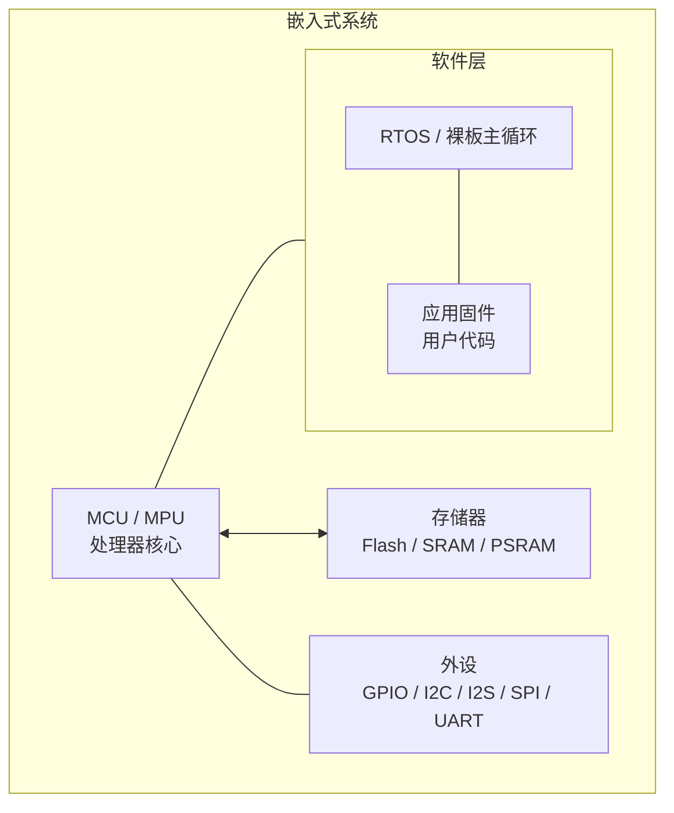
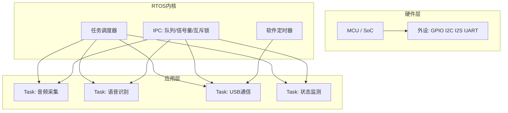
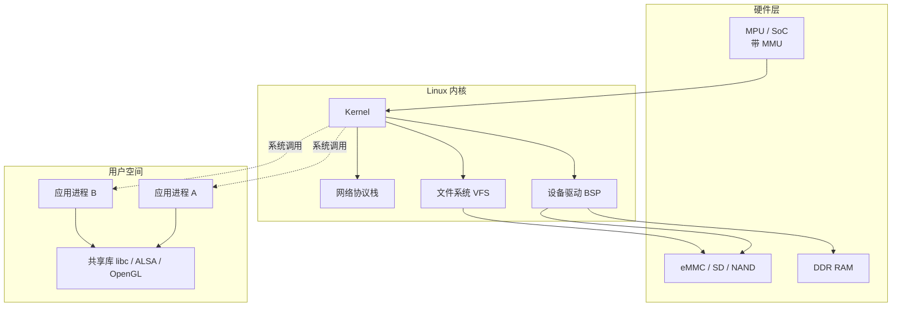
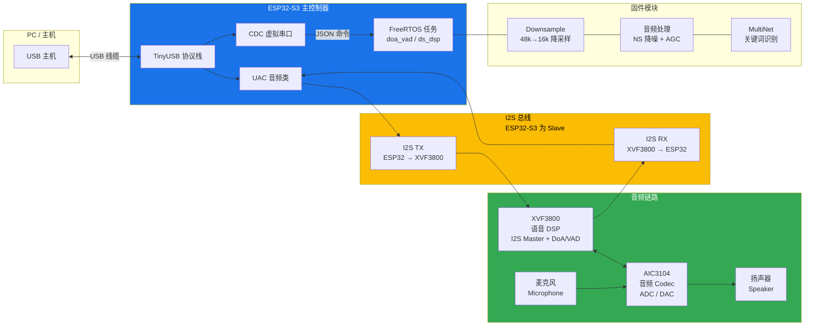
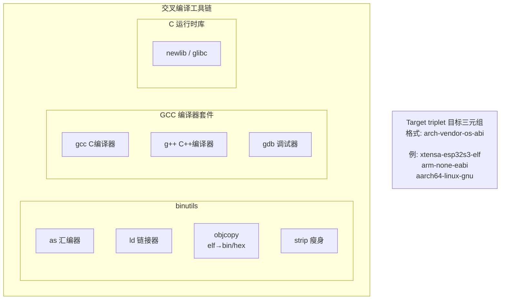
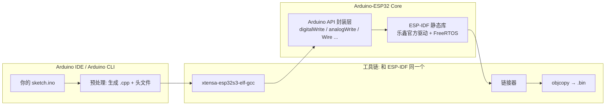
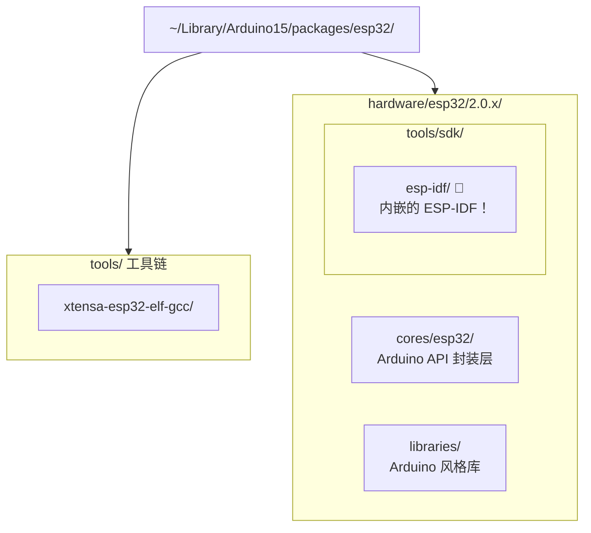

# 第 1 课：嵌入式系统是什么 + 本项目全局地图

## 一、嵌入式系统核心概念

### 什么是嵌入式系统？

嵌入式系统是**为特定功能设计**的专用计算机系统。与你的 PC/手机不同：

| 对比项 | 通用计算机 (PC) | 嵌入式系统 (ESP32-S3) |
|-------|---------------|-------------------|
| 用途 | 通用（办公、游戏、上网） | 专用（音频处理、控制） |
| 操作系统 | Windows/Linux/macOS | FreeRTOS（实时操作系统） |
| 资源 | TB级存储、GB级内存 | MB级 flash、KB级 RAM |
| 功耗 | 几十瓦到几百瓦 | 毫瓦级 |
| 交互 | 键盘鼠标显示器 | 传感器、GPIO、总线 |
| 开发 | 在目标机器上编译调试 | 交叉编译（PC编译→目标运行） |

### 嵌入式系统的典型组成



- **MCU**: 微控制器（Microcontroller Unit），片上集成了 CPU、RAM、Flash、外设
- **交叉编译**: 在 PC（x86）上编译生成 ESP32-S3（Xtensa/RISC-V）的二进制代码
- **固件**: 烧录到 flash 中的程序，设备上电后执行

### 嵌入式开发的"标准流程"


---

## 二、嵌入式开发的三种形态

你的直觉是**完全正确**的。嵌入式开发并非铁板一块，按软件复杂度从小到大，可以分为三个层次：

### 形态一：裸板开发 (Bare-metal) — 无操作系统

**典型场景**：极简控制（LED 闪烁、按键检测、温湿度传感器读取）、成本敏感的消费电子

```
主循环 (Super Loop):
  while(1) {
      read_sensor();
      if(btn_pressed) handle_btn();
      delay(10);
  }
```

| 特征       | 说明                                      |
| -------- | --------------------------------------- |
| **无 OS** | 没有任务调度器，一个 while(1) 大循环 + 中断            |
| **资源占用** | 极小，RAM 可低至几百字节，Flash 几 KB               |
| **实时性**  | 中断是最高的实时响应手段，但主循环阻塞即死                   |
| **典型芯片** | 8 位单片机：51 系列、AVR、PIC；部分低端 ARM Cortex-M0 |
| **开发方式** | 直接操作寄存器或 HAL 库，IDE 如 Keil / IAR         |
| **优点**   | 简单直接、无 OS 学习成本、无调度开销                    |
| **缺点**   | 多任务靠手工拆分，代码规模一大就难以维护；一个 while 循环阻塞整机卡死  |

> **这个项目的对应**: 本项目有 FreeRTOS，不属于裸板。但 xvf_xmos.c/h 中与 XVF3800 的 I2C 通信其实接近这层——裸读写寄存器。

### 形态二：RTOS 开发 — 轻量实时操作系统

**典型场景**：中等复杂度（音频处理、电机控制、联网设备），如本项目的 ESP32-S3



| 特征          | 说明                                                   |
| ----------- | ---------------------------------------------------- |
| **有 RTOS**  | 操作系统内核很小（几 KB 到几十 KB），提供任务调度、同步机制                    |
| **任务切换**    | 基于优先级抢占式调度（Priority-based Preemptive Scheduling）     |
| **IPC 机制**  | 队列（Queue）、信号量（Semaphore）、互斥锁（Mutex）、事件组（Event Group） |
| **典型 RTOS** | FreeRTOS（最广泛）、RT-Thread（国产）、Zephyr、μC/OS             |
| **典型芯片**    | ARM Cortex-M3/M4/M7、ESP32、RISC-V                     |
| **开发方式**    | SDK 框架（ESP-IDF / STM32Cube），C 语言，任务间通信设计             |
| **优点**      | 多任务隔离、实时性强、生态成熟、中等复杂度项目的最佳平衡                         |
| **缺点**      | 需要学习 RTOS 概念、调试多任务竞争比裸板复杂、没有 MMU（进程间互不保护）            |

> **本项目的定位**：ESP32-S3 + FreeRTOS + ESP-IDF 就是这个形态的典型代表。

### 形态三：嵌入式 Linux — 完整操作系统

**典型场景**：高复杂度（路由器/摄像头/车机/工业平板），需要网络协议栈、文件系统、图形界面



| 特征 | 说明 |
|------|------|
| **有 MMU** | 内存管理单元，可运行完整 Linux，进程间有地址空间隔离 |
| **资源需求** | 大：RAM ≥ 32MB，Flash/存储 ≥ 64MB，往往需要 DDR 内存 |
| **典型芯片** | ARM Cortex-A 系列（全志/RK/IMX）、RISC-V、x86 |
| **开发方式** | BSP 移植（板级支持包）→ 内核驱动开发 → 应用开发 |
| **驱动开发** | 编写/移植 Linux 内核驱动（字符设备 / platform 驱动 / DT 设备树） |
| **应用开发** | Linux 用户态进程，标准 POSIX API，多进程多线程 |
| **优点** | 功能最强大、生态最丰富、调试工具成熟（gdb/perf/strace） |
| **缺点** | 资源消耗大、实时性不如 RTOS（PREEMPT_RT 补丁可改善但不完全）、启动慢 |
| **入门门槛** | 需要同时懂硬件和 Linux 内核知识，学习曲线陡峭 |

> **注意**：这三个形态不是一个比另一个"高级"。裸板有裸板的成本优势，RTOS 有实时性优势，嵌入式 Linux 有功能生态优势。**做产品时根据需求选合适的**，而不是无脑上最复杂的。

### 形态全览对比

| 维度 | 裸板 (Bare-metal) | RTOS | 嵌入式 Linux |
|------|:---:|:----:|:----------:|
| **OS 大小** | 0 KB | ~5-100 KB | MB ~ GB 级 |
| **RAM 需求** | ~0.1-4 KB | ~几 KB - 几百 KB | ≥ 32 MB（带 MMU）|
| **任务模型** | 大循环 + 中断 | 抢占式多任务 | 多进程 + 多线程 |
| **进程隔离** | 无 | 无 | 有（MMU）|
| **实时性** | 中断级（μs） | 优先级调度（μs~ms）| 非实时（ms 级，PREEMPT_RT 接近）|
| **调试难度** | 低（逻辑简单） | 中（竞态/死锁） | 高（驱动 crash 难定位）|
| **典型产品** | 遥控器/电子表 | 无人机/音频设备 | 路由器/摄像头/车机 |
| **代表芯片** | 51/AVR/PIC | STM32/ESP32 | i.MX/RK/全志 |

> **为什么本项目选 RTOS（FreeRTOS）而不是裸板或 Linux？**
>
> - ESP32-S3 只有 512KB 内部 SRAM，跑不动完整的嵌入式 Linux（至少需要 32MB+ 外部 DDR）
> - 任务多（I2S 收发、USB UAC、CDC、语音识别），裸板大循环无法优雅处理
> - 实时性要求高（音频流不能卡顿），FreeRTOS 的任务调度 + 固定核心绑定正好满足
> - 用 PSRAM（8MB）解决大数据（音频缓冲区、语音模型）的存储

---

## 三、本项目全局地图：XVF3800 ESP32-S3 固件

这是一个**USB 音频设备固件**，搭载语音识别（关键词唤醒）功能。

### 硬件架构



### 关键芯片

| 芯片 | 角色 | 说明 |
|------|------|------|
| **ESP32-S3** | 主控制器 | Xtensa LX7 双核 240MHz，负责 USB 音频、语音识别、OTA |
| **XVF3800** | 语音 DSP | XMOS 多核处理器，负责 I2S 音频输入输出、声源方位(DoA)、人声检测(VAD) |
| **AIC3104** | 音频 Codec | TI 音频编解码器，数模/模数转换，连接扬声器与麦克风 |

### 软件架构 — 任务（进程）分配

| 任务名 | 核心 | 优先级 | 功能 |
|-------|------|--------|------|
| `UAC MIC` (RX) | Core 0 | 14 | 从 I2S 收音频 → 发给 USB 主机 |
| `UAC SPK` (TX) | Core 0 | 14 | 从 USB 主机收音频 → 发给 I2S |
| `TinyUSB` | Core 1 | 15 | USB 协议栈（枚举、数据传输） |
| `doa_vad` | Core 1 | 5 | 每秒轮询 DoA/语音检测状态 |
| `ds_dsp` | Core 0 | 5 | 音频降噪+AGC+语音识别管道 |

### 软件模块 — 源文件地图

```
main/main.c              ← 入口点，创建任务
main/xvf_i2s.c/h         ← I2S 初始化（Slave 模式、24 DMA 描述符）
main/xvf_i2c.c/h         ← I2C 总线初始化
main/xvf_aic3104.c/h     ← AIC3104 Codec 配置
main/xvf_uac.c/h         ← USB 音频类（UAC 1.0 回调）
main/xvf_downsample.c/h  ← 48k→16k 降采样 + DSP 任务
main/xvf_audio_proc.c/h  ← NS 降噪 + AGC 自动增益控制
main/xvf_multinet.c/h    ← 关键词识别（MultiNet 模型）
main/xvf_xmos.c/h        ← XVF3800 通信（DoA/VAD/控制）
main/xvf_ota.c/h         ← OTA 固件升级
main/usb_descriptors.c   ← USB 描述符（CDC+UAC 复合设备）
main/tusb_config.h       ← TinyUSB 配置
```

---

## 四、嵌入式开发的关键习惯

1. **阅读文档优先**：芯片 datasheet（数据手册）、芯片参考手册、框架 API 文档是第一手资料
2. **日志调试三板斧**：`ESP_LOGE`(错误) → `ESP_LOGW`(警告) → `ESP_LOGI`(信息) → `ESP_LOGD`(调试)
3. **先查芯片资源**：flash 大小、RAM 大小、PSRAM、可用的外设接口、引脚复用
4. **理解任务调度**：FreeRTOS 不是 Linux — 没有 MMU、没有进程隔离、共享全局地址空间
5. **阅读分区表**：知道代码放在哪、数据放在哪、OTA 如何工作

---

## 推荐阅读

- [ESP32-S3 技术参考手册 (Espressif 官方)](https://www.espressif.com/sites/default/files/documentation/esp32-s3_technical_reference_manual_en.pdf)
- [FreeRTOS 官方文档](https://www.freertos.org/Documentation/RTOS_book.html)
- [《嵌入式系统：硬件、软件与设计》—— 一个很好的全局入门书](https://www.amazon.com/Embedded-Systems-Introduction-Yifeng-Zhu/dp/0367260654)（英文）

---

## 答疑

### 一、什么是交叉编译工具链？

**一句话**：在 PC（x86 Linux/Windows）上运行，但生成目标芯片（ARM/Xtensa/RISC-V）机器码的编译工具集合。

#### 工具链的组成



**关键文件**：

| 文件 | 用途 |
|------|------|
| `xtensa-esp32s3-elf-gcc` | C 编译器 |
| `xtensa-esp32s3-elf-g++` | C++ 编译器 |
| `xtensa-esp32s3-elf-ld` | 链接器 |
| `xtensa-esp32s3-elf-gdb` | 调试器 |
| `xtensa-esp32s3-elf-objcopy` | 二进制格式转换（elf → bin/hex）|
| `xtensa-esp32s3-elf-size` | 查看各段大小（text/data/bss）|

#### 目标三元组详解

```
xtensa-esp32s3-elf

    ISA:      Xtensa 架构
    Vendor:   ESP32-S3 变体
    ABI:      ELF 格式（无操作系统）
```

对比常见的：

| 三元组 | 含义 |
|--------|------|
| `arm-none-eabi` | ARM 架构，无厂商，EABI（裸板/RTOS） |
| `arm-linux-gnueabihf` | ARM 架构，Linux 目标，GNU EABI hard-float |
| `aarch64-linux-gnu` | ARM64 架构，Linux 目标 |
| `riscv32-unknown-elf` | RISC-V 32 位，无厂商，ELF |

---

### 二、IDE / 开发环境与工具链的关系

你观察得没错——大多数情况下**工具链由 IDE 或 SDK 自动提供**，但这只是"帮你装好了"，本质没有改变。

#### 不同项目的工具链来源

| 平台 | 工具链 | 谁提供的 |
|------|--------|---------|
| ESP32 + ESP-IDF | `xtensa-esp32s3-elf-gcc` | ESP-IDF 安装器自动下载 |
| STM32 + CubeIDE | `arm-none-eabi-gcc` | STM32CubeIDE 内置 |
| ARM MDK (Keil) | `armcc` (商业编译器) | Keil 安装包 |
| IAR | `iccarm` (商业编译器) | IAR EWARM 安装包 |

**本质规律**：SDK/IDE 仅仅是工具链的"分发者"。无论工具链是 IDE 自带还是你手工装，最终调用的都是同一条命令：

```bash
# ESP-IDF 本质上在帮你执行：
xtensa-esp32s3-elf-gcc -O2 -Iinclude/ src/main.c -o build/main.elf

# 你完全可以手动执行这行命令（如果环境变量配好了）
```

#### 本项目中的工具链

```bash
# 激活 IDF 环境后，工具链就在 PATH 中
source /home/u/.espressif/tools/activate_idf_v6.0.1.sh
which xtensa-esp32s3-elf-gcc
# 输出: ~/.espressif/tools/xtensa-esp32s3-elf-gcc/.../bin/xtensa-esp32s3-elf-gcc

# 你可以直接用它手动编译：
xtensa-esp32s3-elf-gcc --version
# xtensa-esp32s3-elf-gcc (crosstool-NG esp-2022r1) 11.2.0
```

---

### 三、编译优化与"并行计算加速"

你问的核心问题可以拆成两个层面：

#### 编译优化选项（代码质量）—— ✅ 编译器能力

编译器通过不同的 `-O` 级别控制优化程度：

| 选项 | 含义 | 编译速度 | 代码速度 | 代码大小 |
|------|------|:-------:|:-------:|:-------:|
| `-O0` | 无优化（默认调试） | 最快 | 最慢 | 最大 |
| `-O1` | 基本优化 | 快 | 中等 | 中等 |
| `-O2` | 标准优化（项目通常用这个） | 中等 | 快 | 中等 |
| `-O3` | 激进优化，可能增大代码 | 慢 | 更快 | 更大 |
| `-Os` | 优化代码大小 | 中等 | 中等 | 最小 |
| `-Ofast` | 极速优化（可能违反标准） | 慢 | 最快 | 最大 |

**额外优化技术**：

| 技术 | 编译选项 / 工具 | 说明 |
|------|----------------|------|
| **LTO** | `-flto` | 链接时优化，跨文件内联、消除未用代码 |
| **自动向量化** | `-O3` / `-ftree-vectorize` | 将循环自动编译为 SIMD 指令（如果目标 CPU 支持）|
| **PGO** | `-fprofile-generate` + `-fprofile-use` | 基于运行时 profile 引导优化 |
| **size 优化** | `-Os` + `-ffunction-sections -fdata-sections -Wl,--gc-sections` | 链接时去弃未用函数，嵌入式常用 |

```bash
# 本项目的 ESP-IDF 中，通过 sdkconfig 或 CMakeLists.txt 设置优化：
# sdkconfig: CONFIG_COMPILER_OPTIMIZATION_SIZE=y   (-Os)
# sdkconfig: CONFIG_COMPILER_OPTIMIZATION_PERF=y   (-O2)

# CMakeLists.txt 中也可以加：
target_compile_options(xvf3800_esp32s3_fw PRIVATE -O2 -flto)
```

#### 嵌入式编译的并行限制

1. **交叉编译本身的瓶颈**：目标芯片（如 Xtensa）的编译器优化不如 x86 的 GCC 成熟，部分优化 pass 可能不支持
2. **ESP32-S3 的 Xtensa 架构没有 SIMD**：`-O3` 的自动向量化不会产生 SIMD 指令（硬件不支持），只是常规循环优化
3. **内存限制**：激进优化（LTO + -O3）在链接阶段会大量消耗 PC 内存，大项目可能吃掉 4-8GB RAM
4. **Flash 大小**：ESP32-S3 每个 OTA 分区只有 2MB，`-O3` 生成的代码可能塞不下，所以很多 ESP32 项目用 `-Os`

---

### 四、拓展：Arduino 为什么也能为 ESP32 编译？

这是问到了工具链生态的一个重要特点：**Arduino 对 ESP32 的支持，本质上是在 ESP-IDF 之上加了一层"糖衣"**。

#### Arduino 的编译链



**核心事实**：Arduino for ESP32 的编译链条里，**最底层就是 ESP-IDF**。

#### 具体来看

| 层面 | Arduino | ESP-IDF（本项目） |
|------|---------|-----------------|
| **编译器** | 同一个 `xtensa-esp32s3-elf-gcc` | 同一个 |
| **底层库** | 链接了 ESP-IDF 的 `libesp-idf.a` | 直接调用 ESP-IDF 函数 |
| **FreeRTOS** | 在后台自动初始化 | 手动调用 `xTaskCreatePinnedToCore()` |
| **API** | `digitalWrite(pin, HIGH)` 一行控制 GPIO | `gpio_set_level(pin, 1)` —— 本质一样 |
| **启动流程** | 隐藏了，自动调用 `initArduino()` | 显式 `app_main()` 入口 |

**关键证据**：安装 Arduino-ESP32 支持包时，下载的内容列表：



**结论**：Arduino for ESP32 = **ESP-IDF 的"简化前端"**。Arduino 帮你做了三件事：

1. **屏蔽了工具链调用细节**——你不用手动敲交叉编译命令
2. **隐藏了 FreeRTOS 初始化**——你不需要知道任务怎么创建，但底层其实跑着 FreeRTOS
3. **简化了 API**——`digitalWrite(2, HIGH)` 比 `gpio_set_level(GPIO_NUM_2, 1)` 更好记

#### 两个开发路径的对比

```c
// ═══ Arduino 方式 ═══
void setup() {
    pinMode(2, OUTPUT);          // 配置 GPIO2
    Serial.begin(115200);        // 初始化 UART
}
void loop() {
    digitalWrite(2, HIGH);       // GPIO2 = 高电平
    delay(1000);
    digitalWrite(2, LOW);
    delay(1000);
}

// ═══ ESP-IDF 方式（本项目）═══
void app_main(void) {
    gpio_set_direction(GPIO_NUM_2, GPIO_MODE_OUTPUT);  // 配置 GPIO2

    while (1) {
        gpio_set_level(GPIO_NUM_2, 1);   // GPIO2 = 高电平
        vTaskDelay(pdMS_TO_TICKS(1000)); // FreeRTOS 延时
        gpio_set_level(GPIO_NUM_2, 0);
        vTaskDelay(pdMS_TO_TICKS(1000));
    }
}
```

两种方式最终烧进芯片的**机器码几乎一样**。区别只在 Arduino 帮你写好了 `setup/loop` 背后的 FreeRTOS task 创建和 `pinMode/digitalWrite` 背后的 GPIO 寄存器操作。

#### Arduino + ESP-IDF 混合使用

更加能说明"Arduino 依赖 ESP-IDF"的是：**你可以直接在 ESP-IDF 项目里调用 Arduino API**。

```c
// CMakeLists.txt 中添加 Arduino 组件
set(EXTRA_COMPONENT_DIRS $ENV{IDF_PATH}/examples/common_components/arduino)

// main.c — 混用 ESP-IDF 和 Arduino API
#include "Arduino.h"
#include "driver/gpio.h"

void app_main(void) {
    initArduino();                     // 启动 Arduino 后台

    pinMode(2, OUTPUT);                // Arduino API
    gpio_set_level(GPIO_NUM_2, 1);     // ESP-IDF API，混用没问题
    Serial.begin(115200);
    Serial.println("Hello from ESP-IDF + Arduino!");
}
```

这清楚地说明：**ESP-IDF 是底层，Arduino 是上层封装**，不是两套独立的东西。

---

> **所以回答你的问题**：是的，Arduino 内部确实使用了 ESP-IDF。更准确地说，Arduino-ESP32 Core 是建立在 ESP-IDF 之上的一个**API 兼容层**，编译时链接了 ESP-IDF 的库，运行时调用了 ESP-IDF 初始化的 FreeRTOS 和驱动。**同一套 xtensa 交叉编译工具链，被不同的「前端」以不同的方式调用**——这就是嵌入式工具链生态的常见格局。

| 你的问题 | 答案 |
|---------|------|
| 编译优化（代码快/小） | ✅ 编译器能力：`-O0` ~ `-Ofast`、LTO、PGO |
| 并行编译加速（构建快） | ❌ 构建系统能力：`make -j`、`ninja`、`ccache`、`distcc` |
| IDE 是否提供工具链 | 只是"包管理"，本质还是调 gcc |
| 嵌入式有没有特殊限制 | 有：Flash 大小、CPU 架构不支持 SIMD、交叉编译器优化成熟度 |

> **参考**：
> - [GCC Optimization Options 官方文档](https://gcc.gnu.org/onlinedocs/gcc/Optimize-Options.html)
> - [ESP-IDF 编译系统文档 — 优化配置](https://docs.espressif.com/projects/esp-idf/en/latest/esp32s3/api-guides/build-system.html#custom-build-system-steps)
> - [GNU Make -j 选项](https://www.gnu.org/software/make/manual/html_node/Parallel.html)
> - [crosstool-NG — 嵌入式工具链构建工具](https://crosstool-ng.github.io/)（了解工具链如何被"制作"出来的）
