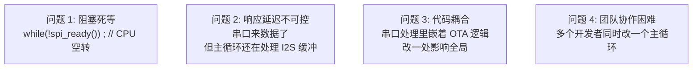
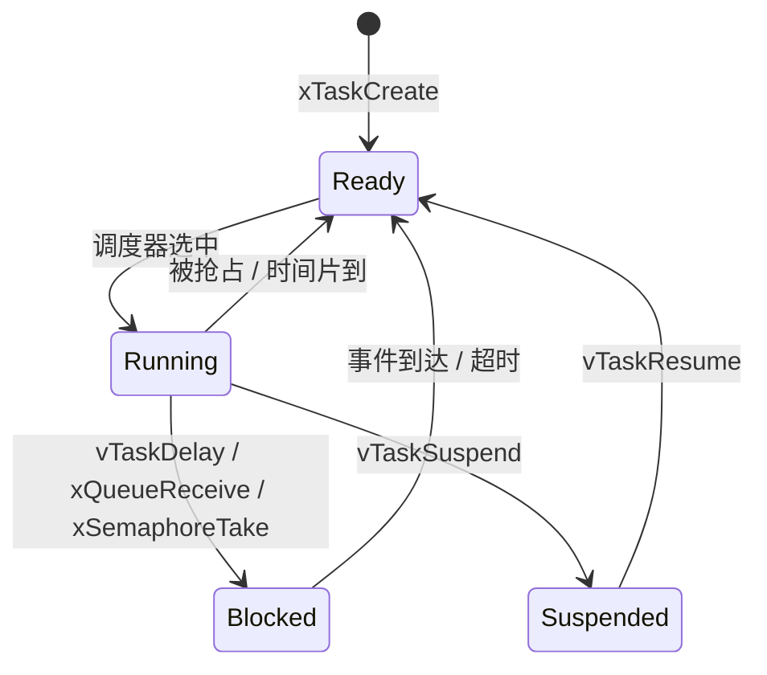
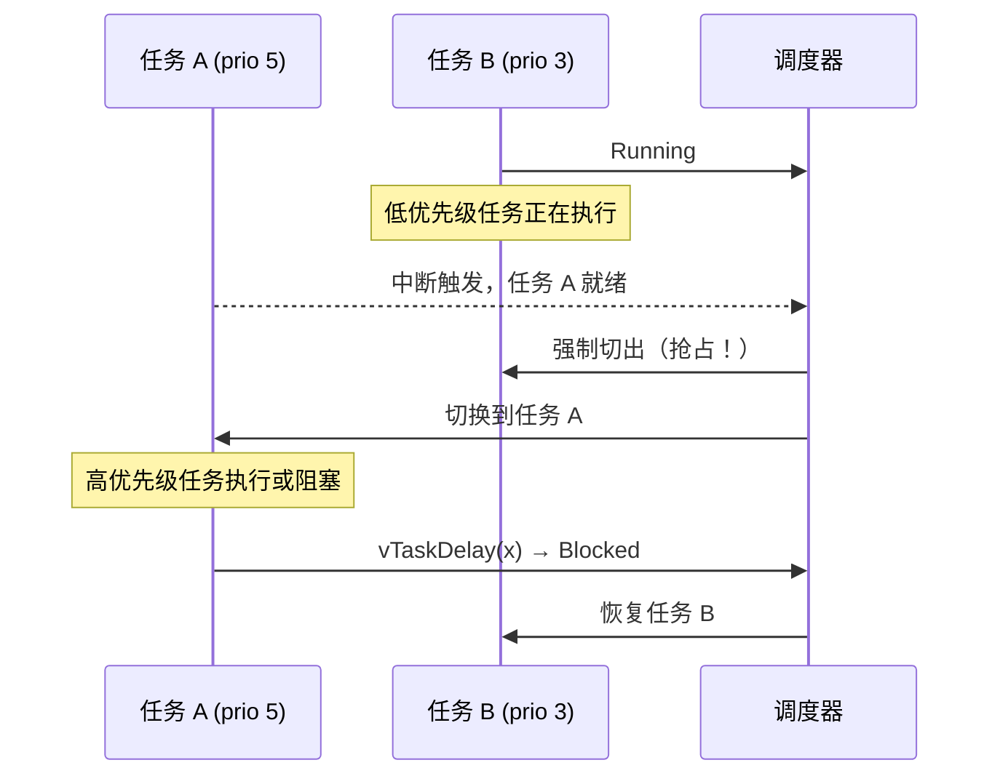
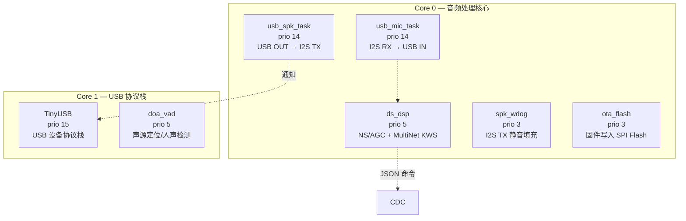
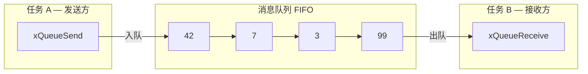

# 第 3 课：FreeRTOS 实时操作系统

> 核心问题：当系统需要同时做多件事，且每件事的响应时间可预测时——怎么做？
> 答案：RTOS。把代码拆成独立任务，由调度器决定谁在哪个核心上跑，什么时机跑。

---

## 一、为什么需要 OS？

裸板开发的本质是一个 `while(1)` 主循环 + 中断服务程序。在小项目里够用，但随着需求变复杂，问题随之而来：



**RTOS 解决的终极问题**：让你"同时做多件事"，且每件事的响应时间**可确定地预测**。

| | 裸板 (Bare-metal) | RTOS |
|------|:---:|:---:|
| **并发方式** | 手动在循环里轮询 | 多任务，由调度器自动切换 |
| **响应延迟** | 取决于循环周期 | **确定性的** — 高优先级就绪立刻抢占 |
| **阻塞操作** | CPU 空转死等 | **任务阻塞时 CPU 自动切走** |
| **代码组织** | 一个大 `while(1)` | 每个任务是一个独立函数 |
| **RAM 占用** | 极小（几 KB） | 中等（几十 KB） |
| **动态调试** | 串口 printf 打天下 | 有任务列表、栈使用统计等辅助手段 |

> **关键理解**：RTOS 不加速代码的执行速度——它**让 CPU 在多个任务间高效分配时间**，使系统整体响应性更好。

---

## 二、任务（Task）—— RTOS 的基本单元

任务是 RTOS 中独立执行的"线程"。每个任务是一个**无限循环函数**，有单独的栈空间。

```c
// 一个任务的基本形态
void my_task(void *pvParameters)
{
    while (1) {
        // ① 等待事件（阻塞，不消耗 CPU）
        wait_for_something();
        // ② 处理事件
        do_work();
    }
}
```

### 2.1 创建任务

本项目所有任务使用 `xTaskCreatePinnedToCore`（ESP-IDF 扩展版，多了核心号参数）：

```c
BaseType_t xTaskCreatePinnedToCore(
    TaskFunction_t pvTaskCode,      // 任务函数指针
    const char *const pcName,       // 任务名（调试用，最多 16 字符）
    configSTACK_DEPTH_TYPE usStackDepth, // 栈大小（单位：字，不是字节！）
    void *pvParameters,             // 传入参数
    UBaseType_t uxPriority,         // 优先级（0~24，数字越大优先级越高）
    TaskHandle_t *pxCreatedTask,    // 返回的任务句柄（可选 NULL）
    BaseType_t xCoreID              // 运行在哪个核心（0/1/tskNO_AFFINITY）
);
```

> **栈大小 (usStackDepth) 的单位是"字"不是"字节"**。ESP32-S3 是 32 位架构，1 字 = 4 字节。设 `4096` 就是 16KB 栈。

**常规版 `xTaskCreate`** 不带核心号参数，让调度器决定跑在哪个核上。本项目全部使用 `PinnedToCore` 版本——因为音频任务有严格的核心亲和性要求。

### 2.2 任务状态机

一个任务的生命有四种状态：



| 状态 | 含义 | CPU 消耗 |
|------|------|:--------:|
| **Ready** | 准备好运行，在排队等 CPU | ❌（排队中） |
| **Running** | 正在占用 CPU（一个核上一刻只能有一个） | ✅ |
| **Blocked** | 在等某个事件（延时/信号量/队列），不消耗 CPU | ❌ |
| **Suspended** | 被显式挂起，永不调度除非主动恢复 | ❌ |

> `vTaskDelay(100 / portTICK_PERIOD_MS)` 的本质：任务进入 Blocked 状态 100ms——**CPU 不空转，去跑其他任务**。这就是 RTOS 比裸板 Super Loop 高效的根本原因。

---

## 三、调度器（Scheduler）—— 谁决定"下一步跑谁"

### 3.1 抢占式优先级调度

FreeRTOS 的默认调度策略（本项目所用的模式）：**高优先级任务就绪时，立刻抢占低优先级任务**。



> **抢占的本质**：不是"协商"——低优先级任务**无权拒绝**。这就是 RTOS 实时性的根基。

### 3.2 同优先级：时间片轮转

相等优先级的任务共享 CPU，每个任务轮流跑一个时间片。

```
时间线: |---A---|---B---|---A---|---B---|---A---|---B---|
         tick0   tick1   tick2   tick3   tick4   tick5   tick6
```

### 3.3 系统节拍（Tick）—— 调度的心跳

FreeRTOS 使用一个硬件定时器（通常为 SysTick）周期性产生中断，每次中断就是一次"重新决策"的机会。

```c
// FreeRTOS 的 Tick ISR（简化示意）
void xPortSysTickHandler(void)
{
    portDISABLE_INTERRUPTS();       // ① 关中断保护
    xTaskIncrementTick();           // ② Tick 计数器 +1
    // ③ 检查是否有任务需要唤醒（vTaskDelay 到期？）
    // ④ 检查是否需要任务切换（更高优就绪？）
    // ⑤ 如需切换，触发 PendSV 异常（在异常退出时自动切换）
    portENABLE_INTERRUPTS();
}
```

**本项目配置**（来自 `sdkconfig.defaults`）：

| 配置项 | 值 | 含义 |
|--------|:---:|------|
| `CONFIG_FREERTOS_HZ` | 1000 | 系统心跳 1ms（Tick ISR 每秒跑 1000 次） |
| `CONFIG_FREERTOS_NUMBER_OF_CORES` | 2 | 双核对称多处理 |
| `CONFIG_FREERTOS_MAX_PRIORITIES` | 25 | 优先级范围 0~24（数字越大越高） |
| `CONFIG_FREERTOS_IDLE_TASK_STACKSIZE` | 1536 | 每个核心空闲任务的栈 |

> 1000 Hz 意味着调度器每秒做 1000 次"要不要换个任务跑"的决策。桌面 Linux 通常只设 250 Hz——嵌入式需要更快的反应。
>
> 这也是为什么 `vTaskDelay(1)` 最少延迟 1ms——它不是在硬件定时器上等 1ms，而是等下一次 Tick ISR 发现"该你了"。

---

## 四、本项目 7 个任务全景

这是 **XVF3800 ESP32-S3 固件** 全部的 FreeRTOS 任务，是任务设计的最佳实战案例：



| 任务名 | 函数 | 栈 | 优先级 | 核心 | 做什么 |
|--------|------|:--:|:-----:|:----:|--------|
| `doa_vad` | `doa_vad_task` | 4096 | 5 | **1** | 轮询 XVF3800 读取声源方向和人声状态，1 Hz |
| `TinyUSB` | `tusb_device_task` | 4096 | **15** | **1** | 运行 TinyUSB 设备协议栈（处理枚举/控制传输） |
| `usb_mic_task` | `usb_mic_task` | 4096 | **14** | **0** | I2S 麦克风数据 → USB IN 端点 |
| `usb_spk_task` | `usb_spk_task` | 4096 | **14** | **0** | USB OUT 端点 → I2S 扬声器 |
| `ds_dsp` | `dsp_consumer_task` | 4096 | **5** | **0** | NS 降噪 + AGC + MultiNet 关键词识别 |
| `spk_wdog` | `spk_watchdog_task` | 2048 | **3** | **0** | 无音频时填充静音，防止 I2S TX DMA 饥饿 |
| `ota_flash` | `ota_flash_task` | **8192** | **3** | **0** | 通过 CDC 接收固件数据，写入 SPI Flash |

### 设计分析

**Core 0（音频核心）的优先级金字塔**：
```
prio 14  usb_mic_task  +  usb_spk_task   ← 相等！音频 I/O 最高
prio  5  ds_dsp                           ← 音频处理，中等
prio  3  spk_wdog  +  ota_flash          ← 后台任务，最低
```

> **为什么 usb_mic_task 和 usb_spk_task 优先级相等？**
> 这来自项目开发中踩过的坑（见 AGENTS.md）：如果其中一个比另一个高，高的一方会大量抢占 CPU，导致另一方的 DMA 长期得不到服务——全双工模式下 TX 或 RX 就会失真。
>
> **相等 = 时间片轮转 = 谁都不饿死谁**。

**Core 1 的独立性**：
- `TinyUSB` 是最高优先级（15）——USB 协议栈需要及时响应 Host 的令牌和请求
- `doa_vad` 只在 Core 1 运行，与 Core 0 的音频处理互不干扰

### 任务创建背后的配置驱动

本项目中，小米（MIC）、扬声器（SPK）、TinyUSB 的优先级和核心亲和性**不写在代码里死**，而是通过 Kconfig 配置驱动：

```c
// 实际调用（来自 usb_device_uac.c）
ret_val = xTaskCreatePinnedToCore(usb_mic_task, "usb_mic_task", 4096, NULL,
    CONFIG_UAC_MIC_TASK_PRIORITY, &s_uac_device->mic_task_handle,
    CONFIG_UAC_MIC_TASK_CORE == -1 ? tskNO_AFFINITY : CONFIG_UAC_MIC_TASK_CORE);
```

对应的 `sdkconfig.defaults`（或通过 `idf.py menuconfig` 设置）：
```
CONFIG_UAC_TINYUSB_TASK_PRIORITY=15
CONFIG_UAC_TINYUSB_TASK_CORE=1
CONFIG_UAC_MIC_TASK_PRIORITY=14
CONFIG_UAC_MIC_TASK_CORE=0
CONFIG_UAC_SPK_TASK_PRIORITY=14
CONFIG_UAC_SPK_TASK_CORE=0
```

> 这是良好的工程实践：**运行时策略（优先级、核心分配）与业务逻辑分离**。调优优先级时不用改代码，只需改配置。

---

## 五、队列（Queue）—— 任务间发送数据

任务是隔离的——各跑各的循环，有各自的栈。它们怎么互相传递数据？**队列**。

### 5.1 基本用法

```c
// 创建队列：能存 10 个 uint32_t
QueueHandle_t queue = xQueueCreate(10, sizeof(uint32_t));

// 发送方（任务 A）
uint32_t data = 42;
xQueueSend(queue, &data, portMAX_DELAY);   // 一直等到有空位

// 接收方（任务 B）
uint32_t received;
xQueueReceive(queue, &received, portMAX_DELAY);  // 一直等到有数据
// received == 42
```



### 5.2 阻塞与超时

`xQueueReceive` 的第三个参数 `xTicksToWait` 是最重要的设计：

| 超时值 | 行为 |
|--------|------|
| `0` | 非阻塞：有数据就取，没数据立刻返回 |
| `pdMS_TO_TICKS(10)` | 等 10 个 tick（10ms），超时仍没数据就返回 `errQUEUE_EMPTY` |
| `portMAX_DELAY` | 永久阻塞，直到有数据 |

> 这不是 `while(queue_empty()) ;` 那种忙等——**任务在 Blocked 状态，CPU 被切走做其他事**。阻塞期间 0% CPU 浪费。

### 5.3 本项目队列实例：音频帧传递

本项目通过队列将 USB 麦克风的音频帧传递给 DSP 处理任务：

```c
// 创建队列（xvf_downsample.c:146）
s_frame_queue = xQueueCreate(4, sizeof(ds_work_item_t));
// 最多缓存 4 帧（每帧 160 样本/320 字节，16 bit @ 16kHz）
// 队列深度 = 4 意味着最多缓冲 40ms 音频

// USB MIC 回调（ISR 上下文）：非阻塞发送
// 收到新音频帧 → 入队
if (xQueueSend(s_frame_queue, &work_item, 0) != pdTRUE) {
    // 队列满了 → 丢掉最老帧（音频流不能阻塞中断）
}

// ds_dsp 任务：阻塞接收
// 等着，没帧就挂起
xQueueReceive(s_frame_queue, &work_item, portMAX_DELAY);
```

> **为什么队列深度是 4？**
> 因为 DSP 处理一帧的时间必须小于 4 帧的缓冲区持续时间（40ms）。如果处理时间超过 40ms → 队列满了丢帧 → 丢帧不会导致系统崩溃，只是语音识别短暂卡顿——这是**音频系统的典型权衡**：允许偶尔丢帧，但不能让 CPU 卡死。

---

## 六、StreamBuffer — 变长数据传递

当传递的数据不是固定大小（而是变长的字节流），用队列需要每次都分配最大长度的项——浪费。**StreamBuffer** 是更好的选择。

```c
// 本项目在 OTA 中的使用（xvf_ota.c:183）
// 创建一个 16KB 的流缓冲
s_ota_stream = xStreamBufferCreate(16 * 1024, 1);
// 第二个参数 1 = 触发级别（trigger level），
// 即接收方至少等 1 字节才被唤醒

// CDC 数据到达回调（ISR上下文）：写入流缓冲
xStreamBufferSend(s_ota_stream, data, len, 0);  // timeout=0，不阻塞中断

// ota_flash 任务：等待并读取
size_t received = xStreamBufferReceive(s_ota_stream, buf, sizeof(buf),
                                       pdMS_TO_TICKS(2000));
```

| 场景 | 用 Queue | 用 StreamBuffer |
|------|:--------:|:---------------:|
| 固定长度的结构体 | ✅ 首选 | ❌ |
| 变长字节流（串口、CDC、音频裸数据） | ❌ 频繁分配 | ✅ 完美 |
| 多个同类型数据 | ✅ | ❌ 只支持 1 对 1 |

---

## 七、线程同步（IPC）方式对比

本项目实际使用的 IPC 方式涵盖了三种最常见的模式：

| IPC 方式 | 性能 | 特性 | 本项目用法 |
|---------|:----:|------|-----------|
| **Task Notification** | ⭐⭐⭐ | 最快的 1-to-1 通知，无需创建对象 | USB ISR → 唤醒 usb_spk_task / usb_mic_task |
| **Queue** | ⭐⭐ | 固定大小数据，多对一/一对多 | USB MIC → ds_dsp（音频帧传递） |
| **StreamBuffer** | ⭐⭐ | 变长字节流，一对一的流水线 | CDC ISR → ota_flash（OTA 固件流） |
| Semaphore / Mutex | ⭐⭐ | 信号/互斥 | 本项目未使用（被 Task Notification 和 spinlock 替代） |
| EventGroup | ⭐ | 多条件等待 | 本项目未使用 |

### 为什么本项目不用信号量？

很多 RTOS 教程花大篇幅讲信号量，但本项目实际**一个都没用**。它用了更高效的替代方案：

**① Task Notification 代替二进制信号量**：

```c
// ISR 端：USB 音频数据到达
bool tud_audio_rx_done_isr(...)
{
    // ... 读取 USB 数据到缓冲区 ...
    xTaskNotifyGive(s_uac_device->spk_task_handle);  // 发通知
    return true;
}

// 任务端：等通知
void usb_spk_task(void *pvParam)
{
    while (1) {
        ulTaskNotifyTake(pdTRUE, portMAX_DELAY);  // 阻塞等通知
        // 通知来了 → 处理音频数据
    }
}
```

> Task Notification 比二进制信号量快约 **30%**，因为它使用任务自带的 TCB 字段，**不需要创建独立的内核对象**。每个任务天生有一个"通知状态"，直接利用即可。

**② spinlock 代替互斥锁**：

对于仅保护少量代码（如一个变量赋值）的临界区，`taskENTER_CRITICAL()`（关中断）比 Mutex 更轻量：

```c
// ds_dsp 和 usb_mic 共享一个 48k 输出 FIFO
portMUX_TYPE s_uac_out_mux = portMUX_INITIALIZER_UNLOCKED;

// ds_dsp 写入采样
taskENTER_CRITICAL(&s_uac_out_mux);
fifo_write(&s_48k_out, sample);
taskEXIT_CRITICAL(&s_uac_out_mux);
```

> **Mutex vs spinlock 的选择**：Mutex 是"等不到就阻塞"（适合长时间等待），spinlock 是"等不到就原地循环"（适合极短操作）。本项目临界区只有一行赋值，spinlock 更高效。

---

## 八、`vTaskDelay` vs `vTaskDelayUntil`

延迟是每个任务都会用到的功能。FreeRTOS 提供了两种方式：

### 相对延迟 `vTaskDelay`

**从当前时刻开始等 N 个 tick**。缺点是：如果任务执行时间有波动，周期会偏移。

```c
// 本项目中使用 vTaskDelay 的 6 个模式：
vTaskDelay(pdMS_TO_TICKS(1000));    // ① DoA/VAD 每秒轮询一次
vTaskDelay(pdMS_TO_TICKS(1));       // ② I2S 非阻塞轮询循环中让出 CPU
vTaskDelay(pdMS_TO_TICKS(5));       // ③ 扬声器静音填充每 5ms 一次
vTaskDelay(pdMS_TO_TICKS(300));     // ④ OTA 重启前留出串口输出的时间
vTaskDelay(pdMS_TO_TICKS(10));      // ⑤ I2C 通信失败后重试等待
vTaskDelay(pdMS_TO_TICKS(2000));    // ⑥ 启动后等待 2s 再读取 DoA
```

### 绝对延迟 `vTaskDelayUntil`

**指定一个绝对唤醒时刻**。任务运行时间波动不会影响周期稳定性——只要任务执行时间不超过周期本身。

```c
TickType_t xLastWakeTime = xTaskGetTickCount();

while (1) {
    // ... 每次执行这里的时间可能不同 ...
    do_mic_read();

    // 等"下一个 20ms 边界"，而不是"等 20ms"
    vTaskDelayUntil(&xLastWakeTime, pdMS_TO_TICKS(20));
}
```

### 区别图解

```
相对延迟 vTaskDelay(20):
    等待 等待 等待 等待
A---|----|----|----|----|----|----|----|----
  ^t0  10ms 20ms                   ^t0+δ+20ms

    周期不是均匀的——因为任务 A 的执行时间不同

绝对延迟 vTaskDelayUntil(&last, 20):
    固定 20ms
A---|---|---|---|---|---|---|---|---
  ^t0      ^t0+20  ^t0+40  ^t0+60

    始终等"下一个 20ms 边界"
```

> 本项目中使用 `vTaskDelayUntil` 来**保证麦克风读取的精确周期**——音频采样需要稳定的定时节拍。

---

## 九、双核调度

ESP32-S3 有两个核心。FreeRTOS 的对称多处理（SMP）模式下，两个核心共享同一个就绪任务列表：

```c
// 项目中的核心分配策略
Core 0: 所有音频相关任务
  ├── usb_mic_task (prio 14)     ← 音频输入
  ├── usb_spk_task (prio 14)     ← 音频输出
  ├── ds_dsp       (prio 5)      ← 音频处理
  ├── spk_wdog     (prio 3)      ← 音频保活
  └── ota_flash    (prio 3)      ← 后台固件写入

Core 1: USB 协议栈 + 非音频任务
  ├── TinyUSB      (prio 15)     ← USB 协议栈（最高优先级）
  └── doa_vad      (prio 5)      ← 声源定位轮询
```

```mermaid
gantt
    title 双核典型运行时间线
    dateFormat  YYYY-MM-DD
    axisFormat  %L
    section Core 0
    usb_mic_task    :a1, 0, 5ms
    usb_spk_task    :a2, 5ms, 5ms
    ds_dsp          :a3, 10ms, 10ms
    spk_wdog        :a4, 20ms, 2ms

    section Core 1
    TinyUSB         :b1, 0, 2ms
    doa_vad         :b2, 2ms, 1ms
    TinyUSB         :b3, 3ms, 2ms
    doa_vad         :b4, 5ms, 1ms
```

> **设计原则**：将实时性要求高的音频 I/O 放在同一个核心上（Core 0），利用同一核心的任务优先级抢占保证延迟。USB 协议栈放在另一个核心，不干扰音频路径。两个核心间极少共享数据，避免了复杂的跨核同步。

---

## 十、栈大小与调试

### 10.1 栈溢出的后果

任务栈溢出是 RTOS 中最隐蔽的灾难——不会编译报错，运行时也不会立即崩溃。它悄悄覆盖相邻内存，在某次函数调用时突然触发非法指令 → 看门狗复位。

```c
// 任务栈在内存中的布局
┌──────────────────────┤ 任务栈 ├──────────────────────┐
│  局部变量 │  函数调用栈 │  ...  │  空闲区域  │  栈哨兵  │
└──────────────────────────────────────────────────────┘
                                    ↑ 触到哨兵 → FreeRTOS 报告
```

### 10.2 FreeRTOS 栈溢出检查

```c
// sdkconfig 相关配置
CONFIG_FREERTOS_CHECK_STACKOVERFLOW_CANARY=y    // 栈末尾写入已知值
CONFIG_FREERTOS_WATCHPOINT_END_OF_STACK=y       // 硬件断点监控栈末尾
```

两种机制：
- **栈哨兵（Canary）**：在栈末尾写入一个已知值，每次任务切换时检查是否被覆盖
- **硬件断点（Watchpoint）**：使用 ESP32-S3 的硬件断点监控栈边界，触碰即触发异常——更精确

### 10.3 查看各任务的实际栈使用

ESP-IDF 提供了在运行时查询任务栈使用情况的 API：

```c
// 在代码中随时查询
UBaseType_t high_water_mark = uxTaskGetStackHighWaterMark(task_handle);
// 返回"该任务历史上还剩的最小可用栈空间"（单位：字）

// 在串口控制台调试（本项目的 CDC 命令中注册了此功能）
UBaseType_t stack_free = uxTaskGetStackHighWaterMark2(NULL);
// NULL = 查询当前正在运行的任务自身
```

> **`uxTaskGetStackHighWaterMark()` 是调试栈大小最常用的函数**。如果某任务 high water mark 接近 0，说明它的栈应该加大。本项目 7 个任务中有 6 个栈为 4096，唯一特殊的 `ota_flash` 用了 8192——因为它在栈上分配了页大小的临时缓冲区用于 Flash 写入。

### 10.4 ESP-IDF 增强：UXTASK_GET_STACK_INFO

ESP-IDF 在 FreeRTOS 之上补充了更详细的栈查询：

```c
// 获取更详细的栈信息
TaskSnapshot_t snapshot;
vTaskGetSnapshot(task_handle, &snapshot);
// snapshot 中包含: pxTopOfStack, pxEndOfStack, pxHighWaterMark
```

> 在串口终端中输入 `info tasks`（或 ESP-IDF 的类似命令）可以在运行时打印所有任务的信息，包括名称、优先级、状态、核心、栈使用峰值。

---

## 十一、任务优先级设计原则

### 通用原则

| 原则 | 说明 | 反模式 |
|------|------|--------|
| **实时性越强，优先级越高** | I2S 音频 DMA 链→高；日志写 SPIFFS→低 | 全设成一样高 = 等于没设 |
| **阻塞多的给高优先级** | 它大部分时间在等，不占用 CPU | 计算密集型给最高 = 其他任务挨饿 |
| **ISR 只做最少的活** | ISR 里只放 `xQueueSendFromISR` / `xTaskNotifyGive` | ISR 里 printf / malloc = 系统崩溃 |
| **相等优先级 = 时间片轮转** | 互相协作，谁都不饿死谁 | 以为不相等才公平 |

### 常见误区

> **误区 1：优先级越高越好**
> 错。优先级越高，剥夺其他任务 CPU 的能力越强。给所有任务都是最高优先级 = 纯轮转，实时性反而没有保证。
>
> **误区 2：任务数越少越好**
> 错。合理拆分为多个独立任务反而更清晰、更容易调试。崩溃的一个任务不会影响其他任务。
>
> **误区 3：不在两个核上放相同优先级**
> 错。FreeRTOS SMP 能正确处理——双核各自挑最高优先级的就绪任务运行。

### 本项目验证的设计规律

从本项目的 7 个任务中可以总结出一个**可复用的优先级模板**：

| 层级 | 优先级 | 典型任务 | 数量范围 |
|------|:------:|---------|:-------:|
| 高（系统关键） | 14~15 | 音频 I/O、USB 栈 | 2~3 |
| 中（数据处理） | 4~6 | DSP、按键、通信协议 | 1~3 |
| 低（后台任务） | 1~3 | 日志、OTA、看门狗 | 1~3 |

---

## 十二、FreeRTOS 调试与日志

ESP-IDF 对 FreeRTOS 做了一些重要的扩展：

| 功能 | API / 配置 | 用途 |
|------|-----------|------|
| 运行时统计 | `vTaskList()` / `vTaskGetRunTimeStats()` | 打印各任务 CPU 占用率 |
| 栈使用 | `uxTaskGetStackHighWaterMark()` | 检查栈余量 |
| 任务快照 | `vTaskGetSnapshot()` | 获取任务完整状态 |
| 内核可视化 | `CONFIG_FREERTOS_USE_TRACE_FACILITY=y` | 使能上述统计功能 |
| OpenOCD 感知 | `CONFIG_FREERTOS_DEBUG_OCDAWARE=y` | 调试器知道当前是哪个任务在跑 |
| 栈溢出检测 | `CONFIG_FREERTOS_CHECK_STACKOVERFLOW_CANARY=y` | 自动检测栈溢出 |
| 任务函数包装 | `CONFIG_FREERTOS_TASK_FUNCTION_WRAPPER=y` | 任务意外返回时捕获并报错 |

> 上述所有功能都在本项目的 `sdkconfig` 中启用。

---

## 课后思考题

1. 如果你这个项目只有一个核心（Core 1 不存在），TinyUSB 任务（prio 15）和 usb_spk_task（prio 14）在同一个核上——usb_spk_task 会饿死吗？
2. 什么样的任务适合用 `vTaskDelayUntil` 而不是 `vTaskDelay`？
3. 如果 `CONFIG_FREERTOS_HZ` 改为 100（10ms tick），对系统中哪个任务影响最大？
4. 为什么可以用 Task Notification 代替 Binary Semaphore？性能优势来自哪里？
5. 本项目 7 个任务中，为什么 `ota_flash` 的栈（8192）是其他任务的两倍？
