# 第 3 课：FreeRTOS 实时操作系统

> 核心问题：当系统需要同时做多件事，且每件事的响应时间可预测时——怎么做？
> 答案：RTOS。把代码拆成独立任务，由调度器决定谁在哪个核心上跑，什么时机跑。

---

## 一、为什么需要 OS？

裸板开发的本质是一个 `while(1)` 主循环 + 中断服务程序。在小项目里够用，但随着需求变复杂，问题随之而来：

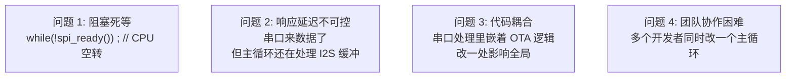

**RTOS 解决的终极问题**：让你"同时做多件事"，且每件事的响应时间**可确定地预测**。

| | 裸板 (Bare-metal) | RTOS |
|------|:---:|:---:|
| **并发方式** | 手动在循环里轮询 | 多任务，由调度器自动切换 |
| **响应延迟** | 取决于循环周期 | **确定性的** — 高优先级就绪立刻抢占 |
| **阻塞操作** | CPU 空转死等 | **任务阻塞时 CPU 自动切走** |
| **代码组织** | 一个大 `while(1)` | 每个任务是一个独立函数 |
| **RAM 占用** | 极小（几 KB） | 中等（几十 KB） |
| **动态调试** | 串口 printf 打天下 | 有任务列表、栈使用统计等辅助手段 |

> **关键理解**：RTOS 不加速代码的执行速度——它**让 CPU 在多个任务间高效分配时间**，使系统整体响应性更好。

---

## 二、任务（Task）—— RTOS 的基本单元

任务是 RTOS 中独立执行的"线程"。每个任务是一个**无限循环函数**，有单独的栈空间。

```c
// 一个任务的基本形态
void my_task(void *pvParameters)
{
    while (1) {
        // ① 等待事件（阻塞，不消耗 CPU）
        wait_for_something();
        // ② 处理事件
        do_work();
    }
}
```

### 2.1 创建任务

本项目所有任务使用 `xTaskCreatePinnedToCore`（ESP-IDF 扩展版，多了核心号参数）：

```c
BaseType_t xTaskCreatePinnedToCore(
    TaskFunction_t pvTaskCode,      // 任务函数指针
    const char *const pcName,       // 任务名（调试用，最多 16 字符）
    configSTACK_DEPTH_TYPE usStackDepth, // 栈大小（单位：字，不是字节！）
    void *pvParameters,             // 传入参数
    UBaseType_t uxPriority,         // 优先级（0~24，数字越大优先级越高）
    TaskHandle_t *pxCreatedTask,    // 返回的任务句柄（可选 NULL）
    BaseType_t xCoreID              // 运行在哪个核心（0/1/tskNO_AFFINITY）
);
```

> **栈大小 (usStackDepth) 的单位是"字"不是"字节"**。ESP32-S3 是 32 位架构，1 字 = 4 字节。设 `4096` 就是 16KB 栈。

**常规版 `xTaskCreate`** 不带核心号参数，让调度器决定跑在哪个核上。本项目全部使用 `PinnedToCore` 版本——因为音频任务有严格的核心亲和性要求。

### 2.2 任务状态机

一个任务的生命有四种状态：

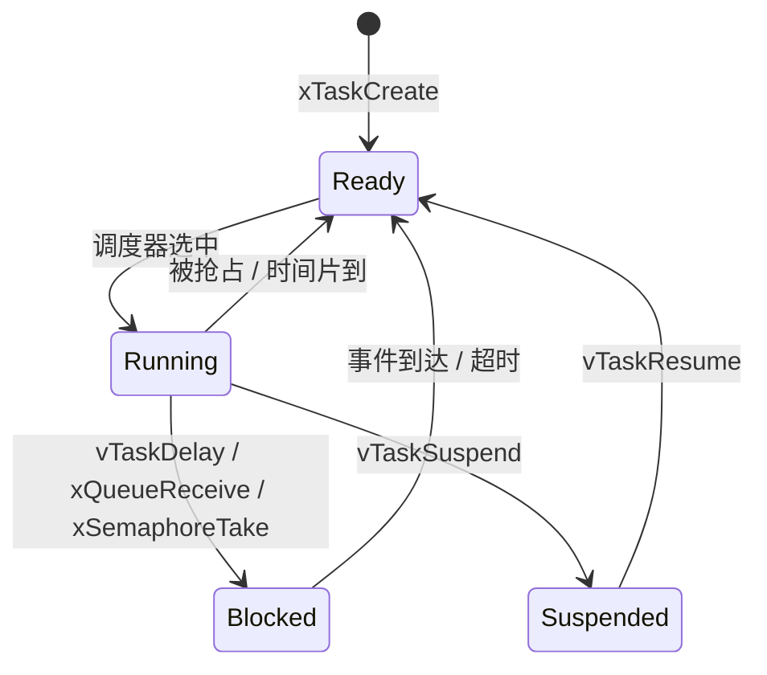

| 状态 | 含义 | CPU 消耗 |
|------|------|:--------:|
| **Ready** | 准备好运行，在排队等 CPU | ❌（排队中） |
| **Running** | 正在占用 CPU（一个核上一刻只能有一个） | ✅ |
| **Blocked** | 在等某个事件（延时/信号量/队列），不消耗 CPU | ❌ |
| **Suspended** | 被显式挂起，永不调度除非主动恢复 | ❌ |

> `vTaskDelay(100 / portTICK_PERIOD_MS)` 的本质：任务进入 Blocked 状态 100ms——**CPU 不空转，去跑其他任务**。这就是 RTOS 比裸板 Super Loop 高效的根本原因。

---

## 三、调度器（Scheduler）—— 谁决定"下一步跑谁"

### 3.1 抢占式优先级调度

FreeRTOS 的默认调度策略（本项目所用的模式）：**高优先级任务就绪时，立刻抢占低优先级任务**。

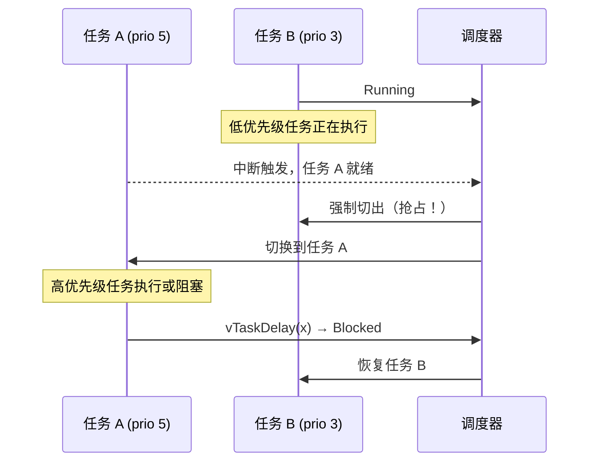

> **抢占的本质**：不是"协商"——低优先级任务**无权拒绝**。这就是 RTOS 实时性的根基。

### 3.2 同优先级：时间片轮转

相等优先级的任务共享 CPU，每个任务轮流跑一个时间片。

```
时间线: |---A---|---B---|---A---|---B---|---A---|---B---|
         tick0   tick1   tick2   tick3   tick4   tick5   tick6
```

### 3.3 系统节拍（Tick）—— 调度的心跳

FreeRTOS 使用一个硬件定时器（通常为 SysTick）周期性产生中断，每次中断就是一次"重新决策"的机会。

```c
// FreeRTOS 的 Tick ISR（简化示意）
void xPortSysTickHandler(void)
{
    portDISABLE_INTERRUPTS();       // ① 关中断保护
    xTaskIncrementTick();           // ② Tick 计数器 +1
    // ③ 检查是否有任务需要唤醒（vTaskDelay 到期？）
    // ④ 检查是否需要任务切换（更高优就绪？）
    // ⑤ 如需切换，触发 PendSV 异常（在异常退出时自动切换）
    portENABLE_INTERRUPTS();
}
```

**本项目配置**（来自 `sdkconfig.defaults`）：

| 配置项 | 值 | 含义 |
|--------|:---:|------|
| `CONFIG_FREERTOS_HZ` | 1000 | 系统心跳 1ms（Tick ISR 每秒跑 1000 次） |
| `CONFIG_FREERTOS_NUMBER_OF_CORES` | 2 | 双核对称多处理 |
| `CONFIG_FREERTOS_MAX_PRIORITIES` | 25 | 优先级范围 0~24（数字越大越高） |
| `CONFIG_FREERTOS_IDLE_TASK_STACKSIZE` | 1536 | 每个核心空闲任务的栈 |

> 1000 Hz 意味着调度器每秒做 1000 次"要不要换个任务跑"的决策。桌面 Linux 通常只设 250 Hz——嵌入式需要更快的反应。
>
> 这也是为什么 `vTaskDelay(1)` 最少延迟 1ms——它不是在硬件定时器上等 1ms，而是等下一次 Tick ISR 发现"该你了"。

---

## 四、本项目 7 个任务全景

这是 **XVF3800 ESP32-S3 固件** 全部的 FreeRTOS 任务，是任务设计的最佳实战案例：

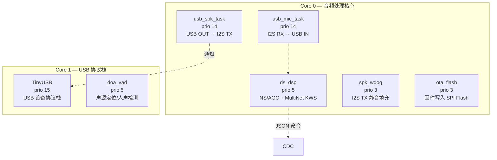

| 任务名            | 函数                  |    栈     |  优先级   |  核心   | 做什么                          |
| -------------- | ------------------- | :------: | :----: | :---: | ---------------------------- |
| `doa_vad`      | `doa_vad_task`      |   4096   |   5    | **1** | 轮询 XVF3800 读取声源方向和人声状态，1 Hz  |
| `TinyUSB`      | `tusb_device_task`  |   4096   | **15** | **1** | 运行 TinyUSB 设备协议栈（处理枚举/控制传输）  |
| `usb_mic_task` | `usb_mic_task`      |   4096   | **14** | **0** | I2S 麦克风数据 → USB IN 端点        |
| `usb_spk_task` | `usb_spk_task`      |   4096   | **14** | **0** | USB OUT 端点 → I2S 扬声器         |
| `ds_dsp`       | `dsp_consumer_task` |   4096   | **5**  | **0** | NS 降噪 + AGC + MultiNet 关键词识别 |
| `spk_wdog`     | `spk_watchdog_task` |   2048   | **3**  | **0** | 无音频时填充静音，防止 I2S TX DMA 饥饿    |
| `ota_flash`    | `ota_flash_task`    | **8192** | **3**  | **0** | 通过 CDC 接收固件数据，写入 SPI Flash   |

### 设计分析

**Core 0（音频核心）的优先级金字塔**：
```
prio 14  usb_mic_task  +  usb_spk_task   ← 相等！音频 I/O 最高
prio  5  ds_dsp                           ← 音频处理，中等
prio  3  spk_wdog  +  ota_flash          ← 后台任务，最低
```

> **为什么 usb_mic_task 和 usb_spk_task 优先级相等？**
> 这来自项目开发中踩过的坑（见 AGENTS.md）：如果其中一个比另一个高，高的一方会大量抢占 CPU，导致另一方的 DMA 长期得不到服务——全双工模式下 TX 或 RX 就会失真。
>
> **相等 = 时间片轮转 = 谁都不饿死谁**。

**Core 1 的独立性**：
- `TinyUSB` 是最高优先级（15）——USB 协议栈需要及时响应 Host 的令牌和请求
- `doa_vad` 只在 Core 1 运行，与 Core 0 的音频处理互不干扰

### 任务创建背后的配置驱动

本项目中，麦克风（MIC）、扬声器（SPK）、TinyUSB 的优先级和核心亲和性**不写在代码里死**，而是通过 Kconfig 配置驱动：

```c
// 实际调用（来自 usb_device_uac.c）
ret_val = xTaskCreatePinnedToCore(usb_mic_task, "usb_mic_task", 4096, NULL,
    CONFIG_UAC_MIC_TASK_PRIORITY, &s_uac_device->mic_task_handle,
    CONFIG_UAC_MIC_TASK_CORE == -1 ? tskNO_AFFINITY : CONFIG_UAC_MIC_TASK_CORE);
```

对应的 `sdkconfig.defaults`（或通过 `idf.py menuconfig` 设置）：
```
CONFIG_UAC_TINYUSB_TASK_PRIORITY=15
CONFIG_UAC_TINYUSB_TASK_CORE=1
CONFIG_UAC_MIC_TASK_PRIORITY=14
CONFIG_UAC_MIC_TASK_CORE=0
CONFIG_UAC_SPK_TASK_PRIORITY=14
CONFIG_UAC_SPK_TASK_CORE=0
```

> 这是良好的工程实践：**运行时策略（优先级、核心分配）与业务逻辑分离**。调优优先级时不用改代码，只需改配置。

---

## 五、队列（Queue）—— 任务间发送数据

任务是隔离的——各跑各的循环，有各自的栈。它们怎么互相传递数据？**队列**。

### 5.1 基本用法

```c
// 创建队列：能存 10 个 uint32_t
QueueHandle_t queue = xQueueCreate(10, sizeof(uint32_t));

// 发送方（任务 A）
uint32_t data = 42;
xQueueSend(queue, &data, portMAX_DELAY);   // 一直等到有空位

// 接收方（任务 B）
uint32_t received;
xQueueReceive(queue, &received, portMAX_DELAY);  // 一直等到有数据
// received == 42
```

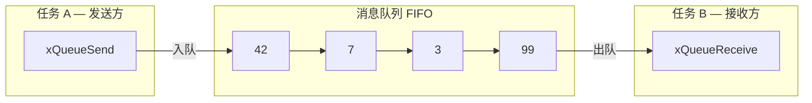

### 5.2 阻塞与超时

`xQueueReceive` 的第三个参数 `xTicksToWait` 是最重要的设计：

| 超时值 | 行为 |
|--------|------|
| `0` | 非阻塞：有数据就取，没数据立刻返回 |
| `pdMS_TO_TICKS(10)` | 等 10 个 tick（10ms），超时仍没数据就返回 `errQUEUE_EMPTY` |
| `portMAX_DELAY` | 永久阻塞，直到有数据 |

> 这不是 `while(queue_empty()) ;` 那种忙等——**任务在 Blocked 状态，CPU 被切走做其他事**。阻塞期间 0% CPU 浪费。

### 5.3 本项目队列实例：音频帧传递

本项目通过队列将 USB 麦克风的音频帧传递给 DSP 处理任务：

```c
// 创建队列（xvf_downsample.c:146）
s_frame_queue = xQueueCreate(4, sizeof(ds_work_item_t));
// 最多缓存 4 帧（每帧 160 样本/320 字节，16 bit @ 16kHz）
// 队列深度 = 4 意味着最多缓冲 40ms 音频

// USB MIC 回调（ISR 上下文）：非阻塞发送
// 收到新音频帧 → 入队
if (xQueueSend(s_frame_queue, &work_item, 0) != pdTRUE) {
    // 队列满了 → 丢掉最老帧（音频流不能阻塞中断）
}

// ds_dsp 任务：阻塞接收
// 等着，没帧就挂起
xQueueReceive(s_frame_queue, &work_item, portMAX_DELAY);
```

> **为什么队列深度是 4？**
> 因为 DSP 处理一帧的时间必须小于 4 帧的缓冲区持续时间（40ms）。如果处理时间超过 40ms → 队列满了丢帧 → 丢帧不会导致系统崩溃，只是语音识别短暂卡顿——这是**音频系统的典型权衡**：允许偶尔丢帧，但不能让 CPU 卡死。

---

## 六、StreamBuffer — 变长数据传递

当传递的数据不是固定大小（而是变长的字节流），用队列需要每次都分配最大长度的项——浪费。**StreamBuffer** 是更好的选择。

```c
// 本项目在 OTA 中的使用（xvf_ota.c:183）
// 创建一个 16KB 的流缓冲
s_ota_stream = xStreamBufferCreate(16 * 1024, 1);
// 第二个参数 1 = 触发级别（trigger level），
// 即接收方至少等 1 字节才被唤醒

// CDC 数据到达回调（ISR上下文）：写入流缓冲
xStreamBufferSend(s_ota_stream, data, len, 0);  // timeout=0，不阻塞中断

// ota_flash 任务：等待并读取
size_t received = xStreamBufferReceive(s_ota_stream, buf, sizeof(buf),
                                       pdMS_TO_TICKS(2000));
```

| 场景 | 用 Queue | 用 StreamBuffer |
|------|:--------:|:---------------:|
| 固定长度的结构体 | ✅ 首选 | ❌ |
| 变长字节流（串口、CDC、音频裸数据） | ❌ 频繁分配 | ✅ 完美 |
| 多个同类型数据 | ✅ | ❌ 只支持 1 对 1 |

---

## 七、线程同步（IPC）方式对比

本项目实际使用的 IPC 方式涵盖了三种最常见的模式：

| IPC 方式 | 性能 | 特性 | 本项目用法 |
|---------|:----:|------|-----------|
| **Task Notification** | ⭐⭐⭐ | 最快的 1-to-1 通知，无需创建对象 | USB ISR → 唤醒 usb_spk_task / usb_mic_task |
| **Queue** | ⭐⭐ | 固定大小数据，多对一/一对多 | USB MIC → ds_dsp（音频帧传递） |
| **StreamBuffer** | ⭐⭐ | 变长字节流，一对一的流水线 | CDC ISR → ota_flash（OTA 固件流） |
| Semaphore / Mutex | ⭐⭐ | 信号/互斥 | 本项目未使用（被 Task Notification 和 spinlock 替代） |
| EventGroup | ⭐ | 多条件等待 | 本项目未使用 |

### 为什么本项目不用信号量？

很多 RTOS 教程花大篇幅讲信号量，但本项目实际**一个都没用**。它用了更高效的替代方案：

**① Task Notification 代替二进制信号量**：

```c
// ISR 端：USB 音频数据到达
bool tud_audio_rx_done_isr(...)
{
    // ... 读取 USB 数据到缓冲区 ...
    xTaskNotifyGive(s_uac_device->spk_task_handle);  // 发通知
    return true;
}

// 任务端：等通知
void usb_spk_task(void *pvParam)
{
    while (1) {
        ulTaskNotifyTake(pdTRUE, portMAX_DELAY);  // 阻塞等通知
        // 通知来了 → 处理音频数据
    }
}
```

> Task Notification 比二进制信号量快约 **30%**，因为它使用任务自带的 TCB 字段，**不需要创建独立的内核对象**。每个任务天生有一个"通知状态"，直接利用即可。

**② spinlock 代替互斥锁**：

对于仅保护少量代码（如一个变量赋值）的临界区，`taskENTER_CRITICAL()`（关中断）比 Mutex 更轻量：

```c
// ds_dsp 和 usb_mic 共享一个 48k 输出 FIFO
portMUX_TYPE s_uac_out_mux = portMUX_INITIALIZER_UNLOCKED;

// ds_dsp 写入采样
taskENTER_CRITICAL(&s_uac_out_mux);
fifo_write(&s_48k_out, sample);
taskEXIT_CRITICAL(&s_uac_out_mux);
```

> **Mutex vs spinlock 的选择**：Mutex 是"等不到就阻塞"（适合长时间等待），spinlock 是"等不到就原地循环"（适合极短操作）。本项目临界区只有一行赋值，spinlock 更高效。

---

## 八、`vTaskDelay` vs `vTaskDelayUntil`

延迟是每个任务都会用到的功能。FreeRTOS 提供了两种方式：

### 相对延迟 `vTaskDelay`

**从当前时刻开始等 N 个 tick**。缺点是：如果任务执行时间有波动，周期会偏移。

```c
// 本项目中使用 vTaskDelay 的 6 个模式：
vTaskDelay(pdMS_TO_TICKS(1000));    // ① DoA/VAD 每秒轮询一次
vTaskDelay(pdMS_TO_TICKS(1));       // ② I2S 非阻塞轮询循环中让出 CPU
vTaskDelay(pdMS_TO_TICKS(5));       // ③ 扬声器静音填充每 5ms 一次
vTaskDelay(pdMS_TO_TICKS(300));     // ④ OTA 重启前留出串口输出的时间
vTaskDelay(pdMS_TO_TICKS(10));      // ⑤ I2C 通信失败后重试等待
vTaskDelay(pdMS_TO_TICKS(2000));    // ⑥ 启动后等待 2s 再读取 DoA
```

### 绝对延迟 `vTaskDelayUntil`

**指定一个绝对唤醒时刻**。任务运行时间波动不会影响周期稳定性——只要任务执行时间不超过周期本身。

```c
TickType_t xLastWakeTime = xTaskGetTickCount();

while (1) {
    // ... 每次执行这里的时间可能不同 ...
    do_mic_read();

    // 等"下一个 20ms 边界"，而不是"等 20ms"
    vTaskDelayUntil(&xLastWakeTime, pdMS_TO_TICKS(20));
}
```

### 区别图解

```
相对延迟 vTaskDelay(20):
    等待 等待 等待 等待
A---|----|----|----|----|----|----|----|----
  ^t0  10ms 20ms                   ^t0+δ+20ms

    周期不是均匀的——因为任务 A 的执行时间不同

绝对延迟 vTaskDelayUntil(&last, 20):
    固定 20ms
A---|---|---|---|---|---|---|---|---
  ^t0      ^t0+20  ^t0+40  ^t0+60

    始终等"下一个 20ms 边界"
```

> 本项目中使用 `vTaskDelayUntil` 来**保证麦克风读取的精确周期**——音频采样需要稳定的定时节拍。

---

## 九、双核调度

ESP32-S3 有两个核心。FreeRTOS 的对称多处理（SMP）模式下，两个核心共享同一个就绪任务列表：

```c
// 项目中的核心分配策略
Core 0: 所有音频相关任务
  ├── usb_mic_task (prio 14)     ← 音频输入
  ├── usb_spk_task (prio 14)     ← 音频输出
  ├── ds_dsp       (prio 5)      ← 音频处理
  ├── spk_wdog     (prio 3)      ← 音频保活
  └── ota_flash    (prio 3)      ← 后台固件写入

Core 1: USB 协议栈 + 非音频任务
  ├── TinyUSB      (prio 15)     ← USB 协议栈（最高优先级）
  └── doa_vad      (prio 5)      ← 声源定位轮询
```

```mermaid
gantt
    title 双核典型运行时间线
    dateFormat  YYYY-MM-DD
    axisFormat  %L
    section Core 0
    usb_mic_task    :a1, 0, 5ms
    usb_spk_task    :a2, 5ms, 5ms
    ds_dsp          :a3, 10ms, 10ms
    spk_wdog        :a4, 20ms, 2ms

    section Core 1
    TinyUSB         :b1, 0, 2ms
    doa_vad         :b2, 2ms, 1ms
    TinyUSB         :b3, 3ms, 2ms
    doa_vad         :b4, 5ms, 1ms
```

> **设计原则**：将实时性要求高的音频 I/O 放在同一个核心上（Core 0），利用同一核心的任务优先级抢占保证延迟。USB 协议栈放在另一个核心，不干扰音频路径。两个核心间极少共享数据，避免了复杂的跨核同步。

---

## 十、栈大小与调试

### 10.1 栈溢出的后果

任务栈溢出是 RTOS 中最隐蔽的灾难——不会编译报错，运行时也不会立即崩溃。它悄悄覆盖相邻内存，在某次函数调用时突然触发非法指令 → 看门狗复位。

```c
// 任务栈在内存中的布局
┌──────────────────────┤ 任务栈 ├──────────────────────┐
│  局部变量 │  函数调用栈 │  ...  │  空闲区域  │  栈哨兵  │
└──────────────────────────────────────────────────────┘
                                    ↑ 触到哨兵 → FreeRTOS 报告
```

### 10.2 FreeRTOS 栈溢出检查

```c
// sdkconfig 相关配置
CONFIG_FREERTOS_CHECK_STACKOVERFLOW_CANARY=y    // 栈末尾写入已知值
CONFIG_FREERTOS_WATCHPOINT_END_OF_STACK=y       // 硬件断点监控栈末尾
```

两种机制：
- **栈哨兵（Canary）**：在栈末尾写入一个已知值，每次任务切换时检查是否被覆盖
- **硬件断点（Watchpoint）**：使用 ESP32-S3 的硬件断点监控栈边界，触碰即触发异常——更精确

### 10.3 查看各任务的实际栈使用

ESP-IDF 提供了在运行时查询任务栈使用情况的 API：

```c
// 在代码中随时查询
UBaseType_t high_water_mark = uxTaskGetStackHighWaterMark(task_handle);
// 返回"该任务历史上还剩的最小可用栈空间"（单位：字）

// 在串口控制台调试（本项目的 CDC 命令中注册了此功能）
UBaseType_t stack_free = uxTaskGetStackHighWaterMark2(NULL);
// NULL = 查询当前正在运行的任务自身
```

> **`uxTaskGetStackHighWaterMark()` 是调试栈大小最常用的函数**。如果某任务 high water mark 接近 0，说明它的栈应该加大。本项目 7 个任务中有 6 个栈为 4096，唯一特殊的 `ota_flash` 用了 8192——因为它在栈上分配了页大小的临时缓冲区用于 Flash 写入。

### 10.4 ESP-IDF 增强：UXTASK_GET_STACK_INFO

ESP-IDF 在 FreeRTOS 之上补充了更详细的栈查询：

```c
// 获取更详细的栈信息
TaskSnapshot_t snapshot;
vTaskGetSnapshot(task_handle, &snapshot);
// snapshot 中包含: pxTopOfStack, pxEndOfStack, pxHighWaterMark
```

> 在串口终端中输入 `info tasks`（或 ESP-IDF 的类似命令）可以在运行时打印所有任务的信息，包括名称、优先级、状态、核心、栈使用峰值。

---

## 十一、任务优先级设计原则

### 通用原则

| 原则 | 说明 | 反模式 |
|------|------|--------|
| **实时性越强，优先级越高** | I2S 音频 DMA 链→高；日志写 SPIFFS→低 | 全设成一样高 = 等于没设 |
| **阻塞多的给高优先级** | 它大部分时间在等，不占用 CPU | 计算密集型给最高 = 其他任务挨饿 |
| **ISR 只做最少的活** | ISR 里只放 `xQueueSendFromISR` / `xTaskNotifyGive` | ISR 里 printf / malloc = 系统崩溃 |
| **相等优先级 = 时间片轮转** | 互相协作，谁都不饿死谁 | 以为不相等才公平 |

### 常见误区

> **误区 1：优先级越高越好**
> 错。优先级越高，剥夺其他任务 CPU 的能力越强。给所有任务都是最高优先级 = 纯轮转，实时性反而没有保证。
>
> **误区 2：任务数越少越好**
> 错。合理拆分为多个独立任务反而更清晰、更容易调试。崩溃的一个任务不会影响其他任务。
>
> **误区 3：不在两个核上放相同优先级**
> 错。FreeRTOS SMP 能正确处理——双核各自挑最高优先级的就绪任务运行。

### 本项目验证的设计规律

从本项目的 7 个任务中可以总结出一个**可复用的优先级模板**：

| 层级 | 优先级 | 典型任务 | 数量范围 |
|------|:------:|---------|:-------:|
| 高（系统关键） | 14~15 | 音频 I/O、USB 栈 | 2~3 |
| 中（数据处理） | 4~6 | DSP、按键、通信协议 | 1~3 |
| 低（后台任务） | 1~3 | 日志、OTA、看门狗 | 1~3 |

---

## 十二、FreeRTOS 调试与日志

ESP-IDF 对 FreeRTOS 做了一些重要的扩展：

| 功能 | API / 配置 | 用途 |
|------|-----------|------|
| 运行时统计 | `vTaskList()` / `vTaskGetRunTimeStats()` | 打印各任务 CPU 占用率 |
| 栈使用 | `uxTaskGetStackHighWaterMark()` | 检查栈余量 |
| 任务快照 | `vTaskGetSnapshot()` | 获取任务完整状态 |
| 内核可视化 | `CONFIG_FREERTOS_USE_TRACE_FACILITY=y` | 使能上述统计功能 |
| OpenOCD 感知 | `CONFIG_FREERTOS_DEBUG_OCDAWARE=y` | 调试器知道当前是哪个任务在跑 |
| 栈溢出检测 | `CONFIG_FREERTOS_CHECK_STACKOVERFLOW_CANARY=y` | 自动检测栈溢出 |
| 任务函数包装 | `CONFIG_FREERTOS_TASK_FUNCTION_WRAPPER=y` | 任务意外返回时捕获并报错 |

> 上述所有功能都在本项目的 `sdkconfig` 中启用。

---

## 十三、FreeRTOS 内存管理 — heap_caps_malloc 与"内存在哪"的烦恼

### 13.1 FreeRTOS 的五种堆模型

FreeRTOS 内核内存分配有 5 种可选方案（`heap_1.c` ~ `heap_5.c`）：

| 方案 | 特点 | 适用于 |
|:----:|------|--------|
| `heap_1` | 只能分配不能释放，最简单 | 最小系统，对象全在创建时一次性配好 |
| `heap_2` | 可分配可释放，但不合并相邻空闲块 | 早期 FreeRTOS 项目 |
| `heap_3` | 包装 `malloc/free`，线程安全 | 有标准 C `malloc` 的平台 |
| `heap_4` | 可分配释放 + **空闲块合并** | **最常见**，避免内存碎片 |
| `heap_5` | `heap_4` + 多块非连续内存 | 同时有片内 SRAM *和* PSRAM 的系统 |

> **ESP-IDF 的默认方案是 `heap_4`** ——本项目也不例外。ESP-IDF 在此基础上增加了一个重要层次：**能力标签 (caps)**。

### 13.2 问题：ESP32-S3 不止一块内存

回顾第 2 课的存储章节：ESP32-S3 有 512KB 片内 SRAM 和 8MB 片外 PSRAM。**标准 `malloc` 只知道从片内 SRAM 分配**——如果你的模型文件 3.7MB，`malloc(3700000)` 直接返回 NULL。

```c
// 普通 malloc → 只从片内 SRAM 分配
void *buf = malloc(3700000);  // → NULL！512KB 装不下
```

这就是 `heap_caps_malloc()` 的用武之地——ESP-IDF 扩展，**让你指定分配在哪类内存上**。

```c
void *heap_caps_malloc(size_t size, uint32_t caps);

// 常用 caps ：
MALLOC_CAP_INTERNAL    // 片内 SRAM（快，少）
MALLOC_CAP_SPIRAM      // 片外 PSRAM（大，慢）
MALLOC_CAP_8BIT        // 必须支持字节寻址（PSRAM 支持）
MALLOC_CAP_DMA         // 必须支持 DMA 访问
```

### 13.3 本项目的实战模式

这是在 `xvf_multinet.c` 中加载语音识别模型的真实分配逻辑：

```c
// 第 1 步：优先用 PSRAM（容量充足）
s_detect_buf = heap_caps_malloc(
    s_chunk_size * sizeof(int16_t),         // ~65KB
    MALLOC_CAP_SPIRAM | MALLOC_CAP_8BIT     // PSRAM + 字节寻址
);

// 第 2 步：PSRAM 不可用时，fallback 到片内 SRAM
if (!s_detect_buf) {
    s_detect_buf = malloc(s_chunk_size * sizeof(int16_t));
}

// 第 3 步：还不成功才报错
if (!s_detect_buf) {
    ESP_LOGE(TAG, "No memory for detect buffer");
    return ESP_ERR_NO_MEM;
}
```

> **关键是分层 fallback：PSRAM → 片内 SRAM → 报错**。不是直接报 `oom`。

### 13.4 堆"从哪里来"的可视化

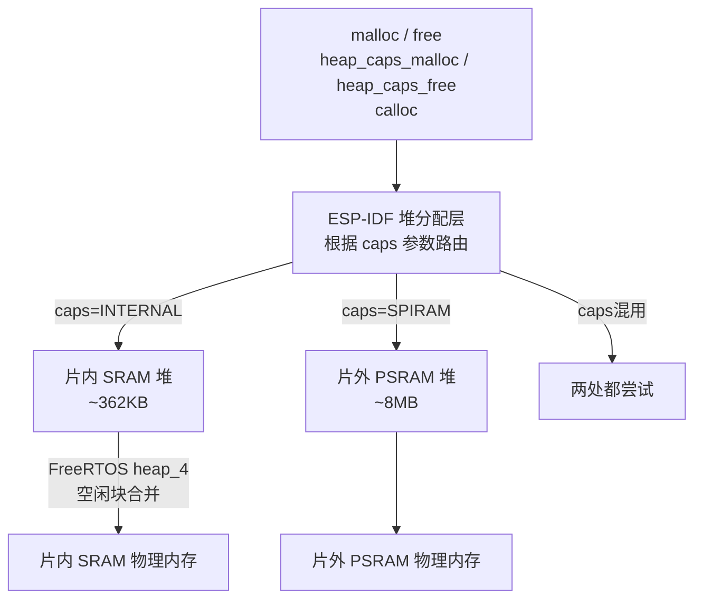

### 13.5 关键配置值

从本项目的 `sdkconfig`：

| 配置 | 值 | 含义 |
|------|:---:|------|
| `CONFIG_SPIRAM_USE_MALLOC` | y | `malloc()` 可自动从 PSRAM 分配（透明化） |
| `CONFIG_SPIRAM_MALLOC_ALWAYSINTERNAL` | 16384 | 小于 16KB 的分配优先走片内 SRAM |
| `CONFIG_SPIRAM_MALLOC_RESERVE_INTERNAL` | 32768 | 始终保留 32KB 片内 SRAM 给内核 |
| `CONFIG_SPIRAM_ALLOW_STACK_EXTERNAL_MEMORY` | y | 任务栈可分配到 PSRAM |
| `CONFIG_FREERTOS_TASK_CREATE_ALLOW_EXT_MEM` | y | 任务 TCB 和栈可在 PSRAM 分配 |

> **设计意图**：小分配（<16KB）走快内存，大分配（模型文件、DMA缓冲）走大内存。这 32KB 保留空间确保即使 PSRAM 被大量分配，内核关键操作也有片内 SRAM 可用。

### 13.6 运行时查内存

```c
// 查看片内 SRAM 剩余
size_t free_internal = heap_caps_get_free_size(MALLOC_CAP_INTERNAL);

// 查看 PSRAM 剩余
size_t free_psram = heap_caps_get_free_size(MALLOC_CAP_SPIRAM);

// 本项目在 OTA 开始前检查（xvf_ota.c:172）
ESP_LOGI(TAG, "Free mem: internal=%lu, psram=%lu",
         (unsigned long)heap_caps_get_free_size(MALLOC_CAP_INTERNAL),
         (unsigned long)heap_caps_get_free_size(MALLOC_CAP_SPIRAM));
```

---

## 十四、EventGroup — 等"多个条件同时满足"

### 14.1 概念

队列是等一条消息。信号量是等一个信号。**EventGroup 是等一组条件中某几个同时满足**。

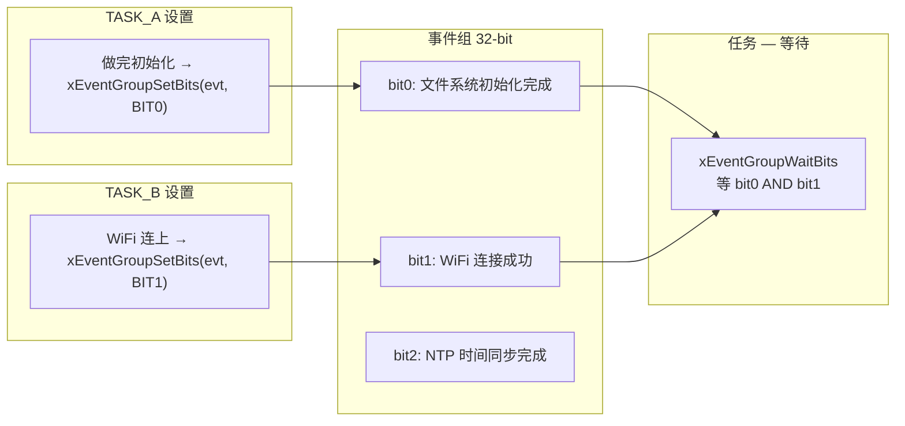

### 14.2 API 概览

```c
// 创建事件组
EventGroupHandle_t evt = xEventGroupCreate();

// 设置 bit（从任务）
xEventGroupSetBits(evt, BIT0);
// 设置 bit（从 ISR）
xEventGroupSetBitsFromISR(evt, BIT0, &xHigherPriorityTaskWoken);

// 等待 bit（多个选项）
EventBits_t bits = xEventGroupWaitBits(
    evt,
    BIT0 | BIT1,     // 等 bit0 和 bit1
    pdTRUE,           // 消费模式：读完后清空
    pdTRUE,           // 等 ALL bits（AND）；pdFALSE = 等 ANY bits（OR）
    portMAX_DELAY     // 永久等待
);
```

### 14.3 AND vs OR 逻辑

| 模式 | 含义 | 例子 |
|:----:|------|------|
| `pdTRUE` (AND) | 所有指定位都置 1 时才返回 | 系统启动：等 SPIFFS **且** WiFi **且** PSRAM 都就绪 |
| `pdFALSE` (OR) | 任意位被置 1 就返回 | 错误处理：等按键 **或** 网络断开 **或** 超时中任一触发 |

> **AND 模式是 EventGroup 最独特的价值**——其他 IPC 机制做不到"同时等多个条件都满足才继续"。

### 14.4 典型场景：启动序列同步

```c
// 三个后台任务各自做初始化，做完后"亮灯"
void wifi_init_task(void *pv) {
    wifi_connect();
    xEventGroupSetBits(g_boot_evt, WIFI_READY_BIT);  // bit 0 = 1
    vTaskDelete(NULL);
}

void filesystem_init_task(void *pv) {
    spiffs_mount();
    xEventGroupSetBits(g_boot_evt, FS_READY_BIT);    // bit 1 = 1
    vTaskDelete(NULL);
}

void model_init_task(void *pv) {
    load_model_into_psram();
    xEventGroupSetBits(g_boot_evt, MODEL_READY_BIT);  // bit 2 = 1
    vTaskDelete(NULL);
}

// 主任务等全部三个就绪
void main_init_task(void *pv) {
    xEventGroupWaitBits(g_boot_evt, 
                        WIFI_READY_BIT | FS_READY_BIT | MODEL_READY_BIT,
                        pdTRUE,   // 清空已消费的 bits
                        pdTRUE,   // AND — 三个都要
                        pdMS_TO_TICKS(30000));  // 最多等 30 秒
        
    ESP_LOGI("MAIN", "All subsystems ready, starting main loop");
}
```

> 本项目**没有用 EventGroup**——它的初始化顺序是严格的串行依赖，不需要并行等。但你在开发稍复杂的系统时，EventGroup 是第一个要考虑的"多源同步"工具。

---

## 十五、软件定时器（Software Timer）

### 15.1 概念：不用独立任务就能实现周期操作

如果一个任务只做"每 X ms 检查一次某件事"，那就浪费了一个任务栈和 TCB。**软件定时器**让你注册一个回调函数，由 FreeRTOS 内核自动周期调用。

```c
// 不需要开独立任务 + 写 while(1) + vTaskDelay
// 三行就搞定！
TimerHandle_t timer = xTimerCreate(
    "myTimer",                       // 名称
    pdMS_TO_TICKS(1000),             // 周期：1000ms
    pdTRUE,                          // pdTRUE=自动重载, pdFALSE=一次性
    (void *)0,                       // 传入回调的参数
    myTimerCallback                  // 回调函数
);
xTimerStart(timer, 0);
```

### 15.2 回调在哪里执行？

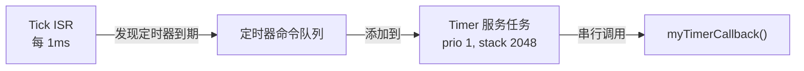

> **回调不在 Tick ISR 中执行，也不在你的任务中执行——它在"Timer 服务任务"中执行！** 这是关键：你的回调必须快，因为**所有定时器共享这一个任务**，一个慢回调会堵住其他所有定时器。

### 15.3 本项目的配置

```c
CONFIG_FREERTOS_USE_TIMERS=y
CONFIG_FREERTOS_TIMER_TASK_PRIORITY=1        // 低优先级（不影响音频 I/O）
CONFIG_FREERTOS_TIMER_TASK_STACK_DEPTH=2048  // 2KB 栈
CONFIG_FREERTOS_TIMER_QUEUE_LENGTH=10        // 最多排队 10 个定时器事件
```

### 15.4 何时用 Timer vs 独立 Task？

| 场景 | 用 Timer | 用独立 Task |
|------|:--:|:--:|
| 每 N ms 做一件很短的事（翻转 LED、看门狗喂狗） | ✅ | ❌ 重了 |
| 操作涉及阻塞等待（等队列、等 I2C 应答） | ❌ 会堵住其他 Timer | ✅ |
| 需要维护状态变量跨周期（计数器、滤波值） | ❌ 状态管理在回调里难做 | ✅ |
| 需要被暂停/恢复/动态改周期 | ✅ 内置 API 支持 | ❌ 需要自己实现 |

### 15.5 一次性定时器：延时执行

```c
// "3 秒后执行一次回调，然后自动删除"
TimerHandle_t once = xTimerCreate("once", pdMS_TO_TICKS(3000), pdFALSE, 0, callback);
xTimerStart(once, 0);
// 3s 后 callback 被调用 → 定时器自动停止 → 只需手动 xTimerDelete()
```

> 本项目未使用软件定时器——它需要精确周期（`vTaskDelayUntil`）和阻塞等待（I2C 通信），适合独立任务而非定时器回调。

---

## 十六、Task 的实现细节与设计哲学

以下从数据结构 → API → 内核 → 汇编 → 硬件，**逐层拆解一个 task 从创建到运行的完整生命周期**。这不是教 API，而是让你理解 FreeRTOS 内核的"骨架肌肉"。

> **三层抽象总览**：

| 层       | 负责什么                   | 对应文件                   |
| ------- | ---------------------- | ---------------------- |
| **内核层** | TCB、链表、调度算法、状态转换       | `tasks.c`              |
| **移植层** | 栈初始化、PendSV 汇编、寄存器操作   | `port.c` / `portASM.S` |
| **硬件层** | ARM 异常模型（NVIC）、自动压栈/出栈 | ARM 核心                 |

---

### 16.1 TCB — 任务在内存中的"户口本"

每个任务对应一个 TCB（Task Control Block），是 FreeRTOS 内核中最重要的数据结构：

```c
// FreeRTOS tasks.c 中的真实定义（精简核心字段）
typedef struct tskTaskControlBlock
{
    volatile StackType_t *pxTopOfStack;  /* ← 整个 RTOS 最关键的单一个指针！
                                            指向任务栈顶的寄存器保存区 */

    ListItem_t            xStateListItem; /* 挂在就绪/阻塞/挂起链表上
                                             通过这个节点找到"该链表还有谁" */
    ListItem_t            xEventListItem; /* 挂在事件等待链表上（队列/信号量阻塞时用）
                                             通过这个节点，内核在事件到达时找到"谁在等" */

    UBaseType_t           uxPriority;     /* 当前优先级（可能是继承后被抬高的）*/
    StackType_t           *pxStack;       /* 栈底部（起始地址）——释放栈时用 */
    char                  pcTaskName[16]; /* 任务名，调试用（本项目最多 16 字符）*/

    UBaseType_t           uxBasePriority; /* 原始优先级——继承取消后恢复为此值 */

    #if (configUSE_MUTEXES == 1)
        TaskHandle_t      xMutexHolder;   /* 当前被该任务持有的互斥锁（用于优先级继承）*/
    #endif

    #if (configNUM_CORES > 1)
        UBaseType_t       uxCoreAffinityMask; /* SMP：核心亲和性位图（本项目用！）*/
    #endif

    /* ... 更多统计和调试字段 ... */
} tskTCB;

// 句柄本质上就是指向 TCB 的指针
typedef struct tskTaskControlBlock *TaskHandle_t;
```

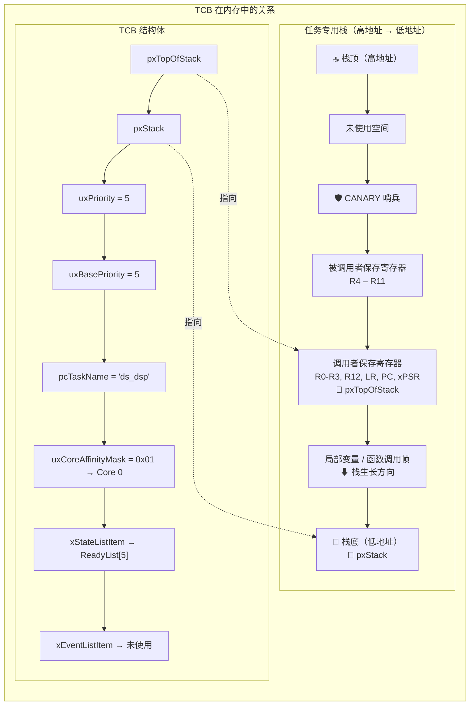

> **`pxTopOfStack` 是整个 RTOS 中最重要的单一个指针**。上下文切换时，只做两件事：① 保存旧任务的 CPU 寄存器到这个指针指向的位置；② 从这个新任务的指针位置恢复寄存器。**其他所有调度逻辑、链表操作、优先级判断 —— 都是为这两步服务的。**

---

### 16.2 任务栈布局 — 栈帧的精确结构

栈总是**从高地址向低地址生长**（X86、ARM、ESP32 的 Xtensa 都如此）。当一个任务不运行时，其栈顶保存着一个完整的 CPU 上下文快照：

```
高地址（栈顶部） — pxStack + usStackDepth × 4
┌──────────────────────────────────────────┐
│              未使用空闲空间                 │  ← 将来局部变量可用的空间
├──────────────────────────────────────────┤
│  CANARY 哨兵（0xA5A5A5A5 或随机值）        │  ← 第 2 课说过的"栈溢出检测"
├──────────────────────────────────────────┤
│                                          │
│   ┌──────────────────────────┐           │
│   │ R4                       │ ← 被调用者│ 这部分由 PendSV
│   │ R5                       │   保存    │ Handler 手工
│   │ R6                       │   寄存器   │ 压栈/出栈
│   │ R7                       │  （8个）   │
│   │ R8                       │           │
│   │ R9                       │           │
│   │ R10                      │           │
│   │ R11                      │           │
│   ├──────────────────────────┤           │
│   │ R0（返回值/第1个参数）      │ ← 调用者│ 这部分由 ARM
│   │ R1                       │   保存    │ 硬件自动
│   │ R2                       │   寄存器   │ 压栈/出栈
│   │ R3                       │  （8个）   │（"异常进入/返回"机制）
│   │ R12                      │           │
│   │ LR（链接寄存器，R14）       │           │
│   │ PC（程序计数器，R15）       │ ← 关键！  │
│   │ xPSR（CPU 状态寄存器）     │           │
│   └──────────────────────────┘           │
│   ↑ pxTopOfStack 指向这里                 │
├──────────────────────────────────────────┤
│                                          │
│          实际的任务栈使用区域              │  ← 局部变量 + 函数调用帧
│         （运行时动态使用）                 │
│                                          │
├──────────────────────────────────────────┤
│         函数1 的栈帧                      │
├──────────────────────────────────────────┤
│         函数2 的栈帧                      │
└──────────────────────────────────────────┘
低地址（栈底部） — pxStack
```

> **关键：ARM Cortex-M 的"异常进入硬件自动压栈"机制**。当 CPU 进入任何异常（包括 PendSV）时，硬件自动按以下顺序压 8 个寄存器：xPSR, PC, LR, R12, R3, R2, R1, R0。**这笔"免费压栈"省了 PendSV 的 8 条指令，是 Cortex-M 设计中最聪明的 RTOS 优化**。

---

### 16.3 xTaskCreate 的 7 步内核流程

下面是逐步骤的 `xTaskCreate` 真实内核流程：

```c
BaseType_t xTaskCreate(TaskFunction_t pxTaskCode,
                       const char *const pcName,
                       uint32_t ulStackDepth,
                       void *pvParameters,
                       UBaseType_t uxPriority,
                       TaskHandle_t *pxCreatedTask)
{
    TCB_t *pxNewTCB;

    /* ── 第1步：分配 TCB ── */
    /* ESP-IDF 实际通过 CONFIG_FREERTOS_TASK_CREATE_ALLOW_EXT_MEM 控制 */
    /* 如在 PSRAM 分配，sizeof(TCB_t) ≈ 100-150 字节 */
    pxNewTCB = (TCB_t *)pvPortMalloc(sizeof(TCB_t));

    if (pxNewTCB != NULL)
    {
        /* ── 第2步：分配栈 ── */
        /* ulStackDepth 单位是"字"（32-bit），4096 × 4 = 16384 字节 */
        pxNewTCB->pxStack = (StackType_t *)
            pvPortMalloc(ulStackDepth * sizeof(StackType_t));

        if (pxNewTCB->pxStack != NULL)
        {
            /* ── 第3步：初始化栈 — 整个 RTOS 最精妙的设计 ──
             * 在栈顶构造"假上下文"，假装任务刚被一个 ISR 打断过。
             * 这样当调度器第一次"恢复"这个任务时，CPU 就跳转到任务入口。*/
            pxNewTCB->pxTopOfStack = pxPortInitialiseStack(
                pxNewTCB->pxStack,
                pxTaskCode,       /* PC = 任务函数入口地址 */
                pvParameters      /* R0 = 传入参数 */
            );

            /* ── 第4步：填充 TCB 元数据 ── */
            pxNewTCB->uxPriority = uxPriority;
            pxNewTCB->uxBasePriority = uxPriority;
            strncpy(pxNewTCB->pcTaskName, pcName, configMAX_TASK_NAME_LEN);
            #if (configNUM_CORES > 1)
                pxNewTCB->uxCoreAffinityMask = xCoreID;
            #endif

            /* ── 第5步：初始化链表节点 ── */
            /* 把 xStateListItem 和 xEventListItem 关联到本 TCB */
            vListInitialiseItem(&(pxNewTCB->xStateListItem));
            vListInitialiseItem(&(pxNewTCB->xEventListItem));
            listSET_LIST_ITEM_OWNER(
                &(pxNewTCB->xStateListItem), pxNewTCB);
            /* 此后，从链表中取到节点就能通过 pxOwner 找回 TCB */

            /* ── 第6步：挂入就绪链表 ── */
            /* 添加到 pxReadyTasksLists[uxPriority] 尾部 */
            prvAddNewTaskToReadyList(pxNewTCB);

            /* ── 第7步：抢占判断 ── */
            /* 如果新任务优先级高于当前任务→触发 PendSV 上下文切换 */
            if (uxPriority > pxCurrentTCB->uxPriority) {
                /* 这行代码最终展开为 ARM 汇编:
                 *   LDR R0, =0xE000ED04    ← NVIC 的 ICSR 寄存器
                 *   LDR R1, =0x10000000    ← PendSV 挂起位
                 *   STR R1, [R0]           ← 写入 = 触发 PendSV
                 */
                portYIELD();
            }

            if (pxCreatedTask != NULL) {
                *pxCreatedTask = pxNewTCB;
            }
            return pdPASS;
        }
        vPortFree(pxNewTCB);  /* 栈分配失败 — 回滚 TCB */
    }
    return errCOULD_NOT_ALLOCATE_REQUIRED_MEMORY;
}
```

> **关键洞见**：任务第一次创建时**它还没有运行过**。内核在栈上伪造了一个"刚被中断打断"的状态——包含初始 PC（= 任务函数地址）、初始 xPSR（Thumb 模式）、初始参数（R0 = pvParameters）。当 PendSV "恢复"这个任务时，硬件出栈把 PC 和 xPSR 弹出——CPU 就自然跳转到了任务函数，**完全不知道"自己其实是第一次运行"**。

---

### 16.4 pxPortInitialiseStack — 伪造上下文

这是整个 RTOS 中最值得逐行阅读的函数：

```c
/* ARM Cortex-M 版本的 pxPortInitialiseStack（FreeRTOS port.c）
 * 注意：顺序由硬件异常压栈顺序决定（必须匹配！）*/

StackType_t *pxPortInitialiseStack(StackType_t *pxTopOfStack, /* 栈顶 */
                                    TaskFunction_t pxCode,     /* 任务入口 */
                                    void *pvParameters)        /* 参数 */
{
    /* 模拟硬件异常入口的自动压栈顺序（从高地址往低地址写） */

    /* ── 硬件自动出栈组（异常返回时由硬件弹出）── */
    *pxTopOfStack = portINITIAL_XPSR;               /* xPSR = 0x01000000
        bit[24] = 1 → Thumb 模式（ARM Cortex-M 必须）*/
    pxTopOfStack--;

    *pxTopOfStack = ((StackType_t)pxCode) & portSTART_ADDRESS_MASK;
        /* PC = 任务函数地址。bit[0] = 1 标记 Thumb 入口 */
    pxTopOfStack--;

    *pxTopOfStack = (StackType_t)prvTaskExitError;
        /* LR = 错误处理函数。如果任务意外 return，PC 被设置为这个
           函数的地址——这是一个"保险丝"，正常任务永远不 return */
    pxTopOfStack--;

    /* R12, R3, R2, R1 — 初始化为 0（或任意值，弹出后弃用） */
    pxTopOfStack--;                                  /* R12 = don't care */
    *pxTopOfStack = 0x03030303;   pxTopOfStack--;    /* R3 */
    *pxTopOfStack = 0x02020202;   pxTopOfStack--;    /* R2 */
    *pxTopOfStack = 0x01010101;   pxTopOfStack--;    /* R1 */

    *pxTopOfStack = (StackType_t)pvParameters;
        /* R0 = 任务参数（用 0x01010101... 等调试值标记 R1-R3
           方便在调试器里一眼识别"这是初始上下文"）*/
    pxTopOfStack--;

    /* ── 手工出栈组（PendSV 手工恢复）── */
    pxTopOfStack--;                      *pxTopOfStack = 0x0b0b0b0b; /* R11 */
    pxTopOfStack--;                      *pxTopOfStack = 0x0a0a0a0a; /* R10 */
    pxTopOfStack--;                      *pxTopOfStack = 0x09090909; /* R9  */
    pxTopOfStack--;                      *pxTopOfStack = 0x08080808; /* R8  */
    pxTopOfStack--;                      *pxTopOfStack = 0x07070707; /* R7  */
    pxTopOfStack--;                      *pxTopOfStack = 0x06060606; /* R6  */
    pxTopOfStack--;                      *pxTopOfStack = 0x05050505; /* R5  */
    pxTopOfStack--;                      *pxTopOfStack = 0x04040404; /* R4  */

    return pxTopOfStack; /* 返回新的栈顶 = 新任务的初始上下文 */
}
```

> **LR 为什么指向错误处理而不是任务地址？**
> 任务应该永远在 `while(1)` 中，不应该 `return`。如果意外返回，PC 会恢复 LR 的值 = 跳转到 `prvTaskExitError`。ESP-IDF 更进一步，`CONFIG_FREERTOS_TASK_FUNCTION_WRAPPER=y` 会捕获返回并自动 `vTaskDelete`，防止僵尸 TCB。

---

### 16.5 PendSV — 上下文切换的"手术刀"

**为什么不用函数调用做切换？** 函数调用是协作式的——需要任务主动调用。**抢占式调度必须有一个不可抗拒的机制"强制切走"**。ARM Cortex-M 的答案是 **PendSV**（可挂起的系统调用异常）。

#### 16.5.1 时序图：双中断并发时 PendSV 如何保证一致性

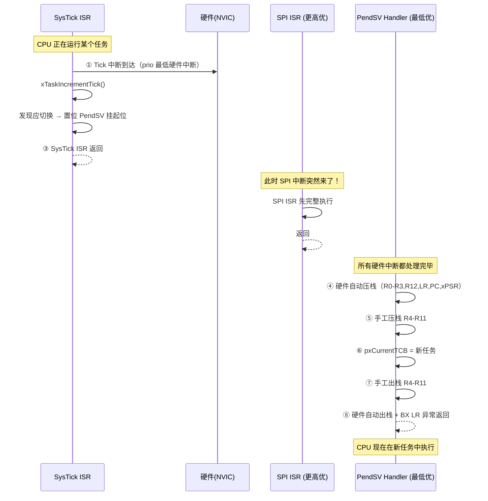

> **PendSV 优先级最低的精髓**：如果 SysTick ISR 直接进行上下文切换，而另一个 SPI 中断恰好在这时到达——SPI ISR 会在"任务 A 的寄存器保存了一半、任务 B 的寄存器还没恢复"的状态下运行。结果不可预测。**PendSV 保证所有硬件中断都处理完毕、系统状态一致时，才做切换**。

#### 16.5.2 PendSV Handler 的完整逻辑（ARM Cortex-M 汇编注释版）

```asm
PendSV_Handler:
    /* ═══ ① 硬件已自动压栈：R0,R1,R2,R3,R12,LR,PC,xPSR ═══ */

    /* ═══ ② 手工压栈被调用者保存寄存器 ═══ */
    MRS    R0,  PSP                 /* ① 读取当前任务栈指针 PSP   */
    STMDB  R0!, {R4-R11}            /* ② 压栈 R4-R11：DB = Decrement Before（先减后写）*/
    STR    R0,  [R3]                /* ③ 回存新 PSP 到 old_tcb->pxTopOfStack
                                        （R3 在第⑥步前被加载为 old TCB 指针）*/

    /* ═══ ③ 更新 pxCurrentTCB ═══ */
    LDR    R0,  =pxCurrentTCB        /* ① 加载"指向 pxCurrentTCB"的指针 */
    LDR    R1,  [R0]                /* ② R1 = 旧 TCB（即将被切换掉的任务）*/
    LDR    R2,  =pxNewTCB           /* ③ R2 = 新 TCB（调度器在 Tick ISR 中已算好）*/
    STR    R2,  [R0]                /* ④ pxCurrentTCB = 新 TCB */

    /* ═══ ④ 手工出栈 — 从新任务栈恢复 ═══ */
    LDR    R0,  [R2]                /* ① R0 = new_tcb->pxTopOfStack */
    LDMIA  R0!, {R4-R11}            /* ② 出栈 R4-R11：IA = Increment After（先读后加）*/
    MSR    PSP, R0                  /* ③ 设置新任务的 PSP */

    /* ═══ ⑤ 异常返回：硬件自动出栈 + 跳转 ═══ */
    BX     LR                       /* LR = EXC_RETURN（异常返回魔法值）
                                        硬件看到这个特殊值后：
                                          ① 自动从新任务栈弹出 R0,R1,R2,R3,R12
                                          ② 自动弹出 LR → 用于返回
                                          ③ 自动弹出 PC → 跳转到新任务
                                          ④ 自动弹出 xPSR → 恢复 CPU 状态
                                        ★ 总共 8 个寄存器，0 条软件指令 ★ */
```

> **`STMDB R0!, {R4-R11}` 解析**：`STM = Store Multiple`；`DB = Decrement Before`（每次存之前 R0 先自减）——匹配"栈向低地址生长"。`R0!`（感叹号）表示写完后 R0 更新为新值。一条指令压栈 8 个寄存器。
>
> **总开销**：整个 PendSV Handler 在 72MHz 的 Cortex-M3 上约 **0.3~0.5 μs**。加上 Tick ISR 的 0.5~2 μs，调度总开销始终 < 0.1% CPU。

---

### 16.6 就绪链表与 O(1) 调度

#### 16.6.1 数据结构

```c
/* FreeRTOS 内核中的就绪链表（tasks.c）*/
PRIVILEGED_DATA static List_t pxReadyTasksLists[configMAX_PRIORITIES];
/* pxReadyTasksLists[14] = 双向链表 → [usb_mic_task] ⇄ [usb_spk_task] */

/* 三个辅助链表 */
List_t xDelayedTaskList1;    /* 延时中的任务（按唤醒时间排序）*/
List_t xDelayedTaskList2;    /* 溢出的延时链表（32-bit tick 计数器翻转时用）*/
List_t xPendingReadyList;    /* 刚从 ISR 中释放的待就绪任务 */

/* 就绪优先级位图 — 核 O(1) 查找的核心 */
PRIVILEGED_DATA static volatile UBaseType_t uxTopReadyPriority;
/* bit N = 1 表示优先级 N 的 ReadyList 非空 */
```

#### 16.6.2 调度选择算法 — 始终 O(1)

```c
/* 标记某优先级有就绪任务（当任务进入 Ready 状态时调用）*/
#define taskRECORD_READY_PRIORITY(uxPriority)                     \
    {                                                             \
        if ((uxPriority) > uxTopReadyPriority)                    \
        {                                                         \
            uxTopReadyPriority = (uxPriority);                    \
        }                                                         \
        /* 这位运算是原子，无需加锁 */                                \
        uxReadyPriorities |= (1UL << (uxPriority));               \
    }

/* 选择最高优先级的第一个就绪任务 */
#define taskSELECT_HIGHEST_PRIORITY_TASK()                        \
    {                                                             \
        /* __builtin_clz = Count Leading Zeros                    \
           这是 ARM 的 CLZ 指令，一条 CPU 指令完成！               \
           例如: 0b00000000_00000000_10000000_00000000            \
                 前面的零数量 = 16                                 \
                 结果优先级 = 31 - 16 = 15                         \
           但优先级的 bit 0 = 最低位，所以：                         \
           优先级的 bit N 在位图中的位置 = bit N                     \
           32-bit 位图中找到最高为1的bit = 31 - CLZ                 \
           对于我们的配置 (configMAX_PRIORITIES=25)：              \
           __builtin_clz 作用于 32-bit 变量，直接返回前导零数量      \
           uxTopPriority = 31 - CLZ                                \
        */                                                        \
        UBaseType_t uxTopPriority =                               \
            (31UL - (UBaseType_t)__builtin_clz(uxReadyPriorities));\
        /* pxReadyTasksLists[uxTopPriority] 的头部即为目标 */      \
    }
```

```
以本项目为例（7 个任务，configMAX_PRIORITIES=25）：
uxReadyPriorities (32-bit, LSB = prio 0, MSB = prio 25):

bit 0-2:  000   — prio 0~2 无就绪任务
bit 3:    1     — spk_wdog (prio 3) 在就绪链表中
bit 4:    0
bit 5:    1     — ds_dsp (prio 5) 在就绪链表中
bit 6-13: 00... — 
bit 14:   1     — usb_mic_task (prio 14) 在位，usb_spk_task (prio 14) 也在同链表
bit 15:   1     — TinyUSB (prio 15) 在就绪链表中
bit 16-25: 00...

__builtin_clz(uxReadyPriorities) → 前导零数量 = 16
最高有任务的优先级 = 31 - 16 = 15 ✓

选择 pxReadyTasksLists[15] 的第一个节点 → TinyUSB
整个过程：1 条 CLZ 指令 + 1 次链表的第一个节点取值
→ O(1)，与系统总任务数无关
```

> **无论系统有 5 个还是 100 个任务，找到最高优先级并选中任务——始终是常数时间 O(1)**。这是 FreeRTOS 声称"实时确定性"的根基：调度算法本身的时间消耗是恒定的、可预测的。

---

### 16.7 状态转换 = 链表操作

每个状态变化，本质上就是将 TCB 的 `xStateListItem` 从一个链表移到另一个链表。这是 RTOS 中最简洁的抽象：

| 转换 | 内核操作 |
|------|---------|
| Running → Ready（被抢占） | 从 Running 状态摘出 → 插入 `pxReadyTasksLists[priority]` 尾部 |
| Running → Blocked（等事件） | `xEventListItem` → 事件等待链表；`xStateListItem` → `xDelayedTaskList`（带唤醒时间戳） |
| Blocked → Ready（事件到达） | 从 `xEventListItem` 的链表摘出；从 `xDelayedTaskList` 移到 `pxReadyTasksLists[priority]` |
| 任务创建 | `xStateListItem` → `pxReadyTasksLists[priority]` 尾部 |
| Suspend | `xStateListItem` → `xSuspendedTaskList` |
| Resume | `xStateListItem` → 回到 `pxReadyTasksLists[priority]` |
| Delete | Idle Task 回收栈空间和 `vPortFree(TCB)` |

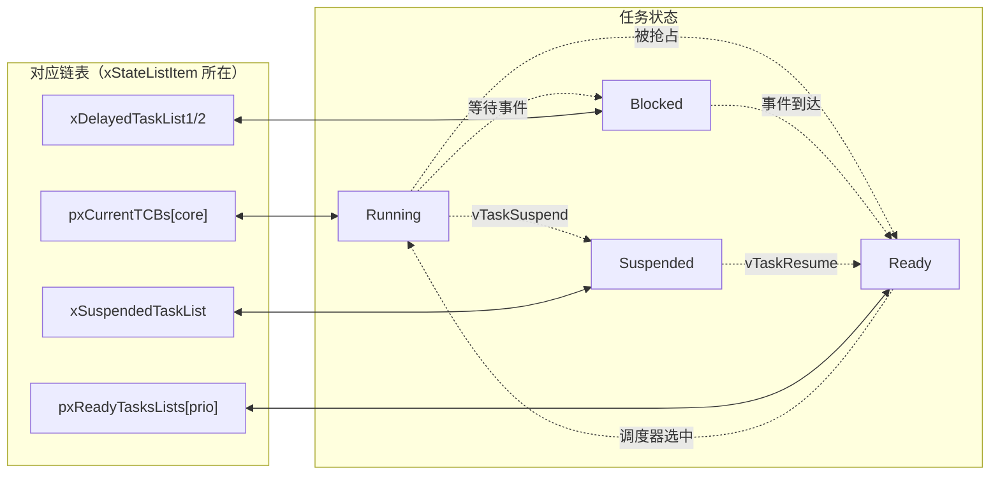

---

### 16.8 上下文切换开销（实战数据）

基于本项目的 Tick 中断和 PendSV 实际开销测量：

| 组件 | 频率 | 每次开销 | CPU 占比 |
|------|------|---------|:--------:|
| Tick ISR (`xTaskIncrementTick`) | 每 1ms | 0.5~2 μs | 0.05~0.2% |
| PendSV（仅需切换时） | 每 1~10ms | 0.3~0.5 μs | 0.005~0.05% |
| **总计** | — | — | **< 0.25% CPU** |

> 在我们的项目中，1ms 内的 ~997 μs 都在跑任务代码。调度开销是秒表级别的。

---

### 16.9 常见问题速答

**Q1: 两个核心怎么分配任务？**
ESP32-S3 使用 FreeRTOS SMP。两个核心**共享同一个 `uxReadyPriorities` 位图**，各自独立挑选。选择规则：
1. 从最高非空优先级的 ReadyList 中取第一个就绪的、**且亲和性匹配**的任务
2. 如果任务的 `uxCoreAffinityMask == tskNO_AFFINITY`，任意核心都可取
3. 如果任务固定在 Core 1 而当前核心是 Core 0 → 跳过，看下一个同优先级任务

**Q2: 为什么项目不用全局变量而用队列？**
两个问题：① `counter++` 不是原子操作（读-改-写三步，中断可能打断中间某步）；② SMP 下 `volatile` 也不能保证多核的内存可见性——需要内存屏障（`__sync_synchronize()`）。FreeRTOS 的 Queue / TaskNotify / StreamBuffer 在内部处理了所有这些问题，包括自动内存屏障和 SMP 锁。

**Q3: Tick 中断中可以调用 xQueueSend 吗？**
不能——Tick ISR 在临界区内。用 `xQueueSendFromISR()`（ISR 安全版本），它会将操作挂入 `xPendingReadyList`，由 Tick ISR 返回后再由 PendSV 或下一个任务切换时处理。

---

### 16.10 设计哲学总结

回到 FreeRTOS 的设计精神。任务不是函数调用——它是一个**独立线程**。

```c
// ❌ 反模式：任务是"一次性函数"
void bad_task(void *pv) {
    do_something();
    return;  // TCB → 僵尸（除非显式 vTaskDelete(NULL)）
}

// ✅ 正确模式：任务是"事件循环"
void good_task(void *pv) {
    init();          // 一次性的初始化

    while (1) {
        wait_for_event();  // ① 阻塞，让出 CPU（0% 浪费）
        handle_event();    // ② 事件到来 → 快速处理
        // ③ 回到 ① — 这期间 CPU 已经在跑其他任务
    }
}
```

**RTOS 任务设计的四条铁律**：

1. **任务 = 事件循环** — 永远 `while(1)`，永远在"等事件→处理→等事件"的循环中
2. **不做事就阻塞** — 用 `vTaskDelay` / `xQueueReceive` / `ulTaskNotifyTake` 主动让出 CPU；永远不用 `while(!ready) ;` 忙等
3. **ISR 最小化** — 中断中只做 `xQueueSendFromISR` / `xTaskNotifyGiveFromISR`；重活放到任务里
4. **栈 = 稀有资源** — 用 `uxTaskGetStackHighWaterMark` 定期检查，留 30% 安全余量

> **"不做事的时候，CPU 完全不消耗在你身上。"** 这就是 RTOS 比裸板 Super Loop 高效的根本原因——也是理解 Task 实现机制后应该带走的**最重要的设计直觉**。

---

## 十七、并发与实时性 — 优先级反转、饿死与 RMA 理论

### 17.1 问题全景

多任务并发时，三个经典问题覆盖了 90% 的实际故障：

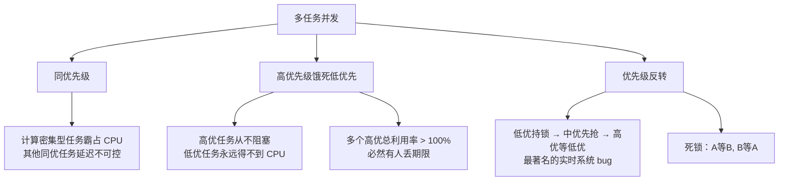

---

### 17.2 场景一：同优先级 — 时间片公平 ≠ 响应及时

```mermaid
gantt
    title 同优先级：计算密集型霸占 CPU
    dateFormat  YYYY-MM-DD
    axisFormat  %L
    section 任务A (计算密集)
    A1 :a1, 0, 5ms
    A2 :a2, 7ms, 5ms
    A3 :a3, 14ms, 5ms
    section 任务B (需要快速响应)
    B1 :b1, 5ms, 2ms
    B2 :b2, 12ms, 2ms
```

任务 B 的响应延迟 = A 连续运行的时间（可达 5ms）。如果 A 从不主动阻塞，同优先级的其他任务就在队列末尾反复排队。

| 根因 | 现象 | 后果 |
|------|------|------|
| 任务从不主动阻塞（无止尽的 `while(1)` 没有 `vTaskDelay` / `xQueueReceive`） | 其他同优先级任务要排队等整个时间片 | 响应延迟不可控 |
| 计算量远超预期 | 别人的时间片被"吃了" | 时间片不精确 |

**解决方案**（按推荐顺序）：

```c
/* 方案 1：强制让出 CPU — 每处理一批数据主动 yield */
void compute_task(void *pv) {
    while (1) {
        for (int i = 0; i < BATCH_SIZE; i++) {
            process_one_item();
        }
        vTaskDelay(1);  // "为别人留一扇门"
    }
}

/* 方案 2：拆分长任务 — 把 10ms 计算拆成 10 个 1ms chunk */
static int s_work_index = 0;
void chunked_task(void *pv) {
    while (1) {
        process_chunk(s_work_index);
        s_work_index = (s_work_index + 1) % NUM_CHUNKS;
        vTaskDelay(1);  // 每 block 不阻塞别人超过 1ms
    }
}

/* 方案 3：优先级分离 — B 真的需要"实时响应"就不该和 A 同级 */
// 提升 B 的优先级 + 确保 B 也定期阻塞
```

> FreeRTOS 默认时间片 = 1 tick = 1ms（`CONFIG_FREERTOS_HZ=1000`）。但时间片**只在同优先级有多个就绪任务时才切换**——如果只有 A 在跑而 B 在 Blocked，A 不会每秒浪费 1000 次切换。

---

### 17.3 场景二：高优先级饿死低优先级

```mermaid
sequenceDiagram
    participant H as 音频处理 (prio 14)
    participant L as 日志写入 (prio 3)

    Note over H: 每 10ms 醒一次，每次处理 8ms

    rect rgb(50, 50, 70)
        loop 永远的循环
            H->>H: 处理音频 (8ms)
            H->>H: vTaskDelay(2ms)
            Note over L: 只获得 2ms！连 1 行日志都写不完
        end
    end
```

| 根因 | 现象 | 后果 |
|------|------|------|
| 高优周期太短 + 执行时间太长 | 低优任务只能在高优休眠的缝隙中运行 | 日志丢失、看门狗不喂、OTA 进退为零 |
| 高优任务从不阻塞 | `while(1) { work(); }` 没有 `vTaskDelay` | **整个系统锁死**，低优连 1 条指令都执行不到 |

**解决方案分为四个层级**：

**第一层：设计 — Rate Monotonic Analysis (RMA)**

Liu & Layland (1973) 定理：对于 n 个周期性任务，如果 CPU 总利用率 U ≤ n × (2^(1/n) - 1)，则所有任务都能满足期限。

| n | 理论可调度上界 | 实践经验线 |
|:--:|:--------------:|:----------:|
| 2 | 82.8% | 80% |
| 3 | 77.9% | 75% |
| 4 | 75.7% | 70% |
| ∞ | 69.3% | 60~65% |

RMA 规则：**周期越短 → 优先级越高**。因为周期短意味着"醒得频繁"，如果给它低优先级，它可能在低优任务占用 CPU 时错过期限。

**第二层：代码 — 插入呼吸点**

```c
/* 高优任务中强制限制连续运行时间 */
void disciplined_task(void *pv) {
    while (1) {
        ulTaskNotifyTake(pdTRUE, portMAX_DELAY);

        TickType_t start = xTaskGetTickCount();
        process_audio_chunk();

        // 处理超过 0.5ms → 系统过载 → 给低优一条活路
        if ((xTaskGetTickCount() - start) > 0) {
            vTaskDelay(1);  // 1ms 窗口给低优
        }
    }
}
```

**第三层：架构 — 核心分离**

```c
// Core 0: 高优先级音频（不受低优干扰）
// Core 1: 低优先级 OTA / 日志（不受音频干扰）
// 前提：两核不共享锁
```

**第四层：优先级老化（Linux CFS 风格，FreeRTOS 不原生支持）**

临时提升等待过久的低优任务优先级。在硬实时系统中不推荐——它破坏了"确定性"。

> FreeRTOS 设计哲学：如果低优任务会饿死，说明优先级设计错了。回到第一步，而不是运行时修补。

---

### 17.4 场景三：优先级反转 — 低优阻塞高优

嵌入式历史上最著名的 bug（1997 年 Mars Pathfinder）。

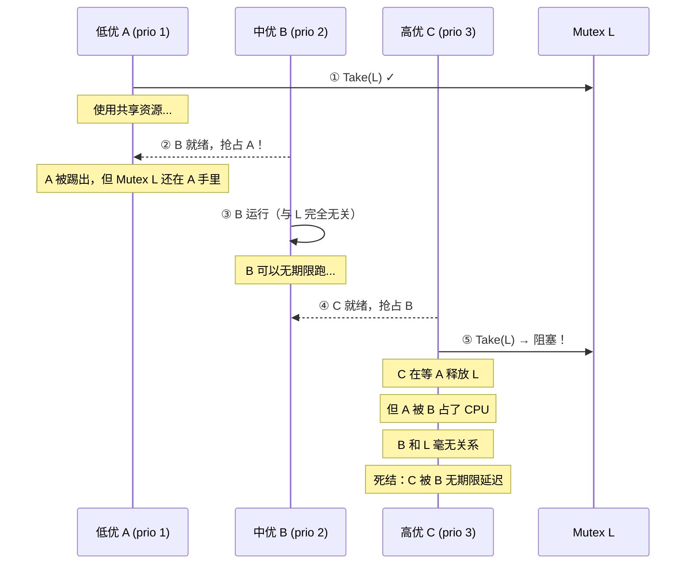

**三段论**：低优持锁 → 中优抢 CPU → 高优等锁 → 高优被中优饿死，即使中优和锁无关。

**方案 1：优先级继承 — FreeRTOS Mutex 自动实现**

```c
SemaphoreHandle_t mutex = xSemaphoreCreateMutex();
// ↑ 自带优先级继承！

/* 自动过程：
   1. C 等 mutex → 发现 holder 是 A (prio 1)
   2. 内核提升 A 的优先级到 3（C 的优先级）
   3. B (prio 2) 无法抢占 A → A 完成工作
   4. A 释放 mutex → 恢复 prio 1 */
```

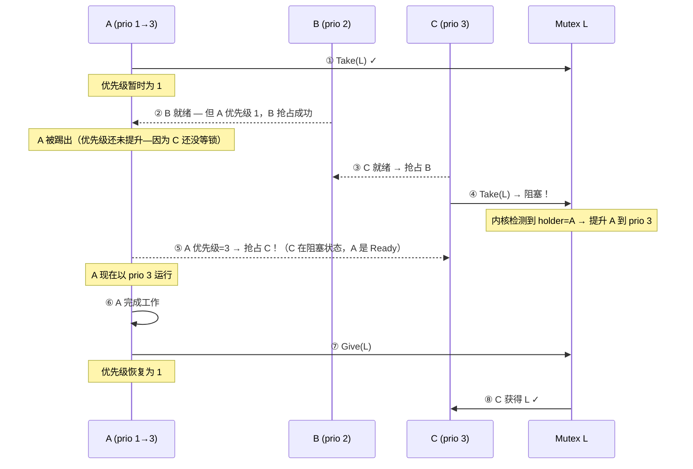

**方案 2：优先级天花板协议**

```c
/* Mutex 创建时设定"天花板优先级"——任何获取者瞬间提升到此值 */
// 优势：C 不需要等——A 获取 Mutex 瞬间就被提升，B 无处可入
// 劣势：可能不必要地阻塞 B
```

| | 优先级继承 | 优先级天花板 |
|------|:---:|:---:|
| 提升时机 | C 尝试获取锁时 | A 获取锁的瞬间 |
| 被 B 抢占次数 | 可能 1 次 | 0 次（确定） |
| 实现复杂度 | FreeRTOS 自动 | 需手动 |
| 适用场景 | 大多数系统 | 安全要求极高、零容忍 |

**方案 3：避免跨优先级共享 — 用队列替代锁**

```c
// ❌ 反模式：不同优先级任务共享全局变量
volatile int shared_counter;  // A (prio 1) 写，C (prio 3) 读
// 即使加锁，反转依然可能

// ✅ 安全：高优任务通过队列接收数据副本
QueueHandle_t data_queue;
// A send, C receive → 数据隔离 = 无锁 = 无反
```

---

### 17.5 场景四：死锁

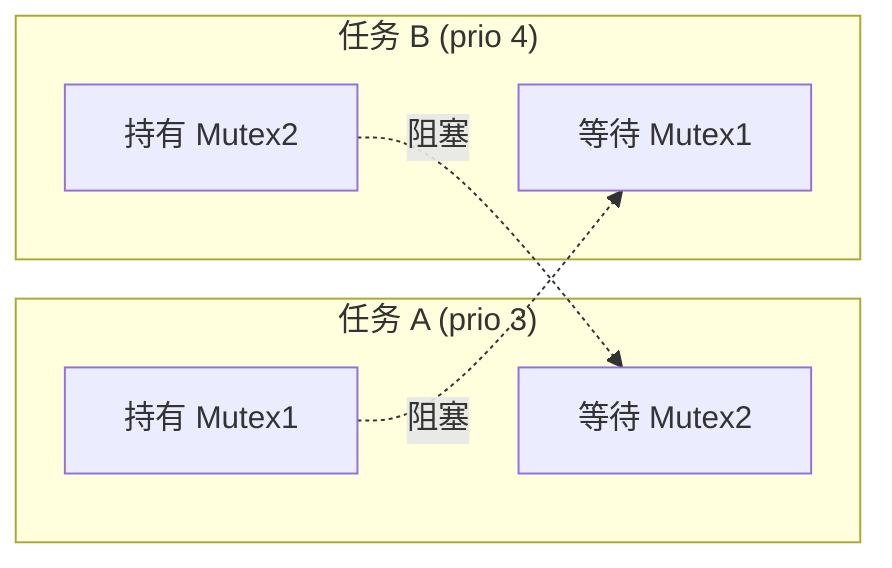

**解决方案**：

```c
/* ① 固定锁顺序 — 最简单最可靠 */
/* 所有任务必须按 Mutex1 → Mutex2 → Mutex3 单向顺序获取 */
void any_task(void *pv) {
    xSemaphoreTake(mutex1, portMAX_DELAY);  // 总是先锁1
    xSemaphoreTake(mutex2, portMAX_DELAY);  // 再锁2
    work();
    xSemaphoreGive(mutex2);
    xSemaphoreGive(mutex1);
}

/* ② 超时放弃 + 重试 */
if (xSemaphoreTake(mutex2, pdMS_TO_TICKS(100)) != pdTRUE) {
    xSemaphoreGive(mutex1);         // 释放已获取的
    vTaskDelay(pdMS_TO_TICKS(50));  // 退一步
    continue;                        // 重新来
}
```

---

### 17.6 本项目 RMA 理论分析 — 深入拆解

#### 17.6.1 原始 RMA 数值

```
任务              周期(T)    执行时间(C)    利用率(C/T)    优先级
─────────────────────────────────────────────────────────────
usb_mic_task       1ms       ~0.3ms        30%           14
usb_spk_task       1ms       ~0.3ms        30%           14
ds_dsp            10ms       ~2ms          20%            5
spk_wdog           5ms       ~0.1ms         2%            3
─────────────────────────────────────────────────────────────
总利用率 U = 82%
```

RMA 可调度性上界（n=4）：**75.7%**。82% > 75.7% → **按理论，系统可能丢期限**。

#### 17.6.2 为什么 82% 没有实际酿成灾难？

**原因 1：RMA 假设"最坏情况的同步到达"**

RMA 分析假设所有任务在同一时刻一起就绪（"critical instant"）。这在 4 个任务中的实际概率极低：

```
RMA 的 critical instant 假设：
  t=0: mic+spk+ds_dsp+spk_wdog 全部同时就绪
  这意味着 0ms 时刻刚好是：USB 帧到达 + DSP 帧到达 + 看门狗到期
  
但本项目实际的时间交错：
  t=0:    mic 就绪（USB 帧到达）
  t=0.2:  spk 就绪（USB OUT 数据到达，稍有偏移）
  t=5:    spk_wdog 到期
  t=10:   ds_dsp 积累完一帧
```

```mermaid
gantt
    title 实际时间交错（非 critical instant）
    dateFormat  YYYY-MM-DD
    axisFormat  %L
    section usb_mic
    mic1 :m1, 0, 0.3ms
    mic2 :m2, 1, 0.3ms
    mic3 :m3, 2, 0.3ms
    section usb_spk
    spk1 :s1, 0.2ms, 0.3ms
    spk2 :s2, 1.2ms, 0.3ms
    spk3 :s3, 2.2ms, 0.3ms
    section ds_dsp
    dsp1 :d1, 5ms, 2ms
    dsp2 :d2, 10ms, 2ms
    section spk_wdog
    wd1 :w1, 2.5ms, 0.1ms
    wd2 :w2, 5ms, 0.1ms
```

> **没有 1ms 内在三个任务"同时就绪"的情况**——mic 就绪后 spk 在 0.2ms 后到来，这段时间内 mic 已经处理完毕。实际峰值利用率远低于 82%。

**原因 2：阻塞型任务 ≠ RMA 的"持续执行型"任务**

RMA 假设每个任务的执行时间是**连续的、不可打断的**（C 时间内任务始终在 Running）。但本项目的音频任务大部分时间在阻塞：

```c
/* usb_mic_task 的实际执行剖面 */
while (1) {
    /* ── 阶段1: Blocked ── */
    ulTaskNotifyTake(pdTRUE, portMAX_DELAY);  // 等 USB 数据
    // ↑ 这段时间任务不消耗 CPU —— RMA 模型把整段算入"周期"但不算"执行"
    
    /* ── 阶段2: 极短 —— 实际执行时间 ── */
    // mic_callback: 读I2S → 写USB → ~0.3ms
    // 如果 USB 没有活动（Host 没有请求音频），usb_mic_task 一直 Blocked
    // → 实际利用率接近 0%
}
```

> **RMA 的利用率 (C/T) 是把"周期 1ms"当作任务每 1ms 都执行 0.3ms**。实际上 USB 不活动时，音频任务占用率为 0%。RMA 计算的是**活跃峰值的理论界值**，不是平均利用率。

**原因 3：spk_wdog 的条件激活**

```c
/* spk_watchdog_task 只在没有真实音频时才消耗 CPU */
void spk_watchdog_task(void *pv) {
    while (1) {
        if (s_uac_ctx.spk_active) {
            ulTaskNotifyTake(pdTRUE, portMAX_DELAY);  // 有音频 → 永久阻塞
            continue;
        }
        // 无音频 → 填充静音 → 每 5ms 执行 0.1ms
        fill_silence();
        vTaskDelay(pdMS_TO_TICKS(5));
    }
}
```

spk_wdog 的实际利用率不是 2%——而是有音频时为 0%，无音频时可能达到 2%~5%。

---

### 17.7 如果将周期从 1ms 增大到 2ms——后果分析

#### 17.7.1 USB 协议的限制

mic 和 spk 的 1ms 周期不是代码决定的，是 **USB 协议的硬件约束**：

```
USB Full Speed (12 Mbps) 的帧结构：
┌──────┬──────┬──────┬──────┬──────┬──────┬──────┬──────┐
│Frame0│Frame1│Frame2│Frame3│Frame4│Frame5│Frame6│Frame7│
│ 1ms  │ 1ms  │ 1ms  │ 1ms  │ 1ms  │ 1ms  │ 1ms  │ 1ms  │
└──────┴──────┴──────┴──────┴──────┴──────┴──────┴──────┘

同步传输的端点描述符中的 bInterval 字段：
  bInterval = 1 → 每 1 帧 (1ms) 一个数据包 ← 本项目的默认配置
  bInterval = 2 → 每 2 帧 (2ms)
  bInterval = 4 → 每 4 帧 (4ms)
```

**把 bInterval 改成 2 → 周期变 2ms。** 对系统的影响：

```c
/* 修改前（bInterval=1, 周期 1ms）*/
每次传输数据量: 16000 samples/s × 1ms/1000ms × 2 bytes = 32 bytes/帧
每个 USB 微帧:  1 个 isochronous 数据包 (32 bytes)

/* 修改后（bInterval=2, 周期 2ms）*/
每次传输数据量: 16000 × 2ms/1000 × 2 = 64 bytes/帧
每个 USB 微帧:  2ms 内合并成一个 64 byte 数据包
               或者分成两个 32 byte 包每帧
```

#### 17.7.2 正面效果

| 指标 | 1ms 周期 | 2ms 周期 |
|------|---------|---------|
| mic+spk 的 RMA 利用率 | 60% (30%+30%) | **30%** (15%+15%) |
| 系统总利用率 | 82% | **52%** ✅ |
| 调度开销（Tick+PendSV） | 每 1ms 一次 | 每 2ms 一次 |
| 任务切换次数 | ~2000/秒 | ~1000/秒 |

**0.3ms 的执行时间在两个周期内相同**——因为处理的是同一帧数据，只是数据的"粒度"变了：

```c
/* 周期 1ms：每 1ms 处理 32 bytes 音频 */
void usb_mic_task_1ms(void *pv) {
    while (1) {
        ulTaskNotifyTake(pdTRUE, portMAX_DELAY);
        read_i2s_to_usb(32);  // 读取 32 bytes
        // 执行时间: ~0.3ms → 利用率 = 0.3/1 = 30%
    }
}

/* 周期 2ms：每 2ms 处理 64 bytes 音频 */
void usb_mic_task_2ms(void *pv) {
    while (1) {
        ulTaskNotifyTake(pdTRUE, pdMS_TO_TICKS(2));
        read_i2s_to_usb(64);  // 读取 64 bytes — 0.6ms
        // 执行时间: ~0.6ms → 利用率 = 0.6/2 = 30%
        // ↓ 注意！执行时间不是 0.3ms，而是翻倍了！
    }
}
```

> **关键**：周期翻倍 → 每次传输的数据量也翻倍 → 执行时间翻倍！利用率 **C/T = 0.6ms/2ms = 30%**，和原来的 30% 完全一样！RMA 并没有改善！

#### 17.7.3 真正的改善来自何处

周期从 1ms 变 2ms 的**真正收益是减少中断频率和调度开销**，而非 RMA 利用率：

| 优化点 | 1ms 周期 | 2ms 周期 | 效果 |
|--------|---------|---------|------|
| USB isochronous ISR 频率 | 1000 Hz | 500 Hz | ISR 负载减半 |
| mic/spk 任务唤醒频率 | ~2000/s | ~1000/s | 调度开销减半 |
| mic/spk 任务的 Tick 精度需求 | 1ms | 可放宽 | 对 `vTaskDelayUntil` 的误差容忍更大 |
| ds_dsp 被抢占的频率 | 每 1ms | 每 2ms | ds_dsp 获得更大连续时间窗口 |

但 **C/T 利用率不变**——因为是线性缩放。RMA 上的改善是虚假的。

#### 17.7.4 负面效果

| 影响 | 1ms 周期 | 2ms 周期 |
|------|---------|---------|
| 音频延迟（mic 到 Host） | ~1-3ms | **~3-6ms** |
| 全双工往返延迟 | ~2-5ms | **~5-10ms** |
| I2S DMA 缓冲深度需求 | 至少覆盖 1ms | 至少覆盖 2ms |
| USB 总线带宽效率 | 较低（包头 > 音频数据本身） | 较高（数据/包 = 2:1） |

USB Full Speed 每个同步数据包有 9 bytes 的包头开销：

```
1ms 周期: 每帧 32 bytes 音频 + 9 bytes 协议 = 41 bytes/frame
          有效负载率 = 32/41 = 78%
          
2ms 周期: 每 2 帧传输 64 bytes = 每帧 32 bytes 音频
          有效负载率 = 32/41 = 78%（不变）
```

---

### 17.8 本项目能做什么——四种可行优化

#### 优化 1：利用 `portMAX_DELAY` 的"空闲收益"

音频任务的 `ulTaskNotifyTake` 在 USB 无活动时永久阻塞——这段"空闲收益"被 RMA 完全忽略。**本项目已经这么做**，无需改动。

```c
// 当 Host 没有请求音频数据时：
// usb_mic_task → ulTaskNotifyTake(..., portMAX_DELAY) → 永久 Blocked
// → 利用率从 30% 降到 0%
// ds_dsp 可以独占 Core 0，spk_wdog 永久阻塞
```

#### 优化 2：合并 mic 和 spk 到一个任务

如果两个任务处理的工作相似且共享同一个事件的响应，**合并任务减少上下文切换**：

```c
/* 当前：两个独立任务，都需要被 USB ISR 唤醒 */
usb_mic_task: 等 ISR 通知 → 读 I2S → 写 USB  (0.3ms, prio 14)
usb_spk_task: 等 ISR 通知 → 读 USB → 写 I2S  (0.3ms, prio 14)

/* 优化：一个任务处理两个方向 */
void usb_audio_task(void *pv) {
    while (1) {
        // 任一方向有数据就醒
        ulTaskNotifyTake(pdTRUE, portMAX_DELAY);
        // 处理 mic
        if (mic_ready()) process_mic();
        // 处理 spk
        if (spk_ready()) process_spk();
    }
}
// 效果：消除两个同优先级任务的轮转切换开销（每 1ms 节省 ~2μs）
// 缺陷：usb_mic 和 usb_spk 不再独立——一个方向的处理延迟影响另一个
```

> **本项目用两个独立任务的真正原因**：全双工。mic 和 spk 通过不同的事件源唤醒（USB IN 端点 vs USB OUT 端点）。合并会要求两个方向都相互检查——在全双工下，这反而增加延迟。

#### 优化 3：动态 ds_dsp 优先级（WIP 方案）

当前 ds_dsp (prio 5) 低于音频 I/O (prio 14)——正确。但当音频处于 idle 状态时，可以提高 ds_dsp 的优先级，让它更快处理积压：

```c
void dsp_consumer_task(void *pv) {
    UBaseType_t normal_prio = 5, boost_prio = 10;
    
    while (1) {
        xQueueReceive(s_frame_queue, &item, portMAX_DELAY);
        
        // 检测到音频 I/O 空闲 → 临时提升优先级加快处理
        if (!s_mic_active && !s_spk_active) {
            vTaskPrioritySet(NULL, boost_prio);
        }
        
        process_frame(&item);
        
        if (uxQueueMessagesWaiting(s_frame_queue) == 0) {
            vTaskPrioritySet(NULL, normal_prio);  // 恢复
        }
    }
}
```

#### 优化 4：减小 ds_dsp 执行时间（代码层面）

当前 ~2ms/10ms。如果可以优化 `process_frame` 到 ~1ms：

```
优化前: C/T = 2/10 = 20%
优化后: C/T = 1/10 = 10%
系统总 U = 30+30+10+2 = 72% → 低于 RMA 上界 75.7%
```

---

### 17.9 现场决策速查

| 现象 | 根因 | 立即检查 | 推荐方案 |
|------|------|---------|---------|
| 低优从不运行 | 高优利用率 >95% | `vTaskGetRunTimeStats` 看 CPU 占比 | 高优插入 `vTaskDelay(1)` / 分离核心 |
| 某任务偶发秒级卡顿 | 优先级反转 | 搜索 `xSemaphoreCreateMutex` 的 holder 优先级 | Mutex / 改用队列 |
| 同优先级一个抢不过 | 计算密集型 vs 阻塞型 | 计算密集型任务的执行时间 | 拆分计算 / 提升优先级 |
| 每 N 秒复位一次 | WDT 因饥饿触发 | WDT 超时前最后执行的任务 | 调整优先级 / 检查不主动阻塞的循环 |
| 一起跑就死，单独测正常 | 死锁 | 打印每个 Mutex 的 holder/waiter | 固定锁顺序 |
| 中断响应延迟 | ISR 中的 `portYIELD_FROM_ISR` 被忽略 | ISR 结尾代码 | 添加 ISR 安全 API |

---

### 17.10 本项目并发风险评估

| 风险 | 状态 | 原因 |
|------|:---:|------|
| 优先级反转 | ✅ 无 | 未用 Mutex，spinlock 临界 < 10 条指令 |
| 高优饿死低优 | ⚠️ 存在 | mic+spk 合占 60% CPU，ds_dsp 可能被延迟——但有 40ms 缓冲容错 |
| 同优先级饿死 | ✅ 可控 | mic 和 spk 都是阻塞型，各循环主动 `ulTaskNotifyTake` |
| 死锁 | ✅ 无 | 仅一个 spinlock，无嵌套 |
| 中断延迟 | ✅ 优化 | `taskENTER_CRITICAL` 确保临界区极短 |
| RMA 超标 | ⚠️ 活跃峰值 | 82% > 75.7%（上界），但实际交错降低峰值，且"空闲收益"弥补 |

---

## 课后思考题

1. 如果你这个项目只有一个核心（Core 1 不存在），TinyUSB 任务（prio 15）和 usb_spk_task（prio 14）在同一个核上——usb_spk_task 会饿死吗？
2. 什么样的任务适合用 `vTaskDelayUntil` 而不是 `vTaskDelay`？
3. 如果 `CONFIG_FREERTOS_HZ` 改为 100（10ms tick），对系统中哪个任务影响最大？
4. 为什么可以用 Task Notification 代替 Binary Semaphore？性能优势来自哪里？
5. 本项目 7 个任务中，为什么 `ota_flash` 的栈（8192）是其他任务的两倍？
6. `heap_caps_malloc(size, MALLOC_CAP_SPIRAM)` 失败后为什么还要 fallback 到 `malloc()`？两者有什么本质区别？
7. 软件定时器的回调函数中，调用 `vTaskDelay` 会发生什么？为什么？
8. PendSV 为什么优先级必须设为最低？如果设得比 SysTick 还高会怎样？
9. 将 USB 同步端点的 bInterval 从 1 改为 2 后，RMA 利用率从 82% 降到 52%——为什么这个"改善"是虚假的？
10. 优先级反转的三段论中，如果中优先级任务 B 不存在（只有 A 和 C），反转还会发生吗？为什么？
11. 你的项目新增了一个读取温度传感的任务（每 100ms 一次，耗时 0.5ms，prio 2）。对现有系统的 RMA 可行性有何影响？
