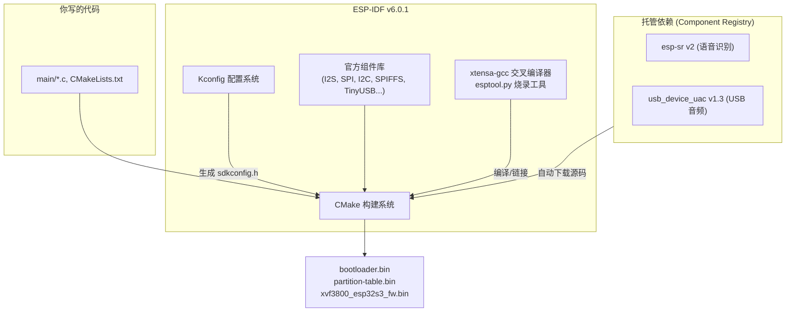
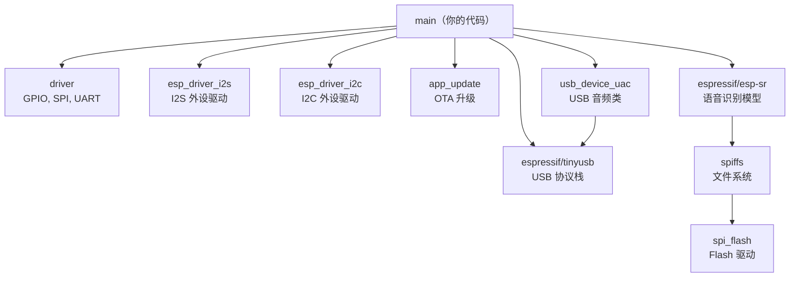
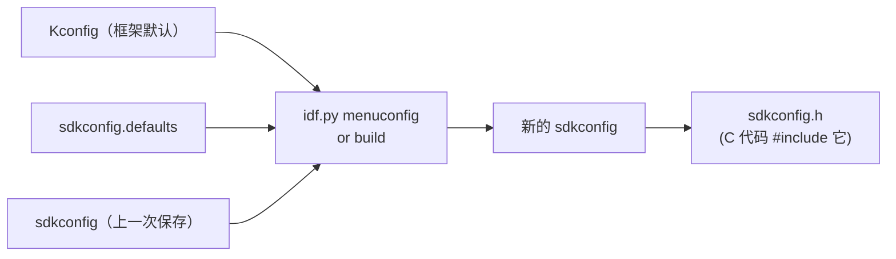
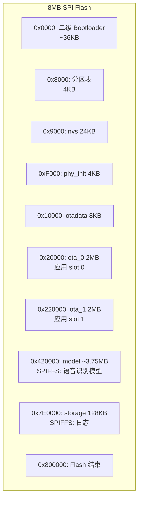
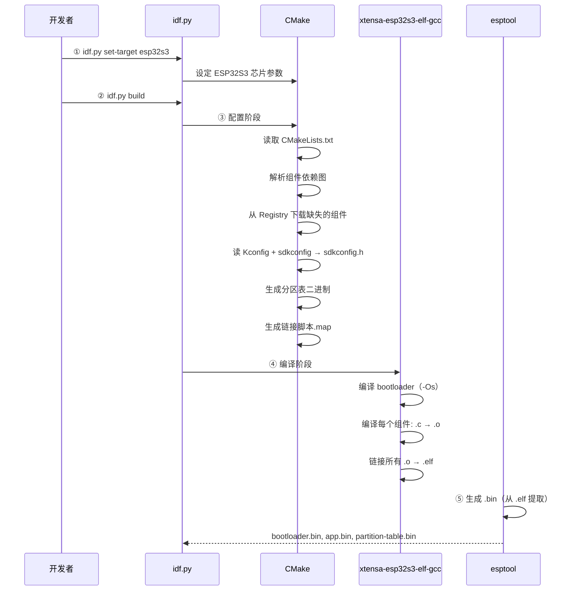
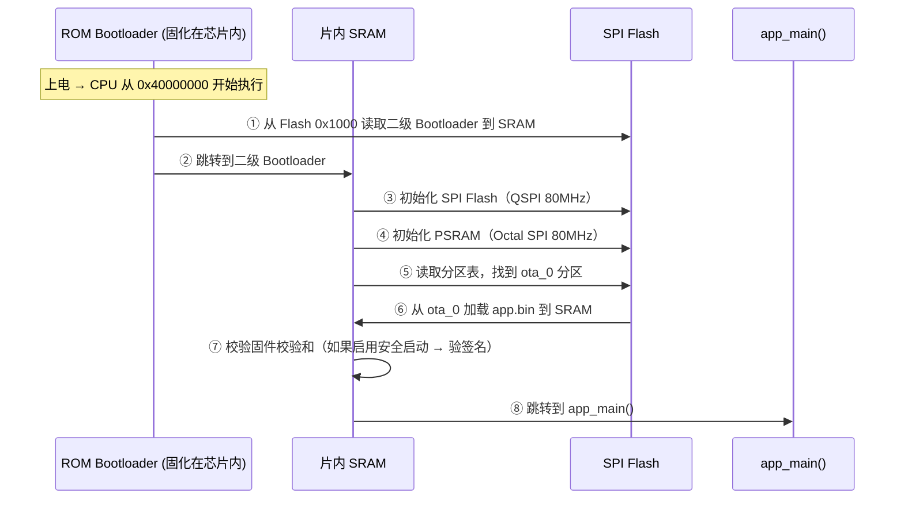
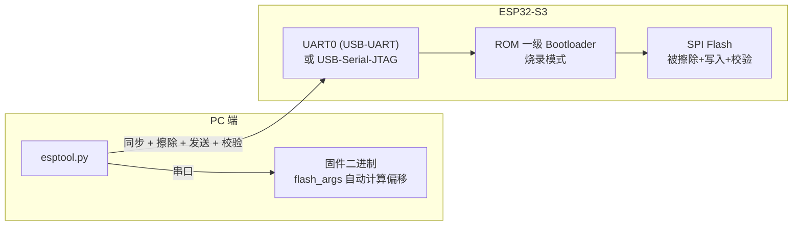

# 第 4 课：ESP-IDF 开发框架与工具链

> 前三课回答了"嵌入式是什么、芯片长什么样、软件怎么跑"。现在回答：**代码怎么从编辑器变成 Flash 里的固件？**
> ESP-IDF = 构建系统 + 配置系统 + 组件库 + 工具链 + 烧录器，是理解整个开发流程的最后一关。

---

## 一、ESP-IDF 是什么？

**ESP-IDF** = **Espressif IoT Development Framework**。乐鑫官方 IoT 开发框架，不是一个简单的 SDK——它是一个完整的开发体系：



| 组件 | 作用 | 在项目中的版本/配置 |
|------|------|:-------------------:|
| 交叉工具链 | xtensa-esp32s3-elf-gcc（在 PC 上编译 ESP32 机器码） | ESP-IDF v6.0.1 |
| CMake 构建系统 | 管理源文件、依赖、编译选项 | CMake ≥ 3.22 |
| Component Registry | 自动下载第三方组件 | `main/idf_component.yml` |
| esptool | 通过 UART/USB 烧录 Flash | ESP-IDF 内置 |
| menuconfig | 终端 GUI 配置所有 Kconfig 选项 | `idf.py menuconfig` |

> ESP-IDF 区别于 Arduino 的核心：**Arduino 隐藏了构建系统，ESP-IDF 暴露了一切**。你可以控制分区布局、链接脚本、Kconfig、Bootloader 源码——代价是学习曲线陡一些。

---

## 二、标准项目目录结构

```
xvf3800_esp32s3_fw/
├── CMakeLists.txt              ← 项目根 CMake（版本号、项目名）
├── main/
│   ├── CMakeLists.txt          ← 组件 CMake（注册源文件、依赖）
│   ├── idf_component.yml       ← 托管依赖声明（esp-sr, usb_device_uac）
│   ├── Kconfig.projbuild       ← 自定义 menuconfig 选项
│   ├── main.c                  ← 入口
│   ├── xvf_uac.c, xvf_i2s.c   ← 各模块
│   ├── tusb_config.h           ← TinyUSB 配置（覆盖框架默认值）
│   └── usb_descriptors.c       ← USB 描述符（CDC + UAC 复合设备）
├── sdkconfig                   ← 冻结的完整配置（**不要手动编辑**）
├── sdkconfig.defaults          ← 项目默认配置（你写，Git 管理）
├── partitions_sr.csv           ← 分区表
├── build/                      ← 编译产出
│   ├── bootloader/             ← 二级 Bootloader 二进制
│   ├── partition_table/        ← 分区表二进制
│   └── xvf3800_esp32s3_fw.bin  ← 应用固件
├── managed_components/         ← 自动下载的依赖源码（不 Git）
├── xvf3800_esp32s3_update/     ← 工厂烧录包（发布用）
└── docs/                       ← 设计文档
```

每一层的职责：

| 文件 | 谁写的 | 作用 |
|------|:---:|------|
| 根 `CMakeLists.txt` | 项目生成 | 项目名、版本号生成逻辑、引入 `project.cmake` |
| `main/CMakeLists.txt` | **你** | 注册源文件、声明 REQUIRES 依赖、USB 注入 |
| `main/idf_component.yml` | **你** | 第三方组件依赖（版本范围） |
| `main/Kconfig.projbuild` | **你** | 自定义 menuconfig 选项 |
| `sdkconfig.defaults` | **你** | 项目特定的 Kconfig 默认值 |
| `sdkconfig` | 自动生成 | 冻结配置（`idf.py menuconfig` 保存） |
| `partitions_sr.csv` | **你** | Flash 分区布局 |
| `tusb_config.h` | **你** | 覆盖 TinyUSB 默认配置 |

---

## 三、CMake 构建系统

ESP-IDF 从 v4.0 起全面使用 CMake。整个构建由三层文件驱动。

### 3.1 根 CMakeLists.txt — 项目级定义

```cmake
cmake_minimum_required(VERSION 3.22)

# ── 版本号：1.2.YYMMDD ──
execute_process(
    COMMAND git log -1 --format=%cd --date=format:%y%m%d
    WORKING_DIRECTORY ${CMAKE_SOURCE_DIR}
    OUTPUT_VARIABLE GIT_COMMIT_DATE
    OUTPUT_STRIP_TRAILING_WHITESPACE
    ERROR_QUIET
)
if(NOT GIT_COMMIT_DATE)
    set(GIT_COMMIT_DATE "000000")
endif()
set(PROJECT_VER "1.2.${GIT_COMMIT_DATE}")
message(STATUS "Firmware version: ${PROJECT_VER}")

include($ENV{IDF_PATH}/tools/cmake/project.cmake)
project(xvf3800_esp32s3_fw)
```

三段必备的样板代码，**顺序必须固定**：先 `cmake_minimum_required` → 在 `include(project.cmake)` 之前设置好 `PROJECT_VER` → 然后 `include` → 然后 `project()`。

> `include($ENV{IDF_PATH}/tools/cmake/project.cmake)` 是 ESP-IDF 构建的入口。它导入了所有 CMake 函数（`idf_component_register`、`idf_build_process`、分区表生成、链接脚本等）。**环境变量 `$IDF_PATH` 由 `activate_idf_v6.0.1.sh` 设置。**

### 3.2 main/CMakeLists.txt — 组件级注册

```cmake
idf_component_register(
    SRCS
        "usb_descriptors.c" "xvf_ota.c" "main.c"
        "xvf_i2s.c" "xvf_uac.c" "xvf_i2c.c" "xvf_aic3104.c"
        "xvf_audio_proc.c" "xvf_downsample.c" "xvf_xmos.c" "xvf_multinet.c"
    INCLUDE_DIRS
        "."
    REQUIRES
        driver               # ESP-IDF 外设驱动
        esp_driver_i2s       # I2S 驱动
        esp_driver_i2c       # I2C 驱动
        app_update           # OTA 更新库
        espressif__esp-sr    # 语音识别
    PRIV_REQUIRES
        espressif__tinyusb   # USB 协议栈（仅实现需要）
)
```

| 字段 | 含义 | 示例 |
|------|------|------|
| `SRCS` | 编译哪些 `.c` 文件 | 所有源文件 |
| `INCLUDE_DIRS` | 头文件搜索路径 | `"."` 找同目录的 `.h` |
| `REQUIRES` | 公开依赖（本组件的用户也会继承） | `driver`, `app_update` |
| `PRIV_REQUIRES` | 私有依赖（只有本组件需要） | `espressif__tinyusb` |

### 3.3 组件依赖图



### 3.4 USB Composite 注入（本项目特有的 CMake 技巧）

正常情况下，TinyUSB 有自己的 `tusb_config.h` 和 `usb_descriptors.c`。本项目的 USB 是**复合设备（CDC + UAC）**，需要自定义这些文件——但 TinyUSB 作为托管组件，不允许直接修改。

解决方法——**在 CMake 中注入自定义文件替换到 TinyUSB 库的编译中**：

```cmake
if(CONFIG_USB_DEVICE_UAC_AS_PART)
    # 判断是本地 tinyusb 还是托管版本
    if(tinyusb IN_LIST build_components)
        set(tinyusb_name tinyusb)
    else()
        set(tinyusb_name espressif__tinyusb)
    endif()

    # 把本目录加入 TinyUSB 的头文件路径（tusb_config.h 在这里）
    idf_component_get_property(tusb_lib ${tinyusb_name} COMPONENT_LIB)
    target_include_directories(${tusb_lib} PUBLIC "${CMAKE_CURRENT_LIST_DIR}")

    # 把自定义描述符注入 TinyUSB 库
    target_sources(${tusb_lib} PRIVATE "${CMAKE_CURRENT_LIST_DIR}/usb_descriptors.c")
endif()
```

> 这是 ESP-IDF 组件系统的一个**变通技巧**：通过 `idf_component_get_property` 拿到另一个组件的 CMake target，然后用 `target_include_directories` 和 `target_sources` 往里面注入文件。不优雅但实用——AGENTS.md 明确标注了这很脆弱。

---

## 四、Kconfig 配置系统 — sdkconfig 的秘密

### 4.1 三层配置优先级

```
高优先级 ↑
    sdkconfig              ← idf.py menuconfig 保存的完整配置（手动修改）
    sdkconfig.defaults      ← 项目默认值（Git 管理的）
    Kconfig                 ← ESP-IDF 框架和组件的默认值（框架定义）
低优先级 ↓
```

合并过程：



```c
// 在 C 代码中使用 sdkconfig 中定义的宏
// sdkconfig 被自动转换为 sdkconfig.h → 全局可见，无需 #include
// 但为了 IDE 语法提示，很多文件写了：
#include "sdkconfig.h"

void app_main(void) {
    #ifdef CONFIG_SPIRAM
        // 只有 PSRAM 启用时此代码才被编译
        psram_init();
    #endif
}
```

### 4.2 项目的 sdkconfig.defaults 关键配置

```ini
# ── 核心配置 ──
CONFIG_FREERTOS_HZ=1000                    # 系统心跳 1ms
CONFIG_ESP_DEFAULT_CPU_FREQ_MHZ=240        # CPU 频率 240 MHz

# ── 存储 ──
CONFIG_SPIRAM=y                            # 启用 PSRAM（必须！）
CONFIG_SPIRAM_MODE_OCT=y                   # Octal SPI 模式
CONFIG_SPIRAM_SPEED_80M=y                  # 80 MHz
CONFIG_SPIRAM_USE_MALLOC=y                 # malloc() 透明使用 PSRAM
CONFIG_SPIRAM_MALLOC_ALWAYSINTERNAL=16384  # <16KB 优先走片内 SRAM
CONFIG_SPIRAM_MALLOC_RESERVE_INTERNAL=32768# 保留 32KB 片内 SRAM 给内核

# ── 分区表 ──
CONFIG_PARTITION_TABLE_CUSTOM=y            # 使用自定义分区表
CONFIG_PARTITION_TABLE_CUSTOM_FILENAME="partitions_sr.csv"
CONFIG_ESPTOOLPY_FLASHSIZE_8MB=y           # 8MB Flash

# ── USB 复合设备 ──
CONFIG_USB_COMPOSITE_DEVICE_CDC_UAC=y      # USB-CDC + USB-音频
CONFIG_UAC_TUSB_VID=0x303A                 # Espressif 官方 VID
CONFIG_UAC_TUSB_PID=0x8000
CONFIG_UAC_TUSB_MANUFACTURER="Espressif"
CONFIG_UAC_TUSB_PRODUCT="XVF3800 UAC+CDC"
CONFIG_UAC_SAMPLE_RATE=16000               # 16kHz 默认（可改为 48000）
CONFIG_UAC_MIC_CHANNEL_NUM=1
CONFIG_UAC_SPEAKER_CHANNEL_NUM=2

# ── 任务参数 ──
CONFIG_UAC_TINYUSB_TASK_PRIORITY=15        # TinyUSB 任务优先级
CONFIG_UAC_TINYUSB_TASK_CORE=1             # 绑定到 Core 1
CONFIG_UAC_MIC_TASK_PRIORITY=14            # MIC 和 SPK 优先级相等！(14)
CONFIG_UAC_SPK_TASK_PRIORITY=14
CONFIG_UAC_MIC_TASK_CORE=0                 # 音频任务绑定到 Core 0
CONFIG_UAC_SPK_TASK_CORE=0

# ── 串口控制台 ──
CONFIG_ESP_CONSOLE_UART_CUSTOM=y           # 非标准 UART
CONFIG_ESP_CONSOLE_UART_NUM=1              # UART1（不是默认的 UART0!）
CONFIG_ESP_CONSOLE_UART_TX_GPIO=4          # GPIO4 = TX (XIAO D3)
CONFIG_ESP_CONSOLE_UART_RX_GPIO=1          # GPIO1 = RX (XIAO D0)
CONFIG_ESP_CONSOLE_UART_BAUDRATE=115200

# ── 调试 ──
CONFIG_LOG_DEFAULT_LEVEL_DEBUG=y           # 默认日志级别 DEBUG
CONFIG_FREERTOS_USE_TRACE_FACILITY=y       # 任务统计
CONFIG_FREERTOS_GENERATE_RUN_TIME_STATS=y  # CPU 占用率
CONFIG_FREERTOS_WATCHPOINT_END_OF_STACK=y  # 栈溢出硬件检测
```

### 4.3 自定义 Kconfig：Kconfig.projbuild

如果框架提供的配置选项不够——你可以自己在项目里定义新的配置项：

```kconfig
# main/Kconfig.projbuild

menu "XVF3800 UAC Configuration"

    config USB_COMPOSITE_DEVICE_CDC_UAC
        bool "Enable USB Composite Device (CDC + UAC)"
        default y
        select USB_DEVICE_UAC_AS_PART
        help
            Enable this option to create a USB composite device with
            both CDC (serial port) and UAC (audio) functions.

    if USB_COMPOSITE_DEVICE_CDC_UAC
        config UAC_TUSB_VID
            hex "USB Device VID"
            default 0x303A

        config UAC_TUSB_PID
            hex "USB Device PID"
            default 0x8000

        config UAC_TUSB_MANUFACTURER
            string "USB Device Manufacturer"
            default "Espressif"

        config UAC_TUSB_PRODUCT
            string "Product Name"
            default "XVF3800 UAC+CDC"
    endif

endmenu
```

> 关键语法 `select USB_DEVICE_UAC_AS_PART`：当用户启用 `USB_COMPOSITE_DEVICE_CDC_UAC` 时，**自动强制启用** `USB_DEVICE_UAC_AS_PART`（usb_device_uac 组件定义的配置）。这是 Kconfig 的"依赖链"机制——项目不需要手动修改框架组件。

### 4.4 menuconfig 可视化

运行 `idf.py menuconfig` 会启动 ncurses 终端 GUI：

```
Top-level menu categories:
├── Component config ──── 大头：FreeRTOS、LWIP、Flash、外设驱动
├── Serial flasher config ──── 烧录波特率、Flash 电压
├── Partition Table ──── 分区表选择、CSV 文件路径
├── Bootloader config ──── Bootloader 日志、恢复模式
├── Security features ──── Flash 加密、安全启动
└── [您自定义的] XVF3800 UAC Configuration ← 来自 Kconfig.projbuild！
```

> **不要手动编辑 `sdkconfig`。** 你的改动会在 `idf.py menuconfig` 下次保存时被覆盖。所有永久性配置改写在 `sdkconfig.defaults` 中。`sdkconfig` 只用作一次性提交到 Git 的记录——跨平台时 `sdkconfig` 会被重新生成。

---

## 五、分区表 — Flash 分区的规划

分区定义在 `partitions_sr.csv`，通过 `CONFIG_PARTITION_TABLE_CUSTOM_FILENAME` 引用：

```csv
# Name,     Type, SubType, Offset,   Size
nvs,        data, nvs,     0x9000,   0x6000,
phy_init,   data, phy,     0xf000,   0x1000,
otadata,    data, ota,     0x10000,  0x2000,
ota_0,      app,  ota_0,   0x20000,  0x200000,
ota_1,      app,  ota_1,   0x220000, 0x200000,
model,      data, spiffs,  0x420000, 0x3C0000,
storage,    data, spiffs,  0x7E0000, 0x20000,
```

| 字段 | 含义 | 示例 |
|------|------|------|
| Name | 分区名，运行时 `esp_partition_find` 查找 | `"model"` |
| Type | `app`（可执行固件）或 `data`（数据） | `data` |
| SubType | 子类型：`ota_0/1`、`spiffs`、`nvs`、`phy` | `spiffs` |
| Offset | 起始地址（通常对齐 64KB） | `0x420000` |
| Size | 大小（0x = 十六进制，K/M 后缀也支持） | `0x3C0000` ≈ 3.75MB |



| 分区 | 大小 | 存什么 | 特点 |
|------|:---:|--------|------|
| `nvs` | 24KB | WiFi 配置、设备校准数据 | 键值对 API（`nvs_get_i32`/`nvs_set_str`） |
| `phy_init` | 4KB | PHY 射频校准数据 | 首次启动时生成 |
| `otadata` | 8KB | 当前从哪个 OTA slot 启动 | 每次 OTA 更新后翻转 |
| `ota_0` | 2MB | 应用程序 Slot 0 | 出厂默认激活 |
| `ota_1` | 2MB | 应用程序 Slot 1 | OTA 更新目标 |
| `model` | ~3.75MB | 语音模型文件 | SPIFFS 文件系统 |
| `storage` | 128KB | 预留日志 | SPIFFS 文件系统 |

> **双 OTA 分区 (ota_0 ↔ ota_1) 大小必须完全相等**。如 `xvf_ota.c` 所述，写入前会验证尺寸是否匹配。尺寸不对称 → 固件写入时可能覆盖相邻分区 → 回滚失败。

---

## 六、编译流程 — idf build 内部



**编译产物的实际用途：**

| 产物 | 烧录到 Flash 地址 | 大小 | 用途 |
|------|:-----------------:|:----:|------|
| `build/bootloader/bootloader.bin` | `0x0` | ~36KB | 二级 Bootloader |
| `build/partition_table/partition-table.bin` | `0x8000` | ~4KB | 分区表 |
| `build/xvf3800_esp32s3_fw.bin` | `0x20000` (ota_0) | ~1.5~1.9MB | 应用程序 |
| `build/flasher_args.json` | — | — | 烧录参数汇总 |

---

## 七、版本管理 — PROJECT_VER

版本号不是手工维护的文本文件——**它由 Git 提交日期自动生成**：

```cmake
# CMakeLists.txt
set(PROJECT_VER "1.2.${GIT_COMMIT_DATE}")
# GIT_COMMIT_DATE = git log -1 --format=%cd --date=format:%y%m%d
# 示例：最新提交在 2026年7月13日 → 1.2.260713
```

```bash
# 版本号行为：
git commit          # → PROJECT_VER = 1.2.260713
idf.py reconfigure  # → CMake 重新执行 execute_process，读到新日期
idf.py build        # → app image 中嵌入版本号 1.2.260713
```

```c
// 运行时读取版本号（app_update 组件提供）
const esp_app_desc_t *desc = esp_app_get_description();
ESP_LOGI(TAG, "FW version: %s", desc->version);
// 输出: I (123) main: FW version: 1.2.260713
```

| 部分 | 含义 | 谁维护 |
|------|------|:------:|
| `1.2` | 主版本号.次版本号 | **手动**在 CMakeLists.txt 修改 |
| `YYMMDD` | 最近 git 提交日期 | **自动**从 `git log` 获取 |

---

## 八、开发工作流 — 日常操作

```bash
# 1. 激活环境（每个新终端都需要执行）
source /home/u/.espressif/tools/activate_idf_v6.0.1.sh

# 2. 首次构建前设置目标芯片（每项目一次）
idf.py set-target esp32s3

# 3. 配置
idf.py menuconfig      # 可视化配置 → 保存到 sdkconfig

# 4. 编译
idf.py build

# 5. 烧录到开发板
idf.py -p /dev/ttyUSB0 flash

# 6. 监控串口输出
idf.py -p /dev/ttyUSB0 monitor

# 7. 全部一次完成
idf.py -p /dev/ttyUSB0 flash monitor
```

| 命令 | 作用 | 何时使用 |
|------|------|----------|
| `set-target esp32s3` | 设置目标芯片 | 新项目 / `git clean` 后第一次构建 |
| `build` | 增量编译 | 每次改代码后 |
| `fullclean` | 删除 build/ 目录 | 编译出现奇怪错误/组件配置变了 |
| `reconfigure` | 仅执行 CMake 配置阶段 | 改 CMakeLists/Kconfig/git commit 后 |
| `menuconfig` | 打开配置 GUI | 改 Kconfig 选项 |
| `flash` | 烧录整个固件 | 准备测试 |
| `monitor` | 打开串口监视器 | 看日志 / 调试 |
| `size` | 查看编译后各段的体积 | 优化 Flash/RAM |
| `size-components` | 各组件分别占多少体积 | 定位哪个组件太大 |

> **`idf.py reconfigure`**：改了 `sdkconfig.defaults`、`CMakeLists.txt` 或 git 提交后必须执行一次，否则 `PROJECT_VER` 还是旧的。它只执行 CMake 配置（约 3~5 秒），不编译代码。

---

## 九、托管依赖管理

```yaml
# main/idf_component.yml
dependencies:
  usb_device_uac:
    version: "^1.3.1"           # ≥1.3.1 且 <2.0.0
  espressif/esp-sr:
    version: "^2.0.0"           # ≥2.0.0 且 <3.0.0
```

```bash
# 依赖的解析和下载过程：
#
# idf.py build (首次)
#   │
#   ├─→ 读取 main/idf_component.yml
#   ├─→ 查询 Component Registry (registry.espressif.cn)
#   ├─→ 解析依赖树（esp-sr → espressif/tinyusb → ...）
#   ├─→ 下载到 managed_components/
#   │      managed_components/
#   │      ├── espressif__tinyusb/
#   │      ├── espressif__usb_device_uac/
#   │      └── espressif__esp-sr/
#   └─→ 开始编译
```

| 概念 | 类似 Node.js 的 | 本项目 |
|------|:---------------:|--------|
| 依赖声明 | `package.json` | `main/idf_component.yml` |
| 本地缓存 | `node_modules/` | `managed_components/` |
| 全局缓存 | `~/.npm/` | `~/.espressif/components/` |
| 可执行命令 | `npm install` | `idf.py build` 自动下载 |
| 版本约束 | `^1.0.0` (caret) | `^1.0.0` (same caret) |

> `managed_components/` 下的依赖是**源码**（不是预编译库）。它们会被编译进可执行文件，所以 GDB 可以断点进依赖库内部——这在调试 USB 或音频问题时非常有用。

---

## 十、两阶段 Bootloader



| Bootloader 阶段 | 大小 | 位置 | 功能 |
|:---------------:|:---:|:----:|------|
| 一级（ROM） | ~几 KB | 芯片内部掩膜 ROM | 极简初始化 → 跳转到 Flash 0x1000 |
| 二级（ESP-IDF 编译） | ~36KB | Flash 0x1000 → 0x8FFF | SPI/PSRAM 初始化，OTA slot 选择，固件校验 |

> 二级 Bootloader 的源码在 ESP-IDF 的 `components/bootloader/` 下，**也可以在 menuconfig 中配置**（日志等级、Flash 电压、检查模式）。Arduino 一般隐藏此细节；在本项目中它由 `CONFIG_BOOTLOADER_*` 系列配置控制。

---

## 十一、烧录

```bash
# idf.py flash 实际调用 esptool.py（ESP-IDF 内置工具）
esptool.py --chip esp32s3 \
           -p /dev/ttyUSB0 \
           -b 460800 \
           --before=default_reset \
           --after=hard_reset \
           write_flash \
           0x0 bootloader/bootloader.bin \         # Flash 起始
           0x8000 partition_table/partition-table.bin \
           0x10000 otadata/ota_data_initial.bin \
           0x20000 xvf3800_esp32s3_fw.bin          # ota_0 槽
```



> **工厂烧录**使用 `xvf3800_esp32s3_update/esp32s3/flash_factory.sh` 脚本，它不仅写入 bootloader + app + 分区表，还会将 `model` 分区的 SPIFFS 镜像（内含语音识别模型文件）一起烧录。这是开箱即用的"全量烧录"。

---

## 十二、调试

| 方式 | 工具 | 优点 | 缺点 |
|------|------|------|------|
| 串口日志 | `idf.py monitor` | 零配置 | 无法设断点 |
| JTAG | OpenOCD + GDB | 断点、单步、寄存器 | 接线复杂 |
| USB-Serial-JTAG | 内置 USB 调试器 | 一根 USB 线完成 | 本项目中 USB 被 UAC 占用 |

由于本项目的 USB 口被 UAC（音频）和 CDC（串口）占用，串口调试走 **UART1**：

```
PC ← USB-TTL 変換器 ← (RX→TX) GPIO4 (XIAO D3)  ← ESP32-S3
                       (TX→RX) GPIO1 (XIAO D0)  ← ESP32-S3

监控：
  idf.py -p /dev/ttyACM0 monitor    （USB-Serial-JTAG 端口）
  # 或
  sudo screen /dev/ttyUSB0 115200   （USB-TTL 转换器端口）
```

**串口日志的优先级级别：**

```c
ESP_LOGE("TAG", "错误");   // ERROR （总是显示）
ESP_LOGW("TAG", "警告");   // WARN
ESP_LOGI("TAG", "信息");   // INFO  （默认级别）
ESP_LOGD("TAG", "调试");   // DEBUG
ESP_LOGV("TAG", "详细");   // VERBOSE

// 运行时动态设置：
esp_log_level_set("xvf_uac", ESP_LOG_DEBUG);

// 批量设置：menuconfig → Component config → Log output → Default log verbosity
// 本项目默认 = DEBUG，意味着所有级别都显示
```

---

## 十三、工厂烧录包

项目有一个独立的 `xvf3800_esp32s3_update/` 目录，用于生成**最终用户可用的发布包**：

```
xvf3800_esp32s3_update/
├── esp32s3/                      # ESP32-S3 烧录内容
│   ├── bootloader.bin            # 二级 Bootloader
│   ├── partition-table.bin       # 分区表
│   ├── ota_data_initial.bin      # OTA 初始状态（指向 ota_0）
│   ├── xvf3800_esp32s3_fw.bin    # 应用固件
│   ├── srmodels.bin              # SPIFFS 镜像（语音模型）
│   ├── flash_factory.sh          # 全量烧录脚本
│   ├── flash_args                # 烧录参数
│   └── SHA256SUMS.txt            # 校验和
├── esp32s3_ota_sw/               # OTA 升级工具
│   ├── cdc.py                    # 串口监控
│   └── flash_ota_cdc.py          # CDC-OTA 升级脚本
└── xvf3800/                      # XVF3800 DSP 固件
    └── ...                       # DFU 固件（偶尔更新）
```

每次发布新固件后：

```bash
idf.py build
./copy_firmware.sh          # 将 build/ 产物复制到 esp32s3/ 并更新校验和
```

> **`copy_firmware.sh` 不在 ESP-IDF 框架内**，它完全是本项目自己的脚本。理解这个脚本的流程让你掌握"从源码到发布包"的完整闭环。

---

## 课后思考题

1. ESP-IDF 中，CMSIS 风格的 `#include "sdkconfig.h"` 文件是何时生成的？谁负责把它放入编译器的 include path？
2. 如果把 `CMakeLists.txt` 中 `PROJECT_VER` 的赋值语句移到 `project(xvf3800_esp32s3_fw)` **之后**——编译会失败吗？为什么？
3. Kconfig 中 `select` 和 `depends on` 有什么区别？在本项目的 `Kconfig.projbuild` 中它触发了哪个底层组件的配置变化？
4. 如果要在 `model` 分区和 `storage` 分区之间增加一个 64KB 的 `log` 分区——需要修改哪几个文件？
5. `managed_components/` 和 `components/` 有什么区别？为什么本项目只用了前者？
6. esptool 烧录时如果使用 `-b 115200`（默认）而不是 `-b 460800`——对 3.75MB 的 SPIFFS 镜像的烧录时间影响有多大？
