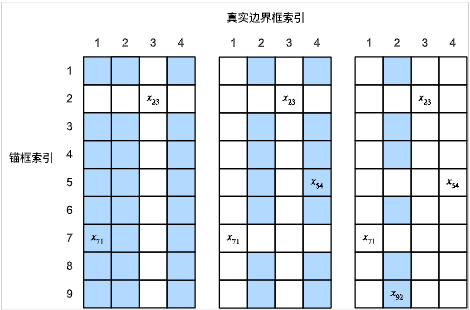

# 计算机视觉

## 13.1 图像增广

常用的有：翻转和裁剪，改变色调、亮度、饱和度等，

``` python
shape_aug = torchvision.transforms.RandomResizedCrop(
    (200, 200), scale=(0.1, 1), ratio=(0.5, 2))
apply(img, shape_aug)

color_aug = torchvision.transforms.ColorJitter(
    brightness=0.5, contrast=0.5, saturation=0.5, hue=0.5)
apply(img, color_aug)

augs = torchvision.transforms.Compose([
    torchvision.transforms.RandomHorizontalFlip(), color_aug, shape_aug])
apply(img, augs)
```

## 13.2 微调(fine-tuning)

> 应用迁移学习（transfer learning）将从源数据集学到的知识迁移到目标数据集。 例如，尽管ImageNet数据集中的大多数图像与椅子无关，但在此数据集上训练的模型可能会提取更通用的图像特征，这有助于识别边缘、纹理、形状和对象组合。 这些类似的特征也可能有效地识别椅子。

## 13.4 锚框



使用**非极大值抑制(NMS)预测边界框**

- 每个锚框预测一个边缘框
- NMS可以合并相似的预测
  - 选中非背景类的最大预测值
  - 去掉所有其他和它IoU值大于θ的预测
  - 重复上述过程直到所有预测要么被选中，要么被去掉
