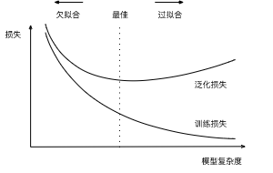
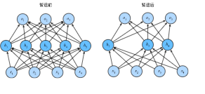

# 4 多层感知机

## 4.2 多层感知机的从零开始实现

理论部分可以参考其他书目，如：

> 《统计学习方法》 李航  
> 《最优化：建模、算法与理论》 刘浩洋、户将、李勇锋、文再文  
> 《机器学习》 周志华

> 4.1.1.3. 从线性到非线性  
> 注意在添加隐藏层之后，模型现在需要跟踪和更新额外的参数。 可我们能从中得到什么好处呢？ 你可能会惊讶地发现：在上面定义的模型里，我们没有好处！ 原因很简单：上面的隐藏单元由输入的仿射函数给出， 而输出（softmax操作前）只是隐藏单元的仿射函数。 仿射函数的仿射函数本身就是仿射函数， 但是我们之前的线性模型已经能够表示任何仿射函数。

要注意激活函数σ(⋅)在多层网络(多层感知机)中的作用，而这样的激活函数σ需要是非线性函数。最简单的ReLU(Rectified linear unit)函数就是在线性函数上修改的来的，且兼顾了运算复杂度。

> 使用ReLU的原因是，它求导表现得特别好：要么让参数消失，要么让参数通过。 这使得优化表现的更好，并且ReLU减轻了困扰以往神经网络的梯度消失问题（稍后将详细介绍）。

在这一节的中文网页中有几处错误：[4.2. 多层感知机的从零开始实现](https://zh-v2.d2l.ai/chapter_multilayer-perceptrons/mlp-scratch.html)，具体表现为训练画出的图中看不到train loss曲线

1. d2l包中封装的``train_epoch_ch3``函数出现错误(在[3.6. softmax回归的从零开始实现](https://zh-v2.d2l.ai/chapter_linear-networks/softmax-regression-scratch.html)中编写)。在GitHub中文版的[d2l-zh/d2l/torch.py](https://github.com/d2l-ai/d2l-zh/blob/master/d2l/torch.py)的函数能正确运行。
   
   - 可以直接修改``\home\u\miniconda3\lib\python3.9\site-packages\d2l\torch.py``中的``train_epoch_ch3``函数为
     
     ```python
     def train_epoch_ch3(net, train_iter, loss, updater):
     """训练模型一个迭代周期（定义见第3章）
     Defined in :numref:`sec_softmax_scratch`"""
     # 将模型设置为训练模式
     if isinstance(net, torch.nn.Module):
       net.train()
     # 训练损失总和、训练准确度总和、样本数
     metric = Accumulator(3)
     for X, y in train_iter:
       # 计算梯度并更新参数
       y_hat = net(X)
       l = loss(y_hat, y)
       if isinstance(updater, torch.optim.Optimizer):
           # 使用PyTorch内置的优化器和损失函数
           updater.zero_grad()
           l.mean().backward()
           updater.step()
       else:
           # 使用定制的优化器和损失函数
           l.sum().backward()
           updater(X.shape[0])
       metric.add(float(l.sum()), accuracy(y_hat, y), y.numel())
     # 返回训练损失和训练精度
     return metric[0] / metric[2], metric[1] / metric[2]
     ```
     
     <font color=#FF000>具体就是if语句中第一个反向传播错写为了</font> `l.sum().backward()`

2. 损失函数出错，GitHub中文版[多层感知机的从零开始实现](https://github.com/d2l-ai/d2l-zh/blob/master/chapter_multilayer-perceptrons/mlp-scratch.md)中有额外的reduction参数 `loss = nn.CrossEntropyLoss(reduction='none')`

正常来讲如果是用`pip install d2l-zh`就不会出问题的，正在纠结是不是要重新搞QAQ

## 4.3 多层感知机的简洁实现

损失函数同样出错了。

```python
def init_weights(m):
    if type(m) == nn.Linear:
        nn.init.normal_(m.weight, std=0.01)
```

在搭建好网络模型之后，一个重要的步骤就是对网络模型中的权值进行初始化。适当的权值初始化可以加快模型的收敛，而不恰当的权值初始化可能引发梯度消失或者梯度爆炸，最终导致模型无法收敛。

在这里，`std=0.01`改为0.1能更快地收敛。

多加一层，能够稍微提高一些准确率，但还不如提高`num_epochs`。  
在激活函数中，`nn.ReLU()`能比`nn.Sigmoid()`更快的收敛，但使用`nn.Sigmoid()`时，`train loss`与`test loss`贴合的要好很多。

```python
net = nn.Sequential(nn.Flatten(),
                    nn.Linear(784, 256),
                    nn.ReLU(),
                    nn.Linear(256, 20),
                    nn.ReLU(),
                    nn.Linear(20, 10))
```

## 4.4 模型选择、欠拟合和过拟合

估计模型容量  
模型容量主要由**参数的个数**与**参数值的选择范围**影响



## 4.5 权重衰退

[l1 相比于 l2 为什么容易获得稀疏解？](https://www.zhihu.com/question/37096933/answer/70938890)  
[l1 相比于 l2 为什么容易获得稀疏解？](https://www.zhihu.com/question/37096933/answer/475278057)  
[稀疏表达的意义在于？为什么稀疏表达得到广泛的应用？](https://www.zhihu.com/question/26602796/answer/33425052)  
[20 （理论+代码）理解模型正则化：L1正则、L2正则](https://zhuanlan.zhihu.com/p/113373391)

> l2是每次乘上一个小于1的倍数进行收敛，而l1是每次减去一个常数的线性收敛。所以l1更容易收敛到0而 l2只能收敛到比较小的值。

> 此外，你可能会问为什么我们首先使用L2范数，而不是L1范数。 事实上，这个选择在整个统计领域中都是有效的和受欢迎的。 L2正则化线性模型构成经典的*岭回归*（ridge regression）算法， L1正则化线性回归是统计学中类似的基本模型， 通常被称为*套索回归*（lasso regression）。 使用L2范数的一个原因是它对权重向量的大分量施加了巨大的惩罚。 这使得我们的学习算法偏向于在大量特征上均匀分布权重的模型。 在实践中，这可能使它们对单个变量中的观测误差更为稳定。 相比之下，L1惩罚会导致模型将权重集中在一小部分特征上， 而将其他权重清除为零。 这称为*特征选择*（feature selection），这可能是其他场景下需要的。

## 4.6 暂退法（Dropout）



> Dropout又可被翻译为丢弃法。

在刚被提出时，论文作者想法是将右网络当作左网络的子网络，通过dropout平均各个子网络得到更好的效果，而现在主流看法是将dropout当作一个正则项。

关于在本节定义模型的方法，可查阅`pytorch-tutorial`以及如下文章
> [在PyTorch中创建神经网络（逐句解释代码）](https://zhuanlan.zhihu.com/p/350512361)  
> [详解Pytorch中的网络构造](https://zhuanlan.zhihu.com/p/53927068)  
> [pytorch教程之nn.Module类详解——使用Module类来自定义模型](https://blog.csdn.net/qq_27825451/article/details/90550890)

网络框架（skeleton）建立完成之后，可以通过打印网络检查。

``` python
print(net)
print('+-'*40)
for name, parameters in net.named_parameters():
    print(name, ':', parameters.size())
```

```
Net(
  (lin1): Linear(in_features=784, out_features=256, bias=True)
  (lin2): Linear(in_features=256, out_features=256, bias=True)
  (lin3): Linear(in_features=256, out_features=10, bias=True)
  (relu): ReLU()
)
+-+-+-+-+-+-+-+-+-+-+-+-+-+-+-+-+-+-+-+-+-+-+-+-+-+-+-+-+-+-+-+-+-+-+-+-+-+-+-+-
lin1.weight : torch.Size([256, 784])
lin1.bias : torch.Size([256])
lin2.weight : torch.Size([256, 256])
lin2.bias : torch.Size([256])
lin3.weight : torch.Size([10, 256])
lin3.bias : torch.Size([10])
```

-------------------------------------------------------------

我觉得有必要给文章留一个时间戳，就从这篇开始吧。

可以利用markdown表格语法来实现时间戳右对齐。

``` markdown
| Syntax      | Description | Test Text     |
| :---        |    :----:   |          ---: |
| Header      | Title       | Here's this   |
| Paragraph   | Text        | And more      |
```

| Syntax      | Description | Test Text     |
| :---        |    :----:   |          ---: |
| Header      | Title       | Here's this   |
| Paragraph   | Text        | And more      |

``` markdown
|2022年3月5日|
|---:|
```

|2022年3月5日|
|---:|

## 4.7 前向传播、反向传播和计算图

机器学习的理论知识部分，已经在 2.5 自动微分 讲过一部分了。  
在直播课程中4.7和4.8是合为1节的。

## 4.8 数值稳定性和模型初始化

在通过链式法则计算梯度时：

> 我们容易受到数值下溢问题的影响. 当将太多的概率乘在一起时，这些问题经常会出现。 在处理概率时，一个常见的技巧是切换到对数空间， 即将数值表示的压力从尾数转移到指数。 不幸的是，上面的问题更为严重： 最初，矩阵  𝐌(𝑙)  可能具有各种各样的特征值。 他们可能很小，也可能很大； 他们的乘积可能非常大，也可能非常小。
不稳定梯度带来的风险不止在于数值表示； 不稳定梯度也威胁到我们优化算法的稳定性。 我们可能面临一些问题。 要么是梯度爆炸（gradient exploding）问题： 参数更新过大，破坏了模型的稳定收敛； 要么是梯度消失（gradient vanishing）问题： 参数更新过小，在每次更新时几乎不会移动，导致模型无法学习。

[矩阵求导的本质与分子布局、分母布局的本质（矩阵求导——本质篇）](https://zhuanlan.zhihu.com/p/263777564)

如果能将每一层的weight当作“随机变量”，将其方差固定在一个常数会是一个很好的选择。

> 如果不确保激活值的方差一致,激活值会一直震荡(比如,方差一直变大或者变小),导致网络除了要拟合特征的值,还要拟合数据本身的分布,增大网络的学习困难.

|2022年3月6日|
|---:|
