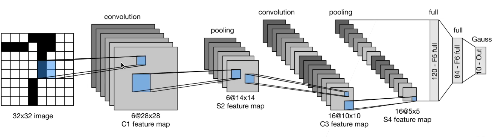
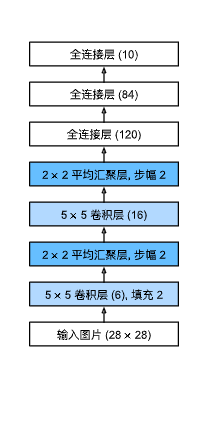

# 6 卷积神经网络

## 6.1 从全连接层到卷积

在实际运用卷积神经网络时，我们往往并不使用卷积，而是使用与之作用相同的互相关运算。

> 6.2.5. 互相关和卷积
> 回想一下我们在 6.1节中观察到的互相关和卷积运算之间的对应关系。 为了得到正式的卷积运算输出，我们需要执行 (6.1.6)中定义的严格卷积运算，而不是互相关运算。 幸运的是，它们差别不大，我们只需水平和垂直翻转二维卷积核张量，然后对输入张量执行互相关运算。
> 值得注意的是，由于卷积核是从数据中学习到的，因此无论这些层执行严格的卷积运算还是互相关运算，卷积层的输出都不会受到影响。 为了说明这一点，假设卷积层执行互相关运算并学习 图6.2.1中的卷积核，该卷积核在这里由矩阵 K 表示。 假设其他条件不变，当这个层执行严格的卷积时，学习的卷积核 K′ 在水平和垂直翻转之后将与 K 相同。 也就是说，当卷积层对 图6.2.1中的输入和 K′ 执行严格卷积运算时，将得到与互相关运算 图6.2.1中相同的输出。
> 为了与深度学习文献中的标准术语保持一致，我们将继续把“互相关运算”称为卷积运算，尽管严格地说，它们略有不同。 此外，对于卷积核张量上的权重，我们称其为元素。

## 6.2 图像卷积

### 学习卷积核

```python
# 构造一个二维卷积层，它具有1个输出通道和形状为（1，2）的卷积核
conv2d = nn.Conv2d(1,1, kernel_size=(1, 2), bias=False)

# 这个二维卷积层使用四维输入和输出格式（批量大小、通道、高度、宽度），
# 其中批量大小和通道数都为1
X = X.reshape((1, 1, 6, 8))
Y = Y.reshape((1, 1, 6, 7))
```

对于`nn.Conv2d`来说，第一个参数是输入通道数，第二个参数是输出通道数。

## 6.4 多输入多输出通道

`zip()`函数用于将可迭代的对象作为参数，将对象中对应的元素打包成一个个元组，然后返回由这些元组组成的列表。

```python
zipped = zip('abcdefg',range(3),range(5))
list(zip(*zipped))
```

`torch.stack()`函数沿着一个新维度对输入张量序列进行连接。 序列中所有的张量都应该为相同形状。可以指定堆叠的维度。

```python
t1 = torch.tensor([[1, 2, 3],
                 [4, 5, 6],
                 [7, 8, 9]])
t2 = torch.tensor([[10, 20, 30],
                 [40, 50, 60],
                 [70, 80, 90]])
print(torch.stack((t1,t2),dim=0).shape)
print(torch.stack((t1,t2),dim=1).shape)
print(torch.stack((t1,t2),dim=2).shape)
```

## 6.5 汇聚层

卷积对位置的敏感性不是一个很好的特性，这就是池化层的来由。池化层(pooling)也可被译为汇聚层。

> 池化层对特征图进行压缩。1.使特征图变小，简化网络计算复杂度，减少下一层的参数和计算量，防止过拟合；2.进行特征压缩，提取特征，保留主要的特征；保持某种不变性，包括平移、（旋转？）和尺度，尺度不变性也就是增大了感受野。

最大/平均池化层：也许可以理解为抖动求max，添加了对偏移的包容度。

> 至于为什么不做最小池化层： ~~大概是因为最小池化会损失掉特征。~~ 说不清，有好有坏。另外，池化层还有 `global pooling` 等其他类别。

[池化为什么使用平均或者最大，而不是用最小池化？](https://www.zhihu.com/question/325196490)

> 最小池化是有应用场景的，当关注图片的暗部时，可以使用最小池化：[Maxpooling vs minpooling vs average pooling](https://medium.com/@bdhuma/which-pooling-method-is-better-maxpooling-vs-minpooling-vs-average-pooling-95fb03f45a9)

池化层就现在的深度学习来说，已经用的越来越少了。

池化层的作用主要有

1. 可以通过`stride`减少计算量。
2. 让卷积层对位置没有那么敏感。

但作用1可以通过在卷积层添加`stride`来实现。另外，我们通常会对数据做大量的增强，添加很多扰动，使得卷积层不会很过拟合到某一个位置，也就淡化了作用2的效果。

池化层与正则是有区别的，正则是来控制模型的复杂度，而池化层在数据面做“扰动”。

## 6.6 卷积神经网络（LeNet）




1. LeNet是早期成功的神经网络
2. 先使用卷积层来学习图片空间信息
3. 然后使用全连接层来转换到类别空间

卷积神经网络(LeNet)的过拟合现象(overfitting)要比多层感知机(MLP)要少，是因为卷积层的模型复杂度要比全连接层低(卷积层相当于一个受限的全连接层)

附：`torch.optim.SGD()`

``` tex
\begin{aligned}
    &\rule{110mm}{0.4pt}                                                                 \\
    &\textbf{input}      : \gamma \text{ (lr)}, \: \theta_0 \text{ (params)}, \: f(\theta)
        \text{ (objective)}, \: \lambda \text{ (weight decay)},                          \\
    &\hspace{13mm} \:\mu \text{ (momentum)}, \:\tau \text{ (dampening)},\:nesterov\\[-1.ex]
    &\rule{110mm}{0.4pt}                                                                 \\
    &\textbf{for} \: t=1 \: \textbf{to} \: \ldots \: \textbf{do}                         \\
    &\hspace{5mm}g_t           \leftarrow   \nabla_{\theta} f_t (\theta_{t-1})           \\
    &\hspace{5mm}\textbf{if} \: \lambda \neq 0                                           \\
    &\hspace{10mm} g_t \leftarrow g_t + \lambda  \theta_{t-1}                            \\
    &\hspace{5mm}\textbf{if} \: \mu \neq 0                                               \\
    &\hspace{10mm}\textbf{if} \: t > 1                                                   \\
    &\hspace{15mm} \textbf{b}_t \leftarrow \mu \textbf{b}_{t-1} + (1-\tau) g_t           \\
    &\hspace{10mm}\textbf{else}                                                          \\
    &\hspace{15mm} \textbf{b}_t \leftarrow g_t                                           \\
    &\hspace{10mm}\textbf{if} \: nesterov                                                \\
    &\hspace{15mm} g_t \leftarrow g_{t-1} + \mu \textbf{b}_t                             \\
    &\hspace{10mm}\textbf{else}                                                   \\[-1.ex]
    &\hspace{15mm} g_t  \leftarrow  \textbf{b}_t                                         \\
    &\hspace{5mm}\theta_t \leftarrow \theta_{t-1} - \gamma g_t                    \\[-1.ex]
    &\rule{110mm}{0.4pt}                                                          \\[-1.ex]
    &\bf{return} \:  \theta_t                                                     \\[-1.ex]
    &\rule{110mm}{0.4pt}                                                          \\[-1.ex]
\end{aligned}
```

``` python
import torch
from . import _functional as F
from .optimizer import Optimizer, required


class SGD(Optimizer):
    r"""Implements stochastic gradient descent (optionally with momentum).

    .. math::
       \begin{aligned}
            &\rule{110mm}{0.4pt}                                                                 \\
            &\textbf{input}      : \gamma \text{ (lr)}, \: \theta_0 \text{ (params)}, \: f(\theta)
                \text{ (objective)}, \: \lambda \text{ (weight decay)},                          \\
            &\hspace{13mm} \:\mu \text{ (momentum)}, \:\tau \text{ (dampening)},\:nesterov\\[-1.ex]
            &\rule{110mm}{0.4pt}                                                                 \\
            &\textbf{for} \: t=1 \: \textbf{to} \: \ldots \: \textbf{do}                         \\
            &\hspace{5mm}g_t           \leftarrow   \nabla_{\theta} f_t (\theta_{t-1})           \\
            &\hspace{5mm}\textbf{if} \: \lambda \neq 0                                           \\
            &\hspace{10mm} g_t \leftarrow g_t + \lambda  \theta_{t-1}                            \\
            &\hspace{5mm}\textbf{if} \: \mu \neq 0                                               \\
            &\hspace{10mm}\textbf{if} \: t > 1                                                   \\
            &\hspace{15mm} \textbf{b}_t \leftarrow \mu \textbf{b}_{t-1} + (1-\tau) g_t           \\
            &\hspace{10mm}\textbf{else}                                                          \\
            &\hspace{15mm} \textbf{b}_t \leftarrow g_t                                           \\
            &\hspace{10mm}\textbf{if} \: nesterov                                                \\
            &\hspace{15mm} g_t \leftarrow g_{t-1} + \mu \textbf{b}_t                             \\
            &\hspace{10mm}\textbf{else}                                                   \\[-1.ex]
            &\hspace{15mm} g_t  \leftarrow  \textbf{b}_t                                         \\
            &\hspace{5mm}\theta_t \leftarrow \theta_{t-1} - \gamma g_t                    \\[-1.ex]
            &\rule{110mm}{0.4pt}                                                          \\[-1.ex]
            &\bf{return} \:  \theta_t                                                     \\[-1.ex]
            &\rule{110mm}{0.4pt}                                                          \\[-1.ex]
       \end{aligned}

    Nesterov momentum is based on the formula from
    `On the importance of initialization and momentum in deep learning`__.

    Args:
        params (iterable): iterable of parameters to optimize or dicts defining
            parameter groups
        lr (float): learning rate
        momentum (float, optional): momentum factor (default: 0)
        weight_decay (float, optional): weight decay (L2 penalty) (default: 0)
        dampening (float, optional): dampening for momentum (default: 0)
        nesterov (bool, optional): enables Nesterov momentum (default: False)

    Example:
        >>> optimizer = torch.optim.SGD(model.parameters(), lr=0.1, momentum=0.9)
        >>> optimizer.zero_grad()
        >>> loss_fn(model(input), target).backward()
        >>> optimizer.step()

    __ http://www.cs.toronto.edu/%7Ehinton/absps/momentum.pdf

    .. note::
        The implementation of SGD with Momentum/Nesterov subtly differs from
        Sutskever et. al. and implementations in some other frameworks.

        Considering the specific case of Momentum, the update can be written as

        .. math::
            \begin{aligned}
                v_{t+1} & = \mu * v_{t} + g_{t+1}, \\
                p_{t+1} & = p_{t} - \text{lr} * v_{t+1},
            \end{aligned}

        where :math:`p`, :math:`g`, :math:`v` and :math:`\mu` denote the
        parameters, gradient, velocity, and momentum respectively.

        This is in contrast to Sutskever et. al. and
        other frameworks which employ an update of the form

        .. math::
            \begin{aligned}
                v_{t+1} & = \mu * v_{t} + \text{lr} * g_{t+1}, \\
                p_{t+1} & = p_{t} - v_{t+1}.
            \end{aligned}

        The Nesterov version is analogously modified.
    """

    def __init__(self, params, lr=required, momentum=0, dampening=0,
                 weight_decay=0, nesterov=False):
        if lr is not required and lr < 0.0:
            raise ValueError("Invalid learning rate: {}".format(lr))
        if momentum < 0.0:
            raise ValueError("Invalid momentum value: {}".format(momentum))
        if weight_decay < 0.0:
            raise ValueError("Invalid weight_decay value: {}".format(weight_decay))

        defaults = dict(lr=lr, momentum=momentum, dampening=dampening,
                        weight_decay=weight_decay, nesterov=nesterov)
        if nesterov and (momentum <= 0 or dampening != 0):
            raise ValueError("Nesterov momentum requires a momentum and zero dampening")
        super(SGD, self).__init__(params, defaults)

    def __setstate__(self, state):
        super(SGD, self).__setstate__(state)
        for group in self.param_groups:
            group.setdefault('nesterov', False)

    @torch.no_grad()
    def step(self, closure=None):
        """Performs a single optimization step.

        Args:
            closure (callable, optional): A closure that reevaluates the model
                and returns the loss.
        """
        loss = None
        if closure is not None:
            with torch.enable_grad():
                loss = closure()

        for group in self.param_groups:
            params_with_grad = []
            d_p_list = []
            momentum_buffer_list = []
            weight_decay = group['weight_decay']
            momentum = group['momentum']
            dampening = group['dampening']
            nesterov = group['nesterov']
            lr = group['lr']

            for p in group['params']:
                if p.grad is not None:
                    params_with_grad.append(p)
                    d_p_list.append(p.grad)

                    state = self.state[p]
                    if 'momentum_buffer' not in state:
                        momentum_buffer_list.append(None)
                    else:
                        momentum_buffer_list.append(state['momentum_buffer'])

            F.sgd(params_with_grad,
                  d_p_list,
                  momentum_buffer_list,
                  weight_decay=weight_decay,
                  momentum=momentum,
                  lr=lr,
                  dampening=dampening,
                  nesterov=nesterov)

            # update momentum_buffers in state
            for p, momentum_buffer in zip(params_with_grad, momentum_buffer_list):
                state = self.state[p]
                state['momentum_buffer'] = momentum_buffer

        return loss

```
