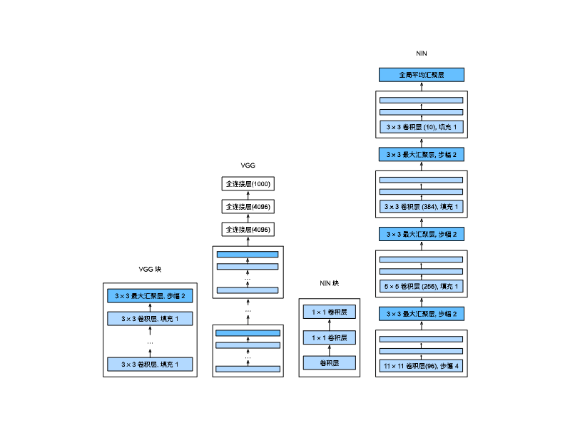

# 7 现代卷积神经网络

## 7.1 深度卷积神经网络（AlexNet）

AlexNet相对于LeNet的改进有：

1. 丢弃法
2. Sigmoid->ReLu
3. MeanPooling->MaxPooling
4. 隐藏全连接层后加入了丢弃层
5. 数据增强（手动在数据里加噪音？防止过拟合）

> AlexNet在训练时增加了大量的图像增强数据，如翻转、裁切和变色。 这使得模型更健壮，更大的样本量有效地减少了过拟合。

丢弃法是用来做模型的控制，因为AlexNet模型更大了，所以采用丢弃法来做模型的正则；ReLu相对于Sigmoid来说，梯度更大，且ReLu在零点处的一阶导更好，可以支撑更深的模型；MaxPooling取的是最大值，使得输出的值更大，梯度更大，使训练起来更容易。

LeNet仍然可以认为是一个机器学习的模型，而AlexNet规模增加了有几十倍，量变引起了质变，观念从特征提取转移到了通过CNN学习特征上。前者特征提取和网络是独立的，需要研究什么样的特征更适合网络模型，而后者分类器和特诊提取的模型是放在一起学习的。

> 2012年，AlexNet横空出世。它首次证明了学习到的特征可以超越手工设计的特征

## 7.2 使用块的网络（VGG）

* VGG-11使用可复用的卷积块构造网络。不同的VGG模型可通过每个块中卷积层数量和输出通道数量的差异来定义。
* 块的使用导致网络定义的非常简洁。使用块可以有效地设计复杂的网络。
* 在VGG论文中，Simonyan和Ziserman尝试了各种架构。特别是他们发现深层且窄的卷积（即$3 ×3$）比较浅层且宽的卷积更有效。

## 7.3 网络中的网络（NiN）

NIN架构

* 无全连接层
* 交替使用NiN块和步幅为2的最大池化层
  * 逐步减小搞宽和增大通道数
* 最后使用全局平均池化层得到输出
  * 其输入通道数是类别数

NiN目前来说用的不多。1×1卷积相当于对每个像素的通道数做全连接。

* NiN使用由一个卷积层和多个1×1卷积层组成的块。该块可以在卷积神经网络中使用，以允许更多的每像素非线性。
* NiN去除了容易造成过拟合的全连接层，将它们替换为全局平均汇聚层（即在所有位置上进行求和）。该汇聚层通道数量为所需的输出数量（例如，Fashion-MNIST的输出为10）。
* 移除全连接层可减少过拟合，同时显著减少NiN的参数。
* NiN的设计影响了许多后续卷积神经网络的设计。

---

* 总结一下这几个模型

1、全连接层很占内存  
2、卷积核越大越占内存  
3、层数越多越占内存  
4、模型越占内存越难训练  
得出一个结论：多用1×1、3×3卷积、 AdaptiveAvgPool2d替代全连接 既可以加快速度，又可以达到与全连接、大卷积核一样的效果。  
还有一个规律，就是图像尺寸减半，同时通道数指数增长，可以很好地保留特征。

## 7.4 含并行连结的网络（GoogLeNet）

GoogLeNet最重要的就是Inception块

* Inception块相当于一个有4条路径的子网络。它通过不同窗口形状的卷积层和最大汇聚层来并行抽取信息，并使用卷积层减少每像素级别上的通道维数从而降低模型复杂度。

* GoogLeNet将多个设计精细的Inception块与其他层（卷积层、全连接层）串联起来。其中Inception块的通道数分配之比是在ImageNet数据集上通过大量的实验得来的。

* GoogLeNet和它的后继者们一度是ImageNet上最有效的模型之一：它以较低的计算复杂度提供了类似的测试精度。

## 7.5 批量规范化

在使用一个很深的网络时，我们会发现，数据在入口处，而损失(SGD等)在出口，其中间隔了很深的网络。

在损失函数中，我们期望得到一个不那么大的梯度(防止梯度爆炸)，这就使得网络底层训练的很慢(梯度很小)，进而导致收敛变慢；网络顶层训练的很快，收敛很快，不过由于底层训练更新之后，顶层又需要不断重新训练。

批量归一化通过使每一层参数的均值和方差固定在一个分布里，那么可以看作每一层都是稳定的。在训练过程中，中间层的变化幅度不能过于剧烈，而批量规范化将每一层主动居中，并将它们重新调整为给定的平均值和大小

---

BN可以作用在

1. 全连接层和卷积层的输出上，激活函数之前
2. 全连接层和卷积层输入上

其中

1. 对于全连接层，作用在特征维
2. 对于卷积层，作用在通道维

总结：

1. 批量归一化固定小批量中的均值和方差，然后学习处适合的偏移和缩放
2. 可以加速收敛速度，但一般不改变模型精度
