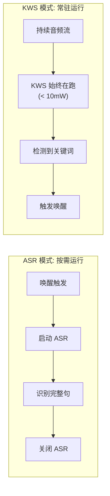
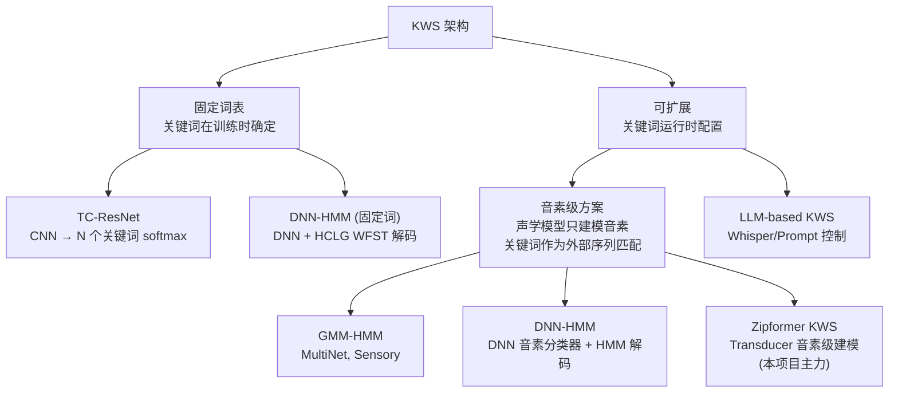
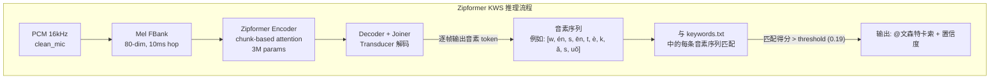
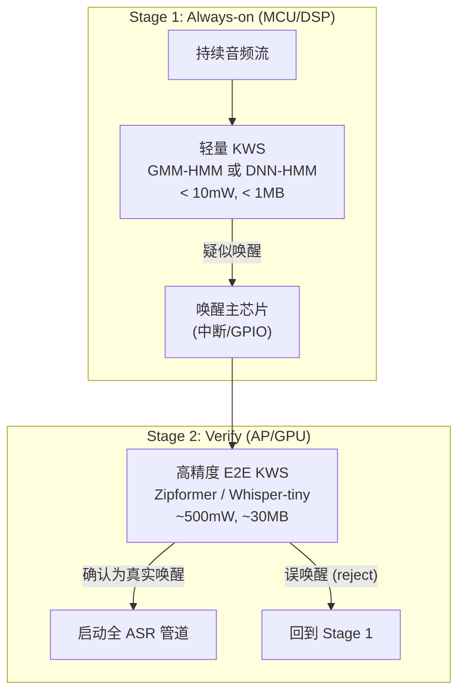

# 第 10 课：关键词检测 (KWS)

> **核心问题**：KWS 的目标不是"听清每一句话"（ASR），而是"在持续音频流中检测到特定关键词时唤醒系统"。这导致 KWS 的设计哲学与 ASR 截然不同——精度不是唯一指标，功耗和内存才是。
> **工程锚点**：本项目有三套 KWS 后端——Hexaware（硬件 6-mic 阵列）、Quardaware（硬件 4-mic 阵列）、Zipformer KWS（软件 Transducer）。三者在同一节点中通过 `/speech/awaken` 统一 topic 输出，体现了"多后端抽象"的工程智慧。

---

## 一、KWS 与 ASR 的本质区别

| 维度 | ASR | KWS |
|------|:---:|:---:|
| **词表** | 开放（成千上万词） | 封闭（1-20 个关键词） |
| **输出时机** | 持续输出文本流 | 仅当检测到关键词时触发一次 |
| **运行模式** | 按需启动（说话时） | **常驻运行**（always-on） |
| **核心约束** | 精度（CER）、延迟 | **功耗、内存、虚警率** |
| **典型硬件** | GPU / NPU | MCU / DSP / 低功耗协处理器 |
| **训练数据** | 海量配对数据（音频+文本） | 少量关键词录音 + 大量负样本（背景噪声） |



> **核心洞察**：KWS 的设计精髓不是"做一个更好的 ASR"，而是"用 ASR 1% 的功耗，做到 ASR 80% 的唤醒准确率"。这是一个**系统的工程权衡问题**，不是一个单纯的模型精度问题。

---

## 二、KWS 的核心评估指标

### FAR 与 FRR：不可兼得的双目标

| 指标 | 全称 | 含义 | 目标 |
|:---:|------|------|:---:|
| **FAR** | False Alarm Rate | 误唤醒率——没说话时系统错误触发 | < 1 次/小时 |
| **FRR** | False Reject Rate | 漏检率——说出唤醒词但系统没反应 | < 5% |
| **ROC 曲线** | Receiver Operating Characteristic | FAR vs FRR 的 tradeoff 曲线 | 曲线下面积 (AUC) 越大越好 |

**FAR 和 FRR 是跷跷板**：降低检测阈值 → FRR 下降（更容易唤醒），但 FAR 上升（更容易误唤醒）。KWS 模型设计的核心就是**在给定 FAR 约束下最小化 FRR**。

### 为什么 FAR 比 FRR 更"贵"

- FRR 的代价：用户多说一遍唤醒词（体验差，但可以挽回）
- FAR 的代价：误唤醒 → 启动全 ASR 管道 → 功耗暴涨 → 电池消耗 → 误触发的 TTS 回复 → 用户体验灾难

**工程惯例**：在保证 FAR < 1 次/小时的前提下，接受 FRR 在 3-10% 的范围。这是为什么唤醒词通常选择 3-4 音节（如 "Hey Siri"、"小度小度"）——更长→更难被随机噪声匹配→FAR 自然更低。

---

## 三、KWS 架构分类：固定词表 vs 可扩展

这是理解 KWS 世界的**第一性原理分类**：



**固定词表的优势**：精度最高（模型端到端优化关键词的分类边界）。
**可扩展的优势**：添加命令词零成本（加一行拼音），声学模型不变。

---

## 四、GMM-HMM 音素级 KWS（L0 级别）

这是最经典的可扩展 KWS 方案——MultiNet、Sensory TrulyHandsfree 等均属此类。

### 架构

```
训练:
  标注音频 "ni hao" → 强制对齐到音素 [n, i, h, ao] 
  → 为每个音素训练 GMM（课程2 的 EM 算法）
  → 产物: ~60 个音素的 GMM 参数 + 转移概率

推理:
  音频帧 → GMM 逐帧计算 60 个音素的后验概率
        → HMM Viterbi 解码: 在音素序列空间中搜索
        → 与命令词列表中的音素序列逐一做 DTW/动态规划匹配
        → 最高分者胜出
```

### 为什么在 MCU 上无可替代

| 属性 | 数值 | 原因 |
|------|:---:|------|
| 参数量 | ~60 个 GMM × 8 分量 × 39 维 MFCC × 对角协方差 ≈ 100-200KB | GMM 对角协方差只有 $O(d)$ 参数 |
| 推理 | 无矩阵乘法，只有查表 + 指数运算 | 可定点化（Q15），无需浮点单元 |
| 功耗 | < 10mW（ESP32 上实测） | 无 GPU，纯 CPU 整数运算 |

### 弱点

- 音素分类精度低（GMM 的表达能力有限，课程 4 已经讨论过）
- 对噪声敏感（训练时的"干净语音"假设在真实环境中失效）
- FAR 难以压到 < 1 次/小时

---

## 五、DNN-HMM 音素级 KWS（L1 级别）

把 GMM 换成小型 DNN（2-4 层 MLP 或轻量 CNN），保留 HMM 的音素状态建模和 DTW 序列匹配。

```
改进: GMM → DNN 逐帧音素后验
保留: HMM 状态转移 + 命令词列表的 DTW 匹配（可扩展性不变）
```

| 维度 | GMM-HMM | DNN-HMM |
|------|:---:|:---:|
| 模型大小 | 200KB | 1-5MB |
| 推理 FLOPs | < 1M/帧 | 10-50M/帧 |
| 音素分类精度 | ★★☆ | ★★★☆ |
| 可扩展性 | ✅ | ✅ |
| 适用硬件 | Cortex-M0~M4 | Cortex-M7, 低端 Linux |

> **实际产品**：Amazon Alexa 的 always-on 唤醒级使用的就是轻量 DNN-HMM（在 DSP 上运行），唤醒后由主 AP 上的 E2E 模型做确认。

---

## 六、Zipformer KWS：音素级 Transducer（L2 级别，本项目主力）

### 源码揭示的真相

explorer 从 `tokens.txt`（263 行）和 `keywords.txt`（10 个示例）中挖出了 Zipformer KWS 的真实架构：

```python
# tokens.txt 的 263 个 token 构成:
#   token 0: <blank>           ← 和 CTC 一样的 blank token
#   token 1: <unk>
#   token 2: <sos/eos>
#   tokens 3-72: 英语 CMU 音素 (AA0, AE1, B, CH, D, DH, ...)
#   tokens 73-262: 中文拼音音素 (ch, en, ia, ian, iang, ...)
```

```python
# keywords.txt 的格式:
#   音素序列 @关键词标签
L AY1 T AH1 P @LIGHT_UP              # "LIGHT UP" → 5 个 CMU 音素
L AH1 V L IY0 CH AY1 L D @LOVELY_CHILD
w én s ēn t è k ǎ s uǒ @文森特卡索     # "文森特卡索" → 10 个拼音音素
zh ōu w àng j ūn @周望军
```

### 架构推理



**关键设计**：

1. **音素级建模，非词级建模**：Decoder 输出的不是 "文森特卡索" 这个完整的词，而是 263 个音素 token 中的一个。这保留了可扩展性——任何中文/英文命令词，只要能用这 263 个音素表达，都可以加入 `keywords.txt`。

2. **Transducer 而非 CTC**：使用 RNN-T 的 encoder-decoder-joiner 三维（课程 6），而非纯 CTC。prediction network 提供了音素序列的内部语言约束，这使得输出更可能是"合理的音素序列"而非随机的音素排列。

3. **Beam search 配置**：
   ```yaml
   kws_keywords_score: 1.5       # 每个识别到的音素加分
   kws_keywords_threshold: 0.19  # 匹配度阈值（越高→越低FAR）
   ```

### 与 GMM-HMM 的对比

| 维度 | GMM-HMM (L0) | Zipformer KWS (L2) |
|------|:---:|:---:|
| **声学模型** | GMM 逐帧音素后验 | Zipformer Transducer 音素解码 |
| **序列建模** | HMM 状态转移 | Decoder self-attention + Joiner |
| **匹配方式** | DTW 动态规划 | Beam search + 阈值比较 |
| **流式** | ✅ 逐帧，天然流式 | ✅ chunk-based attention |
| **可扩展性** | ✅ 加拼音 | ✅ 加拼音 |
| **模型大小** | 200KB | ~30MB |
| **精度 (FAR=1)** | FRR 15-20% | FRR 3-5% |
| **功耗** | < 10mW | ~500mW (Jetson CPU) |
| **硬件** | ESP32 / Cortex-M | Jetson / 树莓派 / x86 |

---

## 七、E2E 固定词表 KWS（L4 级别）

### TC-ResNet：纯卷积的极简方案

```
音频 → 40-dim MFCC → 多层 Temporal Conv + Residual → Global AvgPool → N 个关键词的 softmax
```

**特点**：
- 模型极小（~300K 参数，< 1MB）
- 推理极快（< 1ms/帧，适合 MCU）
- 关键词在训练时 baked-in，**不可扩展**
- 精度高于 GMM-HMM，但低于 Zipformer KWS

**适用场景**：产品只有一个固定的唤醒词（如 "Hey Siri"），永远不需要改。Google 的 "OK Google" 早期版本就使用这类模型。

### 为什么固定词表模型不适合本项目

本项目的需求是**多命令词 + 随时可扩展**（"ni hao chen xing"、"bie shuo le"、"ting xia lai" 等），TC-ResNet 每次加命令都需要重新训练——这在产品迭代中不可接受。这就是为什么 sherpa-onnx 的 KWS 选择了**音素级 Transducer 架构**而非固定词分类器。

---

## 八、硬件 KWS（本项目 Hexaware / Quardaware）

本项目的两个硬件 KWS 后端是**黑盒设备**——它们的内部模型不开源，通过串口上报结果。

| 属性 | Hexaware | Quardaware |
|------|----------|------------|
| **麦克风** | 6-mic 阵列 | 4-mic 阵列 |
| **接口** | 串口 `/dev/wheeltec_mic` | 串口 `/dev/xvf3800_mic` |
| **协议** | 二进制帧 (header `0xA5`) | CDC JSON 行协议 |
| **输出** | 唤醒事件 + 声源角度 + 波束信息 | `cmd_detected` (命令ID, 短语, 概率) + DOA/VAD |
| **自动选择** | `/dev/wheeltec_mic` 存在 → Hexaware | 否则 → Quardaware |

**源码证据** (`kws_ros.cpp:271-292`)：

```cpp
// enable_aware 的自动选型逻辑
if (access("/dev/wheeltec_mic", F_OK) == 0) {
    enable_hexaware();   // 6-mic → 精度更高，角度信息更丰富
} else {
    enable_quardaware(); // 4-mic → 降级方案
}
```

硬件 KWS 的内部实现**大概率**是 GMM-HMM 或轻量 DNN-HMM——因为 MCU 级 DSP 上能跑的只有这些。它们充当了系统的**第一级 always-on 唤醒**，类似于 Google/Amazon 的 always-on DSP。

### 统一唤醒 Topic 的设计

```cpp
// 三个后端通过同一 topic 上报
// kws_ros.cpp 中 Hexaware 和 Quardaware 的唤醒事件都发布到:
/speech/awaken  (std_msgs/String)
```

**工程智慧**：无论底层是 6-mic 硬件还是 Zipformer 软件，上游模块（ASR/NLU）只订阅 `/speech/awaken`。更换硬件后端不需要修改任何上游代码——这正是第 4 课"松耦合"哲学的实践。

---

## 九、两阶段方案：工业界的实际架构



**实际产品映射**：

| 产品 | Stage 1 | Stage 2 |
|------|---------|---------|
| Amazon Alexa | Sensory TrulyHandsfree (DNN-HMM, DSP) | 云端 ASR 确认 |
| Google Assistant | "OK Google" 轻量模型 (DSP) | 设备端 E2E 确认 |
| 本项目 | Hexaware/Quardaware 硬件 | Zipformer KWS 软件确认（可选） |

---

## 十、方案选型决策树

```
你的硬件是？
├── MCU 级别 (ESP32, < 1MB RAM)
│   └── 需要可扩展？
│       ├── 是 → GMM-HMM (L0) ← 唯一可行选择
│       └── 否 → TC-ResNet (L4) ← 精度最高
│
├── 低端 Linux (树莓派, < 1GB RAM)
│   └── DNN-HMM (L1) 或 Zipformer KWS 量化版 (L2)
│
└── 边缘 AI 芯片 (Jetson, > 2GB RAM)
    ├── 需要可扩展 + 流式？
    │   └── Zipformer KWS (L2) ← 本项目的选择
    ├── 需要最高精度 + 多语言？
    │   └── Whisper-tiny KWS (L3)
    └── 需要极致功耗？
        └── 硬件 KWS (Hexaware/Quardaware) + Zipformer 两级
```

---

## 十一、实践环节

### 实验 1：Zipformer KWS 的 keywords.txt 编写

```python
# 模拟: 为你自己的命令词编写 Zipformer KWS 的 keywords.txt

# tokens.txt 中的中文拼音音素（部分）：
# ch, en, ia, ian, iang, iao, ie, in, ing, iong, iu, ...
# b, p, m, f, d, t, n, l, g, k, h, j, q, x, zh, sh, r, z, c, s

def pinyin_to_phonemes(text):
    """将中文拼音字符串分解为 Zipformer KWS 的音素序列"""
    # 简化示例——实际需要完整的音素映射表
    mapping = {
        "ni": ["n", "i"],
        "hao": ["h", "ao"],
        "chen": ["ch", "en"],
        "xing": ["x", "ing"],
        "bie": ["b", "ie"],
        "shuo": ["sh", "uo"],
        "le": ["l", "e"],
        "ting": ["t", "ing"],
        "xia": ["x", "ia"],
        "lai": ["l", "ai"],
    }
    result = []
    for word in text.split():
        if word in mapping:
            result.extend(mapping[word])
        else:
            print(f"警告: '{word}' 不在映射表中，需要手动分解")
    return result

# 示例
commands = ["ni hao chen xing", "bie shuo le", "ting xia lai"]
for cmd in commands:
    phonemes = pinyin_to_phonemes(cmd)
    keyword_line = " ".join(phonemes) + f" @{cmd.replace(' ', '_').upper()}"
    print(keyword_line)

# 输出:
# n i h ao ch en x ing @NI_HAO_CHEN_XING
# b ie sh uo l e @BIE_SHUO_LE
# t ing x ia l ai @TING_XIA_LAI
```

### 实验 2：FAR/FRR 的阈值调节模拟

```python
import numpy as np
import matplotlib.pyplot as plt

# 模拟: KWS 输出的 score 分布
np.random.seed(42)
n_trials = 10000

# 真实唤醒词: 高 score (均值 0.8)
wake_scores = np.clip(np.random.normal(0.8, 0.15, n_trials), 0, 1)

# 非唤醒词/噪声: 低 score (均值 0.15)
non_wake_scores = np.clip(np.random.normal(0.15, 0.1, n_trials), 0, 1)

# 扫描不同的阈值
thresholds = np.linspace(0.05, 0.95, 50)
far_rates = []
frr_rates = []

for thresh in thresholds:
    far = np.mean(non_wake_scores > thresh)  # 噪声被判为唤醒
    frr = np.mean(wake_scores < thresh)       # 唤醒被判为噪声
    far_rates.append(far)
    frr_rates.append(frr)

# 找出 FAR < 0.01 时的最佳 FRR
best_idx = np.where(np.array(far_rates) < 0.01)[0]
if len(best_idx) > 0:
    best_thresh = thresholds[best_idx[-1]]
    best_frr = frr_rates[best_idx[-1]]
    print(f"FAR < 1% 时: threshold={best_thresh:.2f}, FRR={best_frr:.1%}")

# 对应本项目的 kws_keywords_threshold = 0.19
print(f"本项目 threshold = 0.19")
print(f"  此时 FAR ≈ {far_rates[np.argmin(np.abs(thresholds - 0.19))]:.2%}")
print(f"  此时 FRR ≈ {frr_rates[np.argmin(np.abs(thresholds - 0.19))]:.2%}")
```

### 实验 3：Zipformer KWS 的三个 ONNX 文件解读

```python
# 回顾 kws_config.yaml 中的三个模型文件
model_files = {
    "Encoder": "encoder-epoch-13-avg-2-chunk-8-left-64.onnx",
    "Decoder": "decoder-epoch-13-avg-2-chunk-8-left-64.onnx",
    "Joiner":  "joiner-epoch-13-avg-2-chunk-8-left-64.onnx",
}

print("Zipformer KWS 的三个 ONNX 文件:")
for role, filename in model_files.items():
    print(f"  {role:<10}: {filename}")

print("\n对比 ASR 的三个文件 (课程6):")
print(f"  Encoder : encoder.int8.onnx")
print(f"  Decoder : decoder.onnx")
print(f"  Joiner  : joiner.int8.onnx")

print("\n关键差异:")
print("  1. KWS 的 encoder 文件名包含 'chunk-8-left-64'")
print("     → chunk_size=8, left_context=64 帧的流式配置")
print("  2. KWS 模型只有 3M 参数 (vs ASR 的 60-80M)")
print("     → 音素词表只有 263 个 token (vs ASR 的 6000+)")
print("     → 更轻量，适合常驻运行")
print("  3. KWS 输出的是音素序列，不是完整的中文字符")
```

---

## 十二、关键术语速查

| 术语 | 一句话定义 |
|------|-----------|
| **FAR** | False Alarm Rate——误唤醒率（没说话时系统触发），目标 < 1 次/小时 |
| **FRR** | False Reject Rate——漏检率（说出唤醒词但没反应），目标 < 5% |
| **ROC 曲线** | FAR vs FRR 的 tradeoff——KWS 模型设计的核心可视化工具 |
| **Always-on** | 常驻运行的极低功耗模式——KWS 区别于 ASR 的核心运行特征 |
| **音素级 KWS** | 声学模型只建模音素（~60 个），关键词作为外挂序列匹配——可扩展 |
| **固定词表 KWS** | 模型直接分类 N 个关键词——精度高但不可扩展 |
| **DTW** | Dynamic Time Warping——动态时间规整，GMM-HMM 中匹配音素序列的经典算法 |
| **两阶段 KWS** | Stage 1 (MCU, always-on) + Stage 2 (AP, verify)——商业产品的实际架构 |
| **Zipformer KWS** | 音素级 Transducer——本项目的主力软件 KWS，263 token 词表 + 可扩展命令词 |
| **硬件 KWS** | 专用 DSP/MCU 上的黑盒 KWS——本项目的 Hexaware (6-mic) 和 Quardaware (4-mic) |

---

## 十三、下一步

### 推荐阅读

- **Chen et al. (2014)** — "Small-footprint Keyword Spotting Using Deep Neural Networks" — DNN-HMM 用于 KWS 的经典论文
- **sherpa-onnx KWS 文档** — [kws transducer models](https://k2-fsa.github.io/sherpa/onnx/kws/pretrained_models/index.html) — 预训练模型列表和使用方法
- **Hey Snips!** — Snips 的 KWS 开源方案（TC-ResNet 实现）

### 下节预告

[**第 11 课：神经语音合成 (TTS)**](./第_11_课：神经语音合成-TTS.md) — 从 WaveNet 到 VITS 到 Kokoro。拼接合成→参数合成→神经声码器→端到端 TTS 的演进。Kokoro 的 Text2Mel + Vocoder 架构，Matcha 的流式轻量方案，以及为什么 TTS 必须使用 `tee_playback`（而不是 `dmix_safe`）——这关系到 AEC 是否能正常工作。

> **有疑问？** 可以问我 FAR/FRR 的统计基础（为什么不能同时为 0）、DTW 和 CTC 在序列匹配上的对偶关系、或者为什么硬件 KWS 的源码不开源——这背后的商业模式和供应链逻辑。
