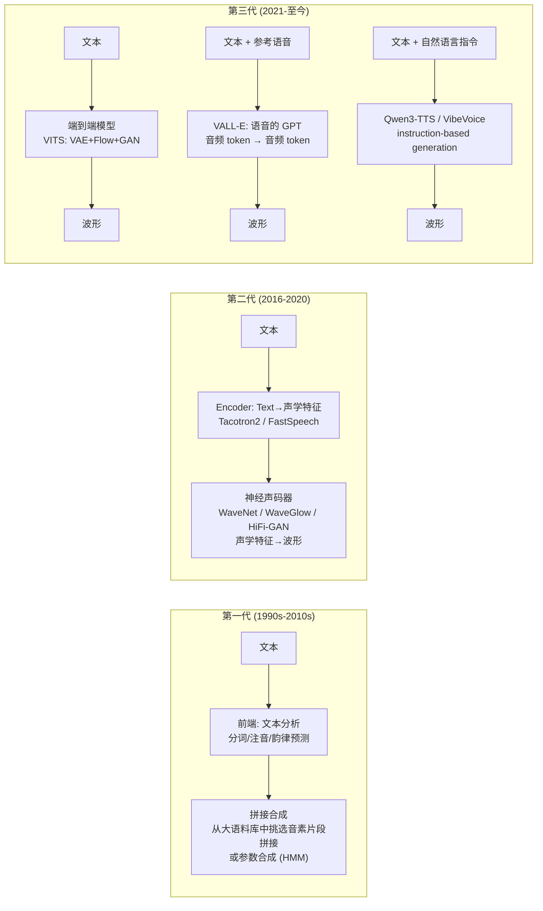
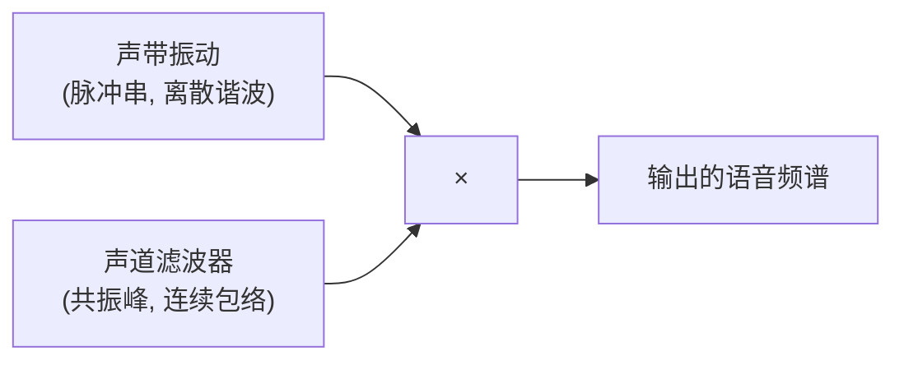
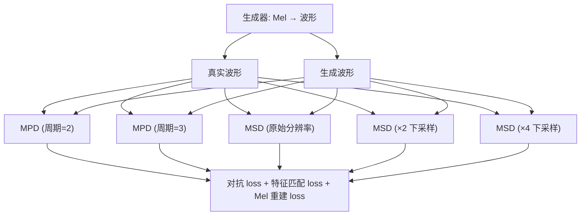
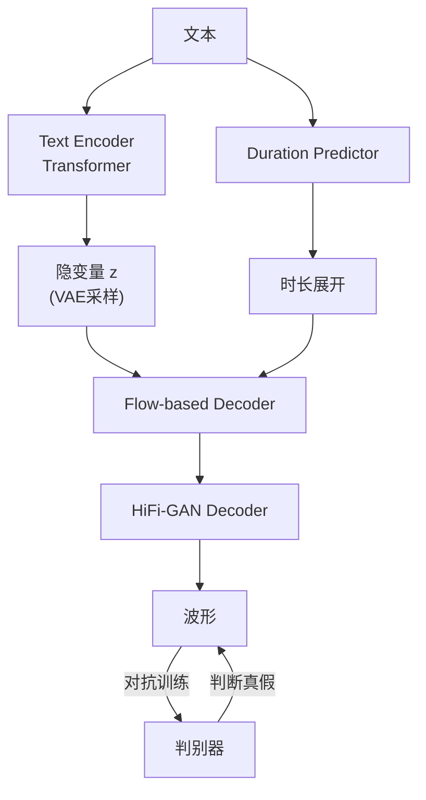
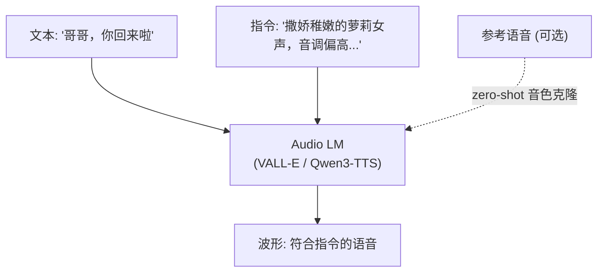
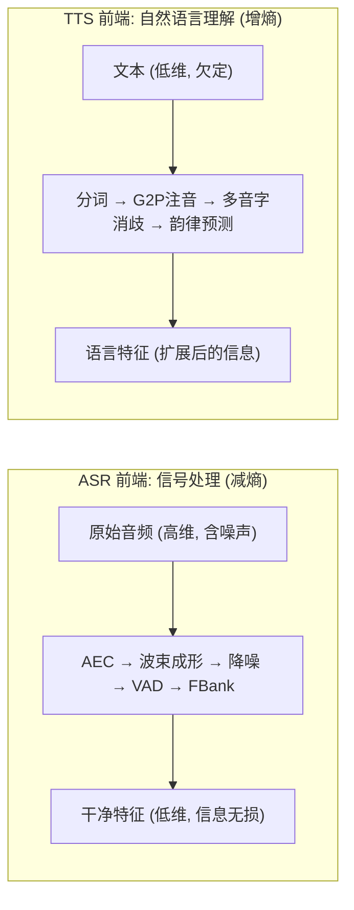
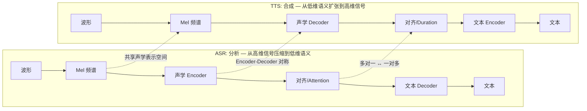
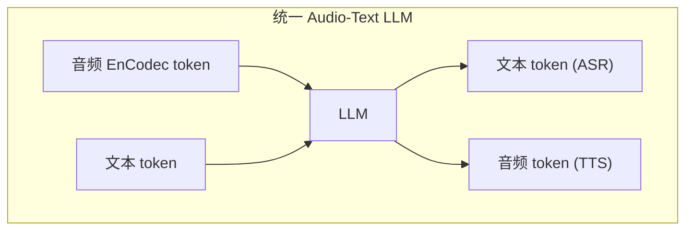

# 第 11 课：神经语音合成 (TTS)

> **核心问题**：ASR 是"听到什么写什么"，TTS 是"看到什么说什么"。这是语音管道中最接近**生成模型**的一环——不是分类或序列标注，而是从文本生成高维连续波形。现代 TTS 经历了从拼接合成到神经声码器到 LLM-based voice generation 的三次范式跃迁。
> **工程锚点**：本项目有两套 TTS 引擎——Kokoro（24kHz 高质量，CUDA 推理）和 Matcha（16kHz 轻量，CPU 推理）。TTS 的输出设备必须是 `tee_playback`（而非 `dmix_safe`），否则 AEC 失效——这是第 3 课的 AEC 理论在工程中的直接体现。

---

## 一、TTS 的演进：三次范式跃迁



| 代际 | 代表 | 核心思想 | 音质 |
|:---:|------|---------|:---:|
| 1 | 拼接合成, HMM 参数合成 | 从数据库挑音素拼接，或用 HMM 参数驱动声码器 | ★★☆ |
| 2 | Tacotron2 + WaveNet | 神经网络生成声学特征 + 神经声码器还原波形 | ★★★★ |
| 3 | VITS, VALL-E, Qwen3-TTS | 端到端生成，LLM 驱动，自然语言控制音色 | ★★★★★ |

---

## 二、语音生成的理论基础

> 在深入具体架构前，必须理解三个第一性原理：**语音是如何物理产生的**（决定了 TTS 的中间表示为什么选择 Mel 频谱）、**生成模型如何从噪声中采样出结构**（VAE/Flow/GAN 的数学本质）、**最优传输如何解决对齐问题**（Matcha 轻量化的核心）。

### 2.1 语音产生的声学模型：Source-Filter Theory

人类发声是一个二阶段过程——这是 TTS 选择 Mel 频谱作为中间表示的根本原因。

**声源 (Source)**：声带振动产生准周期脉冲串（浊音）或气流紊流（清音）。声源的频谱是**离散的谐波**：

$$S_{\text{source}}(f) = \sum_{k=1}^{\infty} A_k \cdot \delta(f - k \cdot F_0)$$

其中 $F_0$ 是基频（pitch），男性 ~120Hz，女性 ~220Hz，儿童 ~300Hz。

**滤波器 (Filter)**：声道（口腔+鼻腔+咽喉）作为一个时变共振腔，对声源施加**频谱包络**：

$$S_{\text{output}}(f) = S_{\text{source}}(f) \cdot |H_{\text{vocal tract}}(f)|$$



**共振峰 (Formants)**：声道滤波器的共振频率——$F_1, F_2, F_3$。它们决定了"这是什么元音"：

| 元音 | $F_1$ (Hz) | $F_2$ (Hz) | 听感 |
|------|:--------:|:--------:|------|
| /i/ (衣) | 300 | 2300 | 高、尖 |
| /a/ (啊) | 800 | 1200 | 低、开 |
| /u/ (乌) | 300 | 700 | 低沉 |

**Source-Filter 理论对 TTS 的启示**：
1. Mel 频谱的 80 维足以表示**滤波器包络**（共振峰位置+形状）——这是"什么音"的全部信息
2. 声源细节（基频、谐波结构）由声码器从 Mel 频谱中**推断**——HiFi-GAN 的判别器正是在学习这个推断
3. 这也是为什么 Mel 频谱是 TTS 和 ASR（课程 2）的**共同中间表示**——ASR 只需要滤波器包络来识别音素，TTS 则需要从滤波器包络重建完整的声源+滤波信号

### 2.2 VAE：隐变量的连续生成

VITS 的核心组件 VAE 回答：**如何从一个低维噪声向量采样出多样化的语音**？

**标准自编码器的问题**：给定文本，自编码器产生唯一确定的输出——每次说"你好"都完全一样，没有音调、语速、情感的多样性。

**VAE 的解决方案**：不直接输出 Mel 频谱，而是输出**隐变量 $z$ 的分布参数**：

$$z \sim \mathcal{N}(\mu_{\text{encoder}}(x), \sigma_{\text{encoder}}(x)^2)$$

**Evidence Lower Bound (ELBO)**——VAE 的训练目标：

$$\log p(x) \geq \underbrace{\mathbb{E}_{z \sim q(z|x)}[\log p(x|z)]}_{\text{重建误差：生成的语音要像原文}} - \underbrace{D_{\text{KL}}(q(z|x) \| p(z))}_{\text{正则化：z 的分布要接近标准正态}}$$

**Reparameterization Trick**——让采样可微分：

$$z = \mu + \sigma \cdot \epsilon, \quad \epsilon \sim \mathcal{N}(0, 1)$$

```python
# VAE 的核心：从分布中采样，但保持可微分
mu, log_var = encoder(text)           # [batch, latent_dim]
std = torch.exp(0.5 * log_var)
eps = torch.randn_like(std)
z = mu + std * eps                    # reparameterization: 梯度可通过这行反向传播
x_recon = decoder(z)                  # 重建 Mel 频谱
```

**在 TTS 中的意义**：$z$ 的不同采样 → 同一文本的不同韵律、音调、说话节奏。$z$ 的某些维度可能编码了"语速"，另一些维度编码了"情感强度"——这是**无监督的 disentanglement**。

### 2.3 Normalizing Flow：可逆变换的魔力

VITS 的第二核心组件——在 VAE 的隐变量和 Mel 频谱之间架一座**可逆的桥**。

**问题**：VAE 假设 $p(z)$ 是简单的标准正态分布，但真实语音的隐变量分布极其复杂（多模态、偏态）。简单的 VAE 解码器难以完美映射。

**Flow 的解决方案**：用一系列**可逆变换**将简单分布逐步"扭曲"成复杂分布：

$$z_0 \sim \mathcal{N}(0, 1) \xrightarrow{f_1} z_1 \xrightarrow{f_2} z_2 \xrightarrow{f_3} \cdots \xrightarrow{f_K} z_K = x$$

每个 $f_i$ 是一个**可逆**的神经网络层，通过 **Change of Variables 公式**保持概率归一化：

$$\log p_X(x) = \log p_Z(f^{-1}(x)) + \sum_{i=1}^{K} \log \left| \det \frac{\partial f_i^{-1}}{\partial z_i} \right|$$

**Jacobian 行列式项的直觉**：$|\det|$ 衡量 $f_i$ 在局部的"体积变化率"。如果 $f_i$ 把两个接近的 $z$ 值拉开很远，$|\det|$ 就很大——概率密度被"稀释"了。

> **工程选择**：为什么 VITS 使用 Flow 而非简单的 MLP？因为 Flow 的可逆性保证了从文本→隐变量（正向）和从噪声→波形（反向）都可以精确计算概率——这对于 VAE 的 ELBO 训练是必需的。FLOW 的每一层通常使用**仿射耦合层 (affine coupling layer)**，其 Jacobian 是三角矩阵，$|\det|$ 极容易计算。

### 2.4 GAN：对抗训练保证高频细节

HiFi-GAN 和 VITS 的声码器端使用 GAN 来避免"过度平滑"——这是纯 L1/L2 重建 loss 的固有问题。

**GAN 的 Minimax 游戏**：

$$\min_G \max_D \; \mathbb{E}_{x \sim p_{\text{real}}}[\log D(x)] + \mathbb{E}_{z \sim p(z)}[\log(1 - D(G(z)))]$$

- **生成器 G**：尽量生成能骗过判别器的波形
- **判别器 D**：尽量区分真实波形和生成波形

**多尺度判别器 (MSD)**：在不同分辨率下判别——粗尺度判别"整体节奏对不对"，细尺度判别"高频齿音有没有"。

**多周期判别器 (MPD)**：在不同周期长度下判别——捕捉 $F_0$ 的周期性结构（2ms 周期 ~500Hz vs 10ms 周期 ~100Hz）。



> **为什么纯 L1 loss 不够？** L1 在统计上趋向于预测**所有可能波形的平均**——而"所有可能波形的平均" = 模糊的、过度平滑的波形（丢失了高频细节）。GAN 的判别器迫使生成器走极端——要么"看起来完全真实"，要么被惩罚。

### 2.5 最优传输 (Optimal Transport)：Matcha 轻量化的核心

Matcha 的关键创新是用 **Optimal Transport** 替代 VITS 的 MAS (Monotonic Alignment Search)。

**问题形式化**：给定文本帧 $\{x_i\}_{i=1}^{N}$ 和 Mel 帧 $\{y_j\}_{j=1}^{M}$，找最优的**软对齐**（每对 $(i,j)$ 该分配多少"注意力"）。

**OT 的数学**：

$$\min_{\gamma \in \Gamma(\mu, \nu)} \sum_{i,j} \gamma_{ij} \cdot c(x_i, y_j)$$

其中：
- $\gamma_{ij}$ 是"文本帧 $i$ 对应 Mel 帧 $j$ 的对齐量"
- $c(x_i, y_j)$ 是"将文本帧 $i$ 映射为 Mel 帧 $j$ 的代价"（通常用余弦距离）
- $\Gamma(\mu, \nu)$ 是所有可能对齐方案的集合（满足边际分布的约束）

**为什么 OT 比 MAS 快**：MAS 需要动态规划搜索最佳对齐路径——$O(NM)$。Sinkhorn 算法（带熵正则化的 OT）可以近似求解，复杂度远低于 DP，且可以用 GPU 矩阵乘法实现。

```python
# Sinkhorn 算法的核心迭代（伪代码）
K = torch.exp(-C / epsilon)  # Gibbs kernel
u = torch.ones(N) / N
v = torch.ones(M) / M
for _ in range(num_iters):
    u = mu / (K @ v)          # 缩放行
    v = nu / (K.T @ u)        # 缩放列
gamma = u[:, None] * K * v[None, :]  # 最终的对齐矩阵
```

> **Matcha 的工程智慧**：OT 对齐**只在训练时**使用（为 Duration Predictor 提供 ground truth）。推理时完全不需要对齐计算——这一步是"零延迟"的。

### 2.6 音频编解码器：VALL-E 的 Token 化基础

LLM-based TTS 需要将连续波形离散化为**有限个 token**——EnCodec (Meta) 和 SoundStream (Google) 就是做这件事的。

**EnCodec 架构**：

```
波形 [T_samples] → 卷积 Encoder → 残差向量量化 (RVQ) → 离散 token [T_frames, n_codebooks]
                                                              ↓
                                                   GPT/LLM 自回归生成
                                                              ↓
波形 [T_samples] ← 卷积 Decoder ← 反量化 ← 生成的 token [T_frames, n_codebooks]
```

**残差向量量化 (RVQ)**：第一层 codebook 编码波形的"主干"信息（低频包络），第二层编码"残差"（中频细节），第三层编码"残差的残差"（高频细节）... 这种分层压缩使得重建质量随层数单调递增。

**为什么 EnCodec 使用 75 Hz 的帧率**：
- 语音的 Mel 频谱通常用 100 Hz 帧率（10ms hop）
- EnCodec 的 75 Hz 意味着 ~13.3ms 一帧——比 Mel 稍稀疏，但**每帧的维度更高**（128 × 8 codebooks = 1024 bits）
- 75 × 8 = 600 tokens/s——GPT 每秒需要生成 600 个 token 才能实时。这就是 VALL-E 生成极慢的根本原因

---

## 三、神经声码器：频谱→波形的桥梁

TTS 的两阶段架构（第一~二代）的核心组件：**声码器 (Vocoder)** 将**低维声学特征（Mel 频谱）**还原为**高维 PCM 波形**。

### 为什么需要声码器？

```
文本 "你好" → text encoder → 声学特征 [T_frames, 80] (Mel频谱)
                                  ↓
                          声码器 (Vocoder)
                                  ↓
                          PCM 波形 [T_samples] (24000 Hz)
```

Mel 频谱只有 80 维/帧，而原始波形是 24000 采样点/秒——声码器要完成 **300:1 的上采样**。

### 经典声码器对比

| 声码器 | 架构 | 推理速度 | 音质 | 命运 |
|--------|------|:-----:|:---:|------|
| **Griffin-Lim** | 迭代相位估计 | 快 | ★★☆ | Tacotron1 时代的过渡方案 |
| **WaveNet** (2016) | 自回归 PixelCNN，逐采样点生成 | 极慢 (24000 步/秒) | ★★★★★ | 被后续方案取代 |
| **WaveGlow** (2018) | Flow-based，并行生成 | 快 | ★★★★ | 模型太大（~100MB 权重） |
| **HiFi-GAN** (2020) | GAN 生成器+多尺度判别器 | **极快** | ★★★★☆ | **现代 TTS 的主流选择** |
| **Vocos** (2023) | 频域 GAN（STFT 判别器） | 极快 | ★★★★★ | 新一代，本项目可考虑升级 |

**HiFi-GAN 的设计精髓**：

```
Mel频谱 → 转置卷积（逐层上采样）→ 多尺度残差块 → 波形
                                    ↓
                   多周期判别器 (MPD) + 多尺度判别器 (MSD)
                   判别生成的波形 vs 真实波形
```

### 声码器速度对 TTS 延迟的影响

这是第 17 课（端到端延迟）的前置知识：

| 声码器 | 生成 1 秒音频耗时 (GPU) | 生成 1 秒音频耗时 (CPU) | TTFS 贡献 |
|--------|:-------------------:|:-------------------:|:-------:|
| HiFi-GAN | ~5ms | ~100ms | 低 |
| Vocos | ~3ms | ~60ms | 极低 |
| WaveNet | ~10s（不可用） | ~60s | 不可接受 |

> **本项目的 Kokoro 使用的声码器就是 HiFi-GAN 的变体**——在 Jetson GPU 上 24kHz 合成几乎实时。

---

## 四、自回归 TTS：Tacotron2

Tacotron2 (Google, 2017) 是第二代 TTS 的标杆——和 LAS（课程 7）形成完美的对称：LAS 是"语音→文本"的 Attention Seq2Seq，Tacotron2 是"文本→语音"的 Attention Seq2Seq。

```
文本 "Hello world!" 
  → Character Embedding → 3 层 Conv → Bi-LSTM Encoder
  → Location-Sensitive Attention → LSTM Decoder (自回归)
  → 每步输出: Mel 频谱的一帧 [80-dim]
  → 完整 Mel 频谱 → WaveNet 声码器 → 波形
```

**核心创新**：Location-Sensitive Attention。和课程 7 的普通 attention 不同，它在计算注意力权重时额外考虑**上一帧的注意力位置**——这确保了 TTS 的输出是"从左到右顺序推进"的，不会出现 attention 跳跃（同一个字被重复读或跳过）。

**Tacotron2 的自回归瓶颈**：
- 生成 100 帧 Mel 频谱需要 100 次 decoder 前向传播——串行不可并行
- 生成长句（> 50 字）的延迟不可接受

---

## 五、非自回归 TTS：FastSpeech

FastSpeech (Microsoft, 2019) 是 TTS 的"Attention → Transformer"时刻——就像第 7 课中 RNN 被 Transformer 取代一样。

**核心 trick**：**Duration Predictor**——预测每个音素应该持续多少帧。

```
文本 "Hello" → 音素序列 [h, ə, l, oʊ] 
       ↓
Duration Predictor: → [3帧, 2帧, 4帧, 5帧]
       ↓
展开音素序列: [h, h, h, ə, ə, l, l, l, l, oʊ, oʊ, oʊ, oʊ, oʊ]
       ↓
Feed-Forward Transformer → 并行生成所有帧的 Mel 频谱
```

**为什么这是革命性的**：
- Tacotron2: $T_{\text{frames}}$ 次串行 decoder 推理
- FastSpeech: **1 次** 并行前向传播——速度提升 270×

**FastSpeech2 的改进**：不只预测 duration，还预测 **pitch（音高）**和 **energy（能量）**——这两个参数直接控制声音的抑扬顿挫。

---

## 六、VITS：第三代的端到端 TTS

VITS (Kakao, 2021) 把 FastSpeech2 + HiFi-GAN 合并成一个**端到端模型**，用 VAE + Normalizing Flow 做隐变量建模。



**VITS 的三大组件在一个 loss 下联合训练**：
1. **VAE**：确保隐变量 $z$ 有多样性（不同说话风格）
2. **Flow**：将简单的先验分布映射为复杂的语音分布
3. **GAN**：对抗训练保证高频细节的真实性（避免"过度平滑"）

**VITS 对本项目的影响**：Kokoro 借鉴了 VITS 的端到端设计思路，但使用了专门的 Text2Mel encoder + HiFi-GAN vocoder 分离架构，原因是在 Jetson 上分离式架构更灵活（可以单独升级声码器）。

---

## 七、本项目引擎：Kokoro vs Matcha 的设计对比

### Kokoro（主力，高质量）

```yaml
# kokoro_tts_config.yaml
model_type: "kokoro"
sample_rate: 24000               # 24kHz 输出（比电话质量 8kHz 好 3 倍）
provider_name: "cuda"            # GPU 推理
device_name: "tee_playback"      # ⚠ 必须是 tee_playback，不能是 dmix_safe
default_sid: 15                  # Speaker ID (音色选择)
default_speed: 1.3               # 语速 (0.5~2.0)
```

**架构**：
```
文本 → Text2Mel (基于 VITS 设计) → Mel 频谱 [T, 80] @ 24kHz
     → HiFi-GAN Vocoder → PCM Float32 [T_samples] @ 24kHz
     → Resampler (24kHz → 16kHz) → tee_playback
```

**Speaker ID (SID) 的实质**：一个可学习的 embedding 向量（如 dim=256），在训练时和文本特征 concat。不同的 SID 对应不同的音色（男/女/儿童）。SID 空间中的**向量距离**对应音色的相似度——这是个隐式的"音色空间"。

### Matcha（轻量，快速）

```yaml
model_type: "matcha"
sample_rate: 16000               # 16kHz，不需要重采样
provider_name: "cpu"             # CPU 推理
```

**架构**：基于 **Matcha-TTS**——一种轻量非自回归 TTS，使用 optimal transport 做时长匹配。比 Kokoro 快 3-5×，但音质略低。适合不需要 GPU 的场景（Jetson CPU 推理）。

#### Matcha 为什么比 Kokoro 快 3-5×？

Matcha 的轻量来自三个层面（与第二节的理论基础直接对应）：

**1. 对齐方式：OT 一次计算 vs MAS 迭代搜索**

| | Kokoro (VITS) | Matcha |
|--|:---:|:---:|
| 对齐算法 | MAS (DP 搜索，$O(T_{\text{text}} \times T_{\text{mel}})$) | OT (Sinkhorn 迭代，GPU 并行) |
| 训练时 | MAS 每步都要搜索 | OT 一次性矩阵乘法 |
| 推理时对齐 | ⚠ 仍需隐式对齐 (Flow 内部) | ✅ 完全由 Duration Predictor 替代，**零对齐计算** |

**2. Decoder 复杂度：Flow 多步 vs 单次前向**

```
Kokoro (VITS):
  文本 → encoder → Flow层1 → Flow层2 → ... → Flow层K → HiFi-GAN → 24kHz波形
  每层Flow都包含仿射耦合 + 1×1卷积，K=4~8层

Matcha:
  文本 → encoder → Duration Predictor → Feed-Forward Decoder(1次) → HiFi-GAN → 16kHz波形
  没有Flow层，非自回归一次性生成所有帧
```

**3. 采样率：24kHz vs 16kHz 的 1.5× 波形点**

Kokoro 每秒生成 24000 个采样点，Matcha 生成 16000 个——HiFi-GAN 的逐层上采样卷积要处理的输出少 33%。这是一个"免费"的加速。

#### 量化/小模型的音频劣化：为什么会有"巡巡"和"吞字"？

模型参数量减少和 INT8/INT4 量化后，TTS 常见的两类退化：

**退化 1：自回归循环——"巡巡巡..."**

Kokoro 的 Text2Mel decoder 如果采用自回归模式，量化噪声会引发 stuck-in-loop：

```
FP16 正常:
  decoder → logit["巡"]=0.02, logit["逻"]=0.30 → softmax → "逻" ✓

INT8 量化后:
  decoder → logit["巡"]=0.01, logit["逻"]=0.27 → logit 差被截断
  → softmax 后 "巡" 的概率仍然最高 → 再次输出 "巡" → "巡巡巡..."
```

**根因**：自回归解码的下一步 logit 依赖上一步的输出 embedding。量化在 embedding 层引入的微小扰动，通过自回归循环**累积放大**——类似于第 5 课 CTC 中讨论的条件独立假设被打破后的误差传播。

**退化 2：Duration Predictor 量化——"天气晴ang"（吞字/尾音畸变）**

非自回归 TTS 的 Duration Predictor 对量化**极度敏感**：

```
FP16 Duration Predictor:
  "晴" → 3.8 帧 → ceil → 4 帧 (40ms)
  "朗" → 4.6 帧 → ceil → 5 帧 (50ms)
  → 生成 9 帧 → HiFi-GAN → "晴朗" ✓

INT8 Duration Predictor:
  "晴" → 3.1 帧 → ceil → 4 帧 ✓ (勉强保住)
  "朗" → 3.6 帧 → ceil → 4 帧 ✗ (损失了 1 帧 → 损失了韵尾)
  → 生成 8 帧 → HiFi-GAN 在不足的帧数上拉伸 → "晴a~ng" (尾音被截断)
```

**为什么 Duration Predictor 对量化特别敏感？**

Duration Predictor 预测的是**小整数**（2-8），量化误差的波动很容易跨越 ceil 的决策边界。`ceil(3.6) → 4` 和 `ceil(3.1) → 4` 碰巧一致，但 `ceil(3.1) → 4` 和 `ceil(4.8) → 5` 已经差了 20% 的时长。

**为什么 Kokoro 比 Matcha 更抗量化？**

- Kokoro (VITS)：时长是**隐式**学习的（在 Flow 层的内部表示中），没有显式的 Duration Predictor。量化噪声被多层 Flow 变换"稀释"了。
- Matcha：时长是**显式**预测的（一个独立的 Duration Predictor 模块），量化直接作用在这个模块的输出上——误差无处可逃。

#### 多音字消歧：TTS 的 NLU 问题

TTS 必须在**推理时**解决多音字——不能依赖外部 NLU 模块。

**问题实例**：

```
"保存为/什么名字" → G2P: bǎo cún wèi shén me míng zì  ✓ (正确)
"保存/为什么/名字" → G2P: bǎo cún wéi shí me míng zì   ✗ (错误)

区分依据: "为" 在 "保存为" 中是系动词 (wèi)，不是 "为什么" 的疑问词 (wéi)
```

**本项目的实际方案**：

在 Kokoro 配置中：

```yaml
lexicon: "kokoro-multi-lang-v1_1/lexicon-zh.txt"      # 手工标注的多音字词典
rule_fsts: "date-zh.fst, phone-zh.fst, number-zh.fst"  # FST 上下文消歧规则
```

- `lexicon-zh.txt`：列出所有可能读音（如 `为: wéi|wèi`）
- `rule_fsts`：用 FST（课程 9）做上下文模式匹配——"保存为" → FST 匹配到规则 → wèi
- sherpa-onnx Kokoro wrapper 内置轻量 BERT 做**上下文 G2P**

**多音字的四个难度等级**：

| 难度 | 字符 | 读音数 | 消歧方式 | 准确率 |
|:---:|------|:-----:|---------|:---:|
| 简单 | 长 (cháng/zhǎng) | 2 | 词典+规则 | ~95% |
| 中等 | 行 (xíng/háng/héng/hàng) | 4 | BERT 上下文 | ~90% |
| 困难 | 着 (zhe/zháo/zhuó/zhāo) | 4 | BERT + 更大上下文 | ~80% |
| 极难 | 和 (hé/hè/huó/huò/hú) | 5 | 需要语义理解 | ~70% |

> "着" 的四个读音——"坐着(zhe)"、"着火(zháo)"、"着陆(zhuó)"、"着数(zhāo)"——即使是人类也需要完整的句子上下文。BERT-based 消歧在 2-3 字的局部窗口中常常不够。

### 为什么 device_name 必须是 tee_playback？

```
错误: device_name = "dmix_safe"
  → TTS 输出 → dmix_safe → 扬声器
  → AEC 拿不到参考信号（课程 3）→ 回声消除失效

正确: device_name = "tee_playback"
  → TTS 输出 → tee_playback → 扬声器 (dmix_safe)
                            → far_reference (Loopback) → AEC
  → AEC 有精确的参考信号 → 回声消除正常
```

---

## 八、LLM-based TTS：自然语言控制的时代

这是你要求补充的部分——也是 TTS 领域正在发生的**第四次范式跃迁**。

### 7.1 VALL-E：语音的 GPT 时刻

VALL-E (Microsoft, 2023) 是 TTS 领域的"GPT 时刻"——把语音合成分解为**音频 token 的自回归生成**，就像 GPT 生成文本 token。

```
传统 TTS:   文本 → 声学特征 → 声码器 → 波形
VALL-E:    文本 + 3秒参考语音 → EnCodec Tokenizer → 音频 token 序列
           → GPT-like AR Decoder → 音频 token 序列
           → EnCodec Decoder → 波形
```

**为什么是革命性的**：

1. **只需 3 秒参考语音**：不需要几小时的录音做 fine-tuning。3 秒 → 提取说话人 embedding → 生成的语音音色与参考者几乎一致
2. **零样本音色克隆**：训练时从未见过的说话人，推理时给 3 秒就能复刻
3. **和 GPT 同架构**：可以复用 LLM 领域的 scaling law、RLHF、prompting 等一切进展

**VALL-E 的局限**：
- 计算量巨大（GPT-like decoder，每生成一个 token 查一次整个序列）→ 不支持流式
- 稳定性差——有时会生成胡言乱语的音频 token（类似于 LLM 的 hallucination，但更难检测）

### 7.2 Qwen3-TTS / VibeVoice：自然语言指令控制

这是 TTS 的最新形态——**用自然语言描述你想要的声音**：

```python
# 你提供的 VibeVoice 示例
wavs, sr = model.generate_voice_design(
    text=[
      "哥哥，你回来啦，人家等了你好久好久了，要抱抱！",
      "It's in the top drawer... wait, it's empty? No way!"
    ],
    language=["Chinese", "English"],
    instruct=[
      "体现撒娇稚嫩的萝莉女声，音调偏高且起伏明显，营造出黏人、做作又刻意卖萌的听觉效果。",
      "Speak in an incredulous tone, but with a hint of panic beginning to creep into your voice."
    ]
)
```



**核心技术栈**：

| 组件 | VALL-E 风格 | Qwen3-TTS / VibeVoice 风格 |
|------|:---:|:---:|
| **音频 tokenizer** | EnCodec (CNN-based, 75 tokens/s) | 类似，可能是改进版 |
| **语言模型** | GPT-like AR decoder | Qwen/LLaMA-based decoder |
| **instruction 注入** | ❌ 不支持 | ✅ 文本指令 concat 到 prompt 中 |
| **音色控制** | 3 秒参考语音 (speaker embedding) | 文本指令 + 可选参考语音 |
| **多语言** | 训练数据支持即可 | 原生多语言 (Qwen 的多语言底座) |

**Voice Design 的本质**：将 TTS 从"选参数"（SID=15, speed=1.3）升级为"描述需求"（"撒娇的萝莉音"）。这是从 **parametric control** 到 **semantic control** 的跃迁——用户不需要理解 SID、pitch、energy 这些内部参数。

### 7.3 Voice Design 的数学本质

instruction-based TTS 在数学上是**条件生成**：

$$P(\text{waveform} | \text{text}, \text{instruction}, \text{reference\_audio})$$

传统 TTS 只条件于 text 和固定 speaker embedding：

$$P(\text{waveform} | \text{text}, \text{speaker\_id})$$

> **关键差异**：instruction 是一个可变长度的自然语言描述，它通过 LLM 的 cross-attention 机制影响音频 token 生成的每一步。这意味着同一个文本 + 不同的 instruction 可以产生完全不同的韵律、情感、甚至方言。

**"撒娇的萝莉音"在模型内部的实现**（推测）：

```
Instruction Tokenized: ["体现", "撒娇", "稚嫩", "的", "萝莉", "女声", ...]
         ↓ LLM Encoder
    Instruction Embedding: [T_inst, 4096]
         ↓ Cross-Attention (每个音频 token 生成步)
    影响 pitch token、energy token、duration token 的概率分布
         ↓
    生成的音频: 高音调 + 大 pitch 起伏 + 声音偏细 (formant shift)
```

### 7.4 LLM-TTS 与边缘部署的矛盾

| 维度 | Kokoro (本项目) | VALL-E / Qwen3-TTS |
|------|:---:|:---:|
| **参数量** | ~100M | 1B~7B (LLM 底座) |
| **模型大小** | ~200MB | 2-14GB |
| **推理硬件** | Jetson GPU (可行) | A100/H100 (必须) |
| **流式** | ✅ (HiFi-GAN 逐帧输出) | ❌ (AR decoder, 全序列一次生成) |
| **TTFS** | 300-600ms | 5-30s |
| **音质** | ★★★★ | ★★★★★ |
| **音色控制** | 固定 SID (离散) | 自然语言 (连续语义空间) |
| **边缘部署** | ✅ 已部署 | ❌ 至少 3-5 年内不可行 |

> **现实判断**：LLM-based TTS 是未来，但不是边缘设备的现在。在 Jetson Orin NX 上部署 Kokoro 是实际的；VALL-E/Qwen3-TTS 目前只能在云端运行。但随着 TinyLlama/MobileLLM 等 1B 以下 LLM 的进展，**"边缘 LLM-TTS"** 可能在 2026-2027 年成为现实。

---

## 九、TTS 的工程特殊性：为什么迭代路线不如 ASR 清晰

### 9.1 前端优化的不对称性

ASR 和 TTS 的"前端"本质上是不同的东西：



| 维度 | ASR 前端 | TTS 前端 |
|------|---------|---------|
| 本质 | **信号处理**——每一步都在降噪、去冗余、压缩 | **NLU**——每一步都在注入缺失的信息 |
| 可独立优化？ | ✅ AEC/降噪/VAD 可分别调参、替换、升级 | ❌ G2P/韵律/情感都依赖同一个文本理解的"深度" |
| 优化反馈 | 快速：跑一遍 ASR → 看 CER 变化 | 慢：TTS 是生成任务，MOS 打分需要人工或参考模型 |
| 模块边界 | 清晰（AEC→降噪→VAD 各是独立处理器） | 模糊（韵律预测和 G2P 在多音字上是耦合的） |

**核心结论**：ASR 前端是一个**信号处理的级联管道**——每一步独立、可量化、可替换。TTS 前端是一个**自然语言理解的单一任务**——没有"独立的优化点"，改进依赖于整体 NLU 能力的提升。

### 9.2 为什么 TTS 比 ASR 慢一个数量级

这是信息论本质决定的——不是工程问题。

```
ASR (压缩):
  输入: 16kHz × 16bit × 3秒 = 96KB 原始音频
  输出: "你好世界" = 12 bytes UTF-8
  信息压缩比: 8000:1
  FLOPs: ~3 GFLOPs (Zipformer Encoder + Decoder)

TTS (扩张):
  输入: "你好世界" = 12 bytes
  输出: 24kHz × 32bit × 2秒 = 192KB 波形
  信息扩张比: 1:16000
  FLOPs: ~13.5 GFLOPs (Kokoro Text2Mel + HiFi-GAN)
```

**TTS 的计算量分解**：

| 模块 | FLOPs (Kokoro @ Jetson) | 占比 | 是否可优化？ |
|------|:-----:|:---:|------------|
| Text Encoder | ~0.5G | 4% | 已经很轻 |
| Text2Mel (Flow Decoder) | ~3G | 22% | 可减少 Flow 层数（精度 tradeoff） |
| **HiFi-GAN 声码器** | **~10G** | **74%** | 可换更轻的声码器（如 Vocos，~3G） |
| 重采样 (24k→16k) | ~0.05G | <1% | 可消除（如果目标就是 16kHz） |

**HiFi-GAN 为什么这么重**：

```
Mel 频谱 [T, 80] → ConvTranspose ×8 → [T, 320]
                  → ConvTranspose ×5 → [T, 1600]
                  → ConvTranspose ×3 → [T, 4800]
                  → ConvTranspose ×5 → [T, 24000] (1秒)
  总上采样因子: 300×
  总卷积层: ~12 层，每层 ~0.8G FLOPs
```

声码器的 12 层转置卷积必须逐层做——每一层依赖前一层的输出（串行不可并行化），这是 TTS 延迟的物理天花板。

> **为什么 ASR 不需要这 74% 的计算？** 因为 ASR 的最终目标是分类（选一个字），不需要重建波形。TTS 必须把 80 维 Mel 帧还原为 24000 维的完整波形——这 300 倍的上采样不可能免费。

---

## 十、ASR ↔ TTS 的对偶性与相互促进

ASR 和 TTS 不是两个独立的技术方向——它们是**同一枚硬币的两面**。理解这个对偶关系，就能理解过去十年语音技术发展的内在逻辑。

### 10.1 对偶全景



### 10.2 七个层次的对称发展与相互促进

**层 1：声学表示——Mel 频谱的共同语言**

$$ \text{ASR: } \text{波形} \xrightarrow{\text{STFT+Mel}} \text{80-dim FBank} \xrightarrow{\text{Encoder}} \text{文本} $$
$$ \text{TTS: } \text{文本} \xrightarrow{\text{Encoder}} \text{80-dim Mel} \xrightarrow{\text{Vocoder}} \text{波形} $$

Mel 频谱是 ASR 的"终点"（特征提取的最终输出）也是 TTS 的"起点"（声码器的输入）。ASR 要的是**保持音素区分度的最少信息**（80 维正是这个最小充分统计量），TTS 要从这个最小表示**反推完整波形**。

**共享表示推动的联合模型**：如果在 ASR 中发现了更好的声学表示（如 wav2vec 2.0 的 latent features），TTS 可以反过来用这个特征做条件生成。这就是 **SpeechT5** 的核心思路——一个预训练 encoder 同时服务 ASR 和 TTS。

**层 2：Seq2Seq 架构的镜像对称**

| | ASR (LAS, 课7) | TTS (Tacotron2, 课11) |
|--|---------------|---------------------|
| Encoder | BLSTM: 音频 → 高层特征 (压缩时间轴) | CNN+BLSTM: 文本 → 语义特征 (扩展信息量) |
| Attention | 音频帧 → 输出字符 (cross-attn) | 文本帧 → 输出 Mel 帧 (cross-attn) |
| Decoder | 自回归逐字生成 | 自回归逐帧生成 Mel |
| 瓶颈 | 必须"看完"所有音频才能开始 | 必须"确定"每个字对应多少 Mel 帧 |

**层 3：对齐问题的对偶——CTC 与 Duration Predictor**

| | CTC (ASR, 课5) | Duration Predictor (TTS, 课11) |
|--|---------------|-------------------------------|
| 问题方向 | $T$ 帧 → $U$ 字符：多对一 | $U$ 音素 → $T$ 帧 Mel：一对多 |
| 数学工具 | 前向后向边际化 (1D 格子) | OT / MAS 最优对齐 (2D 代价矩阵) |
| 核心 trick | blank token 吸收多余帧 | ceil(duration) 展开音素 |
| Emergent 性质 | 尖峰分布 (只在关键帧输出) | 自然时长 (符合人类语速) |

**Glow-TTS** 的论文标题直白地揭示了这种对偶——"A Generative Flow for Text-to-Speech via Monotonic Alignment Search"。MAS 正是从 CTC 前向后向的单调度约束中获得灵感的。

**层 4：非自回归革命的先后来回**

```
2017: CTC (非自回归 ASR, 逐帧独立)
  ↓
2018: Tacotron2 (全自回归 TTS)  
  ↓
2019: FastSpeech (非自回归 TTS, Duration Predictor)
  ↓  灵感反向流动
2020: Mask-CTC (非自回归 ASR, iterative refinement)
  ↓
2021: VITS (端到端, 部分自回归 Flow decoder)
  ↓
2023: VALL-E (全自回归 Audio LM)
```

FastSpeech 证明了"非自回归 TTS 也能高质量"之后，ASR 社区重新审视了非自回归的可行性。**Mask-CTC** 在 CTC 基础上加入了 iterative refinement 的 Mask-Predict 架构——这个想法直接来自 FastSpeech 的 Duration Predictor + Feed-Forward decoder。

**层 5：数据增强——TTS → ASR 的单向最大贡献**

$$ \text{TTS 模型} \xrightarrow{\text{合成}} \text{无限量标注语音} \xrightarrow{\text{训练}} \text{更强的 ASR} $$

这是 TTS 对 ASR **最有实际价值的贡献**——解决了 ASR 的标注数据瓶颈：

- Google: Tacotron2 合成 LibriSpeech 风格音频，扩充训练集 3-10×
- Amazon: Polly TTS 生成数百万小时合成语音训练 Alexa ASR
- Whisper: 68 万小时数据中有相当比例是 YouTube 自动字幕 + 可能的 TTS 合成混合

**为什么合成数据对 ASR 有效？** ASR 的分类边界只需要"足够真实"的样本——TTS 合成的 Mel 频谱和真实语音的 Mel 频谱在 ASR encoder 的表示空间中高度重合。而 ASR 不需要区分"真人说的"和"机器合成的"——它只需要正确的文本标签。

**层 6：Token 化范式的双向收敛**

```
ASR 方向: EnCodec (波形→离散token) → LLM (token→文本)        = Whisper, Qwen-Audio
TTS 方向: LLM (文本→离散token) → EnCodec Decoder (token→波形)  = VALL-E
```

两端正在收敛到同一个架构：**音频 codec tokenizer + 大语言模型**。ASR 和 TTS 成为同一个 LLM 的两个微调方向：



**SpeechGPT、Qwen-Audio、SALMONN** 都是这个方向的实践——一个模型同时做 ASR、TTS、翻译、语音问答。

**层 7：生成模型理论的交叉渗透**

| 技术 | 在 TTS 中的角色 | 在 ASR 中的角色 |
|------|--------------|--------------|
| **GAN** | HiFi-GAN 声码器——生成逼真波形 | 域适应——噪声→干净特征的风格迁移 |
| **VAE** | VITS——韵律/情感的隐变量建模 | Speaker embedding——说话人归一化 |
| **Flow** | Glow-TTS/VITS——可逆的 duration 建模 | 特征归一化——speaker/style normalization |
| **Diffusion** | Diff-TTS——逐步去噪生成 Mel | Diff-ASR——逐步去噪修正识别结果 |
| **LLM** | VALL-E——音频 token 自回归 | Whisper——文本 token 自回归 |

> **规律**：生成模型中，凡是能做好"从低维到高维映射"的技术（Flow、GAN、Diffusion），都会先在 TTS 中成功，再被移植到 ASR 的特征增强/域适应任务中。凡是能做好"序列建模"的技术（Transformer、LLM），都会从 ASR 开始，再影响 TTS。

---

## 十一、流式 TTS 的工程挑战

这是课程 17（端到端延迟）的前置知识——此处只点题。

### TTFS (Time to First Sound)

从收到合成请求到第一帧音频输出的时间。是用户感知的"系统反应速度"。

```
TTFS = 文本分析 + Text2Mel (首帧) + Vocoder (首帧) + 音频写入缓冲区
      ≈     10ms   +    100-200ms     +     5ms        +      20ms
      ≈ 135-235ms (Kokoro on Jetson GPU)
```

### Barge-in 的时序窗口

```
TTS 播放中 → 用户说话 → KWS 检测到 → 
  需要决定: 立即停止 TTS (硬截断) 还是 淡出 (fade-out)？
  
硬截断: 快 (<50ms)，但听感差（突然静音）
淡出:   慢 (>200ms)，但听感自然
```

本项目的 `stop_playing_tts` 服务使用的是即时停止——这在第 20 课（交互体验优化）中将详细展开。

---

## 十二、实践环节

### 实验 1：TTS 引擎对比

```python
# 模拟 TTS 引擎的延迟和音质对比
tts_engines = {
    "Kokoro (本项目主力)":     {"ttfs_ms": 300,  "mos": 4.1, "sample_rate": 24000, "edge": "✅ Jetson GPU"},
    "Matcha (本项目轻量)":    {"ttfs_ms": 150,  "mos": 3.6, "sample_rate": 16000, "edge": "✅ Jetson CPU"},
    "VITS (开源)":           {"ttfs_ms": 400,  "mos": 4.3, "sample_rate": 22050, "edge": "⚠️ 需优化"},
    "VALL-E (LLM-based)":    {"ttfs_ms": 5000, "mos": 4.5, "sample_rate": 24000, "edge": "❌ 云端"},
    "Qwen3-TTS (LLM-based)": {"ttfs_ms": 3000, "mos": 4.6, "sample_rate": 24000, "edge": "❌ 云端"},
}

print(f"{'引擎':<25} {'TTFS':>8} {'MOS':>6} {'采样率':>8} {'边缘部署':>15}")
print("-" * 70)
for name, p in tts_engines.items():
    print(f"{name:<25} {p['ttfs_ms']:>4}ms {p['mos']:>4.1f} {p['sample_rate']:>6}Hz {p['edge']:>15}")
```

### 实验 2：Duration Predictor 的模拟

```python
# 模拟 FastSpeech 的 Duration Predictor: 预测每个音素持续多少帧
phonemes = ["n", "i", "h", "ao"]
durations = [3, 2, 4, 5]  # 每帧 = 10ms (Hop size)

print("音素展开 (Duration Predictor):")
total_frames = 0
for p, d in zip(phonemes, durations):
    expanded = [p] * d
    duration_ms = d * 10
    total_frames += d
    print(f"  {p} → {d} 帧 ({duration_ms}ms) → {expanded}")

print(f"\n总帧数: {total_frames}, 总时长: {total_frames * 10}ms")
print(f"对比自回归: Tacotron2 需要 {total_frames} 次 decoder 前向传播")
print(f"FastSpeech: 1 次并行前向传播 → 速度提升 {total_frames}×")
```

### 实验 3：SID Embedding 空间的距离

```python
import numpy as np

# 模拟: 不同 SID 在 embedding 空间中的距离
np.random.seed(42)
sids = {
    "SID 0 (男声, 低沉)":   np.array([0.1, 0.2, -0.5, 0.8]),
    "SID 15 (女声, 明亮)":  np.array([0.8, -0.3, 0.6, -0.1]),
    "SID 30 (童声, 尖锐)":  np.array([1.2, -0.8, 0.9, 0.3]),
}

def cosine_sim(a, b):
    return np.dot(a, b) / (np.linalg.norm(a) * np.linalg.norm(b))

print("SID embedding 空间的余弦相似度:")
names = list(sids.keys())
for i in range(len(names)):
    for j in range(i+1, len(names)):
        sim = cosine_sim(sids[names[i]], sids[names[j]])
        print(f"  {names[i][:15]} ↔ {names[j][:15]}: {sim:.3f}")

print("\n→ 男声和童声距离最远 (相似度最低)")
print("→ 这就是为什么 SID 15 和 SID 30 发音差异大")
```

---

## 十三、关键术语速查

| 术语 | 一句话定义 |
|------|-----------|
| **Tacotron2** | 自回归 Seq2Seq TTS——LSTM decoder 逐帧生成 Mel 频谱 |
| **FastSpeech** | 非自回归 TTS——Duration Predictor 让所有帧并行生成 |
| **Duration Predictor** | 预测每个音素应该持续多少帧——非自回归 TTS 的密钥 |
| **HiFi-GAN** | 基于 GAN 的声码器——多尺度判别器 + 转置卷积上采样，主流选择 |
| **VITS** | VAE + Flow + GAN 的端到端 TTS——不需要独立的声码器 |
| **Mel 频谱** | 80 维声学特征——TTS 的两阶段架构的中间表示 |
| **TTFS** | Time to First Sound——从收到文本到第一帧音频输出的延迟 |
| **SID** | Speaker ID embedding——离散的音色控制方式 |
| **VALL-E** | 音频 token 的自回归生成——"语音的 GPT"，3 秒参考语音 zero-shot 克隆 |
| **EnCodec** | Meta 的神经音频编解码器——把波形离散为 token (75 tokens/s) |
| **Voice Design** | 用自然语言指令描述想要的声音——"撒娇的萝莉音"而非 "SID=15, speed=1.3" |
| **Instruction-based TTS** | $P(\text{waveform} \mid \text{text}, \text{instruction})$——从参数控制到语义控制 |
| **tee_playback** | 本项目 TTS 必须写入的 ALSA 设备——分流到扬声器 + AEC 参考通道 |
| **Source-Filter Model** | 声源（声带脉冲）× 滤波器（声道共振）→ 语音——TTS 使用 Mel 频谱作为中间表示的理论基础 |
| **共振峰 (Formant)** | 声道滤波器的共振频率 $F_1, F_2, F_3$——决定"是什么元音"的物理量 |
| **VAE** | Variational Autoencoder——学习隐变量分布，不同采样 → 不同韵律/情感 |
| **ELBO** | Evidence Lower Bound——VAE 的训练目标：重建误差 + KL 正则化 |
| **Reparameterization Trick** | $z = \mu + \sigma \cdot \epsilon$——让从分布中采样可微分 |
| **Normalizing Flow** | 可逆变换链——将简单分布逐步"扭曲"为复杂的语音分布 |
| **Change of Variables** | $\log p_X = \log p_Z + \sum \log \|\det \partial f^{-1}/\partial z\|$——Flow 的概率归一化公式 |
| **GAN Minimax** | $\min_G \max_D$——生成器和判别器的零和博弈，对抗训练保证高频细节 |
| **Optimal Transport** | $\min_\gamma \sum \gamma_{ij} c(x_i, y_j)$——Matcha 替代 MAS 的对齐算法 |
| **Sinkhorn 算法** | 带熵正则化的 OT 近似解——GPU 矩阵乘法实现，比 DP 快数十倍 |
| **EnCodec / RVQ** | 残差向量量化——将连续波形分层离散化为 token，VALL-E 的前置编码器 |
| **Stuck-in-Loop** | 量化后 logit 分布退化导致自回归 decoder 重复输出相同 token |
| **多音字消歧** | G2P 中的 NLU 问题——"为"在"保存为"中读 wèi，在"为什么"中读 wéi |

---

## 十四、下一步

### 推荐阅读

#### 经典教材与综述

- **《Speech Synthesis》— Paul Taylor** (Cambridge University Press, 2009) — TTS 领域的圣经级教材，拼接合成与参数合成的完整论述
- **《Text-to-Speech Synthesis》— Dutoit** (1997) — 前深度学习时代 TTS 的百科全书，理解 PSOLA/MBROLA 的历史起点
- **Tan et al. (2021)** — "A Survey on Neural Speech Synthesis" — 覆盖 Tacotron→FastSpeech→VITS 的完整综述 (200+ 参考文献)

#### 生成模型理论基础

- **《Deep Learning》— Goodfellow et al., 第 20 章** — Deep Generative Models：VAE/GAN/Flow 的数学基础（建议与 TTS 论文对照阅读）
- **Kingma & Welling (2014)** — "Auto-Encoding Variational Bayes" — VAE 原始论文，ELBO 和 reparameterization trick 的完整推导
- **Rezende & Mohamed (2015)** — "Variational Inference with Normalizing Flows" — Flow-based 生成的原始论文
- **Goodfellow et al. (2014)** — "Generative Adversarial Nets" — GAN 的原始论文，理解 Minimax 的数学

#### 声码器

- **van den Oord et al. (2016)** — "WaveNet: A Generative Model for Raw Audio" — 自回归声码器的开山之作（Google DeepMind）
- **Prenger et al. (2019)** — "WaveGlow: A Flow-based Generative Network for Speech Synthesis" — 并行 Flow 声码器（NVIDIA）
- **Kong et al. (2020)** — "HiFi-GAN: Generative Adversarial Networks for Efficient and High Fidelity Speech Synthesis" — 当前工业界首选声码器
- **Siuzdak (2023)** — "Vocos: Closing the Gap between Time-domain and Fourier-based Neural Vocoders" — 频域判别器的新一代声码器

#### 神经 TTS 架构

- **Shen et al. (2018)** — "Natural TTS Synthesis by Conditioning WaveNet on Mel Spectrogram Predictions" — Tacotron2 论文（Google）
- **Ren et al. (2019)** — "FastSpeech: Fast, Robust and Controllable Text to Speech" — Duration Predictor 的发明（Microsoft）
- **Kim et al. (2021)** — "Conditional Variational Autoencoder with Adversarial Learning for End-to-End Text-to-Speech" — VITS 论文（Kakao）
- **Mehta et al. (2024)** — "Matcha-TTS: A Fast TTS Architecture with Conditional Flow Matching" — Optimal Transport 对齐的轻量 TTS 方案

#### LLM-based TTS 与语音 Tokenization

- **Wang et al. (2023)** — "Neural Codec Language Models are Zero-Shot Text to Speech Synthesizers" — VALL-E 论文（Microsoft）
- **Défossez et al. (2022)** — "High Fidelity Neural Audio Compression" — EnCodec 论文（Meta）
- **Zeghidour et al. (2022)** — "SoundStream: An End-to-End Neural Audio Codec" — 音频离散 token 化的竞赛方案（Google）
- **Borsos et al. (2023)** — "AudioLM: A Language Modeling Approach to Audio Generation" — 音频生成的 GPT 范式（Google）

#### 在线资源

- **jaywalnut310/vits** [GitHub](https://github.com/jaywalnut310/vits) — VITS 官方开源实现（PyTorch）
- **coqui-ai/TTS** [GitHub](https://github.com/coqui-ai/TTS) — 开源 TTS 工具包，覆盖大部分主流架构
- **k2-fsa/sherpa-onnx** [GitHub](https://github.com/k2-fsa/sherpa-onnx) — 本项目 Kokoro/Matcha 的推理框架
- **HuggingFace TTS 板块** [huggingface.co/models?pipeline_tag=text-to-speech](https://huggingface.co/models?pipeline_tag=text-to-speech) — 最新预训练 TTS 模型的聚集地
- **《Speech and Language Processing》第 8 章 — Jurafsky & Martin** [在线版](https://web.stanford.edu/~jurafsky/slp3/8.pdf) — 语音合成的基础概念（共振峰、拼接合成、基频估计）

### 论文阅读清单

> 按阅读顺序排列，从奠基到前沿。建议先从 Tier 1 开始，理解 TTS 的"为什么"之后再读 Tier 2-3 的具体方案。

#### Tier 1：必读——理解 TTS 为什么长这样

| # | 论文 | 年份 | 为什么重要 |
|:--|------|:--:|-----------|
| 1 | **Kingma & Welling** — "Auto-Encoding Variational Bayes" | 2014 | VAE 的原始论文。理解 ELBO、reparameterization trick——VITS 的数学基础全在这里 |
| 2 | **Goodfellow et al.** — "Generative Adversarial Nets" | 2014 | GAN 的原始论文。理解 minimax game——HiFi-GAN 为什么能生成逼真波形 |
| 3 | **van den Oord et al.** — "WaveNet: A Generative Model for Raw Audio" | 2016 | 神经声码器的开山之作。即使现在不用 WaveNet 了，逐采样点自回归生成的思想贯穿了整个领域 |
| 4 | **Shen et al.** — "Natural TTS Synthesis by Conditioning WaveNet on Mel Spectrogram Predictions" | 2018 | Tacotron2 论文。理解 Seq2Seq TTS 的全部组件：encoder/attention/decoder/声码器 |
| 5 | **Ren et al.** — "FastSpeech: Fast, Robust and Controllable Text to Speech" | 2019 | Duration Predictor 的发明。理解为什么非自回归可以比自回归快 270× |

#### Tier 2：进阶——理解现代 TTS 的架构创新

| # | 论文 | 年份 | 为什么重要 |
|:--|------|:--:|-----------|
| 6 | **Kong et al.** — "HiFi-GAN: Generative Adversarial Networks for Efficient and High Fidelity Speech Synthesis" | 2020 | 当前工业界首选声码器。MSD/MPD 多尺度判别器的设计哲学 |
| 7 | **Kim et al.** — "Conditional VAE with Adversarial Learning for End-to-End TTS" | 2021 | VITS 论文。VAE+Flow+GAN 的一体化——现代 TTS 的"统一场论" |
| 8 | **Mehta et al.** — "Matcha-TTS: A Fast TTS Architecture with Conditional Flow Matching" | 2024 | OT 对齐替代 MAS——理解本课程中 Matcha 的轻量化原理 |
| 9 | **Rezende & Mohamed** — "Variational Inference with Normalizing Flows" | 2015 | Flow-based 生成的原始论文。理解 Change of Variables 和 Jacobian 行列式 |
| 10 | **Tan et al.** — "A Survey on Neural Speech Synthesis" | 2021 | 200+ 参考文献的综述——从 Tacotron 到 VITS 的完整地图 |

#### Tier 3：前沿——LLM 时代的 TTS 与 ASR-TTS 融合

| # | 论文 | 年份 | 为什么重要 |
|:--|------|:--:|-----------|
| 11 | **Défossez et al.** — "High Fidelity Neural Audio Compression" | 2022 | EnCodec 论文。理解音频如何被离散化为 token——LLM-TTS 的前置条件 |
| 12 | **Wang et al.** — "Neural Codec Language Models are Zero-Shot TTS Synthesizers" | 2023 | VALL-E 论文。Audio LM 的开端——3 秒参考语音 zero-shot 音色克隆 |
| 13 | **Borsos et al.** — "AudioLM: A Language Modeling Approach to Audio Generation" | 2023 | Google 的音频 GPT——将语音生成统一到 LLM 框架下 |
| 14 | **Ao et al.** — "SpeechT5: Unified-Modal Encoder-Decoder Pre-Training for Spoken Language Processing" | 2022 | ASR-TTS 共享表示的里程碑——一个预训练模型同时做识别和合成 |
| 15 | **Kim et al.** — "Glow-TTS: A Generative Flow for TTS via Monotonic Alignment Search" | 2020 | MAS 对齐——理解 CTC 和 Duration Predictor 在数学上的对偶关系 |

#### 补充：经典教材

- **Taylor** — _Text-to-Speech Synthesis_ (Cambridge, 2009) — 前深度学习时代的 TTS 百科全书。理解拼接合成、HMM 参数合成的历史起点——知道"为什么需要神经网络"比知道"神经网络怎么做"更重要
- **Jurafsky & Martin** — _Speech and Language Processing_, 第 8 章 — 共振峰、Source-Filter 理论、基频估计的物理基础——这是本课第二节"理论基础"的深度版

### 下节预告

[**第 12 课：语音 NLU**](./第_12_课：语音-NLU.md) — Phase 3 的收官。语音 NLU vs 文本 NLU 的特殊性（ASR 误差传播）、经典方案（pyhanlp 分词+词性标注）、BERT 系 SLU（joint intent+slot）、LLM 直接理解。NLU 在语音管道中的定位——它决定了"听懂了什么"到"该做什么"的转化。

> **有疑问？** 可以问我 HiFi-GAN 的 MPD/MSD 判别器设计、VALL-E 为什么用 EnCodec 而不是 Mel 频谱作为中间表示、或者 LLM-based TTS 为什么比 LLM 文本生成更容易 hallucinate。
