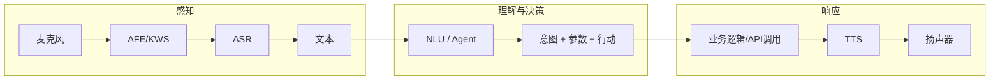
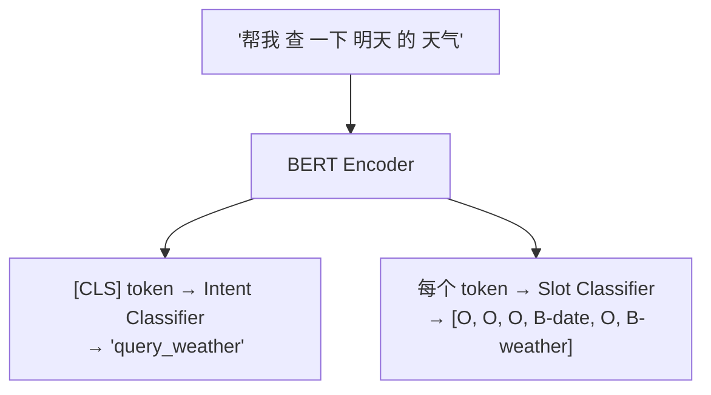
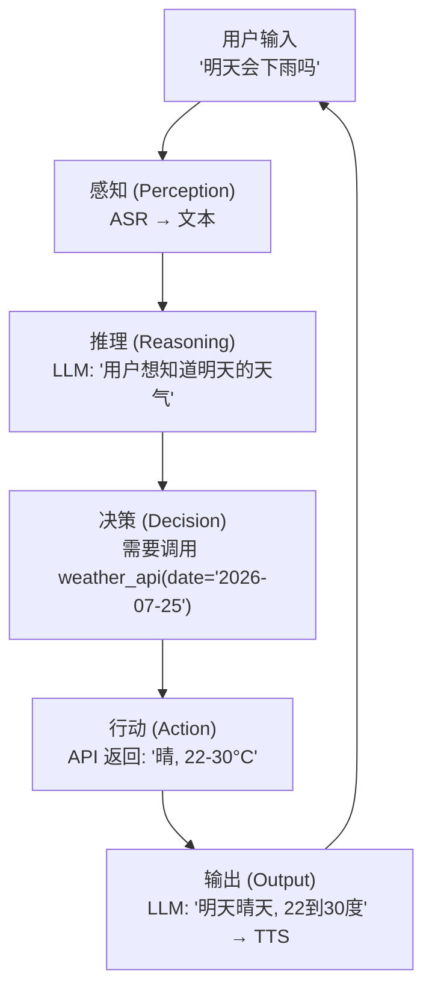
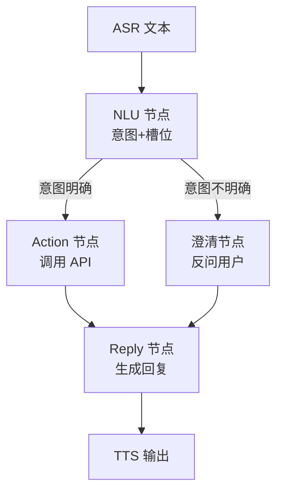
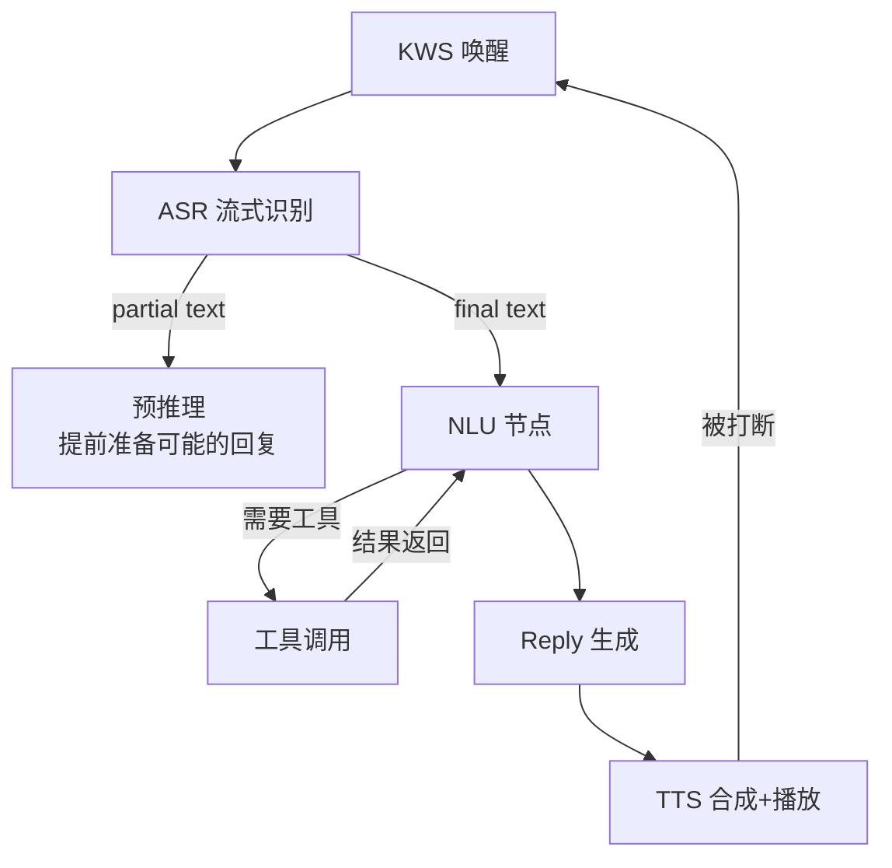

# 第 12 课：语音 NLU 与 LLM Agent

> **核心问题**：ASR 给出了"用户说了什么"（文本），TTS 能回复"系统想说的话"（语音）。但中间缺了最关键的一环——**从"用户说了什么"推导出"系统该做什么"**。这就是 NLU 和 Agent 的职责。在 LLM 时代，这个职责正在经历从"手工规则→意图模板→LLM 自主推理"的范式跃迁。
> **工程锚点**：本项目当前使用 pyhanlp 做基础的分词+词性标注（`/speech/nlu_format`），NLU 在 `speech.launch.py` 中被注释掉了——这说明当前的 NLU 还不够"有用"，而这正是 LLM Agent 要填补的空白。

---

## 一、NLU 在语音管道中的定位



**NLU 是语音管道中唯一"看不到也听不到"的环节**——它不处理音频（AFE/ASR/TTS），不产生音频（TTS），但它是**整个系统的智能来源**。没有 NLU，系统只是一个"复读机"。

---

## 二、语音 NLU vs 文本 NLU 的特殊性

| 维度 | 文本 NLU（如客服机器人） | 语音 NLU（如本项目） |
|------|---------------------|-------------------|
| **输入质量** | 用户打字，标点完整，句式规整 | **ASR 误差传播**——"天气晴朗"可能被 ASR 误识别为"天气晴ang" |
| **句式** | 完整句（"我想查询明天的天气"） | **口语化、碎片化**（"那个...明天...天气？"） |
| **歧义** | 打字有上下文（聊天记录） | 只有当前一句——没有历史文本做消歧 |
| **延迟要求** | 1-3 秒可接受 | **< 500ms**——用户说完就期望系统开始回应 |
| **容错** | 可以要求用户澄清 | 不能反复问"你说什么？"——体验灾难 |

### ASR 误差传播：NLU 必须面对的噪声

```
用户说: "帮我查一下明天的天气"
ASR 输出: "帮我查一下明天的田七"    ← CER≈10%，"天气"→"田七"是真实可能的错误
NLU 需要: {intent: "query_weather", date: "tomorrow"}  ← 必须从带噪文本中提取
```

**关键设计原则**：NLU 模型必须在**带噪文本**上训练或 fine-tune。用完美文本训练的 NLU 在 ASR 输出上会大幅退化——这就是为什么 Whisper 等模型直接把 NLU 融入 ASR（课程 8）。

---

## 三、经典 NLU：分词 + 词性标注（本项目当前方案）

本项目的 `nlu_node.py` 是目前最简形式的 NLU——只有分词+词性标注：

```python
# nlu_node.py 的核心逻辑（97行，极简）
def listener_callback(self, msg):
    if msg.is_final:                    # 只处理最终结果
        terms = HanLP.segment(text)     # pyhanlp 分词+词性标注
        # 输出: [{"word": "明天", "nature": "t"}, {"word": "天气", "nature": "n"}, ...]
        self.publisher_.publish(json.dumps({"tokens": results}))
```

**pyhanlp (HanLP)** 是中文 NLP 的经典工具包，基于 Java。分词使用 CRF（条件随机场）模型，支持命名实体识别（人名、地名、机构名）。

**本方案的局限**：
- 只有分词+词性，没有**意图识别**（不知道用户想干什么）
- 没有**槽位填充**（不知道"明天"是查询日期）
- 在 `speech.launch.py` 中被注释掉——说明开发者也意识到它"不够用"

---

## 四、现代 SLU：意图分类 + 槽位填充

Spoken Language Understanding (SLU) 的标准范式：

```
输入: "帮我查一下明天的天气"
输出: {
  "intent": "query_weather",       ← 意图：要做什么
  "slots": {
    "date": "tomorrow",            ← 槽位：具体参数
    "location": null               ← 未提及→可追问
  }
}
```

### BERT 系 Joint Model（联合建模）

意图分类和槽位填充共享同一个 BERT encoder，两个不同的输出头：



**Joint Model 的优势**：意图（"查天气"）和槽位（"明天"是时间、"天气"是主题）是**互相增强**的。知道意图是"查天气"，槽位分类器会倾向于把"明天"标为时间而非人名。

### 本项目的升级路径

```
当前: HanLP 分词 → {"tokens": [...]}  → ??? (没有后续)
             ↓
Step 1: BERT Joint Model → {intent, slots} → 规则匹配 → 执行动作
             ↓
Step 2: LLM → 直接生成 {intent, slots, action, reply_text}
```

---

## 五、LLM 直接理解：Prompt-based NLU

在 LLM 时代，传统的"意图分类+槽位填充"两阶段可以被**一个 prompt** 替代：

```python
prompt = """
你是一个语音助手。用户说: "帮我查一下明天的天气"
请以 JSON 格式返回:
{
  "intent": "query_weather" | "set_reminder" | "play_music" | ...,
  "slots": {"date": "...", "location": "...", ...},
  "confidence": 0.0-1.0
}
"""

response = llm.generate(prompt)
# → {"intent": "query_weather", "slots": {"date": "2026-07-25", "location": null}, "confidence": 0.95}
```

**LLM-based NLU 的独特优势**：
1. **零样本**：不需要为每个意图训练分类器——描述意图的 prompt 就是"训练数据"
2. **槽位消歧**：LLM 能理解"明天"在当前日期（2026-07-24）背景下指 "2026-07-25"
3. **处理 ASR 噪声**：LLM 能从"帮我查一下明天的田七"中推断用户可能说的是"天气"
4. **自然语言槽位**：不需要预定义槽位 schema——"帮我查一下上次去过的那个餐厅"中 "上次去过的那个" 是 LLM 可以解析的

---

## 六、LLM Agent 设计架构

### 6.1 Agent 的基本范式：感知 → 规划 → 行动



**Agent 的三个核心问题**：
1. **该不该行动**（什么时候调用工具，什么时候直接回答）
2. **调用哪个工具**（天气 API？日历 API？音乐播放？）
3. **怎么理解工具返回的结果**（API 返回的 JSON 怎么变成自然语言回复）

### 6.2 ReAct：Reasoning + Acting 的交替

ReAct (Yao et al., 2022) 是现代 Agent 的基础范式——**思考和行动交替进行**：

```
用户: "明天天气怎么样？如果下雨的话，帮我设个提醒带伞"

LLM Thought 1: 用户想知道天气，然后根据结果决定是否设提醒。
               我需要先查天气。
LLM Action 1:  weather_api(date="2026-07-25")
Observation 1: {"weather": "rain", "temp": "22-28°C"}

LLM Thought 2: 明天有雨，用户要求下雨时设提醒。我需要创建提醒。
LLM Action 2:  create_reminder(text="明天有雨，记得带伞", date="2026-07-25", time="08:00")
Observation 2: {"status": "success", "reminder_id": 12345}

LLM Thought 3: 天气查到了，提醒也设好了。现在整理回复。
LLM Final:    "明天有雨，22到28度。我已经帮你设了明早8点的带伞提醒。"
```

**ReAct 的关键设计**：每一步的 Thought 和 Action 都作为 token 输入给 LLM，LLM 在"思考→行动→观察→再思考"的循环中自主决策。这和课程 5 的 beam search 不同——Agent 的搜索空间不是"最优文本序列"，而是"最优行动序列"。

### 6.3 Function Calling / Tool Use

LLM 不能直接调用 API——它只能生成文本。**Function Calling** 是 LLM 和外部世界之间的桥梁：

```python
# 定义工具（给 LLM 的"说明书"）
tools = [
    {
        "name": "get_weather",
        "description": "查询指定日期和城市的天气",
        "parameters": {
            "date": "日期 (YYYY-MM-DD)",
            "city": "城市名称"
        }
    },
    {
        "name": "create_reminder",
        "description": "创建提醒",
        "parameters": {
            "text": "提醒内容",
            "datetime": "提醒时间 (ISO 8601)"
        }
    }
]

# LLM 输出（不是自然语言，是工具调用指令）
response = llm.generate_with_tools(user_input, tools)
# → {"tool": "get_weather", "params": {"date": "2026-07-25", "city": "北京"}}

# Agent 执行工具调用
result = execute_tool(response.tool, response.params)

# 将结果反馈给 LLM 生成最终回复
final_reply = llm.generate(f"工具返回: {result}. 请生成自然语言回复。")
```

### 6.4 语音 Agent 的特殊挑战

| 挑战 | 文本 Agent | 语音 Agent |
|------|-----------|-----------|
| **输入** | 打字——精确 | ASR——有噪声（CER 3-15%） |
| **输出** | 文本——可以很长 | TTS——必须简短（> 30 字用户不听完） |
| **中断** | 用户可随时打字纠正 | Barge-in——TTS 播放中被打断时要丢弃未播放的部分 |
| **状态** | 可回看聊天记录 | 无视觉历史——用户只能记住最近 2-3 句话 |
| **延迟** | 1-3 秒可接受 | TTFP (首字延迟) + Agent 推理 < 1 秒总预算 |
| **澄清** | 可以反问——打字回复快 | 反问浪费用户时间——"你说什么？" ×1 就体验崩了 |

---

## 七、LangChain / LangGraph 工程框架

### 7.1 LangChain 的核心抽象

LangChain 是 LLM 应用的**工程化框架**，提供了六个核心抽象：

```python
from langchain.llms import OpenAI
from langchain.chains import LLMChain
from langchain.prompts import PromptTemplate
from langchain.tools import Tool
from langchain.agents import initialize_agent, AgentType
from langchain.memory import ConversationBufferMemory

# 1. Model: LLM 的抽象
llm = OpenAI(model="gpt-4", temperature=0)

# 2. Prompt: 模板化 prompt
prompt = PromptTemplate(
    template="用户说: {user_input}\n请识别意图和槽位:",
    input_variables=["user_input"]
)

# 3. Chain: 将多个步骤串联
chain = LLMChain(llm=llm, prompt=prompt)
result = chain.run(user_input="帮我查一下明天的天气")

# 4. Tool: 外部 API 的包装
weather_tool = Tool(
    name="Weather",
    func=get_weather,
    description="查询天气，需要 date 和 city 参数"
)

# 5. Agent: 自主决策工具调用
agent = initialize_agent(
    tools=[weather_tool, reminder_tool],
    llm=llm,
    agent=AgentType.ZERO_SHOT_REACT_DESCRIPTION  # 零样本 ReAct
)
agent.run("明天天气怎么样？")

# 6. Memory: 多轮对话状态
memory = ConversationBufferMemory()
agent_with_memory = initialize_agent(
    tools=[...], llm=llm, memory=memory
)
```

### 7.2 LangGraph：状态图驱动的 Agent

LangChain 的 Chain 是**线性的**（A → B → C）。但真正的 Agent 需要**分支、循环、条件跳转**。LangGraph 用**有向状态图**来描述 Agent 的工作流：

```python
from langgraph.graph import StateGraph, END

# 定义状态
class AgentState(TypedDict):
    user_input: str
    asr_text: str
    intent: str | None
    slots: dict | None
    tool_result: str | None
    reply: str | None

# 定义节点（每个节点是一个处理函数）
def nlu_node(state):
    """意图识别 + 槽位填充"""
    result = llm.invoke(f"识别意图: {state['asr_text']}")
    state["intent"] = result.intent
    state["slots"] = result.slots
    return state

def action_node(state):
    """执行工具调用"""
    if state["intent"] == "query_weather":
        state["tool_result"] = get_weather(**state["slots"])
    return state

def reply_node(state):
    """生成自然语言回复"""
    state["reply"] = llm.invoke(f"生成回复: {state['tool_result']}")
    return state

# 构建图
graph = StateGraph(AgentState)
graph.add_node("nlu", nlu_node)
graph.add_node("action", action_node)
graph.add_node("reply", reply_node)
graph.add_edge("nlu", "action")
graph.add_edge("action", "reply")
graph.add_edge("reply", END)

# 条件边：根据意图决定下一步
def route_by_intent(state):
    if state["intent"] == "unknown":
        return "ask_clarification"
    elif state["tool_result"]:
        return "reply"
    else:
        return "action"

graph.add_conditional_edges("nlu", route_by_intent, {
    "action": "action",
    "reply": "reply",
    "ask_clarification": "ask_clarification"
})
```



### 7.3 语音管道中的 Agent 状态图

将 LangGraph 的思想应用到本项目的完整管道：



**关键状态**：
- `waiting_for_wakeup`：等待唤醒词（KWS 常驻）
- `listening`：ASR 正在流式识别
- `understanding`：NLU/Agent 正在推理
- `acting`：正在调用外部 API
- `speaking`：TTS 正在播放
- `barge_in`：用户打断，需要切换到 listening

---

## 八、语音 Agent 工程实践

### 8.1 完整管道：ASR → NLU → Agent → TTS

```python
class SpeechAgentPipeline:
    def __init__(self):
        self.state = "waiting_for_wakeup"
        self.dialog_history = []  # 多轮对话上下文
        
    async def on_asr_final(self, text: str):
        self.state = "understanding"
        
        # Step 1: NLU (可在本地跑小模型，也可调用云端 LLM)
        intent_slots = await self.nlu(text)
        
        # Step 2: Agent 决策
        if intent_slots.requires_tool:
            self.state = "acting"
            result = await self.execute_tool(intent_slots)
        else:
            result = intent_slots.direct_answer
        
        # Step 3: 生成 TTS 文本
        reply = await self.generate_reply(result, self.dialog_history)
        
        # Step 4: TTS 合成 + 播放
        self.state = "speaking"
        await self.tts.speak(reply)
        
        # 更新对话历史
        self.dialog_history.append({"user": text, "agent": reply})
```

### 8.2 流式 Agent：边听边想边说

用户的感知延迟 = ASR 延迟 + Agent 推理时间 + TTS 首字延迟。优化策略：

```python
# 策略 1: 预推理——拿到 ASR partial 就开始准备
async def on_asr_partial(self, partial_text: str):
    # "帮我查一下明..." → 已经开始推理可能的意图
    self.precompute_intent(partial_text)

# 策略 2: 流式生成 TTS 文本
async def generate_reply_streaming(self):
    async for token in self.llm.stream_generate(...):
        await self.tts.feed_token(token)  # 边生成边合成
```

### 8.3 多轮对话的状态管理

语音 Agent 的对话历史和文本 chatbot 不同——它是**口语化的、有歧义的**：

```
用户: "明天天气怎么样"          → intent: query_weather, date: tomorrow
Agent: "明天晴天，22到30度"
用户: "那后天呢"                → 需要继承上文的 intent + 只改 date
Agent: "后天多云，18到25度"
用户: "帮我设个提醒"            → 需要继承上文的 date context
```

**核心原则**：Agent 的 memory 不能只是"原始文本的列表"，必须是**结构化的对话状态**：

```python
dialog_state = {
    "current_intent": "query_weather",     # 继承意图
    "current_slots": {"date": "2026-07-26"},  # 继承槽位
    "mentioned_entities": ["天气"],         # 讨论的主题
    "turn_count": 3,
    "last_agent_action": "replied_weather",  # 上一步做了什么
}
```

---

## 九、实践环节

### 实验 1：Prompt-based NLU 对比经典方案

```python
# 模拟两种 NLU 方案对同一输入的处理
user_input = "帮我查一下明天的天气"

# 方案 A: 经典 HanLP（本项目当前方案）
print("=== 经典 pyhanlp ===")
print("输出: [{'word': '帮', 'nature': 'v'}, {'word': '我', 'nature': 'r'}, ...]")
print("→ 只有词性，没有意图信息")
print()

# 方案 B: LLM Prompt
print("=== LLM Prompt ===")
prompt = f"""分析用户意图:
输入: "{user_input}"
返回 JSON: {{"intent": "...", "slots": {{...}}}}"""
print(f"输出: {{'intent': 'query_weather', 'slots': {{'date': '2026-07-25'}}}}")
print("→ 直接得到可执行的意图和参数")
```

### 实验 2：ReAct 循环的模拟

```python
class SimpleReActAgent:
    def __init__(self):
        self.tools = {
            "weather": lambda date: f"{date} 晴天 22-30°C",
            "reminder": lambda text, date: f"已创建提醒: {text} @ {date}"
        }
        
    def think(self, query, history=None):
        """模拟 Thought 生成"""
        if "天气" in query:
            return {"thought": "用户想知道天气", "action": "weather", "params": {"date": "2026-07-25"}}
        elif "提醒" in query:
            return {"thought": "用户想创建提醒", "action": "reminder", "params": {"text": "带伞", "date": "2026-07-25"}}
        return {"thought": "直接回答", "action": None}
    
    def run(self, query):
        result = self.think(query)
        if result["action"]:
            # 执行工具
            tool_output = self.tools[result["action"]](**result["params"])
            return f"Thought: {result['thought']}\nAction: {result['action']}({result['params']})\nObservation: {tool_output}\nFinal: 根据结果生成的回复"
        return result["thought"]

agent = SimpleReActAgent()
print(agent.run("明天天气怎么样？如果下雨的话，帮我设个提醒带伞"))
```

### 实验 3：LangGraph 状态图可视化

```python
import matplotlib.pyplot as plt
import networkx as nx

# 用 networkx 画语音 Agent 的状态图
G = nx.DiGraph()
edges = [
    ("idle", "listening", "唤醒"),
    ("listening", "understanding", "ASR final"),
    ("understanding", "acting", "需要工具"),
    ("understanding", "speaking", "不需要工具"),
    ("acting", "understanding", "工具返回"),
    ("speaking", "idle", "播放完毕"),
    ("speaking", "listening", "被用户打断"),
    ("listening", "idle", "超时无语音"),
]

for u, v, label in edges:
    G.add_edge(u, v, label=label)

pos = nx.spring_layout(G, seed=42)
plt.figure(figsize=(10, 6))
nx.draw(G, pos, with_labels=True, node_color='lightblue', 
        node_size=2000, font_size=10, edge_color='gray')
edge_labels = {(u,v): l for u,v,l in edges}
nx.draw_networkx_edge_labels(G, pos, edge_labels=edge_labels, font_size=8)
plt.title("语音 Agent 状态图")
plt.savefig('agent_states.png', dpi=150)
print("状态: idle → listening → understanding → (acting) → speaking → idle")
print("打断: speaking → listening (Barge-in)")
print("超时: listening → idle (节能)")
```

---

## 十、关键术语速查

| 术语 | 一句话定义 |
|------|-----------|
| **NLU** | Natural Language Understanding——将自然语言文本映射为结构化意图和参数 |
| **SLU** | Spoken Language Understanding——面向语音的 NLU，需处理 ASR 噪声和口语化 |
| **意图 (Intent)** | 用户想做什么——"query_weather"、"set_reminder"、"play_music" |
| **槽位 (Slot)** | 意图的参数——date="tomorrow"、location="Beijing" |
| **Joint Model** | 意图分类和槽位填充共享 encoder 的 BERT 模型——两者互相增强 |
| **Agent** | 感知→推理→行动→输出的自主系统——不只理解，还执行 |
| **ReAct** | Reasoning + Acting——思考和行动交替的 Agent 范式 |
| **Function Calling** | LLM 生成工具调用指令（而非自然语言）——连接 LLM 和外部 API |
| **LangChain** | LLM 应用的工程框架——Chain/Agent/Tool/Memory/Prompt 五大抽象 |
| **LangGraph** | 状态图驱动的 Agent 框架——用有向图描述 Agent 的分支/循环/条件逻辑 |
| **Tool** | Agent 可调用的外部函数——天气 API、日历 API、数据库查询 |
| **Memory** | 多轮对话的状态管理——不只是历史文本，是结构化的对话上下文 |
| **Barge-in** | 用户打断 TTS 播放——Agent 必须丢弃未播放部分并切换到 listening |
| **流式 Agent** | ASR partial → 预推理 → 边生成边合成——降低用户感知延迟 |

---

## 十一、下一步

### 推荐阅读

- **Yao et al. (2022)** — "ReAct: Synergizing Reasoning and Acting in Language Models" — ReAct 范式的原始论文
- **LangChain 文档** [python.langchain.com](https://python.langchain.com/) — Chains/Agents/Tools/Memory 的完整 API
- **LangGraph 文档** [langchain-ai.github.io/langgraph](https://langchain-ai.github.io/langgraph/) — 状态图驱动的 Agent 工作流
- **Wei et al. (2022)** — "Chain-of-Thought Prompting Elicits Reasoning in Large Language Models" — CoT 推理的原始论文（Agent 推理的前置技术）
- **Schick et al. (2023)** — "Toolformer: Language Models Can Teach Themselves to Use Tools" — LLM 自主学会调用工具的范式
- **OpenAI Function Calling** [platform.openai.com/docs/guides/function-calling](https://platform.openai.com/docs/guides/function-calling) — Function Calling 的 API 设计参考

### Phase 3 收官

Phase 3（专用语音模型）已全部完成——KWS（课10）、TTS（课11）、NLU+Agent（课12）。

**Phase 4：边缘部署优化** 即将开始——从"模型训练好了"到"在 Jetson 上跑起来"。量化理论（课13）、ONNX Runtime 部署（课14）、推理管线优化（课15）、sherpa-onnx 框架剖析（课16）。

> **有疑问？** 可以问我 LangGraph 的条件边和普通边的实现差异、Function Calling 如何避免 LLM 产生幻觉调用、或者语音 Agent 如何在没有云端 LLM 的情况下在 Jetson 上纯端侧运行。
