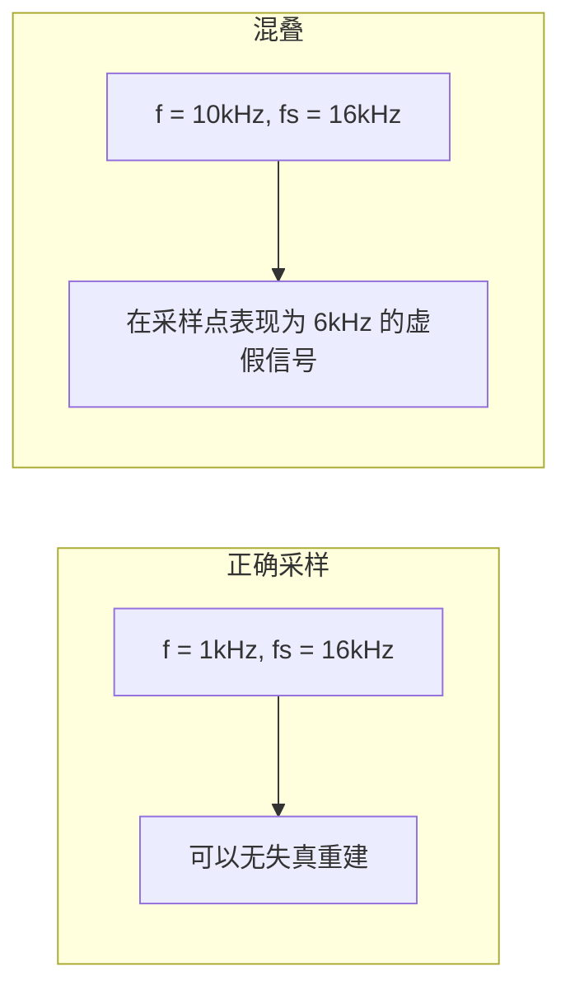
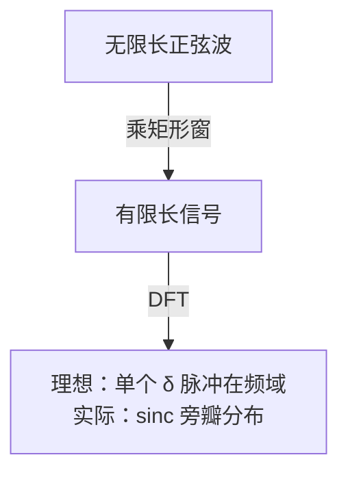
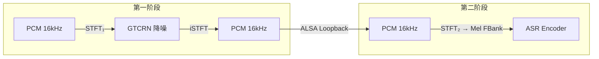
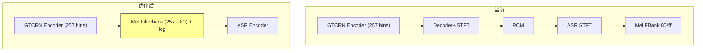
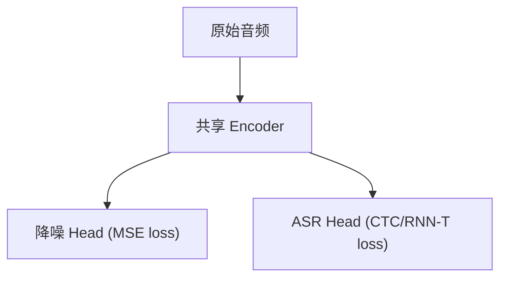

# 第 1 课：数字音频基础与频谱分析

> **核心问题**：麦克风采集的连续声波，如何变成 ASR 模型可以"吃"的数字张量？
> **工程锚点**：本项目所有模块的输入都是 16kHz / 16bit / Mono PCM 音频流

---

## 一、声音的物理本质

### 声波三要素

声波是空气分子的**疏密振动**。任何一个纯音（单一频率的声音）可以用三个参数完全描述：

$$y(t) = A \cdot \sin(2\pi f t + \phi)$$

| 参数 | 物理含义 | 单位 | 人耳感知 |
|------|---------|------|---------|
| **振幅 $A$** | 空气压力变化的幅度 | Pa（帕斯卡） | 响度（loudness） |
| **频率 $f$** | 每秒振动次数 | Hz（赫兹） | 音高（pitch） |
| **相位 $\phi$** | 波形起始偏移 | rad（弧度） | 双耳定位（方向感） |

真实语音是**无数个纯音的叠加**：

$$y(t) = \sum_{k} A_k \cdot \sin(2\pi f_k t + \phi_k)$$

> **关键直觉**：频谱分析的终极目标就是——给定一段波形 $y(t)$，求出背后所有 $\{A_k, f_k\}$ 的分布。傅里叶变换就是做这件事的数学工具。

### 语音信号的频带特征

```
人声基频范围:      80 Hz  ~  300 Hz  (男低音 ~ 女高音)
语音信息主要频带:   300 Hz ~  3400 Hz (电话语音，8kHz 采样)
宽带语音频带:       50 Hz  ~  7000 Hz (高清语音，16kHz 采样)
```

本项目选择 **16kHz 采样率**，Nyquist 频率 = 8kHz，能覆盖人声的全部有效信息，同时保留齿音（sibilance，可达 8-10kHz 的部分能量）。

---

## 二、采样定理：连续→离散的数学保障

### Nyquist-Shannon 采样定理

> **定理**：若模拟信号的最高频率为 $f_{\text{max}}$，则当采样率 $f_s \geq 2f_{\text{max}}$ 时，可以从采样点**无失真**重建原始信号。

**数学直觉**：频率为 $f$ 的正弦波在采样率 $f_s$ 下表现为：

$$x[n] = \sin\left(2\pi f \cdot \frac{n}{f_s}\right) = \sin\left(2\pi \frac{f}{f_s} n\right)$$

当 $f > f_s/2$ 时，$\sin(2\pi \frac{f}{f_s} n)$ 和 $\sin(2\pi \frac{f_s-f}{f_s} n)$ 在采样点上取值**完全相同**——这就是**混叠（Aliasing）**。



**工程实践**：ADC 芯片前面一定有**抗混叠低通滤波器**，截止频率 < $f_s/2$。如果滤波器不理想（实际都不理想），高频噪声会混叠进有效频带——所以高质量录音设备通常用 48kHz/96kHz 采样，留足过渡带。

### 本项目为什么是 16kHz？

| 选项 | 优点 | 缺点 | 本项目的选择理由 |
|------|------|------|----------------|
| 8kHz（电话） | 数据量最小 | 丢失齿音和清辅音信息，ASR 准确率下降 | ❌ 识别率不可接受 |
| **16kHz（宽带）** | Nyquist=8kHz 覆盖所有语音信息 | 数据量适中 | ✅ **最佳性价比** |
| 48kHz（专业） | 过渡带宽裕，抗混叠好 | 4 倍数据量，AFE/ASR 计算量线性增长 | ❌ 边缘设备浪费算力 |

> **项目证据**：`afe_config.yaml` 中 `rec_device: "real_mic"` 固定为 16kHz Mono；ASR 的 Zipformer encoder 也按 16kHz 设计。整个链路**不通带重采样**——这是延迟优化的关键（课程 18 详述）。

---

## 三、量化：连续幅度→离散比特

### 均匀量化与量化噪声

采样解决了时间轴的离散化，量化解决幅度轴的离散化。以 $b$ 比特均匀量化为例：

$$\hat{x} = \text{round}\left(\frac{x}{\Delta}\right) \cdot \Delta, \quad \Delta = \frac{2A}{2^b}$$

其中 $A$ 是信号幅度范围（如 S16 的 $A = 2^{15} = 32768$，留 1 bit 给符号）。

**量化误差** $e = x - \hat{x}$ 在均匀分布假设下近似为均匀分布 $U(-\Delta/2, \Delta/2)$，其方差：

$$\sigma_e^2 = \frac{\Delta^2}{12}$$

**信噪比 SQNR**（Signal-to-Quantization-Noise Ratio）：

$$\text{SQNR(dB)} \approx 6.02b + 1.76 \quad \text{（满幅正弦波）}$$

| 比特深度 | SQNR (理论) | 本项目使用 |
|---------|-------------|----------|
| 8 bit | ~50 dB | ❌（噪声明显） |
| **16 bit** | **~98 dB** | ✅ **S16_LE**（全链路统一） |
| 24 bit | ~146 dB | ❌（浪费，人耳动态范围仅 ~120dB） |
| 32 bit float | ~150+ dB | 仅在中间处理时使用（Float32MultiArray） |

> **"LE" 是 Little-Endian（小端序）**。Intel x86 / ARM 默认小端，所以本项目用 S16_LE。网络传输时可能需要转大端（BE）。

### 量化噪声的实际影响

以语音识别为例，量化噪声叠加在原始信号上形成新的"基底噪声"：

```
16-bit SQNR=98dB → 量化噪声远低于环境噪声（通常 30-50dB）→ ASR 不受影响
8-bit  SQNR=50dB → 量化噪声接近安静环境 → 可能影响 ASR 准确率
INT8 模型量化  → 这是模型权重的量化，不同概念！（课程 13 详述）
```

---

## 四、DFT 与 STFT：从时域到频域

### DFT：离散傅里叶变换

给定 $N$ 个采样点 $x[0], x[1], ..., x[N-1]$，DFT 将其映射为 $N$ 个频域系数：

$$X[k] = \sum_{n=0}^{N-1} x[n] \cdot e^{-j2\pi kn/N}, \quad k = 0, 1, ..., N-1$$

**物理含义**：$X[k]$ 表示频率为 $f_k = k \cdot f_s / N$ 的正弦分量在信号中的**幅度和相位**。

- $|X[k]|$：该频率分量的幅度（magnitude）
- $\angle X[k]$：该频率分量的相位

> **计算复杂度**：朴素 DFT 是 $O(N^2)$。**FFT**（Fast Fourier Transform）利用对称性降到 $O(N \log N)$——这是数字信号处理能实用的数学基石。你不需要手写 FFT，但必须知道 $N$ 越大，频率分辨率越高（$\Delta f = f_s / N$），计算量也越大。

### STFT：短时傅里叶变换

语音是**时变信号**（"你"和"好"的频谱完全不同），单次 DFT 只看整段音频——没有时间信息。

**解决方案**：加窗分段，逐段做 DFT。

```
原始信号: x[0], x[1], x[2], ... x[M]
          |---窗---|---窗---|---窗---|
          w[n]·x   w[n]·x   w[n]·x
          ↓ DFT     ↓ DFT     ↓ DFT
          X0[k]    X1[k]    X2[k]    → 频谱图 (Spectrogram)
```

**频谱图**是一个 $T \times F$ 的矩阵，每列是一帧的频谱：

$$\text{Spectrogram}[t, k] = \left| \sum_{n=0}^{N-1} w[n] \cdot x[t \cdot H + n] \cdot e^{-j2\pi kn/N} \right|$$

其中 $H$ 是跳步（hop length），$w[n]$ 是窗函数。

### 三个你必须记住的参数

| 参数 | 含义 | 典型值 | 对结果的影响 |
|------|------|--------|-------------|
| **N (FFT 点数)** | 每帧做 N 点 FFT | 512 / 1024 | 越大 → 频率分辨率越高，时间分辨率越低 |
| **窗长** | 每帧包含的采样点数 | 通常 = N（可补零） | 越长 → 频率分辨率越高 |
| **跳步 H** | 相邻帧的起始偏移 | N/4 ~ N/2 | 越小 → 时间分辨率越高，计算量越大 |

> **本项目**：AFE 以 1024 采样点为一帧（64ms @ 16kHz），这也是 GTCRN 模型的输入窗长。补零到 1024 点 FFT 可直接对齐。

---

## 五、窗函数：截断的艺术

### 频谱泄漏

用**矩形窗**（直接截取 N 个点）等价于理想信号乘上一个矩形脉冲：

$$x_{\text{windowed}}[n] = x[n] \cdot \text{rect}[n]$$

矩形窗的频谱是一个 **sinc 函数**，有无限延伸的旁瓣（side lobe）。这导致原本单一频率的能量**泄漏**到相邻频点——即"频谱泄漏"。



### 常用窗函数对比

窗函数的核心思路：让截断边缘**平滑过渡到零**，从而压低旁瓣。代价是主瓣变宽（频率分辨率下降）。

| 窗函数 | 主瓣宽度 | 最高旁瓣 (dB) | 旁瓣衰减 (dB/oct) | 适用场景 |
|--------|---------|-------------|-------------------|---------|
| **矩形窗** | $4\pi/N$ | -13 | -6 | 整周期截断的纯音（几乎不存在于真实语音） |
| **Hamming** | $8\pi/N$ | -43 | -6 | **语音处理的默认选择**——旁瓣够低而且计算简单 |
| **Hann** | $8\pi/N$ | -32 | -18 | 旁瓣衰减快，适合需要测谐波幅度的场景 |
| **Blackman** | $12\pi/N$ | -58 | -18 | 旁瓣极低，但主瓣太宽——语音中少用 |

> **窗函数选择的实战原则**：
> 1. 语音信号默认用 **Hamming 窗**
> 2. 如果旁瓣仍然干扰（如检测两个频率很靠近的共振峰），换 Hann
> 3. 矩形窗只在**你知道自己在干什么**时使用（比如整周期截断、或者不在乎泄漏只是看图）

### 时间-频率分辨率的根本矛盾

这是信号处理中最深刻的一个 tradeoff：

$$\Delta t \cdot \Delta f \geq \frac{1}{4\pi} \quad \text{（信号处理中的 Gabor 极限）}$$

| 短窗 (如 16ms) | 长窗 (如 64ms) |
|----------------|----------------|
| ✅ 能看清快速的辅音过渡 | ❌ 辅音被模糊化 |
| ❌ 低频分辨不了（一个 100Hz 周期 = 10ms） | ✅ 低频清晰 |
| ❌ 频谱粗糙 | ✅ 频谱精细 |

> **工程含义**：没有"最佳窗长"——取决于你的任务。ASR 需要捕捉快速的音素转换，通常用 25ms 窗长 + 10ms 跳步；音乐分析可能需要更长的窗。本项目 AFE 的 1024 samples @ 16kHz = **64ms 窗长**，偏向降噪任务（GTCRN 需要足够频率分辨率）。

---

## 六、PCM 格式实战

### S16_LE 的二进制布局

```
┌─ Sample 0 ─┬─ Sample 1 ─┬─ Sample 2 ─┬─ ...
│ [LSB][MSB] │ [LSB][MSB] │ [LSB][MSB] │
└────────────┴────────────┴────────────┘
```

以 16kHz Mono 为例：
- 每秒数据量 = $16000 \times 2 = 32000$ bytes/s = **31.25 KiB/s**
- 10 秒语音 ≈ 312.5 KiB
- 1 小时语音 ≈ 110 MiB

### WAV 文件头

WAV 文件 = 44 字节 RIFF 头 + PCM 原始数据。头部关键字段：

```
字节 22-23: 声道数 (1=mono, 2=stereo)
字节 24-27: 采样率 (如 16000)
字节 28-31: 字节率 = 采样率 × 声道数 × 位深/8
字节 34-35: 位深 (16)
```

> **本项目**根目录有 `test.wav`、`clean.wav`、`real.wav`——可以用后续实验验证。

---

## 七、实践环节

### 实验 1：读取本项目音频文件并绘制波形与频谱图

> **目标**：亲手从 PCM 数据生成频谱图，建立直觉。

```python
import numpy as np
import matplotlib.pyplot as plt
from scipy.io import wavfile

# 1. 读取音频（本项目根目录的 test.wav）
sr, data = wavfile.read('../test.wav')
print(f"采样率: {sr} Hz, 形状: {data.shape}, 时长: {len(data)/sr:.2f}s")

# 2. 绘制波形（前 0.1 秒）
t = np.arange(len(data)) / sr
plt.figure(figsize=(12, 8))

plt.subplot(3, 1, 1)
plt.plot(t[:1600], data[:1600])
plt.title("波形（前 100ms）")
plt.xlabel("时间 (s)")

# 3. STFT → 频谱图
n_fft = 1024
hop = 256  # 25% overlap
window = np.hamming(n_fft)

# 手动 STFT（比 spectrogram 函数更直观）
n_frames = (len(data) - n_fft) // hop + 1
spectrogram = np.zeros((n_fft // 2 + 1, n_frames))

for i in range(n_frames):
    frame = data[i*hop : i*hop+n_fft] * window
    spec = np.abs(np.fft.rfft(frame))
    spectrogram[:, i] = spec

# 4. 绘制频谱图（dB 标度）
plt.subplot(3, 1, 2)
plt.imshow(20 * np.log10(spectrogram + 1e-10),
           aspect='auto', origin='lower',
           extent=[0, len(data)/sr, 0, sr/2])
plt.colorbar(label='dB')
plt.title(f"频谱图 (N={n_fft}, Hamming窗, hop={hop})")
plt.ylabel("频率 (Hz)")

# 5. 对比：矩形窗 vs Hamming 窗（单帧）
plt.subplot(3, 1, 3)
frame_idx = 50
start = frame_idx * hop

frame_rect = data[start:start+n_fft]
frame_hamm = data[start:start+n_fft] * np.hamming(n_fft)

freqs = np.fft.rfftfreq(n_fft, 1/sr)
plt.semilogy(freqs, np.abs(np.fft.rfft(frame_rect)), alpha=0.5, label='矩形窗')
plt.semilogy(freqs, np.abs(np.fft.rfft(frame_hamm)), alpha=0.5, label='Hamming窗')
plt.legend()
plt.title(f"第 {frame_idx} 帧的频谱对比（注意旁瓣差异）")
plt.xlabel("频率 (Hz)")

plt.tight_layout()
plt.savefig('spectrogram_demo.png', dpi=150)
print("已保存 spectrogram_demo.png")
```

> **预期观察**：
> 1. 矩形窗的频谱在峰值两侧有较高的"裙边"（旁瓣泄漏）
> 2. Hamming 窗的旁瓣明显更低，但峰值略宽（主瓣展宽）
> 3. 频谱图上能看到语音的谐波结构（横条纹）

### 实验 2：改变 FFT 点数观察分辨率

```python
# 固定信号，改变 N_FFT
for n_fft in [256, 512, 1024, 2048]:
    # ... 做 STFT
    print(f"N={n_fft}: 频率分辨率 Δf={sr/n_fft:.1f} Hz, 时间分辨率 Δt={n_fft/sr*1000:.0f} ms")
```

### 故障注入实验

```python
# 伪造一个混叠信号：10kHz 纯音用 16kHz 采样
import numpy as np
fs = 16000
t = np.arange(0, 0.01, 1/fs)
alias_signal = np.sin(2 * np.pi * 10000 * t)  # 10kHz > 8kHz Nyquist

# 在 16kHz 采样点上看，它会表现为 6kHz 信号
print("10kHz 在 16kHz 采样率下混叠为 6kHz")
# 验证：sin(2π·10000·n/16000) = sin(2π·(16000-10000)·n/16000) = sin(2π·6000·n/16000)（差一个符号）
```

---

## 八、进阶讨论：跨模块的 STFT 共用问题

> **问题来源**：音频管道中 AFE（降噪）和 ASR（识别）都需要做 STFT/加窗。但两个模型来自不同团队，STFT 参数（n_fft、hop、窗函数）往往不一致。能否让两段共用同一份 STFT 结果，省掉中间的 PCM 往返？

### 工程背景：pipeline 中的双重 STFT

典型的语音管道：



**问题本质**：STFT₁ 和 STFT₂ 算了两遍，中间还多了一次 iSTFT（频域→时域）。能否让降噪模块直接输出频域特征给 ASR？

### 本项目的实际参数

以下数据来自 `GTCRNStream.h` 和 sherpa-onnx `features.h` 源码：

| 参数 | GTCRN (降噪) | Zipformer ASR 前端 | 可否共用？ |
|------|:-----------:|:----------------:|:--------:|
| **n_fft** | 512 | 512（400→pad 到 512） | ✅ 巧合一致 |
| **窗长 (samples)** | 512 (32ms) | 400 (25ms) | ❌ |
| **跳步 hop (samples)** | 256 (16ms) | 160 (10ms) | ❌ |
| **窗函数** | sqrt-Hann | Povey (Kaldi 的 Hann 变体) | ❌ |
| **FFT bins** | 257 (512/2+1) | 257 | ✅ |
| **最终特征** | 时域 PCM | 80 维 log-Mel FBank | ❌ 本质不同 |

### 核心障碍：帧网格不对齐

两个模型在时间轴上以不同的间隔"切片"。由于 hop 不同（256 vs 160），它们永远不会落在同一时刻的采样点上：

| 时间 (ms) | 0 | 10 | 16 | 20 | 32 | 40 | 48 |
|-----------|---|---|----|----|----|----|----|
| GTCRN 帧边界 | ✓ | | ✓ | | ✓ | | ✓ |
| ASR 帧边界 | ✓ | ✓ | | ✓ | | ✓ | |

**即使 n_fft 相同，不同 hop 的 STFT 结果也完全无法直接复用**——因为每帧覆盖的时域采样点不同。

### 四种方案对比

#### 方案 1：接受双重 STFT（✅ 本项目当前方案）

```
延迟代价: GTCRN STFT+iSTFT ≈ 1-2ms, ASR STFT ≈ 0.5ms
总开销: < 3ms，在 Jetson Orin NX 全程延迟 200-300ms 中占比 < 2%
```

这是绝大多数产品的选择。PCM 是最通用的接口契约——松耦合的价值远超几毫秒开销。类比 TCP/IP 栈的逐层封装：每次封装都有开销，但没人会在应用层直接操作以太网帧。

#### 方案 2：训练时对齐参数

强制两个模型在**训练阶段**使用相同的 STFT 参数。例如统一为 n_fft=512, hop=160（ASR 的 10ms），然后重新训练 GTCRN。

**局限**：GTCRN 源码明确注释 `"Fixed STFT params (512/256) to match model; change requires model retrain."`——对于预训练模型，参数不可改。只有当**你自己训练两个模型**时才能用这个方案。

#### 方案 3：特征级旁路（中等改动，中高收益）

修改 GTCRN 暴露 encoder 中间输出（增强后的 257-bin 复数频谱），绕过 iSTFT→PCM→STFT 的往返，直接在频域做 Mel 投影后喂给 ASR：



**收益**：省掉 GTCRN decoder + iSTFT + ASR STFT + ASR Mel filterbank，节省约 3-5ms 延迟和 10-15% CPU。

**代价**：
1. GTCRN 代码侵入（需暴露内部 `_enh_real/_enh_imag`）
2. ASR 需支持特征注入（sherpa-onnx 目前接受 waveform，需扩展 `AcceptFeatures()` 接口）
3. 模块耦合——升级任一端需验证兼容性

#### 方案 4：端到端联合训练（学术方向）



这是语音研究的前沿（如 Meta AV-HuBERT 等）。**工程落地极难**——需要联合标注数据、两个 loss 的平衡是超参敏感的"炼丹"、推理时平白多跑一个 head。

### 设计哲学

| 维度 | 松耦合（PCM 接口） | 紧耦合（特征共享） |
|------|-------------------|-------------------|
| **延迟** | 多 2-5ms | 省 2-5ms |
| **模块独立性** | ✅ 各自独立升级 | ❌ 升级任一端需联动 |
| **调试** | ✅ PCM 可人耳听、可录音验证 | ❌ 257 维复数向量不可直观验证 |
| **团队协作** | ✅ 不同团队并行开发 | ❌ 需协调 STFT 参数和接口格式 |
| **可替换性** | ✅ 降噪/ASR 随时换供应商 | ❌ 替换需修改管道 |

> **经验法则**：除非端到端延迟要求 < 100ms（如实时对话系统、同声传译），否则 PCM 往返的几毫秒不值得换取模块耦合的代价。优化首先应该瞄准 ASR 解码（占 ~60% 延迟）和 TTS 首字延迟（占 ~20%），而不是信号处理前端（占 <5%）。
>
> 相关问题在 [第 17 课：端到端延迟优化](#) 和 [第 18 课：音频管线工程优化](#) 中会深入展开。

---

## 九、关键术语速查

| 术语 | 一句话定义 |
|------|-----------|
| **Nyquist 频率** | $f_s/2$，采样率的一半——系统能处理的最高频率 |
| **混叠 (Aliasing)** | 高频信号被误采为虚假低频信号 |
| **SQNR** | $\approx 6.02b+1.76$ dB，量化位数决定的理论信噪比上限 |
| **频谱泄漏** | 非整周期截断导致单一频率的能量扩散到相邻频点（窗函数的副作用） |
| **FFT** | $O(N\log N)$ 的快速 DFT 算法——数字信号处理的基石 |
| **频谱图 (Spectrogram)** | $|STFT|^2$，横轴时间、纵轴频率、颜色=能量的二维表示 |
| **主瓣/旁瓣** | 窗函数频谱的中央峰（决定频率分辨率）和侧峰（决定泄漏程度） |
| **Gabor 极限** | $\Delta t \cdot \Delta f \geq 1/4\pi$，时间与频率分辨率不可兼得 |

---

## 十、下一步

### 推荐阅读（第一性原理来源）

- **《Digital Signal Processing》— Proakis & Manolakis, 第 4 章**（采样定理的完整数学推导）
- **《Discrete-Time Signal Processing》— Oppenheim, 第 10 章**（STFT 与窗函数的经典论述）
- **《Speech and Language Processing》— Jurafsky & Martin, 第 9 章** [在线版](https://web.stanford.edu/~jurafsky/slp3/9.pdf)（Mel 频谱与声学特征——第 2 课的核心素材）

### 下节预告

[**第 2 课：Mel 域与声学特征提取**](./第_2_课：Mel域与声学特征提取.md) — 从 STFT 的线性频谱到模仿人耳感知的 Mel 频谱，MFCC 的 DCT 到底在去什么相关。

> **有疑问？** 在 OpenCode 对话中直接问我——当前课程模式下，我是你的语音信号处理助教。可以问任何公式推导、代码问题，或者要求针对某个概念做额外的实验验证。
