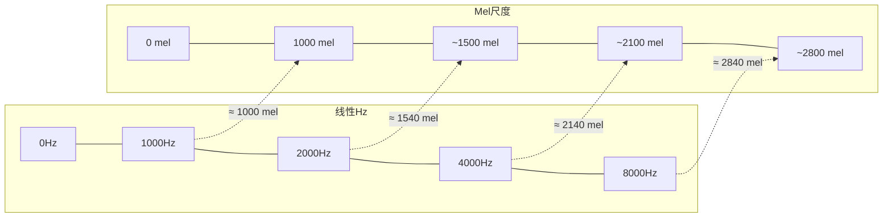
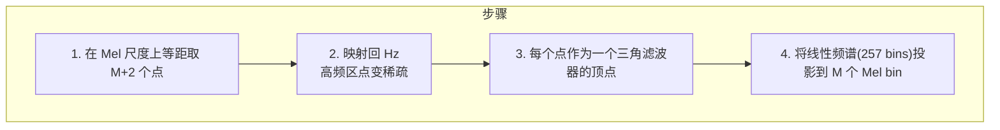
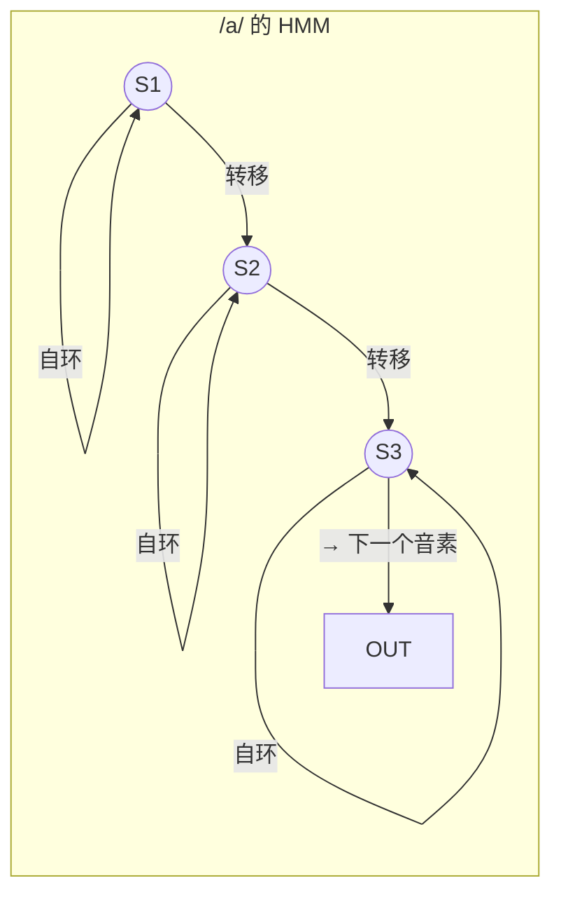
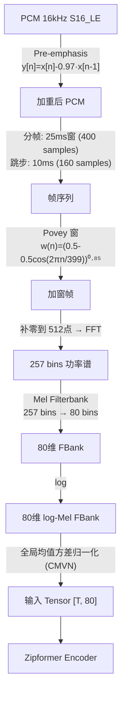

# 第 2 课：Mel 域与声学特征提取

> **核心问题**：STFT 给出了线性频率刻度下的频谱——每个 Hz 等权重。但人耳对 100Hz→200Hz 和 1000Hz→1100Hz 的感知完全不同。ASR 模型应当像人耳一样"听"声音。
> **工程锚点**：本项目 Zipformer ASR 的输入是 80 维 log-Mel FBank 特征，而不是原始频谱或 MFCC。

---

## 一、人耳为什么不是线性频率刻度

### 临界带宽 (Critical Band)

人耳基底膜（basilar membrane）上的毛细胞按**频率位置**排列，但排列密度不均匀：

```
     低频区（< 500Hz）           高频区（> 2000Hz）
  ┌──────────────────┐    ┌──────────────────────┐
  │ 毛细胞密集         │    │ 毛细胞稀疏           │
  │ 对 Hz 变化敏感     │    │ 对 Hz 变化不敏感      │
  │ 100Hz→200Hz 感知   │    │ 1000Hz→1100Hz 感知   │
  │ 差别巨大           │    │ 几乎没有差别          │
  └──────────────────┘    └──────────────────────┘
```

**临界带宽**是人耳将两个邻近频率感知为"同一个声音"的频率间隔。它不是常数——随中心频率增大而增大：

| 中心频率 | 临界带宽 (近似) | 你能分辨吗？ |
|---------|:-------------:|:----------:|
| 100 Hz | ~30 Hz | 100 vs 130 Hz → 能分辨 |
| 1000 Hz | ~130 Hz | 1000 vs 1130 Hz → 刚能分辨 |
| 5000 Hz | ~700 Hz | 5000 vs 5700 Hz → 几乎不能 |

> **物理本质**：低频区，一个临界带宽覆盖基底膜上约 1.3mm；高频区需要更长的基底膜距离才能产生可分辨的兴奋模式差异。这就是"频率分辨率随频率升高而下降"的生理学根源。

### 从生理学到工程：Mel 尺度

Mel（melody）尺度是 Stevens、Volkmann 和 Newman 在 1937 年通过心理声学实验提出的。实验方法：让受试者调节一个纯音，使其听起来是参考音**两倍高**。

**Mel 尺度公式**（O'Shaughnessy 版本，最常用）：

$$f_{\text{mel}} = 2595 \cdot \log_{10}\left(1 + \frac{f_{\text{Hz}}}{700}\right)$$

或自然对数形式：

$$f_{\text{mel}} = 1127 \cdot \ln\left(1 + \frac{f_{\text{Hz}}}{700}\right)$$

**逆变换**：

$$f_{\text{Hz}} = 700 \cdot \left(10^{f_{\text{mel}}/2595} - 1\right)$$

**关键参数 700**：当 $f = 700\text{Hz}$ 时，$f_{\text{mel}} \approx 1000$。700Hz 是 Mel 尺度的"拐点"——低于此频率近似线性（$f_{\text{mel}} \approx f_{\text{Hz}}$），高于此频率呈对数压缩。



### Mel 与 Bark 的对比

Bark 尺度是另一种基于临界带宽的感知频率尺度，由 Zwicker 提出：

| 特性 | Mel 尺度 | Bark 尺度 |
|------|---------|----------|
| **公式** | $2595\log_{10}(1+f/700)$ | $13\arctan(0.00076f)+3.5\arctan((f/7500)^2)$ |
| **实验基础** | 音高感知（pitch） | 临界带宽（critical band） |
| **语音社区** | ✅ **主流**（sherpa-onnx、Kaldi、Whisper 都用 Mel） | 偶尔出现在 TTS 中 |
| **1 Bark** | — | 约等于 1 个临界带宽 |
| **0~16kHz** | 0~3920 mel | 0~24 Bark |

> 为什么语音社区选 Mel？历史惯性+计算简单。Mel 公式只需一个 log，Bark 需要 arctan。但两者的设计动机是一致的——都是为了模拟人耳的非线性频率感知。

---

## 二、Mel Filterbank：从线性频谱到 Mel 频谱

### 三角滤波器组

Mel filterbank 的核心操作：在线性频谱上放置一组**频率响应为三角形**的滤波器，滤波器的中心频率在 Mel 尺度上均匀分布，在 Hz 尺度上非均匀分布。



**数学定义**：第 $m$ 个三角滤波器（$m = 0, 1, ..., M-1$）的频率响应：

$$H_m(k) =
\begin{cases}
0 & k < f(m-1) \\[4pt]
\dfrac{k - f(m-1)}{f(m) - f(m-1)} & f(m-1) \leq k \leq f(m) \\[8pt]
\dfrac{f(m+1) - k}{f(m+1) - f(m)} & f(m) \leq k \leq f(m+1) \\[4pt]
0 & k > f(m+1)
\end{cases}$$

其中 $f(m)$ 是第 $m$ 个 Mel 中心频率映射回 Hz 的频点索引。

**Filterbank 能量**（即 FBank 特征）：
$$S_m = \sum_{k=0}^{N/2} |X[k]|^2 \cdot H_m(k)$$

其中 $|X[k]|^2$ 是第 $k$ 个频点的功率谱（periodogram），$N$ 是 FFT 点数。

### 本项目的 Filterbank 参数

从 sherpa-onnx 的 `features.h` 源码（Zipformer ASR 前端）：

| 参数 | 值 | 含义 |
|------|:---:|------|
| **num_mel_bins (M)** | 80 | 输出 80 维 FBank |
| **low_freq** | 20 Hz | 最低滤波器中心频率 |
| **high_freq** | 7600 Hz | 最高滤波器中心频率（Nyquist - 400Hz） |
| **sample_rate** | 16000 | Nyquist = 8000 Hz |
| **n_fft** | 512 | → 257 个线性频点（含 DC 和 Nyquist） |

**为什么是 80 维？** 这是一个经验约定。Whisper 用 80 维，Kaldi 默认 80 维，sherpa-onnx 默认 80 维。太多（256）→计算量倍增但收益递减，太少（40）→频率分辨率不足，高频辅音特征丢失。

**为什么 high_freq = Nyquist - 400Hz？** 抗混叠滤波器的过渡带。8000-400 = 7600Hz，给滤波器留出 400Hz 的衰减空间，避免混叠分量漏入特征。

### 预加重 (Pre-emphasis)

在 STFT 之前，先对原始 PCM 做一阶高通滤波：

$$y[n] = x[n] - \alpha \cdot x[n-1]$$

其中 $\alpha = 0.97$（本项目 sherpa-onnx 默认值）。

**为什么需要？** 语音信号的频谱以 -6dB/oct 的速度衰减（高频能量远低于低频）。预加重压缩这个动态范围，让高频共振峰（对辅音和清音至关重要）在频谱中更突出：

```
不加预加重：  [████████░░░░░░]  ← 低频主导，高频淹没
加预加重后：  [██████░░░░████░░]  ← 高频被放大，信息更均衡
```

### 为什么取 log？FBank → log-FBank

这是特征提取管线中容易被跳过但至关重要的一步。Filterbank 输出的是**线性能量值** $S_m$，直接使用会有三个问题：

**1. 动态范围过大**：语音中低频共振峰的能量可能是高频辅音能量的 1000 倍以上。不做压缩的话：

```
FBank (线性):
  [1200, 3.2, 0.8, 0.05, 0.002, ...]  ← 动态范围 ~ 10⁵
       ↓ log
log-FBank:
  [7.09, 1.16, -0.22, -3.0, -6.2, ...]  ← 动态范围 ~ 13
```

**2. 人耳感知是对数的**（Weber-Fechner 定律）：声压增加 10 倍，人耳感知为"大概两倍响"，不是"10 倍响"。频域中的分贝 (dB) 标度就是对数标度。对 FBank 取 log 是对人耳响度感知的数学模拟。

**3. 统计分布友好**：线性域 FBank 的分布高度偏态（大部分值很小，少数值巨大），严重违反 GMM 的高斯假设。取 log 后分布趋近正态分布（中心极限定理效应），这对 GMM-HMM 的训练收敛至关重要。

> **为什么现代 ASR (Zipformer/Whisper) 仍然用 log？** 即使 DNN 理论上能学任何非线性变换，log 压缩让输入数据分布更友好（零均值附近、单位量级），大幅加速收敛。这一步不是 GMM 时代的遗产，而是**信号处理的物理必然**——除非你用原始波形端到端建模（如 wav2vec 2.0、Whisper 的一些变体），否则 log 压缩都会保留。
>
> 在特征提取的讨论中，"FBank" 几乎总是指 **log-FBank**（包括本文前面和后续所有提到的地方都是 log 压缩后的特征）。严格来说 FBank = Filterbank 线性能量，log-FBank = 对数压缩后的 Filterbank 特征。学术界和工程中默认省略 "log" 前缀——但你必须知道这一步存在且为什么存在。

---

## 三、MFCC：DCT 去相关

### 为什么需要 MFCC？

FBank 特征有一个"缺陷"：相邻的 Mel bin 高度相关（三角滤波器重叠导致的）。对于传统的 **GMM-HMM 声学模型**，这种相关性是个问题——GMM 通常假设各维独立（对角协方差矩阵），相关性会导致建模不准。

**解决方案**：对 log-FBank 做离散余弦变换（DCT）：

$$c_n = \sum_{m=0}^{M-1} \log(S_m) \cdot \cos\left(\frac{\pi n (m + 0.5)}{M}\right), \quad n = 0, 1, ..., L-1$$

其中 $L$ 是保留的 MFCC 系数个数（通常 12-13）。

**DCT 的三个作用**：
1. **去相关**：将高度相关的 FBank 向量映射到近似独立的空间（DCT ≈ PCA 在平稳信号上的近似）
2. **压缩**：能量集中在低频系数（$c_0, c_1, c_2$），后面的系数几乎为零→可以截断
3. **降维**：80 维 FBank → 13 维 MFCC，1/6 的数据量

```
FBank (80 维):  [0.3, 0.29, 0.31, 0.28, ...]  ← 相邻维高度相关
       ↓ DCT
MFCC (13 维):  [c0=大, c1=中, c2=小, c3, c4, ..., c12≈0]  ← 能量集中在前几维
```

### MFCC vs FBank：选择的时代变迁

| 时代 | 主流特征 | 原因 |
|------|---------|------|
| **1980s-2010s** | **MFCC** (12-13 维) | GMM-HMM 假设对角协方差，需要去相关；计算资源有限，低维更快 |
| **2015-至今** | **FBank** (40-80 维) | DNN 不要求输入独立（神经网络的非线性层自己能处理相关性）；更高维度保留更多信息，提升识别率 |

> **本项目验证**：Zipformer ASR 用的是 80 维 **FBank**（直接在 `feat_config.feature_dim = 80`），而不是 MFCC。Whisper 同样用的是 80 维 log-Mel spectrogram。现代 E2E ASR 几乎全部放弃了 MFCC。

---

## 四、GMM-HMM 声学模型：为什么 MFCC 需要去相关

第 三 节反复提到 GMM-HMM 和对角协方差，但从未解释这是什么。这里建立一个理解——它在课程 4 和 9 中会再次出现。

### ASR 的概率框架

ASR 的核心问题是贝叶斯决策：给定音频观测 $O = (o_1, o_2, ..., o_T)$，找出最可能的词序列 $W$：

$$W^* = \arg\max_W P(W|O) = \arg\max_W \underbrace{P(O|W)}_{\text{声学模型}} \cdot \underbrace{P(W)}_{\text{语言模型}}$$

GMM-HMM 负责的是**声学模型**这个因子。

### HMM：声音如何随时间演变

一个音素（如 /a/）不是一瞬间发完的——它持续几十到几百毫秒。HMM 把每个音素建模成 **3-5 个隐状态**的序列：



**三个核心假设**：
1. **一阶 Markov**：当前状态只依赖前一状态。$P(s_t|s_1...s_{t-1}) = P(s_t|s_{t-1})$
2. **条件独立**：当前帧特征 $o_t$ 只取决于当前状态 $s_t$。$P(o_t|s_1...s_T) = P(o_t|s_t)$
3. **状态自环**：每个状态可以停留多帧——/a/ 之所以能持续 100ms，就是状态在自己身上自环

"隐"（Hidden）的含义：我们只能看到观测 $o_t$（MFCC 向量），看不到底层的状态 $s_t$。说话人"现在正处于 /a/ 的第 2 个 sub-state"——这是隐藏的，需要从观测中推断。

### GMM：每个状态"听起来像什么"

$$P(o_t | s_j) = \sum_{k=1}^{K} w_{jk} \cdot \mathcal{N}(o_t; \mu_{jk}, \Sigma_{jk})$$

- $K$：高斯混合分量数（通常 8-64）
- $w_{jk}$：第 $k$ 个分量的权重（$\sum w_{jk}=1$）
- $\mu_{jk}, \Sigma_{jk}$：第 $k$ 个分量的均值和**对角**协方差矩阵

**为什么用 GMM 而非单一高斯？** 一个音素的发音有无穷变体（不同说话人、情绪、语速）。单一高斯（单峰）无法覆盖这些变化。GMM 是多个高斯的加权和，能逼近任意分布：

```
音素 /a/ 在 MFCC 空间中的真实分布:
               ╱╲
       ╱╲     ╱  ╲    ╱╲
      ╱  ╲   ╱    ╲  ╱  ╲
  ───╱────╲─╱──────╲╱────╲───
  GMM (K=3): 三个高斯分量共同描述这个多峰分布
```

**为什么协方差矩阵必须是对角的？** 不是数学要求，是**工程约束**：
- 全协方差矩阵参数 = $O(d^2)$（d=特征维度），对角协方差 = $O(d)$
- 每个 GMM 状态需要独立估计协方差——训练数据通常不够
- 对角假设成立的前提：**各维特征之间不相关**——这就是 MFCC 的 DCT 必须存在的根本原因

> **MFCC → DCT → 对角 GMM 是一个精心设计的工程链条**，每一环都是为上一环的假设服务的。解耦这三者中的任何一环，其他两环就会失效。

### 训练：EM 算法

参数（转移概率 $a_{ij}$、权重 $w_{jk}$、均值 $\mu_{jk}$、方差 $\sigma_{jk}$）通过期望最大化 (EM) 从标注数据中学习：

```
随机初始化 →
  E步: 用当前参数计算每帧"属于哪个状态"的概率（前向后向算法）→
  M步: 根据归属概率重新估计所有参数 →
  迭代 20-40 轮直到收敛
```

### GMM-HMM 被什么取代了

```
1980s ──────── 2010 ──────── 2015 ────────── 2020 ─────>
 GMM-HMM        DNN-HMM       CTC/RNN-T       Zipformer/Whisper
 (经典)         (深度化)       (端到端)        (本项目)
 
 特征: MFCC      特征: FBank    特征: FBank      特征: FBank
 模型: GMM       模型: DNN      模型: 单一网络    模型: E2E Enc-Dec
 对齐: 强制对齐  对齐: 强制对齐  对齐: 自动学习    对齐: 不需要
                (课程4详述)    (课程5-6详述)     (课程7-8详述)
```

> **一句话总结**：GMM-HMM 定义了 ASR 的"代数"——声学模型/语言模型/词典的三件套分解、MFCC+对角协方差的特征规范、三音素建模的上下文方案。即使 Zipformer 已全面抛弃 GMM 和 HMM，理解它才能理解"为什么 ASR 长这样"。详细内容在第 4 课展开。

---

## 五、动态特征：Δ 和 ΔΔ

语音不仅是"某一帧听起来像什么"，更是"声音如何随时间变化"——共振峰过渡是区分 "ba" 和 "da" 的关键。

### 差分特征

对第 $t$ 帧的静态特征向量 $\mathbf{o}_t$，其一阶差分（delta, velocity）和二阶差分（delta-delta, acceleration）：

$$\Delta\mathbf{o}_t = \frac{\sum_{k=1}^{K} k \cdot (\mathbf{o}_{t+k} - \mathbf{o}_{t-k})}{2 \sum_{k=1}^{K} k^2}$$

$$\Delta\Delta\mathbf{o}_t = \frac{\sum_{k=1}^{K} k \cdot (\Delta\mathbf{o}_{t+k} - \Delta\mathbf{o}_{t-k})}{2 \sum_{k=1}^{K} k^2}$$

其中 $K$ 是上下文窗口大小（通常 $K=2$，即前后各 2 帧）。

**物理含义**：
- $\mathbf{o}_t$（static）：当前帧的频谱形状
- $\Delta\mathbf{o}_t$（delta）：频谱的**变化速度**（共振峰正在上升还是下降？）
- $\Delta\Delta\mathbf{o}_t$（delta-delta）：频谱的**变化加速度**

### 现代 ASR 还需要动态特征吗？

**经典 HMM 时代**：需要。HMM 的一阶 Markov 假设意味着当前状态只依赖前一状态。动态特征人为地引入了更长的时间上下文。

**现代 DNN/E2E 时代**：不需要显式计算。Transformer/Zipformer 的 self-attention 或 CNN 的时序卷积**自己学会**了提取时间动态——它们有更大的感受野。所以 sherpa-onnx / Whisper 等现代系统**不计算 Δ 和 ΔΔ**。

但在**传统 Kaldi 路线**和一些**轻量 KWS 模型**中，Δ 和 ΔΔ 依然常见。

---

## 六、VTLN：说话人归一化（简要）

不同说话人的声道长度不同（成年男性 ~17cm，成年女性 ~14cm，儿童更短），导致共振峰频率整体偏移。

**声道长度归一化 (VTLN)**：对频谱做频率弯曲（warping），使得所有说话人的共振峰"看起来"像标准声道发出的：

$$f' = f \cdot \alpha \quad \text{或更复杂的 warping 函数}$$

其中弯曲因子 $\alpha$ 在 [0.85, 1.15] 之间，通过最大似然估计（对 GMM-HMM）或与说话人 embedding 联合学习（对 DNN）。

> 在现代系统中，VTLN 逐渐被 **speaker embedding**（如 x-vector、i-vector）替代——让神经网络自己去学说话人归一化，而不是在特征层手工做频率弯曲。本项目的 Zipformer ASR 没有使用 VTLN 特征层处理。

---

## 七、完整特征提取管线

以本项目 Zipformer ASR 为例，从 PCM 到模型输入的完整路径：



### Povey 窗

sherpa-onnx / Kaldi 使用的窗函数（以 Daniel Povey 命名）是一个修改过的 Hann 窗：

$$w_{\text{povey}}(n) = \left[0.5 - 0.5 \cdot \cos\left(\frac{2\pi n}{N-1}\right)\right]^{0.85}$$

与标准 Hann 窗的区别：指数 0.85（而非 1.0）使窗的形状更"方"一些，主瓣稍窄、旁瓣稍高——在语音识别的帧分析中是一个经验优化，略微提升频率分辨率同时保持旁瓣在可接受范围内。

---

## 八、实践环节

### 实验 1：手算 Mel Filterbank

```python
import numpy as np
import matplotlib.pyplot as plt

def hz_to_mel(hz):
    return 2595 * np.log10(1 + hz / 700.0)

def mel_to_hz(mel):
    return 700 * (10 ** (mel / 2595.0) - 1)

# 参数（与 sherpa-onnx Zipformer ASR 一致）
sample_rate = 16000
n_fft = 512
n_mels = 80
n_freq_bins = n_fft // 2 + 1   # rfft 频率 bin 数
low_freq = 20.0
high_freq = 7600.0              # Nyquist - 400

# 1. 在 Mel 尺度上等间距取 n_mels+2 个点
low_mel = hz_to_mel(low_freq)
high_mel = hz_to_mel(high_freq)
mel_points = np.linspace(low_mel, high_mel, n_mels + 2)

# 2. 映射回 Hz，再映射到 FFT bin 索引（浮点数！不做 floor）
hz_points = mel_to_hz(mel_points)
# ★ 关键修复：用浮点 bin 索引，不做 int 截断
#    rfft bin k 对应频率 k * sr / n_fft → 频率 f 对应 bin = f * n_fft / sr
bin_float = hz_points * n_fft / sample_rate   # shape: (n_mels+2,), 浮点数

# 3. 构建滤波器组矩阵 [n_mels, n_freq_bins] — 基于浮点 bin 做三角形插值
fbank = np.zeros((n_mels, n_freq_bins))

for m in range(n_mels):
    left   = bin_float[m]       # 浮点左边界
    center = bin_float[m + 1]   # 浮点中心（峰值）
    right  = bin_float[m + 2]   # 浮点右边界

    # 上升沿：k ∈ [left, center)
    if left < center:
        k_start = int(np.floor(left)) + 1
        k_end   = int(np.ceil(center))
        for k in range(k_start, k_end):
            fbank[m, k] = (k - left) / (center - left)

    # 下降沿：k ∈ [center, right)
    if center < right:
        k_start = int(np.floor(center))
        k_end   = int(np.ceil(right))
        for k in range(k_start, k_end):
            fbank[m, k] = (right - k) / (right - center)

    # 确保 center bin 处峰值为 1（上升沿和下降沿交汇处）
    c = int(np.floor(center))
    if 0 <= c < n_freq_bins and left < center and center < right:
        fbank[m, c] = 1.0

# 4. 可视化滤波器组
plt.figure(figsize=(12, 5))
for m in range(0, n_mels, 5):  # 每 5 个画一条
    plt.plot(fbank[m], alpha=0.5)
plt.title(f"Mel Filterbank ({n_mels} filters, {int(low_freq)}-{int(high_freq)} Hz)")
plt.xlabel(f"FFT bin index (0 ~ {n_freq_bins-1})")
plt.ylabel("Gain")
plt.grid(alpha=0.3)
plt.savefig('mel_filterbank.png', dpi=150)
print("已保存 mel_filterbank.png")

# 5. 自查：检测死 mel bin（全零行）
dead_bins = np.where(fbank.sum(axis=1) == 0)[0]
if len(dead_bins) > 0:
    print(f"⚠️ 警告: mel bins {dead_bins.tolist()} 全为零（死区）!")
else:
    print("✓ 所有 mel bins 均有非零权重")

# 6. 打印前几个 mel bin 的中心频率和有效 bin 数
print(f"\n前 10 个 mel 滤波器信息:")
for m in range(min(10, n_mels)):
    n_nonzero = np.sum(fbank[m] > 0)
    print(f"  mel bin {m:2d}: 中心={hz_points[m+1]:6.1f} Hz, "
          f"覆盖 {n_nonzero} 个 FFT bin, "
          f"浮点跨度=[{bin_float[m]:.1f}, {bin_float[m+2]:.1f}]")
```

**预期观察**：低频区（左侧）三角滤波器的基底很窄（高频率分辨率），高频区（右侧）基底越来越宽（低频率分辨率）——这就是 Mel 尺度非线性频率压缩在滤波器组中的直观体现。

### 实验 2：对比 FBank 和 MFCC

```python
from scipy.fft import dct
from scipy.io import wavfile

# 读取本项目音频
sr, data = wavfile.read('agc/11.wav')
data = data / 32768.0  # S16_LE → float [-1, 1]

# 预加重
preemph = 0.97
data_pre = np.append(data[0], data[1:] - preemph * data[:-1])

# STFT → FBank（复用上面的 fbank 矩阵）
n_fft = 512
hop = 160  # 10ms
window = 0.5 - 0.5 * np.cos(2 * np.pi * np.arange(n_fft) / (n_fft - 1))
window = window ** 0.85  # Povey 窗

n_frames = (len(data_pre) - n_fft) // hop + 1
fbank_feats = np.zeros((n_frames, n_mels))

for i in range(n_frames):
    frame = data_pre[i*hop : i*hop+n_fft] * window
    power_spec = np.abs(np.fft.rfft(frame)) ** 2
    fbank_feats[i] = np.dot(fbank, power_spec)

# log
log_fbank = np.log(fbank_feats + 1e-10)

# MFCC: DCT on log-FBank
n_mfcc = 13
mfcc = dct(log_fbank, type=2, axis=1, norm='ortho')[:, :n_mfcc]

# 可视化对比
fig, axes = plt.subplots(2, 2, figsize=(14, 10))

# Log-FBank 频谱图
ax = axes[0, 0]
im = ax.imshow(log_fbank.T, aspect='auto', origin='lower',
               extent=[0, len(data_pre)/sr, 0, n_mels],
               cmap='viridis')
ax.set_title("Log-Mel FBank (80 dim)")
ax.set_ylabel("Mel bin")
plt.colorbar(im, ax=ax)

# 前 3 维 FBank 时间序列
ax = axes[0, 1]
for i in range(3):
    ax.plot(log_fbank[:, i], label=f'Mel bin {i}', alpha=0.7)
ax.set_title("FBank 相邻 Mel bin 高度相关")
ax.legend()

# MFCC 频谱图
ax = axes[1, 0]
im = ax.imshow(mfcc.T, aspect='auto', origin='lower',
               extent=[0, len(data_pre)/sr, 0, n_mfcc],
               cmap='viridis')
ax.set_title(f"MFCC ({n_mfcc} dim = DCT of log-FBank)")
ax.set_ylabel("MFCC coefficient")
plt.colorbar(im, ax=ax)

# 前 3 维 MFCC 时间序列
ax = axes[1, 1]
for i in range(3):
    ax.plot(mfcc[:, i], label=f'MFCC {i}', alpha=0.7)
ax.set_title("MFCC 各维去相关 → 曲线不重叠")
ax.legend()

plt.tight_layout()
plt.savefig('fbank_vs_mfcc.png', dpi=150)
print("已保存 fbank_vs_mfcc.png")

# Sanity check: MFCC c0 应该在所有帧上都显著大于其他系数
print(f"\nMFCC c0 均值: {mfcc[:, 0].mean():.2f}")
print(f"MFCC c1 均值: {mfcc[:, 1].mean():.2f}")
print(f"MFCC c12 均值: {mfcc[:, 11].mean():.4f}")
print(f"→ 能量集中在低阶系数（DCT 的压缩效果）")
```

**预期观察**：
1. FBank 相邻维度曲线高度重叠（相关性强）——见子图右上
2. MFCC 各维度曲线分离（DCT 去相关成功）——见子图右下
3. MFCC 的 c0 远大于 c12（能量集中在低阶）
4. Log-FBank 频谱图比第 1 课的线性频谱图更"干净"——Mel 压缩消除了高频的视觉噪声

### 实验 3：对比有无预加重

```python
# 同一帧，有/无预加重的频谱对比
frame_raw = data[2000:2000+n_fft] * window
frame_pre = data_pre[2000:2000+n_fft] * window

spec_raw = np.abs(np.fft.rfft(frame_raw))
spec_pre = np.abs(np.fft.rfft(frame_pre))

plt.figure(figsize=(10, 4))
freqs = np.fft.rfftfreq(n_fft, 1/sr)
plt.plot(freqs, 20*np.log10(spec_raw+1e-10), label='无预加重', alpha=0.7)
plt.plot(freqs, 20*np.log10(spec_pre+1e-10), label='预加重 α=0.97', alpha=0.7)
plt.legend()
plt.xlabel("频率 (Hz)")
plt.ylabel("幅度 (dB)")
plt.title("预加重效果：高频被相对放大")
plt.grid(alpha=0.3)
plt.savefig('preemphasis.png', dpi=150)
```

---

## 九、关键术语速查

| 术语 | 一句话定义 |
|------|-----------|
| **临界带宽** | 两个频率被感知为"同一声音"的频率间隔——随中心频率增大 |
| **Mel 尺度** | $2595\log_{10}(1+f/700)$，将 Hz 映射到感知均匀的刻度 |
| **Bark 尺度** | 基于临界带宽的另一种感知频率尺度（24 Bark = 0~16kHz） |
| **Mel Filterbank** | 一组 Mel 尺度上等距、Hz 尺度上非等距的三角滤波器（如 80 个） |
| **FBank** | Filterbank 能量特征：$S_m = \sum_k \|X[k]\|^2 \cdot H_m(k)$ |
| **预加重** | $y[n]=x[n]-0.97x[n-1]$，一阶高通滤波，平衡高频和低频的能量 |
| **Povey 窗** | $[\text{Hann}]^{0.85}$，Kaldi 社区的经验优化窗函数 |
| **DCT** | 离散余弦变换——MFCC 的核心操作，≈ PCA 在平稳信号上的近似 |
| **MFCC** | Mel-Frequency Cepstral Coefficients：log-FBank → DCT → 取前 12-13 个系数 |
| **Δ / ΔΔ** | 一阶/二阶时间差分，捕获频谱变化的速度和加速度 |
| **VTLN** | 声道长度归一化，补偿不同说话人的声道长度差异 |
| **CMVN** | Cepstral Mean and Variance Normalization：全局去均值除方差，输入标准化 |
| **HMM** | Hidden Markov Model：用隐状态序列建模时序演变——ASR 中建模音素的 sub-state 序列 |
| **GMM** | Gaussian Mixture Model：多个高斯分布的加权和——HMM 每个状态用它估计特征向量的发射概率 |
| **对角协方差** | $\Sigma$ 的非对角元=0——GMM 的工程简化假设，要求特征各维不相关（ → 需要 MFCC 的 DCT） |
| **EM 算法** | Expectation-Maximization：E 步推断隐状态归属，M 步重新估计参数——GMM-HMM 的训练核心 |
| **前向后向算法** | 在 HMM 上计算每帧属于每个状态的概率——EM E 步的具体实现，类似 CTC 的前向后向（课程 5） |

---

## 十、下一步

### 推荐阅读

- **《Speech and Language Processing》— Jurafsky & Martin, 第 9 章** [在线版](https://web.stanford.edu/~jurafsky/slp3/9.pdf) — 声学特征提取的完整推导（包括 MFCC、PLP、VTLN）
- **同书第 10 章** — HMM 与 GMM 的完整数学推导（前向后向、Baum-Welch、Viterbi 解码）
- **kaldi-native-fbank 源码** [feature-window.h](https://github.com/csukuangfj/kaldi-native-fbank/blob/master/kaldi-native-fbank/csrc/feature-window.h) — FrameExtractionOptions 的所有默认值（理解 sherpa-onnx 前端的参数来源）
- **Zwicker (1961)** — "Subdivision of the Audible Frequency Range into Critical Bands" — Bark 尺度的原始论文

### 下节预告

[**第 3 课：语音前端信号处理**](./第_3_课：语音前端信号处理.md) — VAD（语音活动检测）、AEC（回声消除）、降噪（谱减法→Wiener→DNN）。从信号处理的最后一站，进入 ASR 架构的核心。

> **有疑问？** 在 OpenCode 对话中直接问我。可以问 Mel/Bark 的区别、DCT 的数学推导、或者"为什么 Whisper 不用 MFCC"这样的真实工程决策。
