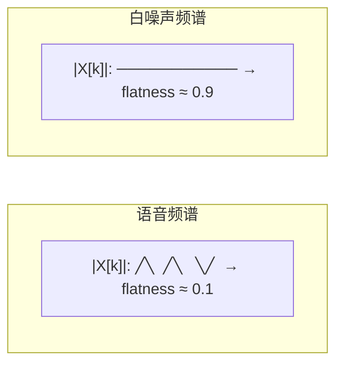
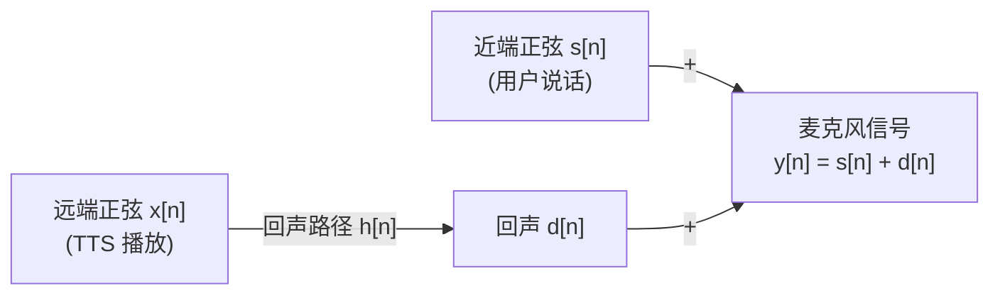
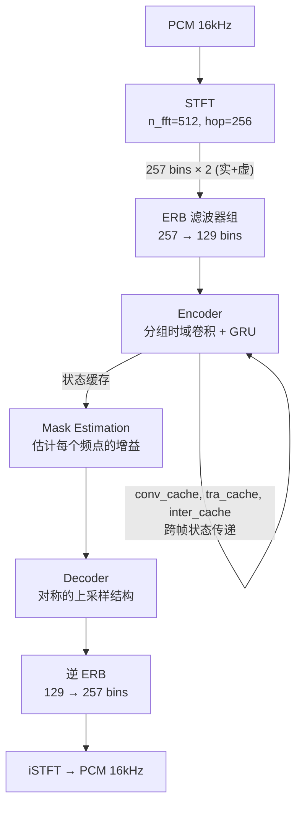
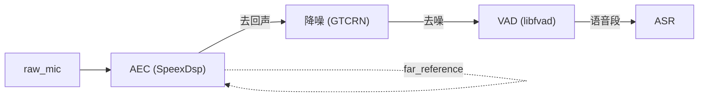

# 第 3 课：语音前端信号处理

> **核心问题**：麦克风采集的原始音频含噪声、回声、静音。在送给 ASR 之前，如何判断"现在有人在说话"、消除设备自己的回声、压制环境噪声？
> **工程锚点**：本项目的 AFE 模块是一个可插拔的处理器链：`AEC(SpeexDsp) → GTCRN降噪 → VAD(libfvad)`，运行在 Jetson Orin NX 上。

---

## 一、VAD：找到"说话的时刻"

语音活动检测（Voice Activity Detection）的目标是**对每一帧音频判断：是语音还是非语音（静音/噪声）**。它直接影响 ASR 的端点检测准确率和系统功耗（不说话时可以休眠模型）。

### 1.1 能量门限法

最原始的 VAD：如果当前帧的能量超过某个阈值 → 判定为语音。

$$E_t = \frac{1}{N} \sum_{n=0}^{N-1} |x_t[n]|^2$$

```python
def energy_vad(frame, threshold):
    energy = np.mean(frame ** 2)
    return energy > threshold
```

**问题**：
1. **阈值怎么定**？安静环境和嘈杂环境的噪声基底相差 40dB 以上，固定阈值必然失效
2. **无法区分语音和噪声**：关门声、键盘声的能量可能比轻声说话还高
3. **silence→speech 振荡**：一句话中的短暂停顿（辅音间空隙）会被判定为静音，导致频繁切换

**改进：自适应阈值 + 拖尾（hangover）**

```python
# 自适应阈值：根据最近的"静音帧"动态估计噪声基底
if not is_speech:
    noise_floor = 0.9 * noise_floor + 0.1 * energy  # 指数平滑

# 拖尾：判定为 speech 后，多保持 N 帧不切回 silence
if energy > noise_floor * threshold_ratio:
    hangover_counter = HANGOVER_FRAMES  # 重置倒计时
    return True
elif hangover_counter > 0:
    hangover_counter -= 1
    return True  # 仍然判定为语音
else:
    return False
```

拖尾（hangover）解决了"一句话中间的短暂停顿被误切"的问题——它的本质是引入一个**最小语音段长度**的先验。

### 1.2 频谱平坦度（Spectral Flatness）

能量门限法只能回答"响不响"，不能回答"是不是语音"。语音有清晰的**谐波结构**（频域是"尖峰"），而噪声通常是平坦或倾斜的频谱。

**频谱平坦度**（Wiener 熵）量化这种差异：

$$\text{flatness} = \frac{\exp\left(\frac{1}{K}\sum_k \ln |X[k]|\right)}{\frac{1}{K}\sum_k |X[k]|} = \frac{\text{几何平均}}{\text{算术平均}}$$

- 值接近 0 → 频谱"尖锐"（可能是语音，有共振峰）
- 值接近 1 → 频谱"平坦"（很可能是噪声）



频谱平坦度比能量门限更**鲁棒**——即使噪声很响，只要它的频谱是平坦的，就能和语音区分开。但它对音乐、警报声等非语音但有谐波结构的声音会误判。

### 1.3 WebRTC VAD：GMM 分类方案

Google WebRTC 的 VAD 是目前工程界最广泛使用的方案（本项目用的 libfvad 就是它的 C 封装）。

**核心思路**：不是手动设计"能量+平坦度"的规则，而是用 GMM 学习"语音"和"噪声"在特征空间中的分布。

**特征**（每帧 80/10ms 子帧 × 6 维）：
1. 子带能量（6 个频段的 log 能量——80-250Hz, 250-500Hz, 500-1kHz, 1k-2kHz, 2k-3kHz, 3k-4kHz）
2. 总能量的 log

**模型**：两个 GMM——一个建模"语音"的分布，一个建模"噪声"的分布。每帧计算两个 GMM 下的似然比：

$$\text{LR} = \frac{P(\text{features} | \text{speech GMM})}{P(\text{features} | \text{noise GMM})}$$

LR > 阈值 → 判定为语音。

**4 种灵敏度模式**（`fvad_set_mode(0-3)`）：

| 模式 | 说明 | 适用场景 |
|:----:|------|---------|
| 0 | 最宽松（容易判为语音） | 安静环境、桌面麦克风 |
| 1 | 中等 | 一般办公室环境 |
| 2 | 较严格 | 嘈杂环境 |
| 3 | 最严格（保守判为噪声） | 高噪声、移动场景 |

> 模式越高，阈值越高——越不容易误判噪声为语音，但也更容易漏掉轻声说话。

**噪声 GMM 的自适应更新**：WebRTC VAD 在判定为"噪声"的帧上持续更新噪声 GMM 的参数（在线学习），使得它能适应环境噪声的变化——不需要人为设置阈值。

### 1.4 DNN VAD 方案

WebRTC VAD 是 2012 年的方案。近年来出现了基于神经网络的 VAD：

| 方案 | 架构 | 本项目支持？ |
|------|------|:----------:|
| **Silero VAD** | 轻量 CNN + GRU，16kHz 输入 | ✅ sherpa-onnx 已集成 |
| **FSMN-VAD** | FSMN (Feedforward Sequential Memory Network) + 滑动窗口状态机 | ✅ `gguf_mix_inference` 中有 FsmnVad 实现 |
| **GTCRN 内嵌 VAD** | 与降噪联合推理 | ❌ 本项目 GTCRN 不输出 VAD |

FSMN-VAD 的滑动窗口状态机特别值得注意——它用 `sil_to_speech_ms=150` 和 `speech_to_sil_ms=150` 两个参数，要求在 150ms 窗口内多数票才能触发状态切换。这是一种比简单 hangover 更精细的时序平滑策略。

### 1.5 本项目实现

本项目有两层 VAD：

**层 1 — GTCRNProcessor 的静音检测**（`gtcrn_processor.cpp`）：

```cpp
// 基于能量的简单静音检测
float input_energy = 0.0f;
for (size_t i = 0; i < frame_size; ++i) input_energy += input[i] * input[i];
input_energy /= frame_size;

if (input_energy < kSilenceEnergyThreshold) {  // 1e-6f
    silence_frames_++;
} else {
    if (silence_frames_ >= kSilenceFramesThreshold) {  // 8 frames ≈ 128ms
        gtcrn_model_->reset();  // 重置 GTCRN 状态，防止跨语句的状态污染
        crossfade_remaining_ = kCrossfadeFrames;  // 5 frames ≈ 80ms onset 渐入
    }
    silence_frames_ = 0;
}
```

这里的关键设计是**起始渐入保护**（onset crossfade）：检测到新语音段起始后，前 80ms 的音频不是直接用 GTCRN 输出，而是原始音频和 GTCRN 输出的**平滑混合**（alpha 从 0→1）。这解决了 GTCRN 在静音→语音切换瞬间状态未充分适应导致**首音节被过度抑制**的问题——这是 DNN 降噪模型的常见缺陷。

**层 2 — libfvad (WebRTC VAD)**：在 AEC + GTCRN 之后的干净音频上运行标准 WebRTC VAD，作为下游模块的端点检测输入。

---

## 二、AEC：消除设备回声

回声消除（Acoustic Echo Cancellation）解决的是：TTS 播放的声音经过空气传到麦克风，被当成"用户说的话"——系统会被自己的声音触发。

### 2.1 回声路径的数学模型



回声路径 $h[n]$ 包含扬声器→空气→麦克风的全部物理效应：D/A 转换延迟、扬声器频率响应、房间混响、麦克风频率响应。AEC 的目标是**估计 $\hat{d}[n]$ 并从 $y[n]$ 中减去**。

$$e[n] = y[n] - \hat{d}[n] = s[n] + d[n] - \hat{d}[n]$$

当 $\hat{d}[n] \approx d[n]$ 时，$e[n] \approx s[n]$——只剩下用户的声音。

### 2.2 LMS 自适应滤波器

回声路径不是固定的（人在房间走动、扬声器音量改变都会改变 $h[n]$），所以不能用固定的滤波器——需要**自适应**地更新。

**LMS (Least Mean Square) 算法**是最经典的自适应滤波方法：

```
对每一帧 n：
  1. 预测回声：    d̂[n] = Σ w[k] · x[n-k]     (线性卷积)
  2. 计算误差：    e[n] = y[n] - d̂[n]
  3. 更新权重：    w[k] ← w[k] + μ · e[n] · x[n-k]
```

其中：
- $w[k]$ 是自适应滤波器的系数（共 $L$ 个，$L$ = filter_length）
- $\mu$ 是步长（step size）——控制收敛速度和稳定性
- $x[n]$ 是远端正弦（TTS 播放的参考信号）

**步长 $\mu$ 的核心 tradeoff**：
- $\mu$ 大 → 收敛快，但稳态误差大（抖动）
- $\mu$ 小 → 收敛慢，但稳态误差小（平滑）
- SpeexDsp 内部使用**变步长 LMS (NLMS)**，根据输入信号能量自动调整 $\mu$

**滤波器长度 $L$ 的含义**：

$$L = 4096 \text{ samples} = \frac{4096}{16000} = 256\text{ms}$$

这意味着 AEC 能消除的**最大回声时延**是 256ms。如果 TTS 播放到麦克风采集的物理延迟 > 256ms，AEC 就无法消除尾部的回声。本项目选择 4096，在 Jetson Orin NX 的计算开销和实际房间的回声尾长之间取得平衡（典型中小房间的 RT60 通常 < 300ms）。

### 2.3 双讲检测（Double-Talk Detection）

当**用户和 TTS 同时说话**时（双讲场景），误差信号 $e[n]$ 既包含回声残留也包含近端正弦。如果用这个包含语音的误差去更新 $w[k]$，滤波器会被"污染"——它会试图消除用户的语音。

**解决办法**：检测到双讲时**暂停**滤波器更新：

```
if is_double_talk:
    skip_weight_update()  # 冻结滤波器系数
else:
    w[k] ← w[k] + μ · e[n] · x[n-k]  # 只在单讲时更新
```

双讲检测的经典方法：
- **能量比法**：比较 $E_y / E_x$——双讲时近端能量显著高于远端
- **相关性法**：如果 $y[n]$ 和 $x[n]$ 高度相关 → 单讲（只有回声）；低相关 → 双讲（有独立语音混入）
- SpeexDsp 内部使用 **Geigel 算法**——比较当前 $y[n]$ 和历史 $x[n]$ 的最大幅度

### 2.4 本项目实现

```yaml
# afe_config.yaml
aec_filter_length: 4096       # 滤波器长度（256ms @ 16kHz）
enable_aec_on_start: false    # 默认关闭（减少无 TTS 播放时的 CPU 浪费）
far_device: "far_reference"   # 参考信号来源 = tee_playback 的 loopback 分支
```

**关键配置**：`far_device: "far_reference"` 是 AEC 工作的前提。这个虚拟设备从 ALSA Loopback 子流 0 读取 TTS 播放的精确副本（见课程 1 的 ALSA 路由分析）。如果 TTS 写错了设备（如直接写入 `dmix_safe` 而非 `tee_playback`），AEC 拿不到参考信号，回声消除完全失效。

---

## 三、降噪：从谱减法到 DNN

### 3.1 谱减法（Spectral Subtraction）

最经典的降噪方法——直觉非常直接：**噪声的频谱是相对稳定的，从带噪语音的频谱中减去噪声频谱的估计值**。

$$|\hat{S}[k]| = \max\left(|Y[k]| - |\hat{N}[k]|, 0\right)$$

其中 $|Y[k]|$ 是带噪语音的幅度谱，$|\hat{N}[k]|$ 是估计的噪声幅度谱（通常在静音段统计平均得到）。

```python
# 谱减法的极简实现
noise_estimate = np.mean(noise_frames_magnitude, axis=0)  # 从静音段估计
enhanced_mag = np.maximum(speech_mag - noise_estimate, 0)
enhanced = enhanced_mag * np.exp(1j * speech_phase)       # 保留原始相位
output = np.fft.irfft(enhanced)
```

**缺陷**：
1. **音乐噪声**（musical noise）：过减后在频谱上留下孤立的尖峰，听起来像"水声"或"金属铃声"
2. **相位不修正**：只用噪声的幅度信息，相位直接用带噪信号的相位——这在低 SNR 时会引入失真
3. 假设噪声是**平稳的**（频谱不随时间变化）——这在现实中不成立（如键盘声、关门声）

### 3.2 Wiener 滤波

Wiener 滤波是对谱减法的理论升级——它不是简单相减，而是根据每个频点的**先验 SNR** 计算一个最优衰减因子：

$$G[k] = \frac{\xi[k]}{1 + \xi[k]}, \quad \xi[k] = \frac{E[|S[k]|^2]}{E[|N[k]|^2]}$$

$$|\hat{S}[k]| = G[k] \cdot |Y[k]|$$

- 当 SNR 高时（$\xi \gg 1$）→ $G \approx 1$（几乎不衰减，保留语音）
- 当 SNR 低时（$\xi \ll 1$）→ $G \approx \xi$（大幅衰减，压制噪声）

Wiener 滤波的关键在于**怎么估计 $\xi[k]$** ——这就是**噪声估计**（noise estimation）问题。经典的 decision-directed 方法结合了前一帧的 SNR 估计和当前帧的观测，是许多商用降噪方案的基础。

### 3.3 DNN 降噪：GTCRN

GTCRN（Grouped Temporal Convolutional Recurrent Network）是本项目使用的 DNN 降噪模型。架构设计回答了谱减法和 Wiener 滤波的两个致命缺陷。

**核心架构**：



**关键设计**：

**1. ERB 压缩（257 → 129 bins）**：类似于 Mel filterbank，但使用 ERB（Equivalent Rectangular Bandwidth）尺度——比 Mel 更精确地模拟人耳临界带宽。压缩到 129 bins 大幅降低了模型参数量和计算量。

**2. 分组时域卷积 + GRU**：不是纯频域处理——在时间维度和频率维度同时做卷积。GRU（门控循环单元）承载跨帧的状态（`conv_cache`, `tra_cache`, `inter_cache`——三个持久化状态张量），使模型能利用**时间上下文**来区分稳态噪声和瞬态语音。

**3. Mask-based 方法**：模型不直接输出"增强后的频谱"，而是输出一个**掩码**（mask）——每个时频点乘以 0~1 之间的增益。这比直接回归频谱更稳定（mask 的范围有界）：

$$|\hat{S}[k]| = M[k] \cdot |Y[k]|, \quad M[k] \in [0, 1]$$

**为什么 GTCRN 比谱减法好**：
- 谱减法假设"噪声平稳"→ GTCRN 的 GRU 能建模非平稳噪声（键盘声、关门声的时间模式）
- 谱减法不修相位 → GTCRN 同时输出实部和虚部的 mask，隐式修正相位
- 谱减法用固定的 SNR 估计 → GTCRN 的 DNN 从数据中学习最优的增益估计策略

### 3.4 降噪链的级联顺序

前端处理的三个模块（AEC、降噪、VAD）之间存在**误差传播**——前一级的 artifact 会干扰后一级。正确的级联顺序是：



**为什么是这个顺序？**

| 位置 | 放在 AEC 前面？ | 放在降噪前面？ |
|------|:------------:|:------------:|
| **AEC** | — | ✅ 先消回声，避免 GTCRN 把回声当"语音"增强 |
| **降噪** | ❌ 降噪会破坏 AEC 需要的线性关系 | — |
| **VAD** | ❌ 回声可能被误判为语音 | ❌ VAD 应在最干净的信号上判断 |

> **工程验证**：本项目 AFE 处理器链的注册顺序就是 `AEC → GTCRN → VAD`（`afe_io.cpp` 中的 `AddProcessor` 调用）。这个顺序不能随意交换。

---

## 四、实践环节

### 实验 1：能量 VAD + 自适应阈值

```python
import numpy as np
from scipy.io import wavfile

def energy_vad_adaptive(audio, sr, frame_ms=25, hop_ms=10,
                        threshold_ratio=2.0, hangover_ms=300,
                        noise_smooth=0.95):
    """自适应能量 VAD，模拟本项目 GTCRNProcessor 的思路"""
    frame_len = int(sr * frame_ms / 1000)
    hop_len = int(sr * hop_ms / 1000)
    hangover_frames = int(hangover_ms / hop_ms)

    n_frames = (len(audio) - frame_len) // hop_len + 1
    vad = np.zeros(n_frames, dtype=bool)
    noise_floor = np.mean(audio[:sr] ** 2)  # 前 1 秒估计初始噪声
    hangover = 0

    for i in range(n_frames):
        start = i * hop_len
        frame = audio[start:start + frame_len]
        energy = np.mean(frame ** 2)

        if energy > noise_floor * threshold_ratio:
            hangover = hangover_frames
        elif hangover > 0:
            hangover -= 1
        else:
            noise_floor = noise_smooth * noise_floor + (1 - noise_smooth) * energy

        vad[i] = (hangover > 0)

    return vad, n_frames

# 测试
sr, data = wavfile.read('../../../chenxing_agent_ros/test.wav')
data = data / 32768.0

vad, n_frames = energy_vad_adaptive(data, sr)
speech_ratio = vad.sum() / n_frames
print(f"语音帧占比: {speech_ratio:.1%}")
print(f"(期望: 20-40%，如果偏离太多 → 调整 threshold_ratio)")
```

### 实验 2：对比不同 libfvad 模式

```python
# 需要 pip install webrtcvad
import webrtcvad

vad = webrtcvad.Vad()
# 模式 0-3: 0=最宽松, 3=最严格
for mode in range(4):
    vad.set_mode(mode)
    # ... 对音频逐帧调用 vad.is_speech(frame, sr)

# 对比同一段音频在四种模式下的语音帧占比
# 预期: mode 0 > mode 1 > mode 2 > mode 3
```

### 实验 3：模拟回声路径并观察 AEC 效果

```python
# 生成一个模拟场景
far_end = np.random.randn(16000) * 0.3          # TTS 播放（伪随机噪声）
echo_path = np.zeros(4096)
echo_path[0] = 0.8                               # 直接路径
echo_path[200] = 0.3                             # 第一次反射 (12.5ms)
echo_path[500] = 0.1                             # 第二次反射 (31ms)

near_end_speech = np.sin(2*np.pi*440*np.arange(16000)/16000) * 0.5  # A4 音
echo = np.convolve(far_end, echo_path)[:16000]
mic = near_end_speech + echo                     # 麦克风信号（含回声）

# 不做 AEC 的 SNR
snr_before = 10 * np.log10(np.mean(near_end_speech**2) / np.mean(echo**2))
print(f"AEC 前 SNR: {snr_before:.1f} dB")

# (实际 AEC 需要用 LMS 自适应，SpeexDsp 提供了 C API)
# 这里只展示问题——在真实系统中 SpeexDsp 可以做到 30+ dB 的回声抑制
```

---

## 五、关键术语速查

| 术语 | 一句话定义 |
|------|-----------|
| **VAD** | Voice Activity Detection：判断每帧是语音还是非语音 |
| **拖尾 (Hangover)** | 判定 speech→silence 时多等几帧，避免句子中间的短暂停顿被误切 |
| **频谱平坦度** | 几何平均/算术平均——衡量频谱是"尖锐"（语音）还是"平坦"（噪声） |
| **GMM-VAD** | 用两个 GMM（语音/噪声）做似然比分类——WebRTC VAD 的核心 |
| **AEC** | Acoustic Echo Cancellation：从麦克风信号中减去 TTS 播放的回声 |
| **LMS / NLMS** | (Normalized) Least Mean Square：自适应滤波器的最经典算法 |
| **步长 $\mu$** | LMS 的学习率——控制收敛速度 vs 稳态误差 |
| **滤波器长度 $L$** | 自适应滤波器的阶数——决定了能消除的最大回声时延（本项目 4096 = 256ms） |
| **双讲检测** | 区分"只有回声"和"回声+用户说话"——双讲时停止滤波器更新 |
| **谱减法** | $|\hat{S}| = |Y| - |\hat{N}|$——最简单也最容易出"音乐噪声"的降噪方法 |
| **Wiener 滤波** | $G = \xi/(1+\xi)$——根据 SNR 计算最优衰减因子，不需要显式"减" |
| **GTCRN** | 分组时域卷积+GRU 的 DNN 降噪模型——本项目 AFE 的核心 |
| **Mask-based 降噪** | 模型预测每个时频点的增益 $M[k] \in [0,1]$，而非直接回归频谱 |
| **起始渐入 (onset crossfade)** | 新语音段起始时从原始音频平滑过渡到降噪输出——防止首音节被过度抑制 |
| **ERB 尺度** | Equivalent Rectangular Bandwidth——比 Mel 更精确的听觉频率尺度 |

---

## 六、下一步

### 推荐阅读

- **《Speech and Language Processing》— Jurafsky & Martin, 第 9.3 节** — 语音端点检测与特征归一化
- **WebRTC VAD 源码** [vad_core.c](https://github.com/dpirch/libfvad/blob/master/src/vad/vad_core.c) — GmmProbability 函数的完整实现（理解 GMM-VAD 的工程细节）
- **SpeexDsp 文档** [speex_echo.h](https://github.com/xiph/speexdsp/blob/master/include/speex/speex_echo.h) — AEC API 与参数含义
- **GTCRN 论文** — "Grouped Temporal Convolutional Recurrent Networks for Speech Enhancement"

### 下节预告

[**第 4 课：ASR 问题建模**](./第_4_课：ASR问题建模.md) — 进入语音识别的核心。贝叶斯决策框架 $P(W|O)$、声学模型/语言模型/词典的解耦、HMM 状态绑定的动机。前端处理到此为止，接下来是"从音频到文本"的完整旅程。

> **有疑问？** 可以直接问我关于 SpeexDsp 的 MDF 算法细节、GTCRN 的 loss 函数设计、或者本项目的 AEC 配置调优经验。
