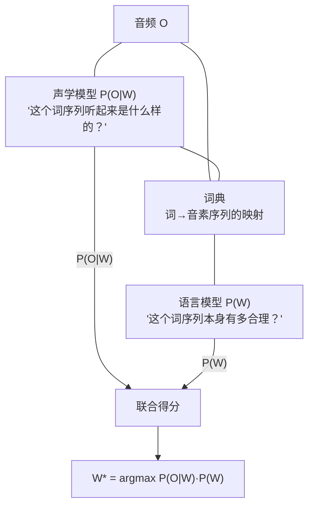
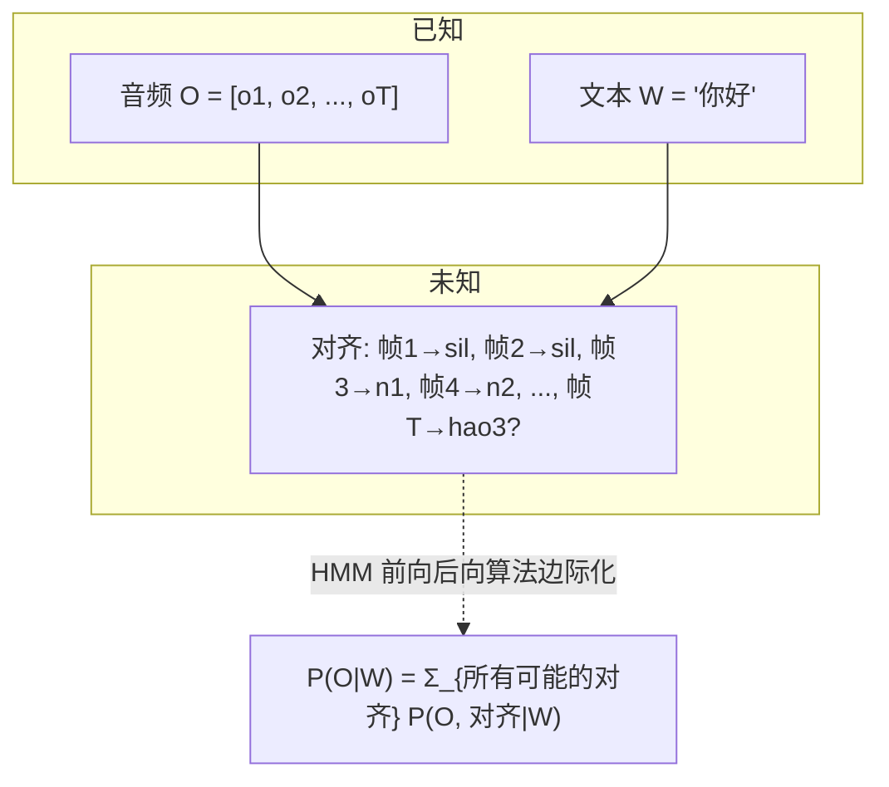
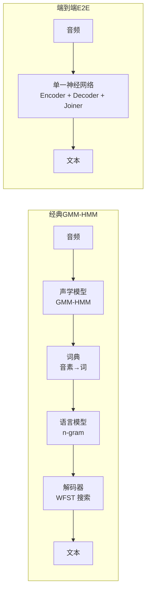

# 第 4 课：ASR 问题建模

> **核心问题**：给定一段音频 $O$（"你 好"），ASR 的目标是找出最可能的词序列 $W$。但 $P(W|O)$ 无法直接建模——需要贝叶斯公式拆成声学模型和语言模型。这个拆解定义了 30 年来 ASR 的整个技术栈。
> **工程锚点**：本项目的 Zipformer ASR 是一个端到端模型——它把这个拆解又"合回去"了。理解"为什么拆"才能理解"为什么合回去"是一次革命。

---

## 一、ASR 的贝叶斯形式化

### 问题陈述

给定一段音频的声学观测序列 $O = (o_1, o_2, ..., o_T)$（$T$ 帧 FBank 特征），ASR 的目标是找到最大化后验概率的词序列 $W = (w_1, w_2, ..., w_N)$：

$$W^* = \arg\max_W P(W | O)$$

直接建模 $P(W|O)$ 极其困难——同一个词序列可以有无穷多种发音方式（不同说话人、语速、口音、情绪、背景噪声）。所以用贝叶斯公式拆解：

$$W^* = \arg\max_W \frac{P(O|W) \cdot P(W)}{P(O)} = \arg\max_W \underbrace{P(O|W)}_{\text{声学模型}} \cdot \underbrace{P(W)}_{\text{语言模型}}$$

$P(O)$ 与 $W$ 无关，省略。



### 为什么必须拆？

**数据效率**：

| 如果直接建模 $P(W|O)$ | 拆成 $P(O|W) \cdot P(W)$ |
|----------------------|--------------------------|
| 需要大量**配对**数据（音频+文本） | 声学模型 $P(O|W)$：需要配对数据 |
| 每一对新词都需要新的配对标注 | 语言模型 $P(W)$：只需要纯文本（维基百科、新闻、图书——几乎是无限的） |

语言模型的训练数据可以比声学模型大几个数量级。拆开这两者，就是在利用"几乎免费"的纯文本数据来约束搜索空间——即使声学上听起来像 "two bee or not two bee"，语言模型会告诉你 $P(\text{to be or not to be}) \gg P(\text{two bee or not two bee})$。

### 同音词消歧——语言模型的价值

$$P(\text{recognize speech} | \text{音频}) \text{ vs } P(\text{wreck a nice beach} | \text{音频})$$

两个词序列在声学上几乎无法区分（尤其是在快速口语中）。但语言模型会无情地倾向于前者——这就是贝叶斯框架的价值。

---

## 二、声学模型 $P(O|W)$

声学模型回答："给定词序列 $W$，观测到声学特征 $O$ 的概率是多少？"

### 从词到音素

直接建模"词→音频"粒度太粗——同一个词有无数种发音。需要更细的粒度：**音素（phoneme）**——语言中最小的辨义单位。

```
英文: ~44 个音素    (如 /k/, /æ/, /t/ → "cat")
中文: ~60 个声母+韵母 (如 b, a → "八")
```

### 从音素到 HMM 状态

即使音素粒度仍然太粗——一个音素持续 50-200ms，在此期间频谱一直在变化。HMM 把每个音素进一步拆成 **3-5 个隐状态**：

```mermaid
graph LR
    subgraph 词 "cat"
        subgraph 音素 "/k/"
            K1((k1)) --> K2((k2)) --> K3((k3))
        end
        subgraph 音素 "/æ/"
            AE1((æ1)) --> AE2((æ2)) --> AE3((æ3))
        end
        subgraph 音素 "/t/"
            T1((t1)) --> T2((t2)) --> T3((t3))
        end
    end
    K3 --> AE1
    AE3 --> T1
```

### 上下文相关音素（Triphone）：为什么 /k/ 不只有一个模型

同一个音素在不同上下文中的发音截然不同。比如英语中 "key" 的 /k/ 和 "cool" 的 /k/：
- "key" (/k/ + /i/)：舌头靠前，/k/ 的频谱"亮"
- "cool" (/k/ + /u/)：舌头靠后，/k/ 的频谱"暗"

因此需要对每个音素的**左右上下文**建模——这就是 **triphone**（三音素）：

$$\text{triphone} = \text{left-phone} - \text{center-phone} + \text{right-phone}$$

```
/k/ in "key":  [sil]-k+iy   ← 左静音，右 /i/
/k/ in "cool": [sil]-k+uw   ← 左静音，右 /u/
```

**组合爆炸**：如果有 44 个音素，理论上 $44^3 \approx 85,000$ 个 triphone。每个 triphone 有 3 个 HMM 状态，每个状态需要一个 GMM（课程 2 第 四 节）——参数总量爆炸。

**状态绑定（State Tying）**：通过决策树将声学上相似的 triphone 状态聚类共享。例如所有"元音前、清辅音后"的元音起始状态可以共用一个 GMM。这是 GMM-HMM ASR 能工程化的核心技巧。

```
85,000 triphones × 3 states = 255,000 HMM 状态
        ↓ 决策树聚类（state tying）
         ~5,000 绑定状态（可训练）
```

---

## 三、词典（发音词典）

词典是声学模型和语言模型之间的**桥梁**——它定义了每个词对应的音素序列。

```
h e l l o  →  hh ah l ow        (ARPAbet 音素标注)
你  好     →  n i3 h ao3        (汉语拼音音素标注)
```

**发音变异**：一个词可以有多种发音（如 "either" → /iːðər/ 或 /aɪðər/）。词典可以列出多个发音变体，解码时取概率最高者。

**中文 ASR 的特殊性**：中文没有天然的"词边界"（不像英文有空格分隔），分词本身就是一个问题。现代中文 ASR 通常使用**字级别**（character-level）建模——直接输出汉字序列而非先分词再映射音素。这避免了分词错误向 ASR 传播，也是端到端模型（如本项目 Zipformer）的默认做法。

---

## 四、语言模型 $P(W)$

语言模型给每个词序列打分——"这句话像不像人能说出来的话"。

### n-gram 语言模型（经典）

$$P(W) = P(w_1, w_2, ..., w_N) = \prod_{i=1}^{N} P(w_i | w_{i-1}, ..., w_{i-n+1})$$

**bigram (n=2)**：只依赖前一个词
$$P(\text{"我 想 听 音乐"}) = P(\text{我}) \cdot P(\text{想}|\text{我}) \cdot P(\text{听}|\text{想}) \cdot P(\text{音乐}|\text{听})$$

**trigram (n=3)**：依赖前两个词（经典 ASR 的默认选择）

n-gram 的问题：$n$ 太大会数据稀疏（很多 5-gram 从没出现过），$n$ 太小会忽略长距离依赖（"我 ...... 不"——中间的十几个词影响了语义，但 3-gram 看不到）。

### 神经网络语言模型（现代）

RNN / Transformer 语言模型可以建模**任意长度**的依赖，且泛化能力远强于 n-gram。在 ASR 解码中，通常先做一遍 beam search（用 n-gram LM），再用 NNLM 对 top-N 候选做**重打分（rescoring）**——既兼顾了速度也利用了 NNLM 的质量。

### 本项目

Zipformer ASR 内置了一个轻量的语言模型（在 decoder/joiner 中隐式学习）。在端到端框架中，语言模型不是单独训练的——它和声学模型**共享编码器**，在同一个 loss 下联合优化。这是 E2E ASR 的革命性简化。

---

## 五、对齐问题：为什么这是理解 CTC 的钥匙

### 问题的本质

ASR 的训练数据是这样的：
```
音频: [0.2秒静音] [0.4秒 "你"] [0.3秒 "好"] [0.1秒静音]  ← 我们能拿到
文本: "你好"                                                 ← 我们能拿到
对齐: ???                                                   ← 我们不知道！
```

我们知道**最终**输出是"你好"，但不知道哪一帧音频对应"你"的哪个 HMM 状态。"你"的第一个 sub-state 是从第 5 帧开始的还是第 12 帧？这叫做**对齐问题**（alignment problem）。



### GMM-HMM 的解决方案：强制对齐

在 GMM-HMM 时代，训练分两步：

1. **初始对齐**：用 flat-start（所有 HMM 状态参数相同）做 Viterbi 解码，得到一个粗糙的对齐
2. **迭代精化**：用上一步的对齐训练 GMM，用新 GMM 重新做对齐，循环（EM 算法）

这个过程叫**强制对齐（forced alignment）**——"强制"是因为文本已知，模型被约束只能输出已知的文本序列，唯一的自由度是"每帧对应哪个状态"。

### 这个方案的问题

1. **需要音素级标注**：至少要知道每个词对应的音素序列（词典），才能构造 HMM 状态图
2. **需要多轮迭代**：初始对齐→训练→重新对齐→训练——耗时长，且初始对齐的误差会传播
3. **无法利用大量无标注音频**：你不能用 YouTube 上的音频来改进声学模型，因为你没有对应的文本

**CTC 的革命性突破**（第 5 课核心）就在于：它不再需要显式对齐。模型自动学习"哪段音频对应哪个输出符号"——这就是"端到端"的含义。

---

## 六、从经典框架到端到端：为什么"合回去"



| 维度 | 经典（GMM-HMM + WFST） | 端到端（Zipformer CTC/RNN-T） |
|------|----------------------|---------------------------|
| **声学模型** | 显式定义（HMM 状态 + GMM/DNN） | 隐式学习（在 encoder 的权重里） |
| **发音词典** | 必须手工构建 | 不需要（模型直接学字/子词→音频的映射） |
| **语言模型** | 独立训练、可替换 | 可集成（shallow fusion）也可以不 |
| **对齐** | 需要强制对齐 | 自动学习（CTC/RNN-T 的内部机制） |
| **训练数据** | 需要音素级标注 | 只需音频+文本对 |
| **工程复杂度** | 多个独立模块需分别调优 | 一个模型端到端训练 |

> **本项目 Zipformer ASR** 就是走的端到端路线。它不需要词典、不需要强制对齐、不需要 WFST 解码图——一个 ONNX 模型文件吞进去音频，吐出来文本。下一课（CTC）将解释它内部是怎么自动解决对齐问题的。

---

## 七、实践环节

### 实验 1：手算贝叶斯 ASR 的一个微型例子

```python
# 场景：系统听到"hello"或"help"，已知：
# 声学模型：P(O|"hello") = 0.7, P(O|"help") = 0.8  ← "help"声学上更匹配
# 语言模型：P("hello") = 0.6, P("help") = 0.1       ← "hello"更常见

P_O_given_hello = 0.7
P_O_given_help = 0.8
P_hello = 0.6
P_help = 0.1

# 贝叶斯得分
score_hello = P_O_given_hello * P_hello  # 0.42
score_help = P_O_given_help * P_help      # 0.08

print(f"P(O|hello)·P(hello) = {score_hello:.2f}")
print(f"P(O|help)·P(help)   = {score_help:.2f}")
print(f"→ 最终选择: {'hello' if score_hello > score_help else 'help'}")
# 输出: hello
# 虽然声学上 help 更匹配（0.8 > 0.7），但语言模型让它输了
```

### 实验 2：音素→HMM 状态展开

```python
# 模拟一个 3 状态 HMM 的音素序列
phonemes = ["sil", "n", "i3", "h", "ao3", "sil"]
states_per_phone = 3

print("音素 → HMM 状态展开：")
state_seq = []
for p in phonemes:
    for s in range(states_per_phone):
        state_name = f"{p}_{s+1}"
        state_seq.append(state_name)
        print(f"  {p} → [{state_name}]")

print(f"\n总共: {len(phonemes)} 个音素 → {len(state_seq)} 个 HMM 状态")
print(f"如果每状态平均停留 3 帧 (30ms @ 10ms hop)")
print(f"总时长 ≈ {len(state_seq) * 3 * 10}ms")
```

### 实验 3：triphone 的组合爆炸可视化

```python
# 44 个音素的 triphone 空间
n_phones = 44
n_triphones_raw = n_phones ** 3
n_states_raw = n_triphones_raw * 3  # 每个 triphone 3 个 HMM 状态

n_bound_states = 5000  # 典型绑定后的状态数

print(f"原始 triphone 数: {n_triphones_raw:,}")
print(f"原始 HMM 状态数: {n_states_raw:,}")
print(f"决策树聚类后: {n_bound_states:,}")
print(f"压缩比: {n_states_raw / n_bound_states:.0f}x")
print(f"\n如果不做状态绑定:")
print(f"  每个状态需要至少 100 帧训练数据（保守估计）")
print(f"  需要总帧数 ≈ {n_states_raw * 100:,} 帧")
print(f"  ≈ {n_states_raw * 100 * 10 / 1000 / 3600:.0f} 小时音频")
print(f"  → 数据需求远超实际可获取量")
```

---

## 八、关键术语速查

| 术语 | 一句话定义 |
|------|-----------|
| **贝叶斯 ASR** | $W^* = \arg\max P(O\|W) \cdot P(W)$——把识别拆成声学+语言两部分 |
| **音素 (Phoneme)** | 语言中最小的辨义声音单位（英语 ~44 个，中文 ~60 个声韵母） |
| **Triphone** | 考虑左右上下文的音素模型——如 [sil]-k+iy vs [sil]-k+uw |
| **状态绑定 (State Tying)** | 用决策树将声学相似的 HMM 状态聚类——把 25 万状态压缩到 ~5000 |
| **词典 (Lexicon)** | 词→音素序列的映射表——连接声学模型和语言模型的桥梁 |
| **语言模型 (LM)** | $P(W)$——判断一个词序列"像不像人话"的概率模型 |
| **n-gram** | $P(w_i\|w_{i-1}...w_{i-n+1})$——只依赖前 n-1 个词的语言模型 |
| **对齐 (Alignment)** | 哪一帧音频对应哪个输出符号——ASR 训练的核心难题 |
| **强制对齐** | 已知文本 + 音频 → 用 Viterbi 求出最可能的帧-状态对应关系 |
| **端到端 (E2E)** | 不区分声学模型/词典/语言模型——单一网络直接音频→文本 |
| **Shallow Fusion** | 在 E2E 解码时附加外部 LM 的得分——"端到端 + 可选的 LM boost" |

---

## 九、下一步

### 推荐阅读

- **《Speech and Language Processing》— Jurafsky & Martin, 第 10 章** [在线版](https://web.stanford.edu/~jurafsky/slp3/) — HMM、前向后向、Baum-Welch 的完整推导
- **同书第 3 章** — n-gram 语言模型的数学与平滑技术（Good-Turing、Kneser-Ney）
- **Rabiner (1989)** — "A Tutorial on Hidden Markov Models" — 语音识别引用量最高的论文之一

### 下节预告

[**第 5 课：CTC——无对齐的端到端训练**](./第_5_课：CTC无对齐的端到端训练.md) — 引入 blank token、前向后向算法的边际化、尖峰分布。CTC 是第一个"不需要显式对齐"的 ASR 训练方法，它的前向后向计算与 HMM 有着惊人的对称性。

> **有疑问？** 可以直接问我 triphone 决策树聚类的原理、中文 ASR 的音素体系设计、或者 E2E 模型如何隐式学习语言模型。
