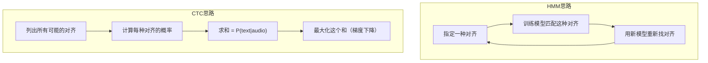
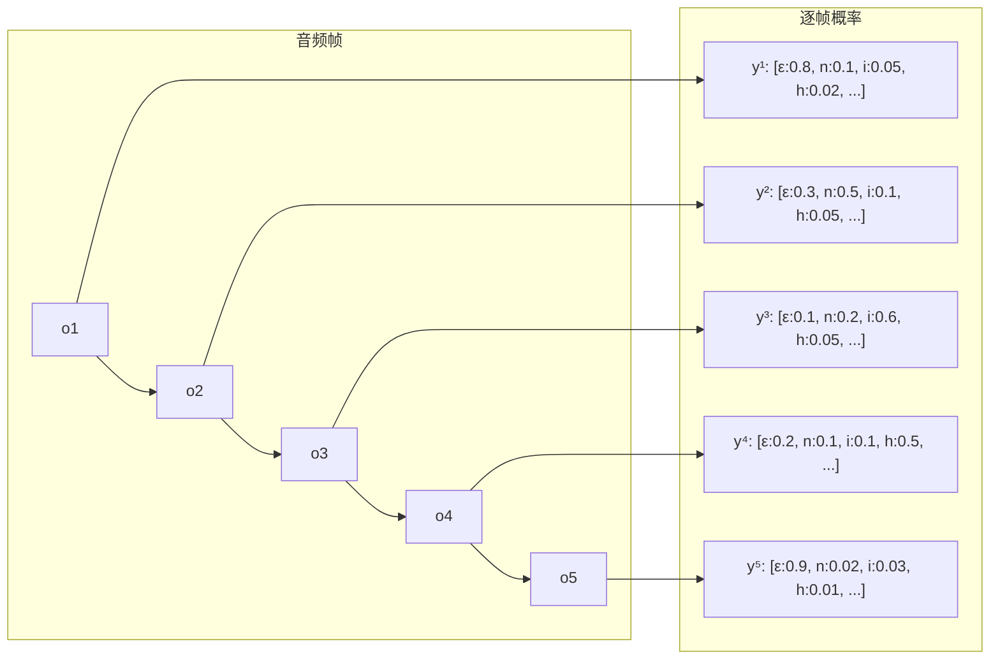
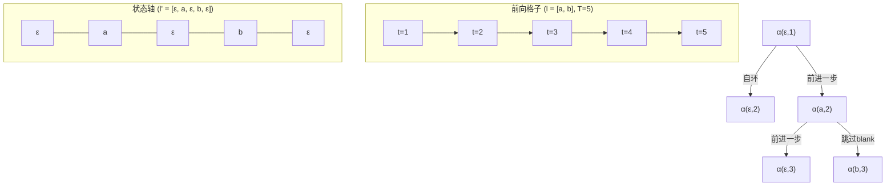
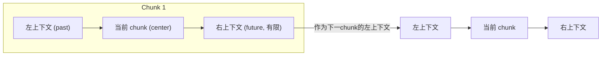
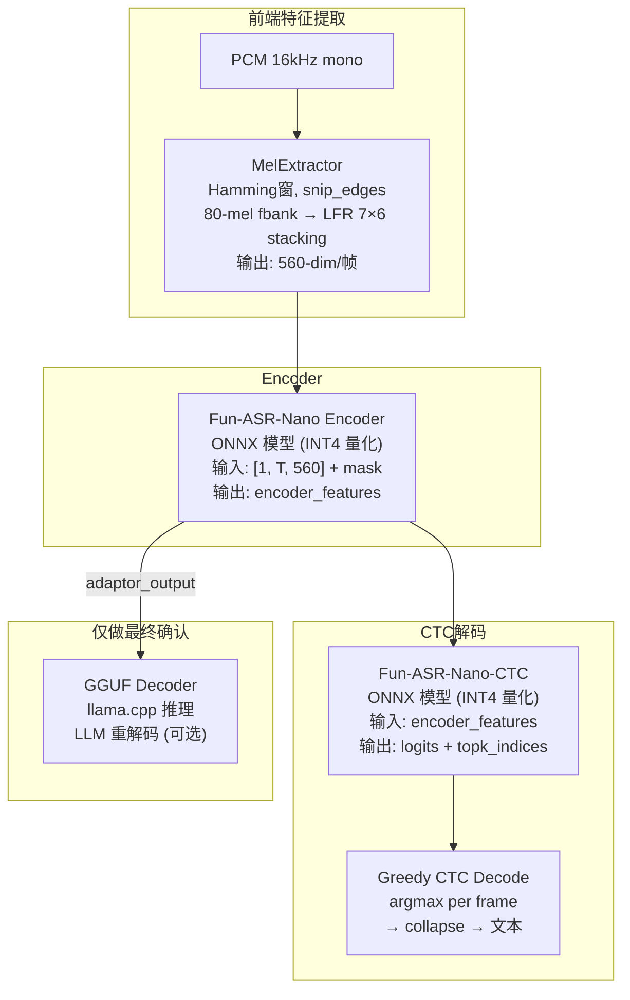

# 第 5 课：CTC——无对齐的端到端训练

> **核心问题**：第 4 课留下的最大问题是"对齐"——音频帧和输出文本之间的对应关系未知。CTC (Connectionist Temporal Classification) 是第一个不需要显式对齐就能训练 ASR 的方法。它引入了一个简单的 trick（blank token）和一个精巧的数学框架（前向后向边际化），让模型自己学会"哪段音频对应哪个字"。
> **工程锚点**：本项目的 Zipformer 模型使用 CTC 作为辅助 loss（与 RNN-T 联合训练），且 sherpa-onnx 支持纯 CTC 解码模式。

---

## 一、CTC 的核心 Idea

### 回顾：为什么 HMM 需要显式对齐

```
HMM 方法:
  已知：音频 O = [o1, o2, ..., oT]，文本 "你好"
  需要：强制对齐 → 哪帧对应 n，哪帧对应 i3，哪帧对应 h...
  问题：需要多轮迭代，初始误差传播，无法用无标注数据
  
CTC 方法:
  已知：音频 O = [o1, o2, ..., oT]，文本 "你好"
  策略：不指定对齐，让模型考虑所有可能的对齐方式
  边际化：P("你好"|O) = Σ P(某个对齐|O)
```



### Blank Token 的引入

CTC 的 genius 在于 **blank token**（记作 $\epsilon$ 或 `-`）。它在输出序列中扮演三个角色：

1. **填充时间**：当没有输出符号时（如静音段），模型输出 blank
2. **分隔重复字符**：当连续两个相同字符出现时（如 "hello" 中的两个 l），用 blank 分隔
3. **吸收不确定帧**：音素过渡段（动态变化的帧），模型更倾向于输出 blank 而非强行对齐

```python
# 对齐 → 文本 的映射规则（CTC collapse）：
# 1. 合并连续相同字符
# 2. 删除所有 blank

对齐序列:  [-, -, n, n, -, i3, i3, -, h, -, -, -, ao3, ao3, ao3, -]
           ↓ collapse（合并连续相同 + 删除 blank）
输出文本:  "n i3 h ao3" → "你好"
```

---

## 二、CTC 的数学框架

### 从音频到逐帧分布

首先，一个神经网络（encoder）将音频帧序列 $O = [o_1, ..., o_T]$ 映射为逐帧的**字符概率分布**：

$$y_k^t = P(\text{输出字符 } k \text{ 在时刻 } t), \quad k \in \{\epsilon, \text{所有字符}\}$$

输出层维度 = $|V| + 1$（所有字符 + blank）。$y_k^t$ 是一个 softmax 输出。



### 路径概率

给定一个对齐路径 $\pi = (\pi_1, \pi_2, ..., \pi_T)$（$\pi_t \in \{\epsilon, \text{所有字符}\}$），CTC 做了一个**条件独立假设**：

$$P(\pi | O) = \prod_{t=1}^{T} y_{\pi_t}^t$$

即：每帧的输出独立于其他帧（给定音频特征）。这是 CTC 的**"马尔可夫"假设**——也是它最主要的局限。

### 边际化：对所有路径求和

文本 $\mathbf{l}$ 可能是从**很多**不同的对齐路径 collapse 得到的。CTC 将它们全部求和：

$$P(\mathbf{l} | O) = \sum_{\pi \in \mathcal{B}^{-1}(\mathbf{l})} P(\pi | O)$$

其中 $\mathcal{B}^{-1}(\mathbf{l})$ 是所有 collapse 后等于 $\mathbf{l}$ 的路径的集合。$\mathcal{B}$ 是 collapse 映射函数。

**直接枚举不可行**：对于长度 $T=100$ 的音频和文本 $l=3$ 个字符，可能的对齐路径数量是 $O(|V|^T)$——天文数字。

---

## 三、前向后向算法：高效计算 CTC Loss

### 扩展标签序列

为了处理 blank，将原始标签 $\mathbf{l}$ 扩展为 $\mathbf{l}'$：在每个字符前后加上 $\epsilon$，并在字符之间插入 $\epsilon$。

```
l = [n, i3, h]  (3个字符)
l'= [ε, n, ε, i3, ε, h, ε]  (2|V|+1 = 7个符号)
```

### 前向概率 $\alpha(s, t)$

$\alpha(s, t)$ = 在时刻 $t$，到达扩展标签的第 $s$ 个位置的所有路径的概率之和。

```python
# 前向算法（简化伪代码）
α[1, 1] = y[ε, 1]                    # 从 blank 开始
α[2, 1] = y[l'[2], 1]                # 或从第一个字符开始
α[s, 1] = 0  for s > 2               # 第1帧不可能到达更远的位置

for t in range(2, T+1):
    for s in range(1, len(l')+1):
        # 从哪些前驱状态可以到达 (s, t)？
        # 1. 从 (s, t-1): 原地停留（自环）
        # 2. 从 (s-1, t-1): 向前一步
        # 3. 从 (s-2, t-1): 跳过 blank（当 l'[s] ≠ l'[s-2] 时）
        α[s, t] = y[l'[s], t] * sum(上述前驱的 α)
```

$$\alpha(s, t) = y_{l'_s}^t \cdot \sum_{i: \text{valid predecessors}} \alpha(i, t-1)$$

**终止**：$P(\mathbf{l}|O) = \alpha(|\mathbf{l}'|, T) + \alpha(|\mathbf{l}'|-1, T)$（最后两个状态，其中一个对应末尾 blank）。

### 直观理解前向传播



### CTC Loss

$$L_{\text{CTC}} = -\ln P(\mathbf{l} | O)$$

这就是训练时的损失函数。通过反向传播同时更新 encoder 的所有参数。**不需要任何显式对齐**——梯度会自动流向那些"贡献了正确对齐"的帧。

---

## 四、CTC 的尖峰分布（Spike）

训练好的 CTC 模型在逐帧输出上表现出一个有趣的特征：**尖峰**——大部分帧输出 blank，只在关键帧输出字符。

```
音频: [ 静音 ][   n   ][   n→i  ][   i3   ][  i3→h  ][   h   ][ 静音  ]
CTC:  [  ε  ε ][ n  ε  ][  ε  ε  ][ i3  ε  ][  ε  ε  ][ h  ε  ][  ε  ε  ]
           ↑                     ↑                     ↑
         尖峰                   尖峰                   尖峰
```

这并非训练目标的一部分——CTC 的 loss 函数没有显式鼓励稀疏性。尖峰是**训练的涌现现象**。原因：

- 如果模型在连续的几帧都输出同一个字符（如 `n, n, n`），这对 loss 的边际贡献和只在某一帧输出 `n` 而其他帧输出 blank 是一样的
- 但由于 blank 的"自环"在格子中有更多路径支持，模型倾向于用 blank 来消耗时间
- 结果：每个字符只在一帧"喊"出来，其余帧保持沉默

**工程含义**：尖峰分布意味着 CTC 解码时可以**直接取每帧的 argmax**，不需要 beam search——因为 blank 会"自动"过滤掉无关帧。这是 CTC 流式推理速度优势的来源之一。

---

## 五、CTC 解码方法

### 1. 贪婪解码（Greedy）

```python
def ctc_greedy(y):
    """y: [T, |V|+1] 逐帧概率"""
    best_path = y.argmax(axis=1)  # 每帧取最大概率的符号
    # Collapse: 合并连续相同符号 + 删除 blank
    result = []
    prev = blank_id
    for token in best_path:
        if token != blank_id and token != prev:
            result.append(token)
        prev = token
    return result
```

**优点**：极快，$O(T)$。
**缺点**：没有考虑"多条路径都能 collapse 到同一文本"——可能错过概率更高但非贪心的路径。

### 2. Prefix Search（前缀搜索）

维护多个候选前缀，每个前缀跟踪：在当前时刻以 blank 结尾的概率 + 以非 blank 结尾的概率。

```python
# Prefix Search 的核心状态
for each prefix p:
    p_b = P(路径到达 p，且最后一帧为 ε)  # blank-ending
    p_nb = P(路径到达 p，且最后一帧为 非ε)  # non-blank-ending
```

对于每帧的新字符 $k$：
- 如果 $k = \epsilon$：延长可继续  $\rightarrow$ 更新 $p_b$
- 如果 $k \neq \epsilon$ 且 $k \neq \text{prefix 的最后一个字符}$：延长 prefix  $\rightarrow$ 创建新候选
- 如果 $k = \text{prefix 的最后一个字符}$（重复字符）：需要中间有 blank  $\rightarrow$ 显式处理

prefix search 是**精确的 CTC 解码**（不考虑 beam pruning），复杂度 $O(T \cdot 2^{|V|})$——对中文这种大词表（~6000+ 字）不可行。因此工程中几乎总是用 beam search。

### 3. Beam Search

保留 top-K 个候选前缀，每步剪枝。

```python
beam = [empty_prefix]
for t in range(T):
    new_beam = []
    for prefix in beam:
        for k in top_M_tokens(y[t]):  # 每帧只考虑最可能的 M 个字符
            new_prefix = extend(prefix, k)
            new_beam.append(new_prefix)
    beam = sorted(new_beam, key=score)[:K]  # 保留 top-K
```

### 外部语言模型的融合（Shallow Fusion）

CTC 的独立假设意味着它输出的文本序列在语言上可能不流畅。一个外部语言模型可以在 beam search 时加权：

$$\text{score}(\mathbf{l}) = \underbrace{\log P_{\text{CTC}}(\mathbf{l}|O)}_{\text{声学得分}} + \alpha \cdot \underbrace{\log P_{\text{LM}}(\mathbf{l})}_{\text{语言模型得分}} + \beta \cdot |\mathbf{l}|$$

> **本项目**的 Zipformer 使用 `modified_beam_search` 作为解码方法，正是 CTC beam search + LM shallow fusion 的联合方案。

#### 工程注意事项：Beam Search 的延迟代价与优化策略

**beam search 的延迟不是 bug，是算法复杂度的直接体现。** 以下是基于本项目 Jetson Orin NX 的实测经验。

**复杂度对比**：

| 解码方式 | 复杂度 | 本项目实测相对延迟 |
|---------|--------|:---------------:|
| Greedy | $O(T)$ | 1× |
| Beam (K=4) | $O(T \cdot K)$ | ~2× |
| Beam (K=8, 默认) | $O(T \cdot K)$ | ~3-5× |
| Beam (K=16) | $O(T \cdot K)$ | ~8× |

**为什么 Transducer 的 beam search 比纯 CTC 更重？**

```
纯 CTC beam search:
  每帧: K个候选 × 查softmax表 → 保留K个
  Joint Network: 不需要（encoder输出直接 = 字符分布）

Transducer beam search (本项目 Zipformer):
  每帧: K个候选 → 每个候选跑一遍 Joint Network → 保留K个
  Joint Network = encoder_out + prediction_out → 拼接 → 矩阵乘 → softmax
  额外开销: ~3-5× 相比纯 CTC
```

**四种优化策略（按性价比排序）**：

**策略 1：降低 beam width（零开发成本）**

```yaml
# zipformer_asr_config.yaml
max_active_paths: 4  # 从 8 降到 4
```

| beam width | CER 变化（典型） | 延迟减少 |
|:---------:|:--------------:|:------:|
| 1 (greedy) | +3~5% | -70% |
| 3~4 | +1~2% | -40~50% |
| 8 (默认) | 基准 | 基准 |

beam width 的精度收益是**边际递减**的——从 1→4 的提升远大于从 4→8。边缘设备上 beam=3~4 通常是性价比最优。

**策略 2：分阶段搜索（中开发成本，高收益）**

流式中间结果用 greedy，端点检测后最终确认用 beam：

```
流式阶段 (EmitPartial):  greedy → 用户看到字在出来 (< 50ms)
端点检测后 (Finalize):   beam (K=8) → 最终准确的完整句 (~200ms)
```

**原理**：用户感知延迟主要来自"第一个字多久出来"（TTFP）和"中间结果的流畅度"，而非"final 结果多快"。用 beam 慢 150ms 换准确率，用户几乎无感——因为端点检测后的 silent gap 本身就有 500-800ms。

**策略 3：LM rescoring 替代 shallow fusion**

shallow fusion（beam search 时每步查 LM）是**乘法级**开销。改为后验 rescoring：

```
1. Greedy 或窄 beam (K=2) → 生成 top-N 候选 (N=5~20)
2. 外部 LM 对 N 个候选重打分 → 选最优
```

LM 计算次数从 $O(K \cdot T)$ 降为 $O(N)$。

**策略 4：batch joint network 推理**

把 K 个候选的 joint network 输入**拼成 batch**并行推理，而非 K 次独立调用。ONNX Runtime 的批量矩阵乘法效率远高于串行——但在 sherpa-onnx 中是否已实现需要验证。

> **经验法则**：先降 beam width（1 行配置），再考虑分阶段搜索。90% 的延迟问题是 beam width 过高导致的。相关问题在第 17 课（端到端延迟优化）和第 20 课（交互体验优化）中会进一步展开。

---

## 六、流式 CTC：Chunk-based 推理

### 标准 CTC 的问题

标准 CTC 在整句音频上做 encoder → softmax → 解码。如果要流式识别（边听边出字），encoder 不能看到未来帧——否则 CTC 在开头就可能"作弊"（通过未来信息预测当前字符）。

### 解决方案：Chunk-based CTC

将 audio encoder 限制为**只能看到有限上下文**：



| 方案 | 左上下文 | 右上下文 (lookahead) | 流式能力 |
|------|:-------:|:-----------------:|:------:|
| **全注意力 (offline)** | 全句 | 全句 | ❌ |
| **Chunk 流式** | 前 N 帧 | 后 M 帧 (M=1~4) | ✅ |
| **严格因果** | 前 N 帧 | 0 | ✅ (最高流式性) |

右上下文（lookahead）是一个关键的延迟-精度 tradeoff：
- lookahead=0：最低延迟，但模型看不到音素过渡的"后半段"，精度下降
- lookahead=4 chunks (~1.6s)：精度接近 offline，但延迟增加 1.6s

**本项目 Zipformer** 的 chunk 模式使用的 right context = 2 chunks，在延迟和精度之间取平衡。第 1 课的进阶讨论中提到的 GTCRN-ASR 特征共享也在这一层有交叉——如果降噪模型和 ASR 的 chunk 边界不对齐，会产生额外的延迟。

---

## 七、CTC 的局限与 RNN-T 的动机

### CTC 的**条件独立假设**

$$P(\pi|O) = \prod_t y_{\pi_t}^t$$

这假设 $y_{\pi_t}^t$ 只依赖 $o_t$，不依赖 $\pi_{t-1}$（前面输出了什么）。这意味着：

**1. CTC 无法建模语言上下文**：在当前帧输出 "b" 还是 "d"，取决于前面是 "a"（形成 "ab"）还是 "a"（不影响 "d"）——CTC 完全不知道这个信息。它只能靠声学特征做决定。

**2. 需要外部语言模型**：CTC 纯粹用于声学建模，语言建模必须由单独的 LM 在解码时提供。

**3. 空白 token 的过度使用**：在噪声帧或音素过渡段，模型可以"偷懒"输出 blank 而不做出艰难的选择。

### RNN-T 的改进

RNN-T（第 6 课）在 CTC 的基础上增加了一个 **Prediction Network**——一个内置的语言模型，使得当前输出不仅取决于声学帧，还取决于**已经输出的字符序列**：

$$\text{CTC: } P(\pi_t|o_t) \quad \text{vs} \quad \text{RNN-T: } P(y_u|\mathbf{y}_{1:u-1}, \mathbf{o}_{1:t})$$

这就是从"条件独立"到"自回归"的跨越。

---

## 八、实践环节

### 实验 1：CTC collapse 的纯 Python 实现

```python
def ctc_collapse(path, blank_id=0):
    """将 CTC 对齐路径 collapse 为最终文本"""
    result = []
    prev = blank_id
    for token in path:
        if token != blank_id and token != prev:
            result.append(token)
        prev = token
    return result

# 测试
align_1 = [0, 0, 3, 3, 0, 1, 1, 0, 2, 0, 0, 0, 4, 4, 4, 0]  # 0 = blank
print(f"对齐: {align_1}")
print(f"Collapse: {ctc_collapse(align_1)}")

align_2 = [3, 3, 3, 1, 1, 1, 2, 2, 2, 4, 4, 4]  # 没有 blank
print(f"\n对齐(无blank): {align_2}")
print(f"Collapse: {ctc_collapse(align_2)}")  # [3,1,2,4] ≠ [3,1,2,4] 需要blank分隔重复

# 验证：'aa' 和 'a' 的区别
print(f"\n[1, 1, 1] → {ctc_collapse([1,1,1])}")     # ['a']
print(f"[1, 0, 1] → {ctc_collapse([1,0,1])}")     # ['a', 'a'] — blank分隔了重复
```

### 实验 2：CTC 前向算法的微型实现

```python
import numpy as np

def ctc_forward(y, labels, blank=0):
    """
    y: [T, V] 逐帧概率（softmax 输出）
    labels: 真实文本（不含 blank）
    返回: -ln P(labels|y)
    """
    T, V = y.shape
    # 扩展标签: 在首尾和字符间插入 blank
    L = [blank]
    for lab in labels:
        L.extend([lab, blank])
    S = len(L)

    # 初始化
    alpha = np.zeros((T, S))
    alpha[0, 0] = y[0, blank]
    if S > 1:
        alpha[0, 1] = y[0, L[1]]

    # 递推
    for t in range(1, T):
        for s in range(S):
            total = alpha[t-1, s]  # 自环（stay）
            if s > 0:
                total += alpha[t-1, s-1]  # 前进一步
            if s > 1 and L[s] != blank and L[s] != L[s-2]:
                total += alpha[t-1, s-2]  # 跳过 blank
            alpha[t, s] = y[t, L[s]] * total

    # 终止：最后两个状态
    p = alpha[-1, -1] + alpha[-1, -2]
    return -np.log(max(p, 1e-10))

# 测试：简单的 3 帧场景
y = np.array([
    [0.9, 0.05, 0.05],  # t=0: 大概率 blank
    [0.3, 0.6,  0.1],   # t=1: 大概率 'a'
    [0.8, 0.1,  0.1],   # t=2: 大概率 blank
])
labels = [1]  # 期望输出 'a'
loss = ctc_forward(y, labels)
print(f"CTC loss: {loss:.4f}")
print(f"(期望: 较小值 < 2, 表示模型预测与真实标签匹配)")
```

### 实验 3：可视 CTC 的尖峰分布

```python
import matplotlib.pyplot as plt

# 模拟一个训练好的 CTC 模型的逐帧输出
# (实际数据需要跑模型推理，这里用模拟数据展示尖峰现象)
T = 50
V = 6  # [ε, a, b, c, d, e]
np.random.seed(42)

# 生成尖峰分布：大部分帧输出 blank，少数帧输出字符
y = np.random.randn(T, V) * 0.5
y[:, 0] += 2.0   # blank 的 logit 偏高（baseline）
y[10, 1]  += 5.0  # 第10帧：尖峰 → 'a'
y[25, 2]  += 5.0  # 第25帧：尖峰 → 'b'
y[40, 3]  += 5.0  # 第40帧：尖峰 → 'c'

y = np.exp(y) / np.exp(y).sum(axis=1, keepdims=True)  # softmax

plt.figure(figsize=(12, 4))
for k in range(V):
    label = 'ε (blank)' if k == 0 else f'char {chr(96+k)}'
    plt.plot(y[:, k], label=label, alpha=0.7)
plt.xlabel("时间帧 t")
plt.ylabel("P(字符|帧)")
plt.title("CTC 尖峰分布 (模拟)")
plt.legend()
plt.grid(alpha=0.3)
plt.savefig('ctc_spikes.png', dpi=150)
print("注意: 字符概率只在少数帧突出 → 尖峰")
print("空白 token 在大部分帧占主导 → 自动吸收静音/过渡")
```

---

## 九、关键术语速查

| 术语 | 一句话定义 |
|------|-----------|
| **Blank Token ($\epsilon$)** | CTC 引入的"空输出"——填充时间、分隔重复字符、吸收不确定帧 |
| **Collapse** | 对齐路径到文本的映射：合并连续相同字符 + 删除 blank |
| **前向-后向算法** | $O(T \cdot |\mathbf{l}'|)$ 的边际化算法——计算所有对齐路径的概率和 |
| **条件独立假设** | $P(\pi\|O) = \prod_t y_{\pi_t}^t$——CTC 最大的局限，也是 RNN-T 要解决的核心问题 |
| **尖峰分布** | 训练好的 CTC 自然而然地在大部分帧输出 blank，只在关键帧输出字符 |
| **Prefix Search** | 精确的 CTC 解码——跟踪每个前缀的 blank-ending 和 non-blank-ending 状态 |
| **Beam Search** | 保留 top-K 候选的近似前缀搜索——实际工程的标准解码方式 |
| **Shallow Fusion** | 在 beam search 得分中加权外部语言模型——弥补 CTC 的无语言建模能力 |
| **Chunk-based CTC** | 流式 CTC：限制 encoder 的右上下文（lookahead），用 chunk 处理代替全句处理 |
| **Lookahead** | 流式 ASR 中 encoder 可以"看到"的未来帧数——延迟与精度的核心 tradeoff |

---

## 十、工程实例：本项目的双引擎 CTC 对比

本项目的 `src/speech/third_party/gguf_mix_inference/` 包含了一个完整的纯 CTC ASR 实现——**Fun-ASR-Nano**。它与主引擎 Zipformer（Transducer 架构）构成了一个极好的"轻量纯 CTC vs 重量 Transducer"的对比案例，本节基于源码深入解析。

### 10.1 Fun-ASR-Nano CTC 的整体架构



**源码**：`src/ctc_decoder.cpp:186-299` — `CTCDecoder::decode()` 函数

### 10.2 解码策略：极简 Greedy

与课程前文讨论的 beam search / prefix search 不同，Fun-ASR-Nano 使用的是**最简单的 greedy 解码**：

```cpp
// 核心逻辑（src/ctc_decoder.cpp:262-296，简化）
for (int t = 0; t < time_steps; ++t) {
    // 1. 逐帧取 argmax（ONNX 模型已预计算 topk_indices）
    int token_id = topk_indices[t * top_k];  // top-1

    // 2. Hotword 偏置（可选，logit + 2.0f）
    if (has_hotwords && has_logits) {
        for (auto& hotword_id : hotword_ids_) {
            logits[t * vocab_size + hotword_id] += hotword_bias_;
        }
        token_id = argmax(logits[t*vocab_size : (t+1)*vocab_size]);
    }

    // 3. CTC collapse
    if (token_id == previous) continue;  // 合并连续相同
    if (token_id == blank_id_) continue;  // 删除 blank
    result += id_to_token_[token_id];
}
```

**设计选择的工程理由**：

| 维度 | Greedy (Fun-ASR-Nano) | Beam Search (Zipformer) |
|------|----------------------|------------------------|
| **计算量** | $O(T)$，< 0.5ms | $O(T \cdot K \cdot \|V\|)$，~5-10ms |
| **精度损失** | 约 2-5% CER 相对下降 | 基准 |
| **边缘适用性** | ✅ Jetson CPU 可行 | ⚠ 需要更多算力或 GPU |
| **外部 LM** | 由后续 GGUF LLM 弥补 | 内置 shallow fusion |

> **关键洞察**：Fun-ASR-Nano 用 greedy CTC 做**快速初步解码**，然后用 GGUF LLM（一个基于 llama.cpp 的小语言模型）对结果做**重解码/纠错**。这不是传统的 CTC + n-gram LM，而是 **CTC + LLM** 的分层架构——用 LLM 的语言能力弥补 greedy CTC 的精度损失。这是边缘设备上一个非常聪明的工程权衡：CTC 负责"快"，LLM 负责"准"。

### 10.3 Blank ID 的自动检测

CTC 模型通常约定 blank 是 vocab 的第 0 个 token，但 ONNX 模型的 export 过程可能改变 token 顺序。Fun-ASR-Nano 使用了**语义匹配**而非硬编码位置：

```cpp
// src/ctc_decoder.cpp:129-136
blank_id_ = max_id;  // 默认: 最后一个 token
for (size_t i = 0; i < id_to_token_.size(); ++i) {
    const std::string clean = ToLower(Trim(id_to_token_[i]));
    if (clean == "<blk>" || clean == "<blank>" || clean == "<pad>") {
        blank_id_ = static_cast<int>(i);
        break;
    }
}
```

这种**防御性设计**避免了 hardcode `blank_id=0` 的假设——不同训练框架（ESPnet、Wenet、FunASR）导出 ONNX 时可能使用不同的 token 顺序。

### 10.4 流式 CTC 的"伪流式"实现

CTC 解码器本身是**无状态的**——每次 `decode()` 接收完整的 encoder 输出。流式体验来自上层 `StreamAsr` 的增量编码策略：

```cpp
// stream_asr.cpp — EmitPartial() 的增量策略
if (utterance_duration < 2000ms) {
    // 短句: 全量重新编码（可靠但慢）
    full_audio → AudioEncoder.encode() → CTC.decode()
} else {
    // 长句: 增量编码（只编码新到达的音频）
    new_audio → AudioEncoder.encode() → concat(cached_features, new_features) → CTC.decode()
}
```

**流式化的代价**：增量编码在长句中累积的特征缓存越来越大，导致 CTC 解码的 $O(T)$ 复杂度随时间增长。这是纯 CTC greedy 方案的固有局限——**没有 beam search 的剪枝来限制搜索空间，解码复杂度随句长线性增长**。这也是为什么真正的生产系统（如 Zipformer）使用 RNN-T：它可以在不重新处理历史帧的情况下逐帧输出。

### 10.5 Hotword 偏置的 CTC 实现

与课程第五节讨论的 LM shallow fusion 不同，Fun-ASR-Nano 的 hotword 偏置是**直接在 CTC logit 上加分**：

```cpp
// src/ctc_decoder.cpp:262-275
for (int t = 0; t < time_steps; ++t) {
    for (auto& id : hotword_ids_) {
        logits[t * vocab_size + id] += config_.hotword_bias;  // 默认 +2.0f
    }
}
```

**优点**：极简实现，不需要外部语言模型，直接在 CTC 的输出层做干预。

**局限**：对所有帧**统一加同样的偏置**——不区分"这一帧确实可能是该 hotword"和"这一帧显然是 silence"。更精细的方案应该是**根据声学置信度动态调整偏置强度**（只在声学上接近的帧做强偏置），但这需要额外的置信度估计模块。

### 10.6 双引擎对比：Fun-ASR-Nano vs Zipformer

| 维度 | Fun-ASR-Nano CTC | Zipformer (本项目主引擎) |
|------|:---:|:---:|
| **ASR 架构** | 纯 CTC | Transducer (RNN-T + CTC 辅助 loss) |
| **解码方式** | Greedy argmax | Modified beam search |
| **模型量化** | INT4 (4-bit) | INT8 / FP16 |
| **语言模型** | 外部 GGUF LLM（可选） | 内置 decoder (joiner 中的语言建模) |
| **流式能力** | 伪流式（增量重编码） | 原生流式（chunk-based encoder） |
| **热词** | ✅ direct logit bias | ✅ shallow fusion |
| **边缘定位** | 超轻量 CPU 推理 | 中等重量，CPU/CUDA 均可 |
| **适用场景** | 极低资源、离线场景、快速原型 | 主力实时识别 |
| **CER (中文)** | ~6-8% (INT4) | ~3.2% (INT8，ARCHITECTURE.md 实测) |

### 10.7 工程启示

> **纯 CTC + greedy 解码 + INT4 量化** 是一个极端但实用的组合。Fun-ASR-Nano 展示了 CTC 在边缘设备的生存法则：不再追求 beam search 的理论最优，而是用 **greedy + LLM 后纠错** 的两阶段策略达到可用的精度。这种"粗识别 + 精纠正"的范式，在 LLM 时代会越来越常见。
>
> 对比之下，Zipformer 的 Transducer 架构用 **更大的模型** 和 **更复杂的 decoder** 把语言建模直接融入声学模型内部，减少了对后处理的依赖。两种方案没有绝对优劣——取决于你的算力预算和延迟要求。

---

## 十一、下一步

### 推荐阅读

- **CTC 原始论文** — Graves et al. (2006) "Connectionist Temporal Classification: Labelling Unsegmented Sequence Data with Recurrent Neural Networks" — 经典的经典，前向后向推导的完整版
- **Hannun (2017)** — "Sequence Modeling with CTC" — distill.pub 的可视化解释，比原论文更适合入门
- **sherpa-onnx CTC 解码源码** — `sherpa-onnx/csrc/online-ctc/` — 看 chunk-based beam search 的工程实现

### 下节预告

[**第 6 课：RNN-T (Transducer)**](./第_6_课：RNN-T-Transducer.md) — 在 CTC 的基础上增加 Prediction Network 和 Joint Network，打破条件独立假设。为什么 RNN-T 天然支持流式？stateless vs stateful prediction network 的区别。本项目的 Zipformer 正是 Transducer 架构——encoder/decoder/joiner 三个文件的真正含义即将揭晓。

> **有疑问？** 可以直接问我 CTC 前向后向的边界条件处理、prefix search 中重复字符的 tricky case、或者 CTC 和 RNN-T 在真实中文 ASR 中的精度差距。
