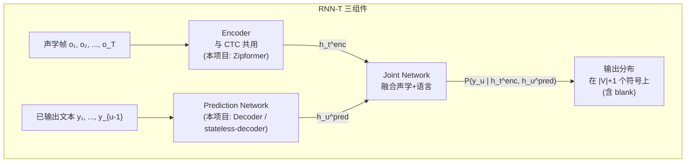
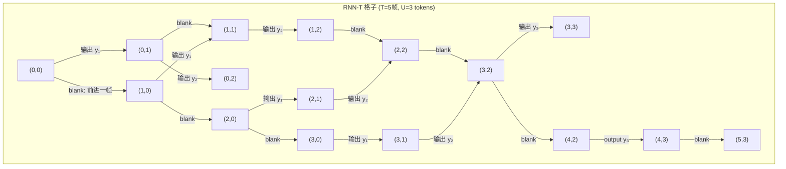
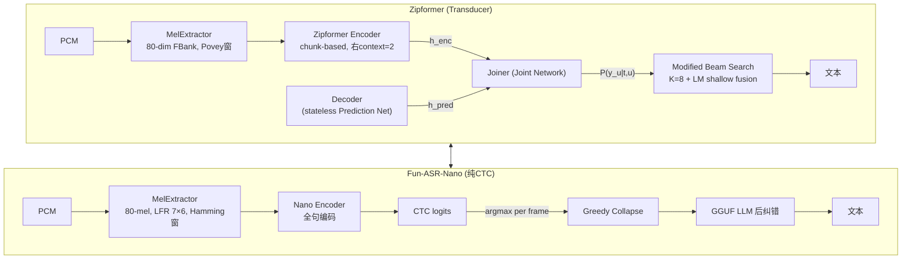

# 第 6 课：RNN-T (Transducer)

> **核心问题**：第 5 课 CTC 的最大缺陷是条件独立假设——每帧输出独立于历史输出。RNN-T (Recurrent Neural Network Transducer) 增加了一个 Prediction Network，使得当前输出"知道"之前输出了什么，打破了独立假设。它和 CTC 共享同一个 encoder，用了一个精巧的 Joint Network 来融合"声学信息"和"语言信息"。
> **工程锚点**：本项目 Zipformer 的三个 ONNX 模型文件——`encoder.onnx`、`decoder.onnx`、`joiner.onnx`——正是 RNN-T 的三组件。你一直看到的这三个文件，内部运行的正是本课描述的架构。

---

## 一、RNN-T 的整体架构

### CTC 的问题回顾

$$\text{CTC: } P(\pi_t | o_t) \quad \text{——第 } t \text{ 帧输出什么，只看第 } t \text{ 帧的声学特征}$$

这意味着 CTC 无法区分 "a" 和 "the"（都需要语言上下文），也无法修正自己输出的拼写错误。

### RNN-T 的解决方案

$$\text{RNN-T: } P(y_u | \mathbf{y}_{1:u-1}, \mathbf{o}_{1:t}) \quad \text{——输出不仅取决于声学帧，还取决于已经输出的文本}$$



**三组件职责**：

| 组件 | 本项目文件名 | 角色 |
|------|:---------:|------|
| **Encoder** | `encoder.int8.onnx` | 声学建模：音频帧 → 高层声学特征 $h_t^{\text{enc}}$ |
| **Prediction Network** | `decoder.onnx` | 语言建模：已输出文本 → 语言上下文向量 $h_u^{\text{pred}}$ |
| **Joint Network** | `joiner.int8.onnx` | 融合：$[h_t^{\text{enc}}; h_u^{\text{pred}}]$ → 输出分布 $P(\cdot \mid t, u)$ |

> **命名澄清**：在 sherpa-onnx 和本项目源码中，Prediction Network 被叫做 **decoder**，Joint Network 被叫做 **joiner**。它们分别对应学术文献中的 Prediction Network 和 Joint Network。别和 Transformer decoder 混淆——这里的 decoder 是指"预测下一个 token 的 autoregressive 网络"。

---

## 二、RNN-T 的格子模型

### 2D 搜索格子

RNN-T 定义了一个 $(T+1) \times (U+1)$ 的**格子（lattice）**：

- **水平轴**：时间步 $t = 0, 1, ..., T$（每个声学帧）
- **垂直轴**：输出步 $u = 0, 1, ..., U$（每个输出 token）



每个格子点 $(t, u)$ 有两种可能的动作：

1. **水平移动（输出 blank）**：从 $(t, u)$ 到 $(t+1, u)$——"这个声学帧不输出任何字符，前进一帧"
2. **垂直移动（输出 token）**：从 $(t, u)$ 到 $(t, u+1)$——"在这一帧输出第 $u+1$ 个 token"

一条完整路径从 $(0,0)$ 走到 $(T, U)$。与 CTC 的一维格子（只有时间轴）不同，RNN-T 的格子是**二维的**——这使它能够更灵活地建模"一帧音频可以对应零个或多个字符"。

### CTC 格子 vs RNN-T 格子的本质差异

```
CTC 格子 (1D):
  状态 = 时间轴上的位置
  每个时刻恰好输出 1 个符号 (可以是 blank)
  → 强制每帧一对一的输入输出关系
  
RNN-T 格子 (2D):
  状态 = (时间位置, 输出位置)
  每个时刻可以输出 0 个符号 (水平移动) 或 1 个符号 (垂直移动)
  → 自然的可变帧率，不需要提前确定帧数
```

---

## 三、RNN-T Loss：2D 前向后向算法

与 CTC 类似，RNN-T 的 loss 也是对**所有可能的对齐路径**求边际概率之和：

$$P(\mathbf{y} | \mathbf{o}) = \sum_{\pi \in \mathcal{B}^{-1}_{\text{RNN-T}}(\mathbf{y})} P(\pi | \mathbf{o})$$

其中 $\mathcal{B}^{-1}_{\text{RNN-T}}$ 是所有从 $(0,0)$ 到 $(T, U)$ 的合法路径的集合。

### 前向概率 $\alpha(t, u)$

$\alpha(t, u)$ = 到达格子点 $(t, u)$ 的所有路径的概率之和。

**递推**：

$$\alpha(t, u) = \underbrace{\alpha(t-1, u) \cdot P(\epsilon \mid t-1, u)}_{\text{从左边来 (blank)}} + \underbrace{\alpha(t, u-1) \cdot P(y_u \mid t, u-1)}_{\text{从下面来 (输出字符)}}$$

**边界条件**：$\alpha(0, 0) = 1$，$\alpha(t, -1) = \alpha(-1, u) = 0$

**终止**：$P(\mathbf{y}|\mathbf{o}) = \alpha(T, U) \cdot P(\epsilon \mid T, U)$ （最后必须以 blank 结尾）

```python
# RNN-T 前向算法的伪代码
α = zeros(T+1, U+1)
α[0, 0] = 1.0

for t in range(T+1):
    for u in range(U+1):
        if t > 0:
            α[t, u] += α[t-1, u] * P(blank | t-1, u)
        if u > 0:
            α[t, u] += α[t, u-1] * P(y[u-1] | t, u-1)

loss = -log(α[T, U] * P(blank | T, U))
```

> **对比 CTC 的前向算法**：CTC 的前向格子是 1D 的（只有时间轴），每一步的前驱数量有限（自环、前进一步、跳过 blank）。RNN-T 的格子是 2D 的，每个格子点恰好有 2 个前驱（左、下），结构更规整。

### Pruned RNN-T：加速训练与推理

完整的 RNN-T 格子是 $O(T \cdot U)$ 的——对中文（$T$ 可达数百帧，$U$ 可达数十字），计算量不小。**Pruned RNN-T** 限制搜索范围：只在一个**窄带**内计算前向概率。

```python
# 核心思路：只计算"合理"的路径
# 如果 P(y_u | t, u-1) 太小（< 阈值），跳过这个格子点
# 等价于在格子上做 beam pruning
```

这种剪枝是**安全**的——被剪掉的路径概率贡献可以忽略不计。sherpa-onnx 的 Zipformer 使用 pruned RNN-T loss 训练，大幅减少了训练时间。

---

## 四、Prediction Network 的两种形态

### 有状态 (Stateful) Prediction Network

经典 RNN-T 的 Prediction Network 是一个 **RNN/LSTM**，维护跨时间的隐状态：

```python
# Stateful: 每输出一个 token，隐状态更新
h_0 = zeros(hidden_dim)
for u in range(U):
    h_u, out_u = lstm(y[u-1], h_{u-1})  # 依赖于历史的隐状态
```

**优点**：能建模长期语言依赖（LSTM 的 memory cell）。
**缺点**：beam search 时每个候选都需要自己的 LSTM 状态——K 个候选就是 K 组 LSTM 状态，内存开销大。

### 无状态 (Stateless) Prediction Network

现代 Transducer（包括本项目 Zipformer）的 Prediction Network 更常用 **stateless** 形式——一个简单的 **look-ahead 卷积**或 **transformer decoder**：

```python
# Stateless: 只看最近的几个 token
embed = Embedding(y[u-N : u])   # 只看最近 N 个 token
h_u = Conv1D(embed)             # or self-attention with causal mask
```

**优点**：
1. beam search 时不需要维护逐个候选的状态——所有候选共享同一个 network 调用
2. 推理更简单，可以批量处理
3. 实际上，语言模型的收益主要来自**最近几个词**——长距离依赖的贡献很小

**本项目**的 `decoder.onnx` 就是 stateless prediction network。由于预测仅依赖最近几个 token 的 embedding，beam search 时可以通过 batching 大幅加速（与第 5 课 beam search 优化策略 4 呼应）。

---

## 五、RNN-T 的流式优势

### 为什么 RNN-T 天然适合流式

CTC 的逐帧独立假设导致它在每一帧都面临"现在要不要输出字符"的困境——没有语言上下文指导这个决定。

RNN-T 的 **Prediction Network** 给了模型"已经输出了什么"的信息。这使得：

1. **Encoder 不需要 lookahead**：因为语言上下文由 Prediction Network 提供，encoder 可以安全地限制为因果（causal）
2. **自然处理可变帧率**：一个声学帧可以输出 0 个或多个字符——没有"帧-字符对齐"的刚性约束
3. **流式解码友好**：beam search 沿时间轴逐帧推进（水平移动），不需要访问未来帧

### RNN-T vs 流式 CTC

| 维度 | 流式 CTC (Chunk-based) | RNN-T |
|------|----------------------|-------|
| **语言上下文** | 需要外部 LM | 内置 Prediction Network |
| **流式解码** | 需要 chunk 缓存和边界处理 | 逐帧自回归，天然流式 |
| **空白帧处理** | 依赖 blank token 消耗时间 | 水平移动自然吸收空白帧 |
| **工程复杂度** | 需要处理 chunk 重叠/边界 | 一帧一帧推，简单直接 |

---

## 六、Transducer 训练中的 CTC 辅助 Loss

在实际训练中，Transducer 往往和 CTC **共享同一个 encoder**，用 CTC loss 作为辅助任务：

$$L_{\text{total}} = L_{\text{RNN-T}} + \lambda \cdot L_{\text{CTC}}$$

其中 $\lambda$ 是一个小的权重（如 0.3）。

**为什么需要 CTC 辅助？**

1. **加速收敛**：CTC loss 比 RNN-T loss 更简单（1D 格子 vs 2D 格子），encoder 可以更快地学到有意义的表示
2. **正则化**：CTC loss 迫使 encoder 产出"对齐友好"的特征（尖峰分布），这对 RNN-T 的解码也是有帮助的
3. **精度提升**：实践中，加入 CTC 辅助 loss 通常在 CER 上有 1-3% 的相对改善

**本项目 Zipformer 正是 Transducer + CTC 辅助 loss 的架构**。配置文件中的 `decoding_method: "modified_beam_search"` 指的是 Transducer 解码，而纯 CTC 解码在 sherpa-onnx 中也有支持（但本项目未启用）。

---

## 七、Zipformer vs Fun-ASR-Nano：完整架构对比

回到第 5 课第十节的对比，现在可以理解更深层的架构差异：



| 维度 | Zipformer | Fun-ASR-Nano |
|------|:---:|:---:|
| **架构** | Transducer (内置语言建模) | 纯 CTC (无语言建模) |
| **语言模型** | Stateless decoder (内置) + 外部 LM (可选) | GGUF LLM (后处理) |
| **解码** | Modified beam search | Greedy argmax |
| **流式** | 原生 chunk-based | 伪流式（增量重编码） |
| **量化** | INT8 | INT4 |
| **适用** | 主力实时 ASR | 超轻量/离线/快速原型 |

---

## 八、实践环节

### 实验 1：RNN-T 格子的路径可视化

```python
import numpy as np

def visualize_rnnt_lattice(T, U):
    """打印 RNN-T 格子的所有可能动作"""
    print(f"RNN-T 格子: T={T} 帧, U={U} tokens")
    print(f"格子大小: (T+1)×(U+1) = {T+1}×{U+1}")
    print()
    
    for t in range(T+1):
        for u in range(U+1):
            actions = []
            if t < T:
                actions.append(f"→ blank 到 ({t+1},{u})")
            if u < U:
                actions.append(f"↑ 输出 y{u+1} 到 ({t},{u+1})")
            if actions:
                print(f"  ({t},{u}): {'  |  '.join(actions)}")

# 示例：3 帧音频，输出 "ab" (U=2)
visualize_rnnt_lattice(3, 2)

print("\n一条可能的路径 (从 (0,0) → (3,2)):")
print("  (0,0) → blank → (1,0) → blank → (2,0)")
print("  → 输出 'a' → (2,1) → blank → (3,1)")
print("  → 输出 'b' → (3,2)")
```

### 实验 2：CTC vs RNN-T 的条件独立性对比

```python
# 场景：音频是 "a b"，但声学上 a 和 b 非常接近
# 没有语言模型时，模型会混淆

# CTC: P(y_t | o_t) — 只看当前帧
# 即使之前已经输出了 'a'，CTC 在下一帧仍然可能输出 'a'（没有"我已经输出过了"的信息）

# RNN-T: P(y_u | y_{1:u-1}, o_{1:t}) — 知道已输出了什么
# 如果已经输出了 'a'，Prediction Network 会给 'a' 更低的概率
# → 自然避免了重复输出

print("场景: 音频包含 'a b', 声学上 a≈b (容易混淆)")
print()
print("CTC 行为:")
print("  帧1: P(a)=0.6, P(b)=0.4 → 输出 'a'")
print("  帧2: P(a)=0.6, P(b)=0.4 → 输出 'a' (又来! 因为只看当前帧)")
print("  结果: 'a a' ✗")
print()
print("RNN-T 行为:")
print("  帧1: P(a|无历史)=0.6, P(b|无历史)=0.4 → 输出 'a'")
print("  帧2: P(a|已输出'a')=0.3, P(b|已输出'a')=0.7 → 输出 'b'")
print("  结果: 'a b' ✓")
print()
print("→ RNN-T 的 Prediction Network 学会了 'a 后面大概率是 b'")
```

### 实验 3：解读本项目 encoder/decoder/joiner 的关系

```python
# 模拟 Zipformer 的一次 beam search 步骤

# encoder 已处理完所有帧 (或当前 chunk)
# encoder_output: shape [1, T, 512]  (512 = encoder dim)

# beam 中有 K 个候选，每个候选维护:
#   - tokens: 已输出的 token 序列
#   - state: 在格子中的位置 (t_index, u_index)

# 对每个候选:
#   1. decoder 产生 h_pred
#       h_pred = decoder(tokens[-N:])  # stateless, 只看最近 N 个
#   
#   2. joiner 融合并输出分布
#       h_enc = encoder_output[:, t_index, :]  # 当前声学帧的编码
#       logits = joiner(h_enc, h_pred)         # [1, |V|+1] 含 blank
#   
#   3. 从 logits 中采样 top-M 个可能的输出
#       - blank: 新候选的 t_index+1, u 不变
#       - token y: 新候选的 t 不变, u+1, tokens 追加 y
#   
#   4. 对新候选打分: score += log P(output | t, u) + LM_score

print("关键: decoder(stateless) 让 Beam Search 可以 batch 化")
print("→ K 个候选的 decoder 输入拼成 batch，一次前向传播")
print("→ 这是第 5 课 beam search 优化策略 4 的理论基础")
```

---

## 九、关键术语速查

| 术语 | 一句话定义 |
|------|-----------|
| **RNN-T / Transducer** | Encoder + Prediction Network + Joint Network——打破 CTC 条件独立假设的端到端 ASR 架构 |
| **Prediction Network** | 内置语言模型——输入已输出文本，输出语言上下文向量 $h_u^{\text{pred}}$ |
| **Joint Network** | 融合 $h_t^{\text{enc}}$ 和 $h_u^{\text{pred}}$，输出当前时刻的字符分布 |
| **RNN-T 格子** | $(T+1) \times (U+1)$ 的二维搜索空间——水平=blank（前进帧），垂直=输出 token |
| **前向-后向 (2D)** | $\alpha(t,u) = \alpha(t-1,u) \cdot P(\epsilon\|t-1,u) + \alpha(t,u-1) \cdot P(y_u\|t,u-1)$ |
| **Stateless Decoder** | Prediction Network 的简化——只看最近 N 个 token，不维护跨时间隐状态 |
| **Pruned RNN-T** | 限制格子搜索范围（beam pruning），$O(T \cdot U)$ → 可控的计算量 |
| **CTC 辅助 Loss** | $L = L_{\text{RNN-T}} + \lambda L_{\text{CTC}}$——加速收敛、正则化、精度提升 |
| **Modified Beam Search** | sherpa-onnx 的 Transducer 解码实现——beam search + LM shallow fusion（本项目默认） |

---

## 十、下一步

### 推荐阅读

- **Graves (2012)** — "Sequence Transduction with Recurrent Neural Networks" — RNN-T 原始论文
- **He et al. (2019)** — "Streaming End-to-end Speech Recognition For Mobile Devices" — Google 的流式 RNN-T 生产实践
- **Yao et al. (2024)** — "Zipformer: A faster and better encoder for automatic speech recognition" — 本项目 encoder 的论文
- **sherpa-onnx Transducer 解码源码** — `sherpa-onnx/csrc/online-transducer/` — modified beam search 的完整实现

### 下节预告

[**第 7 课：注意力机制与 Encoder-Decoder ASR**](./第_7_课：注意力机制与Encoder-Decoder-ASR.md) — 从 RNN-T 的预测网络到 full attention。**前置：Transformer 速通**（self-attention、multi-head、cross-attention）。LAS 架构的全注意力 ASR 为什么效果好但流式难？chunk-wise attention 如何折中？这是进入 Whisper（第 8 课）之前的必修课。

> **有疑问？** 可以直接问我 RNN-T 的 2D 前向后向推导细节、stateless decoder 为什么在工程中完胜 stateful、或者 Zipformer 的 decoder.onnx 到底长什么样。
