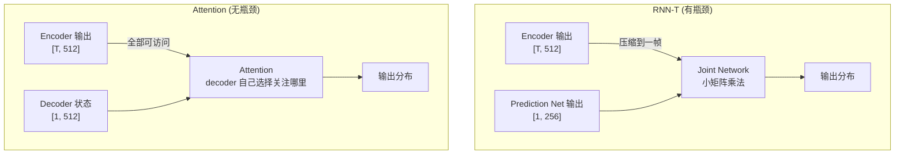
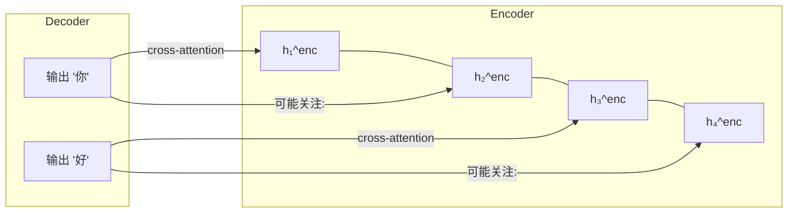
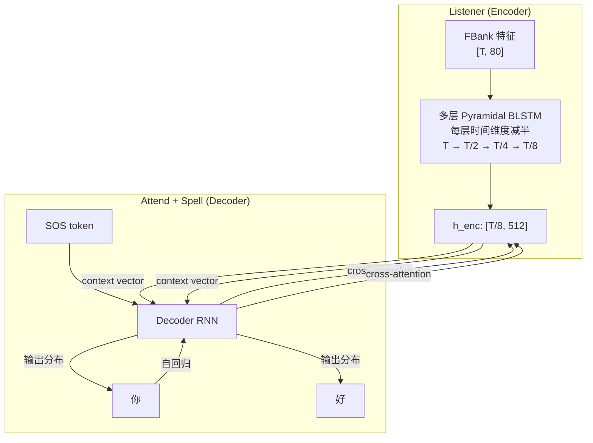
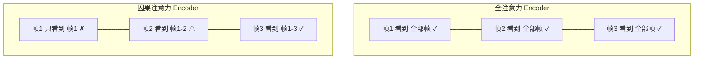

# 第 7 课：注意力机制与 Encoder-Decoder ASR

> **核心问题**：CTC 和 RNN-T 都把"声学"和"语言"的信息融合限制在 Joint Network 的狭小瓶颈中。Attention 提供了一种更直接的方案——Decoder 的每一步都可以"看到"Encoder 的全部输出，自己决定关注哪里。这是 Whisper 等最强 ASR 模型的基础，但它带来了一个根本性的流式难题。
> **前置要求**：本课前半部分包含 Transformer 速通——如果此前只学到 RNN 级别，这一节是你进入现代 ASR 的必经之路。

---

## 一、为什么需要 Attention？

### CTC 和 RNN-T 的信息瓶颈

回顾第 5、6 课：

| 架构 | Encoder → Decoder 的信息传递 | 瓶颈在哪里？ |
|------|---------------------------|------------|
| **CTC** | Encoder → softmax → 逐帧独立输出 | 根本没有 Decoder（只依赖声学帧） |
| **RNN-T** | Encoder 输出 + Prediction Net 输出 → Joint Network | Joint Network 是一个窄的线性层，信息压缩严重 |

**Attention 的核心思想**：Decoder 的每一步，可以**直接访问** Encoder 的**全部输出**，并自己学习"此时应该关注哪一部分音频"。



---

## 二、Transformer 速通

> 本节为 Attention-based ASR 提供必要的 Transformer 基础。如果你已熟悉 Transformer，可以直接跳到第三节。

### 2.1 Self-Attention：让序列中的每个位置看到所有其他位置

RNN 处理序列的方式是**逐时间步串行**——第 $t$ 步必须等第 $t-1$ 步算完。Self-Attention 让**所有位置同时互相看**。

**核心公式**：

$$\text{Attention}(Q, K, V) = \text{softmax}\left(\frac{QK^T}{\sqrt{d_k}}\right) V$$

```python
# Self-Attention 的核心计算（伪代码）
def self_attention(X):  # X: [seq_len, d_model]
    Q = X @ W_Q  # Query:  "我在找什么？"
    K = X @ W_K  # Key:    "我是什么？"
    V = X @ W_V  # Value:  "我贡献什么内容？"
    
    # 计算注意力分数：每个位置对所有位置的"关注度"
    scores = (Q @ K.T) / sqrt(d_k)  # [seq_len, seq_len]
    attn_weights = softmax(scores, dim=-1)  # 每行和为 1
    
    # 加权聚合：每个位置按关注度从所有位置取信息
    output = attn_weights @ V  # [seq_len, d_model]
    return output
```

**直觉**（以句子 "我 喜欢 语音 识别" 为例）：

```
"识别" 的 Query 问: "谁和我语义相关？"
→ 与 "语音" 的 Key 匹配度高 (scores["识别", "语音"] = 大)
→ 从 "语音" 的 Value 提取了大量信息
→ "识别" 的新表示融合了 "语音" 的上下文
```

**为什么除以 $\sqrt{d_k}$？** 防止点积值过大导致 softmax 进入饱和区（梯度消失）。这是 Transformer 论文中最不起眼但最关键的工程细节——没有这个缩放，模型无法训练。

### 2.2 Multi-Head Attention：多个注意力子空间

一组 Query/Key/Value 只能学到一种"关注模式"。Multi-Head 并行跑多组：

$$\text{MultiHead}(Q, K, V) = \text{Concat}(\text{head}_1, ..., \text{head}_h) W^O$$

$$\text{head}_i = \text{Attention}(QW^Q_i, KW^K_i, VW^V_i)$$

```python
# Multi-Head: 8 个 head，每个 d_k = 64（总 d_model = 512）
def multi_head_attention(X):
    heads = []
    for i in range(8):
        Q = X @ W_Q[i]  # [seq_len, 64]
        K = X @ W_K[i]  # [seq_len, 64]
        V = X @ W_V[i]  # [seq_len, 64]
        heads.append(self_attention_with(Q, K, V))
    return concat(heads) @ W_O  # [seq_len, 512]
```

**8 个 head 各自捕捉不同的依赖关系**：
- Head 1 可能专注于"相邻词之间的语法关系"
- Head 3 可能专注于"远距离的指代关系"
- Head 5 可能专注于"音素到音素的声学过渡"

> 这对于语音尤其重要——一个 head 关注共振峰过渡，另一个关注音素时长，还有一个关注说话人特点。

### 2.3 Positional Encoding：给序列注入位置信息

Self-Attention 本身是**置换不变**的——打乱输入顺序，输出也打乱（但值不变）。需要显式注入位置：

$$PE_{(pos, 2i)} = \sin\left(\frac{pos}{10000^{2i/d_{\text{model}}}}\right)$$

$$PE_{(pos, 2i+1)} = \cos\left(\frac{pos}{10000^{2i/d_{\text{model}}}}\right)$$

```python
# 注入位置信息
X_with_pos = X + positional_encoding  # [seq_len, d_model]
# 再去 self_attention(X_with_pos)
```

正弦位置编码的一个优雅性质：$PE_{pos+k}$ 可以表示为 $PE_{pos}$ 的线性函数，模型能学会"相对位置"的概念。

**语音中的替代方案**：很多语音 Transformer（包括 Zipformer）使用**可学习的位置编码**或**卷积位置编码**，因为语音的"位置"更关乎**绝对时间**而非**序列中的相对顺序**——第 100ms 和第 200ms 的位置关系不同于 NLP 中第 1 个词和第 3 个词。

### 2.4 Cross-Attention：Decoder 查询 Encoder

以上是 Self-Attention（Q、K、V 来自同一序列）。ASR 需要的是 **Cross-Attention**——Decoder 的 Query 去查询 Encoder 的 Key/Value：

```python
def cross_attention(decoder_state, encoder_output):
    Q = decoder_state @ W_Q     # 来自 decoder: "我现在在输出什么？"
    K = encoder_output @ W_K    # 来自 encoder: "我编码了什么声学信息？"
    V = encoder_output @ W_V
    
    scores = (Q @ K.T) / sqrt(d_k)
    attn_weights = softmax(scores, dim=-1)
    output = attn_weights @ V
    return output, attn_weights  # attn_weights 就是"对齐"
```



**Cross-Attention 的注意力权重，本质上就是"软对齐"**——Decoder 输出 "好" 时，注意力权重的峰值落在 Encoder 的哪几帧，就代表 "好" 在音频中的时间位置。这与第 4 课的"对齐问题"直接对偶——Attention 提供了一种**可微分**的对齐方式，不需要强制对齐。

---

## 三、LAS：全注意力 ASR 的经典

**LAS (Listen-Attend-Spell)** 是第一个将 Encoder-Decoder + Attention 成功应用于 ASR 的架构（Chan et al., 2015），它展示了 Attention 在语音识别中的全部潜力——和全部问题。

### 架构



**三个关键设计**：

1. **Pyramidal Encoder**：BLSTM 每层将时间维度缩减为一半。$T$ 帧音频 → $T/8$ 帧 encoder 输出。这是必须的——如果不做降采样，Transformer 的 Self-Attention 在 $T=500$ 帧上是 $O(T^2)$ 的计算灾难。

2. **Cross-Attention 对齐**：Decoder 每输出一个字符，都用 cross-attention 在 encoder 输出中找到"最相关的声学帧"。这产生了一个**自然的软对齐**。

3. **自回归解码**：$P(y_u | y_{1:u-1}, \mathbf{h}^{\text{enc}})$——输出依赖所有已输出的文本，类似于 RNN-T 的 Prediction Network，但 decoder 可以直接"看到"整个 encoder 输出。

### LAS 的成就与局限

| 成就 | 局限 |
|------|------|
| ✅ 首次展示 Attention ASR 可超越 HMM | ❌ **不支持流式**：cross-attention 需要看到整个 encoder 输出 |
| ✅ 对齐可解释（可视化 attention weights） | ❌ 自回归逐字生成——长句延迟高 |
| ✅ 端到端训练，不需要 HMM 状态 | ❌ BLSTM encoder 是双向的（需要未来帧） |

---

## 四、全注意力 ASR 的流式困境

### 问题的根源

**Self-Attention 的注意力矩阵是 $T \times T$ 的**——每一帧都要和所有其他帧计算注意力权重。如果要流式处理（只看到过去的帧），必须限制 attention 的范围。

```python
# 全注意力（offline）：每一帧可以看到所有帧
scores = Q @ K.T  # [T, T]——包括未来的帧

# 因果注意力（causal/streaming）：只能看到过去
mask = torch.triu(torch.ones(T, T), diagonal=1) * -1e9  # 上三角 mask
scores = Q @ K.T + mask  # 未来的帧被 mask 掉
# 第 100 帧只能看到第 0~100 帧
```

**因果 attention 的问题**：Encoder 的第一帧只知道"自己"，完全不知道后面会发生什么。这导致 encoder 表示的质量在序列开头显著下降——但 ASR 的"开头"往往是最关键的内容（唤醒词、主语）。



### Cross-Attention 的流式问题

即使 encoder 做了因果限制，cross-attention 还有另一个问题：decoder 输出 "你" 时，需要在整个 encoder 序列上做 attention——包括**还没到达的未来帧**。

**这是全注意力 ASR 流式化的核心矛盾**：
- 如果让 decoder 只关注"当前 chunk"——可能切断了跨 chunk 的依赖
- 如果让 decoder 看到所有历史——attention 计算量随句长线性增长

---

## 五、流式 Attention 方案

### 5.1 Chunk-wise Attention

把 encoder 的 self-attention 限制在**局部窗口 + 有限右上下文**：

```python
# Chunk-wise self-attention (本项目 Zipformer 的做法)
chunk_size = 32  # 帧
right_context = 8  # 可以看未来的 8 帧

for chunk_i in range(num_chunks):
    left = max(0, chunk_i * chunk_size - left_context)
    right = min(T, (chunk_i + 1) * chunk_size + right_context)
    # 只在这个窗口内做 attention
    chunk_output = self_attention(X[left:right])
```

**Zipformer 就是这种方案**——使用 chunk-based 的注意力机制，每个 chunk 有固定的 left context 和 right context。这直接就是第 5 课"流式 CTC"中讨论的同一机制，只不过换成了 attention 算子。

### 5.2 Triggered Attention

不是逐帧或逐 chunk 触发，而是**当 decoder 的注意力权重出现"峰值"时，才允许从 encoder 读取新帧**：

```
标准: 每收到一帧 → decoder 尝试输出 → cross-attention 到所有已编码帧
Triggered: 收到了 N 帧 → attention 权重在某几帧形成峰值 → 触发输出 → 等待下一个峰值
```

这种方案更接近 RNN-T 的"帧-输出"异步模型，但保留了 attention 的可解释性。

### 5.3 方案对比

| 方案 | 流式能力 | 精度损失 (vs full attention) | 代表模型 |
|------|:------:|:------------------------:|---------|
| **Full Attention** | ❌ | 0% (基准) | LAS, Whisper (offline) |
| **Chunk-wise** | ✅ | 2-5% | **Zipformer** (本项目), Conformer |
| **Causal Attention** | ✅ | 5-10% | 因果 Conformer |
| **Triggered Attention** | ✅ | 3-6% | MoChA |

---

## 六、Zipformer 中的 Attention 设计

本项目 Zipformer 的名字本身就是 "Zippy Transformer" 的缩写——它是一系列注意力效率优化的集合：

| 优化 | 相对于标准 Transformer 的改进 |
|------|---------------------------|
| **Chunk-based attention** | 将全局 $O(T^2)$ 降到 $O(T \cdot \text{chunk\_size})$ |
| **Downsampling layers** | 时间维度每层减半，进一步降低 attention 计算量 |
| **非对称结构** | U-Net 风格的 encoder 设计——先降采样再升采样，保留多尺度信息 |
| **Bias-free 设计** | 去除部分 bias 参数，减少内存占用 |

> Zipformer 本质上是对 Transformer 做了"为语音任务+边缘设备"的**裁缝式优化**。它不是全注意力（像 Whisper），也不是纯卷积（像传统 CNN），而是在两者之间找到了一个工程友好的平衡点——这正是第 8 课 Whisper 对比的伏笔。

---

## 七、实践环节

### 实验 1：手算 Self-Attention

```python
import numpy as np

def softmax(x, axis=-1):
    e_x = np.exp(x - np.max(x, axis=axis, keepdims=True))
    return e_x / e_x.sum(axis=axis, keepdims=True)

def self_attention(X, d_k=4):
    """X: [seq_len, d_model]"""
    seq_len, d_model = X.shape
    
    # 权重矩阵（实际是学习得到的，这里随机初始化）
    np.random.seed(42)
    W_Q = np.random.randn(d_model, d_k)
    W_K = np.random.randn(d_model, d_k)
    W_V = np.random.randn(d_model, d_k)
    
    Q = X @ W_Q  # [seq_len, d_k]
    K = X @ W_K  # [seq_len, d_k]
    V = X @ W_V  # [seq_len, d_k]
    
    scores = Q @ K.T / np.sqrt(d_k)  # [seq_len, seq_len]
    attn = softmax(scores, axis=-1)
    
    print("注意力权重矩阵 (每行是某位置对所有位置的关注度):")
    print(np.round(attn, 3))
    print(f"\n每行和: {attn.sum(axis=1)}")  # 应该全是 1.0
    
    output = attn @ V
    return output, attn

# 模拟 4 个声学帧的 encoder 输出
X = np.random.randn(4, 8)  # 4帧, d_model=8
output, attn = self_attention(X)
print(f"\n输出形状: {output.shape}")  # [4, 4]
```

### 实验 2：Cross-Attention 的可视化——"软对齐"

```python
import matplotlib.pyplot as plt

# 模拟: Decoder 输出 "你好" 时，cross-attention 在 encoder 上的分布
T = 40  # encoder 帧数
U = 4   # 输出 4 个 token [你, 好, 世, 界]

# 模拟 attention 权重——每个输出 token 在 encoder 上有一个"关注峰值"
attn_weights = np.zeros((U, T))
attn_weights[0, 5:15] = np.exp(-0.5 * (np.arange(5, 15) - 10)**2 / 4)   # "你" 关注帧 5-14
attn_weights[1, 15:28] = np.exp(-0.5 * (np.arange(15, 28) - 21)**2 / 4)  # "好" 关注帧 15-27
attn_weights[2, 25:35] = np.exp(-0.5 * (np.arange(25, 35) - 30)**2 / 4)  # "世" 关注帧 25-34
attn_weights[3, 32:40] = np.exp(-0.5 * (np.arange(32, 40) - 36)**2 / 4)  # "界" 关注帧 32-39

# 归一化
attn_weights = attn_weights / attn_weights.sum(axis=1, keepdims=True)

plt.figure(figsize=(10, 5))
plt.imshow(attn_weights, aspect='auto', origin='lower', cmap='Blues')
plt.xlabel("Encoder 帧 (时间 →)")
plt.ylabel("Decoder 输出 token")
plt.yticks(range(U), ['你', '好', '世', '界'])
plt.colorbar(label='Attention weight')
plt.title("Cross-Attention = 软对齐\n(每个输出 token 关注不同的音频时间段)")
plt.tight_layout()
plt.savefig('cross_attention_alignment.png', dpi=150)
print("注意: 每个输出 token 的 attention 峰值在不同时间段")
print("这就是 attention 自动学习到的 '对齐'")
```

### 实验 3：因果 Mask 的效果

```python
# 对比 full attention vs causal attention
T = 8
scores = np.random.randn(T, T)

# Full attention: 无 mask
attn_full = softmax(scores)

# Causal attention: mask 未来
mask = np.triu(np.ones((T, T)), k=1) * -1e9
attn_causal = softmax(scores + mask)

fig, axes = plt.subplots(1, 2, figsize=(12, 5))
axes[0].imshow(attn_full, cmap='Blues')
axes[0].set_title("Full Attention (每帧看所有帧)")
axes[1].imshow(attn_causal, cmap='Blues')
axes[1].set_title("Causal Attention (每帧只看过去)")
for ax in axes:
    ax.set_xlabel("Key (被查询的帧)")
    ax.set_ylabel("Query (发起查询的帧)")
plt.tight_layout()
plt.savefig('causal_mask.png', dpi=150)
print("注意右图的上三角为 0 — 第 t 帧看不到 t+1, t+2, ...")
```

---

## 八、关键术语速查

| 术语 | 一句话定义 |
|------|-----------|
| **Self-Attention** | 序列中每个位置计算对所有位置的"关注度"——$O(T^2)$ 的全局信息交换 |
| **Q/K/V** | Query（查什么）、Key（被查的属性）、Value（贡献的内容）——Attention 的三元组 |
| **$\sqrt{d_k}$** | 缩放因子——防止点积过大导致 softmax 梯度消失 |
| **Multi-Head** | 多组并行的 Q/K/V——不同 head 关注不同模式（语法/语义/声学过渡） |
| **Cross-Attention** | Decoder 的 Q 查询 Encoder 的 K/V——产生跨模态的"软对齐" |
| **Positional Encoding** | 注入序列位置信息——否则 Attention 是置换不变的 |
| **LAS** | Listen-Attend-Spell——第一个成功的全注意力 ASR 架构 |
| **Causal Mask** | 只允许关注过去帧——流式 Attention 的基础约束 |
| **Chunk-wise Attention** | 局部窗口 + 有限右上下文——流式 ASR 的主流折中方案（Zipformer 采用） |
| **Triggered Attention** | 只在 attention 峰值出现时触发输出——异步流式方案 |

---

## 九、下一步

### 推荐阅读

- **Vaswani et al. (2017)** — "Attention Is All You Need" — Transformer 原始论文
- **Chan et al. (2015)** — "Listen, Attend and Spell" — LAS 架构论文
- **《The Illustrated Transformer》— Jay Alammar** [在线版](https://jalammar.github.io/illustrated-transformer/) — 最佳 Transformer 入门可视化
- **《The Annotated Transformer》** [在线版](https://nlp.seas.harvard.edu/annotated-transformer/) — 逐行代码实现

### 下节预告

[**第 8 课：Whisper 与 LLM-based ASR**](./第_8_课：Whisper与LLM-based-ASR.md) — 有了 Transformer 基础，终于可以拆解 Whisper 的架构。它的 encoder-decoder 设计、多语言多任务 token、时间戳预测——以及它**为什么不适合流式**。同时引入 LLM-based ASR 的新趋势：PromptASR、Qwen-Audio 等。

> **有疑问？** 可以问我 multi-head attention 为什么要切分而不是一个大的 head、位置编码为什么用 sin/cos、或者 LAS 的 pyramidal encoder 和 Zipformer 的 downsampling 之间的本质异同。
