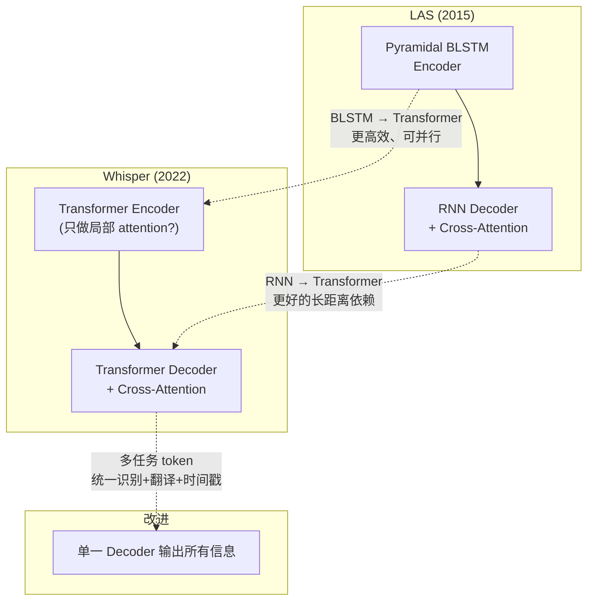
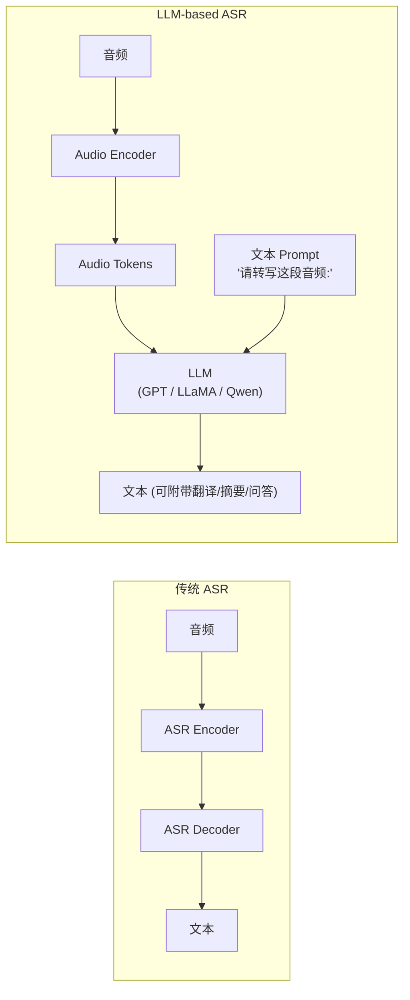

# 第 8 课：Whisper 与 LLM-based ASR

> **核心问题**：前 3 课（CTC → RNN-T → Attention LAS）展示了 ASR 架构的演进。Whisper (OpenAI, 2022) 把这三种思路的精华揉进了一个统一的 Encoder-Decoder Transformer 中，并通过**大规模弱监督数据**（68 万小时）达到了惊人的泛化能力。但它有一个致命的工程限制：**不支持流式**。LLM-based ASR 则更进一步——把语音识别变成大语言模型的"一个输入模态"。
> **工程锚点**：本项目的 Zipformer 是边缘流式 ASR 的标杆，Whisper 是云端离线 ASR 的标杆。理解两者的 tradeoff 是做技术选型的核心能力。

---

## 一、Whisper 架构全景

### 从 LAS 到 Whisper：进化的三条主线



### Whisper 的具体架构

```
输入: 30 秒音频 @ 16kHz → 80 维 log-Mel 频谱图 [3000 帧, 80]
                                    ↓
        ┌─────────────────────────────────────────┐
        │  Encoder: 多层 Transformer              │
        │  · 卷积下采样 (2×): 3000 → 1500 帧      │
        │  · Sinusoidal Positional Encoding       │
        │  · Self-Attention (全注意力)             │
        │  输出: [1500, d_model=512~1280]         │
        └──────────────────┬──────────────────────┘
                           ↓
        ┌─────────────────────────────────────────┐
        │  Decoder: 多层 Transformer              │
        │  · Learned Positional Encoding          │
        │  · Self-Attention (causal, 只看已输出)   │
        │  · Cross-Attention (看 Encoder 全部输出) │
        │  · 输出: 多任务 token 序列              │
        └──────────────────┬──────────────────────┘
                           ↓
                       文本输出
```

**关键参数（各尺寸对比）**：

| 模型 | Encoder 层数 | Decoder 层数 | d_model | 参数量 | 相对速度 |
|------|:---------:|:---------:|:------:|:-----:|:------:|
| tiny | 4 | 4 | 384 | 39M | 32× |
| base | 6 | 6 | 512 | 74M | 16× |
| small | 12 | 12 | 768 | 244M | 6× |
| medium | 24 | 24 | 1024 | 769M | 2× |
| large-v3 | 32 | 32 | 1280 | 1.55B | 1× |

> **本项目的 Zipformer 参数量**约 60-80M（int8 量化后 ~30MB），对标 Whisper base 级别。但架构差异导致 Zipformer 在 Jetson 上的延迟是 Whisper tiny 的 1/10——原因见第五节。

---

## 二、多任务 Token 设计：Whisper 的真正创新

### 为什么用一个 Decoder 输出所有东西

Whisper 的输出不是纯文本，而是一个**结构化 token 序列**：

```
输入: 一段英语音频
输出 token 序列:
  <|startoftranscript|> <|en|> <|transcribe|> <|notimestamps|>
  " Hello" " world" "!" <|endoftext|>
```

或者带时间戳：
```
  <|startoftranscript|> <|en|> <|transcribe|>
  <|0.00|> " Hello" " world" <|3.50|> <|3.60|> " How" " are" " you" <|6.20|>
  <|endoftext|>
```

**特殊 token 的角色**：

| Token | 含义 | 说明 |
|-------|------|------|
| `<\|startoftranscript\|>` | 序列开始 | 所有输出的固定开头 |
| `<\|en\|>` | 源语言 | 告诉 decoder "这段音频是什么语言" |
| `<\|transcribe\|>` | 任务类型 | `transcribe`（同语言识别）或 `translate`（翻译为英语） |
| `<\|notimestamps\|>` | 时间戳模式 | 控制是否输出逐字时间戳 |
| `<\|0.00\|>` ~ `<\|30.00\|>` | 时间戳 token | 标记某个词在音频中的起止时间 |
| `<\|nospeech\|>` | 无语音 | 当 VAD 判定无有效语音时输出（Whisper 内置了 VAD） |

### 多语言 token

Whisper 用**同一个 token 空间**表示所有语言和任务——99 种语言的 `<|lang_id|>` token 只是 vocab 中的 99 个特殊条目。这意味着：

- 一个模型同时处理英语→英语识别、日语→英语翻译、中文→中文识别
- 不需要切换模型或修改架构
- 但代价是 decoder 的 vocab 更大（约 52k tokens），Cross-Attention 的搜索空间更大

### 时间戳预测的实现

```python
# Whisper 的时间戳预测（简化）
# 在所有输出 token 之上加一个额外的线性层
timestamp_logits = Linear(decoder_hidden)  # [seq_len, num_timestamp_bins]

# 时间戳被离散化为 N 个 bin（如 1501 个 = 0~30s / 0.02s）
# bin_index = round(time / 0.02)
# decoder 在适当位置输出 <|time_bin|> token
```

**为什么时间戳预测能工作**：Cross-Attention 的注意力权重天然包含"decoder 现在在关注 encoder 的哪几帧"的信息。Whisper 在训练时要求 decoder 同时输出文本和时间戳，迫使 Cross-Attention 学到更精确的对齐。

---

## 三、Whisper 的训练：规模即能力

### 数据：68 万小时弱监督音频

Whisper 没有使用人工精标注的 ASR 数据集（如 LibriSpeech 的 1000 小时），而是使用了从互联网爬取的**弱标注**数据——音频+标题/字幕对。这种数据噪声大（标题可能不完整、有错别字、时间不对齐），但**规模碾压**。

```
LibriSpeech:               1,000 小时（精标注，干净）
Whisper 训练数据:        680,000 小时（弱标注，有噪声）
                          ─────────
                          680× 的数据量优势
```

**关键设计**：
- 用简单的启发式规则过滤低质量数据（如标题长度 < 1 或 > 200 字）
- 不依赖任何语言模型（纯 seq2seq 训练）
- 不对齐音频和文本——让模型自己学

### 涌现能力

足够大的规模 + 多语言多任务训练，给 Whisper 带来了**没有显式设计**的能力：

1. **VAD**：自动学会识别 `<|nospeech|>`（训练数据中包含了纯背景音频无标题的样本）
2. **语言识别**：在没有 `<|lang_id|>` 输入时，encoder 内部能推断语言
3. **翻译**：`<|translate|>` 任务下，英语 decoder 自动忽略源语言的 token，直接输出翻译
4. **鲁棒性**：对各种口音、背景噪声、远场录音的适应能力远超传统 ASR

---

## 四、为什么 Whisper 不适合流式（以及为什么不重要）

### 技术原因

回顾第 7 课的全注意力流式困境：

**1. Encoder 的双向 Self-Attention**

Whisper 的 encoder 是**全注意力**（bi-directional）——每一帧可以看到全部 30 秒内的所有其他帧。这是质量的来源，也是流式的死穴。

```
流式场景: 音频逐 10ms 帧到达
Whisper Encoder: "请给我全部 30 秒的音频，我现在就要"
→ 无法工作
```

**2. Decoder 的 Cross-Attention**

Decoder 需要**整个 encoder 输出**才能做 Cross-Attention。即使 encoder 被改成流式的，decoder 仍要等 encoder 处理完整个序列。

**3. 训练策略**

Whisper 在训练时使用 30 秒固定长度的音频窗口（padding 或截断）。模型的"时间感"是在这个固定窗口中习得的——改成任意长度的流式窗口需要重新训练。

### 为什么这不重要

> Whisper 的设计目标从来不是 "适合 Jetson 的流式 ASR"——它是为**云端离线转写**设计的。在它的目标场景里，用户提交一段音频文件，等几秒到几分钟拿到完整转写结果——这不是流式问题。
>
> 衡量 Whisper 的延迟用 **Real-Time Factor (RTF)**，而非首字延迟（TTFP）。RTF < 1 意味着处理速度快于实时（如 30 秒音频用 15 秒处理完，RTF=0.5）。在 A100 GPU 上，Whisper large-v3 的 RTF 约 0.1-0.3——10 倍实时速度。

### 流式 Whisper 的尝试

社区有一些"让 Whisper 流式化"的努力：

- **whisper-streaming**：把音频分成有重叠的 chunk，每个 chunk 独立过 Whisper，然后合并重叠部分的输出。本质上是用 offline 模型模拟流式——精度损失 5-10%。
- **Distil-Whisper**：蒸馏到更小的模型（如 tiny），推理速度提高 6×，间接改善流式体验。
- **Whisper-tiny + CTC head**：在 encoder 上加 CTC 头做流式 decode，decoder 做离线 refine。

但这些都不是 OpenAI 官方支持的方案——Whisper 的流式化目前更像是"hack"而非"feature"。

---

## 五、Whisper vs Zipformer：工程选型对比

| 维度 | Whisper (large-v3) | Zipformer (本项目) |
|------|:---:|:---:|
| **架构** | Full attention Encoder-Decoder | Chunk-based Transducer |
| **参数量** | 1.55B | ~60-80M |
| **流式** | ❌ 不支持 | ✅ 原生 chunk-based |
| **量化后大小** | ~3GB (FP16) | ~30MB (INT8) |
| **Jetson 推理** | ❌ 无法加载 large（内存不够）<br/>tiny (39M) 勉强可跑，RTF≈2-5 | ✅ RTF≈0.1-0.3 |
| **中文 CER** | ~5-8% (zero-shot) | ~3.2% (INT8, ARCHITECTURE.md) |
| **多语言** | ✅ 99 种语言 | 仅中文（需换模型） |
| **鲁棒性** | ✅ 极强（大规模数据） | 一般（专业领域数据） |
| **适用场景** | 云端转写、多语言、离线批处理 | 边缘实时交互、低功耗唤醒 |

**核心结论**：Whisper 的泛化能力碾压 Zipformer（99 种语言 zero-shot vs 单语言专用），但 Zipformer 的**边缘推理效率**碾压 Whisper（30MB vs 3GB，流式 vs 离线）。这不是谁比谁好——它们解决的是**不同场景**。

---

## 六、LLM-based ASR：语音成为 LLM 的一个输入模态

### 范式转变

传统 ASR 时代（课程 4-7）：
```
音频 → 专用 Encoder → 专用 Decoder → 文本
```

LLM-based ASR 时代：
```
音频 → Audio Encoder → 音频 token → LLM → 文本
                        (和文本 token 在同一个空间中)
```



### 代表方案

| 方案 | 核心思路 | 特点 |
|------|---------|------|
| **Whisper** | 专用 Encoder-Decoder | 纯 ASR，不做 NLU |
| **Qwen-Audio** | Audio Encoder + Qwen LLM | 语音→文本 + 语音理解 + 语音问答 |
| **SALMONN** | Audio Encoder + Vicuna LLM | 通用音频理解（语音+音乐+环境声） |
| **PromptASR** | Whisper Encoder + LLM prompt | 用文本 prompt 控制识别风格（正式/口语/方言） |
| **SeamlessM4T** (Meta) | 多模态多任务统一模型 | 100+ 语言语音→语音翻译 |

### LLM-based ASR 的独特能力

```
传统 ASR 输出: "今天天气怎么样"
LLM-based ASR 可以:
  1. 直接翻译: "What's the weather like today?"
  2. 顺带 NLU: {intent: "weather_query", location: "here", date: "today"}
  3. 情感识别: "这段话听起来是高兴的"
  4. 摘要: "用户想知道今天天气"
  5. 说话人属性: "儿童、女性、语速快"
```

**Prompt 控制**：

```
Prompt: "请用正式书面语转写"  → 输出正式版本
Prompt: "请用口语化风格转写"  → 输出口语版本
Prompt: "转写为粤语拼音"     → 输出粤拼
Prompt: "请纠正语法错误后输出" → 输出修正后的文本
```

**本质差异**：传统 ASR 是"音频→文本"的映射函数。LLM-based ASR 是"音频 + 指令 → 任意文本输出"——ASR 不再是独立的模块，而是 LLM 的**一个感知通道**。

### 边缘部署的现实

LLM-based ASR 在 Jetson 上的现状：

| 模型 | Jetson Orin NX 可行？ | 原因 |
|------|:------------------:|------|
| Whisper tiny (39M) | ⚠️ 勉强 | 需要 GPU，RTF≈2-5 |
| Whisper base+ | ❌ | 内存/算力不足 |
| Qwen-Audio (7B+) | ❌ | 7B 参数 + 量化也需要 >6GB VRAM |
| Zipformer (本项目) | ✅ | RTF≈0.1-0.3，CPU 推理可行 |

> **现实结论**：在 Jetson Orin NX 这个级别的边缘设备上，纯端侧 LLM-based ASR 目前**不可行**。Whisper tiny 可以作为离线后处理（纠正 Zipformer 的识别结果），但不能替代实时流式 ASR。但硬件在进步——Orin AGX（32GB）上 Whisper small 已经可以实时运行。

---

## 七、实践环节

### 实验 1：Whisper 架构模拟

```python
import numpy as np

def whisper_encoder_sim(audio_length_s=10, sample_rate=16000):
    """模拟 Whisper 的 encoder 输入处理"""
    n_samples = audio_length_s * sample_rate
    
    # Step 1: 80 维 log-Mel spectrogram
    # 25ms window, 10ms hop → 每 10ms 一帧
    n_frames = n_samples // 160  # 160 samples @ 16kHz = 10ms
    mel_spec = np.random.randn(n_frames, 80)  # [T, 80]
    print(f"Spectrogram: {mel_spec.shape}")
    
    # Step 2: 卷积下采样 (2×)
    # Patch embedding: 用 stride=2 的卷积将时间维减半
    # 实际 Whisper 用 2 层 stride=2 的卷积 → T/4
    downsampled = mel_spec[::2, :]  # 简化: 每 2 帧取 1 帧
    print(f"After 2× downsampling: {downsampled.shape}")
    
    # Step 3: Positional Encoding
    pos = np.arange(len(downsampled))
    d_model = 512
    pe = np.zeros((len(downsampled), d_model))
    for i in range(d_model // 2):
        pe[:, 2*i] = np.sin(pos / (10000 ** (2*i/d_model)))
        pe[:, 2*i+1] = np.cos(pos / (10000 ** (2*i/d_model)))
    
    encoder_input = downsampled @ np.random.randn(80, d_model) + pe
    print(f"Encoder input: {encoder_input.shape}")
    print(f"→ 10秒音频 → {len(downsampled)} 帧 encoder 输入")
    
    return encoder_input

# 对比不同长度音频的 encoder 输入帧数
for duration in [5, 10, 30]:
    whisper_encoder_sim(duration)
    print()
```

### 实验 2：多任务 Token 序列的生成

```python
# 模拟 Whisper 的输出 token 序列如何编码多任务信息
SPECIAL_TOKENS = {
    "start": "<|startoftranscript|>",
    "en": "<|en|>",
    "zh": "<|zh|>",
    "transcribe": "<|transcribe|>",
    "translate": "<|translate|>",
    "notimestamps": "<|notimestamps|>",
    "end": "<|endoftext|>",
    "nospeech": "<|nospeech|>",
}

def whisper_token_sequence(language="zh", task="transcribe", timestamps=True, text="你好世界"):
    """根据任务生成 Whisper 的完整 token 序列"""
    tokens = [SPECIAL_TOKENS["start"]]
    tokens.append(SPECIAL_TOKENS[language])
    tokens.append(SPECIAL_TOKENS[task])
    
    if not timestamps:
        tokens.append(SPECIAL_TOKENS["notimestamps"])
    
    if timestamps:
        # 模拟带时间戳的输出
        start_t = 0.0
        for word in text:
            tokens.append(f"<|{start_t:.2f}|>")
            tokens.append(f" {word}")
            start_t += len(word) * 0.3  # 假设每个字 300ms
    
    tokens.append(SPECIAL_TOKENS["end"])
    return "".join(tokens)

print("同语言识别 (中文→中文):")
print(whisper_token_sequence("zh", "transcribe", timestamps=False))
print()

print("翻译 (中文→英语):")
print(whisper_token_sequence("zh", "translate", timestamps=False, text="Hello world"))
print()

print("带时间戳的识别:")
print(whisper_token_sequence("zh", "transcribe", timestamps=True, text="你好"))
```

### 实验 3：边缘部署的量化对比

```python
# 模拟量化对 Whisper 模型大小的影响
models = {
    "Whisper tiny":     {"params_m": 39,  "fp16_mb": 78,   "int8_mb": 39},
    "Whisper base":     {"params_m": 74,  "fp16_mb": 148,  "int8_mb": 74},
    "Whisper small":    {"params_m": 244, "fp16_mb": 488,  "int8_mb": 244},
    "Whisper medium":   {"params_m": 769, "fp16_mb": 1538, "int8_mb": 769},
    "Whisper large-v3": {"params_m": 1550,"fp16_mb": 3100, "int8_mb": 1550},
    "Zipformer (本项目)":{"params_m": 70,  "fp16_mb": 140,  "int8_mb": 30},
}

print(f"{'模型':<22} {'参数(M)':>8} {'FP16(MB)':>9} {'INT8(MB)':>9} {'Jetson?':>8}")
print("-" * 60)
jetson_ram = 8 * 1024  # 8GB, 假设 4GB 可用于模型
for name, m in models.items():
    feasible = "✅" if m["int8_mb"] < 4000 else "❌"
    print(f"{name:<22} {m['params_m']:>8} {m['fp16_mb']:>9} {m['int8_mb']:>9} {feasible:>8}")

print(f"\nJetson Orin NX 可用内存: ~4GB (扣除系统+其他模块)")
print(f"结论: 只能部署 Whisper tiny 或 base 量化版")
print(f"      Zipformer 量化后只有 30MB——是 Whisper tiny 的 1/2.5")
```

---

## 八、关键术语速查

| 术语 | 一句话定义 |
|------|-----------|
| **Whisper** | OpenAI 的多语言多任务 ASR 模型——68 万小时弱监督数据训练的 Encoder-Decoder Transformer |
| **多任务 Token** | `<\|transcribe\|>` / `<\|translate\|>` / `<\|lang_id\|>`——用特殊 token 切换任务 |
| **弱监督数据** | 音频+标题/字幕对——不精确但规模巨大（680k 小时） |
| **时间戳 Token** | `<\|0.00\|>` ~ `<\|30.00\|>`——模型学会输出逐字对齐时间 |
| **RTF** | Real-Time Factor = 处理时间 / 音频时长。RTF < 1 = 比实时快 |
| **TTFP** | Time to First Partial——第一个字出现的延迟（流式指标） |
| **LLM-based ASR** | 将音频编码为 token 后输入 LLM，ASR 成为 LLM 的一个感知模态 |
| **Prompt 控制** | 用自然语言指令控制 ASR 输出风格（正式/口语/翻译/摘要） |
| **涌现能力** | 大规模数据+多任务训练带来的隐式能力——如 Whisper 的自动 VAD 和语言识别 |
| **SeamlessM4T** | Meta 的多模态统一翻译模型——语音→语音 100+ 语言 |

---

## 九、下一步

### 推荐阅读

- **Radford et al. (2022)** — "Robust Speech Recognition via Large-Scale Weak Supervision" — Whisper 论文
- **Whisper GitHub** [openai/whisper](https://github.com/openai/whisper) — 模型架构和 tokenizer 的源码
- **Qwen-Audio** [github.com/QwenLM/Qwen-Audio](https://github.com/QwenLM/Qwen-Audio) — LLM-based 音频理解的代表实现
- **Distil-Whisper** [github.com/huggingface/distil-whisper](https://github.com/huggingface/distil-whisper) — Whisper 的知识蒸馏方案

### 下节预告

[**第 9 课：Kaldi 与 WFST 解码**](./第_9_课：Kaldi与WFST解码.md) — Phase 2 的收官之作。回到经典 ASR 路线——加权有限状态转换器（WFST）的 compose/determinize/minimize 操作链、HCLG 解码图的构建、Kaldi chain model 的 LF-MMI 训练准则。理解 WFST 才能理解为什么 sherpa-onnx 放弃了它，以及端到端革命到底革了谁的命。

> **有疑问？** 可以问我 Whisper 的 tokenizer 设计细节、为什么大规模弱监督比小规模精标注效果好（数据质量的"反直觉"）、或者 LLM-based ASR 的 prompt engineering 实践。
