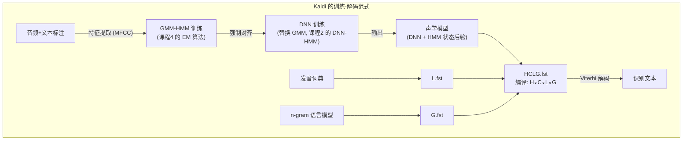
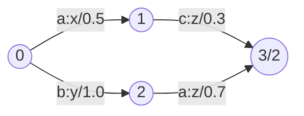
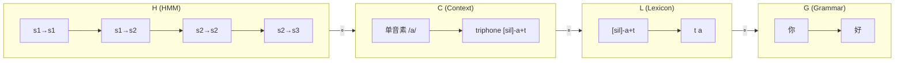
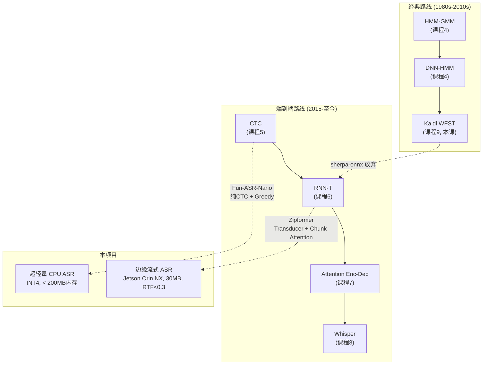

# 第 9 课：Kaldi 与 WFST 解码

> **核心问题**：前 5 课讲的 CTC / RNN-T / Attention / Whisper 都是"端到端"路线。但在 2011-2020 年间，ASR 世界的王者是 Kaldi——它用加权有限状态转换器 (WFST) 将声学模型、发音词典、语言模型**编译成一张巨大的静态图**，解码就是在这张图上做最短路径搜索。理解 WFST 才能回答"端到端革命到底革了谁的命"。
> **工程锚点**：sherpa-onnx 的前身是 k2（Kaldi 第二代），它试图用可微分 FSA 替代 WFST。本项目 Zipformer 完全放弃了 WFST——理解 WFST 才能理解这个决策的 tradeoff。

---

## 一、Kaldi 是什么

Kaldi 是 Daniel Povey 等在 2011 年启动的开源 ASR 工具包。在深度学习时代之前（和早期），它是语音识别社区的**事实标准**。



### Kaldi 的基本工作流

1. **准备数据**：音频 wav.scp + 文本 text + 发音词典 lexicon.txt + 语言模型 ARPA
2. **特征提取**：MFCC（13 维）+ Δ + ΔΔ → 39 维特征（第 2 课的经典方案）
3. **单音素 GMM-HMM 训练**：用 flat-start 做初始对齐（课程 4）
4. **三音素 GMM-HMM 训练**：状态绑定（决策树聚类），多轮迭代
5. **DNN 训练**：用第 4 步的强制对齐训练 DNN 替换 GMM
6. **WFST 编译**：构建 HCLG 解码图
7. **解码**：在 HCLG 图上做 Viterbi beam search

> **Kaldi 的哲学**：每个步骤都是**显式的、可检查的、可独立优化的**。你可以看一眼 GMM 的对齐质量，决定要不要多跑一轮迭代——这在端到端的黑箱训练中是不可能的。

---

## 二、WFST 基础：状态机上的代数

### FST 是什么

一个**加权有限状态转换器 (WFST)** 是一个有向图：

- **状态 (State)**：节点，有一个起始状态和若干终止状态
- **弧 (Arc)**：有向边，每条弧上有 **输入标签 : 输出标签 / 权重**
- **权重**：在热带半环 (tropical semiring) 下就是 "cost"（越小越好）



**解读**：从状态 0 出发，读入 "a" 并输出 "x"（cost 0.5）到状态 1；或读入 "b" 输出 "y"（cost 1.0）到状态 2。状态 3 是终止状态（双圈）。

### 核心操作

| 操作 | 符号 | 直觉 | ASR 中的应用 |
|------|:---:|------|------------|
| **Composition** | $\circ$ | 串联两个 FST：第一个的输出 → 第二个的输入 | 将发音词典和语言模型连接 |
| **Determinization** | $\det$ | 确保每个状态对每个输入标签至多一条出弧 | 消除搜索中的不确定性 |
| **Minimization** | $\min$ | 合并等价状态，减少状态数 | 压缩解码图，加速搜索 |
| **Epsilon Removal** | $\epsilon$-rem | 删除空标签（$\epsilon$）跳转 | 保证实时解码时不"卡在空跳转里" |

### Tropical Semiring：为什么这是最短路径问题

WFST 的权重在**热带半环**下运作：

$$\text{路径 cost} = \sum \text{各弧权重}$$
$$\text{FST 的 cost} = \min_{\text{所有路径}} (\text{路径 cost})$$

这恰好就是**有向无环图上的最短路径问题**——可以用 Viterbi 算法高效求解。

> **关键直觉**：WFST 把 ASR 的所有约束（声学、发音、语言）编译成**一张巨大的图**。解码 = **在这张图上找一条总 cost 最小的路径**，路径的输出标签序列就是识别结果。这是一个经典的图算法问题——不需要神经网络，不需要 GPU。

---

## 三、HCLG：WFST 在 ASR 中的具体化

HCLG 是四张子 FST 的**组合**，每张 FST 编码 ASR 问题的一个层次：

$$\text{HCLG} = H \circ C \circ L \circ G$$

### H：HMM 层

编码每个 HMM 状态的**自环**和**状态间转移**。

```
音素 /a/ 的 HMM (3 状态):
  a1 → a1 (自环, cost=转移概率)    ← HMM transition
  a1 → a2                          ← HMM transition
  a2 → a2 (自环)
  a2 → a3
  a3 → a3 (自环)
```

输入标签 = HMM 状态 ID（对应 DNN 输出的后验概率）；输出标签 = $\epsilon$（HMM 内部不产生输出）。

### C：上下文 (Context) 层

将单音素映射到**上下文相关音素 (triphone)**。

```
输入: "a" → 输出: "x-a+y"  ← triphone: 在 /x/ 和 /y/ 之间的 /a/
```

这是语言学的"协同发音"在 WFST 中的形式化——同一音素在不同上下文中有不同的声学实现。

### L：词典 (Lexicon) 层

将音素序列映射到**词**。

```
输入: "h ə l oʊ" → 输出: "hello"
输入: "n i h aʊ" → 输出: "你好"
```

发音变体在这里处理——一个词可以有多个发音路径，cost 最低者胜出。

### G：语法 (Grammar) 层

编码语言的 **n-gram 概率**。

```
"今天" → "天气" (cost = -log P(天气|今天))
"今天" → "我要" (cost = -log P(我要|今天))
```

G 是一个巨大的语言模型图（对于 3-gram 中文 LM，可达数百万状态）。

### 组合链：H∘C∘L∘G 的实例



**composition 的神奇之处**：四张独立的小图 compose 成一张大图后，这张图**同时编码了所有约束**。搜索算法不需要分别考虑声学、发音、语言——它在 HCLG 上搜一条路径就自动满足了所有层。

---

## 四、Kaldi 的 Chain Model 与 LF-MMI

### 从交叉熵到序列级判别训练

早期 Kaldi（nnet2/nnet3）用**帧级交叉熵**训练 DNN：逐帧预测 HMM 状态标签，目标是最大化正确标签的对数概率。这和课程 4 的 GMM 训练本质一样——只是把 GMM 换成了 DNN。

**Chain Model**（Kaldi 的最终形态）引入了**序列级判别训练准则 LF-MMI**（Lattice-Free Maximum Mutual Information）：

$$L_{\text{LF-MMI}} = \log \frac{P(O | W_{\text{ref}})}{P(O | W_{\text{den}})}$$

- **分子图 (numerator)**：只包含**正确文本**的所有可能路径（约束在已知文本上）
- **分母图 (denom graph)**：包含**所有可能文本**的所有可能路径（一个 4-gram 音素语言模型的全图）
- **Lattice-Free**：不是用"先解码生成 lattice，再在 lattice 上重打分"——而是直接在**全 phone LM 图**上计算分母

**LF-MMI 的直觉**：模型不仅要学会"给定文本，这些帧长什么样"（分子），还要学会"给定所有可能的文本，这些帧不应该长成别的样"（分母）。这是一种**判别训练**——直接优化最终目标（区分正确和错误），而非用交叉熵作为代理。

### 为什么 Chain Model 更好

| 维度 | 帧级 CE (nnet3) | 序列级 LF-MMI (chain) |
|------|:---:|:---:|
| **训练目标** | 逐帧 HMM 状态分类 | 序列级判别——"正确文本 vs 所有可能文本" |
| **帧率** | 10ms/帧 (100 fps) | 30ms/帧 (33 fps)——3 倍时间降采样 |
| **CER 改善** | 基准 | 相比 CE 改善 10-20% 相对 |
| **训练速度** | 快 | 慢（需要前向后向在 denom 图上） |

> **Chain model 的 3 倍时间降采样**是一个关键的工程优化——HMM 状态不再以 10ms 为单位，而是以 30ms 为单位。这直接减少了 $O(T^2)$ 的 lattice 大小，使得 LF-MMI 训练在计算上可行。

---

## 五、为什么 sherpa-onnx 放弃了 WFST

### WFST 的优点（曾经）

1. **数学优雅**：ASR 的四个层次 (H/C/L/G) 被完美映射到四个可组合的数学对象
2. **可解释**：解码图中的每一条弧都有明确的物理含义
3. **搜索高效**：编译后的 HCLG 可以用标准 Viterbi beam search，不需要 GPU
4. **Lattice 产出**：解码不仅输出最佳路径，还能产出**包含所有竞争的词格 (lattice)**——方便后续重打分

### WFST 的致命问题（现在）

| 问题 | 表现 |
|------|------|
| **固定词典** | HCLG 编译后，vocab 就固定了。要加新词 → 重新编译，可能需要数小时 |
| **巨大的内存** | 中文 3-gram HCLG 可达 50M 状态、500M 弧，单图 > 10GB |
| **构建管线复杂** | 需要 GMM 训练 → 对齐 → DNN 训练 → 图编译——多阶段、多工具链 |
| **端侧不可行** | 10GB 的解码图无法装进 Jetson 的 8GB 内存 |
| **不支持流式增量** | HCLG 是静态的——不支持动态插入热词或根据用户行为调整 |
| **与 DNN 割裂** | WFST 的权重是**对数概率**——无法和神经网络联合端到端优化 |

### 端到端的替代方案

```mermaid
graph LR
    subgraph Kaldi-WFST
        AK["音频"] --> BK["DNN → PDFs"] --> CK["HCLG 搜索"] --> DK["文本"]
    end
    subgraph End-to-End (sherpa-onnx)
        AE["音频"] --> BE["单一 ONNX 模型"] --> CE["Beam Search"] --> DE["文本"]
    end
    
    CK -.-|"10GB 静态图"| CK
    CE -.-|"~30MB 模型"| CE
```

| Kaldi WFST | sherpa-onnx E2E |
|------------|----------------|
| 构件：HCLG 解码图 (GB 级) | 构件：ONNX 模型 (MB 级) |
| 解码：静态图 Viterbi | 解码：NN 前向 + beam search |
| 热词：需要重新编译图 | 热词：shallow fusion 实时生效 |
| 训练：GMM→对齐→DNN→图编译 | 训练：端到端一次完成 |
| 适用：云端 ASR (内存充裕) | 适用：边缘 ASR (内存受限) |

---

## 六、WFST 的遗产

尽管端到端路线已经主导了新系统，WFST 思想在以下领域仍活着：

**1. k2 (Kaldi 第二代)**

sherpa-onnx 的前身 k2 尝试用**可微分的 FSA**替代 WFST。思路：FSA 的操作（compose、forward-backward）保持代数结构不变，但权重变成**可学习的参数**。这样 WFST 的数学优雅被保留了下来，同时整个 pipeline 可微分、可端到端训练。

实际上，sherpa-onnx 的 Zipformer 训练就使用了 k2 的**可微分 FSA 做 LF-MMI loss**——只不过解码时不再用 WFST，而是用 RNN-T 的 beam search。

**2. 工业界的混合方案**

很多大厂的 ASR 系统是 **E2E 训练 + WFST 解码**的混合：
- Encoder 用 Transformer 训练（端到端）
- 解码时用 shallow fusion 把外部语言模型的 WFST 融入 beam search
- 既享受了 E2E 的声学建模能力，又保留了 WFST 的热词/词典控制能力

**3. 教学价值**

WFST 是理解"ASR 中的搜索问题"的最佳框架。当你看到 beam search 的 K 个候选在竞争时——它背后运行的逻辑，和 WFST 的 Viterbi search 在本质上是同一件事。理解了 WFST，你就能在 E2E beam search 中 debug 为什么某个候选被剪掉了。

---

## 七、实践环节

### 实验 1：微型 FST 的 Compose 操作

```python
# 模拟 FST compose：第一个 FST 的输出 = 第二个 FST 的输入
# 简化版：用邻接表表示 FST

class MiniFST:
    def __init__(self):
        self.arcs = []  # [(from_state, to_state, in_label, out_label, cost)]
        self.start = 0
    
    def compose(self, other):
        """Compose self ∘ other"""
        result = MiniFST()
        # 对于每对 (self的弧[a→b, out=x], other的弧[c→d, in=x])
        # 产生 result 的弧 [(a,c) → (b,d), in=self.in, out=other.out, cost=self.cost+other.cost]
        for (f1, t1, in1, out1, c1) in self.arcs:
            for (f2, t2, in2, out2, c2) in other.arcs:
                if out1 == in2:
                    result.arcs.append(
                        ((f1, f2), (t1, t2), in1, out2, c1 + c2)
                    )
        return result

# 示例: L (词典) ∘ G (语法)
L = MiniFST()
L.arcs = [
    (0, 1, "n i", "你", 0.1),
    (0, 2, "h ao", "好", 0.2),
]

G = MiniFST()
G.arcs = [
    (0, 1, "你", "你", 0.5),
    (1, 2, "好", "好", 0.3),  # "你"→"好"
]

LG = L.compose(G)
print("L ∘ G 的弧:")
for (f, t, i, o, c) in LG.arcs:
    print(f"  {f} → {t}: {i} : {o} / {c:.1f}")
print("\n解读: 音素序列 'n i h ao' 可以输出词序列 '你好'")
```

### 实验 2：HCLG 的层次可视化

```python
# 模拟 HCLG 的每一层做的工作
def hclg_demo():
    print("HCLG 的四层解码:\n")
    
    print("H (HMM 层): 声学帧 → HMM 状态")
    print("  帧 10: 能量低, MFCC[0]高 → a1 状态 (cost=0.2)")
    print("  帧 11: 能量中, MFCC[1]升 → a2 状态 (cost=0.15)")
    print("  帧 12: 能量高, MFCC[2]降 → a3 状态 (cost=0.1)")
    print("  → HMM 状态序列: [a1, a2, a3]\n")
    
    print("C (Context 层): HMM 状态 → 上下文音素")
    print("  a1, a2, a3 → triphone [sil]-a+n (左静音, 右 n)\n")
    
    print("L (词典层): 音素序列 → 词")
    print("  [sil]-a+n + n+i + i+h + h+ao+sil → '你好'\n")
    
    print("G (语法层): 词序列打分")
    print("  P(你好) = P(你)·P(好|你) = 0.01 × 0.3 = 0.003")
    print("  cost = -log(0.003) ≈ 5.8\n")
    
    print("总计: 声学 cost + 语言 cost = 0.45 + 5.8 = 6.25")
    print("与其他候选路径比较，取 cost 最小的")

hclg_demo()
```

### 实验 3：WFST vs E2E 的内存对比

```python
# 为什么端侧不能用 WFST
wfst_states = {"LibriSpeech (英语)": 5_000_000,
               "AISHELL (中文, 小)": 20_000_000,
               "中文大词表 (50万词)": 200_000_000}

e2e_model_sizes = {"Zipformer (本项目 INT8)": 0.030,
                   "Whisper tiny (INT8)": 0.039,
                   "Whisper base (INT8)": 0.074}

print(f"{'方案':<30} {'状态/大小':>15} {'Jetson 可行?':>15}")
print("-" * 62)
for name, states in wfst_states.items():
    size_gb = states * 8 * 4 / 1e9  # 每弧~8B in/out + 4B weight
    feasible = "❌" if size_gb > 4 else "⚠️"
    print(f"{name:<30} {states/1e6:>8.0f}M 状态{size_gb:>5.1f}GB {feasible:>12}")

print()
for name, size_gb in e2e_model_sizes.items():
    feasible = "✅" if size_gb < 4 else "⚠️"
    print(f"{name:<30} {size_gb*1000:>12.0f}MB {feasible:>17}")
```

---

## 八、关键术语速查

| 术语 | 一句话定义 |
|------|-----------|
| **Kaldi** | 2011-2020 年 ASR 社区的事实标准工具包——GMM-HMM + DNN-HMM + WFST 解码 |
| **WFST** | Weighted Finite-State Transducer——带权重的有限状态转换器，ASR 搜索在它上面做最短路径 |
| **Composition ($\circ$)** | 串联两个 FST：$A \circ B$——A 的输出成为 B 的输入 |
| **Determinization** | 保证每个状态对每个输入标签至多一条出弧——消除搜索不确定性 |
| **HCLG** | $H \circ C \circ L \circ G$——HMM ∘ Context ∘ Lexicon ∘ Grammar，四合一解码图 |
| **Tropical Semiring** | 权重空间 $(\mathbb{R} \cup \{\infty\}, \min, +)$——FST 在其上演化为最短路径问题 |
| **LF-MMI** | Lattice-Free Maximum Mutual Information——Kaldi chain model 的序列级判别训练准则 |
| **分子/分母图** | MMI 训练的两张图——分子只含正确文本的路径，分母含所有可能文本的路径 |
| **Lattice** | 词格——解码产生的候选词图，不是单一最佳路径而是一个有竞争关系的 DAG |
| **k2** | Kaldi 第二代——将 WFST 升级为**可微分** FSA，支持端到端训练 |

---

## 九、Phase 2 收官：ASR 架构全景回顾



**Phase 2 的架构选型决策树**：

```
需要流式？
├── 是 → 边缘设备？
│        ├── 是 → Zipformer (Transducer)
│        └── 否 → 流式 Conformer/Chunk Attention
└── 否 → 需要多语言？
         ├── 是 → Whisper
         └── 否 → 离线 Zipformer / Whisper
```

---

## 十、下一步

### 推荐阅读

- **Mohri et al. (2008)** — "Speech Recognition with Weighted Finite-State Transducers" — WFST 在 ASR 中的经典综述
- **Povey et al. (2011)** — "The Kaldi Speech Recognition Toolkit" — Kaldi 的原始论文
- **Povey et al. (2016)** — "Purely Sequence-Trained Neural Networks for ASR Based on Lattice-Free MMI" — Chain model / LF-MMI 论文
- **OpenFST 文档** [openfst.org](https://www.openfst.org/) — WFST 操作的参考实现

### 下节预告

**Phase 3：专用语音模型** 开始。

[**第 10 课：关键词检测 (KWS)**](./第_10_课：关键词检测-KWS.md) — KWS 与 ASR 的本质区别（封闭词表 vs 开放词表）、small-footprint 模型架构（TC-ResNet、DNN-HMM、Zipformer KWS）、硬件方案（Hexaware/Quardaware）、虚警率/漏检率的工程平衡。

> **有疑问？** 可以问我 WFST 的 tropical semiring 和 log semiring 的区别、Kaldi 的 chain model 和 CTC 在数学上的对偶关系、或者为什么 k2 认为 "FSA 是比 tensor 更好的 ASR 中间表示"。
