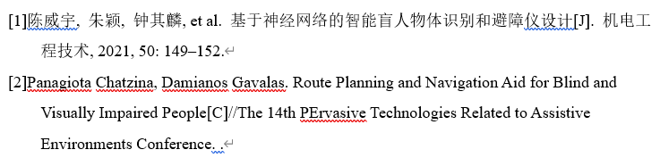

# JabRef预览引用及在Word添加GB格式参考文献

## JabRef预览引用

JabRef-选项-首选项-预览记录：

1. 选中在条目编辑器中以标签形式显示预览
2. 在搜索框查找China，选择China National Standard GB/T 7714-2015，点击中间的`>`符号，将其选中。下方可以看到预览，保存之后需要重新启动JabRef。

重启之后，选中(双击)库中记录的论文，就能看到下方看到GB格式的引用预览了。

## 在Word添加GB格式参考文献

正常来说，可以直接使用[导出JabRef引文到Word](./%E5%AF%BC%E5%87%BAJabRef%E5%BC%95%E6%96%87%E5%88%B0Word.md)这篇文章的方法快速导入，但是与学校要求的参考文献格式不同，还是需要手动导入。

在直接添加编号之后，可以看到第一行并没有与后面行有同样的悬挂，可以右键编号，选中调整列表缩进，编号之后项选择制表位，并选中下方制表位添加位置，将其设置为悬挂同样的尺寸。

这样就能让参考文献各行位于同一竖直线了。

在论文中需要交叉引用时，可以点击Word-引用-题注-交叉引用

引用类型选择编号项，引用内容选择段落编号，在下方编号项往下拉就能看到导入的参考文献了。
