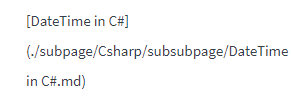

# 使用docsify应当注意的事情

## 作为文档的.md文件名不应当有空格或某些特殊符号

当使用空格时，例如：

在`_sidebar.md`中使用`[DateTime in C#](./subpage/Csharp/subsubpage/DateTime in C#.md)`

由于docsify是根据路径作为url访问的，会使得网页中无法渲染为链接：(解决方法就是替换空格为下划线)

然而在改完之后页面显示404 - Not found了(灵光一现把#改成Sharp解决了)：

## 导入图片

~~要使得部署在github上的静态网页能够正常显示图片，需要将GitHub当成图床，键入合适的链接，这里的第一张图链是`https://raw.githubusercontent.com/UrsoCN/Docs/master/docs/subpage/diary/subsubpage/1.png`~~

更加合适的导入图片的方法是``，直接在每一个subpage里添加一个images文件夹，以保证相对路径的统一。

然后添加了一个[图片缩放 - Zoom image](https://docsify.js.org/#/zh-cn/plugins?id=图片缩放-zoom-image)插件。
