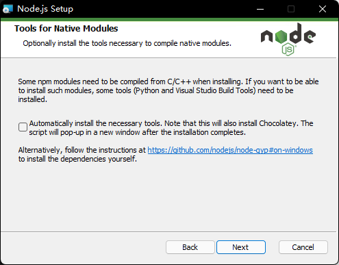

# 关于使用docsify创建一个静态博客

> [docsify官网](https://docsify.js.org/#/)

注：
1. 此文都是在Windows环境下操作
2. 请自行将$$包括的字符换成自己设备的文件地址 

## 1. 前置操作（非必要）

在docsify官网上，推荐使用npm工具安装docsify-cli来创建及在本地预览生成的文档。
而npm是随同NodeJS一起安装的包管理工具，所以我们找到[NodeJS官方网站](https://nodejs.org)下载并安装（推荐下载LTS - Long Term Support版本）

出现如下图的提示时，如果知识为了安装docsify-cli来完成创建博客，则不建议勾选，在使用过程中不需要这些工具。



> [关于不使用npm的手动初始化方法](https://docsify.js.org/#/zh-cn/quickstart?id=%e6%89%8b%e5%8a%a8%e5%88%9d%e5%a7%8b%e5%8c%96)

在完成安装之后，点击Windows键，输入path，并打开编辑系统环境变量窗口，在系统变量(S)窗口找到并双击Path，查看其中是否有```$安装nodejs的位置$\nodejs\```，并添加另一环境变量```$安装nodejs的位置$\node_global```(这一步的目的是为了能在想要放博客文章的位置直接使用docsify服务)。

## 2. 初始化并开启本地预览

1. 打开cmd(powershell好像不会及时同步path，不推荐在这里使用)，使用```npm i docsify-cli -g```指令全局安装 docsify-cli 工具。如果报错，请再检查一下环境变量。

2. 找到合适的存放博客文件的位置，使用```docsify init $存放博客文件的位置$/docs```，其中docs是存放存放markdown博客文件的文件夹，可以换成其他名称

3. 执行指令```docsify serve $存放博客文件的位置$/docs```启动一个本地服务器，在浏览器预览博客。

### 3. 部署在github上

> [官方部署教程](https://docsify.js.org/#/zh-cn/deploy)
> [其他教程](https://www.cnblogs.com/happyone/p/12152566.html)
