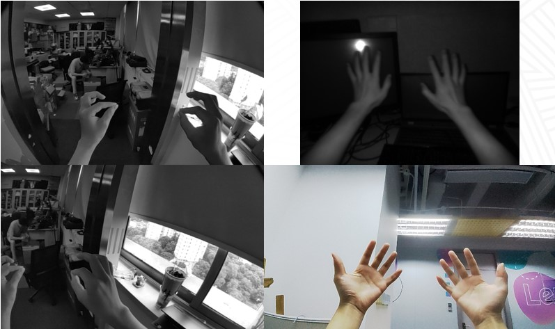
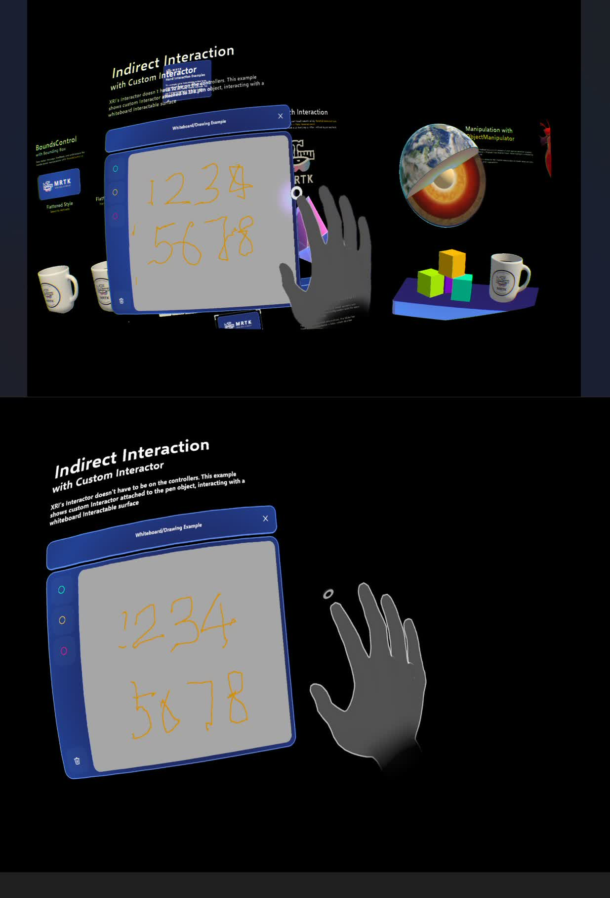
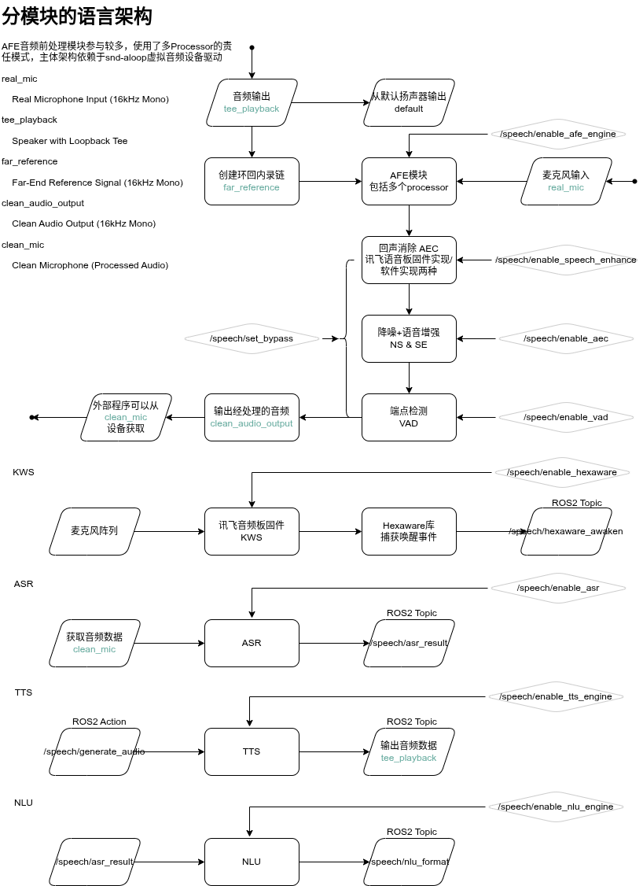
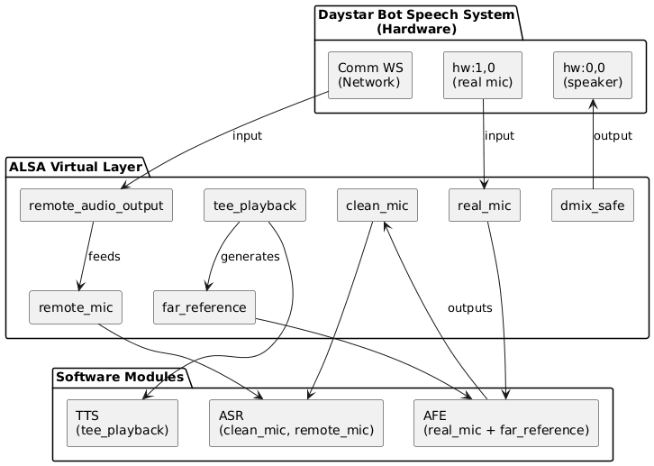
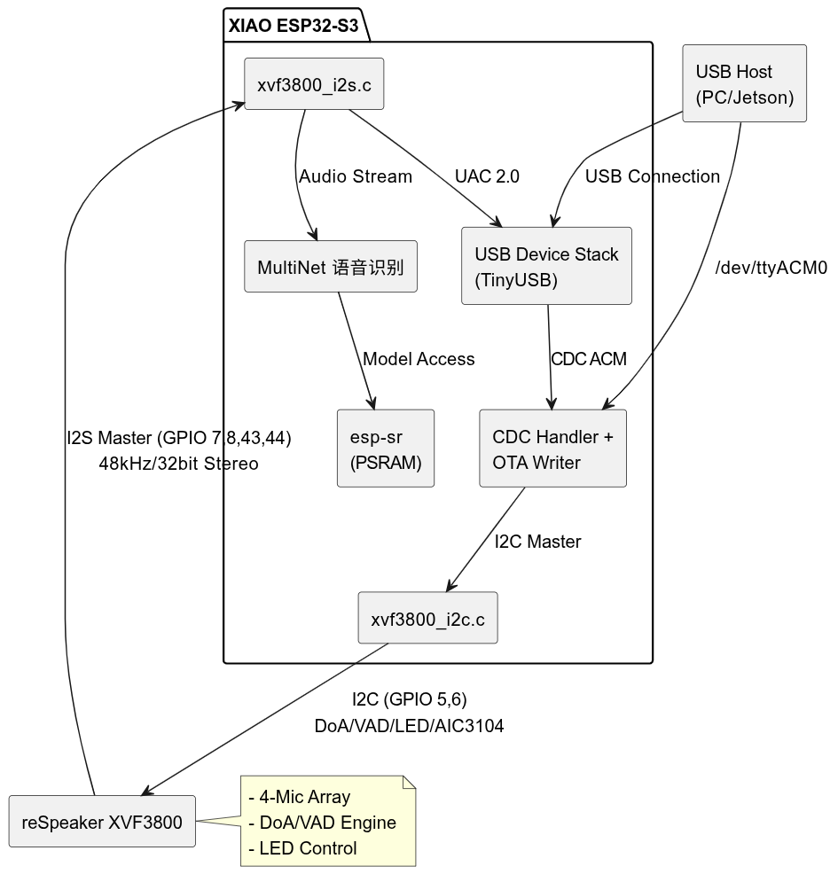
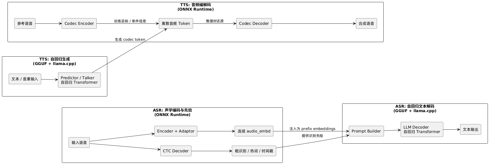

# 工作备份

> 在 Lenovo 工作产出的备份，不包含敏感信息，简历中使用。

## XR 备份

全场景的手势识别，左侧两图为双目鱼眼相机预览，右上为TOF深度相机的灰度预览，右下为RGB相机的预览

针对手势识别中出现jitter问题的优化工作

multiview功能在Android上的release，可以实现在应用内显示并操作其他应用。（使用virtualdisplay映射第三方app，缩放显示与操纵兼容性与原app无差异。）

multiview功能在Unity中的release，可以实现在Unity空间中显示并操作其他应用。（显示功能与Android端的实现不同，采用共享GPU texture unit实现，0延迟实现应用投影。）

## Robotics 备份

基于Ros2的机器人端侧语音服务，主体设计图：

系统⾳频 IO 说明图：

固件架构设计概览：

llm-based 离线语音服务(ASR + TTS)推理系统

