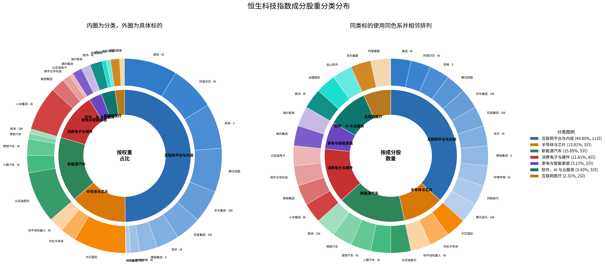
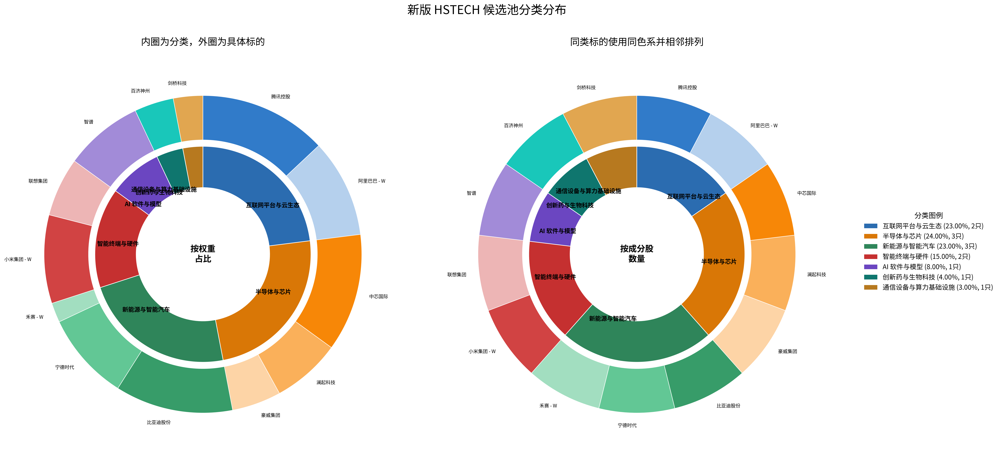

## 恒生科技当前成分股

>数据来自: https://www.hsi.com.hk/static/uploads/contents/zh_cn/dl_centre/factsheets/hstechc.pdf

| 股票号码 | 国际证券号码       | 公司名称       | ⾏业分类   | 比重(%)  |
| ---- | ------------ | ---------- | ------ | ------ |
| 3690 | KYG596691041 | 美团 - W     | 非必需性消费 | 8.81   |
| 0981 | KYG8020E1199 | 中芯国际       | 资讯科技业  | 8.68   |
| 1211 | CNE100000296 | 比亚迪股份      | 非必需性消费 | 8.53   |
| 9988 | KYG017191142 | 阿⾥巴巴 - W   | 非必需性消费 | 7.48   |
| 9999 | KYG6427A1022 | ⽹易 - S     | 资讯科技业  | 7.44   |
| 1810 | KYG9830T1067 | ⼩米集团 - W   | 资讯科技业  | 7.36   |
| 0700 | KYG875721634 | 腾讯控股       | 资讯科技业  | 7.33   |
| 9618 | KYG8208B1014 | 京东集团 - SW  | 非必需性消费 | 5.40   |
| 9888 | KYG070341048 | 百度集团 - SW  | 非必需性消费 | 4.28   |
| 1024 | KYG532631028 | 快⼿ - W     | 非必需性消费 | 3.78   |
| 9961 | KYG9066F1019 | 携程集团 - S   | 非必需性消费 | 2.94   |
| 9868 | KYG982AW1003 | ⼩鹏集团 - W   | 非必需性消费 | 2.89   |
| 2015 | KYG5479M1050 | 理想汽⻋ - W   | 非必需性消费 | 2.74   |
| 1347 | HK0000218211 | 华虹半导体      | 资讯科技业  | 2.65   |
| 9660 | KYG4602S1057 | 地平线机器⼈ - W | 资讯科技业  | 2.48   |
| 0992 | HK0992009065 | 联想集团       | 资讯科技业  | 2.32   |
| 0020 | KYG8062L1041 | 商汤 - W     | 资讯科技业  | 1.98   |
| 0300 | CNE100006M58 | 美的集团       | 非必需性消费 | 1.62   |
| 6690 | CNE1000048K8 | 海尔智家       | 非必需性消费 | 1.55   |
| 9626 | KYG1098A1013 | 哔哩哔哩 - W   | 非必需性消费 | 1.55   |
| 6618 | KYG5074A1004 | 京东健康       | 医疗保健业  | 1.49   |
| 2382 | KYG8586D1097 | 舜宇光学科技     | ⼯业     | 1.32   |
| 9863 | CNE100005K77 | 零跑汽⻋       | 非必需性消费 | 0.94   |
| 0241 | BMG0171K1018 | 阿⾥健康       | 医疗保健业  | 0.82   |
| 0268 | KYG525681477 | ⾦蝶国际       | 资讯科技业  | 0.75   |
| 9866 | KYG6525F1028 | 蔚来 - SW    | 非必需性消费 | 0.75   |
| 0780 | KYG8918W1069 | 同程旅⾏       | 非必需性消费 | 0.73   |
| 3888 | KYG5264Y1089 | ⾦⼭软件       | 资讯科技业  | 0.70   |
| 0285 | HK0285041858 | 比亚迪电⼦      | 资讯科技业  | 0.61   |
| 1698 | KYG875771134 | 腾讯⾳乐 - SW  | 非必需性消费 | 0.06   |
| 合共   |              |            |        | 100.00 |

行业比重：

重排目的为精简同类型企业，扩展恒生科技行业分布。原表使用多标签更适合做描述，不适合直接做饼图，因为同一家公司会同时落入多个标签并导致重复计权。

重新检查后，建议改为“单一主分类”口径：每家公司只保留一个主分类，优先按主营收入结构和资本市场通常认知归类，次要概念不单独拆类。这样更适合比较指数内部的行业分布。

合并原则：

- 将电商、本地生活、在线旅游、短视频、音乐、社区内容统一并入“互联网平台与内容”
- 将 AI、SaaS、办公软件、云服务统一并入“软件、AI 与云服务”
- 将光学零部件、PC、手机、电子代工统一并入“消费电子与硬件”
- 将智能驾驶芯片仍归入“半导体与芯片”，避免与整车重复

| 股票号码 | 公司名称 | 合并后主分类 | 归类说明 | 比重(%) |
| ---- | ---- | ------- | ---- | ------ |
| 3690 | 美团 - W | 互联网平台与内容 | 本地生活平台，核心仍是互联网交易平台 | 8.81 |
| 0981 | 中芯国际 | 半导体与芯片 | 晶圆代工龙头 | 8.68 |
| 1211 | 比亚迪股份 | 新能源汽车 | 整车与电池一体化，主线仍是新能源汽车 | 8.53 |
| 9988 | 阿里巴巴 - W | 互联网平台与内容 | 电商与平台业务为主，云为次主线 | 7.48 |
| 9999 | 网易 - S | 互联网平台与内容 | 游戏与内容平台型互联网公司 | 7.44 |
| 1810 | 小米集团 - W | 消费电子与硬件 | 手机、IoT 终端为主，汽车仍在扩张期 | 7.36 |
| 0700 | 腾讯控股 | 互联网平台与内容 | 社交、游戏、广告构成平台型互联网生态 | 7.33 |
| 9618 | 京东集团 - SW | 互联网平台与内容 | 电商平台为主，物流是平台能力延伸 | 5.40 |
| 9888 | 百度集团 - SW | 互联网平台与内容 | 搜索广告与平台流量仍是基本盘，AI 为强化方向 | 4.28 |
| 1024 | 快手 - W | 互联网平台与内容 | 内容社区与直播电商平台 | 3.78 |
| 9961 | 携程集团 - S | 互联网平台与内容 | 在线旅游平台 | 2.94 |
| 9868 | 小鹏汽车 - W | 新能源汽车 | 新能源乘用车整车 | 2.89 |
| 2015 | 理想汽车 - W | 新能源汽车 | 新能源乘用车整车 | 2.74 |
| 1347 | 华虹半导体 | 半导体与芯片 | 特色工艺晶圆代工 | 2.65 |
| 9660 | 地平线机器人 - W | 半导体与芯片 | 车载 AI 芯片为核心产品 | 2.48 |
| 0992 | 联想集团 | 消费电子与硬件 | PC 与硬件终端为主 | 2.32 |
| 0020 | 商汤 - W | 软件、AI 与云服务 | 视觉 AI 与模型服务更接近软件平台 | 1.98 |
| 0300 | 美的集团 | 家电与智能家居 | 家电为主，智能家居延伸 | 1.62 |
| 6690 | 海尔智家 | 家电与智能家居 | 家电与智能家居 | 1.55 |
| 9626 | 哔哩哔哩 - W | 互联网平台与内容 | 视频社区平台 | 1.55 |
| 6618 | 京东健康 | 互联网医疗 | 医药零售与在线医疗服务 | 1.49 |
| 2382 | 舜宇光学科技 | 消费电子与硬件 | 光学部件属于硬件产业链 | 1.32 |
| 9863 | 零跑汽车 | 新能源汽车 | 新能源乘用车整车 | 0.94 |
| 0241 | 阿里健康 | 互联网医疗 | 医药电商与互联网医疗服务 | 0.82 |
| 0268 | 金蝶国际 | 软件、AI 与云服务 | 企业 SaaS 与云服务 | 0.75 |
| 9866 | 蔚来 - SW | 新能源汽车 | 新能源乘用车整车 | 0.75 |
| 0780 | 同程旅行 | 互联网平台与内容 | 在线旅游平台 | 0.73 |
| 3888 | 金山软件 | 软件、AI 与云服务 | 办公软件、游戏与云服务，以软件能力为主 | 0.70 |
| 0285 | 比亚迪电子 | 消费电子与硬件 | 电子制造与零部件代工 | 0.61 |
| 1698 | 腾讯音乐 - SW | 互联网平台与内容 | 在线音乐内容平台 | 0.06 |
| 合共 |  |  |  | 100.00 |

按上述合并口径汇总后，可视化分类如下：

根据图示，可以看到分布太过于集中在互联网平台与内容中了。

## 调整选中成分股

我印象中更“科技”的港股标的：

1. 中芯国际
2. 小米集团
3. 智谱
4. 比亚迪股份
5. 阿里巴巴
6. 腾讯控股
7. 联想集团
8. 宁德时代
9. 澜起科技
10. 长飞光纤光缆/剑桥科技
11. 康方生物/恒瑞医药/百济神州
12. 豪威集团/舜宇光学科技
13. 禾赛/速腾聚创

按“保留你这 13 个方向，并优先挑选科技纯度更高、上游属性更强、和现有成分重叠更少的标的”这个口径，建议调整如下：

| 序号 | 你的候选 | 结论 | 建议标的 | 理由 |
| ---- | ---- | ---- | ---- | ---- |
| 1 | 中芯国际 | 保留 | 中芯国际 | 港股硬科技核心资产，晶圆代工代表 |
| 2 | 小米集团 | 保留 | 小米集团 | 手机、IoT、AI 终端与汽车并行，终端科技属性明确 |
| 3 | 智谱 | 保留 | 智谱 | 大模型与 AI 平台的纯度很高，适合作为 AI 软件层代表 |
| 4 | 比亚迪股份 | 保留 | 比亚迪股份 | 港股新能源整车与电池龙头 |
| 5 | 阿里巴巴 | 保留 | 阿里巴巴 - W | 云、AI、平台生态仍是港股科技权重核心 |
| 6 | 腾讯控股 | 保留 | 腾讯控股 | 社交、内容、云与 AI 生态仍具核心代表性 |
| 7 | 联想集团 | 保留 | 联想集团 | AI PC、服务器与企业硬件仍有终端和算力入口价值 |
| 8 | 宁德时代 | 保留 | 宁德时代 | 电池科技属性强，港股上市后可纳入新能源科技主线 |
| 9 | 澜起科技 | 保留 | 澜起科技 | 内存接口与服务器互连芯片更贴近算力与半导体主线 |
| 10 | 长飞光纤光缆/剑桥科技 | 二选一 | 剑桥科技 | 相比长飞更靠近高速光模块与 AI 算力互连，科技弹性更强 |
| 11 | 康方生物/恒瑞医药/百济神州 | 三选一 | 百济神州 | 创新药技术平台、国际化能力和市值代表性最均衡 |
| 12 | 豪威集团/舜宇光学科技 | 二选一 | 豪威集团 | 若强调“更科技”，上游图像传感器与芯片属性强于光学模组 |
| 13 | 禾赛/速腾聚创 | 二选一 | 禾赛 - W | 在激光雷达赛道里技术纯度、量产验证和全球化更强 |

按上述替换后，可以形成一版更偏“港股硬科技”的 13 只核心池：

| 序号 | 股票名称 | 主分类 | 建议比重(%) | 权重理由 |
| ---- | ---- | ---- | ---- | ---- |
| 1 | 腾讯控股 | 互联网平台与云生态 | 13.0 | 仍是港股科技底仓，但需明显低于传统宽基的集中度 |
| 2 | 中芯国际 | 半导体与芯片 | 12.0 | 港股硬科技中最核心的制造资产 |
| 3 | 比亚迪股份 | 新能源与智能汽车 | 12.0 | 整车、电池、智驾三位一体，代表性极强 |
| 4 | 阿里巴巴 - W | 互联网平台与云生态 | 10.0 | 保留平台与云生态，但权重低于传统指数配置 |
| 5 | 小米集团 | 智能终端与硬件 | 9.0 | 智能手机、IoT、汽车形成多终端入口 |
| 6 | 宁德时代 | 新能源与智能汽车 | 9.0 | 电池平台科技属性强，适合作为新能源底仓 |
| 7 | 智谱 | AI 软件与模型 | 8.0 | 纯 AI 模型平台，理应获得高于普通主题股的配置 |
| 8 | 澜起科技 | 半导体与芯片 | 7.0 | 算力链上游芯片，能增强半导体的“设计”维度 |
| 9 | 联想集团 | 智能终端与硬件 | 6.0 | AI PC 与服务器仍能提供硬件入口和企业级算力敞口 |
| 10 | 豪威集团 | 半导体与芯片 | 5.0 | 上游传感器与芯片属性更符合“硬科技”筛选标准 |
| 11 | 百济神州 | 创新药与生物科技 | 4.0 | 保留生物科技维度，但不让其占用过多科技主线权重 |
| 12 | 剑桥科技 | 通信设备与算力基础设施 | 3.0 | 更贴近高速光模块与算力互联，是通信方向里更优选 |
| 13 | 禾赛 - W | 智能汽车零部件 | 2.0 | 激光雷达具前沿技术属性，但波动较大，宜低配 |
| 合计 |  |  | 100.0 |  |

这套权重不是简单复制市值，而是主题指数权重思路：

- 保留腾讯、阿里、中芯、比亚迪这类大市值龙头作为底仓
- 把半导体、AI 软件、硬件终端、新能源科技的权重整体抬高，压低平台经济独占比重
- 对激光雷达、创新药等波动更高的科技子方向给中低权重，防止指数主题过窄

新版分类汇总如下：

| 分类 | 权重(%) | 成分股数 |
| ---- | ------ | ---- |
| 互联网平台与云生态 | 23.0 | 2 |
| 半导体与芯片 | 24.0 | 3 |
| 新能源与智能汽车 | 23.0 | 3 |
| 智能终端与硬件 | 15.0 | 2 |
| AI 软件与模型 | 8.0 | 1 |
| 创新药与生物科技 | 4.0 | 1 |
| 通信设备与算力基础设施 | 3.0 | 1 |
| 合计 | 100.0 | 13 |

新的 hstech 双饼图如下：

---

## 修改后存在的一些问题

1. 宁德时代（03750.HK）严格来说"港股"但不宜纳入此指数范畴
> 宁德时代于2025年5月20日以A+H方式登陆港股，港股上市前A股市值约1.2万亿元，港股市值1.47万亿港元。从科技创新维度看，电池科技确实足够"硬"，但这里有一个定位层面的矛盾：你构建的是"港股硬科技指数"，宁德时代在港股只是"二次上市"，其主要上市地、主要交易流动性、定价中枢都在A股。当前指数编纂实践中最常用的"港股"标准是主要上市地为香港，宁德时代在此口径下会被排除在外。类比：如果一只在纳斯达克上市的公司同时在新加坡有了第二上市，你会不会把它算进纳指？大概率不会。建议：如果坚持A+H纳入，需要在指数规则中明确"A+H都计入港股硬科技池"；如果采用主要上市地口径，应从池中移除。
2. 剑桥科技（06166.HK）和宁德时代情况类似，但体量小得多
> 剑桥科技作为港股市场CPO（光电共封装）概念第一股，于2025年10月28日上市，归属通信设备与算力基础设施的分类逻辑是成立的。但它的主要上市地依然是A股（603083.SH），港股仅是第二上市。如果主要上市地口径下剔除，通信/算力基建方向就出现了空白——这是一个值得注意的结构性问题。可能长飞光纤光缆更合适
3. 第三代半导体/功率器件——空缺明显
> 新能源汽车的关键上游——功率半导体——出现了明显的产业链断层：
4. 智谱权重偏高
> 智谱当前8%的配置权重已经超过了腾讯、接近小米，也高于澜起和豪威这类已有营收支撑的半导体公司。根据公开信息，智谱目前仍处于高强度的亏损状态（2025年经调整净亏损31.82亿元，营收7.24亿元）。将8%的权重分配给高估值亏损大模型公司，在指数层面构成了一个集中度风险，建议将其权重下调至5-6%，在指数中维持AI敞口但不让它单个占据过高的风险暴露。
5. 创新药维度
> 百济神州放在这里略显突兀。如果用户希望保留生物科技维度，药明康德（02359.HK）的生命科学和医药研发平台属性比纯粹的抗癌药更贴近"硬科技"。但创新药的大规模纳入会显著拉低指数的科技浓度，建议保持低权重（4%以下），或考虑用药明康德替代百济神州。

## 解决

### 一、中创新航 vs 宁德时代：为什么中创新航更合适
你从主要上市地角度将宁德时代排除的思路是对的。中创新航（03931.HK）在港股是主要上市，而宁德时代只是第二上市，流动性、定价中枢都在A股。以下从三个维度说明为什么中创新航不仅满足上市地要求，质量上也是合格的：

1. 市场地位：全球动力电池核心玩家
中创新航2025年动力电池装机量62.8GWh，同比增长52.6%，稳居全球第四、国内第三，并于2025年10月首度跻身全球前三，市场份额增至5.3%。储能电芯出货量同样进入全球前四。换句话说，它在港股电池赛道中是全球核心玩家，不是二线陪跑。

2. 客户结构：摆脱单一依赖风险
前五大客户依赖度从2023年的71%降至2024年的55%，已进入丰田、大众、现代等车企集团供应链，对蔚来、小鹏等新势力渗透率持续提升。这在一个电池上中下企业的动态中属于比较健康的客户结构。

3. 前沿技术：全固态电池走在前列
公司430Wh/kg全固态电池等前沿技术布局领先，固液混合电池已率先搭载新能源商用车实现批量装机，450Wh/kg"无界"全固态电池已完成试制验证，性能行业领先。

结论：中创新航是港股电池赛道中最佳可用替代，建议权重3-4%（显著低于比亚迪的11-12%，二线企业的合理敞口而非底仓配置）。

### 二、长飞光纤 vs 剑桥科技：为什么长飞光纤更适合
两者目前都是A股主要上市+港股第二上市的架构，都不满足"主要上市地为香港"的严格口径。但在当前池中通信/算力基建方向空白的情况下，两者之间长飞光纤是更优选择。以下从三个维度对比：

1. 业绩规模与成长性

|指标|	长飞光纤（06869.HK）	|剑桥科技（06166.HK）|
|--|--|--|
|2025年总营收|	约142.52亿元（同比+16.85%）	|48.23亿元（同比+32.07%）|
|2025年净利润|	8.14亿元（同比+20.40%）	|2.63亿元（同比+58.08%）|
|光互联组件增速|	31.44亿元（同比+48.58%）	|高速光模块同比+240.85%|
|海外收入占比|	42.74%	|较高（欧美头部客户为主）|

长飞光纤业绩体量更大、盈利确定性更强，且海外收入占比已超40%，全球化布局更成熟。

2. 技术纵深与算力敞口
长飞光纤不仅做光互联组件，而是覆盖了光纤预制棒→光纤光缆→光器件/光模块→智算解决方案的完整产业链。其推出的AI智算枢纽解决方案整合了空芯光纤、多芯光纤、高端多模光纤、高密度布线系统及400G/800G/1.6T高速光模块，构建起完整的光传输网络。空芯光纤相比传统实芯光纤时延降低31%、传输速度提升47%、非线性效应近乎归零，目前已在亚洲、欧洲、美洲等地区部署十个以上商用及试点项目。
剑桥科技的核心优势在于高速光模块，但产业链纵深和算力基础设施的整体覆盖度不如长飞。

3. 通信基础设施的"广义算力"定位
你说"AI能力的提升主要是模型驱动的"，这点我同意，但算力互联能力是AI基础设施的刚性配套——大模型训练依赖的是集群级算力，而集群算力的瓶颈恰恰在互联环节（英伟达等大厂最急需解决的就是卡间和集群间的互联带宽）。光纤正是解决这个问题的物理基础，不是边缘配角。

长飞光纤2025年光互联组件业务31.44亿元（同比+48.58%）的高速增长，正是这一刚需的映射。

结论：若坚持主要上市地口径，剑桥和长飞都不符合，需另寻纯港股通信标的；若不坚持，长飞光纤比剑桥科技更适合——规模更大、产业链更完整、估值风险更低。建议权重3-4%。

> 纠正：长飞光纤光缆在港股要早于A股上市，作为恒生科技是合理的。

### 三、关于AI服务器/算力基础设施的立场调整
你提出"AI大厂自身的算力基础设施能力远超汇聚科技这类企业"——这个判断基本正确，但我建议稍微调整一下思考框架，以便更准确地在指数中定位算力基建板块。

核心区分：算力运营商 vs 算力使用者
使用者（云厂商/AI大厂）：阿里云、字节、智谱、谷歌、OpenAI等。它们建设的算力基础设施再强，在资本市场体现的是AI能力和平台价值，而不是"算力基础设施公司"本身。

运营商（汇聚科技/粤港湾智算等）：它们的商业模式是将自身存量的算力资源直接转化为营收（算力租赁、IDC运营），而不是"比云厂商的AI能力更强"。

从这个角度看，汇聚科技2025年营收124.1亿港元（同比+68%），其中服务器组装分部收入跃升至74.0亿港元（同比+132%），核心驱动来自国产算力建设加码；粤港湾智算手握超150亿元计费算力订单，FP16稠密算力规模超42,000 PFLOPS，AI算力业务毛利率39.6%。

联想的"纯硬件"定位与AI服务器增长
联想确实显得"更科技"，且2025年AI服务器业务营收74.0亿港元（同比+132%），是集团核心增长引擎之一。但联想本质上覆盖的是从消费端PC到企业端服务器的硬件链条，而智算运营标的覆盖的是算力租赁和IDC运营。

两者维度不同，但都有各自的价值。不过在你的指数框架中，硬件终端已有小米和联想两家，智算运营方向的缺失仍然是一个缺口。

结论：若坚持算力基建的方向，建议在汇聚科技和粤港湾智算中选一个（更推荐粤港湾智算，业务纯度高、订单储备充足），权重2-3%（与通信并列，不放大权重，让投资逻辑更干净）。

### 四、英诺赛科 vs 天岳先进：第三代半导体的路线选择
两者在第三代半导体领域是差异化路线的代表，不存在"谁更好"，而是看你需要在指数中覆盖哪条技术路线。

核心区别：GaN vs SiC

|维度|	英诺赛科（02577.HK）|	天岳先进（688234.SH）|
|--|--|--|
|技术路线|	氮化镓（GaN）	|碳化硅（SiC）衬底|
|主要应用|	AI服务器电源、车载激光雷达、消费电子快充（中低压）|	新能源汽车主驱（1200V+）、超充桩、光伏逆变器（高压）|
|龙头地位|	GaN功率器件全球市占率第一|	SiC衬底全球前三（市占率22.8%）|
|技术壁垒|	8英寸硅基GaN晶圆量产，月产能1.3万片，良率>95%	|全球唯一能量产12英寸全品类SiC衬底的企业|
|客户验证|	英伟达800V HVDC架构核心供应商（AI电源）	|台积电合作验证12英寸衬底用于CoWoS先进封装|
|盈利状态|	处于投入期	|盈利承压，受SiC衬底价格下行影响|
|上市地|	港股主要上市|A股先上市|

关键洞察：两者的互补关系
两者并非竞争对手，而是垂直互补的天作之合——天岳先进的SiC衬底正好是英诺赛科SiC MOSFET器件的核心上游材料，且天岳先进已通过英诺赛科验证，2025年目标供应30%以上英诺赛科GaN外延片需求。

从产业链完整性角度看，两条路线都很重要。但天岳先进（A股）不符合主要上市地为港股的要求，因此指数中只能选择英诺赛科（港股主要上市）。

结论：优先纳入英诺赛科（02577.HK），代表GaN路线+AI数据中心电源。天岳先进是A股，不符合"主要上市地为港股"的标准，因此即使它在SiC衬底领域龙头地位显著，也无法纳入。建议英诺赛科权重3-4%。

### 五、创新药：康方生物/恒瑞医药/百济神州，三选一
三家公司都是创新药赛道的龙头，但定位不同，以下从四个维度对比：

|维度|	百济神州（06160.HK）|	恒瑞医药（600276.SH）|	康方生物（09926.HK）|
|--|--|--|--|
|核心竞争力|	全球化商业能力|	管线深度与广度|	双抗技术平台差异化|
|2025年总营收|	382.05亿元（同比+40.4%）|	316.29亿元（同比+13.02%）|	59亿元级别|
|2025年净利润|	14.22亿元（扭亏为盈）|	77.11亿元（同比+21.69%）|	17.86亿元|
|海外收入占比|	47%，欧美完整销售团队|	主要通过对外许可授权（33.92亿元）|	PD-1/VEGF双抗50亿美元授权Summit|
|核心里程碑|	泽布替尼全球销售额280.67亿元，超75个市场获批|	13款创新药获批上市，400余项临床推进中	卡|度尼利（PD-1/CTLA-4双抗）和依沃西（PD-1/VEGF）双抗双管线|
|研发强度|	高|	87.24亿元（占营收27.58%）|	高|

上市地	港股+美股+A股（三地上市）	A股	港股主要上市
三家对比：谁最适合"港股硬科技指数"？
康方生物（09926.HK）：港股主要上市，技术平台差异化最强（全球领先的双抗平台），业绩体量最小但弹性最大。它的"Biotech"属性在三者中最强——品牌和估值完全取决于管线进展，这也是为什么它在港股创新药中往往有更高的贝塔。

百济神州（06160.HK）：港股主要上市，全球商业化能力最强，收入体量和盈利确定性最高。核心产品泽布替尼2025年全球销售额280.67亿元，是中国创新药国际化最成功的案例。BD交易也最为成熟。

恒瑞医药：A股上市，不符合主要上市地标准，直接排除。

最终推荐
从指数整体定位出发（"港股硬科技"），创新药作为指数的一个低权重补充维度（3-4%），不需要承担权重主体的角色。因此，选择的标准是：

必须是港股主要上市

与指数其他科技板块的技术共振感（双抗平台vs AI/半导体）＞单纯的商业成熟度

基于以上，康方生物 > 百济神州。康方生物的双抗平台与中国生物科技的"技术跃迁"叙事最契合——技术平台足够独特，且与"硬科技"的技术驱动逻辑高度一致，同时纯港股上市，符合指数编撰标准。如果更倾向确定性而非差异化，百济神州是备选。

结论：推荐康方生物（09926.HK），权重建议3%（非核心权重，维持科技浓度）。

总结：各领域最终推荐

|问题领域|	推荐选择|	代码|	建议权重	|推荐理由|
|--|--|--|--|--|
|电池|	中创新航|	03931.HK|	3-4%	|港股主要上市，全球第四，全固态电池布局领先|
|通信/算力|	长飞光纤|	06869.HK|	3%	|全产业链纵深，AI智算枢纽解决方案，业绩体量大|
|智算运营|	粤港湾智算|	01396.HK|	2-3%	|纯智算标的，150亿+|算力订单，业务纯度高|
|第三代半导体|	英诺赛科|	02577.HK|	3-4%	|GaN功率器件全球第一，AI电源及智驾双重敞口|
|创新药|	康方生物|	09926.HK|	3%	|双抗平台差异化，纯港股上市，与科技指数气质最贴合|

最终综合考虑后，粤港湾智算没有加入。以下是最终调整后的重新排表：

## 附表

| 序号 | 股票名称 | 主分类 | 建议比重(%) | 权重理由 |
|------|----------|--------|--------------|----------|
| 1 | 腾讯控股 | 互联网平台与云生态 | 13.0 | 港股科技底仓，社交+游戏+云生态不可替代，但主动压低集中度 |
| 2 | 阿里巴巴 - W | 互联网平台与云生态 | 12.0 | 电商+云平台，保留平台经济敞口但权重低于传统指数 |
| 3 | 中芯国际 | 半导体与芯片 | 12.0 | 港股硬科技最核心的晶圆制造资产，产业链自主可控的关键 |
| 4 | 小米集团 | 智能终端与硬件 | 11.0 | 智能手机+IoT+汽车多终端入口，消费电子与生态协同 |
| 5 | 比亚迪股份 | 新能源与智能汽车 | 9.0 | 整车+电池+智驾三位一体，新能源赛道综合代表性最强 |
| 6 | 澜起科技 | 半导体与芯片 | 8.0 | 内存互连芯片全球龙头，算力链核心设计资产 |
| 7 | 联想集团 | 智能终端与硬件 | 7.0 | AI PC+服务器双轮驱动，硬件入口与企业算力兼顾 |
| 8 | 智谱 | AI 软件与模型 | 5.0 | 国产大模型第一梯队，纯AI平台，代表指数“软科技”方向 |
| 9 | 豪威集团 | 半导体与芯片 | 5.0 | CMOS图像传感器全球前三，感知层硬科技核心标的 |
| 10 | 中创新航 | 新能源与智能汽车 | 5.0 | 港股主要上市动力电池龙头（全球第四），替代宁德时代作为电池敞口 |
| 11 | 英诺赛科 | 半导体与芯片 | 5.0 | 氮化镓功率半导体全球第一，AI服务器电源+智驾双重受益 |
| 12 | 康方生物 | 创新药与生物科技 | 5.0 | 双抗技术平台全球领先，纯港股上市，低权重保留生物科技维度 |
| 13 | 禾赛 - W | 智能汽车零部件 | 3.0 | 激光雷达技术前沿，具高波动性，仅作卫星配置 |
| **合计** | | | **100.0** | |

