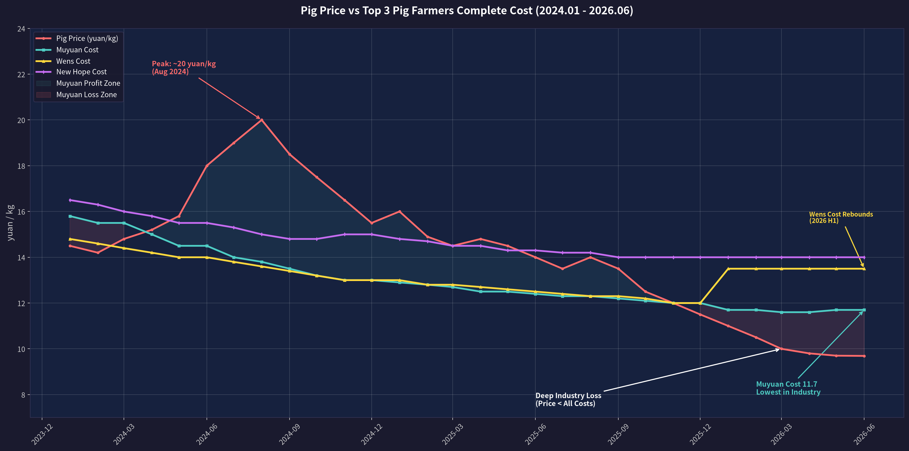

# 牧原股份（002714）2026H1 深度分析：猪周期底部与寡头逻辑

> created: 2026-07-11
> modified: 2026-07-11
> 数据截止日期：2026-07-10

## 一、事件背景

2026 年 7 月 10 日，牧原股份发布半年度业绩预告：**2026 年 H1 预计亏损 57-67 亿元**。同日在投资者问答中，董秘回复 6 月完全养殖成本约为 **11.7 元/kg**。

本文将从猪价走势、成本比较、现金流压力测试、行业格局演变与估值四个维度进行综合量化分析。

## 二、猪价与成本全景

### 2.1 生猪均价走势（2024.01 — 2026.06）

| 时期         | 均价区间（元/kg）           | 趋势               |
| ---------- | -------------------- | ---------------- |
| 2024 H1    | 14.2 → 18.0          | 震荡上行，6 月突破 18    |
| 2024 H2 峰值 | 18.5 → **20.0**（8 月） | 夏季供给缺口，全年高点      |
| 2024 Q4    | 17.5 → 15.5          | 高位回落             |
| 2025 H1    | 16.0 → 14.0          | 震荡下行             |
| 2025 H2    | 13.5 → **11.5**      | 加速下跌，供给过剩        |
| 2026 H1    | 11.0 → **9.69**      | 深度亏损区间，跌破 10 元大关 |

**H1 均价约 10.4 元/kg，同比降幅约 28%。**

### 2.2 三大猪企完全成本对比

| 时期 | 牧原 | 温氏 | 新希望 |
|---|---|---|---|
| 2024 年初 | 15.8 | 14.8 | 16.5 |
| 2024 年中 | 14.5 | 14.0 | 15.5 |
| 2024 年末 | 13.0 | 13.0 | 15.0 |
| 2025 年初 | 12.9 | 13.0 | 14.8 |
| 2025 年中 | 12.4 | 12.5 | 14.3 |
| 2025 年末 | **12.0** | **12.0** | 14.0 |
| 2026 Q1 | 11.6 | 13.5 | 14.0 |
| 2026 Q2 | **11.7** | **13.5** | 14.0 |

**关键发现：**
- 牧原成本持续优化，从 15.8 元/kg 降至 11.7 元/kg（降幅 **26%**），目标 2026 全年 <11.5 元/kg
- 温氏 2025 年紧追后（12.0 元/kg），2026 H1 成本反弹至 13.5 元/kg（同业竞争策略调整）
- 新希望全程成本最高（14-16 元/kg），成本优化速度最慢

### 2.3 可视化图表

> 图表说明：红色线为生猪均价，青绿色/黄色/紫色分别为牧原/温氏/新希望完全成本。红色填充区为牧原亏损区间，蓝色填充区为牧原盈利区间。

## 三、业绩分解与影响评估

### 3.1 H1 业绩分解

| 项目 | 金额 | 说明 |
|---|---|---|
| Q1 实际亏损 | **-12.15 亿** | 猪价 ~10.5 元/kg，成本 11.6-11.7 |
| Q2 预估亏损 | **-45 至 -55 亿** | 猪价 ~9.7 元/kg，剪刀差扩大至 ~2 元/kg |
| H1 合计预告 | **-57 至 -67 亿** | Q2 亏损加速扩大 |

**Q2 亏损骤扩的核心原因**：Q1 猪价尚在 ~10 元/kg 以上，Q2 跌穿 10 元并于 6 月触及 9.69 元/kg。猪价-成本剪刀差从 Q1 的 ~1 元/kg 扩大到 Q2 的 ~2 元/kg。

### 3.2 同行对比：全行业深亏

| 企业 | H1 出栏量（估） | 完全成本 | H1 亏损（估） |
|---|---|---|---|
| **牧原** | ~3,862 万头 | **11.7** | **-57~-67 亿** |
| 温氏 | ~1,781 万头 | ~13.5 | -40~-50 亿 |
| 新希望 | ~711 万头 | ~14.0 | -20~-25 亿 |
| **9 家合计** | **~7,000 万头** | — | **亏损超 300 亿** |

> **周期逻辑核心**：牧原每亏损 1 元，同行亏 2-3 元。市占率从当前的 ~8%（年出栏 7,700 万头 / 全国 ~7 亿头）向 10-12% 跃升。

## 四、现金流压力测试

### 4.1 财务缓冲垫

| 指标 | 2026 Q1 末 | 评价 |
|---|---|---|
| **资产负债率** | **50.73%** ⬇️（较年初 -3.42pct） | 持续降杠杆，安全 |
| 货币资金 | ~142.70 亿 | |
| 短期借款 | 401.72 亿 | |
| 一年内到期非流动负债 | 65.29 亿 | |
| 短债合计 | ~467 亿 | 货币资金覆盖率 ~30% |
| 经营现金流（2023 年可比期） | **+98.93 亿**（虽亏损但为正） | 折旧摊销大，现金流 ≠ 利润 |
| 银行授信 | 充足 | 龙头信用，再融资顺畅 |

**关键认知**：牧原为「折旧前亏损、现金流为正」模式。巨大生物资产折旧（母猪、种猪）为非现金支出，H1 预计亏损 57-67 亿，但经营现金流大概率仍在微正或小幅为负水平。

### 4.2 极端情景测试（假设猪价维持 9.5 元/kg）

| 参数 | 数值 |
|---|---|
| 月出栏量 | ~600 万头 |
| 头均重量 | 110 kg |
| 月收入 | 600万 × 110 × 9.5 ≈ **62.7 亿** |
| 月成本 | 600万 × 110 × 11.7 ≈ **77.2 亿** |
| **月现金净流出** | **~14.5 亿** |
| **年化现金流出** | **~174 亿** |

| 情景 | 结论 |
|---|---|
| **乐观**：H2 猪价回升至 13 元（行业预测上限） | H2 扭亏，全年亏损 ~30-40 亿 ✅ |
| **中性**：H2 猪价 11-12 元 | H2 减亏，全年亏损 ~50-60 亿 ⚠️ |
| **悲观**：H2 猪价维持 10 元以下 | H2 再亏 60 亿，全年亏 ~120 亿 ⚠️⚠️ |
| **极端**：猪价 9 元持续 12 个月 | 年现金流出 ~174 亿，货币资金 142 亿 → 需再融资 ⛔ |

**结论**：中性假设下（H2 猪价回升），牧原在现金层面至少能扛 **12-18 个月**。

### 4.3 亏损的短长期影响

| 影响维度 | 短期（2026 H2） | 长期（2027+） |
|---|---|---|
| 资产负债率 | 从 50.73% 升至 ~55% | 猪价回升后快速降至 50% 以下 |
| 每股净资产 | 从 13.22 元降至 ~12.5 元 | 随盈利恢复回升 |
| 行业地位 | **强化**（同行亏更惨，散户加速退出） | 市场份额提升至 10-12% |
| 分红能力 | 无（亏损不分红） | 恢复盈利后重新分红 |
| 成本优势 | 绝对领先 ~1.8-2.3 元/kg | 穿越周期后的核心竞争力 |

## 五、估值分析（周期股专用框架）

### 5.1 股价表现

| 指标 | 数值 |
|---|---|
| 年初股价（约） | ~49 元 |
| 6 月低点 | **32.35 元** |
| H1 最大跌幅 | **-34.86%** |
| 当前估值 PB | ~2.96x（每股净资产 13.22 元） |

### 5.2 PB-ROE 估值（最适合周期股）

| 估值指标 | 当前 | 历史中枢 | 评价 |
|---|---|---|---|
| **PB** | **2.96x** | 3.5-5.0x（正常周期） | **低估** |
| PB 历史底部 | 2.96x | 2.0-2.5x | 略高于极端底部 |
| 隐含股价（PB=2.5x） | 33.05 元 | 接近 6 月低点 32.35 | **当前价基本在底部区域** |
| 隐含股价（PB=3.5x） | 46.27 元 | 对应年初价格 | 上行空间 ~40% |

### 5.3 市值/出栏量 估值

| 指标 | 数值 | 评价 |
|---|---|---|
| 市值 | ~1,850 亿（按 34 元） | |
| 年化出栏量 | ~7,700 万头 | |
| **每头估值** | **~2,400 元/头** | **历史低位**（正常 3,500-5,000 元/头） |

### 5.4 核心财务健康度评分

| 维度 | 评分 | 说明 |
|---|---|---|
| 成本优势 | ⭐⭐⭐⭐⭐ | 11.7 元/kg，行业最低 |
| 负债水平 | ⭐⭐⭐ | 50.73%，可控但偏高（制造业合理 <40%） |
| 短期流动性 | ⭐⭐⭐ | 货币资金/短债 = 30%，略紧 |
| 经营现金流 | ⭐⭐⭐⭐ | 历史证明亏损期仍能正向 |
| 融资能力 | ⭐⭐⭐⭐⭐ | 龙头信用，银行 + 发债通道畅通 |
| 资产质量 | ⭐⭐⭐⭐ | 生物资产可灵活调整（能繁母猪去化） |
| 出海潜力 | ⭐⭐⭐ | 越南建厂，长期新增量 |

## 六、周期逻辑验证

### 6.1 核心判断矩阵

| 判断 | 验证结果 |
|---|---|
| "牧原亏损同行亏更厉害" | ✅ 完全正确，牧原成本优势 ~2 元/kg |
| "存量市场，生态位固定" | ✅ 规模养殖集中度仍在提升 |
| "牧原不会倒" | ✅ 现金至少扛 12-18 个月 |
| "寡头吞并" | ✅ 正在发生，散户加速退出 |

### 6.2 产能去化信号

- 2026 年 6 月能繁母猪存栏较 2025 年峰值明显下降
- 牧原 6 月出栏 622.7 万头，**同比下降 11.28%**（主动缩量）
- 全行业深度亏损持续半年以上，散户加速退出

### 6.3 57-67 亿亏损的定性

> **短期：痛但不致命。** 占净资产 ~10%，资产负债率升 ~4pct 至 55%，在可控范围内。

> **长期：反而是利好。** 每一块钱的亏损都在消灭竞争对手的现金流，加速产能去化。周期见底后，牧原市场份额将从 8% 向 10-12% 跃升。

## 七、操作参考指标

| 场景 | 信号 |
|---|---|
| 猪价仍在 10 元以下 | 底部区域，分批建仓观察 |
| 猪价突破 12 元 | 周期右侧信号，加仓 |
| 猪价回到 13-14 元 | H2 大概率扭亏 |
| PB > 4x | 估值偏高，考虑减仓 |

**核心观察指标**：不是股价，而是每月生猪价格 + 牧原完全成本。剪刀差从 -2 元/kg 收窄到 -0.5 元/kg 即拐点信号。

## 八、数据来源

| 数据项 | 来源 |
|---|---|
| 生猪均价 | 农业农村部 / 卓创资讯月度数据 |
| 牧原成本与出栏 | 公司一季报、6 月销售简报、投资者问答 |
| 温氏/新希望成本 | 公司公开披露与行业估算 |
| 行业出栏统计 | 农财宝典新牧网 2026-07-08 报告 |
| 牧原股价与资金流向 | 新浪财经、东方财富 |
| 能繁母猪存栏 | 农业农村部产能调控数据 |
