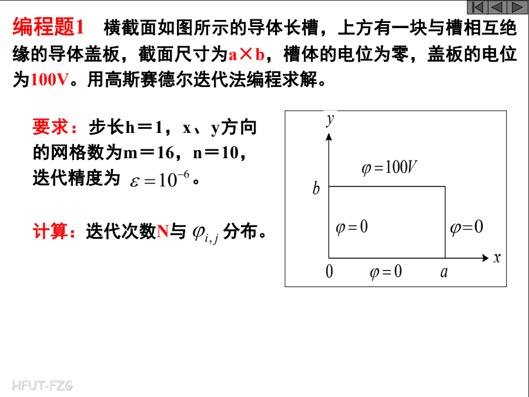
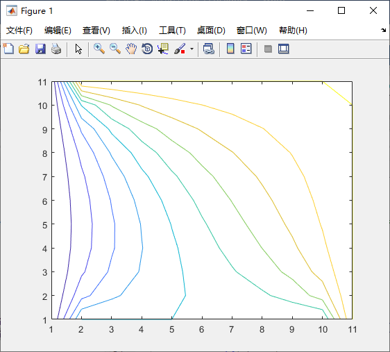

# 电磁场模拟

这是课程大作业的记录，matlab模拟电磁场。

## 1



MATLAB代码：

``` matlab
x=17; 
y=11; 
phi_1=ones(y,x); 
phi_1(y,:)=100*ones(1,x);        %y=b边界条件值
phi_1(1,:)=zeros(1,x);            %y=0边界条件值
for i=1:y
    phi_1(i,1)=0;                      % x=0边界条件值
    phi_1(i,x)=0;                     % x=a边界条件值
end
 
epsilon=1;
delta=0;            %设置误差和最大误差参量
phi_2=phi_1;
n=0;
while(epsilon>0.000001)        %由phi_1迭代算出phi_2，精度为10^-6
    n=n+1;                  %计算迭代次数
    epsilon=0;
    for i=2:y-1 
        for j=2:x-1 
            phi_2(i,j)=0.25*(phi_1(i,j+1)+phi_1(i+1,j)+phi_2(i-1,j)+phi_2(i,j-1));      %差分方程
            delta=abs(phi_2(i,j)-phi_1(i,j)); 
            if(delta>epsilon)
                epsilon=delta; 
            end
        end
    end
    phi_1=phi_2;
end
 
n
```

运行后可以得到迭代次数n = 222

利用MATLAB绘图中的contour对v2绘图


## 2


MATLAB代码：

``` matlab
x=11;
y=11;
phi_1=ones(y,x);
phi_1(y,:)=ones(1,x)*100;
phi_1(1,:)=ones(1,x)*50;
for i=1:y
    phi_1(i,1)=0;          
    phi_1(i,x)=100;        
end
 
p = 10;
alpha=2/(1 + sin(pi/p));            %加速收敛因子
epsilon=1;
delta=0;                            %误差和最大误差参量
phi_2=phi_1;
n=0;
while(epsilon>0.000001)
    n=n + 1;
    epsilon=0;
    for i=2:y-1
        for j=2:x-1
            phi_2(i,j)=phi_1(i,j)+(phi_1(i,j+1)+phi_1(i+1,j)+phi_2(i-1,j)+phi_2(i,j-1)-4*phi_1(i,j))*alpha/4;                %超松弛差分方程
            delta=abs(phi_2(i,j)-phi_1(i,j));
            if(delta>epsilon)
                epsilon =delta;
            end
        end
    end
    phi_1=phi_2;
end
 
n
```

运行后可以得到迭代次数 n = 38

利用MATLAB绘图中的contour对v2绘图


