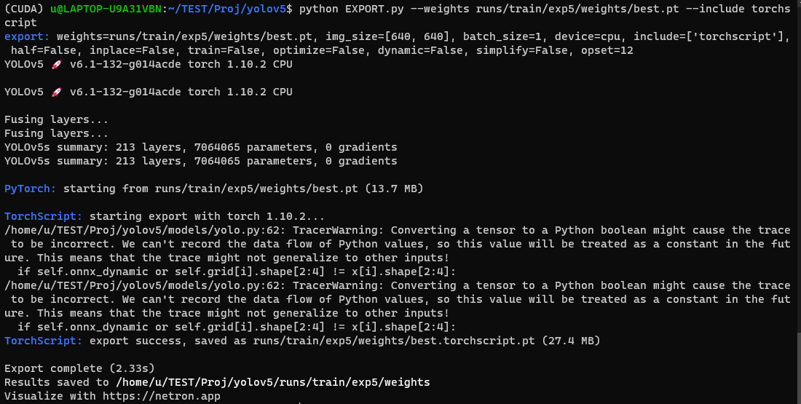

# 目标检测

[YOLOv5 Documentation](https://docs.ultralytics.com/tutorials/train-custom-datasets/)

## 数据集

环境：
`Linux 5.4.72-microsoft-standard-WSL2 #1 SMP Wed Oct 28 23:40:43 UTC 2020 x86_64 x86_64 x86_64 GNU/Linux`
`conda 4.11.0`
`Python 3.9.12`
`https://github.com/ultralytics/yolov5`

数据集采用VOC2012，但是ultralytics的YOLO系列采用的是COCO数据集的标注方式，不能直接训练。

### 数据标注格式转换

> [将PASCAL VOC数据集格式转换为YOLOV5 所需的格式](https://blog.csdn.net/qq_42978939/article/details/114777276)

将VOC格式的XML文件转换为COCO的txt文件：

``` python
import os
import xml.etree.ElementTree as ET

classes = ["aeroplane", "bicycle", "bird", "boat", "bottle", "bus", "car", "cat", "chair", "cow", "diningtable", "dog",
           "horse", "motorbike", "person", "pottedplant", "sheep", "sofa", "train", "tvmonitor"]

# 将x1, y1, x2, y2转换成yolov5所需要的x, y, w, h格式
def xyxy2xywh(size, box):
    dw = 1. / size[0]
    dh = 1. / size[1]
    x = (box[0] + box[2]) / 2 * dw
    y = (box[1] + box[3]) / 2 * dh
    w = (box[2] - box[0]) * dw
    h = (box[3] - box[1]) * dh
    return (x, y, w, h)         # 返回的都是标准化后的值


def voc2yolo(path):
    # 可以打印看看该路径是否正确
    print(len(os.listdir(path)))
    # 遍历每一个xml文件
    for file in os.listdir(path):
        # xml文件的完整路径, 注意：因为是路径所以要确保准确，我是直接使用了字符串拼接, 为了保险可以用os.path.join(path, file)
        label_file = path + file
        # 最终要改成的txt格式文件,这里我是放在voc2007/labels/下面
        # 注意: labels文件夹必须存在，没有就先创建，不然会报错
        out_file = open(path.replace('Annotations', 'labels') + file.replace('xml', 'txt'), 'w')
        # print(label_file)

        # 开始解析xml文件
        tree = ET.parse(label_file)
        root = tree.getroot()
        size = root.find('size')            # 图片的shape值
        w = int(size.find('width').text)
        h = int(size.find('height').text)

        for obj in root.iter('object'):
            difficult = obj.find('difficult').text
            cls = obj.find('name').text
            if cls not in classes or int(difficult) == 1:
                continue
            # 将名称转换为id下标
            cls_id = classes.index(cls)
            # 获取整个bounding box框
            bndbox = obj.find('bndbox')
            # xml给出的是x1, y1, x2, y2
            box = [float(bndbox.find('xmin').text), float(bndbox.find('ymin').text), float(bndbox.find('xmax').text),
                float(bndbox.find('ymax').text)]

            # 将x1, y1, x2, y2转换成yolov5所需要的x_center, y_center, w, h格式
            bbox = xyxy2xywh((w, h), box)
            # 写入目标文件中，格式为 id x y w h
            out_file.write(str(cls_id) + " " + " ".join(str(x) for x in bbox) + '\n')

if __name__ == '__main__':
 # 这里要改成自己数据集路径的格式
    path = '/home/u/data/VOCdevkit/VOC2012/Annotations/'
    voc2yolo(path)


```

### 训练图片、标注目录变换

VOC数据集目录格式如下，其中图片文件全放在JPEGImages目录下，没有针对train/val分别存放。

```
VOC2012
    ├── Annotations  进行detection 任务时的 标签文件，xml文件形式
    ├── ImageSets  存放数据集的分割文件，比如train，val，test
    ├── JPEGImages  存放 .jpg格式的图片文件
    ├── SegmentationClass  存放 按照class 分割的图片
    └── SegmentationObject  存放 按照 object 分割的图片
```

而YOLO里默认的COCO数据集目录格式如下：

```
COCO
    ├── images  # 存放图片文件
    │     ├── train
    │     ├── trainval
    │     └── val
    └── labels  # 存放标注文件
          ├── train
          ├── trainval
          └── val

```

**注意：运行下方脚本前需要事先创建好相应COCO及其子目录**
**对应的路径也要根据自己设备进行适当修改**

- 变换图片目录

> [VOC/COCO/YOLO数据总结及转换](https://zhuanlan.zhihu.com/p/160103709)

```python
import xml.etree.ElementTree as ET
import os
import json
import shutil

def check_make_dir(path):
    if not os.path.exists(path):
        os.makedirs(path)

def make_coco_dir(root):
    check_make_dir(os.path.join(root, 'Annotations'))
    check_make_dir(os.path.join(root, 'Annotations_xml'))
    check_make_dir(os.path.join(root, 'Annotations_xml'))
    check_make_dir(os.path.join(root, 'Annotations_xml'))
    check_make_dir(os.path.join(root, 'Annotations_xml'))
    check_make_dir(os.path.join(root, 'Annotations_xml'))
    check_make_dir(os.path.join(root, 'xml_list'))
    check_make_dir(os.path.join(root, 'images'))
    # check_make_dir(os.path.join(root, 'VOC2007/Annotations'))

if __name__ == '__main__':
    # ROOT = "/PATH/TO/VOC2007/"
    ROOT = "/home/u/data/VOCdevkit/VOC2012"
    img_dir = os.path.join(ROOT, "JPEGImages")
    xml_dir = os.path.join(ROOT, "Annotations")
    division_dir = os.path.join(ROOT, "ImageSets/Main")
    #
    # target_dir = "/PATH/TO/COCO"
    target_dir = "/home/u/data/VOCdevkit/COCO"
    make_coco_dir(target_dir)
    # you should make those directions below in target_dir/images/
    # file_list = ['test.txt', 'trainval.txt', 'train.txt', 'val.txt']
    file_list = ['trainval.txt', 'train.txt', 'val.txt']
    # 'train.txt', 'val.txt'
    for file_name in file_list:
        path = os.path.join(division_dir, file_name)
    #     divide xml into different set: train, test, val
        file = open(path)
        for line in file.readlines():
            line = line[:-1]
            img_path = os.path.join(img_dir, line+'.jpg')
            target_path = os.path.join(target_dir, 'images', file_name[:-4], line+'.jpg')
            # shutil.copy(img_path, target_path)
            shutil.copy(os.path.join(xml_dir, line+'.xml'), os.path.join(target_dir, 'Annotations_xml', 'xml_' + file_name[:-4], line+'.xml'))
            # shutil.copy(os.path.join(xml_dir, line + '.xml'), os.path.join(target_dir, 'Annotations_xml', line+'.xml'))
```

- 变换标注目录

``` python
import shutil
import os

if __name__ == '__main__':
    ROOT = "/home/u/data/VOCdevkit/VOC2012"
    img_dir = os.path.join(ROOT, "JPEGImages")
    xml_dir = os.path.join(ROOT, "Annotations")
    label_dir = os.path.join(ROOT, "labels")
    division_dir = os.path.join(ROOT, "ImageSets/Main")
    #
    target_dir = "/home/u/data/VOCdevkit/COCO"
    # you should make those directions below in target_dir/images/
    # file_list = ['test.txt', 'trainval.txt', 'train.txt', 'val.txt']
    file_list = ['trainval.txt', 'train.txt', 'val.txt']
    for file_name in file_list:
        path = os.path.join(division_dir, file_name)
        file = open(path)
        for line in file.readlines():
            line = line[:-1]
            label_path = os.path.join(label_dir, line+'.txt')
            label_target_path = os.path.join(target_dir, 'labels', file_name[:-4], line+'.txt')
            shutil.copy(label_path, label_target_path)
```

### 创建此数据集对应的dataset.yaml

``` yaml
# Train/val/test sets as 1) dir: path/to/imgs, 2) file: path/to/imgs.txt, or 3) list: [path/to/imgs1, path/to/imgs2, ..]
path: ../datasets/VOC  # dataset root dir
train: images/train  # train images (relative to 'path') 128 images
val: images/val  # val images (relative to 'path') 128 images
test:  # test images (optional)

# Classes
nc: 20  # number of classes
names: ['aeroplane', 'bicycle', 'bird', 'boat', 'bottle', 'bus', 'car', 'cat', 'chair', 'cow', 'diningtable', 'dog',
        'horse', 'motorbike', 'person', 'pottedplant', 'sheep', 'sofa', 'train', 'tvmonitor']  # class names
```

## 模型转换

[android-demo-app/ObjectDetection](https://github.com/pytorch/android-demo-app/tree/master/ObjectDetection)

通过ultralytics/yolov5内的`export.py`脚本完成。

不过可能是因为ultralytics/yolov5的版本更新，目前的`export.py`已经与`android-demo-app/ObjectDetection`介绍中的`export.py`脚本不同了，没法按照README修改了。

不过我在github的[issues 5533](https://github.com/ultralytics/yolov5/issues/5533)中找到了*可能是*旧版`export.py`的相关代码：

``` python
# YOLOv5 🚀 by Ultralytics, GPL-3.0 license
"""
Export a PyTorch model to TorchScript, ONNX, CoreML formats

Usage:
    $ python path/to/export.py --weights yolov5s.pt --img 640 --batch 1
"""

import argparse
import sys
import time
from pathlib import Path

import torch
import torch.nn as nn
from torch.utils.mobile_optimizer import optimize_for_mobile

FILE = Path(__file__).absolute()
sys.path.append(FILE.parents[0].as_posix())  # add yolov5/ to path
sys.path.insert(0, './yolov5')
from models.common import Conv
from models.yolo import Detect
from models.experimental import attempt_load
from utils.activations import Hardswish, SiLU
from utils.general import colorstr, check_img_size, check_requirements, file_size, set_logging
from utils.torch_utils import select_device


def export_torchscript(model, img, file, optimize):
    # TorchScript model export
    prefix = colorstr('TorchScript:')
    try:
        print(f'\n{prefix} starting export with torch {torch.__version__}...')
        f = file.with_suffix('.torchscript.pt')
        ts = torch.jit.trace(model, img, strict=False)
        (optimize_for_mobile(ts) if optimize else ts).save(f)
        print(f'{prefix} export success, saved as {f} ({file_size(f):.1f} MB)')
        return ts
    except Exception as e:
        print(f'{prefix} export failure: {e}')


def export_onnx(model, img, file, opset, train, dynamic, simplify):
    # ONNX model export
    prefix = colorstr('ONNX:')
    try:
        check_requirements(('onnx', 'onnx-simplifier'))
        import onnx

        print(f'\n{prefix} starting export with onnx {onnx.__version__}...')
        f = file.with_suffix('.onnx')
        torch.onnx.export(model, img, f, verbose=False, opset_version=opset,
                          training=torch.onnx.TrainingMode.TRAINING if train else torch.onnx.TrainingMode.EVAL,
                          do_constant_folding=not train,
                          input_names=['images'],
                          output_names=['output'],
                          dynamic_axes={'images': {0: 'batch', 2: 'height', 3: 'width'},  # shape(1,3,640,640)
                                        'output': {0: 'batch', 1: 'anchors'}  # shape(1,25200,85)
                                        } if dynamic else None)

        # Checks
        model_onnx = onnx.load(f)  # load onnx model
        onnx.checker.check_model(model_onnx)  # check onnx model
        # print(onnx.helper.printable_graph(model_onnx.graph))  # print

        # Simplify
        if simplify:
            try:
                import onnxsim

                print(f'{prefix} simplifying with onnx-simplifier {onnxsim.__version__}...')
                model_onnx, check = onnxsim.simplify(
                    model_onnx,
                    dynamic_input_shape=dynamic,
                    input_shapes={'images': list(img.shape)} if dynamic else None)
                assert check, 'assert check failed'
                onnx.save(model_onnx, f)
            except Exception as e:
                print(f'{prefix} simplifier failure: {e}')
        print(f'{prefix} export success, saved as {f} ({file_size(f):.1f} MB)')
        print(f"{prefix} run --dynamic ONNX model inference with: 'python detect.py --weights {f}'")
    except Exception as e:
        print(f'{prefix} export failure: {e}')


def export_coreml(model, img, file):
    # CoreML model export
    prefix = colorstr('CoreML:')
    try:
        check_requirements(('coremltools',))
        import coremltools as ct

        print(f'\n{prefix} starting export with coremltools {ct.__version__}...')
        f = file.with_suffix('.mlmodel')
        model.train()  # CoreML exports should be placed in model.train() mode
        ts = torch.jit.trace(model, img, strict=False)  # TorchScript model
        model = ct.convert(ts, inputs=[ct.ImageType('image', shape=img.shape, scale=1 / 255.0, bias=[0, 0, 0])])
        model.save(f)
        print(f'{prefix} export success, saved as {f} ({file_size(f):.1f} MB)')
    except Exception as e:
        print(f'\n{prefix} export failure: {e}')


def run(weights='model.pt',  # weights path
        img_size=(640, 640),  # image (height, width)
        batch_size=1,  # batch size
        device='cpu',  # cuda device, i.e. 0 or 0,1,2,3 or cpu
        include=('torchscript', 'onnx', 'coreml'),  # include formats
        half=False,  # FP16 half-precision export
        inplace=True,  # set YOLOv5 Detect() inplace=True
        train=False,  # model.train() mode
        optimize=False,  # TorchScript: optimize for mobile
        dynamic=False,  # ONNX: dynamic axes
        simplify=False,  # ONNX: simplify model
        opset=10,  # ONNX: opset version
        ):
    t = time.time()
    include = [x.lower() for x in include]
    img_size *= 2 if len(img_size) == 1 else 1  # expand
    file = Path(weights)

    # Load PyTorch model
    device = select_device(device)
    assert not (device.type == 'cpu' and half), '--half only compatible with GPU export, i.e. use --device 0'
    model = attempt_load(weights, map_location=device)  # load FP32 model
    names = model.names

    # Input
    gs = int(max(model.stride))  # grid size (max stride)
    img_size = [check_img_size(x, gs) for x in img_size]  # verify img_size are gs-multiples
    img = torch.zeros(batch_size, 3, *img_size).to(device)  # image size(1,3,320,192) iDetection

    # Update model
    if half:
        img, model = img.half(), model.half()  # to FP16
    model.train() if train else model.eval()  # training mode = no Detect() layer grid construction
    for k, m in model.named_modules():
        if isinstance(m, Conv):  # assign export-friendly activations
            if isinstance(m.act, nn.Hardswish):
                m.act = Hardswish()
            elif isinstance(m.act, nn.SiLU):
                m.act = SiLU()
        elif isinstance(m, Detect):
            m.inplace = inplace
            m.onnx_dynamic = dynamic
            # m.forward = m.forward_export  # assign forward (optional)

    for _ in range(2):
        y = model(img)  # dry runs
    print(f"\n{colorstr('PyTorch:')} starting from {weights} ({file_size(weights):.1f} MB)")

    # Exports
    if 'torchscript' in include:
        export_torchscript(model, img, file, optimize)
    if 'onnx' in include:
        export_onnx(model, img, file, opset, train, dynamic, simplify)
    if 'coreml' in include:
        export_coreml(model, img, file)

    # Finish
    print(f'\nExport complete ({time.time() - t:.2f}s)'
          f"\nResults saved to {colorstr('bold', file.parent.resolve())}"
          f'\nVisualize with https://netron.app')


def parse_opt():
    parser = argparse.ArgumentParser()
    parser.add_argument('--weights', type=str, default='model.pt', help='weights path')
    parser.add_argument('--img-size', nargs='+', type=int, default=[640, 640], help='image (height, width)')
    parser.add_argument('--batch-size', type=int, default=1, help='batch size')
    parser.add_argument('--device', default='cpu', help='cuda device, i.e. 0 or 0,1,2,3 or cpu')
    parser.add_argument('--include', nargs='+', default=['torchscript', 'onnx', 'coreml'], help='include formats')
    parser.add_argument('--half', action='store_true', help='FP16 half-precision export')
    parser.add_argument('--inplace', action='store_true', help='set YOLOv5 Detect() inplace=True')
    parser.add_argument('--train', action='store_true', help='model.train() mode')
    parser.add_argument('--optimize', action='store_true', help='TorchScript: optimize for mobile')
    parser.add_argument('--dynamic', action='store_true', help='ONNX: dynamic axes')
    parser.add_argument('--simplify', action='store_true', help='ONNX: simplify model')
    parser.add_argument('--opset', type=int, default=12, help='ONNX: opset version')
    opt = parser.parse_args()
    return opt


def main(opt):
    set_logging()
    print(colorstr('export: ') + ', '.join(f'{k}={v}' for k, v in vars(opt).items()))
    run(**vars(opt))


if __name__ == "__main__":
    opt = parse_opt()
    main(opt)
```

这样，就只要根据[android-demo-app/ObjectDetection](https://github.com/pytorch/android-demo-app/tree/master/ObjectDetection)的README中写的：

> Edit export.py to make the following two changes:
>
> After f = file.with_suffix('.torchscript.pt'), add a line fl = file.with_suffix('.torchscript.ptl')
>
> After (optimize_for_mobile(ts) if optimize else ts).save(f), add (optimize_for_mobile(ts) if optimize else ts)._save_for_lite_interpreter(str(fl))

再将第116行代码`optimize=False,  # TorchScript: optimize for mobile`改为`optimize=True,  # TorchScript: optimize for mobile`

就能够正常地导出移动设备的进一步优化(Further optimization for mobile devices)的模型了。



打开`/home/u/TEST/Proj/yolov5/runs/train/exp5/weights`目录，就能找到我们需要的`best.torchscript.ptl`文件了。

## 修改Android项目以适配新模型

1. 更改ptl模型、类型文件

> change lines:
> `mModule = LiteModuleLoader.load(MainActivity.assetFilePath(getApplicationContext(), "yolov5s.torchscript.ptl"));`
> `BufferedReader br = new BufferedReader(new InputStreamReader(getAssets().open("classes.txt")));`
> to:
> `mModule = LiteModuleLoader.load(MainActivity.assetFilePath(getApplicationContext(), "best.torchscript.ptl"));`
> `BufferedReader br = new BufferedReader(new InputStreamReader(getAssets().open("aicook.txt")));`

这里，我们改为`best.torchscript.ptl`和`VOC.txt`。

2. 更改预处理中的类型个数

> Then in `PrePostProcessor.java`, change line `private static int mOutputColumn = 85;` to `private static int mOutputColumn = 35;`.

这里，我们改为`private static int mOutputColumn = 25; // left, top, right, bottom, score and 20 class probability`，VOC数据库20个类型+5

3. 更改实时检测中的模型文件

> In order to do live object detection with the new custom model, just open `ObjectDetectionActivity.java` and replace `yolov5s.torchscript.ptl` in `mModule = LiteModuleLoader.load(MainActivity.assetFilePath(getApplicationContext(), "yolov5s.torchscript.ptl"));` with `best.torchscript.ptl`.

|2022年4月14日|
|----:|
