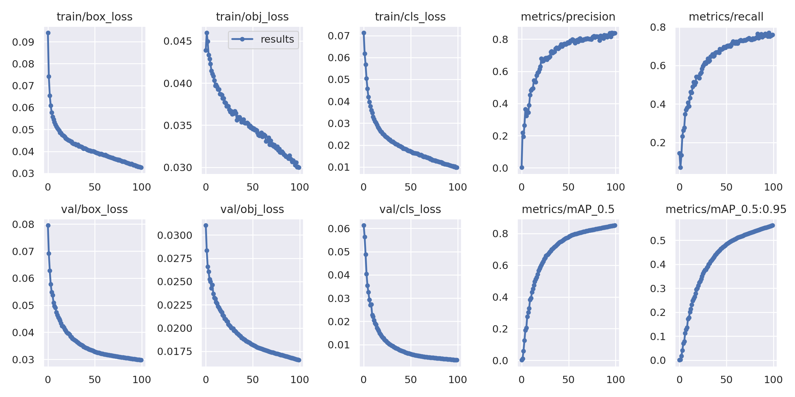
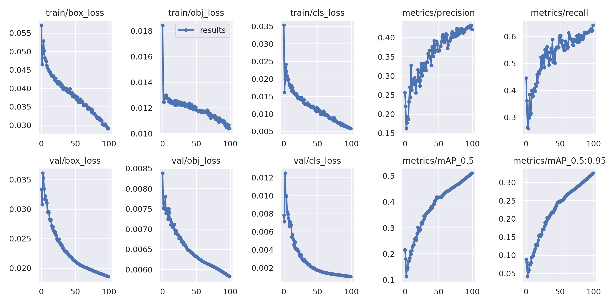
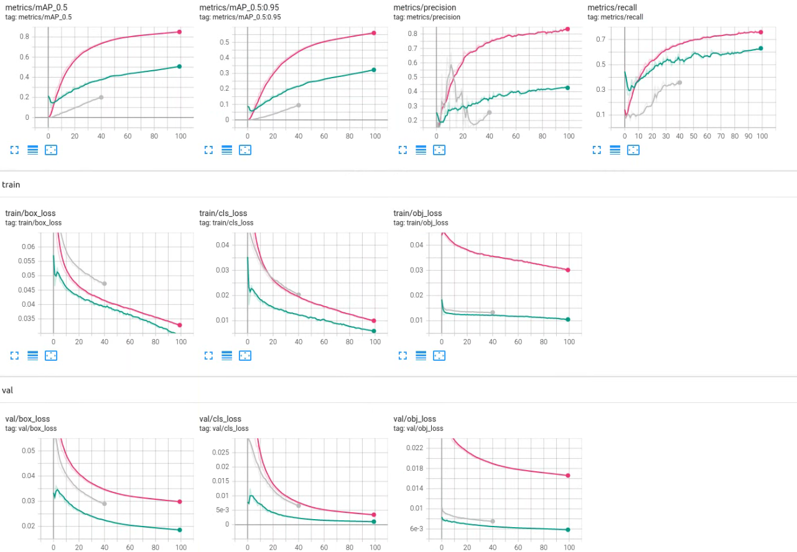

# 目标检测人行道定制

## 选取VOC的部分类进行训练

### 通过darknet的voc_lable.py选取部分类进行训练

``` python
import xml.etree.ElementTree as ET
import pickle
import os
from os import listdir, getcwd
from os.path import join

sets=[('2012', 'train'), ('2012', 'val'), ('2007', 'train'), ('2007', 'val'), ('2007', 'test')]

# classes = ["aeroplane", "bicycle", "bird", "boat", "bottle", "bus", "car", "cat", "chair", "cow", "diningtable", "dog", "horse", "motorbike", "person", "pottedplant", "sheep", "sofa", "train", "tvmonitor"]
classes = ["bicycle", "bus", "car", "cat", "chair", "diningtable", "dog", "motorbike", "person", "pottedplant"] # 10 classes

def convert(size, box):
    dw = 1./(size[0])
    dh = 1./(size[1])
    x = (box[0] + box[1])/2.0 - 1
    y = (box[2] + box[3])/2.0 - 1
    w = box[1] - box[0]
    h = box[3] - box[2]
    x = x*dw
    w = w*dw
    y = y*dh
    h = h*dh
    return (x,y,w,h)

def convert_annotation(year, image_id):
    in_file = open('VOCdevkit/VOC%s/Annotations/%s.xml'%(year, image_id))
    out_file = open('VOCdevkit/VOC%s/labels/%s.txt'%(year, image_id), 'w')
    tree=ET.parse(in_file)
    root = tree.getroot()
    size = root.find('size')
    w = int(size.find('width').text)
    h = int(size.find('height').text)

    for obj in root.iter('object'):
        difficult = obj.find('difficult').text
        cls = obj.find('name').text
        if cls not in classes or int(difficult)==1:
            continue
        cls_id = classes.index(cls)
        xmlbox = obj.find('bndbox')
        b = (float(xmlbox.find('xmin').text), float(xmlbox.find('xmax').text), float(xmlbox.find('ymin').text), float(xmlbox.find('ymax').text))
        bb = convert((w,h), b)
        out_file.write(str(cls_id) + " " + " ".join([str(a) for a in bb]) + '\n')

wd = getcwd()

for year, image_set in sets:
    if not os.path.exists('VOCdevkit/VOC%s/labels/'%(year)):
        os.makedirs('VOCdevkit/VOC%s/labels/'%(year))
    image_ids = open('VOCdevkit/VOC%s/ImageSets/Main/%s.txt'%(year, image_set)).read().strip().split()
    list_file = open('%s_%s.txt'%(year, image_set), 'w')
    for image_id in image_ids:
        list_file.write('%s/VOCdevkit/VOC%s/JPEGImages/%s.jpg\n'%(wd, year, image_id))
        convert_annotation(year, image_id)
    list_file.close()

os.system("cat 2007_train.txt 2007_val.txt 2012_train.txt 2012_val.txt > train.txt")
os.system("cat 2007_train.txt 2007_val.txt 2007_test.txt 2012_train.txt 2012_val.txt > train.all.txt")
```

`Custom.py`脚本：实现生成所需的的部分数据集的`label`文件

``` python
import xml.etree.ElementTree as ET
import os
import shutil

def check_make_dir(path):
    if not os.path.exists(path):
        os.makedirs(path)

def make_coco_dir(root):
    check_make_dir(os.path.join(root, 'Annotations'))
    check_make_dir(os.path.join(root, 'Annotations_xml'))
    check_make_dir(os.path.join(root, 'xml_list'))
    check_make_dir(os.path.join(root, 'images'))
    check_make_dir(os.path.join(root, 'labels'))
    # check_make_dir(os.path.join(root, 'VOC2007/Annotations'))

if __name__ == '__main__':
    # ROOT = "/PATH/TO/VOC2007/"
    ROOT = "/home/u/data/VOCdevkit/VOC2007"
    # img_dir = os.path.join(ROOT, "JPEGImages")
    # xml_dir = os.path.join(ROOT, "Annotations")
    label_dir = os.path.join(ROOT, "labels")
    division_dir = os.path.join(ROOT, "ImageSets/Main")
    #
    # target_dir = "/PATH/TO/COCO"
    target_dir = "/home/u/data/VOCdevkit/COCO"
    make_coco_dir(target_dir)
    # you should make those directions below in target_dir/images/
    file_list = ['test.txt', 'trainval.txt', 'train.txt', 'val.txt']
    # file_list = ['trainval.txt', 'train.txt', 'val.txt']
    # 'train.txt', 'val.txt'
    for file_name in file_list:
        path = os.path.join(division_dir, file_name)
    #     divide xml into different set: train, test, val
        file = open(path)
        for line in file.readlines():
            line = line[:-1]
            # img_path = os.path.join(img_dir, line+'.jpg')
            label_path = os.path.join(label_dir, line+'.txt')
            label_target_path = os.path.join(target_dir, 'labels-new', file_name[:-4], line+'.txt')
            shutil.copy(label_path, label_target_path)
            # target_path = os.path.join(target_dir, 'images', file_name[:-4], line+'.jpg')
            # shutil.copy(img_path, target_path)
            # shutil.copy(os.path.join(xml_dir, line+'.xml'), os.path.join(target_dir, 'Annotations_xml', 'xml_' + file_name[:-4], line+'.xml'))
            # shutil.copy(os.path.join(xml_dir, line + '.xml'), os.path.join(target_dir, 'Annotations_xml', line+'.xml'))
```

## TODO:迁移学习

### 其他公共数据集

- objects365数据集中的交通锥

`{'name': 'traffic cone', 'id': 93}  #锥形交通路标`

- 灌木、行道树 数据集

`祁连山天老池流域灌木截留及蒸腾数据集（2012）Dataset of shrub interception and transpiration in Tianlaochi watershed of Qilian Mountain (2012)`

- 路面障碍数据集

`基于 MobileNet 与 YOLOv3 的路面障碍检测轻量化算法①`

- 自动驾驶领域常用的数据集

### 自制数据集

- labelimg

`由于疫情影响暂时搁置，仅在校内获取部分数据`

### 迁移学习

[Transfer Learning with Frozen Layers](https://github.com/ultralytics/yolov5/issues/1314)

|2022年4月15日|
|----:|

## 定制VOC数据集进行训练

### exp8

这是在yolov5s上训练了100个epochs得到的模型，效果还算不错，但是部署到App上后并没有体现出与ultralytics仓库里的用coco训练出的模型有很大区别。



### exp10

这是用exp8训练得到的模型当预训练模型学习来的(想着能一次性得到更好的参数)，效果很差，想了想应该是最后的类别混淆了，模型结构不同，直接硬着头训练肯定没什么好结果，以后想拓展还得做更精细的调整。

[Transfer Learning with Frozen Layers](https://github.com/ultralytics/yolov5/issues/1314)



### exp11

training...



|2022年4月16日|
|----:|
